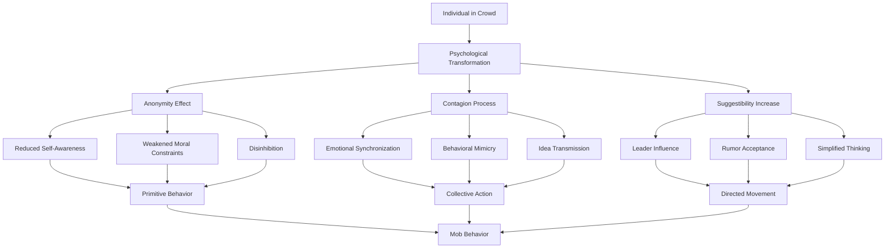
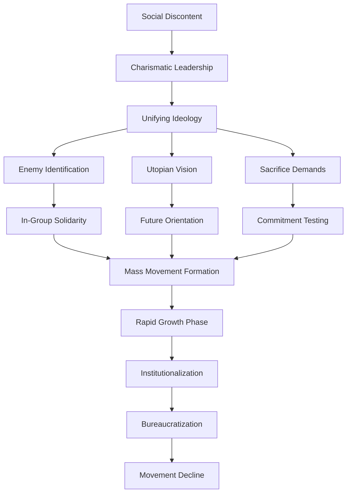
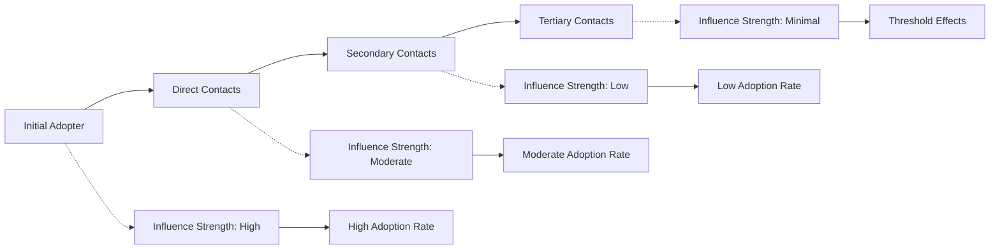
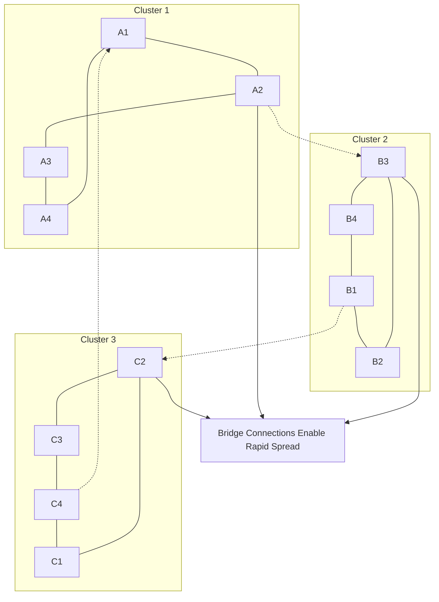
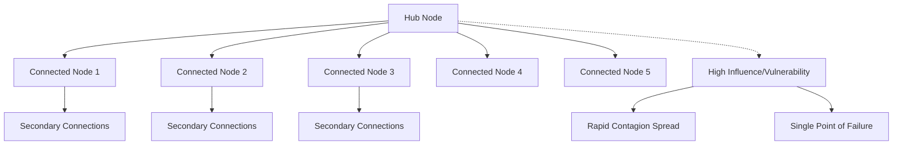
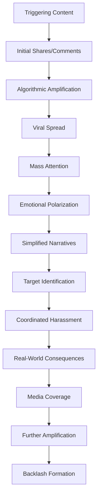
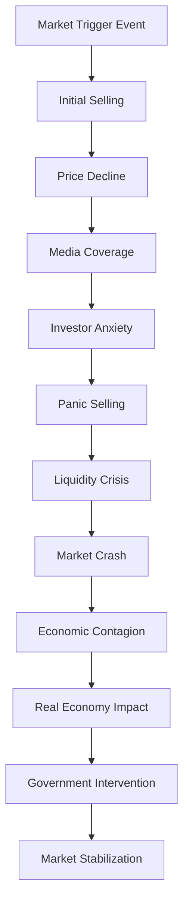
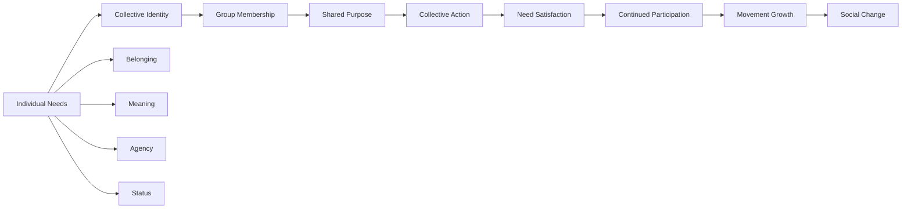

# Collective Behavior: Mob Psychology, Mass Movements, and Social Contagion

## Abstract

Collective behavior represents the emergence of coordinated action among large numbers of individuals who lack formal organizational structure. These phenomena—including crowds, mobs, mass movements, and social contagion—reveal how individual psychology aggregates into collective dynamics that often contradict both individual rationality and collective welfare. Understanding collective behavior is crucial for comprehending how societies can rapidly shift toward destructive patterns despite the apparent irrationality of such shifts.

## Introduction

Humans evolved as social creatures capable of rapid coordination in response to threats and opportunities. However, the same psychological mechanisms that enabled survival in small groups create systematic vulnerabilities when scaled to mass societies. Collective behavior emerges when normal social controls break down, allowing primitive psychological processes to dominate rational deliberation and creating the potential for both remarkable cooperation and devastating destruction.

## Theoretical Foundations of Collective Behavior

### Classical Crowd Psychology

Gustave Le Bon's foundational analysis identified key principles of crowd psychology that remain relevant for understanding how individual rationality breaks down in group settings. This flowchart illustrates the psychological transformation that occurs when individuals become part of crowds, revealing why intelligent, moral people can engage in destructive collective behavior.

This crowd psychology transformation reveals why civilized individuals can become part of destructive mobs despite their normal moral constraints and rational thinking. The anonymity effect occurs when individuals lose their sense of individual identity and accountability within the crowd, reducing self-awareness and weakening the moral constraints that normally govern behavior. As social psychologist Philip Zimbardo demonstrated in his Stanford Prison Experiment, anonymity can rapidly lead to disinhibition and primitive behavior.

The contagion process describes how emotions, behaviors, and ideas spread rapidly through crowds without conscious deliberation. Emotional synchronization occurs through automatic mimicry of facial expressions, body language, and vocalizations, creating shared emotional states that can quickly escalate. Behavioral mimicry leads individuals to automatically copy the actions of others around them, creating coordinated movement without central planning.

Increased suggestibility makes crowd members more susceptible to influence from leaders, rumors, and simplified ideas. The cognitive load of processing complex social information in crowd settings overwhelms individual reasoning capacity, leading people to accept simple explanations and follow authoritative voices without critical evaluation. This creates vulnerability to manipulation by demagogues and the rapid spread of false information.

The combination of these psychological processes transforms rational individuals into components of a collective entity that operates according to different psychological principles than individual behavior. The resulting mob behavior can be either constructive (as in collective celebrations or rescue efforts) or destructive (as in riots or lynchings), but in both cases represents a fundamental shift from individual to collective psychology.

### Modern Social Identity and Deindividuation Theory

Contemporary research refines classical theories by providing more nuanced understanding of when and why collective behavior becomes destructive versus constructive. This table reveals how different theoretical frameworks explain the variability in crowd behavior and the conditions that promote different outcomes.

| Theory | Key Mechanism | Prediction | Evidence |
|--------|---------------|------------|----------|
| **Social Identity Model** | Group identity activation | Behavior follows group norms | Crowds can be prosocial or antisocial |
| **Deindividuation Theory** | Reduced self-awareness | Increased impulsive behavior | Mixed evidence for antisocial behavior |
| **Social Contagion Theory** | Automatic mimicry | Rapid behavior spread | Strong evidence for emotional contagion |
| **Emergent Norm Theory** | Situational norm creation | Context-dependent behavior | Explains crowd variability |

This theoretical comparison reveals why modern understanding of collective behavior is more sophisticated than early "mob psychology" theories that assumed crowds were inherently destructive. The Social Identity Model, developed by researchers like Stephen Reicher, demonstrates that crowd behavior follows group norms rather than representing a breakdown of all social control. When group identity is activated, individuals don't become irrational but rather shift from personal identity to social identity, following the norms associated with their group membership.

Deindividuation Theory suggests that reduced self-awareness in crowds leads to increased impulsive behavior, but research evidence is mixed regarding whether this necessarily produces antisocial outcomes. As social psychologist Ed Diener's research shows, deindividuation can lead to either positive or negative behavior depending on the situational context and group norms. The key factor is not the loss of individual identity but rather which social identity becomes salient.

Social Contagion Theory provides strong evidence for how emotions and behaviors spread rapidly through crowds via automatic mimicry and emotional synchronization. This explains how crowd moods can shift quickly and how behaviors can spread without conscious decision-making. However, contagion processes are not inherently destructive—they can spread prosocial behaviors like helping and cooperation as easily as antisocial behaviors.

Emergent Norm Theory explains crowd variability by focusing on how situational norms develop within crowds based on the actions of influential members and environmental cues. This theory accounts for why similar crowds can behave very differently depending on contextual factors and early behavioral cues that establish the normative framework for collective action.

### Collective Behavior Typology

| Behavior Type | Organization Level | Duration | Predictability | Examples |
|---------------|-------------------|----------|----------------|----------|
| **Crowds** | Minimal | Hours to days | Low | Riots, celebrations |
| **Mass Movements** | Moderate | Months to years | Moderate | Political movements, religious revivals |
| **Social Movements** | High | Years to decades | High | Civil rights, environmental movements |
| **Panics** | None | Minutes to hours | Very low | Financial crashes, stampedes |

## Mob Psychology and Crowd Dynamics

### Crowd Formation Process

### Psychological Mechanisms in Crowds

| Mechanism | Process | Individual Effect | Crowd Effect |
|-----------|---------|------------------|--------------|
| **Emotional Contagion** | Automatic mimicry of emotions | Mood alignment | Emotional uniformity |
| **Attention Convergence** | Shared focus on events | Reduced self-awareness | Collective attention |
| **Behavioral Synchrony** | Coordinated movement | Loss of individual agency | Unified action |
| **Cognitive Simplification** | Reduced complex thinking | Black-and-white judgments | Simplified narratives |

### Crowd Types and Characteristics

| Crowd Type | Emotional Tone | Behavior Pattern | Typical Outcomes |
|------------|---------------|------------------|------------------|
| **Casual Crowd** | Neutral | Minimal interaction | Peaceful dispersal |
| **Conventional Crowd** | Positive | Structured behavior | Orderly conclusion |
| **Expressive Crowd** | Intense positive | Emotional release | Cathartic experience |
| **Acting Crowd** | Intense negative | Aggressive action | Violence, destruction |
| **Protest Crowd** | Focused anger | Directed action | Political change or repression |

## Mass Movements and Social Contagion

### Mass Movement Characteristics

Eric Hoffer identified common patterns across diverse mass movements:

### Historical Mass Movements Analysis

| Movement | Time Period | Trigger | Leadership | Ideology | Outcome |
|----------|-------------|---------|------------|----------|---------|
| **French Revolution** | 1789-1799 | Economic crisis | Multiple leaders | Liberty, equality | Political transformation |
| **Nazi Movement** | 1920s-1940s | National humiliation | Hitler | Racial superiority | Genocide, war |
| **Communist Revolution** | 1917-1991 | Class oppression | Lenin, others | Proletarian dictatorship | Authoritarian states |
| **Islamic Fundamentalism** | 1970s-present | Western influence | Various | Religious purity | Terrorism, theocracy |
| **Populist Movements** | 2010s-present | Economic inequality | Various | Anti-establishment | Political polarization |

### Social Contagion Mechanisms

Social contagion operates through multiple channels with varying speeds and accuracy:

| Contagion Type | Transmission Speed | Accuracy | Persistence | Examples |
|----------------|-------------------|----------|-------------|----------|
| **Emotional** | Seconds to minutes | High | Short | Panic, euphoria |
| **Behavioral** | Minutes to hours | Moderate | Moderate | Fashion, protests |
| **Ideological** | Days to months | Low | High | Political beliefs, conspiracy theories |
| **Technological** | Hours to days | Variable | Variable | Social media trends |

### Network Effects in Social Contagion

## Social Network Diagrams and Contagion Models

### Small World Network Contagion

### Scale-Free Network Vulnerabilities

### Threshold Models of Collective Behavior

Different individuals have different thresholds for joining collective action:

| Threshold Level | Population % | Behavior | Role in Movement |
|----------------|--------------|----------|------------------|
| **0-10%** | 5% | Join immediately | Initiators |
| **10-25%** | 15% | Join when few others do | Early adopters |
| **25-50%** | 30% | Join when minority does | Early majority |
| **50-75%** | 30% | Join when majority does | Late majority |
| **75%+** | 20% | Never join or join last | Laggards/resisters |

## Digital Age Collective Behavior

### Social Media and Viral Phenomena

Digital platforms fundamentally alter collective behavior dynamics:

| Platform Feature | Psychological Effect | Collective Impact | Societal Consequence |
|------------------|---------------------|------------------|-------------------|
| **Algorithmic Filtering** | Confirmation bias reinforcement | Echo chamber formation | Polarization |
| **Viral Mechanics** | Attention competition | Sensationalism rewards | Misinformation spread |
| **Anonymous Interaction** | Disinhibition | Aggressive behavior | Online harassment |
| **Real-time Feedback** | Dopamine reinforcement | Addictive engagement | Attention fragmentation |

### Online Mob Formation

### Digital Contagion Characteristics

| Digital Feature | Traditional Contagion | Digital Contagion | Implications |
|-----------------|----------------------|-------------------|--------------|
| **Speed** | Hours to days | Minutes to hours | Faster escalation |
| **Scale** | Local to regional | Global | Massive reach |
| **Persistence** | Temporary | Permanent records | Long-term consequences |
| **Verification** | Face-to-face | Anonymous/fake | Misinformation vulnerability |

## Case Studies of Collective Behavior

### Historical Crowd Events

| Event | Location/Date | Trigger | Crowd Size | Outcome | Lessons |
|-------|---------------|---------|------------|---------|---------|
| **French Revolution Crowds** | Paris, 1789 | Economic crisis | Thousands | Political revolution | Economic grievances mobilize masses |
| **Tulip Mania** | Netherlands, 1637 | Speculation | Entire society | Economic collapse | Collective irrationality in markets |
| **Salem Witch Trials** | Massachusetts, 1692 | Religious hysteria | Hundreds | 20 executions | Mass hysteria can overcome reason |
| **Kristallnacht** | Germany, 1938 | Anti-Semitic propaganda | Thousands | Systematic violence | State-sponsored mob violence |
| **Cultural Revolution** | China, 1966-1976 | Political mobilization | Millions | Social destruction | Ideological movements can destroy societies |

### Contemporary Mass Movements

| Movement | Period | Medium | Characteristics | Impact |
|----------|--------|--------|----------------|--------|
| **Arab Spring** | 2010-2012 | Social media | Rapid spread, youth-led | Political change, instability |
| **#MeToo** | 2017-present | Twitter | Personal testimony | Cultural shift, accountability |
| **QAnon** | 2017-present | Online forums | Conspiracy theories | Political polarization |
| **Climate Activism** | 2018-present | Global coordination | Youth leadership | Policy awareness |
| **Anti-Vaccine Movement** | 2020-present | Social media | Health misinformation | Public health crisis |

### Financial Market Panics

## Psychological Mechanisms in Collective Behavior

### Cognitive Mechanisms

| Mechanism | Individual Effect | Collective Effect | Behavioral Outcome |
|-----------|------------------|------------------|-------------------|
| **Cognitive Load Reduction** | Simplified thinking | Uniform responses | Stereotyped behavior |
| **Availability Heuristic** | Recent events seem likely | Overreaction to salient events | Disproportionate responses |
| **Confirmation Bias** | Seek confirming information | Echo chamber formation | Belief polarization |
| **Social Proof** | Follow others' behavior | Behavioral convergence | Conformity cascades |

### Emotional Mechanisms

| Emotion | Contagion Speed | Behavioral Effect | Collective Outcome |
|---------|----------------|------------------|-------------------|
| **Fear** | Very fast | Flight or fight | Panic, stampedes |
| **Anger** | Fast | Aggression | Violence, riots |
| **Joy** | Moderate | Celebration | Festivals, euphoria |
| **Disgust** | Slow | Avoidance | Moral exclusion |

### Motivational Mechanisms

## Implications for Human Dysfunction

### Individual Level Consequences

Participation in collective behavior can have lasting individual effects:

1. **Identity Fusion**: Personal identity becomes indistinguishable from group identity
2. **Moral Disengagement**: Participation in group violence damages individual moral reasoning
3. **Cognitive Simplification**: Exposure to simplified group narratives reduces complex thinking
4. **Emotional Dysregulation**: Intense collective experiences can destabilize emotional control

### Societal Level Consequences

Collective behavior creates systematic societal vulnerabilities:

1. **Democratic Fragility**: Mass movements can overwhelm democratic institutions
2. **Social Fragmentation**: Competing collective identities fragment social cohesion
3. **Economic Instability**: Financial panics create boom-bust cycles
4. **Cultural Destruction**: Revolutionary movements can destroy cultural heritage

### Institutional Consequences

Collective behavior challenges institutional stability:

1. **Legitimacy Crises**: Mass movements can delegitimize existing institutions
2. **Governance Failures**: Institutions struggle to respond to rapid collective mobilization
3. **Policy Volatility**: Collective pressure creates inconsistent policy-making
4. **Authoritarian Responses**: Institutions may become repressive to control collective behavior

## Theoretical Integration

### Complex Systems Theory and Collective Behavior

Collective behavior exhibits properties of complex adaptive systems:
- **Emergence**: Collective properties arise from individual interactions
- **Non-linearity**: Small triggers can create massive collective responses
- **Self-organization**: Collective patterns emerge without central coordination
- **Phase transitions**: Sudden shifts between different collective states

### Network Theory and Social Contagion

Network structure determines contagion patterns:
- **Small World Networks**: Enable rapid global spread through local clustering and long-range connections
- **Scale-Free Networks**: Create vulnerability to targeted disruption of hub nodes
- **Network Density**: Affects speed and completeness of contagion spread
- **Homophily**: Similar individuals cluster together, creating echo chambers

## Mitigation Strategies and Limitations

### Institutional Responses

| Strategy | Mechanism | Effectiveness | Limitations |
|----------|-----------|---------------|-------------|
| **Early Warning Systems** | Monitor social indicators | Moderate | False positives/negatives |
| **Counter-Messaging** | Provide alternative narratives | Low | Confirmation bias resistance |
| **Platform Regulation** | Control information spread | Moderate | Free speech concerns |
| **Community Engagement** | Build social capital | High | Long-term investment required |

### Individual Resilience

| Intervention | Target | Method | Sustainability |
|--------------|--------|--------|----------------|
| **Media Literacy** | Critical thinking | Education | Moderate |
| **Emotional Regulation** | Impulse control | Training | High |
| **Social Connections** | Belonging needs | Community building | High |
| **Perspective Taking** | Empathy | Exposure to diversity | Moderate |

### Fundamental Limitations

1. **Evolutionary Heritage**: Collective behavior served adaptive functions and resists elimination
2. **Psychological Needs**: Collective movements satisfy fundamental human needs for belonging and meaning
3. **Information Environment**: Modern media amplifies rather than reduces collective behavior triggers
4. **Democratic Tensions**: Controlling collective behavior conflicts with democratic freedoms

## Conclusion

Collective behavior represents a fundamental feature of human social psychology that creates both opportunities for positive social change and risks of destructive mass action. The same psychological mechanisms that enable rapid coordination in response to threats also create vulnerabilities to manipulation, misinformation, and collective irrationality.

Understanding collective behavior is essential for navigating the challenges of mass society in the digital age. Rather than attempting to eliminate collective behavior—which would be both impossible and undesirable—effective approaches must channel collective energies toward constructive rather than destructive ends while maintaining democratic freedoms and individual autonomy.

The digital age has fundamentally altered the dynamics of collective behavior, creating new possibilities for both positive coordination and destructive mobilization. Societies must develop new institutions and practices adapted to these realities while preserving the benefits of collective action for social progress and democratic governance.

## References

1. Le Bon, G. (1895). *The Crowd: A Study of the Popular Mind*. Macmillan.
2. Hoffer, E. (1951). *The True Believer: Thoughts on the Nature of Mass Movements*. Harper & Row.
3. Smelser, N. J. (1962). *Theory of Collective Behavior*. Free Press.
4. Reicher, S. D. (1987). Crowd behaviour as social action. *Rediscovering the Social Group*, 171-202.
5. Granovetter, M. (1978). Threshold models of collective behavior. *American Journal of Sociology*, 83(6), 1420-1443.
6. Centola, D. (2018). *How Behavior Spreads: The Science of Complex Contagions*. Princeton University Press.

---

*See also: [Social Psychology](social-psychology.md) | [Group Decision-Making Failures](group-decision-making-failures.md) | [Political Systems Failure](../societal/political-systems-failure.md)*