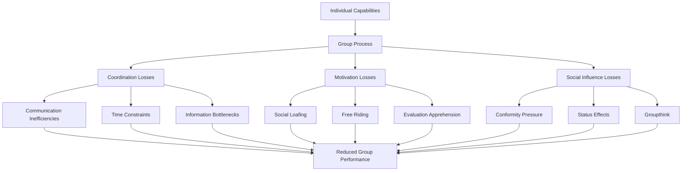
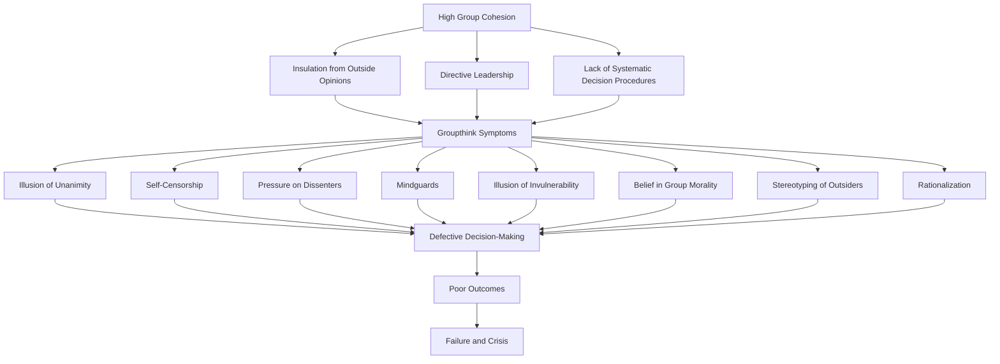
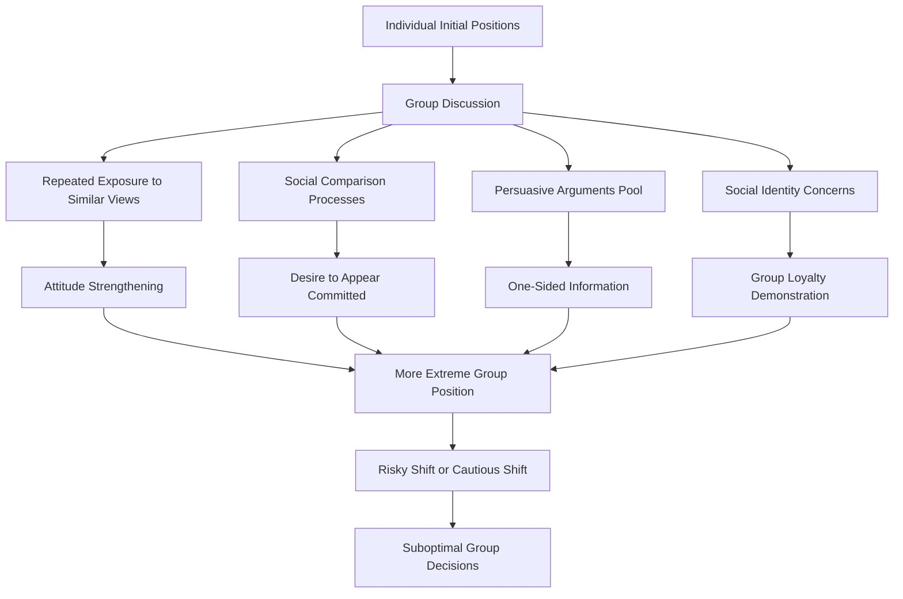
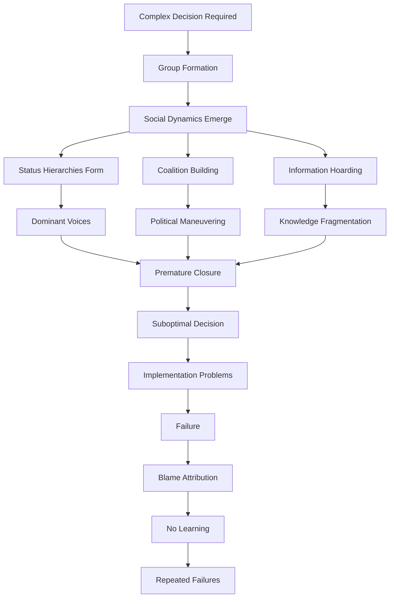
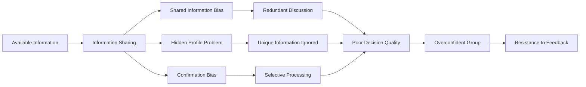
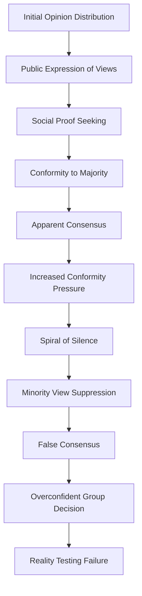
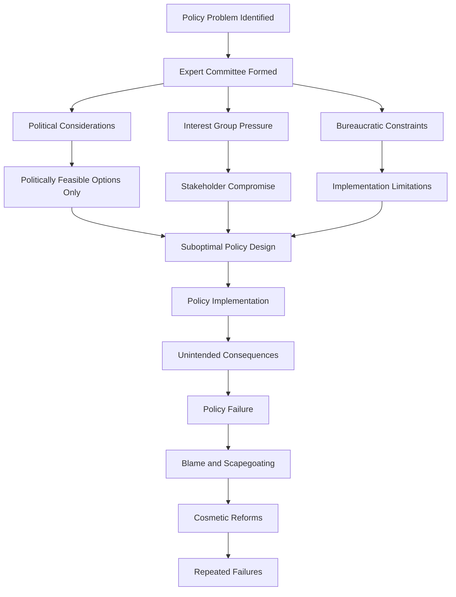
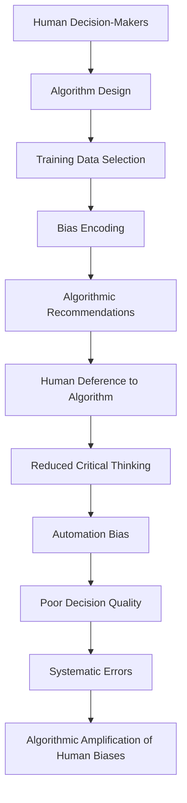

# Group Decision-Making Failures: Groupthink, Polarization, and Collective Irrationality

## Abstract

Group decision-making, despite being designed to leverage collective wisdom and reduce individual biases, systematically produces outcomes inferior to individual decision-making across numerous domains. Groupthink, polarization, and collective irrationality emerge from the interaction of individual cognitive biases with social psychological processes, creating predictable patterns of failure that have contributed to some of history's most catastrophic decisions.

## Introduction

The assumption that groups make better decisions than individuals underlies democratic governance, corporate boards, expert committees, and countless other institutional arrangements. However, extensive research reveals that groups often make worse decisions than their individual members would make alone. Understanding these systematic failures is crucial for designing better decision-making processes and recognizing when group decisions are likely to fail.

## Theoretical Foundations of Group Decision-Making Failure

### Individual vs. Group Decision-Making Performance

Contrary to popular belief that "two heads are better than one," research consistently demonstrates that groups often make worse decisions than individuals across many domains. This table reveals the systematic patterns of when groups help or hinder decision-making quality, challenging assumptions about collective wisdom.

| Decision Type | Individual Performance | Group Performance | Performance Gap | Explanation |
|---------------|----------------------|-------------------|-----------------|-------------|
| **Intellective Tasks** | Moderate | High | Groups better | Correct answers verifiable |
| **Judgmental Tasks** | Moderate | Low | Individuals better | No verifiable correct answer |
| **Creative Tasks** | High | Low | Individuals better | Social inhibition of creativity |
| **Risk Assessment** | Moderate | Extreme | Groups worse | Polarization effects |

**Intellective tasks** have demonstrably correct answers that can be verified through logic or evidence. Groups perform better because members can check each other's work, catch errors, and combine different knowledge bases. Mathematical problems, factual questions, and technical troubleshooting benefit from group input.

**Judgmental tasks** lack objectively correct answers and depend on values, preferences, or subjective assessments. Groups perform worse because social dynamics interfere with individual judgment. Members conform to perceived group opinion, suppress dissenting views, and engage in political maneuvering rather than honest evaluation.

**Creative tasks** require novel thinking and original ideas. Individuals consistently outperform groups because social presence inhibits creative expression. People self-censor unusual ideas, conform to conventional thinking, and experience evaluation apprehension that reduces creative risk-taking.

**Risk assessment** shows groups making more extreme decisions than individuals would make alone. This occurs through polarization effects where group discussion amplifies initial tendencies, leading to either excessive risk-taking or extreme caution depending on the group's initial inclination.

These patterns explain why brainstorming sessions often produce fewer and lower-quality ideas than individual ideation, why committees make more extreme decisions than their individual members would prefer, and why expert panels sometimes reach conclusions that none of the experts would endorse individually.

### Process Losses in Group Decision-Making

This diagram illustrates how individual capabilities are systematically degraded through group processes, explaining why groups often perform below the sum of their individual members' abilities. Understanding these process losses is crucial for recognizing when group decision-making is likely to fail.

**Coordination losses** occur because group members must spend time and energy coordinating their efforts rather than focusing on the task. **Communication inefficiencies** arise as information must be transmitted between members, creating opportunities for misunderstanding and delay. **Time constraints** mean that groups often cannot fully utilize all members' capabilities due to meeting limitations. **Information bottlenecks** develop when critical knowledge is concentrated in one person who becomes a limiting factor.

**Motivation losses** reflect reduced individual effort in group settings. **Social loafing** occurs when individuals reduce effort because their contribution is less identifiable in a group context. **Free riding** involves some members contributing less while benefiting from others' work. **Evaluation apprehension** can either increase or decrease performance, as some members become anxious about being judged while others reduce effort when they feel their contribution won't be noticed.

**Social influence losses** represent the most psychologically complex category. **Conformity pressure** causes members to suppress dissenting opinions and align with perceived group consensus. **Status effects** mean that high-status members have disproportionate influence regardless of expertise, while low-status members' valuable contributions may be ignored. **Groupthink** represents the extreme case where group cohesion becomes more important than decision quality.

These process losses explain why groups often fail to achieve their theoretical potential and why adding more people to a decision-making group can actually reduce rather than improve performance.

### Social Decision Schemes

How groups combine individual preferences affects decision quality:

| Decision Rule | Mechanism | Advantages | Disadvantages | Typical Outcomes |
|---------------|-----------|------------|---------------|------------------|
| **Majority Rule** | Most votes win | Democratic, efficient | Minority exclusion | Moderate positions |
| **Consensus** | Everyone agrees | Inclusive, commitment | Time-consuming | Lowest common denominator |
| **Plurality** | Largest faction wins | Handles multiple options | May not represent majority | Extreme positions |
| **Unanimity** | Everyone must agree | High commitment | Veto power | Status quo bias |

## Groupthink: The Illusion of Unanimity

### Irving Janis's Groupthink Model

Groupthink occurs when group cohesion becomes more important than realistic appraisal:

### Groupthink Symptoms and Manifestations

| Symptom | Manifestation | Decision Impact | Real-World Example |
|---------|---------------|-----------------|-------------------|
| **Illusion of Unanimity** | Silence interpreted as agreement | Suppress dissenting views | Bay of Pigs planning |
| **Self-Censorship** | Members withhold doubts | Critical information lost | Challenger disaster |
| **Pressure on Dissenters** | Conformity enforcement | Eliminate alternative perspectives | Vietnam War escalation |
| **Mindguards** | Filter contradictory information | Maintain group consensus | WMD intelligence |
| **Invulnerability Illusion** | Overestimate group capabilities | Excessive risk-taking | Financial crisis decisions |
| **Moral Superiority** | Believe group is inherently ethical | Ignore ethical concerns | Corporate scandals |
| **Enemy Stereotyping** | Oversimplify opposition | Underestimate threats | Military planning failures |
| **Rationalization** | Dismiss warnings | Ignore negative feedback | Pandemic response failures |

### Historical Cases of Groupthink

| Decision | Group | Year | Groupthink Symptoms | Outcome | Lessons |
|----------|-------|------|-------------------|---------|---------|
| **Bay of Pigs Invasion** | Kennedy Administration | 1961 | Illusion of unanimity, stereotyping | Military disaster | Need for devil's advocate |
| **Pearl Harbor** | Military Leadership | 1941 | Rationalization, invulnerability | Strategic surprise | Importance of outside information |
| **Challenger Disaster** | NASA Management | 1986 | Pressure on dissenters, mindguards | Seven deaths | Technical expertise vs. management pressure |
| **WMD Intelligence** | Intelligence Community | 2003 | Confirmation bias, groupthink | Iraq War | Dangers of politicized intelligence |
| **Financial Crisis** | Banking Leadership | 2008 | Invulnerability, rationalization | Economic collapse | Systemic risk from group delusions |

## Group Polarization: The Risky Shift Phenomenon

### Mechanisms of Group Polarization

Groups make more extreme decisions than individuals through several mechanisms:

### Polarization Direction Predictors

| Domain | Typical Shift Direction | Mechanism | Examples |
|--------|------------------------|-----------|----------|
| **Financial Risk** | Risky shift | Diffused responsibility | Investment bubbles |
| **Safety Decisions** | Cautious shift | Liability concerns | Over-regulation |
| **Moral Judgments** | Extreme shift | Social desirability | Punishment severity |
| **Political Views** | Polarization both ways | Ideological sorting | Political extremism |

### Polarization in Different Contexts

| Context | Polarization Effect | Measurement | Consequences |
|---------|-------------------|-------------|--------------|
| **Jury Deliberations** | Punishment severity increases | Sentence length | Harsher justice |
| **Investment Committees** | Risk tolerance increases | Portfolio allocation | Market bubbles |
| **Military Planning** | Aggressive options favored | Force deployment | Unnecessary conflicts |
| **Corporate Strategy** | Bold moves preferred | Resource commitment | Strategic failures |

## Decision-Making Process Diagrams

### Rational Decision-Making Model vs. Group Reality

```mermaid
flowchart TD
    subgraph "Ideal Process"
        A1[Problem Identification] --> A2[Information Gathering]
        A2 --> A3[Alternative Generation]
        A3 --> A4[Alternative Evaluation]
        A4 --> A5[Decision Selection]
        A5 --> A6[Implementation]
        A6 --> A7[Evaluation]
    end
    
    subgraph "Group Reality"
        B1[Problem Framing by Leader] --> B2[Selective Information Search]
        B2 --> B3[Limited Alternative Generation]
        B3 --> B4[Biased Evaluation]
        B4 --> B5[Premature Consensus]
        B5 --> B6[Poor Implementation]
        B6 --> B7[Rationalization of Failure]
    end
```

### Group Decision-Making Failure Cascade

### Information Processing Failures in Groups

## Collective Irrationality Mechanisms

### Aggregation of Individual Biases

Individual cognitive biases amplify in group settings:

| Individual Bias | Group Amplification | Mechanism | Collective Outcome |
|-----------------|-------------------|-----------|-------------------|
| **Confirmation Bias** | Echo chamber formation | Selective information sharing | Belief polarization |
| **Overconfidence** | Illusion of group superiority | Social validation | Excessive risk-taking |
| **Anchoring** | Group anchoring on initial proposals | First-mover advantage | Suboptimal solutions |
| **Availability Heuristic** | Shared salient examples | Common reference points | Overreaction to recent events |

### Social Proof and Conformity Cascades

### Collective Action Problems

Groups face systematic challenges in coordinating individual interests:

| Problem Type | Mechanism | Individual Incentive | Collective Outcome |
|--------------|-----------|---------------------|-------------------|
| **Free Riding** | Benefit without contributing | Minimize personal cost | Underprovision of effort |
| **Tragedy of Commons** | Overuse shared resources | Maximize personal benefit | Resource depletion |
| **Prisoner's Dilemma** | Defect while others cooperate | Avoid being exploited | Mutual defection |
| **Coordination Failure** | Multiple equilibria exist | Avoid coordination costs | Suboptimal equilibrium |

## Historical Examples of Disastrous Group Decisions

### Military and Strategic Failures

| Decision | Decision-Making Group | Year | Failure Mode | Consequences | Lessons |
|----------|----------------------|------|--------------|--------------|---------|
| **Maginot Line Strategy** | French Military Leadership | 1930s | Groupthink, last-war thinking | German breakthrough | Avoid fighting last war |
| **Operation Barbarossa** | Nazi High Command | 1941 | Overconfidence, wishful thinking | Two-front war | Realistic assessment crucial |
| **Bay of Pigs** | Kennedy Administration | 1961 | Groupthink, expert deference | Foreign policy disaster | Need for dissenting voices |
| **Vietnam Escalation** | Johnson Administration | 1960s | Escalation of commitment | Prolonged conflict | Sunk cost awareness |
| **Iraq WMD Decision** | Bush Administration | 2003 | Confirmation bias, groupthink | Costly war | Intelligence independence |

### Corporate and Financial Disasters

| Company/Event | Decision-Making Body | Failure Mode | Outcome | Systemic Impact |
|---------------|---------------------|--------------|---------|-----------------|
| **Enron** | Executive Team | Ethical blindness, groupthink | Bankruptcy | Accounting reform |
| **Lehman Brothers** | Board and Executives | Risk blindness, overconfidence | Financial collapse | Global recession |
| **Theranos** | Board of Directors | Deference to charismatic leader | Fraud exposure | Startup governance reform |
| **Wells Fargo** | Management Team | Pressure for results, ethical drift | Scandal and fines | Banking culture scrutiny |
| **Boeing 737 MAX** | Engineering and Management | Commercial pressure, groupthink | Two crashes, 346 deaths | Aviation safety overhaul |

### Public Policy Failures

## Modern Challenges: Digital Age Group Decision-Making

### Virtual Team Decision-Making

Digital communication creates new failure modes:

| Digital Factor | Impact on Decision-Making | Failure Mode | Mitigation Strategy |
|----------------|--------------------------|--------------|-------------------|
| **Reduced Social Cues** | Less emotional information | Misunderstanding | Video conferencing |
| **Asynchronous Communication** | Delayed feedback | Coordination problems | Structured processes |
| **Information Overload** | Too much data | Analysis paralysis | Information filtering |
| **Geographic Distribution** | Cultural differences | Value conflicts | Cultural training |

### Social Media and Crowd Wisdom

Digital platforms can both enhance and degrade collective decision-making:

| Platform Feature | Positive Effect | Negative Effect | Net Impact |
|------------------|----------------|-----------------|------------|
| **Aggregation** | Diverse perspectives | Echo chambers | Variable |
| **Real-time Feedback** | Rapid correction | Emotional contagion | Negative |
| **Transparency** | Accountability | Performance pressure | Mixed |
| **Scale** | Large sample size | Manipulation vulnerability | Variable |

### Algorithmic Decision-Making

AI systems introduce new forms of collective irrationality:

## Psychological and Social Mechanisms

### Status and Power Dynamics

Group hierarchies systematically distort decision-making:

| Status Level | Information Sharing | Influence on Decision | Risk Tolerance |
|--------------|-------------------|---------------------|----------------|
| **High Status** | Selective disclosure | Disproportionate influence | Risk-seeking |
| **Medium Status** | Strategic sharing | Moderate influence | Risk-neutral |
| **Low Status** | Reluctant sharing | Minimal influence | Risk-averse |

### Gender and Diversity Effects

Group composition affects decision-making quality:

| Group Composition | Decision Quality | Risk Tolerance | Confidence Level |
|------------------|------------------|----------------|------------------|
| **Homogeneous Male** | Moderate | High risk | Overconfident |
| **Homogeneous Female** | Moderate | Moderate risk | Appropriately confident |
| **Diverse Mixed** | High | Balanced risk | Well-calibrated |
| **Token Diversity** | Low | Variable | Underconfident minorities |

### Cultural Influences on Group Decision-Making

| Cultural Dimension | Decision Style | Failure Mode | Examples |
|-------------------|----------------|--------------|----------|
| **Individualistic** | Independent voices | Coordination failure | US corporate boards |
| **Collectivistic** | Consensus-seeking | Groupthink | Japanese corporate culture |
| **High Power Distance** | Hierarchical deference | Authority bias | Military organizations |
| **Low Power Distance** | Egalitarian discussion | Analysis paralysis | Scandinavian committees |

## Implications for Human Dysfunction

### Individual Level Impact

Participation in dysfunctional group decision-making damages individuals:

1. **Moral Disengagement**: Participation in poor group decisions compromises individual ethics
2. **Learned Helplessness**: Repeated exposure to group dysfunction reduces individual agency
3. **Cognitive Conformity**: Group pressure reduces individual critical thinking capacity
4. **Identity Confusion**: Conflicting group loyalties undermine personal values

### Organizational Level Impact

Group decision-making failures create systematic organizational problems:

1. **Strategic Drift**: Poor group decisions accumulate into strategic failure
2. **Innovation Suppression**: Group conformity prevents creative problem-solving
3. **Risk Mismanagement**: Group polarization creates excessive or insufficient risk-taking
4. **Talent Exodus**: Dysfunctional decision-making drives away high-quality personnel

### Societal Level Impact

Collective decision-making failures threaten democratic governance and social welfare:

1. **Democratic Legitimacy**: Poor group decisions undermine public trust in institutions
2. **Policy Failures**: Systematic group biases create ineffective public policies
3. **Economic Instability**: Financial group decisions create boom-bust cycles
4. **Social Fragmentation**: Polarized group decisions fragment social consensus

## Theoretical Integration

### Behavioral Economics and Group Decision-Making

Group decision-making amplifies individual behavioral biases:
- **Loss Aversion**: Groups show even stronger loss aversion than individuals
- **Framing Effects**: Group decisions are more susceptible to how options are presented
- **Temporal Discounting**: Groups discount future consequences more heavily than individuals
- **Probability Weighting**: Groups show more extreme probability distortions

### Social Psychology and Group Dynamics

Group decision-making failures reflect fundamental social psychological processes:
- **Social Identity Theory**: Group membership becomes more important than decision quality
- **Social Comparison Theory**: Individuals adjust positions to maintain group standing
- **Cognitive Dissonance Theory**: Groups rationalize poor decisions to maintain coherence
- **Attribution Theory**: Groups attribute failures to external factors

## Mitigation Strategies and Limitations

### Structural Interventions

| Intervention | Mechanism | Effectiveness | Implementation Challenges |
|--------------|-----------|---------------|--------------------------|
| **Devil's Advocate** | Institutionalize dissent | Moderate | May become ritualistic |
| **Red Team Analysis** | External critique | High | Requires resources and expertise |
| **Anonymous Input** | Reduce conformity pressure | Moderate | May reduce accountability |
| **Diverse Composition** | Multiple perspectives | High | Difficult to achieve and maintain |

### Process Interventions

| Technique | Target Problem | Method | Sustainability |
|-----------|----------------|--------|----------------|
| **Nominal Group Technique** | Groupthink | Structured individual input | High |
| **Delphi Method** | Expert bias | Anonymous iterative feedback | Moderate |
| **Dialectical Inquiry** | Confirmation bias | Structured debate | Low |
| **Scenario Planning** | Overconfidence | Multiple future scenarios | Moderate |

### Individual Training

| Training Focus | Skill Development | Transfer to Groups | Long-term Impact |
|----------------|-------------------|-------------------|------------------|
| **Critical Thinking** | Logical reasoning | Moderate | Moderate |
| **Perspective-Taking** | Empathy and understanding | High | High |
| **Bias Awareness** | Metacognitive skills | Low | Low |
| **Communication** | Information sharing | High | High |

### Fundamental Limitations

1. **Social Nature**: Humans are fundamentally social and susceptible to group influence
2. **Cognitive Constraints**: Individual limitations aggregate rather than cancel in groups
3. **Motivational Conflicts**: Individual and group interests often diverge
4. **Institutional Inertia**: Organizations resist changes to decision-making processes

## Conclusion

Group decision-making failures represent a systematic and predictable feature of human collective action rather than occasional aberrations. The same psychological and social processes that enable human cooperation also create systematic vulnerabilities to groupthink, polarization, and collective irrationality.

Understanding these failures is essential for designing better decision-making processes and institutions. Rather than assuming that groups naturally make better decisions than individuals, effective approaches must account for the systematic ways that group processes can degrade decision quality.

The digital age has created new opportunities for both improving and degrading collective decision-making. While technology can help aggregate diverse perspectives and reduce some biases, it can also amplify others and create new forms of collective irrationality.

Effective solutions must work with rather than against fundamental features of human group psychology, designing institutions and processes that channel group dynamics toward better rather than worse decisions while preserving the benefits of collective deliberation and democratic participation.

## References

1. Janis, I. L. (1972). *Victims of Groupthink: A Psychological Study of Foreign-Policy Decisions and Fiascoes*. Houghton Mifflin.
2. Sunstein, C. R. (2009). *Going to Extremes: How Like Minds Unite and Divide*. Oxford University Press.
3. Kerr, N. L., & Tindale, R. S. (2004). Group performance and decision making. *Annual Review of Psychology*, 55, 623-655.
4. Stasser, G., & Titus, W. (1985). Pooling of unshared information in group decision making: Biased information sampling during discussion. *Journal of Personality and Social Psychology*, 48(6), 1467-1478.
5. Tetlock, P. E. (2005). *Expert Political Judgment: How Good Is It? How Can We Know?*. Princeton University Press.
6. Surowiecki, J. (2004). *The Wisdom of Crowds*. Doubleday.

---

*See also: [Social Psychology](social-psychology.md) | [Organizational Pathology](organizational-pathology.md) | [Collective Behavior](collective-behavior.md)*