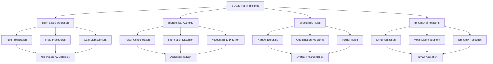
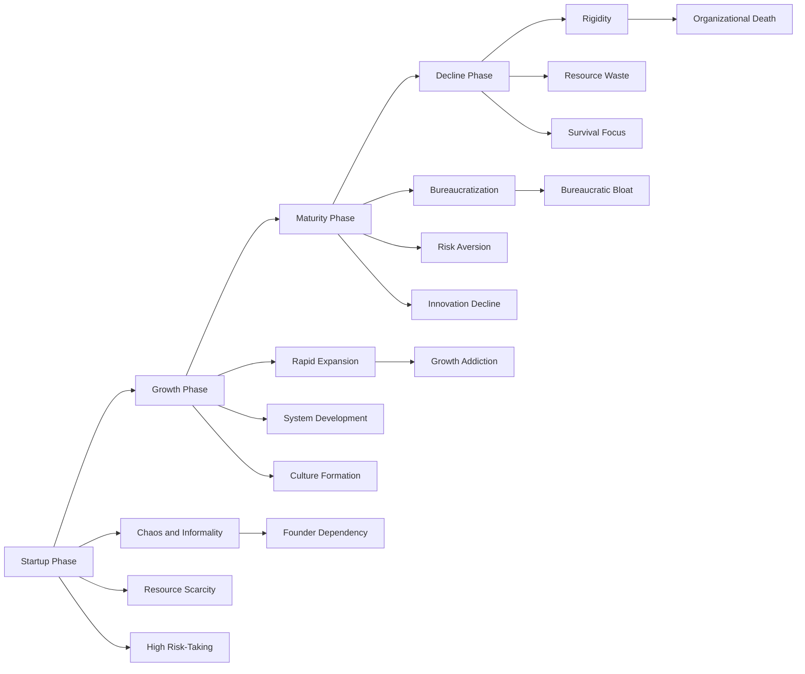
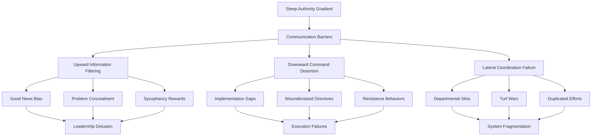
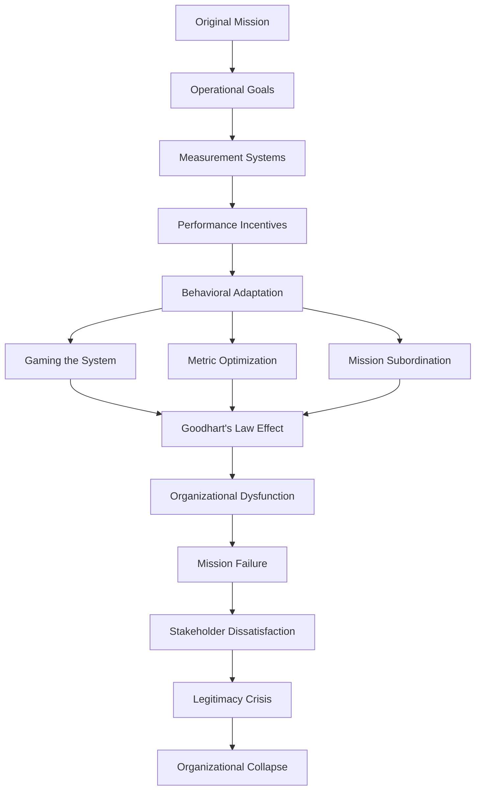
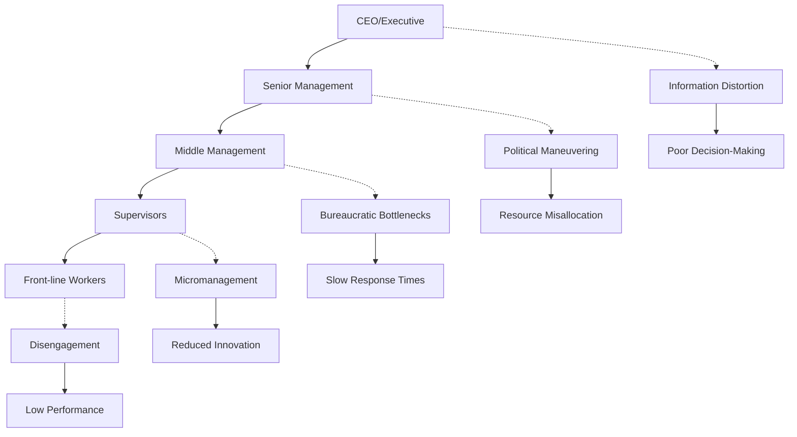
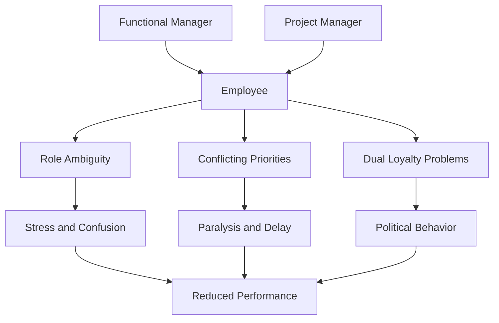
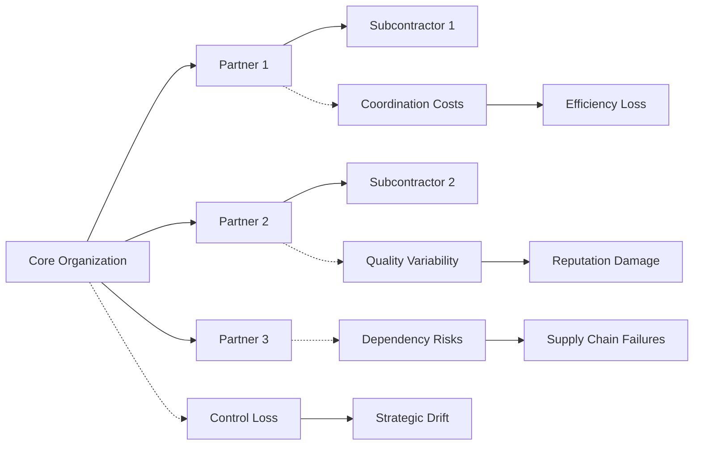
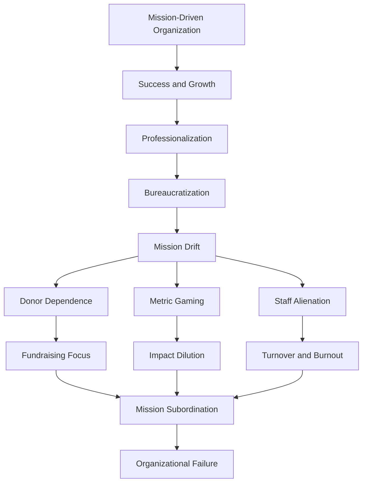
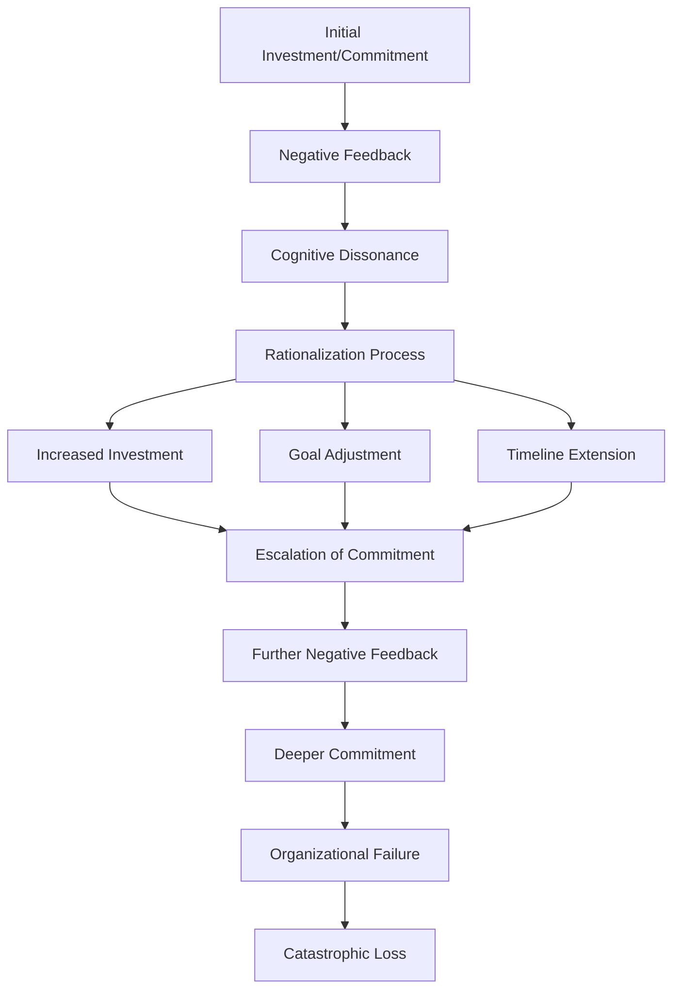
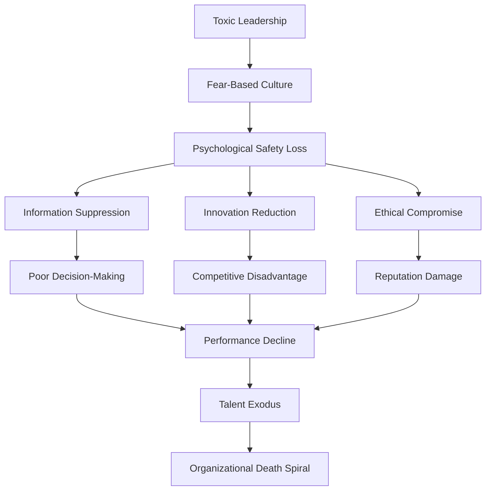

# Organizational Pathology: Institutional Dysfunction and Bureaucratic Failures

## Abstract

Organizations, despite being designed to coordinate human effort efficiently, systematically develop pathological characteristics that undermine their stated purposes and create widespread dysfunction. Bureaucratic structures, hierarchical power dynamics, and institutional incentives interact with human psychological limitations to produce predictable patterns of organizational failure that persist across cultures, time periods, and organizational types.

## Introduction

Human organizations represent attempts to transcend individual limitations through coordinated collective action. However, the same psychological and social processes that create individual and group dysfunction manifest within organizational contexts, often amplified by formal structures, power hierarchies, and institutional incentives. Understanding organizational pathology is crucial for comprehending how well-intentioned institutions become sources of human suffering and societal dysfunction.

## Fundamental Organizational Pathologies

### Bureaucratic Dysfunction Mechanisms

Max Weber's analysis of bureaucracy identified it as the most efficient form of organization, yet his "ideal type" contains inherent contradictions that generate systematic failures. This diagram reveals how bureaucratic principles, designed to create rational administration, inevitably produce irrational outcomes through predictable psychological and social processes.

**Rule-based operation**, intended to ensure consistency and fairness, leads to **rule proliferation** as organizations create new rules to handle exceptions, **rigid procedures** that cannot adapt to changing circumstances, and **goal displacement** where following rules becomes more important than achieving organizational purposes.

**Hierarchical authority**, designed to coordinate action, creates **power concentration** at the top, **information distortion** as messages travel up and down the hierarchy, and **accountability diffusion** where responsibility becomes unclear across multiple levels.

**Specialized roles**, meant to develop expertise, result in **narrow expertise** that misses broader perspectives, **coordination problems** between departments, and **tunnel vision** that prevents holistic thinking.

**Impersonal relations**, intended to prevent favoritism, lead to **dehumanization** of both employees and clients, **moral disengagement** from the human consequences of decisions, and **empathy reduction** that enables callous treatment of people.

These dysfunctions aggregate into four major pathological outcomes: **organizational sclerosis** (inability to adapt), **authoritarian drift** (concentration of power), **system fragmentation** (loss of coordination), and **human alienation** (loss of meaning and connection).

### Iron Law of Oligarchy

Robert Michels' "Iron Law of Oligarchy" describes the inevitable concentration of power in organizations, regardless of their democratic intentions. This table demonstrates how even the most egalitarian organizations evolve toward oligarchic control through predictable stages, revealing fundamental tensions between organizational efficiency and democratic participation.

| Organizational Stage | Power Distribution | Decision-Making | Member Influence | Pathological Outcomes |
|---------------------|-------------------|-----------------|------------------|---------------------|
| **Formation** | Distributed leadership | Collective decisions | High participation | Democratic idealism |
| **Growth** | Emerging hierarchy | Mixed processes | Moderate participation | Efficiency pressures |
| **Institutionalization** | Concentrated leadership | Elite decisions | Low participation | Oligarchic control |
| **Ossification** | Entrenched oligarchy | Autocratic decisions | Minimal participation | Self-serving leadership |

The **Formation** stage represents the idealistic phase where power is distributed among committed members who make collective decisions with high participation. However, this democratic idealism becomes impractical as organizations grow.

During **Growth**, efficiency pressures create emerging hierarchies as some members take on specialized roles. Decision-making becomes mixed between collective and hierarchical processes, with moderate member participation as the organization becomes too large for everyone to be involved in every decision.

**Institutionalization** sees power concentrated in a leadership elite who make most decisions with minimal input from ordinary members. This oligarchic control emerges not from malicious intent but from practical necessities of coordination and expertise.

**Ossification** represents the final stage where the oligarchy becomes entrenched and self-serving. Leaders make autocratic decisions primarily to maintain their own power, with minimal member participation. The organization exists more to serve its leadership than its original mission.

This progression explains why labor unions, political parties, and social movements often become dominated by professional leaders who are more concerned with organizational maintenance than revolutionary change, as Michels observed in early 20th-century socialist parties.

### Organizational Life Cycle Pathologies

## Hierarchical Power Dynamics and Corruption

### Power Corruption Mechanisms

Lord Acton's observation that "power corrupts" has systematic psychological foundations:

| Power Level | Psychological Changes | Behavioral Manifestations | Organizational Impact |
|-------------|----------------------|---------------------------|---------------------|
| **Low Power** | Increased empathy, caution | Rule-following, deference | Compliance culture |
| **Moderate Power** | Mixed effects | Strategic behavior | Political maneuvering |
| **High Power** | Reduced empathy, overconfidence | Risk-taking, exploitation | Authoritarian leadership |
| **Absolute Power** | Narcissism, paranoia | Arbitrary decisions, purges | Organizational tyranny |

### Authority Gradient Problems

Steep hierarchies create systematic communication and decision-making failures:

### Organizational Politics and Rent-Seeking

Internal competition for resources creates systematic inefficiencies:

| Political Behavior | Mechanism | Resource Impact | Performance Effect |
|-------------------|-----------|-----------------|-------------------|
| **Empire Building** | Maximize departmental size | Resource hoarding | Organizational bloat |
| **Turf Protection** | Defend jurisdictional boundaries | Coordination costs | Reduced efficiency |
| **Credit Claiming** | Associate with successes | Misallocated recognition | Demotivated performers |
| **Blame Avoidance** | Deflect responsibility for failures | Risk aversion | Innovation suppression |

## Institutional Failure Modes

### Goal Displacement and Mission Drift

Organizations systematically lose focus on their original purposes:

### Regulatory Capture and Agency Problems

Organizations designed to serve public interests become captured by private interests:

| Capture Mechanism | Process | Stakeholder Impact | Systemic Consequences |
|------------------|---------|-------------------|----------------------|
| **Revolving Door** | Personnel exchange between regulator and industry | Industry influence over regulation | Weakened oversight |
| **Information Asymmetry** | Industry controls technical knowledge | Regulator dependence on industry | Biased policy-making |
| **Resource Disparity** | Industry outspends public interest groups | Unequal access to decision-makers | Tilted playing field |
| **Cultural Alignment** | Shared professional backgrounds | Cognitive capture of regulators | Ideological convergence |

### Institutional Isomorphism

Organizations become similar through mimetic, coercive, and normative pressures:

| Isomorphism Type | Mechanism | Driver | Outcome |
|-----------------|-----------|--------|---------|
| **Mimetic** | Copy successful organizations | Uncertainty reduction | Homogenization |
| **Coercive** | Comply with external pressures | Legal/political requirements | Standardization |
| **Normative** | Professional standards adoption | Legitimacy seeking | Professionalization |

## Organizational Structure Diagrams and Failure Modes

### Traditional Hierarchical Structure Failures

### Matrix Organization Pathologies

### Network Organization Vulnerabilities

## Case Studies of Organizational Collapse

### Corporate Failures

| Organization | Failure Type | Primary Pathology | Contributing Factors | Lessons |
|--------------|-------------|-------------------|---------------------|---------|
| **Enron** | Accounting fraud | Ethical collapse | Perverse incentives, weak oversight | Culture matters more than controls |
| **Lehman Brothers** | Financial collapse | Risk management failure | Excessive leverage, groupthink | Systemic risk from individual failures |
| **Theranos** | Technology fraud | Leadership pathology | Charismatic authority, secrecy culture | Transparency essential for innovation |
| **Wells Fargo** | Sales scandal | Incentive misalignment | Aggressive targets, punishment culture | Metrics can drive unethical behavior |

### Government Agency Failures

| Agency | Failure Event | Organizational Pathology | Systemic Issues | Reform Attempts |
|--------|---------------|-------------------------|-----------------|-----------------|
| **NASA** | Challenger disaster | Groupthink, risk normalization | Political pressure, communication failures | Safety culture changes |
| **FBI** | 9/11 intelligence failure | Information silos, turf protection | Inter-agency competition | Intelligence reform |
| **CDC** | COVID-19 response | Bureaucratic rigidity | Outdated procedures, risk aversion | Emergency authority expansion |
| **VA** | Healthcare scandal | Accountability deficit | Performance gaming, cover-ups | Leadership changes |

### Non-Profit Organization Failures

## Psychological Mechanisms in Organizational Dysfunction

### Social Loafing and Diffusion of Responsibility

Individual effort decreases as group size increases:

| Group Size | Individual Effort | Mechanism | Organizational Impact |
|------------|------------------|-----------|---------------------|
| **1 person** | 100% baseline | Personal accountability | High performance |
| **2-3 people** | 85-90% effort | Slight diffusion | Minimal impact |
| **4-8 people** | 70-80% effort | Moderate diffusion | Noticeable decline |
| **Large groups** | 50-60% effort | Significant diffusion | Major productivity loss |

### Moral Disengagement in Organizations

Albert Bandura's moral disengagement mechanisms operate systematically in organizations:

| Disengagement Mechanism | Organizational Manifestation | Example | Consequence |
|------------------------|----------------------------|---------|-------------|
| **Moral Justification** | Frame harmful acts as serving higher purpose | "Layoffs for competitiveness" | Rationalized cruelty |
| **Euphemistic Labeling** | Use sanitized language for harmful acts | "Right-sizing" for firing | Emotional distancing |
| **Advantageous Comparison** | Compare to worse alternatives | "Better than competitors" | Lowered standards |
| **Displacement of Responsibility** | Blame higher authorities | "Following orders" | Reduced accountability |
| **Diffusion of Responsibility** | Spread responsibility across group | "Team decision" | Individual absolution |
| **Distortion of Consequences** | Minimize or ignore harm | "Market forces" | Callous indifference |
| **Dehumanization** | View victims as less than human | "Human resources" | Objectification |
| **Attribution of Blame** | Blame victims for their fate | "Poor performance" | Victim blaming |

### Organizational Commitment and Escalation

Sunk cost fallacy operates at organizational level:

## Modern Organizational Pathologies

### Technology and Digital Transformation Failures

Digital age creates new forms of organizational dysfunction:

| Technology Issue | Organizational Impact | Human Factor | Systemic Consequence |
|------------------|---------------------|--------------|-------------------|
| **Automation Bias** | Over-reliance on algorithms | Reduced human judgment | Decision-making errors |
| **Digital Surveillance** | Employee monitoring | Reduced autonomy | Decreased creativity |
| **Information Overload** | Data paralysis | Cognitive overwhelm | Analysis paralysis |
| **Platform Dependence** | Vendor lock-in | Reduced flexibility | Strategic vulnerability |

### Agile and Flat Organization Pathologies

Modern organizational forms create new dysfunction patterns:

| Modern Form | Intended Benefit | Actual Pathology | Unintended Consequence |
|-------------|------------------|------------------|----------------------|
| **Flat Hierarchy** | Faster decisions | Role ambiguity | Coordination chaos |
| **Agile Methods** | Rapid adaptation | Constant change | Planning impossibility |
| **Remote Work** | Flexibility | Social isolation | Culture erosion |
| **Gig Economy** | Cost efficiency | Commitment loss | Knowledge drain |

### Corporate Culture and Toxic Environments

Organizational cultures can become systematically dysfunctional:

## Implications for Human Dysfunction

### Individual Level Impact

Organizational pathologies create systematic individual suffering:

1. **Learned Helplessness**: Repeated exposure to organizational dysfunction creates passivity
2. **Moral Injury**: Forced participation in harmful organizational practices damages psychological well-being
3. **Identity Confusion**: Conflicting organizational demands undermine personal values and identity
4. **Chronic Stress**: Dysfunctional organizational environments create persistent health problems

### Societal Level Impact

Organizational failures aggregate to create societal dysfunction:

1. **Economic Inefficiency**: Organizational pathologies waste societal resources
2. **Democratic Erosion**: Dysfunctional institutions undermine public trust
3. **Social Inequality**: Organizational failures disproportionately harm vulnerable populations
4. **Environmental Damage**: Short-term organizational thinking creates long-term environmental costs

### Intergenerational Impact

Organizational pathologies perpetuate across generations:

1. **Institutional Memory Loss**: Organizational failures repeat due to poor learning
2. **Cultural Transmission**: Dysfunctional organizational norms become societal norms
3. **Skill Degradation**: Poor organizational practices reduce human capital development
4. **Trust Erosion**: Repeated organizational failures reduce social trust

## Theoretical Integration

### Systems Theory and Organizational Pathology

Organizations as complex adaptive systems exhibit emergent pathological properties:
- **Feedback Loops**: Positive feedback amplifies dysfunction
- **Emergent Properties**: Organizational pathology emerges from individual interactions
- **Path Dependence**: Historical decisions constrain future options
- **Network Effects**: Organizational connections spread dysfunction

### Institutional Theory and Organizational Failure

New institutional economics explains organizational pathology:
- **Transaction Costs**: Organizational structures create their own inefficiencies
- **Principal-Agent Problems**: Misaligned incentives create systematic dysfunction
- **Bounded Rationality**: Cognitive limitations create organizational blind spots
- **Institutional Inertia**: Organizations resist change even when dysfunctional

## Mitigation Strategies and Limitations

### Organizational Design Principles

| Design Principle | Mechanism | Implementation | Effectiveness |
|------------------|-----------|----------------|---------------|
| **Checks and Balances** | Distribute power | Multiple approval levels | Moderate |
| **Transparency** | Reduce information asymmetry | Open communication | High |
| **Accountability** | Clear responsibility assignment | Performance measurement | Moderate |
| **Diversity** | Multiple perspectives | Inclusive hiring | High |

### Cultural Interventions

| Intervention | Target | Method | Sustainability |
|--------------|--------|--------|----------------|
| **Values Training** | Individual behavior | Education programs | Low |
| **Leadership Development** | Management behavior | Coaching and mentoring | Moderate |
| **System Redesign** | Structural incentives | Process reengineering | High |
| **Cultural Change** | Organizational norms | Long-term transformation | Variable |

### Fundamental Limitations

1. **Human Nature**: Organizational pathologies reflect fundamental human limitations
2. **Complexity**: Large organizations inevitably develop emergent dysfunctional properties
3. **Power Dynamics**: Hierarchies create systematic incentives for dysfunction
4. **Environmental Pressure**: Competitive environments reward short-term thinking

## Conclusion

Organizational pathology represents a systematic and predictable feature of human institutions rather than an aberration. The same psychological and social processes that create individual and group dysfunction manifest within organizational contexts, often amplified by formal structures, power hierarchies, and institutional incentives.

Understanding organizational pathology is essential for realistic approaches to institutional design and reform. Rather than expecting organizations to transcend human limitations, effective solutions must account for the systematic ways that well-intentioned institutions become sources of dysfunction and suffering.

The persistence of organizational pathology across cultures, time periods, and organizational types suggests that these problems represent fundamental features of human collective action rather than correctable design flaws. Effective institutional design must work with rather than against these realities.

## References

1. Weber, M. (1947). *The Theory of Social and Economic Organization*. Oxford University Press.
2. Michels, R. (1915). *Political Parties: A Sociological Study of the Oligarchical Tendencies of Modern Democracy*. Hearst's International Library.
3. March, J. G., & Simon, H. A. (1958). *Organizations*. Wiley.
4. DiMaggio, P. J., & Powell, W. W. (1983). The iron cage revisited: Institutional isomorphism and collective rationality in organizational fields. *American Sociological Review*, 48(2), 147-160.
5. Bandura, A. (1999). Moral disengagement in the perpetration of inhumanities. *Personality and Social Psychology Review*, 3(3), 193-209.
6. Vaughan, D. (1996). *The Challenger Launch Decision: Risky Technology, Culture, and Deviance at NASA*. University of Chicago Press.

---

*See also: [Social Psychology](social-psychology.md) | [Collective Behavior](collective-behavior.md) | [Political Systems Failure](../societal/political-systems-failure.md)*