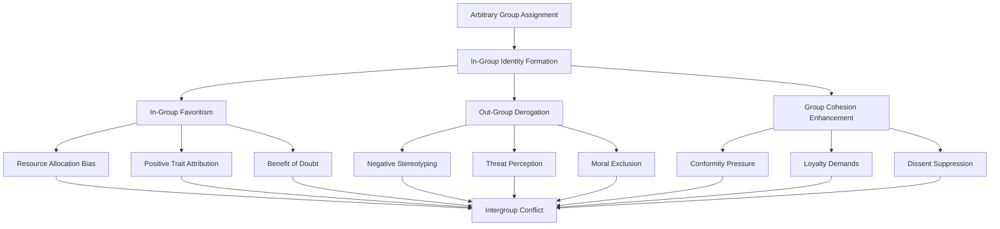
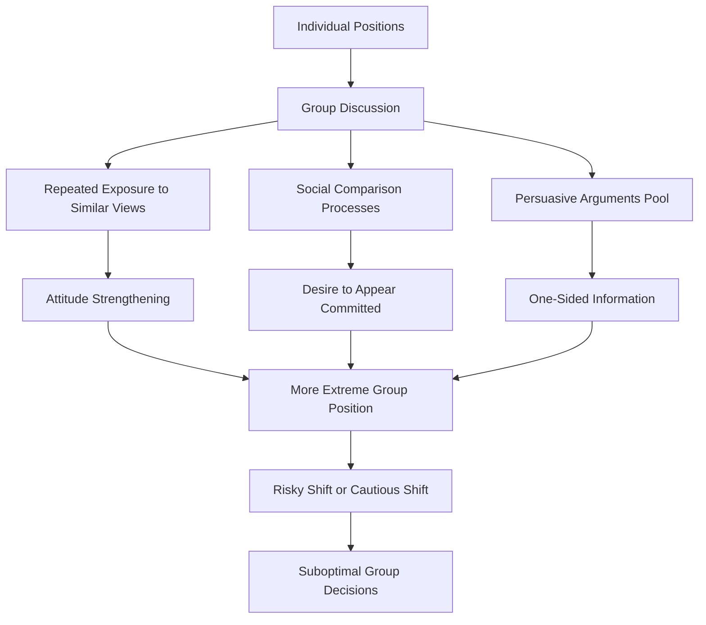
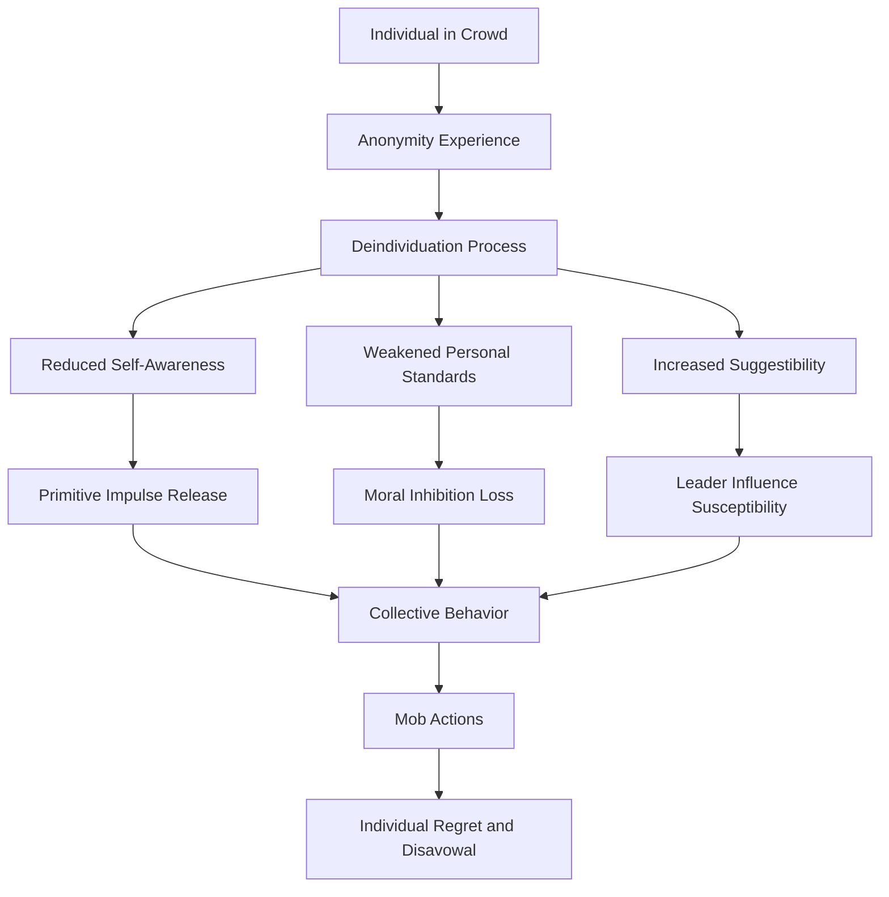
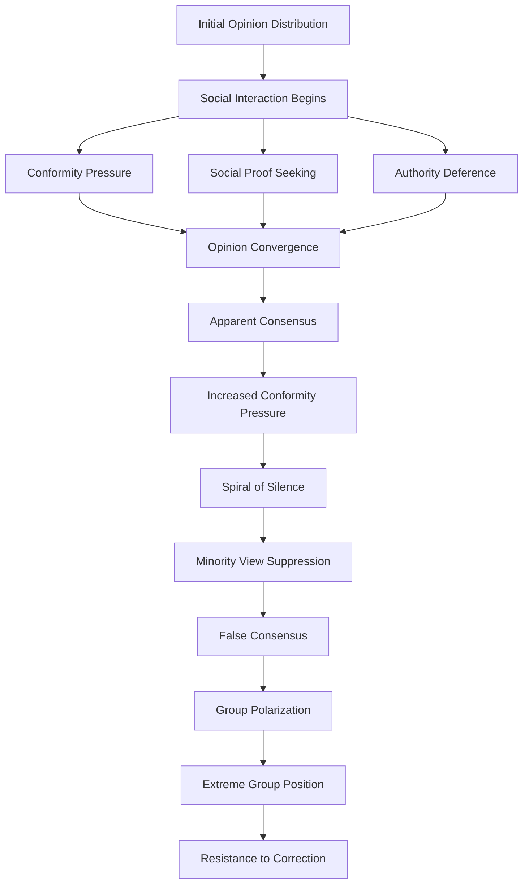
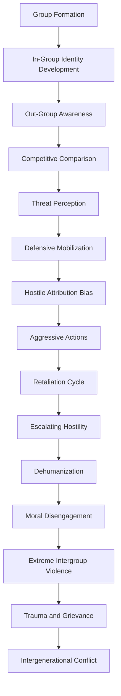

# Social Psychology: Group Dynamics and Collective Dysfunction

## Abstract

Social psychology reveals how individual cognitive biases and psychological mechanisms aggregate and amplify within group contexts, creating systematic patterns of collective dysfunction. In-group/out-group dynamics, conformity pressures, and social influence processes transform individual limitations into group-level pathologies that undermine rational decision-making, moral reasoning, and cooperative behavior across all human societies.

## Introduction

Human beings are fundamentally social creatures whose psychology evolved for small-group cooperation and competition. However, the same psychological mechanisms that enabled survival in ancestral tribal environments create systematic vulnerabilities in modern large-scale societies. Social psychological processes amplify individual biases, create artificial divisions, and generate collective behaviors that often contradict both individual and group interests.

## In-Group/Out-Group Dynamics

The human tendency to form groups and distinguish between "us" and "them" represents one of the most fundamental and dangerous aspects of social psychology. This tendency, while adaptive in small ancestral groups, creates systematic problems in diverse modern societies by generating artificial divisions and conflicts based on arbitrary distinctions.

### Minimal Group Paradigm and Arbitrary Divisions

One of the most striking discoveries in social psychology is that humans will discriminate against others based on even the most trivial group distinctions. Henri Tajfel's minimal group experiments demonstrated that people randomly assigned to groups based on meaningless criteria (such as preference for abstract paintings) immediately begin showing favoritism toward their own group and discrimination against the other group.

This process flow reveals how **Arbitrary Group Assignment**—even based on completely meaningless distinctions—immediately triggers **In-Group Identity Formation**. Once people identify with a group, three parallel processes begin operating simultaneously, each contributing to intergroup conflict.

**In-Group Favoritism** manifests through **Resource Allocation Bias** (giving more resources to group members), **Positive Trait Attribution** (assuming group members have better characteristics), and **Benefit of Doubt** (interpreting ambiguous actions by group members favorably). These biases occur automatically and unconsciously, even when people are explicitly instructed to be fair.

**Out-Group Derogation** operates through **Negative Stereotyping** (assuming out-group members have worse characteristics), **Threat Perception** (viewing out-group actions as potentially dangerous), and **Moral Exclusion** (applying different moral standards to out-group members). As psychologist Albert Bandura demonstrates, moral exclusion allows people to harm others while maintaining their self-image as moral individuals.

**Group Cohesion Enhancement** creates internal pressure through **Conformity Pressure** (expectations to think and act like other group members), **Loyalty Demands** (requirements to prioritize group interests over individual judgment), and **Dissent Suppression** (punishment of members who question group decisions or norms).

All these processes converge to create **Intergroup Conflict**—competition, hostility, and violence between groups that serves no rational purpose and often harms everyone involved. The power of this process is that it operates automatically, requiring no real differences between groups, no genuine conflicts of interest, and no rational basis for discrimination.

### Social Identity Theory Components

Social Identity Theory, developed by Henri Tajfel and John Turner, explains how group membership becomes central to individual identity and drives intergroup behavior. Understanding these components is crucial for comprehending how individual psychology creates collective dysfunction.

| Component | Mechanism | Manifestation | Consequences |
|-----------|-----------|---------------|--------------|
| **Social Categorization** | Classify people into groups | Us vs. them thinking | Oversimplified social perception |
| **Social Identification** | Adopt group identity | Group membership becomes self-concept | Loss of individual identity |
| **Social Comparison** | Compare groups favorably | In-group superiority beliefs | Intergroup competition and conflict |
| **Positive Distinctiveness** | Maintain group superiority | Emphasize group differences | Discrimination and prejudice |

**Social Categorization** represents the cognitive process of dividing the social world into discrete groups. This **Mechanism** operates automatically and unconsciously, with humans naturally **Classifying people into groups** based on visible characteristics, cultural markers, or behavioral patterns. The **Manifestation** is **Us vs. them thinking**—a binary worldview that reduces complex social reality to simple group distinctions. The **Consequences** include **Oversimplified social perception** that ignores individual differences within groups and similarities across groups.

**Social Identification** occurs when individuals adopt group membership as part of their personal identity. The **Mechanism** involves psychological attachment to group symbols, values, and narratives, with **Group membership becoming self-concept**. People begin to define themselves in terms of their group affiliations rather than individual characteristics. The **Consequences** include **Loss of individual identity** and increased susceptibility to group influence, as threats to the group become threats to the self.

**Social Comparison** drives the need to evaluate one's group favorably relative to other groups. The **Mechanism** involves **Comparing groups favorably**, seeking evidence that one's own group is superior in important dimensions. This **Manifests** as **In-group superiority beliefs**—the conviction that one's group is better, more moral, more intelligent, or more deserving than others. The **Consequences** include **Intergroup competition and conflict** as groups compete for status and recognition.

**Positive Distinctiveness** represents the motivation to maintain group superiority through emphasizing differences. The **Mechanism** involves **Maintaining group superiority** by highlighting characteristics that distinguish one's group from others. This **Manifests** as **Emphasizing group differences** while minimizing similarities, creating artificial divisions between groups. The **Consequences** include **Discrimination and prejudice** as groups seek to maintain their distinctive advantages.

### Realistic Conflict Theory Dynamics

Competition for scarce resources intensifies group conflict:

| Resource Type | Competition Manifestation | Psychological Response | Social Consequences |
|---------------|--------------------------|----------------------|-------------------|
| **Economic** | Jobs, wealth, territory | Zero-sum thinking | Economic nationalism, class conflict |
| **Status** | Prestige, recognition | Status anxiety | Cultural wars, identity politics |
| **Power** | Political control | Dominance motivation | Authoritarianism, oppression |
| **Security** | Safety, protection | Threat perception | Militarism, surveillance states |

## Conformity and Social Influence

### Asch Conformity Experiments and Line Judgment

Classic experiments reveal the power of social pressure to override individual perception:

| Experimental Condition | Conformity Rate | Psychological Mechanism | Real-World Application |
|------------------------|----------------|------------------------|----------------------|
| **Unanimous Majority** | 37% incorrect responses | Normative social influence | Political correctness, groupthink |
| **Single Dissenter** | 5% incorrect responses | Social support for accuracy | Importance of diverse perspectives |
| **Written Responses** | Near 0% conformity | Reduced social pressure | Anonymous voting systems |
| **Increased Majority** | Plateaus at 3-4 people | Diminishing returns of group size | Optimal team sizes |

### Milgram Obedience Studies and Authority

Obedience to authority overrides individual moral judgment:

```mermaid
flowchart LR
    A[Authority Figure] --> B[Legitimate Authority Perception]
    
    B --> C[Agentic State Activation]
    C --> D[Personal Responsibility Transfer]
    D --> E[Moral Disengagement]
    
    E --> F[Harmful Behavior Execution]
    
    F --> G[Cognitive Dissonance]
    G --> H[Rationalization]
    H --> I[Continued Compliance]
    
    I --> J[Escalating Commitment]
    J --> K[Extreme Harmful Behavior]
```

### Social Influence Mechanisms

| Influence Type | Mechanism | Compliance Rate | Resistance Factors |
|----------------|-----------|----------------|-------------------|
| **Foot-in-the-Door** | Small request → Large request | 50-75% increase | Awareness of technique |
| **Door-in-the-Face** | Large request → Small request | 40-60% compliance | Time delay between requests |
| **Low-Ball** | Agreement → Added costs | 70-80% follow-through | Opportunity to reconsider |
| **Reciprocity** | Gift → Request | 2-3x compliance rate | Perceived manipulation |

## Group Decision-Making Failures

### Groupthink Syndrome Components

Irving Janis identified systematic group decision-making failures:

| Groupthink Symptom | Manifestation | Decision Impact | Historical Examples |
|-------------------|---------------|-----------------|-------------------|
| **Illusion of Unanimity** | Silence interpreted as agreement | Suppress dissenting views | Bay of Pigs invasion |
| **Self-Censorship** | Members withhold doubts | Critical information lost | Challenger disaster |
| **Pressure on Dissenters** | Conformity enforcement | Eliminate alternative perspectives | Vietnam War escalation |
| **Mindguards** | Filter contradictory information | Maintain group consensus | WMD intelligence failures |
| **Invulnerability Illusion** | Overestimate group capabilities | Excessive risk-taking | Financial crisis decisions |

### Group Polarization Effects

Groups make more extreme decisions than individuals:

### Risky Shift vs. Cautious Shift

| Decision Domain | Typical Shift Direction | Mechanism | Consequences |
|-----------------|------------------------|-----------|--------------|
| **Financial Investment** | Risky shift | Diffused responsibility | Speculative bubbles |
| **Safety Procedures** | Cautious shift | Liability concerns | Over-regulation |
| **Military Action** | Risky shift | Masculine norms | Unnecessary conflicts |
| **Social Policy** | Polarization both ways | Ideological sorting | Policy extremism |

## Social Contagion and Mass Behavior

### Emotional Contagion Mechanisms

Emotions spread rapidly through groups via multiple channels:

| Contagion Channel | Mechanism | Speed | Accuracy | Examples |
|------------------|-----------|-------|----------|----------|
| **Facial Mimicry** | Automatic imitation | Milliseconds | High | Crowd mood synchronization |
| **Vocal Synchrony** | Voice pattern matching | Seconds | Moderate | Chanting, singing |
| **Postural Mirroring** | Body language copying | Minutes | Low | Group posture alignment |
| **Attention Convergence** | Shared focus | Variable | High | Collective attention to events |

### Crowd Psychology Dynamics

Gustave Le Bon's crowd psychology principles remain relevant:

### Mass Movement Characteristics

| Movement Type | Psychological Appeal | Recruitment Method | Typical Trajectory |
|---------------|---------------------|-------------------|-------------------|
| **Religious Revival** | Meaning and salvation | Emotional conversion | Enthusiasm → Institutionalization |
| **Political Revolution** | Justice and change | Grievance mobilization | Radicalization → Moderation or failure |
| **Social Reform** | Moral improvement | Rational persuasion | Gradual progress or backlash |
| **Mass Hysteria** | Fear and protection | Contagion spread | Rapid rise → Sudden collapse |

## Social Psychology Experiments and Findings

### Classic Experiments Summary

| Experiment | Researcher(s) | Key Finding | Replication Status | Modern Relevance |
|------------|---------------|-------------|-------------------|------------------|
| **Conformity Lines** | Asch (1951) | 37% conform to obviously wrong majority | Robust across cultures | Social media echo chambers |
| **Obedience to Authority** | Milgram (1963) | 65% deliver maximum shock | Ethical concerns limit replication | Corporate whistleblowing |
| **Stanford Prison** | Zimbardo (1971) | Role assignment shapes behavior | Methodological criticisms | Institutional abuse |
| **Robbers Cave** | Sherif (1954) | Competition creates conflict | Well-replicated | Intergroup relations |
| **Minimal Groups** | Tajfel (1970) | Trivial categories create bias | Robust finding | Political polarization |

### Contemporary Social Psychology Findings

| Research Area | Key Findings | Methodology | Implications |
|---------------|-------------|-------------|--------------|
| **Implicit Bias** | Unconscious prejudice affects behavior | IAT, behavioral measures | Discrimination persists despite conscious egalitarian beliefs |
| **System Justification** | People defend unfair systems | Survey, experimental | Resistance to social change even among disadvantaged |
| **Moral Foundations** | Different moral priorities create conflict | Cross-cultural surveys | Political and cultural divisions based on moral differences |
| **Social Networks** | Network structure affects behavior | Big data analysis | Information bubbles and polarization in digital age |

## Group Behavior Process Diagrams

### Social Influence Cascade

### Intergroup Conflict Escalation

## Modern Applications and Digital Age Amplification

### Social Media and Group Psychology

Digital platforms amplify traditional group psychological processes:

| Platform Feature | Psychological Mechanism | Group Effect | Societal Consequence |
|------------------|------------------------|--------------|-------------------|
| **Echo Chambers** | Confirmation bias reinforcement | Belief polarization | Political extremism |
| **Viral Content** | Emotional contagion acceleration | Rapid mood spread | Mass hysteria events |
| **Anonymous Interaction** | Deindividuation enhancement | Disinhibited behavior | Online harassment |
| **Algorithmic Filtering** | Selective exposure increase | Worldview narrowing | Reality fragmentation |

### Corporate and Organizational Applications

Social psychology principles explain organizational dysfunction:

| Organizational Context | Social Psychology Principle | Manifestation | Business Impact |
|------------------------|----------------------------|---------------|-----------------|
| **Team Meetings** | Groupthink | Suppressed dissent | Poor decisions |
| **Corporate Culture** | Conformity pressure | Innovation resistance | Competitive disadvantage |
| **Leadership** | Authority bias | Unquestioned directives | Strategic errors |
| **Diversity Initiatives** | In-group favoritism | Tokenism | Continued discrimination |

## Implications for Human Dysfunction

### Individual Level Impact

Social psychological processes undermine individual autonomy and rational thinking:

1. **Identity Fusion**: Personal identity becomes indistinguishable from group identity
2. **Moral Outsourcing**: Transfer moral responsibility to group or authority
3. **Cognitive Conformity**: Suppress individual judgment in favor of group consensus
4. **Social Validation Dependency**: Self-worth depends on group acceptance

### Organizational Level Impact

Group dynamics create systematic organizational failures:

1. **Innovation Suppression**: Conformity pressure prevents creative thinking
2. **Ethical Blindness**: Group loyalty overrides moral considerations
3. **Decision-Making Paralysis**: Groupthink prevents effective problem-solving
4. **Talent Misallocation**: In-group favoritism trumps merit-based selection

### Societal Level Impact

Social psychological processes threaten democratic governance and social cohesion:

1. **Political Polarization**: In-group/out-group dynamics fragment society
2. **Democratic Erosion**: Authority bias enables authoritarian leaders
3. **Social Fragmentation**: Group identity conflicts undermine national unity
4. **Collective Irrationality**: Mass movements override individual and collective interests

## Theoretical Integration

### Social Identity Theory and Realistic Conflict Theory

These complementary theories explain intergroup relations:
- **Social Identity**: Groups compete for positive distinctiveness even without material conflict
- **Realistic Conflict**: Material competition intensifies psychological group processes
- **Integration**: Both symbolic and material factors drive intergroup conflict

### System Justification Theory

Explains why disadvantaged groups often support systems that harm them:
- **Cognitive Dissonance Reduction**: Believing system is fair reduces psychological discomfort
- **Uncertainty Reduction**: Stable systems provide predictability
- **Social Desirability**: Supporting system gains social approval

## Mitigation Strategies and Limitations

### Intergroup Contact Theory

Conditions for reducing prejudice through contact:

| Contact Condition | Mechanism | Effectiveness | Limitations |
|------------------|-----------|---------------|-------------|
| **Equal Status** | Reduces status-based prejudice | Moderate | Difficult to achieve in practice |
| **Common Goals** | Creates superordinate identity | High | Temporary effect |
| **Cooperation** | Positive interdependence | High | Requires structural change |
| **Authority Support** | Legitimizes contact | Moderate | Authority may be biased |

### Structural Solutions

| Intervention | Target Process | Implementation | Effectiveness |
|--------------|---------------|----------------|---------------|
| **Anonymous Decision-Making** | Conformity pressure | Secret ballots, blind review | High for specific decisions |
| **Devil's Advocate Roles** | Groupthink | Formal dissent assignment | Moderate |
| **Diverse Team Composition** | In-group favoritism | Hiring and promotion policies | Moderate to high |
| **Perspective-Taking Training** | Out-group derogation | Educational interventions | Low to moderate |

### Fundamental Limitations

1. **Evolutionary Basis**: Group psychology served adaptive functions and resists change
2. **Cognitive Efficiency**: Group thinking reduces individual cognitive load
3. **Social Benefits**: Group membership provides identity, meaning, and support
4. **Structural Reinforcement**: Institutions often depend on and reinforce group dynamics

## Conclusion

Social psychology reveals how individual psychological limitations aggregate and amplify within group contexts, creating systematic patterns of collective dysfunction. In-group/out-group dynamics, conformity pressures, and social influence processes transform personal biases into group-level pathologies that undermine rational decision-making, moral reasoning, and cooperative behavior.

These processes are not mere historical curiosities but active forces shaping contemporary politics, organizations, and social relations. The digital age has amplified many social psychological processes, creating new forms of collective dysfunction while preserving ancient patterns of group behavior.

Understanding social psychology is essential for realistic approaches to human problems, suggesting the need for institutional designs that account for rather than ignore fundamental features of human group psychology. Effective solutions must work with these psychological realities rather than expecting humans to transcend their evolved social nature.

## References

1. Tajfel, H., & Turner, J. C. (1979). An integrative theory of intergroup conflict. *The Social Psychology of Intergroup Relations*, 33-47.
2. Asch, S. E. (1956). Studies of independence and conformity: I. A minority of one against a unanimous majority. *Psychological Monographs*, 70(9), 1-70.
3. Milgram, S. (1963). Behavioral study of obedience. *Journal of Abnormal and Social Psychology*, 67(4), 371-378.
4. Janis, I. L. (1972). *Victims of Groupthink*. Houghton Mifflin.
5. Sherif, M. (1966). *In Common Predicament: Social Psychology of Intergroup Conflict and Cooperation*. Houghton Mifflin.
6. Cialdini, R. B. (2006). *Influence: The Psychology of Persuasion*. Harper Business.

---

*See also: [Cognitive Architecture](../individual/cognitive-architecture.md) | [Organizational Pathology](organizational-pathology.md) | [Collective Behavior](collective-behavior.md)*