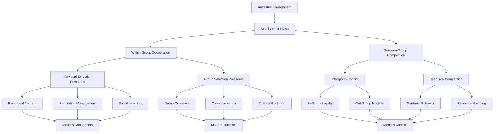
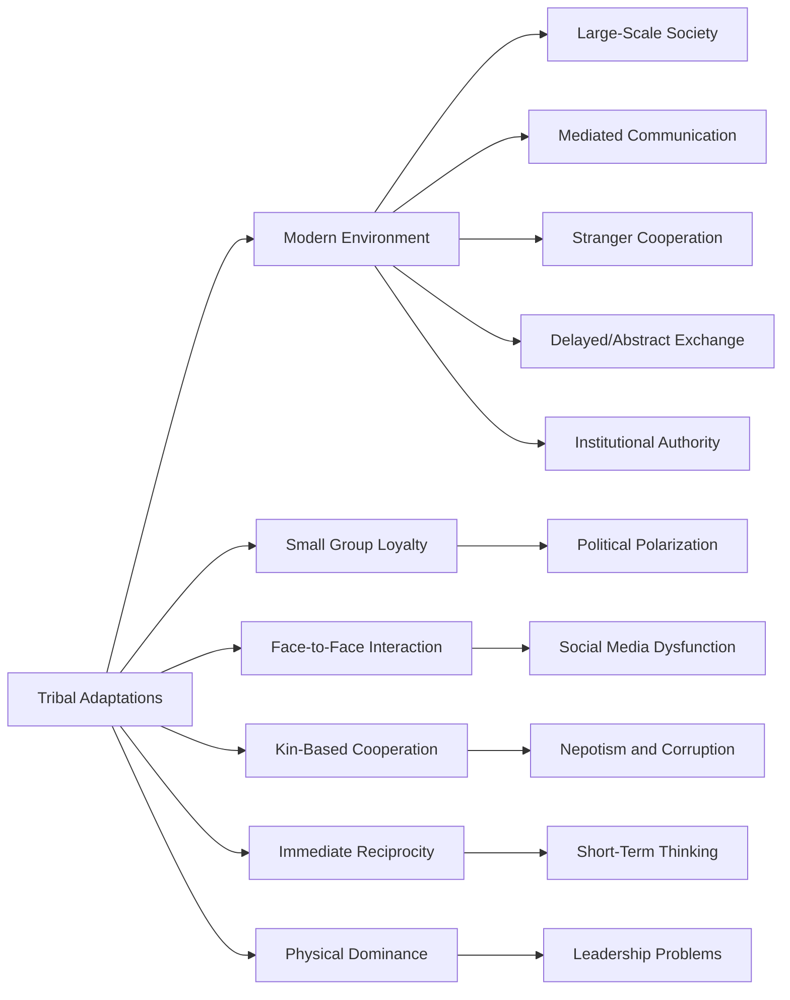
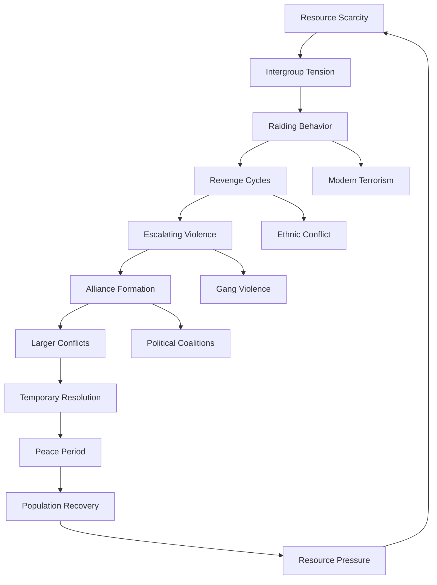
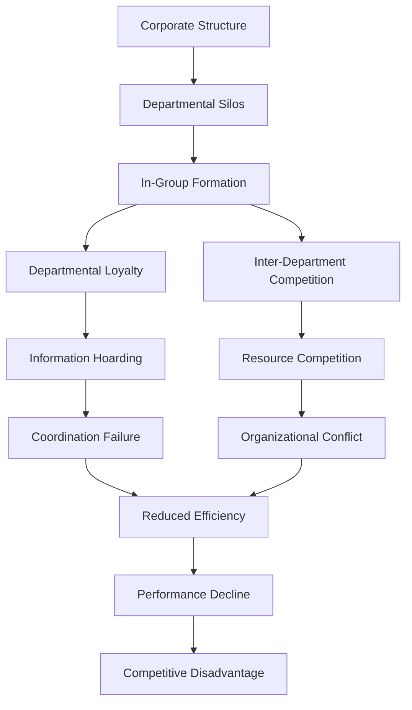
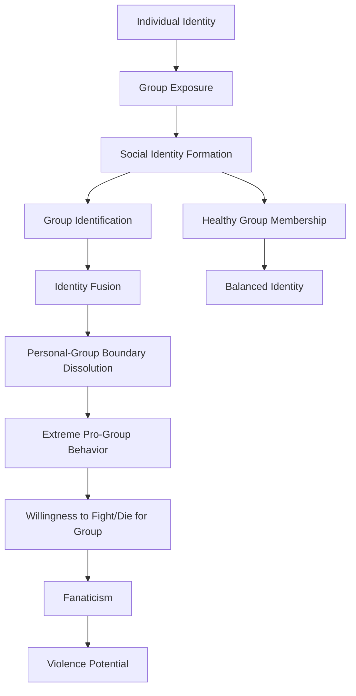
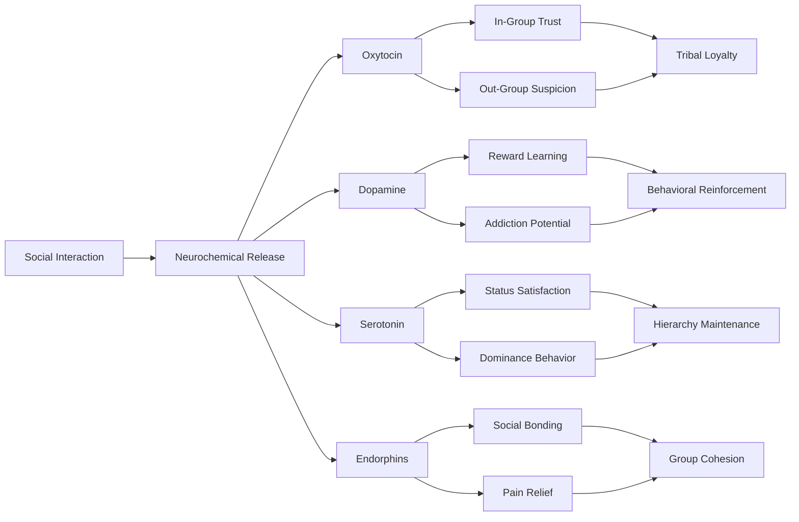

# Tribal Psychology: Evolutionary Basis and Modern Manifestations

## Abstract

Human tribal psychology represents the evolutionary heritage of small-group cooperation and competition that enabled survival in ancestral environments but creates systematic dysfunction in modern large-scale societies. The psychological mechanisms that fostered in-group loyalty and out-group hostility in hunter-gatherer bands now manifest as political polarization, ethnic conflict, nationalism, and organizational tribalism, undermining rational discourse and cooperative problem-solving in contemporary contexts.

## Introduction

Humans evolved in small tribal groups of 25-150 individuals where survival depended on intense cooperation within the group and effective competition against other groups. The psychological mechanisms that enabled this tribal existence—including in-group favoritism, out-group hostility, conformity pressure, and hierarchical deference—remain active in modern humans despite radically different environmental conditions. Understanding tribal psychology is essential for comprehending persistent patterns of human conflict and cooperation.

## Evolutionary Foundations of Tribal Psychology

### Ancestral Environment and Group Selection

Human tribal psychology evolved through the complex interplay of individual and group selection pressures operating in small-scale societies. This flowchart illustrates how the ancestral environment created specific psychological adaptations that now create systematic problems in modern large-scale societies.

This evolutionary analysis reveals why tribal psychology creates such persistent problems in modern societies. The ancestral environment of small group living created two fundamental selection pressures that shaped human psychology in contradictory ways. Within-group cooperation required psychological mechanisms for trust, reciprocity, and collective action, while between-group competition demanded mechanisms for loyalty, hostility toward outsiders, and resource competition.

Individual selection pressures within groups favored psychological traits that enhanced personal survival and reproduction through cooperation—reciprocal altruism, reputation management, and social learning. These mechanisms now enable modern cooperation in organizations, communities, and societies, but they operate most effectively within small groups where individuals can monitor each other's behavior and maintain reciprocal relationships.

Group selection pressures favored psychological traits that enhanced group survival and success in competition with other groups—group cohesion, collective action capability, and cultural evolution. As evolutionary biologist David Sloan Wilson explains in "Does Altruism Exist?," these group-level adaptations created the capacity for large-scale cooperation but also the tendency toward tribal thinking that divides the world into "us" versus "them."

The intergroup conflict and resource competition aspects of ancestral life created the most problematic modern legacies—in-group loyalty that becomes political tribalism, out-group hostility that becomes prejudice and discrimination, territorial behavior that becomes nationalism, and resource hoarding that becomes economic inequality. These psychological mechanisms were adaptive when groups competed directly for survival but become maladaptive in modern contexts requiring cooperation among strangers and global coordination.

### Dunbar's Number and Cognitive Limits

Robin Dunbar's research on cognitive limits reveals why human social psychology is fundamentally calibrated for small groups, creating systematic problems when applied to large-scale modern societies. This table demonstrates how different relationship types correspond to specific cognitive mechanisms and group sizes.

| Group Size | Relationship Type | Cognitive Mechanism | Modern Manifestation |
|------------|------------------|-------------------|---------------------|
| **5** | Intimate bonds | Emotional attachment | Family units |
| **15** | Close friends | Personal knowledge | Close friend networks |
| **50** | Meaningful relationships | Social memory | Work teams, clubs |
| **150** | Stable social network | Facial recognition + context | Organizational units |
| **500** | Acquaintances | Name recognition | Extended networks |
| **1500** | Faces | Visual recognition | Neighborhood communities |

This cognitive limit analysis reveals why human social psychology breaks down predictably as group size increases beyond evolutionary parameters. The intimate bond limit of 5 people reflects the maximum number of individuals with whom humans can maintain deep emotional connections requiring constant attention and care. This corresponds to typical family units and explains why larger families often experience relationship strain and conflict.

The close friend limit of 15 people represents the maximum number of individuals about whom humans can maintain detailed personal knowledge—their preferences, histories, relationships, and current circumstances. As anthropologist Robin Dunbar explains in "How Many Friends Does One Person Need?," this requires sophisticated social memory and regular interaction to maintain. Modern close friend networks rarely exceed this size, and attempts to maintain larger networks result in superficial relationships.

The meaningful relationship limit of 50 people corresponds to the maximum size of groups where everyone can know everyone else personally and maintain some level of reciprocal relationship. This explains why work teams, clubs, and other voluntary associations tend to fragment or become impersonal when they exceed this size. Military units, religious congregations, and other successful organizations often organize around this natural limit.

The stable social network limit of 150 people—Dunbar's famous number—represents the maximum size of groups where individuals can maintain stable social relationships based on personal knowledge and direct interaction. This corresponds to the typical size of hunter-gatherer bands and explains why modern organizations often create dysfunction when they exceed this size without formal hierarchical structures and role definitions.

### Tribal Psychological Adaptations

Evolution shaped specific psychological mechanisms for tribal living that create systematic problems when applied to modern large-scale societies. This table reveals how each adaptive mechanism, beneficial in ancestral environments, becomes a source of dysfunction in contemporary contexts.

| Adaptation | Function | Mechanism | Modern Problems |
|------------|----------|-----------|-----------------|
| **In-Group Favoritism** | Promote cooperation | Automatic preference for group members | Discrimination, nepotism |
| **Out-Group Derogation** | Reduce competition | Negative stereotyping of outsiders | Prejudice, conflict |
| **Conformity Pressure** | Maintain group cohesion | Social punishment of deviants | Suppressed innovation |
| **Authority Deference** | Enable coordination | Hierarchical submission | Authoritarianism |
| **Moral Parochialism** | Justify group actions | Different moral standards for in/out-groups | Double standards |

This tribal adaptation analysis reveals why humans consistently create problems for themselves despite their sophisticated cognitive abilities. In-group favoritism, which evolved to promote cooperation and resource sharing within small bands, now manifests as discrimination and nepotism that undermine meritocracy and fairness in modern institutions. The automatic preference for group members operates below conscious awareness, creating systematic bias even among individuals who consciously reject prejudice.

Out-group derogation served the adaptive function of reducing competition and justifying resource competition between groups. As social psychologist Henri Tajfel demonstrated in his minimal group experiments, humans will automatically develop negative stereotypes about outsiders even when group distinctions are completely arbitrary. This psychological mechanism now creates prejudice, ethnic conflict, and international tensions that prevent the global cooperation needed to address shared challenges.

Conformity pressure maintained group cohesion by ensuring that all members adhered to group norms and practices essential for survival. However, this same mechanism now suppresses innovation and critical thinking in modern organizations and societies. As psychologist Irving Janis documented in his research on groupthink, conformity pressure can lead groups to make catastrophically poor decisions while suppressing dissenting voices that might prevent disaster.

Authority deference enabled coordination and collective action in ancestral groups by ensuring that individuals would follow leaders during crises and conflicts. This psychological mechanism now creates vulnerability to authoritarianism and enables the rise of leaders who exploit tribal psychology for personal gain rather than group benefit. The automatic tendency to defer to authority figures can override rational evaluation of leadership competence and moral character.

Moral parochialism—applying different moral standards to in-group versus out-group members—justified the harsh treatment of competitors while maintaining cooperation within the group. This psychological mechanism now creates the double standards and hypocrisy that undermine moral reasoning and ethical behavior in modern contexts requiring universal moral principles.

## Tribal vs. Modern Group Dynamics

### Structural Differences

| Dimension | Tribal Groups | Modern Groups | Psychological Mismatch |
|-----------|---------------|---------------|----------------------|
| **Size** | 25-150 people | Thousands to millions | Cognitive overload |
| **Stability** | Lifelong membership | Fluid membership | Reduced commitment |
| **Interaction** | Face-to-face daily | Mediated, infrequent | Weakened bonds |
| **Hierarchy** | Informal, merit-based | Formal, bureaucratic | Status confusion |
| **Conflict Resolution** | Direct negotiation | Legal/institutional | Impersonal justice |
| **Resource Sharing** | Communal | Market-based | Reduced reciprocity |

### Psychological Adaptations and Modern Mismatches

### Comparison Table: Tribal vs. Modern Dynamics

| Aspect | Tribal Context | Modern Context | Dysfunction Created |
|--------|----------------|----------------|-------------------|
| **Group Identity** | Kinship, shared territory | Abstract categories | Artificial divisions |
| **Leadership** | Earned through competence | Appointed through institutions | Illegitimate authority |
| **Conflict Resolution** | Elder mediation | Legal systems | Impersonal justice |
| **Resource Distribution** | Sharing networks | Market mechanisms | Inequality resentment |
| **Information Flow** | Gossip networks | Mass media | Information manipulation |
| **Moral Enforcement** | Shame and ostracism | Legal punishment | Moral disengagement |

## Anthropological Examples and Cross-Cultural Patterns

### Hunter-Gatherer Tribal Organization

| Society | Location | Group Size | Leadership | Conflict Resolution | Modern Parallels |
|---------|----------|------------|------------|-------------------|------------------|
| **!Kung San** | Kalahari Desert | 25-30 | Informal elders | Talking and moving | Workplace mediation |
| **Inuit** | Arctic | 20-40 | Situational leaders | Community pressure | Peer review systems |
| **Hadza** | Tanzania | 30-50 | No formal leaders | Group discussion | Consensus decision-making |
| **Mbuti** | Congo Basin | 15-30 | Age-based respect | Ritual resolution | Restorative justice |

### Tribal Warfare Patterns

Anthropological evidence reveals consistent patterns in tribal conflict:

### Cultural Universals in Tribal Psychology

| Universal Pattern | Manifestation | Function | Modern Expression |
|------------------|---------------|----------|-------------------|
| **In-Group Markers** | Language, dress, rituals | Identity signaling | Fashion, slang, subcultures |
| **Origin Stories** | Creation myths | Group cohesion | National narratives |
| **Enemy Narratives** | Demonization of outsiders | Conflict justification | Political rhetoric |
| **Hero Worship** | Legendary figures | Role models | Celebrity culture |
| **Ritual Bonding** | Shared ceremonies | Group solidarity | Sports, concerts |

## Contemporary Applications and Modern Tribalism

### Political Tribalism

Modern political systems activate ancient tribal psychology:

| Political Phenomenon | Tribal Mechanism | Psychological Process | Democratic Impact |
|---------------------|------------------|---------------------|-------------------|
| **Partisan Identity** | In-group loyalty | Social identity formation | Reduced policy focus |
| **Negative Partisanship** | Out-group hostility | Threat perception | Increased polarization |
| **Leader Worship** | Alpha deference | Authority submission | Reduced accountability |
| **Policy Tribalism** | Group conformity | Belief alignment | Irrational policy support |

### Corporate Tribalism

Organizations inadvertently activate tribal psychology:

### Sports and Entertainment Tribalism

Modern entertainment channels tribal psychology into relatively harmless outlets:

| Activity | Tribal Element | Psychological Satisfaction | Social Function |
|----------|----------------|---------------------------|-----------------|
| **Team Sports** | Group competition | Vicarious victory | Social bonding |
| **Fan Communities** | Shared identity | Belonging | Community formation |
| **Rivalries** | Out-group hostility | Emotional release | Conflict channeling |
| **Rituals** | Group ceremonies | Collective effervescence | Social cohesion |

### Digital Age Tribalism

Technology amplifies tribal psychology in new ways:

| Digital Platform | Tribal Mechanism | Amplification Effect | Societal Impact |
|------------------|------------------|---------------------|-----------------|
| **Social Media** | Echo chambers | Confirmation bias reinforcement | Political polarization |
| **Online Communities** | Virtual tribes | Identity fusion | Radicalization potential |
| **Gaming** | Team competition | Coordinated action | Skill development |
| **Forums** | In-group knowledge | Expertise sharing | Knowledge communities |

## Psychological Mechanisms of Modern Tribalism

### Identity Fusion and Group Commitment

Identity fusion represents the extreme end of group identification:

### Moral Foundations and Tribal Values

Jonathan Haidt identified moral foundations that vary across tribal groups:

| Moral Foundation | Tribal Function | Liberal Emphasis | Conservative Emphasis | Conflict Source |
|------------------|-----------------|------------------|---------------------|-----------------|
| **Care/Harm** | Protect group members | High | Moderate | Scope of care |
| **Fairness/Cheating** | Maintain cooperation | High (equality) | High (proportionality) | Definition of fairness |
| **Loyalty/Betrayal** | Group cohesion | Low | High | Group vs. universal values |
| **Authority/Subversion** | Hierarchy maintenance | Low | High | Legitimate authority |
| **Sanctity/Degradation** | Sacred boundaries | Low | High | Sacred vs. secular |
| **Liberty/Oppression** | Resist domination | Moderate | High | Freedom definition |

### Intergroup Contact and Prejudice Reduction

Conditions for reducing tribal hostility through contact:

| Contact Condition | Mechanism | Effectiveness | Implementation Challenges |
|------------------|-----------|---------------|--------------------------|
| **Equal Status** | Reduce status-based prejudice | Moderate | Difficult to achieve |
| **Common Goals** | Superordinate identity | High | Temporary effects |
| **Cooperation** | Positive interdependence | High | Structural requirements |
| **Authority Support** | Legitimize contact | Moderate | Authority bias |
| **Personal Interaction** | Humanize out-group | High | Scale limitations |

## Neurobiological Basis of Tribal Psychology

### Brain Systems Involved in Tribal Behavior

| Brain Region | Function | Tribal Behavior | Modern Implications |
|--------------|----------|-----------------|-------------------|
| **Amygdala** | Threat detection | Out-group fear | Prejudice, xenophobia |
| **Anterior Cingulate** | Social pain | Exclusion sensitivity | Conformity pressure |
| **Medial Prefrontal Cortex** | Social cognition | In-group empathy | Parochial altruism |
| **Temporal-Parietal Junction** | Theory of mind | Out-group dehumanization | Moral exclusion |
| **Striatum** | Reward processing | In-group success | Team loyalty |

### Neurochemical Basis of Tribal Bonding

### Genetic Influences on Tribal Behavior

| Genetic Factor | Influence | Behavioral Effect | Population Variation |
|----------------|-----------|------------------|-------------------|
| **OXTR Gene** | Oxytocin receptor sensitivity | Social bonding strength | Ethnic differences |
| **COMT Gene** | Dopamine metabolism | Risk-taking, aggression | Individual variation |
| **5-HTTLPR** | Serotonin transport | Anxiety, conformity | Cultural adaptation |
| **MAOA Gene** | Monoamine oxidase | Aggression regulation | Sex-linked differences |

## Implications for Human Dysfunction

### Individual Level Impact

Tribal psychology creates systematic individual problems:

1. **Identity Confusion**: Conflicting tribal loyalties undermine coherent self-concept
2. **Moral Compartmentalization**: Different moral standards for different groups
3. **Cognitive Rigidity**: Tribal thinking reduces intellectual flexibility
4. **Emotional Dysregulation**: Tribal conflicts create chronic stress and anxiety

### Organizational Level Impact

Tribal psychology undermines organizational effectiveness:

1. **Departmental Silos**: Tribal loyalty prevents cross-functional cooperation
2. **Innovation Resistance**: Conformity pressure suppresses creative thinking
3. **Leadership Conflicts**: Competing tribal loyalties fragment authority
4. **Knowledge Hoarding**: Tribal competition prevents information sharing

### Societal Level Impact

Tribal psychology threatens social cohesion and democratic governance:

1. **Political Polarization**: Tribal identity overrides policy considerations
2. **Social Fragmentation**: Multiple tribal identities prevent national unity
3. **Democratic Erosion**: Tribal loyalty enables authoritarian leaders
4. **Conflict Escalation**: Tribal psychology amplifies minor disagreements into major conflicts

### Global Level Impact

Tribal psychology creates international instability:

1. **Nationalism**: Tribal psychology scaled to nation-states
2. **Ethnic Conflict**: Tribal identities override civic identities
3. **Resource Competition**: Tribal thinking prevents global cooperation
4. **Climate Change**: Tribal short-termism prevents long-term planning

## Theoretical Integration

### Evolutionary Psychology and Cultural Evolution

Tribal psychology represents the interaction between genetic and cultural evolution:
- **Gene-Culture Coevolution**: Cultural practices shaped genetic evolution and vice versa
- **Cultural Group Selection**: Groups with better cultural practices outcompeted others
- **Mismatch Theory**: Modern environments don't match ancestral conditions
- **Developmental Plasticity**: Tribal psychology adapts to local conditions

### Social Identity Theory and Realistic Conflict Theory

These theories explain different aspects of tribal psychology:
- **Social Identity**: Groups compete for positive distinctiveness even without material conflict
- **Realistic Conflict**: Material competition intensifies psychological group processes
- **Integration**: Both symbolic and material factors drive tribal behavior

## Mitigation Strategies and Limitations

### Institutional Design

| Strategy | Mechanism | Effectiveness | Implementation |
|----------|-----------|---------------|----------------|
| **Cross-Cutting Identities** | Multiple group memberships | High | Difficult to engineer |
| **Superordinate Goals** | Common challenges | High | Temporary effects |
| **Institutional Checks** | Prevent tribal capture | Moderate | Requires maintenance |
| **Diversity Requirements** | Force intergroup contact | Moderate | Resistance potential |

### Educational Interventions

| Intervention | Target | Method | Sustainability |
|--------------|--------|--------|----------------|
| **Perspective-Taking** | Empathy development | Role-playing exercises | Moderate |
| **Historical Education** | Pattern recognition | Case study analysis | High |
| **Critical Thinking** | Bias awareness | Logical reasoning training | Low |
| **Cultural Exchange** | Direct contact | Immersion experiences | High |

### Technological Solutions

| Technology | Application | Potential | Risks |
|------------|-------------|-----------|-------|
| **Virtual Reality** | Perspective-taking | High | Manipulation potential |
| **AI Mediation** | Neutral arbitration | Moderate | Bias in algorithms |
| **Social Networks** | Cross-group connection | Moderate | Echo chamber risk |
| **Gaming** | Cooperative experiences | High | Addiction potential |

### Fundamental Limitations

1. **Evolutionary Heritage**: Tribal psychology served adaptive functions and resists elimination
2. **Psychological Needs**: Tribal membership satisfies fundamental needs for belonging and meaning
3. **Cognitive Efficiency**: Tribal thinking reduces cognitive load in complex social environments
4. **Cultural Reinforcement**: Societies often reinforce rather than reduce tribal psychology

## Conclusion

Tribal psychology represents a fundamental feature of human nature that creates both opportunities for cooperation and risks of conflict. The same psychological mechanisms that enabled survival in small ancestral groups now create systematic challenges for large-scale modern societies.

Understanding tribal psychology is essential for designing institutions and practices that channel tribal energies toward constructive rather than destructive ends. Rather than attempting to eliminate tribal psychology—which would be both impossible and undesirable—effective approaches must work with these psychological realities while mitigating their harmful effects.

The digital age has created new manifestations of tribal psychology while preserving ancient patterns of in-group loyalty and out-group hostility. Societies must develop new approaches to managing tribal psychology that preserve the benefits of group identity and cooperation while preventing the destructive consequences of tribal conflict.

Effective solutions require understanding that tribal psychology is not a bug in human nature but a feature that must be carefully managed through institutional design, cultural practices, and individual education. The goal is not to eliminate tribalism but to create forms of tribalism that serve rather than undermine human flourishing.

## References

1. Richerson, P. J., & Boyd, R. (2005). *Not by Genes Alone: How Culture Transformed Human Evolution*. University of Chicago Press.
2. Dunbar, R. I. M. (1992). Neocortex size as a constraint on group size in primates. *Journal of Human Evolution*, 22(6), 469-493.
3. Haidt, J. (2012). *The Righteous Mind: Why Good People Are Divided by Politics and Religion*. Pantheon Books.
4. Tajfel, H., & Turner, J. C. (1979). An integrative theory of intergroup conflict. *The Social Psychology of Intergroup Relations*, 33-47.
5. Swann Jr, W. B., Jetten, J., Gómez, Á., Whitehouse, H., & Bastian, B. (2012). When group membership gets personal: A theory of identity fusion. *Psychological Review*, 119(3), 441-456.
6. Tooby, J., & Cosmides, L. (2010). Groups in mind: The coalitional roots of war and morality. *Human Morality and Sociality*, 191-234.

---

*See also: [Evolutionary Foundations](../individual/evolutionary-foundations.md) | [Social Psychology](social-psychology.md) | [Collective Behavior](collective-behavior.md)*