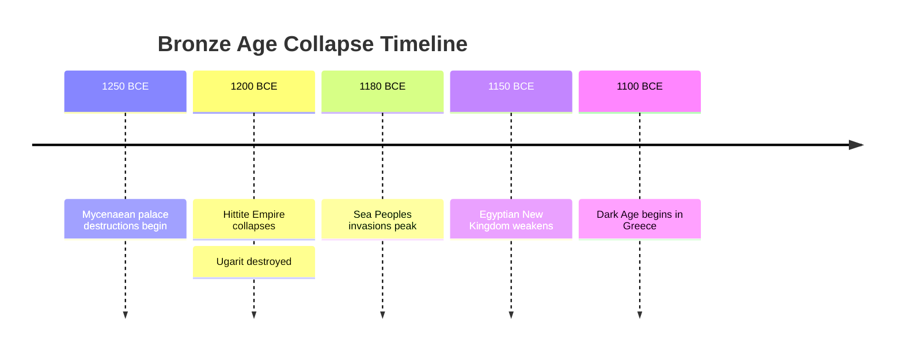
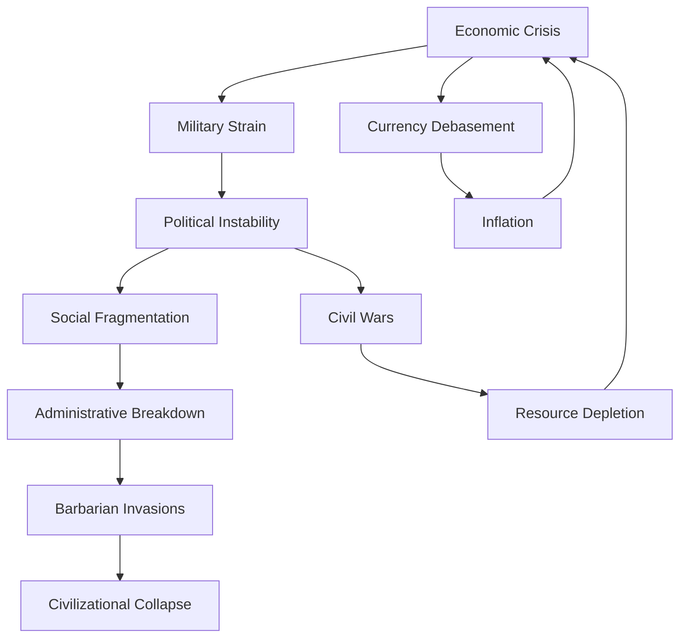
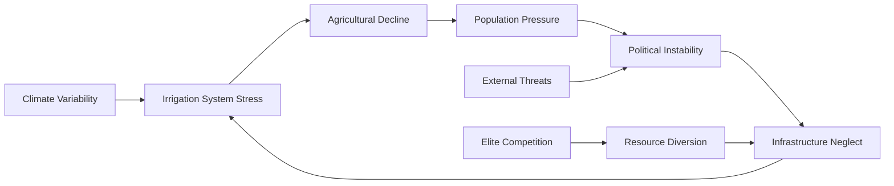
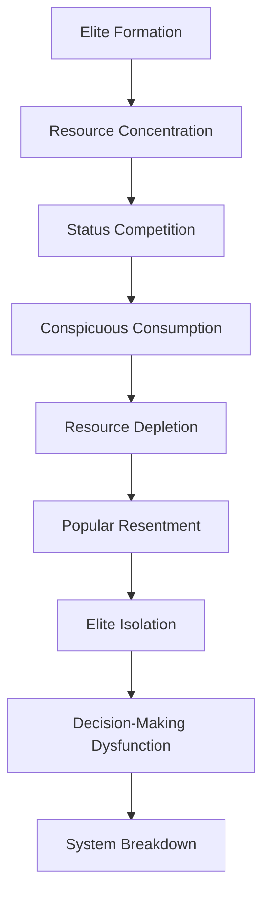

# Civilizational Collapse: Patterns of Societal Breakdown Across History

## Abstract

Civilizational collapse represents one of humanity's most profound and recurring failures—the systematic breakdown of complex societies that have taken centuries or millennia to develop. This analysis examines the patterns, mechanisms, and psychological foundations underlying societal collapse across diverse historical contexts, revealing disturbing consistencies in how human civilizations self-destruct despite their apparent sophistication and accumulated knowledge.

## Introduction

The collapse of civilizations is not merely a historical curiosity but a fundamental expression of intrinsic human limitations operating at scale. From the Bronze Age collapse around 1200 BCE to the ongoing challenges facing contemporary global civilization, the patterns of societal breakdown reveal deep-seated psychological, social, and systemic vulnerabilities that transcend cultural and temporal boundaries.

## Theoretical Framework

### Systems Theory Perspective

Civilizations function as complex adaptive systems characterized by:
- **Hierarchical organization** with multiple interdependent subsystems
- **Emergent properties** that arise from component interactions
- **Feedback loops** that can amplify both stability and instability
- **Critical thresholds** beyond which system collapse becomes inevitable

### Psychological Foundations of Collapse

The psychological mechanisms underlying civilizational collapse operate at both individual and collective levels, creating systematic vulnerabilities that persist across different cultures and historical periods. Understanding these mechanisms is crucial for recognizing why sophisticated societies repeatedly make decisions that lead to their own destruction.

| Mechanism | Description | Manifestation |
|-----------|-------------|---------------|
| **Cognitive Overconfidence** | Belief in perpetual growth and invulnerability | Ignoring warning signs, overextension |
| **Temporal Discounting** | Preference for immediate over long-term benefits | Environmental degradation, debt accumulation |
| **Elite Capture** | Concentration of power and resources | Inequality, institutional corruption |
| **Social Fragmentation** | Loss of collective identity and cooperation | Political polarization, civil conflict |
| **Complexity Trap** | Systems becoming too complex to manage | Administrative paralysis, cascading failures |

**Cognitive Overconfidence** represents perhaps the most dangerous psychological mechanism in civilizational collapse. This **Description** of **Belief in perpetual growth and invulnerability** reflects the human tendency to extrapolate from recent success to assume permanent superiority. The **Manifestation** includes **Ignoring warning signs** (dismissing evidence of systemic problems) and **Overextension** (expanding beyond sustainable limits based on overconfident projections).

This mechanism operates through what psychologists call the "illusion of control"—the tendency to overestimate one's ability to influence outcomes. In civilizational contexts, this leads to hubris where societies believe they have transcended natural limits or historical patterns. As historian Arnold Toynbee observed in "A Study of History," civilizations typically collapse not from external conquest but from internal failure to respond creatively to challenges, often due to overconfidence in existing solutions.

**Temporal Discounting** reflects the systematic human tendency to prioritize immediate benefits over long-term costs, a bias that becomes catastrophic when applied to civilizational-scale decisions. The **Description** of **Preference for immediate over long-term benefits** operates through the same psychological mechanisms that cause individuals to make poor personal decisions, but with consequences that affect entire societies. **Manifestations** include **Environmental degradation** (exploiting natural resources for immediate economic gain) and **Debt accumulation** (borrowing against future generations to fund current consumption).

This mechanism explains why civilizations consistently fail to address long-term challenges like resource depletion, environmental degradation, and infrastructure maintenance. The psychological research on hyperbolic discounting shows that humans systematically undervalue future consequences, with discount rates that make long-term costs appear negligible compared to immediate benefits.

**Elite Capture** occurs when ruling classes prioritize their own interests over societal welfare, leading to the **Concentration of power and resources** that undermines social cohesion and institutional effectiveness. **Manifestations** include **Inequality** (growing gaps between elites and masses) and **Institutional corruption** (using public institutions for private benefit).

This mechanism operates through what economists call "rent-seeking behavior"—using political power to extract wealth rather than create it. Elite capture becomes particularly dangerous during civilizational stress, when societies most need effective leadership and collective action. Instead, elites often respond to crisis by intensifying extraction from the broader population, accelerating collapse.

**Social Fragmentation** represents the breakdown of collective identity and shared purpose that holds civilizations together. The **Description** of **Loss of collective identity and cooperation** reflects the erosion of social bonds that enable large-scale coordination. **Manifestations** include **Political polarization** (society dividing into hostile factions) and **Civil conflict** (internal violence replacing peaceful dispute resolution).

This mechanism connects to research on social identity theory and in-group/out-group psychology. As civilizations become more complex and diverse, maintaining shared identity becomes more difficult. When external pressures increase, societies often fragment along ethnic, religious, or class lines rather than uniting to address common challenges.

**Complexity Trap** occurs when civilizations develop **Systems becoming too complex to manage**, exceeding human cognitive and organizational capacity. **Manifestations** include **Administrative paralysis** (inability to make necessary decisions) and **Cascading failures** (problems in one system triggering failures throughout the civilization).

This mechanism reflects fundamental limits in human cognitive architecture and organizational capacity. As archaeologist Joseph Tainter argues in "The Collapse of Complex Societies," civilizations tend to solve problems by adding complexity, but eventually reach a point where the costs of complexity exceed its benefits, leading to collapse or simplification.

## Historical Analysis of Major Collapses

### Bronze Age Collapse (c. 1200-1150 BCE)

The Bronze Age collapse represents one of history's most dramatic examples of simultaneous civilizational failure across the Eastern Mediterranean.

#### Collapse Timeline

#### Causal Factors Analysis

| Factor Category | Specific Causes | Psychological Roots |
|----------------|-----------------|-------------------|
| **Environmental** | Climate change, drought, famine | Failure to adapt, short-term thinking |
| **Economic** | Trade network collapse, resource depletion | Overspecialization, growth dependency |
| **Military** | Sea Peoples invasions, internal warfare | Tribal psychology, zero-sum thinking |
| **Political** | Elite competition, administrative breakdown | Power struggles, institutional decay |
| **Social** | Population movements, cultural disruption | In-group/out-group dynamics |

### Roman Empire Collapse (3rd-5th centuries CE)

The fall of Rome exemplifies how internal contradictions and psychological failures can destroy even the most powerful civilizations.

#### Collapse Mechanisms

#### Psychological Pathologies in Roman Decline

1. **Elite Decadence**: Loss of civic virtue and public service orientation
2. **Military Professionalization**: Disconnect between citizens and defense
3. **Religious Transformation**: Shift from civic to otherworldly focus
4. **Bureaucratic Sclerosis**: Administrative complexity exceeding management capacity
5. **Cultural Fragmentation**: Loss of shared identity and values

### Maya Civilization Collapse (8th-9th centuries CE)

The Maya collapse demonstrates how environmental pressures interact with social pathologies to destroy sophisticated civilizations.

#### Environmental-Social Feedback Loop

| Environmental Stress | Social Response | Psychological Driver | Outcome |
|---------------------|-----------------|-------------------|---------|
| Drought periods | Increased warfare | Resource competition | Population decline |
| Soil depletion | Agricultural intensification | Short-term optimization | Environmental degradation |
| Deforestation | Elite monument building | Status competition | Ecological collapse |
| Water scarcity | Political centralization | Control seeking | Social rigidity |

### Khmer Empire Collapse (13th-15th centuries CE)

The fall of Angkor illustrates how hydraulic civilizations face unique vulnerabilities.

#### Infrastructure Dependency Cascade

## Comparative Analysis of Collapse Patterns

### Universal Collapse Characteristics

Despite vast differences in time, geography, and culture, civilizational collapses share remarkable similarities:

#### Phase 1: Growth and Expansion
- **Psychological State**: Optimism, confidence, expansion mindset
- **Behavioral Patterns**: Territorial expansion, population growth, technological development
- **Systemic Features**: Increasing complexity, specialization, trade networks

#### Phase 2: Peak and Overextension
- **Psychological State**: Overconfidence, denial of limits
- **Behavioral Patterns**: Overexploitation of resources, military overstretch, elite competition
- **Systemic Features**: Maximum complexity, resource strain, diminishing returns

#### Phase 3: Stress and Fragmentation
- **Psychological State**: Anxiety, scapegoating, nostalgia for past glory
- **Behavioral Patterns**: Internal conflict, blame attribution, conservative retrenchment
- **Systemic Features**: System brittleness, cascade failures, loss of resilience

#### Phase 4: Collapse and Transformation
- **Psychological State**: Despair, fatalism, adaptation to new reality
- **Behavioral Patterns**: Population decline, simplification, cultural transformation
- **Systemic Features**: System breakdown, reorganization at lower complexity

### Collapse Typology

| Collapse Type | Characteristics | Examples | Psychological Drivers |
|---------------|----------------|----------|---------------------|
| **Sudden** | Rapid system failure | Mycenaean Greece | Shock response, panic |
| **Gradual** | Slow decline over centuries | Western Roman Empire | Adaptation failure, drift |
| **Cyclical** | Repeated collapse-recovery | Chinese dynasties | Institutional decay cycles |
| **Partial** | Regional breakdown | Maya city-states | Localized stress responses |
| **Total** | Complete civilizational end | Easter Island | Resource exhaustion |

## Psychological Mechanisms of Collapse

### Cognitive Biases in Civilizational Decision-Making

#### Optimism Bias and Growth Assumptions
Civilizations consistently overestimate their ability to continue growth indefinitely:
- **Linear projection fallacy**: Assuming past trends will continue
- **Technological optimism**: Believing innovation will solve all problems
- **Exceptionalism**: Thinking "this time is different"

#### Temporal Discounting and Short-Term Thinking
The preference for immediate benefits over long-term sustainability:
- **Political cycles**: Leaders optimizing for electoral success
- **Economic pressures**: Quarterly profit maximization
- **Individual psychology**: Present bias affecting collective decisions

#### Complexity Illusion and Management Hubris
The belief that complex systems can be fully controlled and managed:
- **Planning fallacy**: Underestimating complexity and unintended consequences
- **Control illusion**: Overestimating ability to manage complex systems
- **Expert overconfidence**: Specialists missing systemic interactions

### Social Psychology of Decline

#### Elite Pathologies
Ruling classes consistently develop dysfunctional patterns:

#### Mass Psychology in Crisis
Population responses to civilizational stress follow predictable patterns:
- **Scapegoating**: Blaming minorities or external groups
- **Nostalgia**: Idealizing past periods of stability
- **Authoritarianism**: Supporting strong leaders promising simple solutions
- **Fragmentation**: Retreat into tribal or regional identities

## Contemporary Implications

### Modern Civilizational Vulnerabilities

Contemporary global civilization exhibits many classic pre-collapse indicators:

| Vulnerability | Historical Parallel | Psychological Mechanism |
|---------------|-------------------|------------------------|
| **Climate Change** | Maya drought, Roman climate shift | Temporal discounting, denial |
| **Inequality** | Roman elite concentration | Status competition, zero-sum thinking |
| **Complexity** | Byzantine bureaucracy | Control illusion, specialization trap |
| **Resource Depletion** | Easter Island deforestation | Tragedy of commons, short-term optimization |
| **Political Polarization** | Late Roman civil wars | Tribal psychology, confirmation bias |

### Technological Amplification of Collapse Risk

Modern technology creates new pathways for civilizational failure:
- **Systemic interconnection**: Global networks create cascade failure risks
- **Information overload**: Cognitive limitations in processing complexity
- **Technological dependency**: Loss of resilience through specialization
- **Acceleration**: Faster pace of change exceeding adaptation capacity

## Mitigation Strategies and Limitations

### Historical Attempts at Collapse Prevention

Civilizations have repeatedly attempted to prevent decline through:

#### Institutional Reforms
- **Roman Diocletian reforms**: Administrative reorganization and price controls
- **Chinese dynastic cycles**: Periodic renewal through revolution
- **Maya political decentralization**: Adaptation to environmental stress

#### Cultural Adaptations
- **Religious transformation**: New belief systems providing social cohesion
- **Technological innovation**: Attempting to solve resource constraints
- **Military reorganization**: Adapting to new threats and challenges

### Psychological Barriers to Prevention

Despite awareness of collapse patterns, civilizations consistently fail to prevent decline due to:

#### Collective Action Problems
- **Free rider effects**: Individuals avoiding costs of prevention
- **Coordination failures**: Inability to organize collective responses
- **Time horizon mismatches**: Short-term incentives vs. long-term needs

#### Cognitive Limitations
- **Complexity blindness**: Inability to comprehend systemic interactions
- **Normalcy bias**: Assumption that current conditions will continue
- **Sunk cost fallacy**: Continuing failed strategies due to past investment

## Conclusion

The study of civilizational collapse reveals fundamental limitations in human psychology and social organization that transcend cultural and historical boundaries. Despite vast differences in technology, geography, and social structure, civilizations repeatedly exhibit the same pathological patterns leading to breakdown and collapse.

These patterns suggest that civilizational collapse is not merely a historical accident but an expression of deep-seated psychological and social vulnerabilities inherent to human nature. The cognitive biases, social dynamics, and institutional pathologies that drive collapse appear to be universal features of human civilization, making collapse not just possible but probable over sufficient time scales.

Understanding these patterns provides crucial insights for contemporary civilization, which faces unprecedented global challenges while exhibiting many classic pre-collapse indicators. However, the psychological mechanisms that drive collapse also create barriers to prevention, suggesting that avoiding civilizational breakdown requires not just knowledge but fundamental changes in human psychology and social organization that may be beyond our current capabilities.

The recurring nature of civilizational collapse across history serves as a sobering reminder of the fragility of human achievements and the persistent power of our psychological limitations to undermine even our greatest accomplishments.

## References

1. Tainter, J. A. (1988). *The Collapse of Complex Societies*. Cambridge University Press.
2. Diamond, J. (2005). *Collapse: How Societies Choose to Fail or Succeed*. Viking Press.
3. Yoffee, N., & Cowgill, G. L. (Eds.). (1988). *The Collapse of Ancient States and Civilizations*. University of Arizona Press.
4. Cline, E. H. (2014). *1177 B.C.: The Year Civilization Collapsed*. Princeton University Press.
5. Middleton, G. D. (2017). *Understanding Collapse: Ancient History and Modern Myths*. Cambridge University Press.

---

*[See: Individual Psychology → Cognitive Biases] [Related: Group Dynamics → Elite Pathologies] [Compare: Societal Analysis → Political Systems Failure]*