# Pandemic and Crisis Response: Human Behavioral Failures Under Existential Threat

## Abstract

Pandemics and existential crises reveal fundamental flaws in human psychology and social organization that persist across cultures and historical periods. Despite facing threats to survival itself, human societies consistently exhibit predictable patterns of denial, panic, scapegoating, and institutional failure that often exacerbate the very crises they attempt to address. This analysis examines the psychological and sociological mechanisms underlying dysfunctional crisis responses, from the Black Death to COVID-19, revealing how cognitive biases, social dynamics, and institutional pathologies combine to undermine effective collective action precisely when it is most needed for survival.

## Introduction

The response to existential threats represents one of the most revealing tests of human psychology and social organization. While evolutionary theory might predict that survival threats would trigger optimal adaptive responses, historical evidence demonstrates the opposite: crises consistently expose and amplify the worst aspects of human nature, leading to responses that often increase rather than decrease mortality and suffering.

## Theoretical Framework

### Crisis Psychology Fundamentals

#### Cognitive Responses to Existential Threat

When faced with existential threats, human cognition exhibits systematic biases that consistently impair effective crisis response. These biases represent evolutionary adaptations that served our ancestors well in small-scale, immediate threats but become maladaptive when dealing with complex, large-scale, or long-term crises.

Human cognition under extreme threat exhibits systematic biases that impair effective response:

| Bias Type | Description | Crisis Manifestation |
|-----------|-------------|-------------------|
| **Normalcy Bias** | Assumption that conditions will remain normal | Denial of threat severity |
| **Optimism Bias** | Overestimation of positive outcomes | Underestimation of personal risk |
| **Availability Heuristic** | Overweighting recent/vivid information | Panic from dramatic cases |
| **Confirmation Bias** | Selective attention to supporting evidence | Conspiracy theory adoption |
| **Planning Fallacy** | Underestimation of time and resources needed | Inadequate preparation |

**Normalcy Bias** causes people to assume that life will continue as usual even when facing clear evidence of existential threat. During the early stages of COVID-19, many individuals and institutions continued normal activities despite mounting evidence of pandemic spread, demonstrating how this bias prevents appropriate threat recognition.

**Optimism Bias** leads people to believe they are less likely than others to experience negative outcomes, creating dangerous underestimation of personal risk. This explains why people continue risky behaviors during crises, believing "it won't happen to me" despite statistical evidence to the contrary.

**Availability Heuristic** causes people to overweight vivid, recent, or emotionally salient information when assessing risk. During pandemics, dramatic media coverage of severe cases can trigger panic responses that are disproportionate to actual risk levels, while less vivid but more common outcomes are underestimated.

**Confirmation Bias** drives selective attention to information that supports existing beliefs, leading to conspiracy theory adoption during crises when official explanations seem inadequate or threatening. People seek information that confirms their preferred interpretation of events rather than objectively evaluating evidence.

**Planning Fallacy** causes systematic underestimation of the time, resources, and effort required to address complex problems. This bias explains why crisis preparations are consistently inadequate and why response efforts repeatedly fall short of what is actually needed.

#### Emotional Regulation Under Stress

This diagram illustrates the cascade of psychological responses that occur when humans face existential threats, showing how normal emotional regulation systems become overwhelmed and produce maladaptive behaviors precisely when effective response is most crucial for survival.

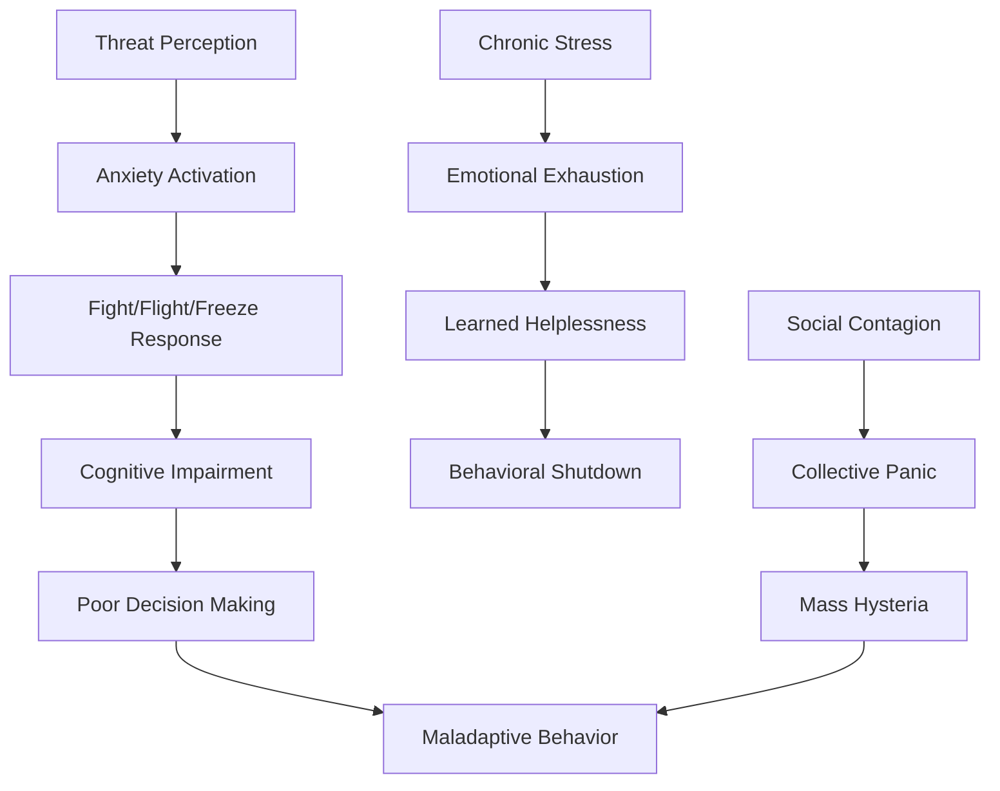
```mermaid
graph TD
    A[Threat Perception] --> B[Anxiety Activation]
    B --> C[Fight/Flight/Freeze Response]
    C --> D[Cognitive Impairment]
    D --> E[Poor Decision Making]
    E --> F[Maladaptive Behavior]
    
    G[Chronic Stress] --> H[Emotional Exhaustion]
    H --> I[Learned Helplessness]
    I --> J[Behavioral Shutdown]
    
    K[Social Contagion] --> L[Collective Panic]
    L --> M[Mass Hysteria]
    M --> F
```

The primary pathway shows how **Threat Perception** triggers **Anxiety Activation**, which evolved to mobilize resources for immediate physical dangers. However, this system produces **Fight/Flight/Freeze Responses** that are poorly suited to complex, long-term threats like pandemics. The resulting **Cognitive Impairment** reduces capacity for rational analysis and planning, leading to **Poor Decision Making** and ultimately **Maladaptive Behavior** that often worsens the crisis.

The **Chronic Stress** pathway demonstrates what happens when threats persist over extended periods. **Emotional Exhaustion** develops as psychological resources become depleted, leading to **Learned Helplessness** where individuals stop trying to influence outcomes. This culminates in **Behavioral Shutdown** where people become passive and disengaged precisely when active participation in crisis response is most needed.

The **Social Contagion** pathway shows how individual emotional responses spread through social networks, creating **Collective Panic** that can escalate into **Mass Hysteria**. This social amplification of fear and anxiety can produce group behaviors that are far more destructive than individual responses, such as panic buying, social unrest, or mass exodus from affected areas.

These interconnected pathways explain why crisis responses consistently exhibit patterns of initial denial, followed by panic, and often ending in exhaustion and disengagement—a sequence that undermines effective collective action when it is most needed for survival.

### Social Psychology of Crisis Response

#### Group Behavior Under Threat

Crisis situations activate primitive social psychological mechanisms:

| Mechanism | Function | Crisis Dysfunction |
|-----------|----------|-------------------|
| **In-group Cohesion** | Mutual protection | Exclusion of outsiders |
| **Authority Deference** | Coordinated response | Blind obedience |
| **Scapegoating** | Blame attribution | Minority persecution |
| **Conformity Pressure** | Group unity | Dissent suppression |
| **Social Proof** | Behavioral guidance | Panic contagion |

#### Institutional Responses

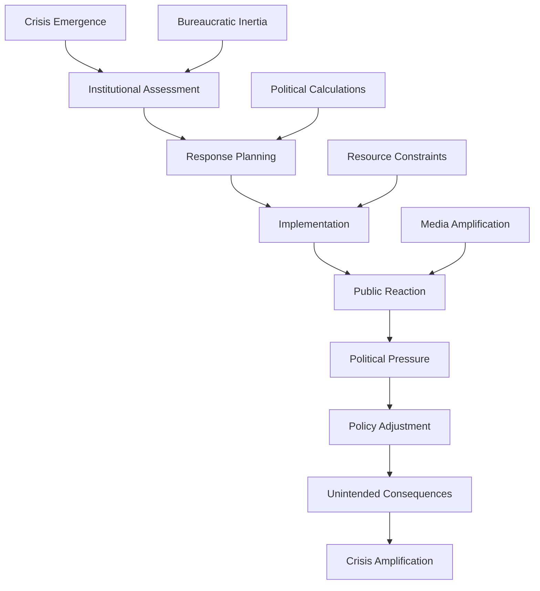
```mermaid
flowchart TD
    A[Crisis Emergence] --> B[Institutional Assessment]
    B --> C[Response Planning]
    C --> D[Implementation]
    D --> E[Public Reaction]
    E --> F[Political Pressure]
    F --> G[Policy Adjustment]
    G --> H[Unintended Consequences]
    H --> I[Crisis Amplification]
    
    J[Bureaucratic Inertia] --> B
    K[Political Calculations] --> C
    L[Resource Constraints] --> D
    M[Media Amplification] --> E
```

## Historical Analysis of Pandemic Responses

### The Black Death (1347-1351)

The bubonic plague pandemic killed an estimated 30-60% of Europe's population, revealing fundamental patterns of crisis response that persist today.

#### Psychological Responses

##### Denial and Minimization Phase

| Response Type | Manifestation | Psychological Driver |
|---------------|---------------|-------------------|
| **Religious Explanation** | Divine punishment interpretation | Meaning-making need |
| **Miasma Theory** | Bad air causation belief | Causal attribution bias |
| **Scapegoating** | Jewish persecution | Blame displacement |
| **Normalcy Maintenance** | Continued social activities | Denial mechanism |

##### Panic and Breakdown Phase

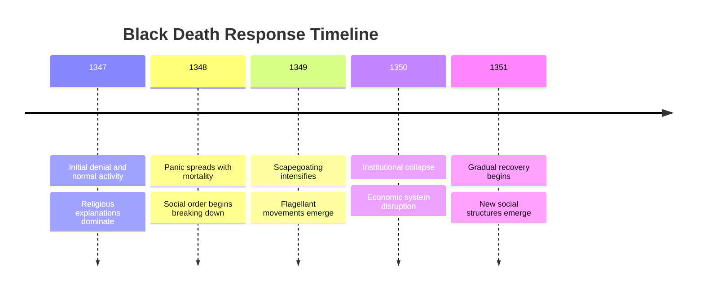
```mermaid
timeline
    title Black Death Response Timeline
    1347 : Initial denial and normal activity
         : Religious explanations dominate
    1348 : Panic spreads with mortality
         : Social order begins breaking down
    1349 : Scapegoating intensifies
         : Flagellant movements emerge
    1350 : Institutional collapse
         : Economic system disruption
    1351 : Gradual recovery begins
         : New social structures emerge
```

#### Social Responses

##### Scapegoating Mechanisms

The persecution of Jews during the Black Death exemplifies crisis scapegoating:

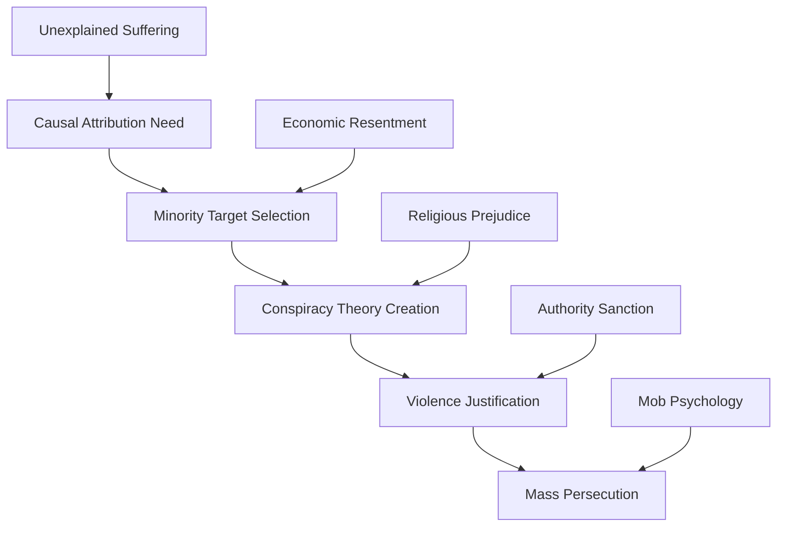
```mermaid
graph TD
    A[Unexplained Suffering] --> B[Causal Attribution Need]
    B --> C[Minority Target Selection]
    C --> D[Conspiracy Theory Creation]
    D --> E[Violence Justification]
    E --> F[Mass Persecution]
    
    G[Economic Resentment] --> C
    H[Religious Prejudice] --> D
    I[Authority Sanction] --> E
    J[Mob Psychology] --> F
```

##### Institutional Breakdown

| Institution | Breakdown Mechanism | Consequence |
|-------------|-------------------|-------------|
| **Church** | Clergy mortality, faith crisis | Spiritual authority loss |
| **Government** | Administrative collapse | Social order breakdown |
| **Economy** | Labor shortage, trade disruption | Economic transformation |
| **Family** | High mortality rates | Social structure change |

### The 1918 Influenza Pandemic

The "Spanish flu" pandemic provides crucial insights into modern crisis response patterns:

#### Government Responses

##### Information Control and Censorship

Wartime censorship created information vacuums that amplified panic:

| Country | Censorship Approach | Psychological Impact |
|---------|-------------------|-------------------|
| **United States** | Minimization, optimistic messaging | False security, delayed response |
| **Britain** | Military censorship priority | Public confusion |
| **Germany** | Complete information suppression | Rumor proliferation |
| **Spain** | Neutral, more open reporting | "Spanish flu" attribution |

##### Public Health Measures

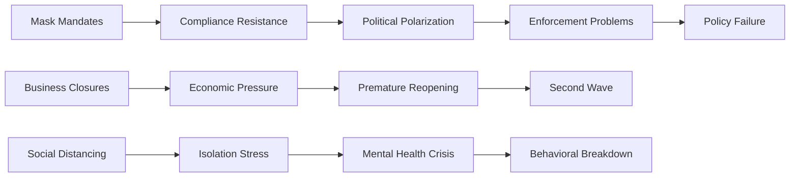
```mermaid
flowchart LR
    A[Mask Mandates] --> B[Compliance Resistance]
    B --> C[Political Polarization]
    C --> D[Enforcement Problems]
    D --> E[Policy Failure]
    
    F[Business Closures] --> G[Economic Pressure]
    G --> H[Premature Reopening]
    H --> I[Second Wave]
    
    J[Social Distancing] --> K[Isolation Stress]
    K --> L[Mental Health Crisis]
    L --> M[Behavioral Breakdown]
```

#### Social Responses

##### Community Breakdown Patterns

| Response Type | Manifestation | Psychological Mechanism |
|---------------|---------------|------------------------|
| **Mutual Aid** | Neighborhood support | Altruistic cooperation |
| **Social Fragmentation** | Community isolation | Self-preservation instinct |
| **Blame Attribution** | Immigrant scapegoating | Out-group hostility |
| **Denial Behavior** | Continued gatherings | Normalcy bias |

### The 2020 COVID-19 Pandemic

The COVID-19 pandemic provides the most detailed case study of modern crisis response psychology:

#### Initial Response Patterns

##### Denial and Minimization (January-March 2020)

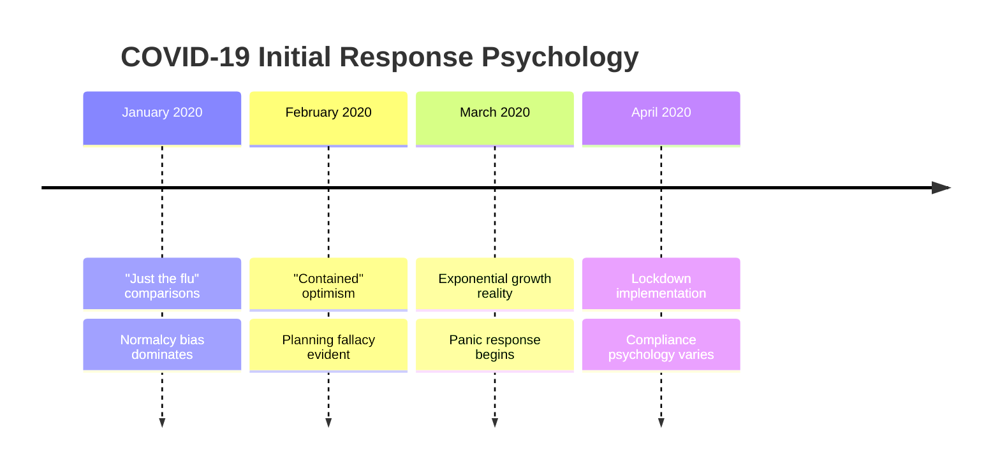
```mermaid
timeline
    title COVID-19 Initial Response Psychology
    January 2020 : "Just the flu" comparisons
                 : Normalcy bias dominates
    February 2020 : "Contained" optimism
                  : Planning fallacy evident
    March 2020 : Exponential growth reality
               : Panic response begins
    April 2020 : Lockdown implementation
               : Compliance psychology varies
```

##### Cognitive Biases in Action

| Bias | Manifestation | Impact |
|------|---------------|--------|
| **Exponential Growth Blindness** | Linear thinking about viral spread | Delayed response |
| **Probability Neglect** | Ignoring low-probability high-impact events | Inadequate preparation |
| **Overconfidence** | Belief in control and preparedness | System vulnerabilities |
| **Temporal Discounting** | Present bias over future consequences | Short-term thinking |

#### Political Polarization of Crisis Response

##### Partisan Psychology

COVID-19 response became politically polarized, demonstrating how crisis responses can be captured by tribal psychology:

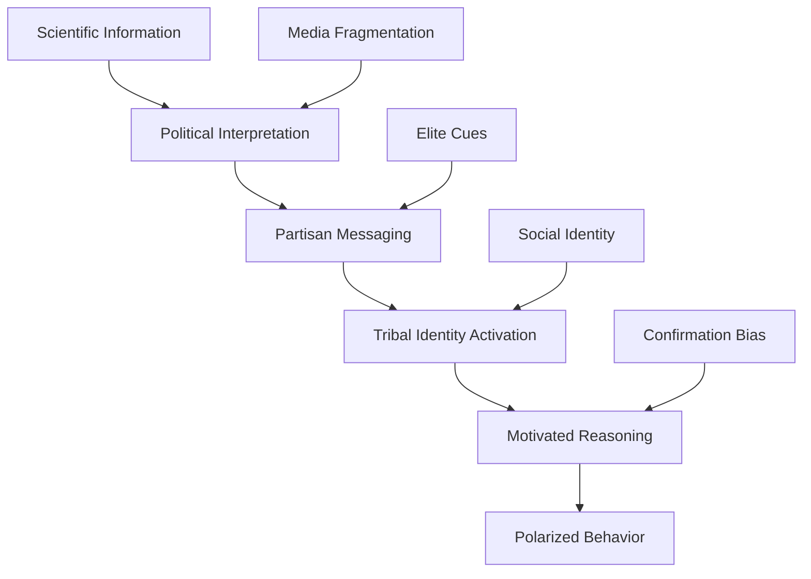
```mermaid
graph TD
    A[Scientific Information] --> B[Political Interpretation]
    B --> C[Partisan Messaging]
    C --> D[Tribal Identity Activation]
    D --> E[Motivated Reasoning]
    E --> F[Polarized Behavior]
    
    G[Media Fragmentation] --> B
    H[Elite Cues] --> C
    I[Social Identity] --> D
    J[Confirmation Bias] --> E
```

##### Compliance Psychology

| Factor | High Compliance | Low Compliance |
|--------|----------------|---------------|
| **Trust in Authority** | High institutional trust | Authority skepticism |
| **Risk Perception** | Personal vulnerability awareness | Invulnerability illusion |
| **Social Norms** | Community cooperation | Individual freedom priority |
| **Political Identity** | Collective responsibility | Personal liberty emphasis |

#### Information Warfare and Conspiracy Theories

##### Infodemic Dynamics

The COVID-19 "infodemic" demonstrates how information chaos amplifies crisis dysfunction:

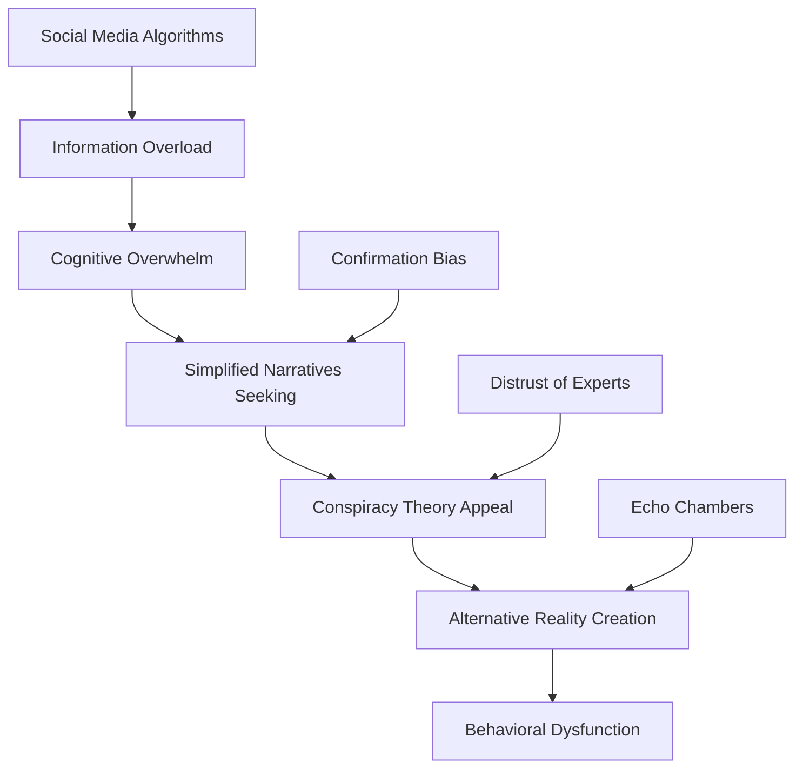
```mermaid
flowchart TD
    A[Information Overload] --> B[Cognitive Overwhelm]
    B --> C[Simplified Narratives Seeking]
    C --> D[Conspiracy Theory Appeal]
    D --> E[Alternative Reality Creation]
    E --> F[Behavioral Dysfunction]
    
    G[Social Media Algorithms] --> A
    H[Confirmation Bias] --> C
    I[Distrust of Experts] --> D
    J[Echo Chambers] --> E
```

##### Conspiracy Theory Psychology

| Theory Type | Psychological Appeal | Behavioral Impact |
|-------------|-------------------|------------------|
| **Lab Origin** | Agency attribution | China blame |
| **Planned Pandemic** | Control illusion | Government distrust |
| **Vaccine Microchips** | Technology fear | Vaccination refusal |
| **Population Control** | Elite conspiracy | Resistance behavior |

## Crisis Response Institutional Failures

### Healthcare System Breakdowns

#### Capacity Limitations

Healthcare systems consistently fail to prepare for surge capacity:

| Limitation Type | Cause | Psychological Factor |
|----------------|-------|-------------------|
| **Bed Shortage** | Cost optimization | Present bias |
| **Staff Burnout** | Chronic understaffing | Planning fallacy |
| **Supply Chain** | Just-in-time efficiency | Normalcy bias |
| **Coordination** | Fragmented systems | Complexity blindness |

#### Medical Professional Psychology

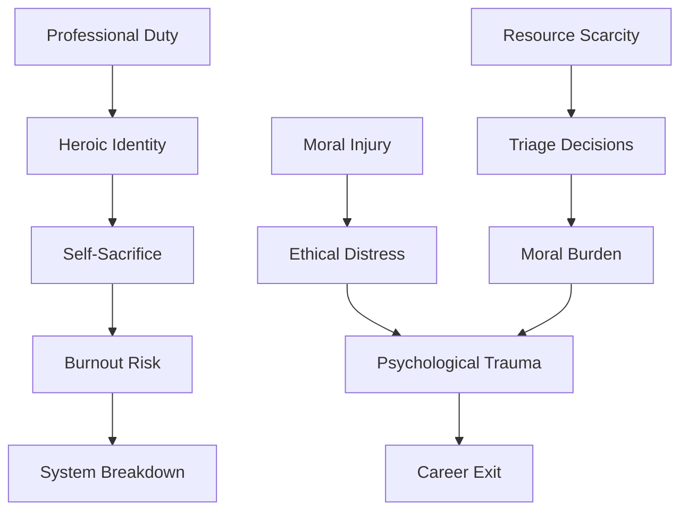
```mermaid
graph TD
    A[Professional Duty] --> B[Heroic Identity]
    B --> C[Self-Sacrifice]
    C --> D[Burnout Risk]
    D --> E[System Breakdown]
    
    F[Moral Injury] --> G[Ethical Distress]
    G --> H[Psychological Trauma]
    H --> I[Career Exit]
    
    J[Resource Scarcity] --> K[Triage Decisions]
    K --> L[Moral Burden]
    L --> H
```

### Economic Response Failures

#### Policy Trade-offs

Crisis economic responses reveal systematic biases in policy-making:

| Policy Area | Bias | Dysfunction |
|-------------|------|-------------|
| **Lockdown Timing** | Temporal discounting | Too late implementation |
| **Business Support** | Status quo bias | Inadequate innovation |
| **Unemployment** | Availability heuristic | Visible vs. hidden costs |
| **Reopening** | Optimism bias | Premature relaxation |

#### Inequality Amplification

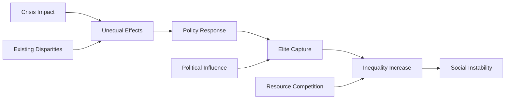
```mermaid
flowchart LR
    A[Crisis Impact] --> B[Unequal Effects]
    B --> C[Policy Response]
    C --> D[Elite Capture]
    D --> E[Inequality Increase]
    E --> F[Social Instability]
    
    G[Existing Disparities] --> B
    H[Political Influence] --> D
    I[Resource Competition] --> E
```

### Political Response Pathologies

#### Leadership Psychology Under Crisis

| Leadership Type | Crisis Behavior | Psychological Driver |
|----------------|-----------------|-------------------|
| **Authoritarian** | Power consolidation | Control seeking |
| **Populist** | Blame deflection | Responsibility avoidance |
| **Technocratic** | Expert deference | Competence signaling |
| **Charismatic** | Confidence projection | Image management |

#### Democratic Dysfunction

Crisis responses reveal fundamental problems in democratic decision-making:

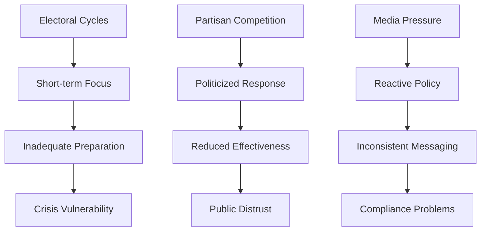
```mermaid
graph TD
    A[Electoral Cycles] --> B[Short-term Focus]
    B --> C[Inadequate Preparation]
    C --> D[Crisis Vulnerability]
    
    E[Partisan Competition] --> F[Politicized Response]
    F --> G[Reduced Effectiveness]
    G --> H[Public Distrust]
    
    I[Media Pressure] --> J[Reactive Policy]
    J --> K[Inconsistent Messaging]
    K --> L[Compliance Problems]
```

## Psychological Mechanisms of Crisis Dysfunction

### Individual-Level Mechanisms

#### Stress Response Pathology

Chronic crisis stress creates systematic psychological dysfunction:

| Stress Phase | Psychological State | Behavioral Impact |
|--------------|-------------------|------------------|
| **Alarm** | Hypervigilance | Overreaction |
| **Resistance** | Adaptation attempt | Resource depletion |
| **Exhaustion** | System breakdown | Behavioral collapse |

#### Coping Mechanism Failures

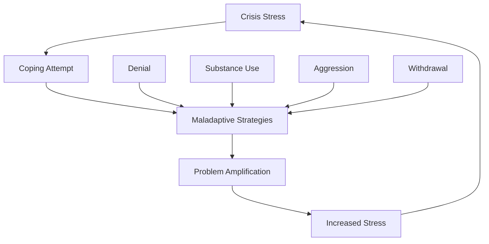
```mermaid
flowchart TD
    A[Crisis Stress] --> B[Coping Attempt]
    B --> C[Maladaptive Strategies]
    C --> D[Problem Amplification]
    D --> E[Increased Stress]
    E --> A
    
    F[Denial] --> C
    G[Substance Use] --> C
    H[Aggression] --> C
    I[Withdrawal] --> C
```

### Group-Level Mechanisms

#### Collective Behavior Pathologies

Crisis situations trigger primitive group behaviors:

| Behavior Type | Trigger | Dysfunction |
|---------------|---------|-------------|
| **Panic** | Threat perception | Stampede behavior |
| **Conformity** | Uncertainty | Groupthink |
| **Scapegoating** | Blame need | Minority persecution |
| **Fragmentation** | Resource competition | Social breakdown |

#### Social Contagion Effects

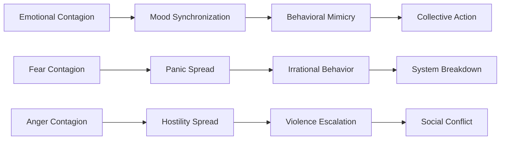
```mermaid
graph LR
    A[Emotional Contagion] --> B[Mood Synchronization]
    B --> C[Behavioral Mimicry]
    C --> D[Collective Action]
    
    E[Fear Contagion] --> F[Panic Spread]
    F --> G[Irrational Behavior]
    G --> H[System Breakdown]
    
    I[Anger Contagion] --> J[Hostility Spread]
    J --> K[Violence Escalation]
    K --> L[Social Conflict]
```

## Comparative Crisis Analysis

### Cross-Cultural Response Patterns

#### Cultural Factors in Crisis Response

| Cultural Dimension | High Score Response | Low Score Response |
|-------------------|-------------------|------------------|
| **Individualism** | Personal responsibility | Collective action |
| **Power Distance** | Authority deference | Egalitarian resistance |
| **Uncertainty Avoidance** | Rule following | Flexible adaptation |
| **Long-term Orientation** | Future planning | Present focus |

#### East vs. West Response Patterns

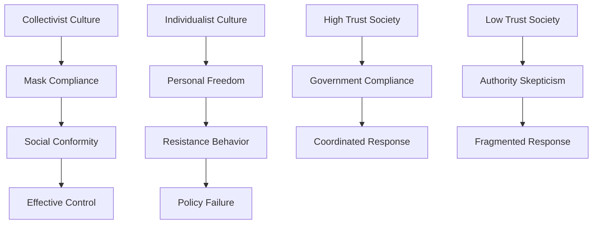
```mermaid
graph TD
    A[Collectivist Culture] --> B[Mask Compliance]
    B --> C[Social Conformity]
    C --> D[Effective Control]
    
    E[Individualist Culture] --> F[Personal Freedom]
    F --> G[Resistance Behavior]
    G --> H[Policy Failure]
    
    I[High Trust Society] --> J[Government Compliance]
    J --> K[Coordinated Response]
    
    L[Low Trust Society] --> M[Authority Skepticism]
    M --> N[Fragmented Response]
```

### Historical Learning Failures

#### Institutional Memory Loss

Why societies fail to learn from previous crises:

| Factor | Mechanism | Impact |
|--------|-----------|--------|
| **Generational Turnover** | Experience loss | Repeated mistakes |
| **Success Complacency** | Overconfidence | Reduced preparation |
| **Institutional Change** | Knowledge loss | Capability degradation |
| **Political Cycles** | Priority shifts | Inconsistent policy |

#### Preparedness Paradox

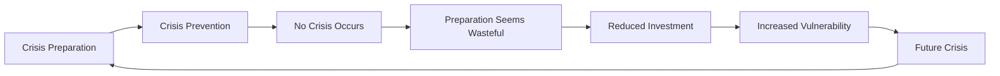
```mermaid
flowchart LR
    A[Crisis Preparation] --> B[Crisis Prevention]
    B --> C[No Crisis Occurs]
    C --> D[Preparation Seems Wasteful]
    D --> E[Reduced Investment]
    E --> F[Increased Vulnerability]
    F --> G[Future Crisis]
    G --> A
```

## Contemporary Crisis Challenges

### Technology and Crisis Response

#### Digital Age Complications

Modern technology creates new crisis response challenges:

| Technology | Benefit | Dysfunction |
|------------|---------|-------------|
| **Social Media** | Rapid information spread | Misinformation amplification |
| **Surveillance** | Contact tracing | Privacy concerns |
| **AI/Algorithms** | Pattern recognition | Bias amplification |
| **Telemedicine** | Remote care | Digital divide |

#### Information Warfare

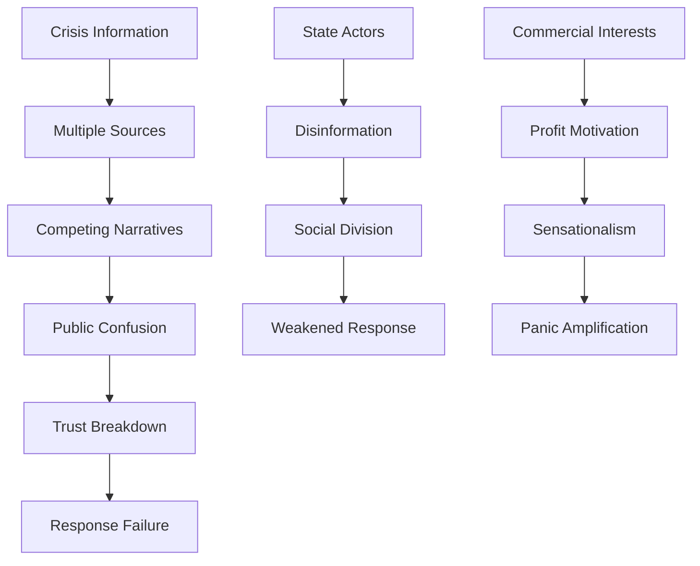
```mermaid
graph TD
    A[Crisis Information] --> B[Multiple Sources]
    B --> C[Competing Narratives]
    C --> D[Public Confusion]
    D --> E[Trust Breakdown]
    E --> F[Response Failure]
    
    G[State Actors] --> H[Disinformation]
    H --> I[Social Division]
    I --> J[Weakened Response]
    
    K[Commercial Interests] --> L[Profit Motivation]
    L --> M[Sensationalism]
    M --> N[Panic Amplification]
```

### Globalization and Crisis Spread

#### Interconnected Vulnerabilities

Global systems create new crisis propagation mechanisms:

| System | Vulnerability | Crisis Amplification |
|--------|---------------|-------------------|
| **Supply Chains** | Single points of failure | Cascade breakdowns |
| **Financial Markets** | Contagion effects | Economic panic |
| **Transportation** | Rapid spread vectors | Global transmission |
| **Information** | Synchronized responses | Coordinated failures |

#### Coordination Challenges

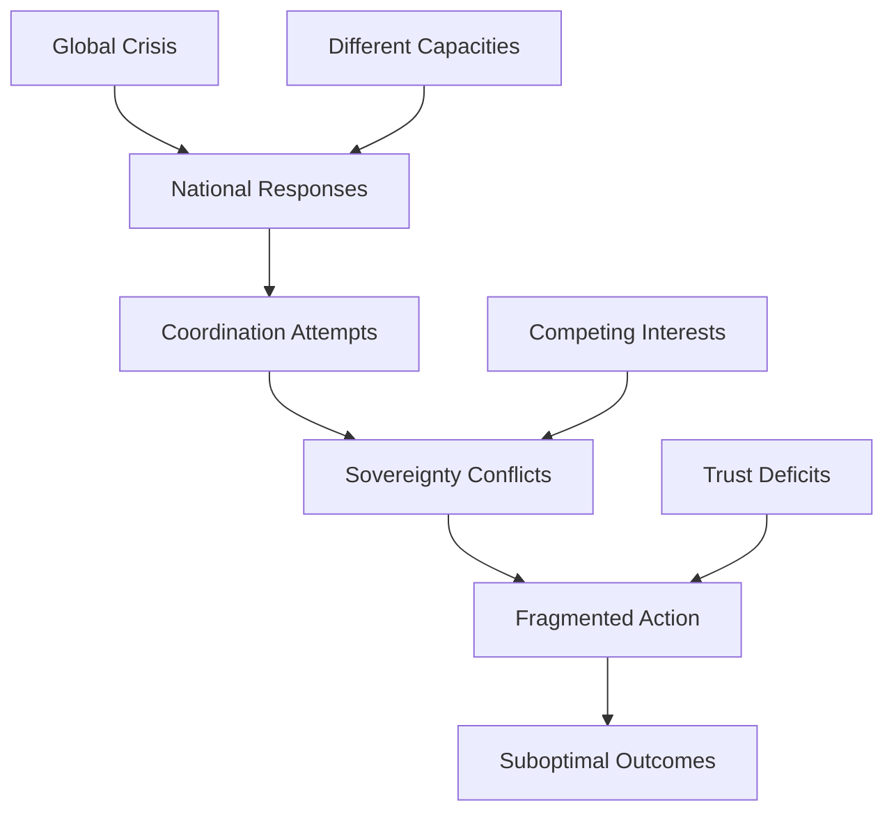
```mermaid
flowchart TD
    A[Global Crisis] --> B[National Responses]
    B --> C[Coordination Attempts]
    C --> D[Sovereignty Conflicts]
    D --> E[Fragmented Action]
    E --> F[Suboptimal Outcomes]
    
    G[Different Capacities] --> B
    H[Competing Interests] --> D
    I[Trust Deficits] --> E
```

## Crisis Response Improvement Strategies

### Individual-Level Interventions

#### Psychological Resilience Building

Strategies for improving individual crisis response:

| Intervention | Target | Mechanism |
|--------------|--------|-----------|
| **Stress Inoculation** | Anxiety management | Gradual exposure |
| **Cognitive Training** | Bias reduction | Metacognitive awareness |
| **Mindfulness Practice** | Emotional regulation | Present-moment focus |
| **Social Support** | Isolation prevention | Connection maintenance |

#### Decision-Making Enhancement

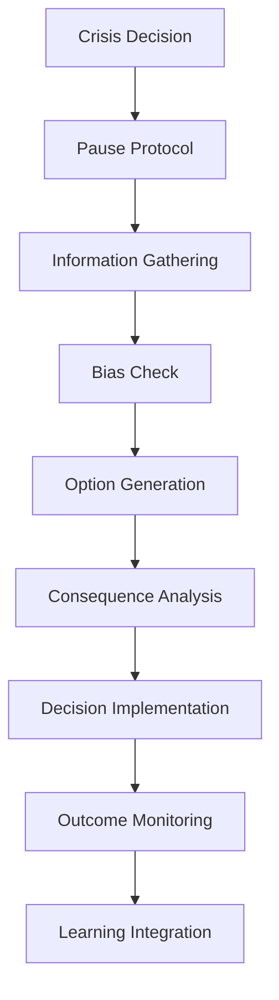
```mermaid
graph TD
    A[Crisis Decision] --> B[Pause Protocol]
    B --> C[Information Gathering]
    C --> D[Bias Check]
    D --> E[Option Generation]
    E --> F[Consequence Analysis]
    F --> G[Decision Implementation]
    G --> H[Outcome Monitoring]
    H --> I[Learning Integration]
```

### Institutional Improvements

#### System Design Principles

| Principle | Implementation | Crisis Benefit |
|-----------|----------------|----------------|
| **Redundancy** | Multiple pathways | Failure resilience |
| **Modularity** | Independent components | Contained failures |
| **Adaptability** | Flexible responses | Rapid adjustment |
| **Transparency** | Open information | Trust maintenance |

#### Preparedness Systems

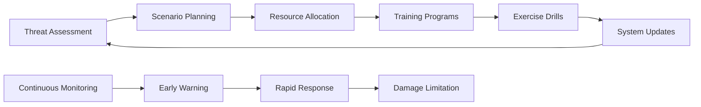
```mermaid
flowchart LR
    A[Threat Assessment] --> B[Scenario Planning]
    B --> C[Resource Allocation]
    C --> D[Training Programs]
    D --> E[Exercise Drills]
    E --> F[System Updates]
    F --> A
    
    G[Continuous Monitoring] --> H[Early Warning]
    H --> I[Rapid Response]
    I --> J[Damage Limitation]
```

### Social-Level Interventions

#### Community Resilience Building

Strategies for improving collective crisis response:

| Strategy | Mechanism | Outcome |
|----------|-----------|---------|
| **Social Capital** | Relationship building | Mutual support |
| **Civic Education** | Knowledge sharing | Informed participation |
| **Leadership Training** | Capacity building | Effective coordination |
| **Communication Systems** | Information flow | Reduced confusion |

#### Trust and Cooperation Enhancement

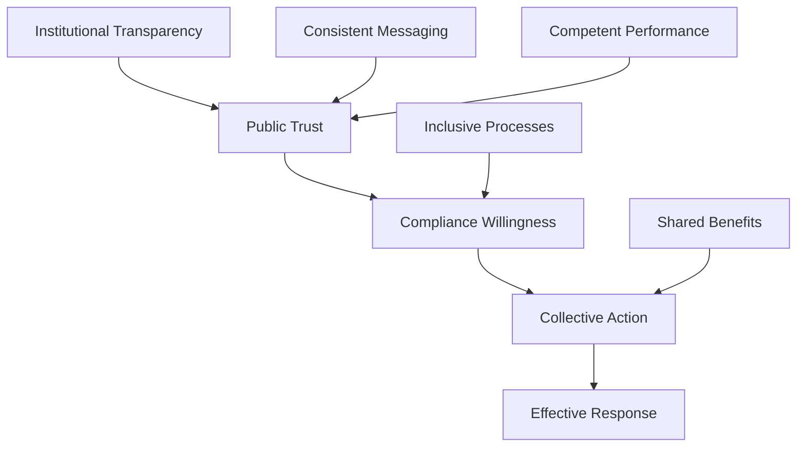
```mermaid
graph TD
    A[Institutional Transparency] --> B[Public Trust]
    B --> C[Compliance Willingness]
    C --> D[Collective Action]
    D --> E[Effective Response]
    
    F[Consistent Messaging] --> B
    G[Competent Performance] --> B
    H[Inclusive Processes] --> C
    I[Shared Benefits] --> D
```

## Limitations of Crisis Response Improvement

### Psychological Constraints

#### Fundamental Human Limitations

Barriers to improving crisis response rooted in human nature:

| Limitation | Description | Improvement Barrier |
|------------|-------------|-------------------|
| **Cognitive Capacity** | Information processing limits | Overwhelm inevitability |
| **Emotional Regulation** | Stress response patterns | Panic susceptibility |
| **Social Psychology** | Group behavior dynamics | Collective irrationality |
| **Temporal Bias** | Present-focused thinking | Long-term planning failure |

#### Evolutionary Mismatch

```mermaid
flowchart LR
    A[Stone Age Brain] --> B[Modern Crises]
    B --> C[Mismatch Problems]
    
    D[Small Group Psychology] --> E[Mass Society Challenges]
    E --> F[Coordination Failures]
    
    G[Immediate Threats] --> H[Long-term Risks]
    H --> I[Preparation Failures]
```

### Structural Constraints

#### System-Level Barriers

Factors that limit crisis response improvement:

| Barrier Type | Mechanism | Impact |
|--------------|-----------|--------|
| **Economic** | Cost-benefit calculations | Underinvestment |
| **Political** | Electoral cycles | Short-term focus |
| **Institutional** | Bureaucratic inertia | Change resistance |
| **Cultural** | Value conflicts | Response fragmentation |

#### Complexity Challenges

```mermaid
graph TD
    A[System Complexity] --> B[Unpredictable Interactions]
    B --> C[Unintended Consequences]
    C --> D[Intervention Failures]
    
    E[Multiple Stakeholders] --> F[Coordination Problems]
    F --> G[Conflicting Actions]
    G --> H[Suboptimal Outcomes]
    
    I[Rapid Change] --> J[Adaptation Lag]
    J --> K[Obsolete Responses]
    K --> L[Crisis Amplification]
```

## Future Crisis Projections

### Emerging Threat Patterns

#### Climate Change Crises

Climate change will create new categories of existential threats:

| Threat Type | Characteristics | Response Challenges |
|-------------|----------------|-------------------|
| **Extreme Weather** | Increasing frequency/intensity | Adaptation vs. mitigation |
| **Sea Level Rise** | Gradual but irreversible | Long-term displacement |
| **Resource Scarcity** | Water/food shortages | Competition and conflict |
| **Ecosystem Collapse** | Biodiversity loss | Irreversible changes |

#### Technological Risks

```mermaid
timeline
    title Emerging Crisis Types
    AI Risks : Artificial general intelligence
             : Alignment problems
    Bioengineering : Synthetic biology risks
                   : Dual-use research
    Cyber Warfare : Infrastructure attacks
                  : Information warfare
    Space Threats : Satellite disruption
                  : Asteroid impacts
```

### Response Evolution Predictions

#### Likely Improvement Areas

| Area | Improvement Driver | Expected Progress |
|------|-------------------|------------------|
| **Technology** | Innovation pressure | Moderate |
| **Coordination** | Globalization needs | Limited |
| **Preparation** | Learning from failures | Slow |
| **Psychology** | Human nature constraints | Minimal |

#### Persistent Vulnerabilities

```mermaid
graph TD
    A[Human Psychology] --> B[Unchanged Biases]
    B --> C[Predictable Failures]
    
    D[Political Systems] --> E[Short-term Incentives]
    E --> F[Inadequate Preparation]
    
    G[Economic Pressures] --> H[Cost Optimization]
    H --> I[Reduced Resilience]
    
    J[Social Fragmentation] --> K[Reduced Cooperation]
    K --> L[Collective Action Failure]
```

## Implications for Human Survival

### Existential Risk Assessment

Crisis response failures pose fundamental threats to human civilization:

#### Risk Amplification Mechanisms

| Mechanism | Description | Survival Threat |
|-----------|-------------|----------------|
| **Cascade Failures** | System interconnections | Civilization collapse |
| **Response Delays** | Slow recognition/action | Irreversible damage |
| **Coordination Failures** | Fragmented responses | Suboptimal outcomes |
| **Learning Failures** | Repeated mistakes | Accumulated vulnerability |

#### Civilization Fragility

```mermaid
flowchart TD
    A[Complex Civilization] --> B[Multiple Dependencies]
    B --> C[Cascade Vulnerabilities]
    C --> D[Crisis Amplification]
    D --> E[System Breakdown]
    E --> F[Civilizational Collapse]
    
    G[Crisis Response Failures] --> D
    H[Human Psychology Limits] --> G
    I[Institutional Pathologies] --> G
```

### Adaptive Capacity Limitations

#### Fundamental Constraints

Factors that limit humanity's ability to adapt to existential threats:

| Constraint Type | Description | Adaptation Barrier |
|----------------|-------------|-------------------|
| **Cognitive** | Information processing limits | Complexity blindness |
| **Emotional** | Stress response patterns | Panic and paralysis |
| **Social** | Coordination difficulties | Collective action problems |
| **Institutional** | Change resistance | Adaptation lag |

#### Evolutionary Mismatch Consequences

```mermaid
graph LR
    A[Evolved Psychology] --> B[Modern Threats]
    B --> C[Maladaptive Responses]
    C --> D[Increased Risk]
    D --> E[Survival Threat]
    
    F[Stone Age Instincts] --> G[Nuclear Age Dangers]
    G --> H[Existential Risk]
```

## Conclusion

The analysis of pandemic and crisis responses reveals one of humanity's most troubling vulnerabilities: our systematic failure to respond effectively to existential threats despite their obvious danger to our survival. The evidence demonstrates that crisis responses consistently exhibit predictable patterns of dysfunction—including denial, panic, scapegoating, and institutional failure—that transcend cultural and historical boundaries.

These patterns suggest that crisis response failures are not merely organizational or political problems but expressions of fundamental limitations in human psychology and social organization. The cognitive biases, emotional responses, and social dynamics that undermine effective crisis response appear to be universal features of human nature that create systematic vulnerabilities to existential threats.

The implications are particularly sobering given the increasing scale and complexity of contemporary threats, from pandemics and climate change to technological risks and potential civilizational collapse. While technological advancement has created new tools for crisis response, the underlying psychological and social mechanisms that drive dysfunction remain largely unchanged, creating a dangerous mismatch between our capabilities and our challenges.

Contemporary crises like COVID-19 demonstrate that even with unprecedented scientific knowledge, global communication systems, and institutional capacity, human societies still exhibit the same fundamental response failures that characterized historical pandemics. The persistence of these patterns across vastly different technological and social contexts suggests that they reflect deep-seated aspects of human nature that may be resistant to change.

Understanding these patterns provides crucial insights for improving crisis preparedness and response, but the fundamental nature of the psychological and social limitations involved suggests that eliminating crisis response dysfunction may be beyond our current capabilities. The study of crisis responses thus serves as a stark reminder of the fragility of human civilization and the persistent power of our psychological limitations to undermine our survival when we need effective collective action most.

## References

1. Slovic, P. (2000). *The Perception of Risk*. Earthscan Publications.
2. Kahneman, D. (2011). *Thinking, Fast and Slow*. Farrar, Straus and Giroux.
3. Sunstein, C. R. (2002). *Risk and Reason: Safety, Law, and the Environment*. Cambridge University Press.
4. Bavel, J. J. V., et al. (2020). Using social and behavioural science to support COVID-19 pandemic response. *Nature Human Behaviour*, 4(5), 460-471.
5. Spinney, L. (2017). *Pale Rider: The Spanish Flu of 1918 and How It Changed the World*. PublicAffairs.

---

*[See: Individual Psychology → Stress Response] [Related: Group Dynamics → Collective Behavior] [Compare: Historical Analysis → Recurring Crises]*