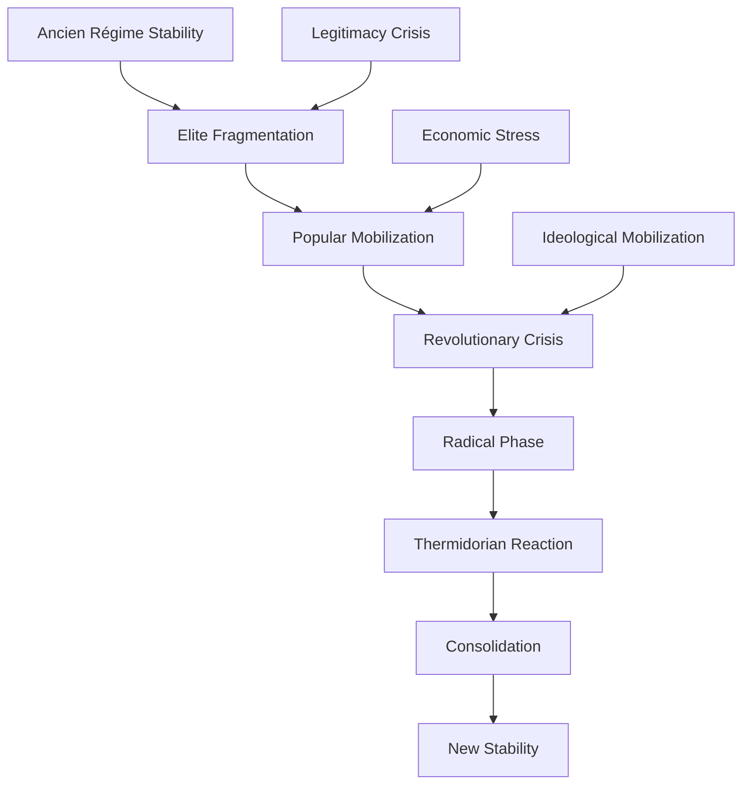

# Recurring Crises: Cyclical Patterns of Human Conflict and Dysfunction

## Abstract

Human history reveals disturbing patterns of recurring crises that transcend cultural, geographical, and temporal boundaries. These cyclical manifestations of conflict, economic collapse, social upheaval, and institutional breakdown suggest fundamental psychological and social mechanisms that drive humanity toward repeated self-destruction. This analysis examines the systematic nature of these recurring crises, their underlying psychological drivers, and the apparent inability of human societies to learn from historical precedent.

## Introduction

The concept of historical cycles has been recognized since ancient times, from Polybius's analysis of constitutional cycles to Spengler's morphology of civilizations. However, modern psychological and social scientific understanding reveals that these cycles are not merely abstract historical patterns but concrete expressions of intrinsic human psychological limitations operating at collective scales.

## Theoretical Framework

### Cyclical Crisis Theory

Recurring crises emerge from the interaction of several fundamental mechanisms:

#### Psychological Foundations
- **Generational amnesia**: Loss of institutional memory across generations
- **Success-induced complacency**: Prosperity leading to risk-taking and overconfidence
- **Stress-response cycles**: Alternating periods of crisis adaptation and relaxation
- **Cognitive biases**: Systematic errors in learning from historical experience

#### Social Dynamics
- **Institutional decay**: Gradual erosion of effective governance structures
- **Elite circulation**: Periodic replacement of ruling classes through conflict
- **Resource cycles**: Depletion and recovery of natural and social resources
- **Demographic transitions**: Population changes driving social transformation

### Crisis Typology

Understanding the different types of recurring crises requires examining their temporal patterns, underlying drivers, and the psychological mechanisms that perpetuate them. This typology reveals how human societies experience predictable cycles of dysfunction across multiple timescales, each driven by distinct but interconnected psychological and social processes.

| Crisis Type | Cycle Length | Primary Drivers | Psychological Mechanisms |
|-------------|--------------|-----------------|-------------------------|
| **Economic** | 7-11 years (business cycles) | Market psychology, credit cycles | Greed-fear oscillation, herd behavior |
| **Political** | 20-30 years (generational) | Elite competition, legitimacy crises | Authority cycles, rebellion psychology |
| **Social** | 50-100 years (institutional) | Value system changes, demographic shifts | Cultural evolution, identity crises |
| **Civilizational** | 200-500 years | Resource depletion, complexity limits | Long-term adaptation failure |

**Economic Crisis Cycles** operate on the shortest timescale, driven primarily by psychological factors in market behavior. The 7-11 year business cycle reflects the time it takes for collective memory of previous crises to fade, allowing new generations of investors and consumers to repeat the same mistakes. The greed-fear oscillation represents the fundamental emotional drivers of market behavior, while herd behavior amplifies individual psychological biases into collective irrationality.

**Political Crisis Cycles** follow generational patterns, typically spanning 20-30 years—roughly the time for a new generation to reach political maturity. These cycles are driven by elite competition for power and periodic legitimacy crises as institutions lose public trust. The psychological mechanisms involve authority cycles where societies alternate between craving strong leadership and rebelling against it, reflecting deep-seated ambivalence about power and autonomy.

**Social Crisis Cycles** operate on longer institutional timescales of 50-100 years, driven by fundamental changes in value systems and demographic composition. These cycles reflect cultural evolution processes where societies gradually shift their core beliefs and practices, often creating identity crises as traditional ways of life conflict with emerging values. The psychological mechanisms involve generational identity formation and cultural transmission failures.

**Civilizational Crisis Cycles** represent the longest and most severe patterns, spanning 200-500 years and involving fundamental challenges to societal survival. These cycles are driven by resource depletion, environmental degradation, and the increasing complexity that eventually overwhelms institutional capacity. The psychological mechanism is long-term adaptation failure—the inability of human cognitive and social systems to respond effectively to gradual but ultimately catastrophic changes.

## Economic Crisis Cycles

### Business Cycle Dynamics

Economic crises follow remarkably consistent patterns driven by psychological factors:

#### Psychological Drivers of Economic Cycles

The psychological foundations of economic cycles reveal how individual cognitive biases and emotional responses aggregate into predictable patterns of collective economic behavior. Each phase of the economic cycle is characterized by distinct psychological states that drive specific behavioral patterns, which in turn create systemic effects that perpetuate the cycle.

| Phase | Dominant Psychology | Behavioral Patterns | Systemic Effects |
|-------|-------------------|-------------------|------------------|
| **Recovery** | Cautious optimism | Conservative investment | Gradual growth |
| **Expansion** | Growing confidence | Increased risk-taking | Accelerating growth |
| **Peak** | Euphoria, invincibility | Speculation, leverage | Asset bubbles |
| **Contraction** | Denial, then panic | Deleveraging, hoarding | Market crashes |
| **Trough** | Despair, capitulation | Risk aversion | Economic depression |

**Recovery Phase Psychology**: During the recovery phase, cautious optimism emerges as individuals and institutions begin to believe that the worst of the previous crisis has passed. This psychological state is characterized by tentative hope combined with vivid memories of recent losses. The behavioral patterns reflect this ambivalence—investment decisions are conservative, focusing on safety and gradual wealth rebuilding rather than aggressive growth. The systemic effect is gradual economic growth as confidence slowly returns and economic activity increases incrementally.

**Expansion Phase Psychology**: As recovery continues, growing confidence replaces caution as the dominant psychological state. Success breeds confidence, and each positive economic indicator reinforces the belief that prosperity will continue. This psychological shift drives increased risk-taking behavior as individuals and institutions become more willing to invest, spend, and leverage their positions. The systemic effect is accelerating growth as this increased economic activity creates a positive feedback loop of rising employment, income, and consumption.

**Peak Phase Psychology**: The expansion phase eventually reaches a peak characterized by euphoria and feelings of invincibility. At this stage, recent success has created overconfidence, and the possibility of significant loss seems remote or impossible. This psychological state drives speculative behavior and excessive leverage as people believe that asset prices will continue rising indefinitely. The systemic effect is the formation of asset bubbles as prices become disconnected from underlying economic fundamentals.

**Contraction Phase Psychology**: When reality intrudes on peak-phase euphoria, the initial response is often denial—a refusal to accept that the good times are ending. However, as negative indicators accumulate, denial quickly transforms into panic as people realize their vulnerable positions. This psychological shift drives deleveraging and hoarding behaviors as individuals and institutions desperately try to preserve wealth and reduce risk exposure. The systemic effect is market crashes as panic selling and credit contraction create a downward spiral.

**Trough Phase Psychology**: The contraction phase eventually reaches a trough characterized by despair and capitulation. At this point, hope for recovery seems impossible, and people accept that losses are permanent. This psychological state drives extreme risk aversion as individuals and institutions avoid any investments or activities that might result in further losses. The systemic effect is economic depression as this collective risk aversion prevents the economic activity necessary for recovery, creating a self-perpetuating cycle of stagnation.

### Historical Economic Crisis Patterns

#### Tulip Mania (1634-1637)
The Dutch tulip bubble exemplifies how psychological factors create recurring speculative manias:
- **Novelty attraction**: New asset class capturing imagination
- **Social proof**: Herd behavior driving participation
- **Availability bias**: Recent gains extrapolated indefinitely
- **Loss aversion**: Panic selling when bubble bursts

#### The Great Depression Cycle (1929-1939)
The 1929 crash and subsequent depression demonstrate classic crisis psychology:

#### Modern Financial Crises
Contemporary crises follow identical psychological patterns:
- **Savings & Loan Crisis (1980s)**: Deregulation euphoria → speculation → collapse
- **Dot-com Bubble (1990s)**: Technology optimism → irrational exuberance → crash
- **Housing Crisis (2008)**: Real estate mania → subprime collapse → global recession

#### Predictive Indicators of Economic Crises

Understanding the psychological and behavioral patterns that precede economic crises enables the identification of early warning indicators. These indicators reflect the underlying psychological dynamics that drive crisis cycles, providing insights into when systems are becoming vulnerable to sudden collapse.

Psychological and behavioral indicators that precede economic crises:

| Indicator Category | Specific Metrics | Psychological Basis |
|-------------------|------------------|-------------------|
| **Sentiment** | Extreme optimism/pessimism | Mood contagion, groupthink |
| **Leverage** | Debt-to-income ratios | Risk perception distortion |
| **Speculation** | Asset price disconnection | Greed, FOMO psychology |
| **Complacency** | Risk premium compression | Availability bias, recency effect |

**Sentiment Indicators** measure the collective emotional state of market participants and the broader public. Extreme optimism often precedes market peaks, while extreme pessimism signals potential bottoms. The psychological basis lies in mood contagion—the tendency for emotions to spread through social networks—and groupthink, where collective decision-making suppresses dissenting views. When sentiment becomes extremely one-sided, it indicates that psychological factors have overwhelmed rational analysis, creating conditions for sudden reversals.

**Leverage Indicators** track the extent to which individuals, businesses, and institutions are borrowing money relative to their income or assets. High leverage ratios indicate risk perception distortion, where people underestimate the probability and consequences of adverse events. This psychological bias leads to excessive borrowing during good times, creating vulnerability when conditions change. The debt-to-income ratio is particularly important because it measures the sustainability of current consumption and investment patterns.

**Speculation Indicators** identify when asset prices become disconnected from underlying economic fundamentals. This disconnection reflects greed and FOMO (fear of missing out) psychology, where the desire for quick profits overrides careful analysis of value. Speculative behavior is characterized by buying assets not for their intrinsic worth but in the expectation that someone else will pay even higher prices. When speculation becomes widespread, it indicates that psychological factors have created unsustainable price levels.

**Complacency Indicators** measure the degree to which market participants are demanding compensation for risk. Risk premium compression—when the extra return demanded for risky investments becomes very small—indicates complacency about potential losses. This reflects availability bias (recent experience weighing too heavily in decisions) and recency effect (assuming recent trends will continue). When risk premiums are compressed, it suggests that people have forgotten the lessons of previous crises and are vulnerable to sudden shocks.

## Political Crisis Cycles

### Generational Political Cycles

Political crises follow generational patterns driven by changing values and experiences:

#### Strauss-Howe Generational Theory Applied

#### Political Cycle Characteristics

| Generation Type | Crisis Response | Political Behavior | Institutional Impact |
|----------------|-----------------|-------------------|-------------------|
| **Crisis** | Collective action | Strong institutions | Institutional building |
| **Artist** | Conformity | Technocratic governance | Institutional refinement |
| **Prophet** | Idealism | Value-based politics | Institutional questioning |
| **Nomad** | Pragmatism | Individualistic politics | Institutional decay |

### Revolutionary Cycles

Political revolutions follow predictable patterns across cultures and centuries:

#### Revolutionary Process Model

#### Historical Revolutionary Patterns

| Revolution | Trigger | Radical Phase | Thermidor | Consolidation |
|------------|---------|---------------|-----------|---------------|
| **English (1640s)** | Religious/political conflict | Commonwealth | Restoration | Constitutional monarchy |
| **French (1789)** | Financial crisis | Terror | Directory | Napoleonic Empire |
| **Russian (1917)** | Military defeat | Bolshevik rule | NEP | Stalinist state |
| **Iranian (1979)** | Modernization backlash | Islamic revolution | Pragmatic adjustment | Theocratic republic |

### Democratic Decay Cycles

Democracies exhibit cyclical patterns of institutional health and decay:

#### Democratic Erosion Indicators

| Phase | Institutional Health | Elite Behavior | Popular Response |
|-------|-------------------|----------------|------------------|
| **Consolidation** | Strong norms | Cooperative | High trust |
| **Polarization** | Norm erosion | Competitive | Declining trust |
| **Crisis** | Institutional breakdown | Authoritarian | Fragmentation |
| **Renewal/Collapse** | Reform or failure | Adaptation or capture | Mobilization or apathy |

## Social Crisis Cycles

### Cultural Revolution Cycles

Societies periodically experience fundamental value system transformations:

#### Cultural Change Mechanisms

#### Historical Cultural Revolutions

| Period | Trigger | Value Shift | Psychological Driver |
|--------|---------|-------------|-------------------|
| **Renaissance** | Rediscovery of classics | Humanism vs. medievalism | Intellectual awakening |
| **Reformation** | Religious corruption | Individual vs. institutional faith | Authority rebellion |
| **Enlightenment** | Scientific revolution | Reason vs. tradition | Cognitive liberation |
| **Romanticism** | Industrial alienation | Emotion vs. rationality | Authenticity seeking |
| **1960s Revolution** | Postwar prosperity | Liberation vs. conformity | Generational rebellion |

### Moral Panic Cycles

Societies regularly experience waves of moral panic following predictable patterns:

#### Moral Panic Process

| Stage | Characteristics | Psychological Mechanisms | Duration |
|-------|----------------|-------------------------|----------|
| **Emergence** | Initial incident/concern | Availability bias, threat detection | Weeks |
| **Amplification** | Media attention, expert claims | Social proof, authority bias | Months |
| **Peak** | Maximum concern, policy response | Moral outrage, groupthink | Months |
| **Decline** | Attention shifts, skepticism | Habituation, counter-narratives | Years |
| **Legacy** | Institutional changes remain | Status quo bias, sunk costs | Decades |

## War and Conflict Cycles

### Hegemonic Cycles

Great power conflicts follow long-term cyclical patterns:

#### Hegemonic Transition Model

#### Historical Hegemonic Cycles

| Period | Hegemon | Challenger | Crisis/War | Outcome |
|--------|---------|------------|------------|---------|
| **1494-1648** | Habsburg Spain | France | Thirty Years' War | Westphalian system |
| **1648-1792** | France | Britain | Napoleonic Wars | British hegemony |
| **1815-1914** | Britain | Germany | World War I | American emergence |
| **1945-?** | United States | China? | ? | ? |

### Regional Conflict Cycles

Regional conflicts exhibit cyclical patterns driven by:

#### Conflict Cycle Drivers

| Driver Category | Specific Factors | Psychological Basis |
|----------------|------------------|-------------------|
| **Demographic** | Youth bulges, migration | Competition psychology |
| **Economic** | Resource scarcity, inequality | Zero-sum thinking |
| **Political** | Succession crises, legitimacy gaps | Authority struggles |
| **Cultural** | Identity conflicts, historical grievances | In-group/out-group bias |

## Crisis Prediction and Pattern Recognition

### Early Warning Indicators

Systematic analysis reveals predictable precursors to various crisis types:

#### Economic Crisis Indicators

#### Political Crisis Indicators

| Indicator Type | Specific Metrics | Threshold Levels |
|---------------|------------------|------------------|
| **Institutional** | Rule of law, corruption | Declining trust |
| **Social** | Polarization, inequality | Extreme divisions |
| **Economic** | Growth, employment | Sustained decline |
| **Demographic** | Age structure, migration | Rapid changes |

### Psychological Barriers to Crisis Prevention

Despite pattern recognition, societies consistently fail to prevent recurring crises due to:

#### Cognitive Limitations
- **Normalcy bias**: Assumption that current conditions will continue
- **Optimism bias**: Overestimation of positive outcomes
- **Planning fallacy**: Underestimation of risks and timelines
- **Confirmation bias**: Selective attention to supporting evidence

#### Social Dynamics
- **Collective action problems**: Individual vs. collective rationality
- **Elite interests**: Short-term benefits vs. long-term stability
- **Institutional inertia**: Resistance to preventive changes
- **Democratic myopia**: Electoral cycles vs. crisis timelines

## Contemporary Crisis Patterns

### Current Cyclical Indicators

Contemporary global society exhibits multiple overlapping crisis cycles:

#### Economic Indicators
- **Debt cycles**: Global debt levels approaching historical peaks
- **Inequality cycles**: Wealth concentration resembling pre-crisis periods
- **Asset bubbles**: Multiple markets showing speculative characteristics
- **Monetary cycles**: Central bank policy exhaustion approaching

#### Political Indicators
- **Democratic backsliding**: Institutional norms eroding globally
- **Populist cycles**: Anti-establishment movements gaining power
- **Geopolitical tensions**: Great power competition intensifying
- **Legitimacy crises**: Trust in institutions declining

#### Social Indicators
- **Generational change**: Millennials/Gen Z challenging existing systems
- **Cultural polarization**: Value conflicts intensifying
- **Information warfare**: Truth and consensus breaking down
- **Identity politics**: Tribal affiliations strengthening

### Technological Amplification of Crisis Cycles

Modern technology accelerates and amplifies traditional crisis patterns:

#### Digital Age Crisis Dynamics

| Traditional Pattern | Digital Amplification | Psychological Impact |
|-------------------|---------------------|-------------------|
| **Information spread** | Viral propagation | Faster panic/euphoria |
| **Social coordination** | Network effects | Larger collective actions |
| **Market psychology** | Algorithmic trading | Extreme volatility |
| **Political mobilization** | Social media | Rapid polarization |

## Implications and Limitations

### Crisis Cycle Inevitability

The recurring nature of human crises suggests fundamental limitations in our ability to learn from history:

#### Structural Factors
- **Generational turnover**: Direct experience lost over time
- **Complexity increases**: Systems becoming harder to understand
- **Success breeds failure**: Prosperity creating new vulnerabilities
- **Psychological constants**: Human nature remaining unchanged

#### Adaptive Limitations
- **Short-term optimization**: Immediate benefits vs. long-term stability
- **Cognitive overload**: Information exceeding processing capacity
- **Coordination failures**: Collective action problems persisting
- **Institutional lag**: Adaptation slower than change pace

### Mitigation Strategies and Their Limits

Attempts to break crisis cycles face systematic obstacles:

#### Institutional Approaches
- **Counter-cyclical policies**: Economic stabilization mechanisms
- **Constitutional design**: Political system safeguards
- **International cooperation**: Global governance structures
- **Education systems**: Historical awareness programs

#### Psychological Barriers
- **Implementation gaps**: Knowledge vs. action disconnection
- **Political resistance**: Vested interests opposing change
- **Timing problems**: Prevention requiring action during stability
- **Measurement difficulties**: Long-term benefits hard to quantify

## Conclusion

The analysis of recurring crises reveals one of humanity's most troubling characteristics: our apparent inability to learn from historical experience and break destructive cyclical patterns. Despite vast accumulations of knowledge about crisis dynamics, human societies continue to repeat the same fundamental mistakes across economic, political, and social domains.

These recurring patterns suggest that crisis cycles are not merely historical accidents but expressions of deep-seated psychological and social limitations that transcend cultural and technological boundaries. The cognitive biases, social dynamics, and institutional pathologies that drive these cycles appear to be universal features of human nature, making crisis recurrence not just possible but probable.

The implications are sobering for contemporary civilization, which faces multiple overlapping crisis cycles while technological amplification accelerates their pace and intensity. Understanding these patterns provides crucial insights for crisis preparation and mitigation, but the psychological mechanisms that create cycles also create barriers to prevention.

The recurring nature of human crises serves as a fundamental challenge to assumptions about progress and learning, suggesting that humanity may be trapped in cyclical patterns of self-destruction that reflect the deepest limitations of our psychological and social nature.

## References

1. Kindleberger, C. P., & Aliber, R. Z. (2011). *Manias, Panics, and Crashes: A History of Financial Crises*. Wiley.
2. Strauss, W., & Howe, N. (1997). *The Fourth Turning: An American Prophecy*. Broadway Books.
3. Turchin, P. (2003). *Historical Dynamics: Why States Rise and Fall*. Princeton University Press.
4. Modelski, G. (1987). *Long Cycles in World Politics*. University of Washington Press.
5. Brinton, C. (1938). *The Anatomy of Revolution*. W. W. Norton & Company.

---

*[See: Individual Psychology → Temporal Discounting] [Related: Group Dynamics → Collective Memory] [Compare: Historical Analysis → Civilizational Collapse]*