# Religious and Ideological Extremism: The Psychology of Absolute Belief

## Abstract

Religious and ideological extremism represents one of humanity's most persistent and destructive patterns of thought and behavior, characterized by absolute certainty, intolerance of dissent, and willingness to use violence in service of transcendent beliefs. This analysis examines the psychological mechanisms underlying extremist thinking, the social conditions that foster radicalization, and the historical patterns of extremist movements across diverse religious and ideological contexts. The evidence reveals that extremism emerges from fundamental features of human psychology—including the need for meaning, certainty, and group belonging—that can be manipulated to justify the most horrific acts of violence and oppression.

## Introduction

Extremism, whether religious or secular, has been a constant throughout human history, manifesting in crusades, inquisitions, genocides, terrorist campaigns, and totalitarian regimes. Despite vast differences in specific beliefs and contexts, extremist movements exhibit remarkably consistent psychological and social patterns that transcend cultural and temporal boundaries, suggesting deep-seated vulnerabilities in human cognition and social psychology.

## Theoretical Framework

### Psychological Foundations of Extremism

#### Cognitive Mechanisms

Extremist thinking emerges from the interaction of several fundamental cognitive processes that, while serving important psychological functions, can be manipulated to produce dangerous absolute beliefs and intolerance of dissent. Understanding these mechanisms reveals why extremism appeals to otherwise rational individuals.

Extremist thinking emerges from the interaction of several fundamental cognitive processes:

| Mechanism | Description | Extremist Manifestation |
|-----------|-------------|------------------------|
| **Need for Closure** | Desire for certainty and finality | Absolute truth claims |
| **Binary Thinking** | Dichotomous categorization | Good vs. evil worldview |
| **Confirmation Bias** | Selective information processing | Echo chamber reinforcement |
| **Motivated Reasoning** | Goal-directed cognition | Justifying predetermined beliefs |
| **Cognitive Dissonance** | Discomfort with contradictions | Rationalization of violence |

**Need for Closure** represents the psychological drive to achieve certainty and avoid ambiguity. While this mechanism helps people make decisions and take action, extremist ideologies exploit it by offering simple, absolute answers to complex questions. The promise of complete certainty becomes psychologically irresistible to individuals struggling with uncertainty and doubt.

**Binary Thinking** involves categorizing the world into opposing pairs—good versus evil, us versus them, right versus wrong. This cognitive shortcut helps process complex information quickly but becomes dangerous when applied to human relationships and social issues. Extremist ideologies deliberately promote binary worldviews that eliminate nuance and justify harsh treatment of those categorized as "evil."

**Confirmation Bias** drives selective attention to information that supports existing beliefs while ignoring contradictory evidence. Extremist groups exploit this by creating information environments that constantly reinforce their ideology while filtering out challenging perspectives. This creates echo chambers where extreme beliefs seem reasonable and well-supported.

**Motivated Reasoning** involves using cognitive resources to reach desired conclusions rather than accurate ones. Extremists engage in elaborate intellectual gymnastics to justify predetermined beliefs, creating sophisticated-seeming arguments that serve emotional rather than rational purposes. This allows intelligent individuals to maintain obviously false or harmful beliefs.

**Cognitive Dissonance** creates psychological discomfort when beliefs conflict with reality or behavior. Rather than changing beliefs, extremists often resolve dissonance by rationalizing violence, dismissing contradictory evidence, or intensifying commitment to the ideology. This explains why extremist beliefs often become stronger rather than weaker when challenged.

#### Emotional Drivers

This diagram reveals the emotional pathways that lead individuals toward extremist behavior, showing how fundamental human needs for meaning, dignity, and moral purpose can be channeled into destructive ideological commitment. Understanding these emotional drivers is crucial for both prevention and intervention efforts.

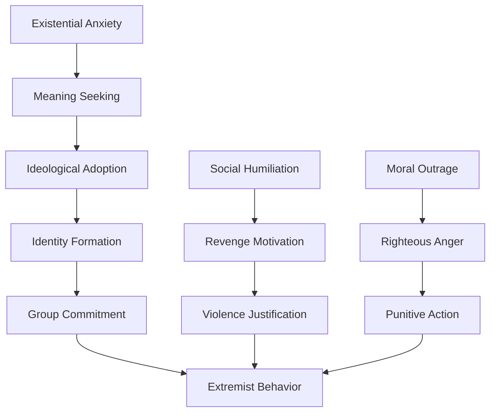
```mermaid
graph TD
    A[Existential Anxiety] --> B[Meaning Seeking]
    B --> C[Ideological Adoption]
    C --> D[Identity Formation]
    D --> E[Group Commitment]
    E --> F[Extremist Behavior]
    
    G[Social Humiliation] --> H[Revenge Motivation]
    H --> I[Violence Justification]
    I --> F
    
    J[Moral Outrage] --> K[Righteous Anger]
    K --> L[Punitive Action]
    L --> F
```

The **Existential Anxiety** pathway shows how fundamental fears about death, meaninglessness, and insignificance drive **Meaning Seeking** behavior. When individuals encounter extremist ideologies during this vulnerable state, **Ideological Adoption** provides powerful answers to existential questions. This leads to **Identity Formation** around the ideology, creating **Group Commitment** that ultimately manifests as **Extremist Behavior**. This pathway explains why extremist recruitment often targets individuals experiencing life crises, transitions, or existential questioning.

The **Social Humiliation** pathway demonstrates how experiences of personal or group humiliation generate **Revenge Motivation** that seeks to restore dignity through retaliation. This creates psychological **Violence Justification** where harmful actions are reframed as necessary responses to injustice. This pathway is particularly important in understanding how historical grievances and contemporary discrimination can fuel extremist movements.

The **Moral Outrage** pathway shows how witnessing or believing in injustice triggers **Righteous Anger** that demands corrective action. This moral emotion, while potentially positive in appropriate contexts, can be manipulated to justify **Punitive Action** against designated enemies. Extremist ideologies deliberately cultivate moral outrage by highlighting real or perceived injustices and presenting violence as the only adequate response.

These emotional pathways often operate simultaneously, creating powerful psychological momentum toward extremist commitment. The combination of existential meaning-making, revenge seeking, and moral righteousness creates a psychological state where extreme actions feel not only justified but morally required.

### Social Psychology of Extremism

#### Group Dynamics in Radicalization

Extremist groups exploit fundamental social psychological processes:

| Process | Mechanism | Extremist Application |
|---------|-----------|---------------------|
| **Social Identity** | Group membership adoption | Us vs. them mentality |
| **Social Proof** | Conformity to group norms | Behavioral escalation |
| **Authority Obedience** | Deference to leaders | Unquestioning compliance |
| **Groupthink** | Consensus seeking | Dissent suppression |
| **Deindividuation** | Loss of individual identity | Collective violence |

#### Radicalization Process Model

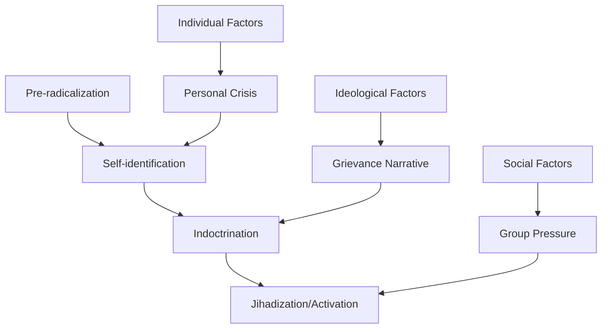
```mermaid
flowchart TD
    A[Pre-radicalization] --> B[Self-identification]
    B --> C[Indoctrination]
    C --> D[Jihadization/Activation]
    
    E[Personal Crisis] --> B
    F[Grievance Narrative] --> C
    G[Group Pressure] --> D
    
    H[Individual Factors] --> E
    I[Ideological Factors] --> F
    J[Social Factors] --> G
```

## Historical Patterns of Religious Extremism

### Medieval Religious Violence

#### The Crusades (1095-1291)

The Crusades exemplify how religious extremism can mobilize entire civilizations for violence:

##### Psychological Mobilization Factors

| Factor | Description | Psychological Mechanism |
|--------|-------------|------------------------|
| **Sacred Mission** | Divine command to reclaim Holy Land | Authority legitimation |
| **Salvation Promise** | Guaranteed paradise for participants | Ultimate reward motivation |
| **Enemy Demonization** | Muslims as infidels and threats | Dehumanization process |
| **Social Pressure** | Peer and clerical expectations | Conformity and status seeking |

##### Crusade Timeline and Psychology

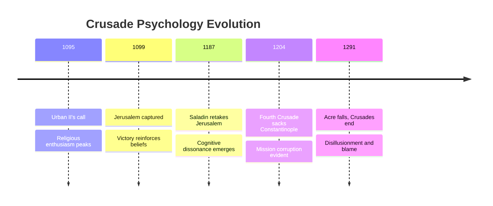
```mermaid
timeline
    title Crusade Psychology Evolution
    1095 : Urban II's call
         : Religious enthusiasm peaks
    1099 : Jerusalem captured
         : Victory reinforces beliefs
    1187 : Saladin retakes Jerusalem
         : Cognitive dissonance emerges
    1204 : Fourth Crusade sacks Constantinople
         : Mission corruption evident
    1291 : Acre falls, Crusades end
         : Disillusionment and blame
```

#### The Spanish Inquisition (1478-1834)

The Inquisition demonstrates how religious extremism becomes institutionalized:

##### Institutional Extremism Mechanisms

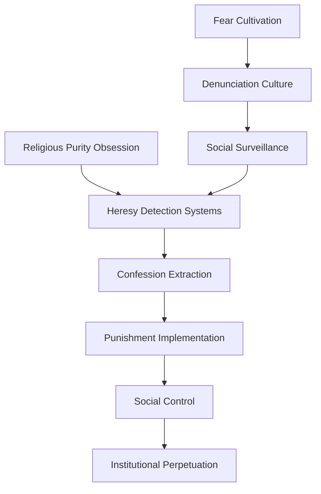
```mermaid
graph TD
    A[Religious Purity Obsession] --> B[Heresy Detection Systems]
    B --> C[Confession Extraction]
    C --> D[Punishment Implementation]
    D --> E[Social Control]
    E --> F[Institutional Perpetuation]
    
    G[Fear Cultivation] --> H[Denunciation Culture]
    H --> I[Social Surveillance]
    I --> B
```

##### Psychological Techniques of Control

| Technique | Purpose | Psychological Impact |
|-----------|---------|-------------------|
| **Public Trials** | Social intimidation | Fear conditioning |
| **Confession Torture** | Truth extraction | Learned helplessness |
| **Auto-da-fé** | Public punishment | Collective trauma |
| **Genealogy Investigation** | Purity verification | Paranoid surveillance |

### Reformation and Counter-Reformation Violence

#### Religious Wars (1524-1648)

The Protestant Reformation unleashed unprecedented religious violence across Europe:

##### Conflict Escalation Pattern

| Phase | Characteristics | Psychological Drivers |
|-------|----------------|---------------------|
| **Theological Dispute** | Academic disagreement | Intellectual competition |
| **Popular Mobilization** | Mass movement formation | Identity seeking |
| **Political Exploitation** | State power involvement | Authority legitimation |
| **Military Conflict** | Armed religious warfare | Survival psychology |
| **Exhaustion** | War weariness | Pragmatic adaptation |

##### Case Study: St. Bartholomew's Day Massacre (1572)

The massacre of French Protestants reveals extremism's psychological dynamics:

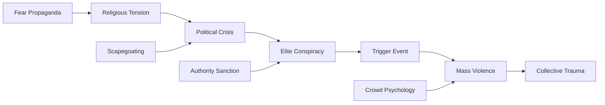
```mermaid
flowchart LR
    A[Religious Tension] --> B[Political Crisis]
    B --> C[Elite Conspiracy]
    C --> D[Trigger Event]
    D --> E[Mass Violence]
    E --> F[Collective Trauma]
    
    G[Fear Propaganda] --> A
    H[Scapegoating] --> B
    I[Authority Sanction] --> C
    J[Crowd Psychology] --> E
```

## Secular Ideological Extremism

### Totalitarian Movements

#### Nazi Ideology and Genocide

Nazism demonstrates how secular extremism can achieve religious-like devotion:

##### Ideological Structure

| Component | Function | Psychological Appeal |
|-----------|----------|-------------------|
| **Racial Mythology** | Group superiority narrative | Identity enhancement |
| **Historical Destiny** | Inevitable triumph belief | Meaning provision |
| **Enemy Identification** | Scapegoat targeting | Blame attribution |
| **Leader Worship** | Führer principle | Authority submission |
| **Ritual Practice** | Mass ceremonies | Collective bonding |

##### Radicalization Mechanisms

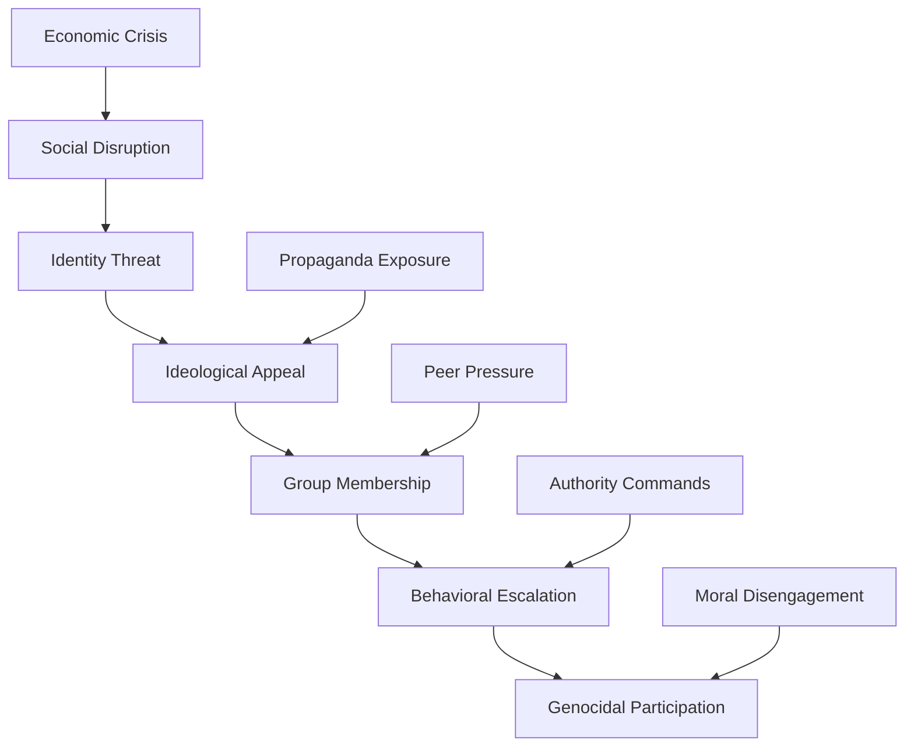
```mermaid
graph TD
    A[Economic Crisis] --> B[Social Disruption]
    B --> C[Identity Threat]
    C --> D[Ideological Appeal]
    D --> E[Group Membership]
    E --> F[Behavioral Escalation]
    F --> G[Genocidal Participation]
    
    H[Propaganda Exposure] --> D
    I[Peer Pressure] --> E
    J[Authority Commands] --> F
    K[Moral Disengagement] --> G
```

#### Communist Extremism

Communist movements exhibit similar psychological patterns despite different ideological content:

##### Stalinist Terror Psychology

| Mechanism | Implementation | Psychological Effect |
|-----------|----------------|-------------------|
| **Ideological Purity** | Constant purges | Paranoid compliance |
| **Class Warfare** | Enemy class elimination | Dehumanization |
| **Historical Inevitability** | Marxist determinism | Fatalistic acceptance |
| **Collective Guilt** | Group responsibility | Individual erasure |

### Contemporary Secular Extremism

#### Environmental Extremism

Radical environmental movements demonstrate how secular causes can generate extremist behavior:

##### Radicalization Pathway

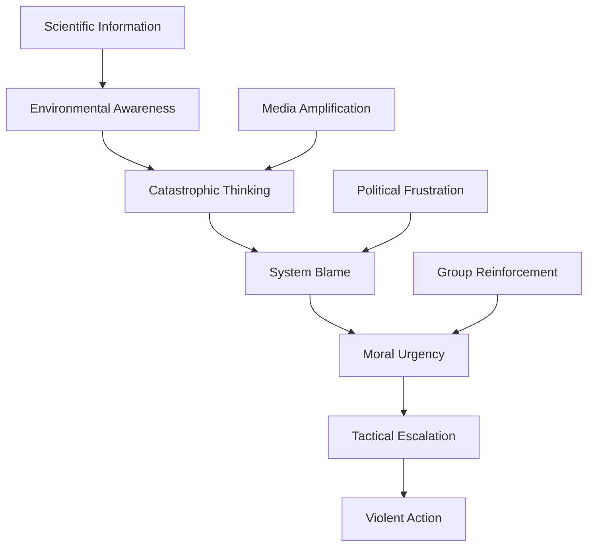
```mermaid
flowchart TD
    A[Environmental Awareness] --> B[Catastrophic Thinking]
    B --> C[System Blame]
    C --> D[Moral Urgency]
    D --> E[Tactical Escalation]
    E --> F[Violent Action]
    
    G[Scientific Information] --> A
    H[Media Amplification] --> B
    I[Political Frustration] --> C
    J[Group Reinforcement] --> D
```

#### Political Extremism

Contemporary political movements exhibit classic extremist characteristics:

| Movement Type | Core Beliefs | Psychological Drivers |
|---------------|--------------|---------------------|
| **Far-Right** | Racial/cultural superiority | Identity threat response |
| **Far-Left** | Revolutionary transformation | System rejection |
| **Anarchist** | State abolition | Authority rebellion |
| **Nationalist** | Ethnic/national purity | Tribal psychology |

## Contemporary Religious Extremism

### Islamic Extremism

#### Jihadist Ideology

Modern jihadist movements combine traditional religious concepts with contemporary grievances:

##### Ideological Components

| Element | Traditional Source | Modern Application |
|---------|-------------------|-------------------|
| **Jihad Concept** | Classical Islamic law | Global warfare justification |
| **Martyrdom** | Religious sacrifice | Suicide attack motivation |
| **Caliphate** | Historical governance | Political restoration goal |
| **Takfir** | Apostasy declaration | Enemy identification |

##### Radicalization Process

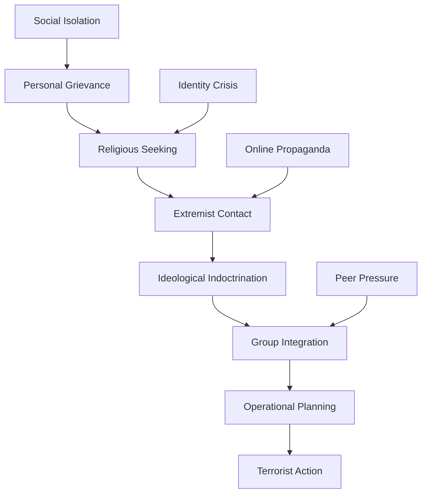
```mermaid
graph TD
    A[Personal Grievance] --> B[Religious Seeking]
    B --> C[Extremist Contact]
    C --> D[Ideological Indoctrination]
    D --> E[Group Integration]
    E --> F[Operational Planning]
    F --> G[Terrorist Action]
    
    H[Social Isolation] --> A
    I[Identity Crisis] --> B
    J[Online Propaganda] --> C
    K[Peer Pressure] --> E
```

#### Case Study: ISIS Psychology

The Islamic State demonstrates extremism's psychological appeal:

##### Recruitment Psychology

| Appeal Type | Target Audience | Psychological Need |
|-------------|----------------|-------------------|
| **Adventure** | Young males | Excitement seeking |
| **Belonging** | Isolated individuals | Social connection |
| **Purpose** | Meaning seekers | Existential fulfillment |
| **Power** | Marginalized groups | Status enhancement |
| **Revenge** | Grievance holders | Justice seeking |

### Christian Extremism

#### Historical Patterns

Christian extremism has manifested across denominations and centuries:

##### Contemporary Manifestations

| Type | Characteristics | Psychological Drivers |
|------|----------------|---------------------|
| **Dominionist** | Theocratic governance | Control seeking |
| **Apocalyptic** | End-times preparation | Anxiety management |
| **Anti-abortion** | Fetal life protection | Moral absolutism |
| **White Christian Nationalism** | Racial-religious identity | Identity defense |

### Hindu Extremism

#### Hindutva Ideology

Hindu nationalism demonstrates how ancient religions can generate modern extremism:

##### Ideological Structure

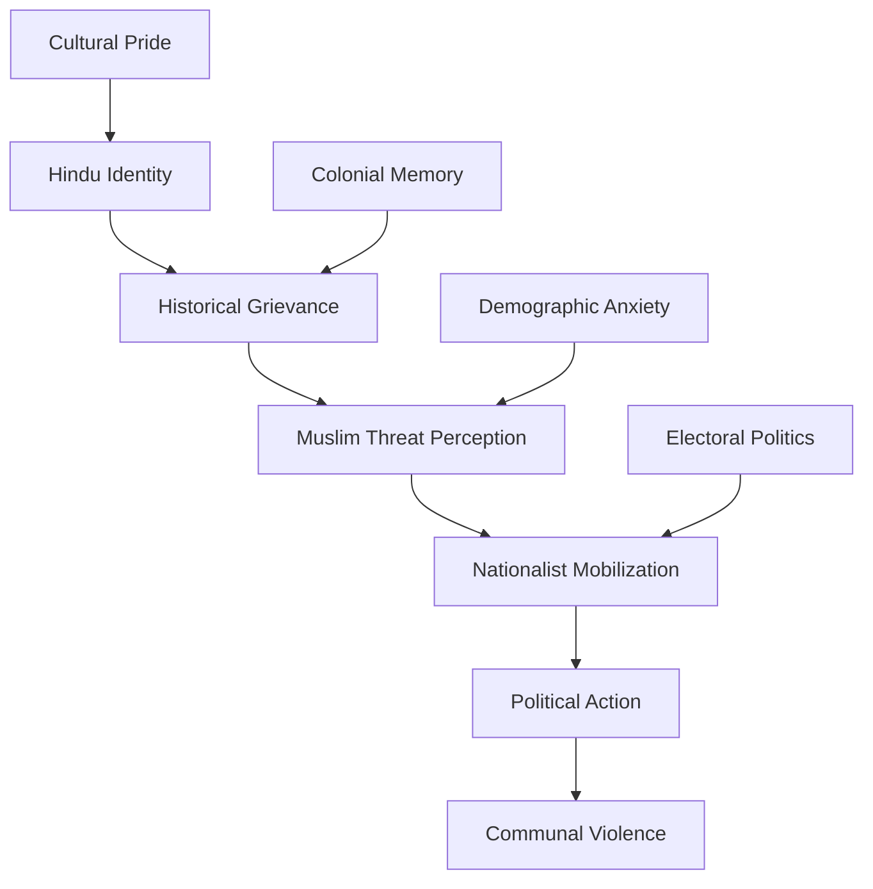
```mermaid
graph TD
    A[Hindu Identity] --> B[Historical Grievance]
    B --> C[Muslim Threat Perception]
    C --> D[Nationalist Mobilization]
    D --> E[Political Action]
    E --> F[Communal Violence]
    
    G[Cultural Pride] --> A
    H[Colonial Memory] --> B
    I[Demographic Anxiety] --> C
    J[Electoral Politics] --> D
```

## Psychological Profiles of Extremists

### Individual-Level Factors

#### Personality Characteristics

Research reveals consistent personality patterns among extremists:

| Trait | Description | Extremist Manifestation |
|-------|-------------|------------------------|
| **Authoritarianism** | Preference for hierarchy | Leader worship |
| **Dogmatism** | Closed-minded thinking | Ideological rigidity |
| **Need for Significance** | Desire for importance | Heroic self-image |
| **Uncertainty Intolerance** | Discomfort with ambiguity | Absolute beliefs |
| **Narcissistic Vulnerability** | Fragile self-esteem | Grandiose compensation |

#### Cognitive Patterns

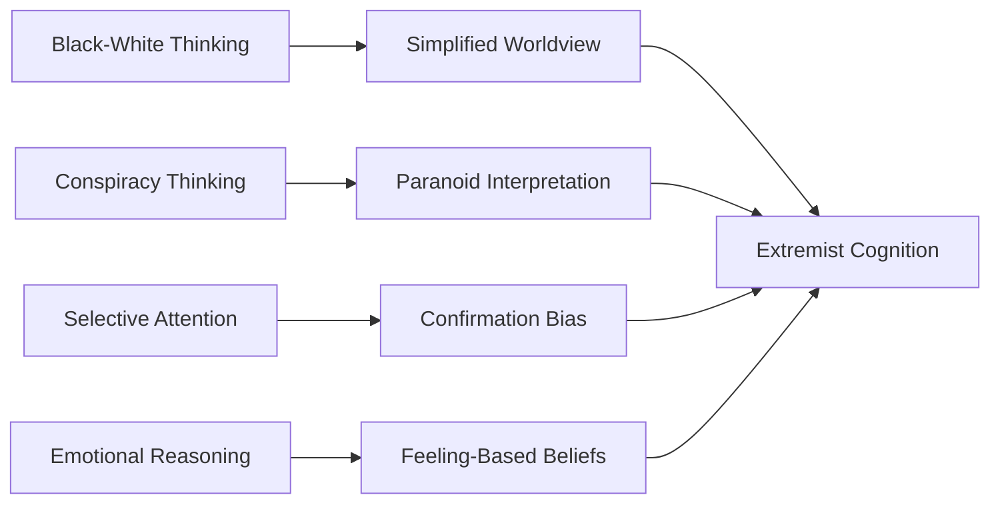
```mermaid
flowchart LR
    A[Black-White Thinking] --> B[Simplified Worldview]
    C[Conspiracy Thinking] --> D[Paranoid Interpretation]
    E[Selective Attention] --> F[Confirmation Bias]
    G[Emotional Reasoning] --> H[Feeling-Based Beliefs]
    
    B --> I[Extremist Cognition]
    D --> I
    F --> I
    H --> I
```

### Developmental Pathways

#### Childhood Factors

Early experiences that predispose toward extremism:

| Factor | Mechanism | Later Impact |
|--------|-----------|--------------|
| **Trauma** | Emotional dysregulation | Vulnerability to manipulation |
| **Authoritarian Parenting** | Submission training | Authority seeking |
| **Social Rejection** | Identity wounds | Belonging desperation |
| **Religious Indoctrination** | Absolute thinking | Cognitive rigidity |

#### Life Transition Vulnerabilities

Critical periods when individuals become susceptible to radicalization:

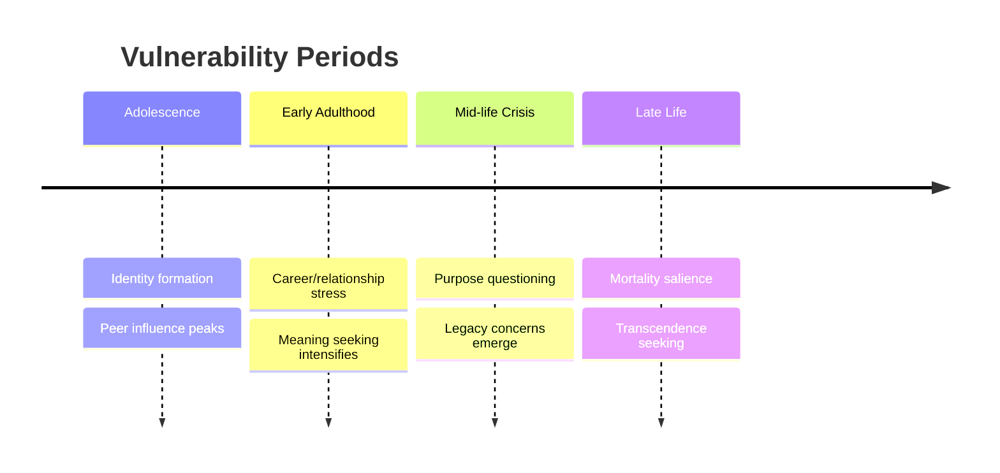
```mermaid
timeline
    title Vulnerability Periods
    Adolescence : Identity formation
                : Peer influence peaks
    Early Adulthood : Career/relationship stress
                    : Meaning seeking intensifies
    Mid-life Crisis : Purpose questioning
                    : Legacy concerns emerge
    Late Life : Mortality salience
              : Transcendence seeking
```

## Social Conditions Fostering Extremism

### Structural Factors

#### Economic Conditions

| Condition | Extremism Risk | Psychological Mechanism |
|-----------|----------------|------------------------|
| **Inequality** | High | Relative deprivation |
| **Unemployment** | Moderate | Status threat |
| **Economic Crisis** | High | Scapegoating tendency |
| **Rapid Change** | High | Uncertainty anxiety |

#### Political Factors

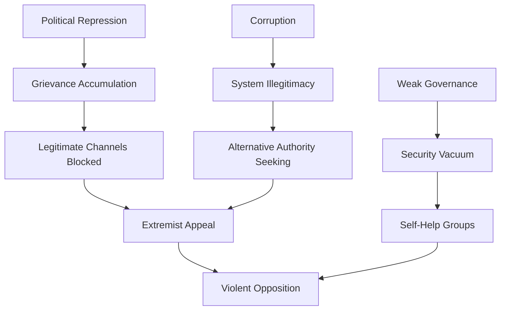
```mermaid
graph TD
    A[Political Repression] --> B[Grievance Accumulation]
    B --> C[Legitimate Channels Blocked]
    C --> D[Extremist Appeal]
    D --> E[Violent Opposition]
    
    F[Corruption] --> G[System Illegitimacy]
    G --> H[Alternative Authority Seeking]
    H --> D
    
    I[Weak Governance] --> J[Security Vacuum]
    J --> K[Self-Help Groups]
    K --> E
```

### Cultural Factors

#### Identity Threats

Perceived threats to group identity create extremism vulnerability:

| Threat Type | Source | Extremist Response |
|-------------|--------|-------------------|
| **Cultural** | Globalization, immigration | Traditionalist reaction |
| **Religious** | Secularization, pluralism | Fundamentalist revival |
| **Ethnic** | Demographic change | Nationalist mobilization |
| **Gender** | Feminist advancement | Patriarchal backlash |

#### Information Environment

Modern information systems can amplify extremist tendencies:

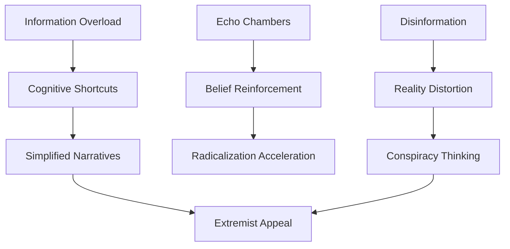
```mermaid
flowchart TD
    A[Information Overload] --> B[Cognitive Shortcuts]
    B --> C[Simplified Narratives]
    C --> D[Extremist Appeal]
    
    E[Echo Chambers] --> F[Belief Reinforcement]
    F --> G[Radicalization Acceleration]
    
    H[Disinformation] --> I[Reality Distortion]
    I --> J[Conspiracy Thinking]
    J --> D
```

## Extremist Organizations and Movements

### Organizational Psychology

#### Cult-like Characteristics

Extremist groups employ systematic psychological manipulation:

| Technique | Purpose | Psychological Effect |
|-----------|---------|-------------------|
| **Love Bombing** | Initial recruitment | Emotional dependency |
| **Isolation** | External influence reduction | Group dependency |
| **Indoctrination** | Belief system adoption | Cognitive restructuring |
| **Confession** | Vulnerability creation | Psychological control |
| **Punishment** | Compliance enforcement | Learned helplessness |

#### Leadership Dynamics

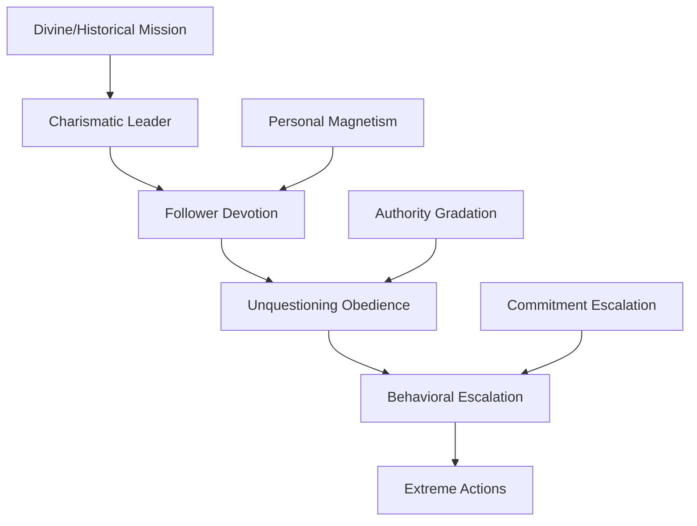
```mermaid
graph TD
    A[Charismatic Leader] --> B[Follower Devotion]
    B --> C[Unquestioning Obedience]
    C --> D[Behavioral Escalation]
    D --> E[Extreme Actions]
    
    F[Divine/Historical Mission] --> A
    G[Personal Magnetism] --> B
    H[Authority Gradation] --> C
    I[Commitment Escalation] --> D
```

### Movement Evolution Patterns

#### Lifecycle of Extremist Movements

| Stage | Characteristics | Psychological Dynamics |
|-------|----------------|----------------------|
| **Formation** | Ideological crystallization | Meaning creation |
| **Growth** | Recruitment expansion | Social proof effects |
| **Peak** | Maximum influence | Overconfidence bias |
| **Decline** | Internal conflicts | Disillusionment |
| **Transformation** | Adaptation or dissolution | Cognitive flexibility |

#### Splinter Group Dynamics

Why extremist movements fragment:

```mermaid
flowchart LR
    A[Ideological Purity Demands] --> B[Internal Criticism]
    B --> C[Factional Conflict]
    C --> D[Group Splitting]
    D --> E[Competitive Radicalization]
    E --> F[Violence Escalation]
```

## Counter-Extremism and Deradicalization

### Psychological Interventions

#### Individual Deradicalization

Therapeutic approaches to extremist thinking:

| Approach | Mechanism | Target |
|----------|-----------|--------|
| **Cognitive Therapy** | Thought pattern modification | Distorted thinking |
| **Narrative Therapy** | Story reconstruction | Identity transformation |
| **Empathy Training** | Perspective-taking | Dehumanization reversal |
| **Trauma Treatment** | Emotional healing | Underlying wounds |

#### Exit Process Psychology

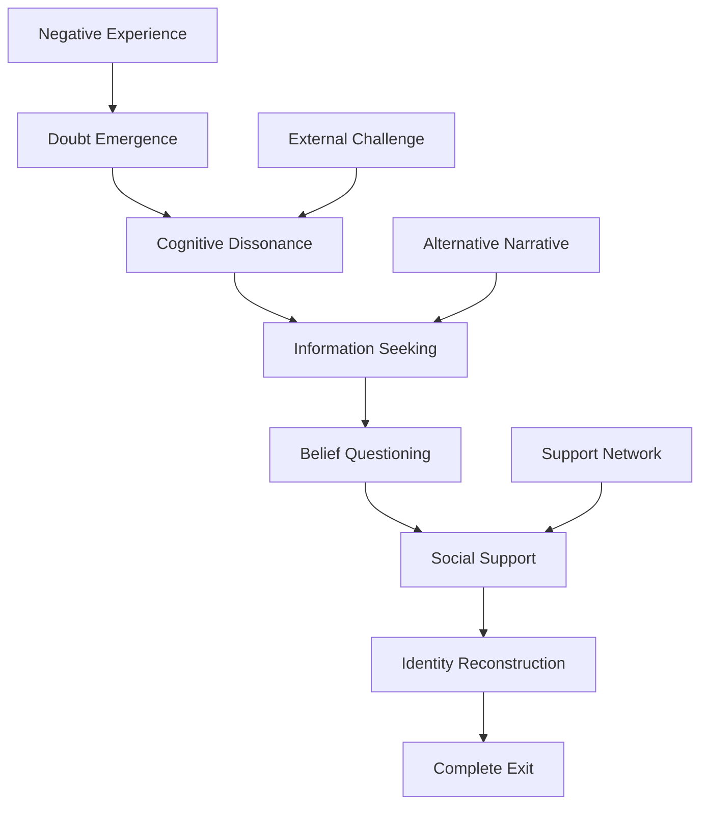
```mermaid
graph TD
    A[Doubt Emergence] --> B[Cognitive Dissonance]
    B --> C[Information Seeking]
    C --> D[Belief Questioning]
    D --> E[Social Support]
    E --> F[Identity Reconstruction]
    F --> G[Complete Exit]
    
    H[Negative Experience] --> A
    I[External Challenge] --> B
    J[Alternative Narrative] --> C
    K[Support Network] --> E
```

### Social Interventions

#### Community-Based Prevention

Strategies for reducing extremism susceptibility:

| Strategy | Target | Mechanism |
|----------|--------|-----------|
| **Education** | Critical thinking | Cognitive inoculation |
| **Integration** | Social cohesion | Belonging provision |
| **Economic Development** | Opportunity creation | Hope restoration |
| **Dialogue Programs** | Inter-group contact | Prejudice reduction |

#### Counter-Narrative Campaigns

Psychological principles for effective counter-messaging:

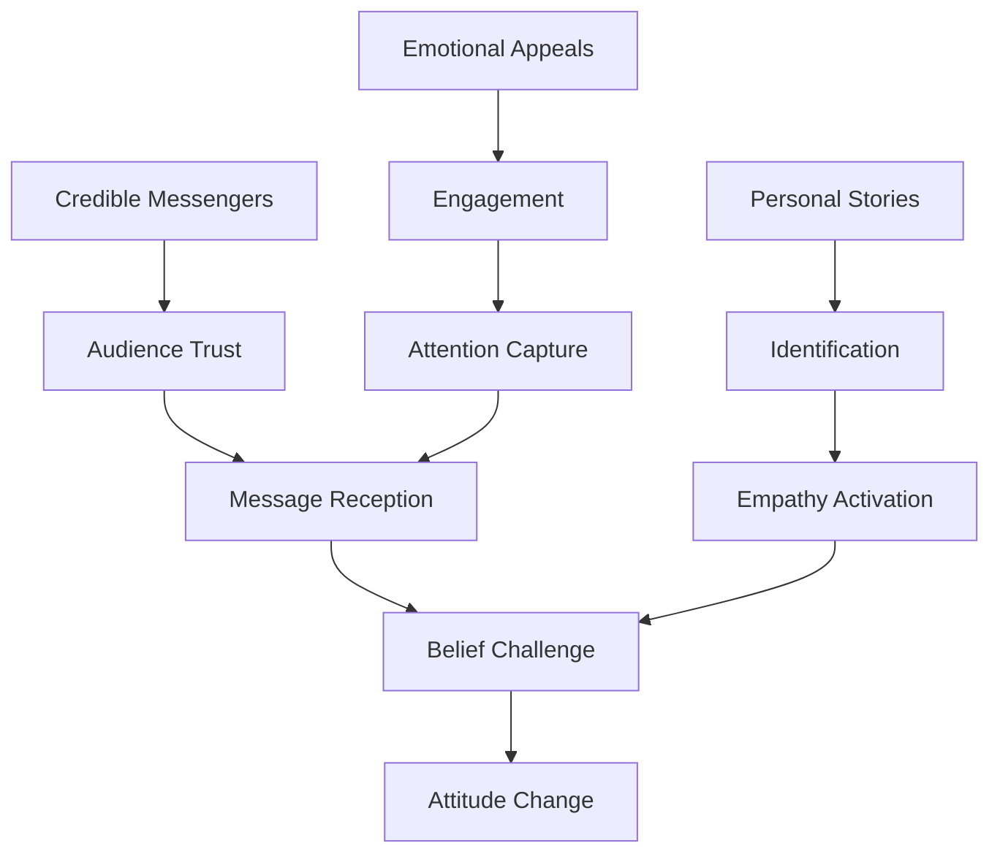
```mermaid
flowchart TD
    A[Credible Messengers] --> B[Audience Trust]
    B --> C[Message Reception]
    C --> D[Belief Challenge]
    D --> E[Attitude Change]
    
    F[Emotional Appeals] --> G[Engagement]
    G --> H[Attention Capture]
    H --> C
    
    I[Personal Stories] --> J[Identification]
    J --> K[Empathy Activation]
    K --> D
```

## Limitations of Counter-Extremism

### Psychological Barriers

#### Resistance Mechanisms

Why extremists resist deradicalization:

| Mechanism | Description | Intervention Challenge |
|-----------|-------------|----------------------|
| **Sunk Cost Fallacy** | Investment protection | Change resistance |
| **Identity Fusion** | Self-group merger | Identity threat |
| **Cognitive Dissonance** | Contradiction avoidance | Information rejection |
| **Social Pressure** | Group loyalty demands | Exit costs |

#### Backfire Effects

Interventions that can strengthen extremist beliefs:

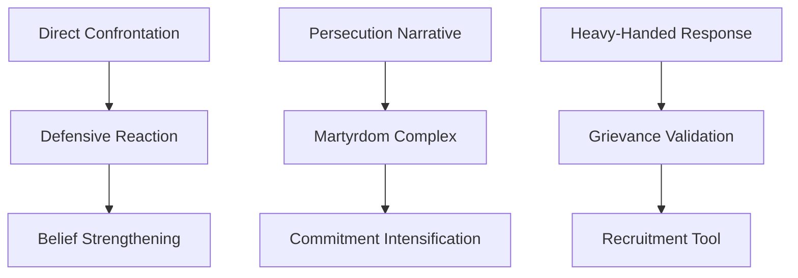
```mermaid
graph TD
    A[Direct Confrontation] --> B[Defensive Reaction]
    B --> C[Belief Strengthening]
    
    D[Persecution Narrative] --> E[Martyrdom Complex]
    E --> F[Commitment Intensification]
    
    G[Heavy-Handed Response] --> H[Grievance Validation]
    H --> I[Recruitment Tool]
```

### Structural Limitations

#### Systemic Factors

Conditions that perpetuate extremism despite interventions:

| Factor | Persistence Mechanism | Intervention Limit |
|--------|---------------------|-------------------|
| **Inequality** | Structural grievances | Individual focus inadequacy |
| **Political Exclusion** | Legitimate grievances | System change resistance |
| **Cultural Conflict** | Deep identity divisions | Surface-level solutions |
| **Information Warfare** | Competing narratives | Truth establishment difficulty |

## Contemporary Challenges

### Digital Age Extremism

#### Online Radicalization

Internet technologies create new pathways for extremist recruitment:

| Platform Type | Radicalization Mechanism | Psychological Appeal |
|---------------|-------------------------|-------------------|
| **Social Media** | Echo chamber creation | Confirmation bias |
| **Gaming Platforms** | Gradual exposure | Normalization process |
| **Encrypted Messaging** | Private indoctrination | Intimacy and secrecy |
| **Virtual Reality** | Immersive experiences | Emotional engagement |

#### Algorithmic Amplification

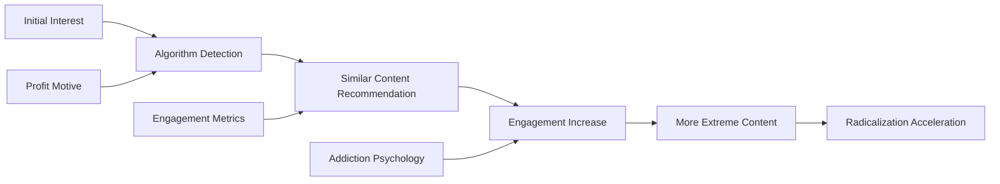
```mermaid
flowchart LR
    A[Initial Interest] --> B[Algorithm Detection]
    B --> C[Similar Content Recommendation]
    C --> D[Engagement Increase]
    D --> E[More Extreme Content]
    E --> F[Radicalization Acceleration]
    
    G[Profit Motive] --> B
    H[Engagement Metrics] --> C
    I[Addiction Psychology] --> D
```

### Globalized Extremism

#### Transnational Networks

Modern extremist movements operate across borders:

| Network Type | Coordination Mechanism | Psychological Bond |
|--------------|----------------------|-------------------|
| **Religious** | Shared theology | Spiritual unity |
| **Ideological** | Common worldview | Intellectual solidarity |
| **Ethnic** | Kinship ties | Blood loyalty |
| **Tactical** | Operational cooperation | Professional respect |

#### Cultural Hybridization

How local grievances merge with global ideologies:

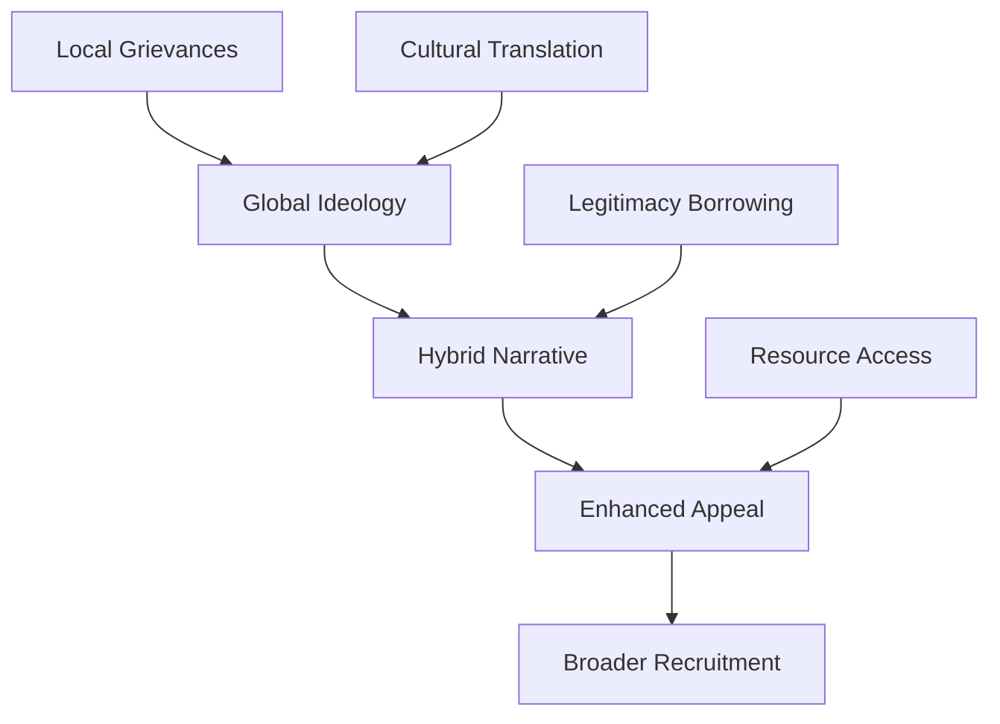
```mermaid
graph TD
    A[Local Grievances] --> B[Global Ideology]
    B --> C[Hybrid Narrative]
    C --> D[Enhanced Appeal]
    D --> E[Broader Recruitment]
    
    F[Cultural Translation] --> B
    G[Legitimacy Borrowing] --> C
    H[Resource Access] --> D
```

## Implications for Human Nature

### Universal Extremism Vulnerability

The cross-cultural prevalence of extremism suggests fundamental human psychological vulnerabilities:

#### Cognitive Predispositions

| Predisposition | Evolutionary Function | Extremist Exploitation |
|----------------|---------------------|----------------------|
| **Pattern Recognition** | Threat detection | Conspiracy thinking |
| **Group Loyalty** | Survival cooperation | In-group fanaticism |
| **Authority Deference** | Social coordination | Leader worship |
| **Meaning Making** | Behavioral guidance | Ideological certainty |

#### Social Psychological Constants

```mermaid
graph TD
    A[Need for Belonging] --> B[Group Identification]
    B --> C[In-group Favoritism]
    C --> D[Out-group Hostility]
    
    E[Need for Certainty] --> F[Absolute Beliefs]
    F --> G[Intolerance of Ambiguity]
    G --> H[Extremist Thinking]
    
    I[Need for Significance] --> J[Heroic Identity]
    J --> K[Grandiose Actions]
    K --> L[Violent Extremism]
```

### Extremism as Human Universal

Despite vast cultural differences, extremist movements exhibit consistent patterns:

#### Universal Features

- **Sacred values**: Non-negotiable beliefs worth dying for
- **Enemy identification**: Clear targets for hostility
- **Purification rituals**: Cleansing of impurity
- **Martyrdom glorification**: Death for the cause
- **Apocalyptic thinking**: End-times scenarios

#### Evolutionary Mismatch

Modern extremism represents a dangerous mismatch between evolved psychology and contemporary technology:

| Evolved Mechanism | Ancestral Function | Modern Danger |
|-------------------|-------------------|---------------|
| **Tribal Loyalty** | Small group survival | Mass violence |
| **Sacred Values** | Group cohesion | Fanatical behavior |
| **Threat Detection** | Predator avoidance | Paranoid thinking |
| **Dominance Seeking** | Resource competition | Power abuse |

## Conclusion

The analysis of religious and ideological extremism reveals one of humanity's most troubling psychological vulnerabilities: our susceptibility to absolute beliefs that justify violence and oppression. The evidence demonstrates that extremism is not a pathological aberration but emerges from fundamental features of human psychology—including needs for meaning, certainty, belonging, and significance—that can be manipulated to produce the most destructive behaviors.

The consistency of extremist patterns across diverse religious and ideological contexts suggests that the psychological mechanisms underlying extremism are universal features of human nature. The cognitive biases, emotional needs, and social dynamics that drive extremist thinking appear to transcend cultural and historical boundaries, making extremism a persistent threat to human civilization.

Contemporary challenges, including digital radicalization, globalized networks, and technological amplification, have created new pathways for extremist recruitment and coordination while the underlying psychological vulnerabilities remain unchanged. The ease with which ordinary individuals can be transformed into extremists, combined with the increasing destructive power of available technologies, creates unprecedented risks for human survival.

While counter-extremism efforts have achieved some successes, the psychological barriers to deradicalization and the structural factors that perpetuate extremism suggest that eliminating this phenomenon may be beyond our current capabilities. The deep-seated nature of the psychological vulnerabilities that extremism exploits indicates that this will likely remain a central challenge for human civilization.

Understanding these patterns provides crucial insights for prevention and intervention efforts, but the fundamental nature of the psychological mechanisms involved suggests that extremism will continue to pose existential risks to human societies. The study of extremism thus serves as a sobering reminder of the darker potentials of human psychology and the persistent power of our cognitive and emotional limitations to undermine our highest aspirations for tolerance, peace, and rational discourse.

## References

1. Hoffer, E. (1951). *The True Believer: Thoughts on the Nature of Mass Movements*. Harper & Row.
2. Lifton, R. J. (1961). *Thought Reform and the Psychology of Totalism*. W. W. Norton & Company.
3. Kruglanski, A. W., & Fishman, S. (2009). *The Psychology of Terrorism*. Psychology Press.
4. McCauley, C., & Moskalenko, S. (2011). *Friction: How Radicalization Happens to Them and Us*. Oxford University Press.
5. Atran, S. (2010). *Talking to the Enemy: Faith, Brotherhood, and the (Un)Making of Terrorists*. Ecco.

---

*[See: Individual Psychology → Need for Meaning] [Related: Group Dynamics → Authority Obedience] [Compare: Historical Analysis → War and Conflict]*