# War and Conflict: The Psychological and Sociological Roots of Human Violence

## Abstract

War and violent conflict represent perhaps humanity's most persistent and destructive behavioral patterns, transcending cultural, technological, and temporal boundaries. This analysis examines the deep psychological and sociological mechanisms that drive human beings toward organized violence, revealing how evolutionary adaptations, cognitive biases, social dynamics, and institutional structures combine to make warfare not an aberration but a fundamental expression of human nature. Despite millennia of moral progress and technological advancement, the underlying drivers of conflict remain largely unchanged, suggesting intrinsic limitations in humanity's capacity for peaceful coexistence.

## Introduction

The ubiquity of warfare throughout human history presents a profound challenge to optimistic views of human nature and social progress. Archaeological evidence suggests organized violence has been present since the earliest human societies, and contemporary conflicts continue to devastate populations despite unprecedented global interconnection and shared knowledge about war's destructive consequences.

## Evolutionary Foundations of Conflict

### Adaptive Origins of Aggression

Human propensity for violence emerges from evolutionary adaptations that were beneficial in ancestral environments. These psychological and behavioral mechanisms, while adaptive for survival in small-scale societies, now create systematic vulnerabilities to large-scale organized violence in modern contexts.

#### Individual-Level Adaptations

The individual psychological adaptations that enabled survival in ancestral environments now create systematic biases toward conflict and violence in modern societies. This table reveals how each evolutionary adaptation, beneficial for individual survival, becomes a source of dysfunction when scaled to modern warfare.

| Adaptation | Evolutionary Function | Modern Manifestation |
|------------|---------------------|-------------------|
| **Threat Detection** | Survival in dangerous environments | Hypervigilance, paranoia |
| **Dominance Seeking** | Resource acquisition, mate competition | Status conflicts, power struggles |
| **In-group Loyalty** | Coalition formation for protection | Nationalism, tribalism |
| **Revenge Psychology** | Deterrence through retaliation | Cycles of violence, vendetta |
| **Risk Assessment** | Threat evaluation and response | Preemptive aggression, arms races |

This analysis of individual-level adaptations reveals why humans are systematically biased toward conflict despite the obvious costs of warfare. Threat detection mechanisms evolved to identify and respond to immediate physical dangers in ancestral environments where false negatives (missing real threats) were more costly than false positives (responding to non-threats). This creates hypervigilance and paranoid thinking that systematically overestimates threats and biases individuals toward aggressive responses.

Dominance seeking behavior evolved because higher-status individuals had better access to resources and mates, improving survival and reproductive success. As primatologist Frans de Waal documents in "Chimpanzee Politics," dominance hierarchies are fundamental to primate social organization. In modern contexts, this drive for dominance manifests as status conflicts and power struggles that can escalate into organized violence when competing groups seek to establish superiority over each other.

In-group loyalty evolved because survival depended on maintaining membership in protective coalitions. Individuals who were loyal to their groups received protection and resource sharing, while those who betrayed their groups faced ostracism or death. This psychological mechanism now creates nationalism and tribalism that can override rational calculations about the costs and benefits of warfare, leading people to support conflicts that harm their objective interests.

Revenge psychology evolved as a deterrent mechanism—individuals and groups that retaliated against aggression were less likely to be targeted in the future. As evolutionary psychologist Martin Daly explains in "Killing the Competition," the capacity for revenge served as a credible threat that prevented exploitation. However, this same mechanism now creates cycles of violence and vendetta that can persist for generations, as each act of retaliation justifies further retaliation.

Risk assessment mechanisms evolved to evaluate threats and determine appropriate responses, but these systems are calibrated for immediate, physical threats rather than the complex, abstract threats characteristic of modern international relations. This leads to preemptive aggression and arms races where nations respond to potential future threats as if they were immediate dangers, creating security dilemmas that increase rather than decrease actual risk.

#### Group-Level Adaptations

The evolutionary dynamics of intergroup competition created psychological mechanisms that enable large-scale organized violence. This flowchart illustrates how resource scarcity triggers a self-reinforcing cycle of competition and violence that becomes embedded in group psychology and social organization.

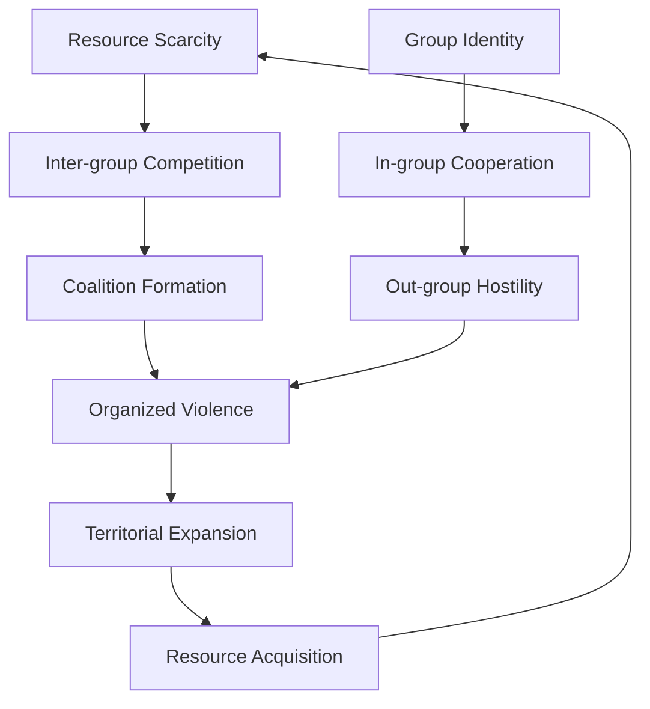

This group-level adaptation diagram reveals why warfare is not an aberration but a predictable outcome of human evolutionary psychology operating in competitive environments. Resource scarcity creates the fundamental condition that triggers intergroup competition, as groups must compete for limited resources necessary for survival and reproduction. This competition pressure favors groups that can effectively organize for collective action, leading to coalition formation and the development of group identity.

Coalition formation requires psychological mechanisms that enable individuals to suppress their immediate self-interest in favor of group goals. As evolutionary biologist David Sloan Wilson explains in "Does Altruism Exist?," group selection pressures favored individuals who could cooperate effectively within groups while competing effectively against other groups. This created the capacity for organized violence—coordinated aggression that requires individual sacrifice for group benefit.

Organized violence, when successful, leads to territorial expansion and resource acquisition that temporarily alleviates the resource scarcity that initiated the cycle. However, this success creates new dynamics: expanded territory requires defense, acquired resources attract competitors, and successful groups grow in size until they again face resource constraints. The cycle thus becomes self-perpetuating, with each successful episode of violence creating conditions that make future violence more likely.

The parallel process of group identity formation creates the psychological foundation for sustained intergroup conflict. Group identity generates in-group cooperation by creating shared identity, common goals, and mutual obligation among group members. However, the same psychological mechanisms that create in-group cooperation simultaneously generate out-group hostility through social comparison processes and zero-sum thinking about group status and resources.

This dual process—in-group cooperation enabling out-group hostility—explains why the same psychological mechanisms that enable humanity's greatest achievements in cooperation also enable its most destructive conflicts. The capacity for large-scale cooperation within groups is inseparable from the capacity for large-scale violence between groups, suggesting that warfare is not a failure of human cooperation but rather its dark complement.

### Neurobiological Basis of Aggression

Modern neuroscience reveals the biological substrates of violent behavior:

#### Brain Systems Involved in Aggression

Modern neuroscience reveals the biological substrates of violent behavior, demonstrating how specific brain regions and neural circuits create the capacity for aggression while also providing the mechanisms for its control. This neurobiological analysis explains why humans are capable of both extreme violence and remarkable restraint.

| Brain Region | Function | Role in Conflict |
|--------------|----------|------------------|
| **Amygdala** | Threat detection, fear response | Rapid aggression triggers |
| **Hypothalamus** | Hormonal regulation | Testosterone-driven dominance |
| **Prefrontal Cortex** | Executive control, inhibition | Restraint vs. impulse |
| **Anterior Cingulate** | Empathy, social cognition | Dehumanization processes |
| **Striatum** | Reward processing | Violence as rewarding behavior |

This neurobiological analysis reveals why aggression is both universal and controllable in humans. The amygdala serves as the brain's alarm system, rapidly detecting threats and triggering fight-or-flight responses before conscious awareness occurs. This system evolved to respond to immediate physical threats but now responds to symbolic, social, and abstract threats, creating rapid aggression triggers that can escalate conflicts before rational thought intervenes.

The hypothalamus regulates hormonal systems, particularly testosterone production, that influence dominance-seeking behavior and aggression. As neuroendocrinologist Robert Sapolsky explains in "Behave," testosterone doesn't directly cause aggression but rather amplifies whatever behavioral tendencies are already present. In competitive or threatening contexts, testosterone increases the likelihood of aggressive responses while also enhancing the rewarding feelings associated with dominance and victory.

The prefrontal cortex provides executive control and impulse inhibition, representing the brain's capacity for restraint and moral reasoning. This region enables humans to override aggressive impulses, consider long-term consequences, and engage in moral reasoning about violence. However, the prefrontal cortex is vulnerable to stress, fatigue, and emotional arousal, explaining why people are more likely to engage in violence when under pressure or in highly emotional states.

The anterior cingulate cortex processes empathy and social cognition, enabling humans to understand and share the emotional experiences of others. This region is crucial for maintaining moral constraints on violence by preserving the recognition of others' humanity. Dehumanization processes that enable extreme violence often involve the suppression or dysfunction of anterior cingulate activity, allowing perpetrators to view victims as objects rather than fellow human beings.

The striatum processes rewards and reinforcement, and research reveals that successful aggression and dominance can activate reward circuits in ways similar to other pleasurable experiences. This explains why some individuals find violence intrinsically rewarding and why successful military leaders and warriors often become addicted to combat. The rewarding nature of successful violence creates psychological reinforcement that can perpetuate aggressive behavior even when it becomes objectively counterproductive.

#### Neurochemical Factors

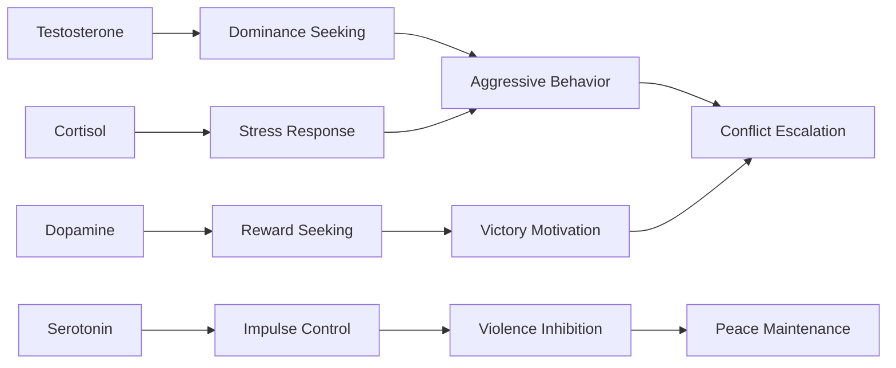

## Psychological Mechanisms of Conflict

### Cognitive Biases Driving Warfare

Human cognitive limitations systematically bias populations toward conflict:

#### Threat Perception Biases

| Bias Type | Description | Conflict Manifestation |
|-----------|-------------|----------------------|
| **Availability Heuristic** | Overweighting recent/vivid events | Overreaction to attacks |
| **Confirmation Bias** | Seeking supporting evidence | Enemy demonization |
| **Attribution Error** | Hostile intent attribution | Misinterpreting actions |
| **Anchoring Bias** | First impression persistence | Stereotyping enemies |
| **Loss Aversion** | Overvaluing current possessions | Territorial disputes |

#### Decision-Making Under Uncertainty

War decisions often occur under conditions that maximize cognitive bias impact:

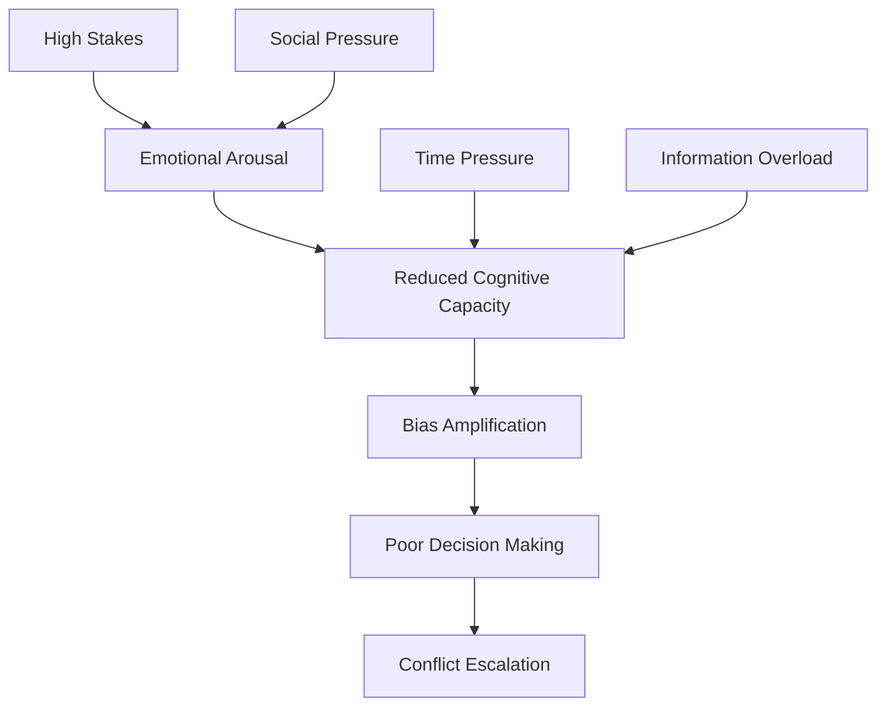

### Social Psychology of Enemy Creation

The psychological process of transforming other humans into legitimate targets of violence:

#### Dehumanization Process

| Stage | Psychological Mechanism | Behavioral Outcome |
|-------|------------------------|-------------------|
| **Categorization** | In-group/out-group distinction | "Us vs. Them" mentality |
| **Stereotyping** | Trait attribution to groups | Negative characterization |
| **Deindividuation** | Loss of individual identity | Seeing enemies as masses |
| **Moral Exclusion** | Removing from moral consideration | Justifying violence |
| **Dehumanization** | Denying human qualities | Extreme violence acceptance |

#### Propaganda and Psychological Warfare

Systematic manipulation of psychological vulnerabilities to promote conflict:

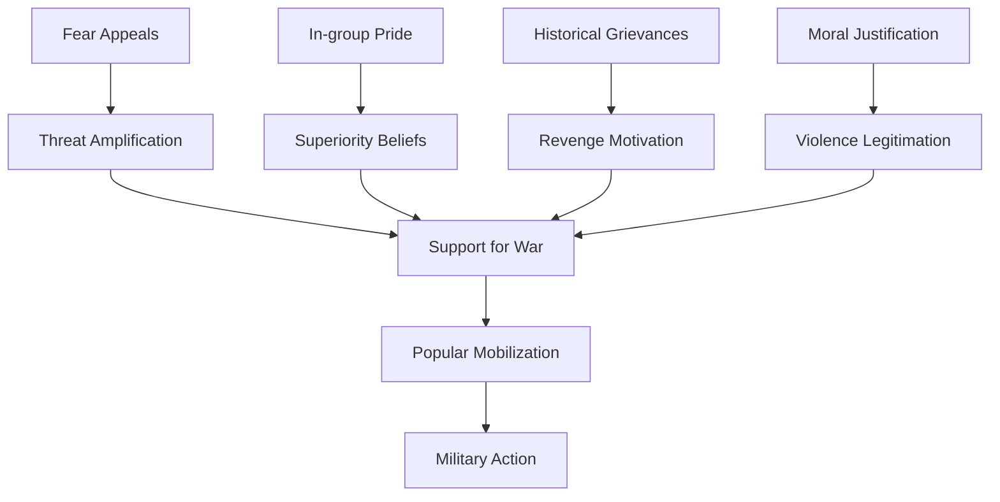

## Sociological Dimensions of Warfare

### Group Dynamics in Conflict

#### Social Identity Theory Applied to Warfare

Conflict emerges from fundamental processes of group identity formation:

| Process | Mechanism | Conflict Outcome |
|---------|-----------|------------------|
| **Social Categorization** | Group boundary creation | Identity-based divisions |
| **Social Identification** | Group membership adoption | Loyalty and commitment |
| **Social Comparison** | Inter-group evaluation | Competition and hostility |
| **Positive Distinctiveness** | Group superiority seeking | Dominance conflicts |

#### Realistic Conflict Theory

Competition over scarce resources creates systematic inter-group hostility:

### Institutional Factors in Warfare

#### Military-Industrial Complex

The institutional structures that perpetuate warfare:

| Institution Type | Conflict Interest | Perpetuation Mechanism |
|-----------------|-------------------|----------------------|
| **Military Organizations** | Organizational survival | Threat inflation |
| **Defense Industries** | Profit maximization | Arms sales promotion |
| **Political Leaders** | Power consolidation | Rally-around-flag effects |
| **Media Organizations** | Audience engagement | Conflict sensationalism |
| **Academic Institutions** | Research funding | Strategic studies expansion |

#### State Formation and Warfare

The co-evolution of state power and military capacity:

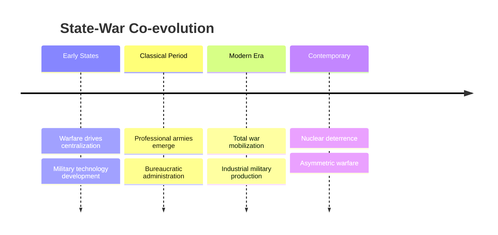

## Historical Patterns of Warfare

### Technological Evolution and Conflict

#### Weapons Technology Impact on Warfare

| Technology Era | Dominant Weapons | Conflict Characteristics | Psychological Impact |
|---------------|------------------|------------------------|-------------------|
| **Stone Age** | Clubs, spears | Small-scale raids | Personal violence |
| **Bronze Age** | Swords, chariots | Organized armies | Elite warrior culture |
| **Iron Age** | Iron weapons, siege engines | Mass infantry | Citizen soldiers |
| **Gunpowder** | Firearms, artillery | Professional armies | Depersonalized killing |
| **Industrial** | Machine guns, poison gas | Total war | Mass casualties |
| **Nuclear** | Nuclear weapons | Deterrence balance | Existential anxiety |
| **Information** | Cyber warfare, drones | Asymmetric conflict | Invisible warfare |

#### Warfare Evolution Timeline

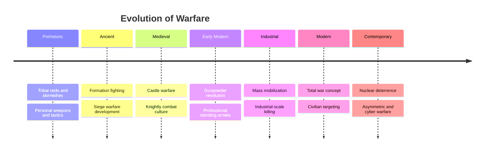

### Patterns of Conflict Escalation

#### Escalation Dynamics

The psychological and social processes that transform disputes into wars:

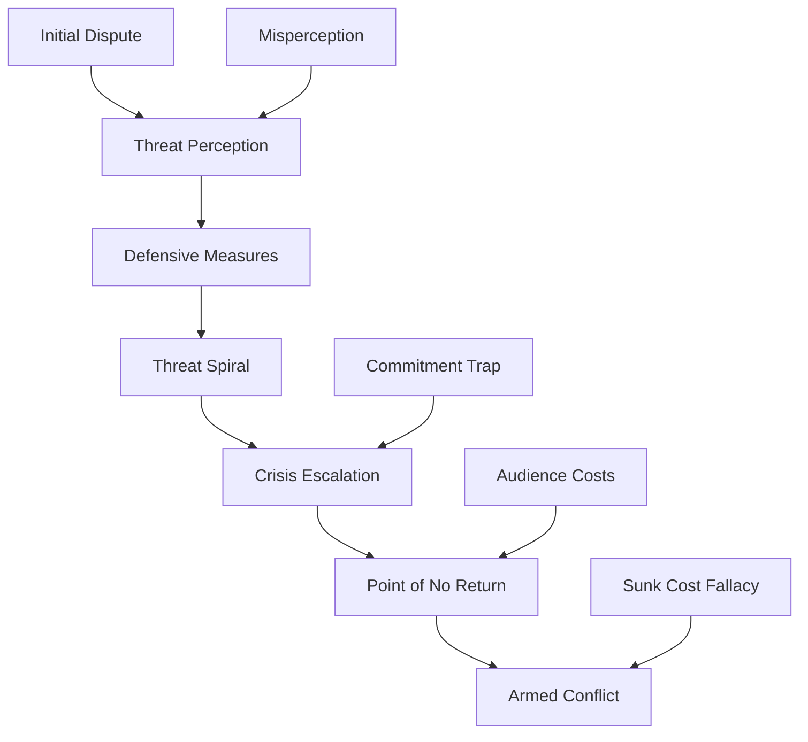

#### Historical Escalation Examples

| Conflict | Initial Trigger | Escalation Factors | Outcome |
|----------|----------------|-------------------|---------|
| **World War I** | Assassination | Alliance systems, mobilization | Global war |
| **Cuban Missile Crisis** | Missile deployment | Nuclear brinksmanship | Near-miss |
| **Vietnam War** | Advisor deployment | Commitment escalation | Prolonged conflict |
| **Iraq War (2003)** | WMD allegations | Regime change mission | Regional instability |

## Case Studies in Conflict Psychology

### World War I: The Psychology of Mass Mobilization

#### Pre-War Psychological Conditions

The psychological climate that enabled unprecedented mobilization:

| Factor | Description | Psychological Mechanism |
|--------|-------------|------------------------|
| **Nationalism** | Extreme patriotic fervor | In-group identification |
| **Militarism** | Glorification of military values | Authority worship |
| **Social Darwinism** | Belief in racial/national competition | Competitive psychology |
| **Optimism Bias** | Expectation of quick victory | Planning fallacy |

#### Mobilization Psychology

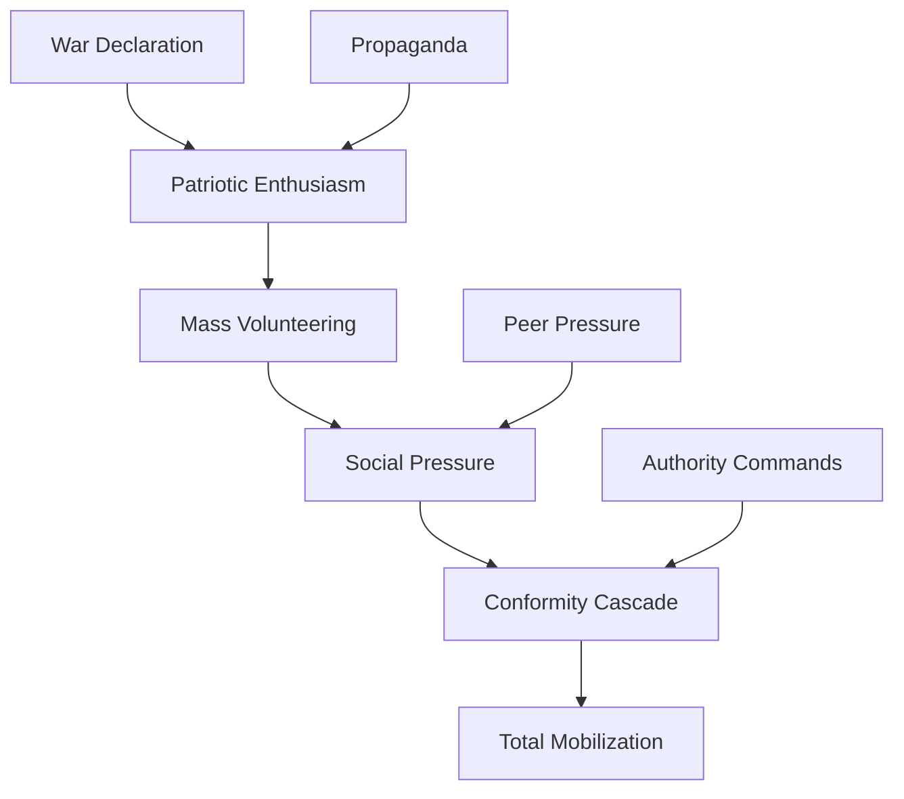

### World War II: Ideological Warfare

#### Nazi Psychology of Genocide

The systematic psychological processes enabling mass atrocity:

| Process Stage | Psychological Mechanism | Implementation |
|---------------|------------------------|----------------|
| **Dehumanization** | Removing human status | Propaganda campaigns |
| **Bureaucratization** | Diffusing responsibility | Administrative systems |
| **Gradual Escalation** | Incremental commitment | Step-by-step process |
| **Moral Disengagement** | Justifying actions | Ideological frameworks |

#### Resistance Psychology

Factors enabling resistance to genocidal participation:

- **Moral identity**: Strong ethical self-concept
- **Social support**: Alternative reference groups
- **Cognitive independence**: Resistance to authority
- **Empathetic capacity**: Maintained human connection

### Cold War: Psychology of Nuclear Deterrence

#### Deterrence Psychology

The psychological dynamics of nuclear standoff:

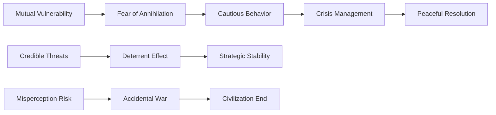

#### Psychological Stress of Nuclear Age

The mental health impact of living under nuclear threat:
- **Existential anxiety**: Constant awareness of potential annihilation
- **Learned helplessness**: Individual powerlessness over survival
- **Psychological numbing**: Defensive emotional shutdown
- **Apocalyptic thinking**: Fatalistic worldview development

## Contemporary Conflict Patterns

### Asymmetric Warfare Psychology

#### Insurgency and Terrorism

Modern conflicts increasingly involve non-state actors using psychological warfare:

| Tactic | Psychological Target | Intended Effect |
|--------|-------------------|-----------------|
| **Terrorism** | Civilian populations | Fear, policy pressure |
| **Guerrilla Warfare** | Military morale | Attrition, demoralization |
| **Information Warfare** | Public opinion | Narrative control |
| **Suicide Attacks** | Enemy psychology | Intimidation, despair |

#### Radicalization Process

The psychological pathway to violent extremism:

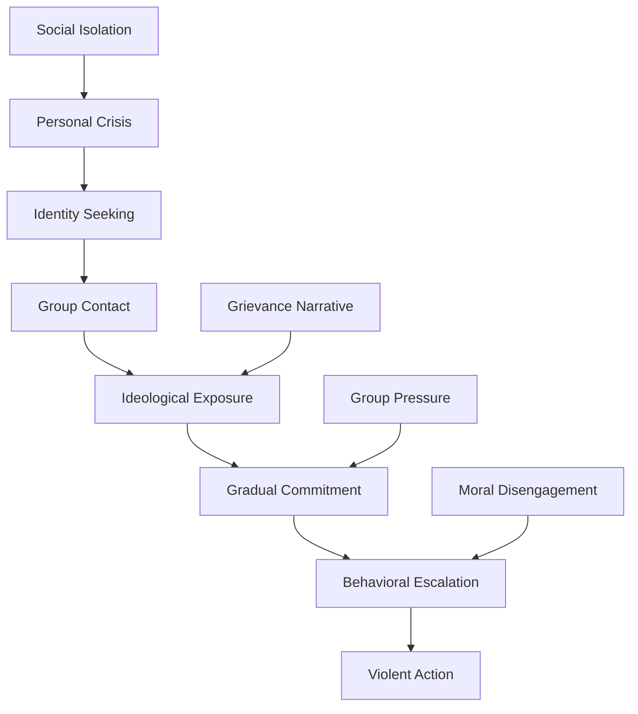

### Cyber Warfare and Information Conflict

#### Digital Age Warfare Psychology

Technology creates new domains for psychological manipulation:

| Domain | Psychological Weapon | Target |
|--------|-------------------|--------|
| **Social Media** | Disinformation campaigns | Public opinion |
| **Cyber Infrastructure** | System disruption | Social stability |
| **Economic Networks** | Financial warfare | Economic confidence |
| **Information Systems** | Data manipulation | Decision-making |

#### Information Warfare Effects

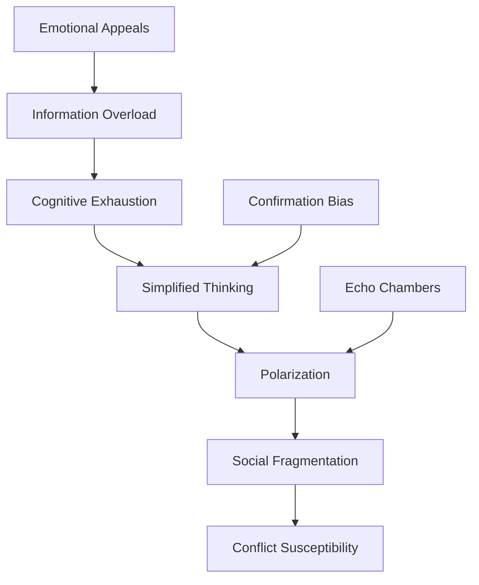

## Peace-Building and Conflict Resolution

### Psychological Barriers to Peace

#### Individual-Level Barriers

| Barrier Type | Description | Intervention Approach |
|--------------|-------------|---------------------|
| **Trauma** | Psychological wounds from violence | Therapeutic healing |
| **Revenge Motivation** | Desire for retaliation | Restorative justice |
| **Identity Threat** | Group identity under attack | Identity security |
| **Zero-Sum Thinking** | Win-lose mentality | Integrative solutions |

#### Group-Level Barriers

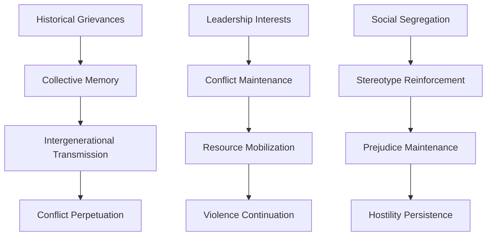

### Successful Peace-Building Strategies

#### Contact Theory Applications

Conditions for successful inter-group contact:

| Condition | Requirement | Psychological Effect |
|-----------|-------------|-------------------|
| **Equal Status** | Balanced power relations | Reduced dominance dynamics |
| **Common Goals** | Shared objectives | Cooperative motivation |
| **Institutional Support** | Authority endorsement | Legitimacy and safety |
| **Personal Interaction** | Individual relationships | Humanization process |

#### Truth and Reconciliation Processes

Psychological mechanisms of transitional justice:

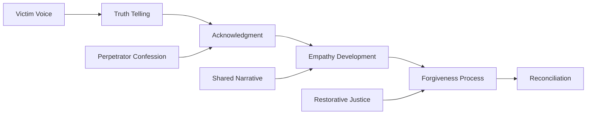

### Limitations of Peace-Building

#### Structural Constraints

Factors that limit peace-building effectiveness:
- **Economic inequality**: Resource competition persistence
- **Political systems**: Elite interests in conflict maintenance
- **Cultural factors**: Deep-seated identity conflicts
- **Psychological trauma**: Intergenerational transmission of hostility

#### Recurrence Patterns

Why conflicts often resume after peace agreements:

| Factor | Mechanism | Prevention Strategy |
|--------|-----------|-------------------|
| **Incomplete Resolution** | Underlying issues remain | Comprehensive agreements |
| **Spoiler Groups** | Actors benefiting from conflict | Inclusive processes |
| **Weak Institutions** | Inability to manage disputes | Institution building |
| **Economic Stress** | Resource competition returns | Development programs |

## Implications for Human Nature

### War as Human Universal

The ubiquity of warfare across cultures and history suggests fundamental aspects of human nature:

#### Universal Conflict Patterns

Despite vast cultural differences, warfare exhibits consistent features:
- **In-group/out-group dynamics**: Universal tribal psychology
- **Dominance hierarchies**: Status competition across societies
- **Resource competition**: Scarcity-driven conflict
- **Revenge cycles**: Retaliation psychology

#### Evolutionary Mismatch

Modern warfare represents a dangerous mismatch between evolved psychology and contemporary technology:

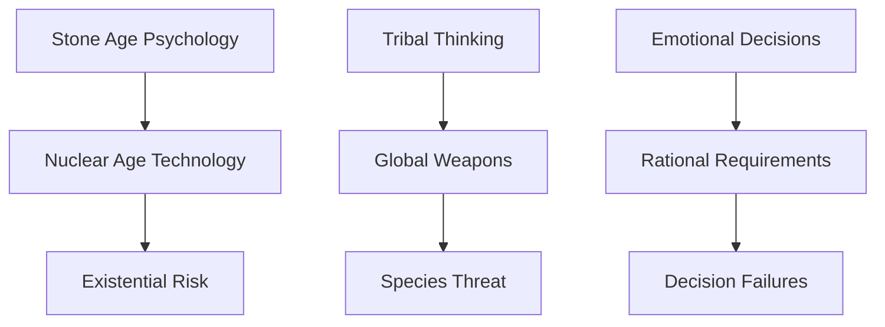

### Prospects for Peace

#### Optimistic Factors

Trends that might reduce warfare:
- **Economic interdependence**: Mutual benefit from cooperation
- **Democratic peace theory**: Democracies rarely fight each other
- **International institutions**: Conflict resolution mechanisms
- **Nuclear deterrence**: Mutual assured destruction

#### Pessimistic Factors

Persistent drivers of conflict:
- **Resource scarcity**: Climate change and population pressure
- **Technological disruption**: New domains for competition
- **Identity conflicts**: Persistent tribal psychology
- **Inequality**: Growing disparities creating instability

## Conclusion

The analysis of war and conflict reveals one of humanity's most troubling characteristics: our persistent propensity for organized violence despite its obvious destructiveness and our growing understanding of its psychological and social roots. The evidence suggests that warfare is not an aberration or failure of human civilization but a fundamental expression of evolved psychological and social mechanisms that served adaptive functions in ancestral environments but create existential risks in the modern world.

The psychological foundations of conflict—including in-group/out-group bias, dominance seeking, threat perception biases, and revenge motivation—appear to be universal features of human nature that transcend cultural and technological boundaries. These mechanisms, combined with social dynamics of group identity, resource competition, and institutional interests, create powerful forces driving societies toward violence.

While peace-building efforts have achieved notable successes, the psychological barriers to lasting peace remain formidable. The recurring nature of conflict, the ease with which peaceful populations can be mobilized for war, and the persistence of the underlying psychological drivers suggest that warfare will likely remain a central feature of human existence.

The implications are particularly sobering in the contemporary era, where technological advancement has created weapons capable of destroying civilization while the psychological mechanisms driving conflict remain largely unchanged. Understanding these patterns provides crucial insights for conflict prevention and peace-building, but the deep-seated nature of the psychological drivers suggests that eliminating warfare may require fundamental changes in human nature that are beyond our current capabilities.

The study of war and conflict thus serves as a stark reminder of the darker aspects of human psychology and the persistent power of our evolutionary heritage to undermine our highest aspirations for peace and cooperation.

## References

1. Keeley, L. H. (1996). *War Before Civilization: The Myth of the Peaceful Savage*. Oxford University Press.
2. Pinker, S. (2011). *The Better Angels of Our Nature: Why Violence Has Declined*. Viking.
3. Baumeister, R. F. (1997). *Evil: Inside Human Violence and Cruelty*. W. H. Freeman.
4. Grossman, D. (1995). *On Killing: The Psychological Cost of Learning to Kill in War and Society*. Little, Brown and Company.
5. Bar-Tal, D. (2013). *Intractable Conflicts: Socio-Psychological Foundations and Dynamics*. Cambridge University Press.

---

*[See: Individual Psychology → Aggression] [Related: Group Dynamics → In-group Bias] [Compare: Historical Analysis → Civilizational Collapse]*