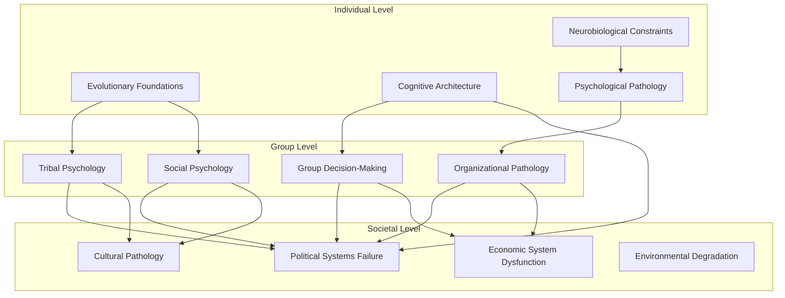
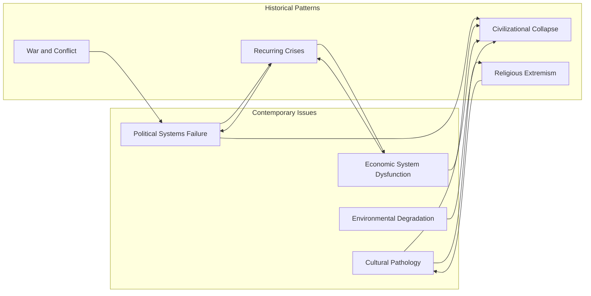
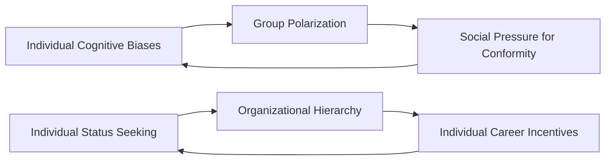
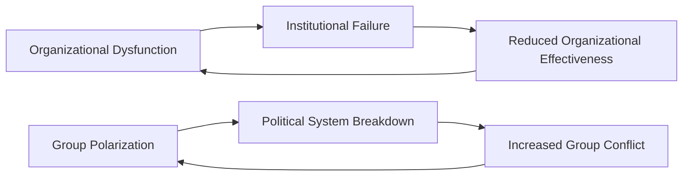
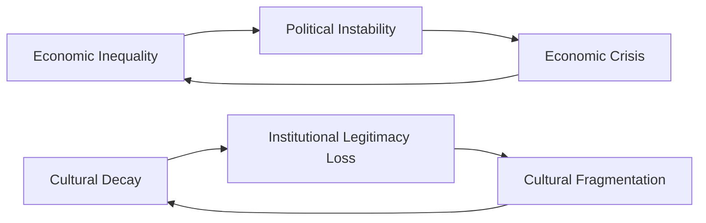

# Cross-Reference Map

## Conceptual Relationship Network

This map visualizes the interconnections between documents, showing how concepts, theories, and problems relate across the documentation system.

### Primary Causal Chains

#### Individual → Group → Societal Progression

#### Historical Pattern Integration

## Document Relationship Matrix

### Strong Connections (Direct Causal or Theoretical Links)

| Source Document | Target Document | Relationship Type | Description |
|----------------|-----------------|-------------------|-------------|
| [Evolutionary Foundations](../individual/evolutionary-foundations.md) | [Tribal Psychology](../group/tribal-psychology.md) | **Causal** | Evolutionary basis of tribal behavior |
| [Cognitive Architecture](../individual/cognitive-architecture.md) | [Group Decision-Making Failures](../group/group-decision-making-failures.md) | **Aggregation** | Individual biases create group irrationality |
| [Social Psychology](../group/social-psychology.md) | [Political Systems Failure](../societal/political-systems-failure.md) | **Scaling** | Social dynamics undermine democratic institutions |
| [Behavioral Economics](../individual/behavioral-economics.md) | [Economic System Dysfunction](../societal/economic-system-dysfunction.md) | **Aggregation** | Individual irrationality creates market failures |
| [Organizational Pathology](../group/organizational-pathology.md) | [Political Systems Failure](../societal/political-systems-failure.md) | **Institutional** | Organizational dysfunction undermines governance |
| [Cultural Pathology](../societal/cultural-pathology.md) | [Civilizational Collapse](../historical/civilizational-collapse.md) | **Historical** | Cultural decay precedes civilizational breakdown |

### Moderate Connections (Shared Mechanisms or Parallel Patterns)

| Source Document | Target Document | Relationship Type | Description |
|----------------|-----------------|-------------------|-------------|
| [Neurobiological Constraints](../individual/neurobiological-constraints.md) | [Addiction and Compulsion](../individual/addiction-compulsion.md) | **Mechanistic** | Shared neurobiological pathways |
| [Existential Psychology](../individual/existential-psychology.md) | [Cultural Pathology](../societal/cultural-pathology.md) | **Parallel** | Individual and cultural meaning crises |
| [Collective Behavior](../group/collective-behavior.md) | [Religious and Ideological Extremism](../historical/religious-ideological-extremism.md) | **Historical** | Mass movements and extremist mobilization |
| [Technological Disruption](../societal/technological-disruption.md) | [Communication and Language Failures](../specialized/communication-language-failures.md) | **Thematic** | Technology's impact on communication |
| [War and Conflict](../historical/war-and-conflict.md) | [Recurring Crises](../historical/recurring-crises.md) | **Pattern** | Conflict as recurring historical pattern |

### Weak Connections (Conceptual or Theoretical Overlap)

| Source Document | Target Document | Relationship Type | Description |
|----------------|-----------------|-------------------|-------------|
| [Aging and Mortality Anxiety](../specialized/aging-mortality-anxiety.md) | [Existential Psychology](../individual/existential-psychology.md) | **Conceptual** | Mortality as existential concern |
| [Gender and Sexuality Dysfunction](../specialized/gender-sexuality-dysfunction.md) | [Cultural Pathology](../societal/cultural-pathology.md) | **Cultural** | Gender issues reflect cultural problems |
| [Education and Knowledge Transmission Failures](../specialized/education-knowledge-transmission-failures.md) | [Cultural Pathology](../societal/cultural-pathology.md) | **Institutional** | Educational failure and cultural decline |
| [Power and Dominance](../specialized/power-dominance.md) | [Political Systems Failure](../societal/political-systems-failure.md) | **Motivational** | Power drives and political dysfunction |

## Thematic Cross-References

### Cognitive and Decision-Making Themes

**Core Documents**: [Cognitive Architecture](../individual/cognitive-architecture.md), [Cognitive Biases and Heuristics](../individual/cognitive-biases-heuristics.md)

**Related Documents**:
- [Behavioral Economics](../individual/behavioral-economics.md) - Economic applications of cognitive limitations
- [Group Decision-Making Failures](../group/group-decision-making-failures.md) - Collective manifestations of individual biases
- [Political Systems Failure](../societal/political-systems-failure.md) - Political consequences of cognitive limitations
- [Pandemic and Crisis Response](../historical/pandemic-crisis-response.md) - Cognitive biases in crisis situations

### Social Identity and Group Dynamics Themes

**Core Documents**: [Social Psychology](../group/social-psychology.md), [Tribal Psychology](../group/tribal-psychology.md)

**Related Documents**:
- [Evolutionary Foundations](../individual/evolutionary-foundations.md) - Evolutionary basis of social behavior
- [Collective Behavior](../group/collective-behavior.md) - Mass manifestations of social psychology
- [Political Systems Failure](../societal/political-systems-failure.md) - Political tribalism and polarization
- [War and Conflict](../historical/war-and-conflict.md) - Intergroup conflict and warfare
- [Religious and Ideological Extremism](../historical/religious-ideological-extremism.md) - Ideological group formation

### Power and Hierarchy Themes

**Core Documents**: [Power and Dominance](../specialized/power-dominance.md), [Organizational Pathology](../group/organizational-pathology.md)

**Related Documents**:
- [Evolutionary Foundations](../individual/evolutionary-foundations.md) - Evolutionary basis of dominance behavior
- [Political Systems Failure](../societal/political-systems-failure.md) - Power concentration and abuse
- [Economic System Dysfunction](../societal/economic-system-dysfunction.md) - Economic power and inequality
- [Civilizational Collapse](../historical/civilizational-collapse.md) - Elite behavior and civilizational decline

### Meaning and Culture Themes

**Core Documents**: [Existential Psychology](../individual/existential-psychology.md), [Cultural Pathology](../societal/cultural-pathology.md)

**Related Documents**:
- [Aging and Mortality Anxiety](../specialized/aging-mortality-anxiety.md) - Individual mortality concerns
- [Religious and Ideological Extremism](../historical/religious-ideological-extremism.md) - Extremist responses to meaning crisis
- [Education and Knowledge Transmission Failures](../specialized/education-knowledge-transmission-failures.md) - Cultural knowledge transmission
- [Civilizational Collapse](../historical/civilizational-collapse.md) - Cultural factors in civilizational decline

### Systems and Complexity Themes

**Core Documents**: [Systems Theory Perspective](../integrative/systems-theory-perspective.md), [Complexity Science](../integrative/complexity-science.md)

**Related Documents**:
- [Cross-Level Integration](../integrative/cross-level-integration.md) - Multi-level system interactions
- [Future Projections](../integrative/future-projections.md) - Complex system predictions
- [Environmental Degradation](../societal/environmental-degradation.md) - Human-environment system dynamics
- [Technological Disruption](../societal/technological-disruption.md) - Technology-society system interactions

## Navigation Pathways by Research Interest

### For Psychologists
**Entry Point**: [Cognitive Architecture](../individual/cognitive-architecture.md)
**Pathway**: → [Cognitive Biases](../individual/cognitive-biases-heuristics.md) → [Social Psychology](../group/social-psychology.md) → [Group Decision-Making](../group/group-decision-making-failures.md) → [Political Systems](../societal/political-systems-failure.md)

### For Sociologists
**Entry Point**: [Social Psychology](../group/social-psychology.md)
**Pathway**: → [Collective Behavior](../group/collective-behavior.md) → [Cultural Pathology](../societal/cultural-pathology.md) → [Organizational Pathology](../group/organizational-pathology.md) → [Political Systems](../societal/political-systems-failure.md)

### For Political Scientists
**Entry Point**: [Political Systems Failure](../societal/political-systems-failure.md)
**Pathway**: → [Group Decision-Making](../group/group-decision-making-failures.md) → [Social Psychology](../group/social-psychology.md) → [Tribal Psychology](../group/tribal-psychology.md) → [War and Conflict](../historical/war-and-conflict.md)

### For Economists
**Entry Point**: [Behavioral Economics](../individual/behavioral-economics.md)
**Pathway**: → [Economic System Dysfunction](../societal/economic-system-dysfunction.md) → [Cognitive Architecture](../individual/cognitive-architecture.md) → [Group Decision-Making](../group/group-decision-making-failures.md) → [Political Systems](../societal/political-systems-failure.md)

### For Historians
**Entry Point**: [Civilizational Collapse](../historical/civilizational-collapse.md)
**Pathway**: → [Recurring Crises](../historical/recurring-crises.md) → [Political Systems](../societal/political-systems-failure.md) → [Cultural Pathology](../societal/cultural-pathology.md) → [War and Conflict](../historical/war-and-conflict.md)

### For Anthropologists
**Entry Point**: [Evolutionary Foundations](../individual/evolutionary-foundations.md)
**Pathway**: → [Tribal Psychology](../group/tribal-psychology.md) → [Cultural Pathology](../societal/cultural-pathology.md) → [Religious Extremism](../historical/religious-ideological-extremism.md) → [Civilizational Collapse](../historical/civilizational-collapse.md)

### For Systems Theorists
**Entry Point**: [Systems Theory Perspective](../integrative/systems-theory-perspective.md)
**Pathway**: → [Cross-Level Integration](../integrative/cross-level-integration.md) → [Complexity Science](../integrative/complexity-science.md) → [Future Projections](../integrative/future-projections.md) → [Theoretical Synthesis](../integrative/theoretical-synthesis.md)

## Feedback Loop Identification

### Individual ↔ Group Feedback Loops

### Group ↔ Societal Feedback Loops

### Societal ↔ Historical Feedback Loops

## Cross-Reference Validation

### Internal Consistency Checks
- **Theoretical Coherence**: Ensure cross-references maintain theoretical consistency
- **Empirical Support**: Verify that claimed relationships have empirical backing
- **Logical Flow**: Check that causal chains are logically sound
- **Completeness**: Identify missing connections that should exist

### External Validation
- **Academic Literature**: Cross-references should align with established academic findings
- **Historical Evidence**: Historical connections should be supported by evidence
- **Contemporary Relevance**: Modern applications should be demonstrably relevant

---

**Navigation**: [Master Index](master-index.md) | [Topic Index](topic-index.md) | [Discipline Index](discipline-index.md) | [Level Index](level-index.md)