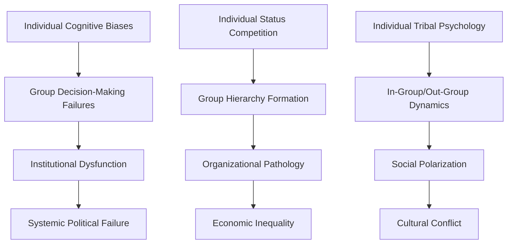
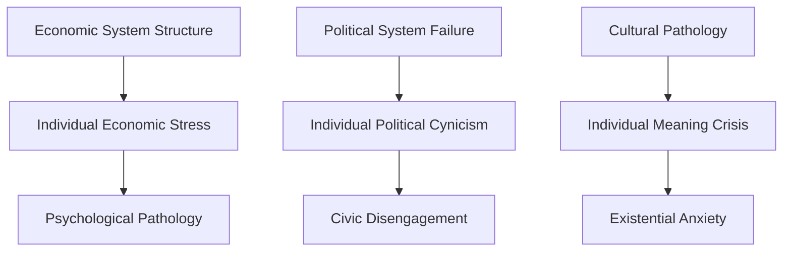
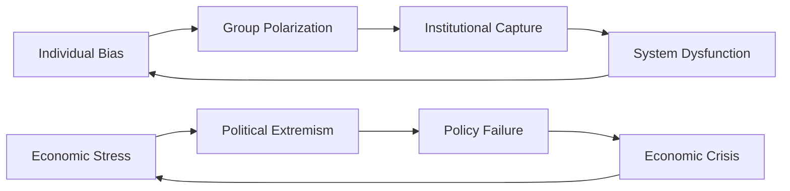

# Level-Based Index

## Individual Level Analysis

### Cognitive and Neurobiological Foundations
Individual-level problems rooted in the structure and function of human cognition and neurobiology.

| Document | Focus Area | Key Mechanisms | Upward Connections |
|----------|------------|----------------|-------------------|
| [Evolutionary Foundations](../individual/evolutionary-foundations.md) | Evolutionary mismatch | Adaptive lag, environmental mismatch | → Tribal Psychology, Social Psychology |
| [Cognitive Architecture](../individual/cognitive-architecture.md) | Reasoning limitations | Cognitive biases, heuristics | → Group Decision-Making, Political Systems |
| [Neurobiological Constraints](../individual/neurobiological-constraints.md) | Brain structure limits | Neural circuits, neurotransmitters | → Addiction patterns, Social behavior |
| [Cognitive Biases and Heuristics](../individual/cognitive-biases-heuristics.md) | Systematic thinking errors | Availability, confirmation bias | → Collective irrationality, Mass movements |

### Psychological Pathology and Dysfunction
Individual psychological disorders and maladaptive patterns that aggregate into collective problems.

| Document | Focus Area | Key Mechanisms | Upward Connections |
|----------|------------|----------------|-------------------|
| [Psychological Pathology](../individual/psychological-pathology.md) | Personality disorders | Emotional dysregulation, cognitive distortions | → Organizational dysfunction, Leadership failures |
| [Addiction and Compulsion](../individual/addiction-compulsion.md) | Addictive behaviors | Reward circuits, tolerance | → Social contagion, Economic costs |
| [Existential Psychology](../individual/existential-psychology.md) | Meaning-making failures | Existential anxiety, nihilism | → Cultural decay, Religious extremism |
| [Behavioral Economics](../individual/behavioral-economics.md) | Economic irrationality | Loss aversion, framing effects | → Market failures, Economic bubbles |

## Group Level Analysis

### Social Dynamics and Collective Behavior
Group-level phenomena emerging from individual psychology but creating distinct collective properties.

| Document | Focus Area | Key Mechanisms | Downward Influences | Upward Connections |
|----------|------------|----------------|-------------------|-------------------|
| [Social Psychology](../group/social-psychology.md) | Social influence processes | Conformity, obedience, social proof | Individual identity formation | → Political polarization, Cultural movements |
| [Collective Behavior](../group/collective-behavior.md) | Mass movements | Social contagion, deindividuation | Individual moral reasoning | → Political upheaval, Cultural transformation |
| [Tribal Psychology](../group/tribal-psychology.md) | In-group/out-group dynamics | Tribal loyalty, intergroup competition | Individual identity and belonging | → Nationalism, Ethnic conflict |

### Organizational and Institutional Dysfunction
Structured group failures in formal organizations and institutions.

| Document | Focus Area | Key Mechanisms | Downward Influences | Upward Connections |
|----------|------------|----------------|-------------------|-------------------|
| [Organizational Pathology](../group/organizational-pathology.md) | Institutional dysfunction | Bureaucratic inertia, goal displacement | Individual career incentives | → Systemic institutional failure |
| [Group Decision-Making Failures](../group/group-decision-making-failures.md) | Collective irrationality | Groupthink, polarization | Individual cognitive biases | → Policy failures, Strategic disasters |

## Societal Level Analysis

### Political and Economic Systems
Large-scale institutional arrangements and their systematic failures.

| Document | Focus Area | Key Mechanisms | Downward Influences | Historical Patterns |
|----------|------------|----------------|-------------------|-------------------|
| [Political Systems Failure](../societal/political-systems-failure.md) | Governance breakdown | Democratic backsliding, elite capture | Individual political behavior | → Civilizational collapse patterns |
| [Economic System Dysfunction](../societal/economic-system-dysfunction.md) | Market and system failures | Inequality, systemic risk | Individual economic choices | → Economic crisis cycles |

### Cultural and Environmental Systems
Broad cultural patterns and human-environment interactions at civilizational scale.

| Document | Focus Area | Key Mechanisms | Downward Influences | Historical Patterns |
|----------|------------|----------------|-------------------|-------------------|
| [Cultural Pathology](../societal/cultural-pathology.md) | Cultural decay | Value system collapse, ideological extremism | Individual meaning-making | → Cultural transformation cycles |
| [Environmental Degradation](../societal/environmental-degradation.md) | Human-environment failures | Resource depletion, ecological collapse | Individual consumption patterns | → Civilizational sustainability crises |
| [Technological Disruption](../societal/technological-disruption.md) | Technology-society interaction | Technological unemployment, social fragmentation | Individual technology adoption | → Technological revolution cycles |

## Historical Level Analysis

### Temporal Patterns and Civilizational Dynamics
Long-term historical patterns that transcend individual civilizations and reveal universal human tendencies.

| Document | Focus Area | Key Mechanisms | Cross-Level Integration |
|----------|------------|----------------|----------------------|
| [Civilizational Collapse](../historical/civilizational-collapse.md) | Societal breakdown patterns | Resource depletion, institutional failure, external shocks | Individual → Group → Society → Collapse |
| [Recurring Crises](../historical/recurring-crises.md) | Cyclical dysfunction | Economic cycles, political upheaval, social movements | Feedback loops across all levels |
| [War and Conflict](../historical/war-and-conflict.md) | Human conflict patterns | Resource competition, ideological differences | Tribal psychology → Group conflict → Warfare |
| [Religious and Ideological Extremism](../historical/religious-ideological-extremism.md) | Extremist movements | Psychological predisposition, social conditions | Individual psychology → Group dynamics → Cultural movements |
| [Pandemic and Crisis Response](../historical/pandemic-crisis-response.md) | Crisis response patterns | Fear responses, institutional capacity | Individual behavior → Collective response → Systemic outcomes |

## Integrative Level Analysis

### Cross-Level Synthesis and Systems Perspectives
Analysis that explicitly integrates across levels and synthesizes multiple theoretical frameworks.

| Document | Focus Area | Integration Approach | Key Insights |
|----------|------------|---------------------|--------------|
| [Systems Theory Perspective](../integrative/systems-theory-perspective.md) | Feedback loops and emergence | Systems thinking, cybernetics | How individual actions create systemic properties |
| [Complexity Science](../integrative/complexity-science.md) | Non-linear dynamics | Complex adaptive systems | How simple rules generate complex behaviors |
| [Cross-Level Integration](../integrative/cross-level-integration.md) | Multi-level interactions | Emergence, downward causation | How levels influence each other bidirectionally |
| [Future Projections](../integrative/future-projections.md) | Trajectory analysis | Scenario planning, trend analysis | How current patterns may evolve |
| [Theoretical Synthesis](../integrative/theoretical-synthesis.md) | Framework integration | Meta-theoretical analysis | How different theories complement each other |

## Specialized Cross-Level Topics

### Domain-Specific Analysis Cutting Across Levels
Specialized topics that manifest differently at each level but require integrated analysis.

| Document | Individual Manifestation | Group Manifestation | Societal Manifestation |
|----------|-------------------------|-------------------|----------------------|
| [Gender and Sexuality Dysfunction](../specialized/gender-sexuality-dysfunction.md) | Gender identity issues, sexual dysfunction | Gender role conflicts, sexual harassment | Gender inequality, reproductive rights |
| [Aging and Mortality Anxiety](../specialized/aging-mortality-anxiety.md) | Death anxiety, aging fears | Ageism, intergenerational conflict | Healthcare systems, demographic transitions |
| [Power and Dominance](../specialized/power-dominance.md) | Dominance motivation, status seeking | Leadership pathology, power struggles | Authoritarianism, elite capture |
| [Communication and Language Failures](../specialized/communication-language-failures.md) | Language processing deficits | Miscommunication, group polarization | Information systems, media dysfunction |
| [Education and Knowledge Transmission Failures](../specialized/education-knowledge-transmission-failures.md) | Learning disabilities, knowledge gaps | Educational inequality, institutional failure | Knowledge loss, cultural transmission breakdown |

## Level Interaction Patterns

### Upward Causation (Bottom-Up)
How individual-level phenomena aggregate to create group and societal-level problems.

### Downward Causation (Top-Down)
How societal and group-level structures influence individual psychology and behavior.

### Feedback Loops
Circular causation patterns that reinforce problems across levels.

## Navigation Pathways

### Vertical Navigation (Across Levels)
- **Individual → Group**: How personal psychology creates collective dynamics
- **Group → Societal**: How organizational behavior shapes institutional outcomes
- **Societal → Historical**: How contemporary patterns fit historical cycles
- **Historical → Individual**: How historical patterns influence personal psychology

### Horizontal Navigation (Within Levels)
- **Individual Level**: Connections between cognitive, emotional, and behavioral problems
- **Group Level**: Relationships between social, organizational, and collective phenomena
- **Societal Level**: Interactions between political, economic, and cultural systems
- **Historical Level**: Patterns connecting different types of historical crises

### Temporal Navigation
- **Short-term**: Immediate manifestations and acute crises
- **Medium-term**: Generational patterns and institutional cycles
- **Long-term**: Civilizational trends and species-level patterns
- **Evolutionary**: Deep-time patterns in human nature and social organization

---

**Navigation**: [Master Index](master-index.md) | [Topic Index](topic-index.md) | [Discipline Index](discipline-index.md) | [Cross-Reference Map](cross-reference-map.md)