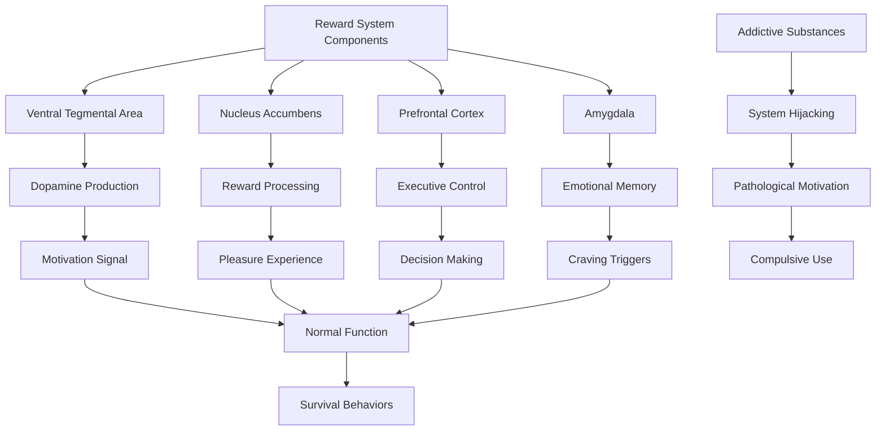
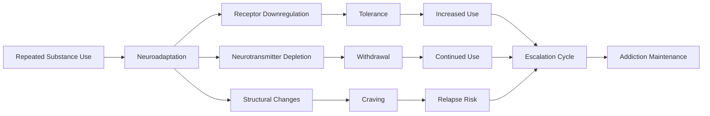
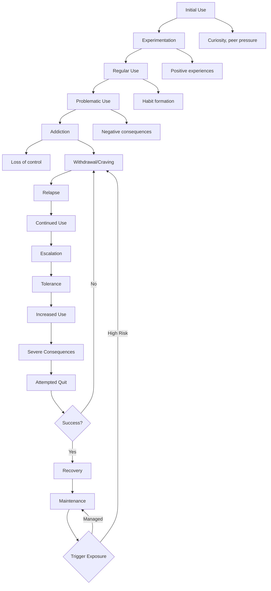
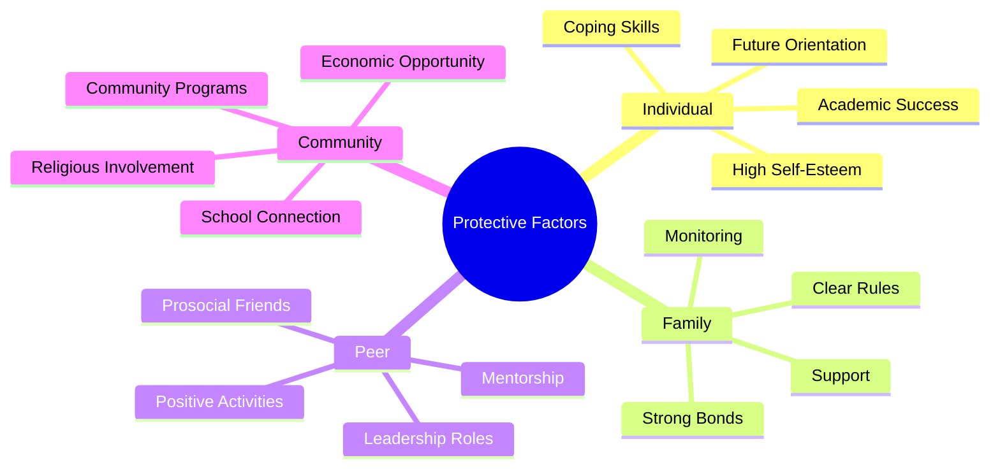
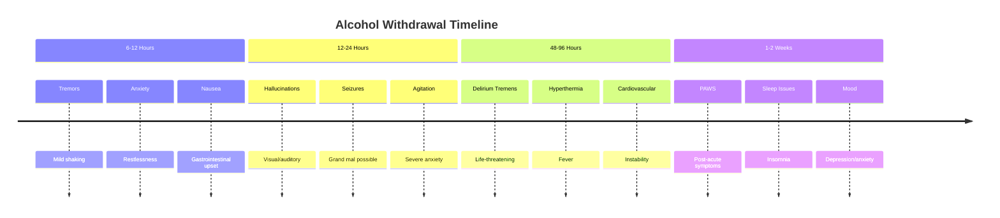
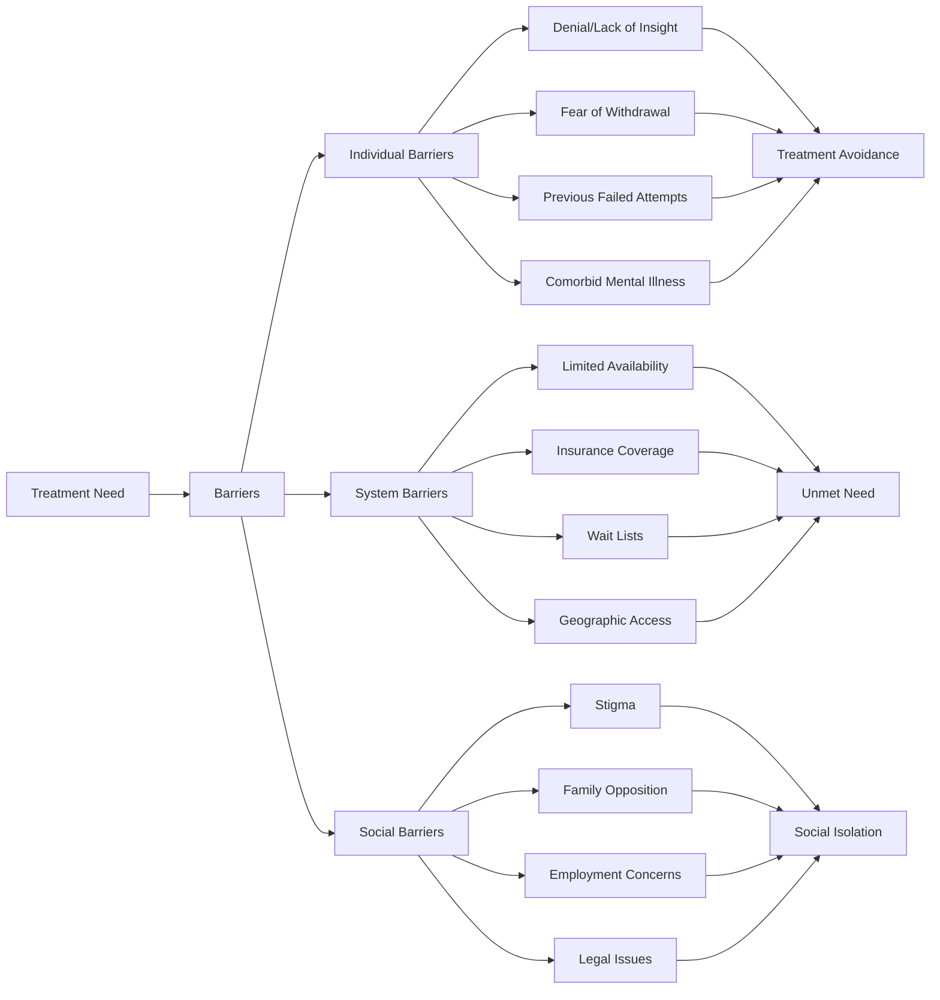
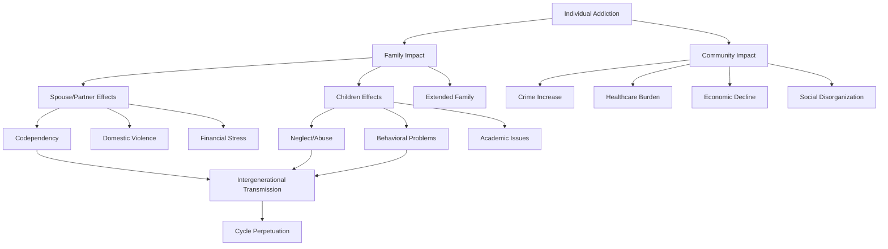
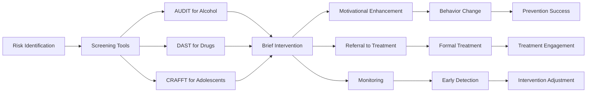

# Addiction and Compulsive Behaviors: Neurochemical Hijacking of Human Motivation

## Abstract

Addiction and compulsive behaviors represent systematic failures in human motivation and reward systems, where natural neurochemical processes become hijacked by substances or behaviors that provide supernormal stimuli. These conditions affect millions globally, creating cycles of compulsive engagement despite negative consequences. Understanding addiction reveals fundamental vulnerabilities in human neurobiology and decision-making that contribute to individual suffering and massive societal costs.

## Introduction

Human beings evolved sophisticated reward and motivation systems to promote survival-relevant behaviors such as eating, reproduction, and social bonding. However, these same neurobiological mechanisms can be exploited by substances and behaviors that provide intense, immediate rewards, leading to addiction and compulsive disorders. These conditions represent a hijacking of normal motivational processes, creating pathological patterns of behavior that persist despite devastating consequences.

## Neurobiological Foundations of Addiction

### The Brain's Reward System

The brain's reward system evolved to motivate survival-relevant behaviors but becomes vulnerable to hijacking by addictive substances and behaviors. This flowchart illustrates how normal reward processing can be corrupted, leading to pathological patterns of motivation and behavior.



This reward system diagram reveals why addiction represents a fundamental hijacking of human motivation rather than simply a failure of willpower or moral character. The ventral tegmental area (VTA) produces dopamine in response to rewarding stimuli, creating the neurochemical signal that motivates behavior. In normal functioning, this system promotes survival-relevant activities like eating, reproduction, and social bonding by making these activities pleasurable and motivating.

The nucleus accumbens processes reward signals and creates the subjective experience of pleasure and satisfaction. This region integrates dopamine signals with other neurotransmitters to generate the positive feelings associated with rewarding activities. In addiction, substances like cocaine, heroin, and alcohol directly stimulate this region with intensities far exceeding natural rewards, creating supernormal pleasure experiences that natural activities cannot match.

The prefrontal cortex provides executive control and decision-making capacity, enabling individuals to weigh long-term consequences against immediate rewards. This region is crucial for resisting impulses and making rational choices about behavior. However, chronic substance use impairs prefrontal cortex function while simultaneously strengthening the reward pathways, creating a neurobiological imbalance where impulse overwhelms rational control.

The amygdala processes emotional memory and creates associations between environmental cues and reward experiences. In addiction, this region becomes hyperresponsive to drug-related cues, creating intense craving responses that can persist long after substance use has stopped. These conditioned responses explain why environmental triggers can precipitate relapse even after extended periods of abstinence.

When addictive substances hijack this system, they create pathological motivation patterns where the individual becomes compulsively driven to seek and use substances despite devastating consequences. The normal reward system that evolved to promote survival becomes redirected toward self-destructive behavior, illustrating how evolutionary adaptations can become maladaptive in modern environments.

### Dopamine and Reward Prediction Error

#### Normal vs. Addicted Dopamine Response

The transformation of dopamine response patterns in addiction reveals why recovery is so difficult and why addicted individuals lose interest in previously enjoyable activities. This table demonstrates how addiction fundamentally alters the brain's reward processing, creating a neurochemical prison that traps individuals in cycles of compulsive use.

| Stimulus Type | Normal Brain Response | Addicted Brain Response | Behavioral Consequence |
|---------------|----------------------|------------------------|----------------------|
| **Natural Rewards** | Moderate dopamine release | Blunted dopamine response | Reduced pleasure in normal activities |
| **Drug Cues** | Minimal response | Massive dopamine surge | Intense craving and seeking |
| **Drug Use** | N/A | Tolerance-reduced response | Need for increasing amounts |
| **Withdrawal** | N/A | Dopamine depletion | Dysphoria, depression, anxiety |

This dopamine response analysis reveals the neurochemical basis of addiction's most devastating effects. In normal brains, natural rewards like food, sex, social interaction, and achievement produce moderate dopamine release that creates pleasure and motivation. This balanced system ensures that individuals remain motivated by a variety of life activities and maintain psychological well-being through diverse sources of satisfaction.

In addicted brains, natural rewards produce blunted dopamine responses, creating anhedonia—the inability to experience pleasure from normal activities. As neuroscientist Nora Volkow's research demonstrates, this blunting occurs because the brain adapts to the supernormal dopamine levels produced by addictive substances by reducing its sensitivity to dopamine. The result is that activities that once brought joy—relationships, hobbies, work achievements—no longer provide sufficient neurochemical reward to motivate behavior.

Drug cues—environmental triggers associated with substance use—produce massive dopamine surges in addicted brains, often exceeding the dopamine response to the drug itself. This explains why people in recovery can experience intense cravings when exposed to people, places, or situations associated with their substance use. The brain has learned to anticipate the drug reward so strongly that mere cues can trigger overwhelming motivation to use.

The actual drug use produces increasingly reduced dopamine responses due to tolerance, meaning that individuals need progressively larger amounts to achieve the same neurochemical effect. This creates an escalating cycle where the individual must use more and more of the substance to achieve diminishing rewards, while simultaneously losing the ability to enjoy natural pleasures.

Withdrawal creates dopamine depletion that produces dysphoria, depression, and anxiety—the opposite of the drug's initial effects. This neurochemical rebound effect means that stopping substance use doesn't simply return the brain to normal functioning but creates a period of intense psychological suffering that motivates continued use to avoid these negative states.

### Neuroadaptation and Tolerance

#### Brain Changes in Addiction



## Classification of Addictive Disorders

### Substance Use Disorders

#### Major Categories and Mechanisms

| Substance Category | Primary Mechanism | Addiction Potential | Withdrawal Severity | Treatment Approach |
|-------------------|------------------|-------------------|-------------------|-------------------|
| **Alcohol** | GABA enhancement, dopamine release | High | Severe (potentially fatal) | Detox, therapy, medication |
| **Opioids** | Endorphin receptor activation | Very high | Severe | MAT, therapy, harm reduction |
| **Stimulants** | Dopamine reuptake inhibition | Very high | Moderate | Therapy, contingency management |
| **Cannabis** | Cannabinoid receptor activation | Moderate | Mild | Therapy, gradual reduction |
| **Nicotine** | Acetylcholine receptor activation | Very high | Moderate | NRT, medication, therapy |
| **Sedatives** | GABA enhancement | High | Severe (potentially fatal) | Medical detox, therapy |

#### Prevalence and Demographics

```mermaid
heatmap
    title "Substance Use Disorder Prevalence by Age and Substance"
    
    x-axis [Alcohol, Cannabis, Cocaine, Opioids, Stimulants, Sedatives]
    y-axis [12-17 years, 18-25 years, 26-34 years, 35-49 years, 50+ years]
    
    12-17 years: [2.2, 3.4, 0.2, 0.3, 0.4, 0.1]
    18-25 years: [10.1, 5.8, 1.0, 1.8, 1.2, 0.3]
    26-34 years: [8.7, 3.2, 0.8, 2.1, 0.9, 0.4]
    35-49 years: [6.9, 1.8, 0.5, 1.7, 0.6, 0.3]
    50+ years: [3.4, 0.7, 0.2, 0.9, 0.3, 0.2]
```

### Behavioral Addictions

#### Non-Substance Addictive Behaviors

| Behavior | Prevalence | Core Features | Neurobiological Similarity | Societal Impact |
|----------|------------|---------------|---------------------------|-----------------|
| **Gambling** | 0.4-1.0% | Persistent gambling despite losses | Dopamine dysregulation | $5 billion annual losses |
| **Gaming** | 1.0-3.0% | Excessive gaming with impairment | Reward system activation | Social isolation, academic failure |
| **Internet** | 1.5-8.2% | Compulsive internet use | Dopamine and serotonin changes | Relationship problems, productivity loss |
| **Shopping** | 2.0-8.0% | Compulsive buying behavior | Reward anticipation | Financial problems, debt |
| **Sex** | 3.0-6.0% | Compulsive sexual behavior | Dopamine and oxytocin dysregulation | Relationship destruction |
| **Food** | 5.0-25.0% | Binge eating, food obsession | Reward and stress systems | Obesity, health problems |

## Addiction Development Process

### Stages of Addiction

#### The Addiction Cycle



### Risk Factors for Addiction

#### Biopsychosocial Risk Matrix

| Risk Category | Specific Factors | Relative Risk | Interaction Effects | Prevention Targets |
|---------------|------------------|---------------|-------------------|-------------------|
| **Genetic** | Family history, genetic variants | 40-60% heritability | Gene-environment interaction | Genetic counseling |
| **Neurobiological** | Brain development, mental illness | 2:1 increased risk | Dual diagnosis complexity | Early intervention |
| **Psychological** | Trauma, personality traits | 2-6x increased risk | Comorbidity patterns | Trauma therapy |
| **Social** | Peer use, availability | 3-8x increased risk | Social contagion | Environmental modification |
| **Environmental** | Stress, poverty, culture | 2-5x increased risk | Cumulative adversity | Social support |

### Protective Factors

#### Resilience Against Addiction



## Specific Addiction Types

### Alcohol Use Disorder

#### Alcohol's Multi-System Effects

| Body System | Acute Effects | Chronic Effects | Addiction Contribution |
|-------------|---------------|-----------------|----------------------|
| **Central Nervous System** | Sedation, disinhibition | Tolerance, dependence | Primary addiction pathway |
| **Cardiovascular** | Vasodilation, arrhythmia | Cardiomyopathy, hypertension | Withdrawal complications |
| **Hepatic** | Metabolism disruption | Cirrhosis, fatty liver | Toxicity increases craving |
| **Gastrointestinal** | Irritation, nausea | Ulcers, malabsorption | Physical discomfort drives use |
| **Endocrine** | Hormone disruption | Sexual dysfunction | Mood effects increase use |

#### Alcohol Withdrawal Syndrome



### Opioid Use Disorder

#### The Opioid Crisis Trajectory

| Phase | Time Period | Characteristics | Driving Factors | Consequences |
|-------|-------------|-----------------|-----------------|--------------|
| **Prescription Phase** | 1990s-2000s | Medical opioid prescribing | Pain management, marketing | Iatrogenic addiction |
| **Heroin Phase** | 2000s-2010s | Shift to illicit opioids | Prescription restrictions | Overdose increase |
| **Fentanyl Phase** | 2010s-present | Synthetic opioid dominance | Potency, profit margins | Overdose epidemic |
| **Polysubstance Phase** | Present | Multiple substance use | Contaminated supply | Complex treatment needs |

#### Medication-Assisted Treatment (MAT)

| Medication | Mechanism | Advantages | Limitations | Effectiveness |
|------------|-----------|------------|-------------|---------------|
| **Methadone** | Full opioid agonist | Prevents withdrawal, reduces craving | Daily clinic visits | 60-90% retention |
| **Buprenorphine** | Partial opioid agonist | Ceiling effect, office-based | Diversion potential | 40-60% retention |
| **Naltrexone** | Opioid antagonist | Blocks euphoria | Requires detox first | 20-40% retention |
| **Naloxone** | Opioid antagonist | Reverses overdose | Temporary effect | 95% overdose reversal |

### Stimulant Use Disorders

#### Cocaine vs. Methamphetamine Comparison

| Characteristic | Cocaine | Methamphetamine | Clinical Implications |
|----------------|---------|-----------------|----------------------|
| **Duration** | 30-60 minutes | 8-12 hours | Meth: longer binges |
| **Route** | Snorted, smoked, injected | Smoked, snorted, injected | Meth: more smoking |
| **Neurotoxicity** | Moderate | High | Meth: more brain damage |
| **Psychosis Risk** | Moderate | High | Meth: more psychiatric symptoms |
| **Treatment** | No FDA medications | No FDA medications | Behavioral interventions primary |

### Behavioral Addictions Detail

#### Gambling Disorder

**Diagnostic Criteria Patterns**:
- Preoccupation with gambling
- Need to gamble with increasing amounts
- Unsuccessful efforts to control gambling
- Restlessness when attempting to cut down
- Gambling to escape problems or mood
- Chasing losses with more gambling
- Lying about gambling involvement
- Jeopardizing relationships or opportunities
- Relying on others for gambling-related financial relief

**Neurobiological Profile**:
- Reduced activity in prefrontal cortex
- Altered dopamine response to wins and losses
- Increased activity in reward circuits during gambling cues
- Similar brain changes to substance addictions

## Treatment Approaches and Outcomes

### Evidence-Based Treatment Modalities

#### Treatment Effectiveness by Approach

| Treatment Type | Mechanism | Success Rate | Duration | Best For |
|----------------|-----------|--------------|----------|----------|
| **Cognitive-Behavioral Therapy** | Change thoughts and behaviors | 40-60% | 12-16 sessions | Most substances |
| **Motivational Interviewing** | Enhance motivation to change | 30-50% | 4-8 sessions | Ambivalent clients |
| **12-Step Programs** | Peer support, spiritual approach | 20-40% | Ongoing | Social support needs |
| **Contingency Management** | Reward abstinence | 60-80% | 12-24 weeks | Stimulant use |
| **Medication-Assisted Treatment** | Biological intervention | 50-90% | Long-term | Opioid, alcohol use |
| **Residential Treatment** | Intensive, controlled environment | 30-70% | 30-90 days | Severe addiction |

### Treatment Challenges and Barriers

#### Barriers to Treatment Access



### Relapse Prevention

#### High-Risk Situations and Coping Strategies

| Risk Situation | Frequency | Coping Strategy | Effectiveness | Prevention Approach |
|----------------|-----------|-----------------|---------------|-------------------|
| **Negative Emotions** | 35% of relapses | Emotion regulation skills | High | DBT, mindfulness |
| **Social Pressure** | 20% of relapses | Assertiveness training | Moderate | Social skills training |
| **Interpersonal Conflict** | 16% of relapses | Communication skills | High | Couples/family therapy |
| **Positive Emotions** | 11% of relapses | Balanced lifestyle | Moderate | Lifestyle modification |
| **Testing Control** | 9% of relapses | Cognitive restructuring | High | CBT techniques |
| **Urges and Temptations** | 9% of relapses | Urge surfing | High | Mindfulness training |

## Societal Impact and Costs

### Economic Burden of Addiction

#### Annual Costs by Substance (US)

| Substance | Healthcare Costs | Criminal Justice | Lost Productivity | Total Economic Impact |
|-----------|------------------|------------------|-------------------|----------------------|
| **Alcohol** | $28 billion | $25 billion | $179 billion | $249 billion |
| **Tobacco** | $170 billion | $8 billion | $156 billion | $300 billion |
| **Illicit Drugs** | $11 billion | $61 billion | $120 billion | $193 billion |
| **Prescription Opioids** | $26 billion | $7 billion | $20 billion | $78 billion |
| **Total** | $235 billion | $101 billion | $475 billion | $820 billion |

### Social Consequences

#### Family and Community Impact



### Criminal Justice Involvement

#### Addiction and Crime Relationship

| Crime Type | Addiction-Related Percentage | Primary Substances | Intervention Points |
|------------|----------------------------|-------------------|-------------------|
| **Property Crimes** | 65-85% | Heroin, cocaine, meth | Drug courts, treatment |
| **Drug Offenses** | 95-100% | All substances | Diversion programs |
| **Violent Crimes** | 25-50% | Alcohol, stimulants | Anger management, treatment |
| **DUI/DWI** | 90-100% | Alcohol, drugs | Ignition interlocks, treatment |
| **Domestic Violence** | 40-60% | Alcohol primarily | Batterer intervention, treatment |

## Prevention Strategies

### Primary Prevention Approaches

#### Evidence-Based Prevention Programs

| Program Type | Target Population | Key Components | Effectiveness | Implementation Challenges |
|--------------|------------------|----------------|---------------|--------------------------|
| **School-Based** | Students K-12 | Education, skills training | Moderate | Teacher training, fidelity |
| **Family-Based** | At-risk families | Parenting skills, communication | High | Family engagement |
| **Community-Based** | General population | Environmental change | Moderate | Coordination, sustainability |
| **Media Campaigns** | Mass audience | Awareness, norm change | Low-moderate | Message fatigue |
| **Policy Interventions** | Population-level | Legal/regulatory change | High | Political resistance |

### Secondary Prevention

#### Early Intervention Strategies



## Implications for Human Dysfunction

### Individual Level Consequences

1. **Health Deterioration**: Physical and mental health complications from substance use
2. **Cognitive Impairment**: Decision-making deficits and executive function problems
3. **Social Isolation**: Relationship destruction and loss of social support
4. **Economic Devastation**: Job loss, financial ruin, and poverty

### Family Level Consequences

1. **Intergenerational Transmission**: Children of addicted parents at higher risk
2. **Family Dysfunction**: Disrupted family roles and communication patterns
3. **Trauma and Abuse**: Increased risk of domestic violence and child maltreatment
4. **Economic Hardship**: Family financial instability and resource depletion

### Societal Level Consequences

1. **Healthcare System Strain**: Emergency department overuse and treatment costs
2. **Criminal Justice Burden**: High incarceration rates and recidivism
3. **Economic Productivity Loss**: Reduced workforce participation and efficiency
4. **Social Inequality**: Addiction concentrates in disadvantaged populations

## Theoretical Integration

### Disease Model vs. Learning Model

The understanding of addiction has evolved through different theoretical frameworks:

**Disease Model**:
- Addiction as chronic brain disease
- Genetic and biological determinants
- Medical treatment approach
- Reduced personal responsibility

**Learning Model**:
- Addiction as learned behavior
- Environmental and psychological factors
- Behavioral intervention focus
- Personal agency and choice

**Integrated Biopsychosocial Model**:
- Multiple contributing factors
- Individual vulnerability differences
- Comprehensive treatment approach
- Balanced responsibility perspective

### Evolutionary Perspectives

Addiction vulnerabilities may reflect evolutionary mismatches:
- **Reward Systems**: Evolved for natural rewards, exploited by supernormal stimuli
- **Risk-Taking**: Adaptive in ancestral environments, maladaptive with modern substances
- **Social Bonding**: Substances hijack oxytocin and social reward systems
- **Stress Response**: Substances provide temporary relief from chronic modern stressors

## Conclusion

Addiction and compulsive behaviors represent fundamental vulnerabilities in human neurobiology and psychology that can be exploited by substances and behaviors providing supernormal stimuli. These conditions affect millions globally, creating enormous individual suffering and societal costs. The chronic, relapsing nature of addiction highlights the power of neurobiological changes to override rational decision-making and conscious intention.

Understanding addiction reveals the fragility of human self-control and the ease with which normal motivational systems can be hijacked. The prevalence and persistence of addiction across cultures and historical periods suggest these represent inherent weaknesses in human psychology rather than moral failings or simple lack of willpower.

Effective approaches to addiction require recognition of its complex biopsychosocial nature and the need for comprehensive, long-term interventions that address underlying vulnerabilities while providing ongoing support for recovery. The addiction epidemic demonstrates the importance of prevention efforts and the need for social policies that reduce risk factors while promoting protective factors for vulnerable populations.

## References

1. Volkow, N. D., Koob, G. F., & McLellan, A. T. (2016). Neurobiologic advances from the brain disease model of addiction. *New England Journal of Medicine*, 374(4), 363-371.
2. American Psychiatric Association. (2013). *Diagnostic and Statistical Manual of Mental Disorders* (5th ed.). American Psychiatric Publishing.
3. Marlatt, G. A., & Gordon, J. R. (Eds.). (1985). *Relapse Prevention: Maintenance Strategies in the Treatment of Addictive Behaviors*. Guilford Press.
4. Miller, W. R., & Rollnick, S. (2012). *Motivational Interviewing: Helping People Change* (3rd ed.). Guilford Press.
5. National Institute on Drug Abuse. (2020). *Drugs, Brains, and Behavior: The Science of Addiction*. NIH Publication No. 20-DA-5605.

---

*See also: [Cognitive Architecture](../individual/cognitive-architecture.md) | [Behavioral Economics](../individual/behavioral-economics.md) | [Individual Psychology Overview](../individual/README.md)*