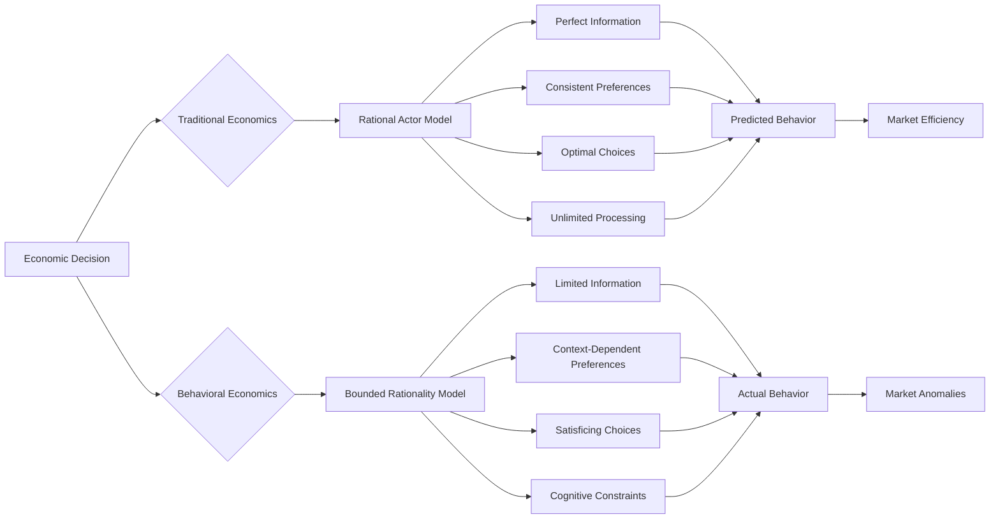
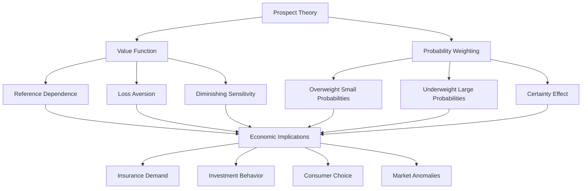
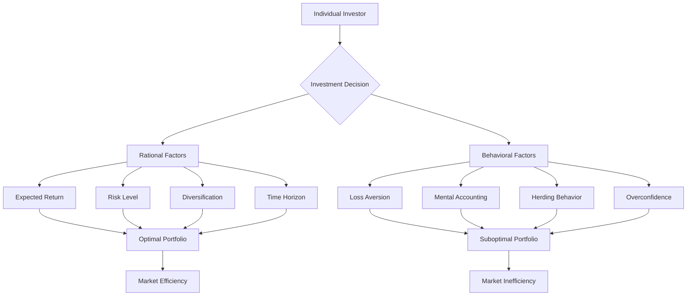
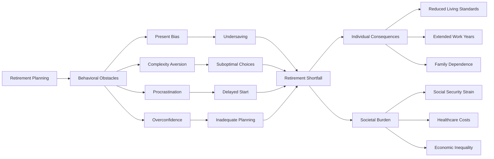
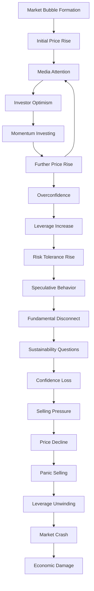
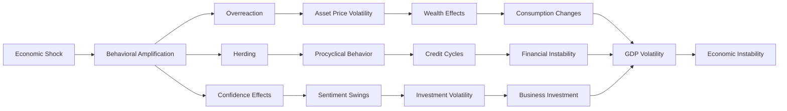

# Behavioral Economics and Systematic Irrationality in Decision-Making

## Abstract

Behavioral economics reveals systematic deviations from rational decision-making that pervade human economic behavior. These cognitive biases and heuristics, while potentially adaptive in ancestral environments, create predictable patterns of irrationality in modern economic contexts. Understanding these systematic errors illuminates fundamental limitations in human judgment and decision-making that contribute to individual financial distress and broader economic instability.

## Introduction

Traditional economic theory assumes rational actors who maximize utility through consistent preferences and optimal decision-making. However, decades of behavioral economics research demonstrate that humans systematically violate these assumptions through predictable biases, inconsistent preferences, and suboptimal choices. These deviations from rationality are not random errors but systematic patterns that reflect underlying cognitive limitations and evolutionary adaptations mismatched to modern economic environments.

## Foundations of Behavioral Economics

### Rational Choice Theory vs. Behavioral Reality

The fundamental tension between traditional economic theory and observed human behavior reveals systematic limitations in human economic reasoning. This flowchart illustrates how the assumptions of rational choice theory consistently fail to predict actual economic behavior, leading to market anomalies and suboptimal outcomes.



This comparison reveals why traditional economic models consistently fail to predict real-world economic behavior. The rational actor model assumes perfect information, but humans operate with severely limited and often biased information. As Nobel laureate Herbert Simon explained in his work on bounded rationality, humans don't optimize—they "satisfice," choosing the first option that meets their minimum criteria rather than searching for the optimal solution.

The assumption of consistent preferences breaks down when we observe that human preferences are highly context-dependent. The same individual may make completely different choices depending on how options are framed, the order in which they're presented, or their current emotional state. This context-dependence creates opportunities for manipulation and leads to systematic inconsistencies in economic behavior.

Traditional economics assumes unlimited cognitive processing capacity, but behavioral economics reveals that humans use cognitive shortcuts (heuristics) that systematically bias decision-making. These mental shortcuts were adaptive in ancestral environments but create predictable errors in modern economic contexts. The result is a persistent gap between predicted and actual behavior that manifests as market anomalies, bubbles, crashes, and widespread financial distress.

### Core Behavioral Economics Principles

The fundamental principles of behavioral economics reveal systematic deviations from rational choice theory that create predictable patterns of economic dysfunction. This table demonstrates how each core principle challenges traditional economic assumptions and creates real-world market failures.

| Principle | Description | Traditional Economics Assumption | Behavioral Reality |
|-----------|-------------|--------------------------------|-------------------|
| **Bounded Rationality** | Limited cognitive resources constrain decision-making | Unlimited processing capacity | Cognitive shortcuts and heuristics |
| **Loss Aversion** | Losses loom larger than equivalent gains | Symmetric value function | Asymmetric value function |
| **Present Bias** | Overweight immediate rewards relative to future | Consistent time preferences | Hyperbolic discounting |
| **Reference Dependence** | Outcomes evaluated relative to reference points | Absolute value evaluation | Relative value evaluation |
| **Probability Weighting** | Systematic distortions in probability perception | Accurate probability assessment | Overweight small probabilities |

This analysis of core principles reveals why human economic behavior systematically deviates from rational predictions. Bounded rationality, identified by Herbert Simon, recognizes that humans have limited cognitive resources and use mental shortcuts that create systematic biases. Rather than conducting exhaustive analysis, people rely on heuristics that work well in simple situations but fail in complex economic environments.

Loss aversion, discovered by Daniel Kahneman and Amos Tversky, demonstrates that humans feel losses approximately twice as intensely as equivalent gains. This asymmetry creates systematic risk aversion that prevents beneficial trades and investments. The traditional economic assumption of symmetric value functions fails to predict behaviors like the endowment effect, where people demand much more to sell an item than they would pay to buy it.

Present bias reflects the human tendency to heavily discount future rewards relative to immediate ones, but not in the consistent exponential manner assumed by traditional economics. Instead, humans exhibit hyperbolic discounting, where discount rates decrease over time. This creates time-inconsistent preferences where people make plans for the future that they systematically abandon when the time comes to implement them.

Reference dependence means that people evaluate outcomes relative to reference points rather than in absolute terms. This creates framing effects where identical options can be made more or less attractive simply by changing the reference point. Probability weighting reveals that humans systematically distort probabilities, overweighting small probabilities (leading to lottery purchases and excessive insurance) while underweighting large probabilities (leading to inadequate preparation for likely risks).

## Systematic Economic Biases

### Decision-Making Under Risk and Uncertainty

#### Prospect Theory Components

Prospect Theory, developed by Kahneman and Tversky, provides a comprehensive framework for understanding how humans actually make decisions under risk and uncertainty. This diagram illustrates the key components that systematically deviate from rational choice predictions and create widespread economic dysfunction.



This Prospect Theory framework reveals why humans make systematically poor economic decisions despite their best intentions. The value function's reference dependence means that people evaluate outcomes relative to their current position rather than final wealth levels, creating framing effects that can be exploited by marketers and financial institutions.

Loss aversion within the value function explains why people are reluctant to sell losing investments (the disposition effect), why they demand much more to give up something they own than they would pay to acquire it (the endowment effect), and why they prefer avoiding losses to acquiring equivalent gains. This asymmetry creates systematic inefficiencies in markets and prevents beneficial trades.

Diminishing sensitivity means that the difference between $100 and $200 feels larger than the difference between $1,100 and $1,200, even though both represent the same $100 change. This creates opportunities for manipulation through partitioning (making large expenses seem smaller by breaking them into parts) and bundling (making small benefits seem larger by combining them).

The probability weighting function explains seemingly contradictory behaviors: people simultaneously buy lottery tickets (overweighting small probabilities of large gains) and insurance (overweighting small probabilities of large losses), while failing to adequately prepare for moderate-probability risks like disability or job loss. The certainty effect leads people to disproportionately value certain outcomes over uncertain ones, even when the uncertain option has higher expected value.

#### Risk Perception Biases

Human risk perception systematically deviates from statistical reality, creating predictable patterns of economic dysfunction. This table reveals how each bias distorts economic decision-making and creates market inefficiencies that persist despite their obvious irrationality.

| Bias | Description | Economic Context | Real-World Impact | Market Consequences |
|------|-------------|------------------|------------------|-------------------|
| **Probability Neglect** | Ignore probability, focus on outcome | Insurance decisions | Over-insure rare events | Insurance market distortions |
| **Availability Heuristic** | Judge probability by ease of recall | Investment choices | Overreact to recent events | Market volatility |
| **Representativeness** | Judge probability by similarity | Stock picking | Ignore base rates | Inefficient pricing |
| **Anchoring** | Insufficient adjustment from starting point | Price negotiations | Arbitrary price influences | Price stickiness |
| **Overconfidence** | Overestimate accuracy of judgments | Trading decisions | Excessive trading | Market bubbles |

This risk perception analysis reveals why markets consistently misprice risks and why individuals make systematically poor financial decisions. Probability neglect explains why people focus on the magnitude of potential outcomes while ignoring their likelihood. This leads to over-insurance against dramatic but rare events (like terrorism or plane crashes) while under-insuring against mundane but common risks (like disability or job loss).

The availability heuristic causes people to judge probability by how easily they can recall examples, leading to systematic overreaction to recent or memorable events. After market crashes, investors become overly pessimistic and sell at the bottom, while during bull markets they become overly optimistic and buy at the top. Media coverage amplifies this bias by making dramatic events more memorable and available.

Representativeness bias leads people to judge probability by similarity to mental prototypes, causing them to ignore base rates and statistical information. Investors pick stocks based on compelling stories rather than fundamental analysis, leading to systematic mispricing of securities. This bias also underlies the "hot hand" fallacy in investing, where people believe past performance predicts future results.

Anchoring creates systematic biases in price negotiations and valuations, where arbitrary starting points influence final outcomes. Real estate prices, salary negotiations, and investment valuations all show anchoring effects that persist even when the anchor is obviously irrelevant. Overconfidence leads to excessive trading, inadequate diversification, and systematic underestimation of risks, creating market bubbles and individual financial losses.

### Temporal Decision-Making Biases

#### Intertemporal Choice Anomalies

Human temporal decision-making reveals systematic deviations from rational choice theory that create widespread financial distress and economic inefficiency. This table demonstrates how each temporal bias contradicts standard economic models and creates predictable patterns of dysfunction.

| Phenomenon | Description | Standard Model Prediction | Behavioral Reality | Economic Consequences |
|------------|-------------|--------------------------|-------------------|----------------------|
| **Present Bias** | Preference for immediate rewards | Exponential discounting | Hyperbolic discounting | Undersaving, debt accumulation |
| **Projection Bias** | Project current preferences onto future | Stable preferences | Preference changes | Poor long-term planning |
| **Hot-Cold Empathy Gap** | Underestimate impact of emotional states | Consistent preferences | State-dependent preferences | Impulse purchases |
| **Planning Fallacy** | Underestimate time and costs | Accurate forecasting | Optimistic bias | Budget overruns |

This temporal choice analysis reveals why humans consistently make decisions that harm their future selves despite understanding the long-term consequences. Present bias creates hyperbolic discounting where people heavily discount the near future but discount the distant future at lower rates. This creates time-inconsistent preferences where individuals make plans they systematically fail to follow through on.

Projection bias leads people to assume their current preferences will remain stable over time, causing systematic errors in long-term planning. Someone who is currently motivated to exercise may join a gym with an expensive long-term contract, failing to anticipate that their motivation will wane. This bias underlies many subscription services and long-term contracts that exploit people's inability to predict their future preferences.

The hot-cold empathy gap causes people to underestimate how emotional states will affect their future decisions. When calm and rational, people underestimate how hunger, anger, or sexual arousal will influence their behavior, leading to inadequate preparation for these states. This explains impulse purchases, emotional spending, and the failure to implement pre-commitment strategies.

Planning fallacy creates systematic underestimation of the time and resources needed to complete projects, leading to budget overruns and schedule delays in both personal and professional contexts. This optimistic bias persists even when people have extensive experience with similar projects, suggesting it reflects fundamental limitations in human forecasting ability rather than simple inexperience.

#### Savings and Investment Behavior



## Consumer Behavior Anomalies

### Choice Architecture Effects

#### Framing Effects in Consumer Decisions

| Framing Type | Example | Rational Response | Actual Response | Market Exploitation |
|--------------|---------|------------------|-----------------|-------------------|
| **Gain vs. Loss** | "90% fat-free" vs. "10% fat" | Identical evaluation | Prefer gain frame | Marketing manipulation |
| **Absolute vs. Relative** | "$5 off" vs. "20% off" | Consider absolute value | Prefer relative frame | Pricing strategies |
| **Partitioned vs. Combined** | Separate shipping vs. total price | Focus on total cost | Underweight partitioned costs | Hidden fees |
| **Default Options** | Opt-in vs. opt-out | Active choice | Accept defaults | Automatic enrollment |

#### Mental Accounting Violations

| Mental Account | Description | Rational Behavior | Actual Behavior | Economic Impact |
|----------------|-------------|------------------|-----------------|-----------------|
| **Windfall Money** | Unexpected income | Treat as regular income | Spend more freely | Consumption volatility |
| **Sunk Costs** | Past expenditures | Ignore sunk costs | Continue failing investments | Resource misallocation |
| **Payment Methods** | Cash vs. credit | Equivalent treatment | Spend more with credit | Debt accumulation |
| **Budgeting Categories** | Separate expense categories | Optimize across categories | Rigid category boundaries | Suboptimal allocation |

### Price Perception and Willingness to Pay

#### Pricing Psychology Effects

```mermaid
heatmap
    title "Price Sensitivity Across Product Categories and Consumer Types"
    
    x-axis [Luxury Goods, Necessities, Services, Digital Products, Subscriptions]
    y-axis [High Income, Middle Income, Low Income, Young Adults, Elderly]
    
    High Income: [3, 7, 5, 4, 6]
    Middle Income: [8, 9, 7, 6, 7]
    Low Income: [9, 9, 8, 7, 8]
    Young Adults: [6, 8, 6, 4, 5]
    Elderly: [7, 8, 8, 8, 9]
```

## Investment and Financial Decision-Making

### Systematic Investment Errors

#### Portfolio Management Biases

| Bias | Description | Manifestation | Performance Impact | Prevalence |
|------|-------------|---------------|-------------------|------------|
| **Home Bias** | Overinvest in domestic assets | Underweight international diversification | -2.3% annual return | 85% of investors |
| **Disposition Effect** | Sell winners, hold losers | Realize gains too early, losses too late | -4.1% annual return | 78% of investors |
| **Overconfidence** | Overestimate investment skill | Excessive trading frequency | -3.2% annual return | 65% of investors |
| **Herding** | Follow crowd behavior | Buy high, sell low | -2.8% annual return | 72% of investors |
| **Recency Bias** | Overweight recent performance | Chase past returns | -1.9% annual return | 68% of investors |

#### Retirement Planning Failures



### Experimental Evidence of Market Failures

#### Laboratory and Field Experiments

| Study Type | Key Finding | Effect Size | Replication Rate | Policy Implications |
|------------|-------------|-------------|------------------|-------------------|
| **Ultimatum Game** | Reject unfair offers despite cost | 40-50% rejection rate | 95% | Fairness considerations in markets |
| **Endowment Effect** | Overvalue owned items | 2:1 selling/buying ratio | 87% | Transaction costs and market liquidity |
| **Anchoring in Valuations** | Arbitrary numbers influence prices | 30-50% adjustment | 92% | Price discovery mechanisms |
| **Default Effects** | Stick with default options | 85-95% default acceptance | 89% | Choice architecture design |
| **Loss Aversion** | Losses weighted 2x gains | 2.25:1 loss/gain ratio | 91% | Insurance and investment products |

## Market-Level Consequences

### Asset Pricing Anomalies

#### Stock Market Behavioral Patterns

| Anomaly | Description | Traditional Explanation | Behavioral Explanation | Persistence |
|---------|-------------|------------------------|----------------------|-------------|
| **Momentum** | Past winners continue winning | Risk compensation | Underreaction to information | 30+ years |
| **Reversal** | Long-term performance reversal | Risk factors | Overreaction to information | 80+ years |
| **Size Effect** | Small stocks outperform | Risk premium | Neglect and illiquidity | 40+ years |
| **Value Effect** | Value stocks outperform growth | Risk factors | Overconfidence and extrapolation | 90+ years |
| **Calendar Effects** | Seasonal return patterns | None | Institutional and psychological factors | 100+ years |

#### Bubble Formation and Collapse



### Corporate Finance Implications

#### Managerial Decision-Making Biases

| Bias | Corporate Manifestation | Financial Impact | Governance Response | Prevalence |
|------|------------------------|------------------|-------------------|------------|
| **Overconfidence** | Excessive M&A activity | -2% to -7% shareholder value | Independent directors | 60% of CEOs |
| **Loss Aversion** | Avoid necessary restructuring | Delayed adaptation | Activist investors | 45% of firms |
| **Anchoring** | Stick to historical budgets | Suboptimal resource allocation | Zero-based budgeting | 70% of firms |
| **Confirmation Bias** | Ignore negative feedback | Poor strategic decisions | Devil's advocate processes | 55% of executives |
| **Herding** | Follow industry trends | Reduced differentiation | Contrarian strategies | 40% of strategies |

## Real-World Economic Impacts

### Individual Financial Distress

#### Household Financial Vulnerability

| Vulnerability Indicator | Prevalence | Behavioral Contributors | Economic Consequences | Policy Responses |
|------------------------|------------|------------------------|----------------------|------------------|
| **Inadequate Emergency Savings** | 40% of households | Present bias, mental accounting | Financial fragility | Automatic savings programs |
| **High-Cost Debt** | 25% of households | Hyperbolic discounting | Debt spirals | Financial education |
| **Retirement Shortfall** | 60% of households | Procrastination, complexity aversion | Late-life poverty | Auto-enrollment |
| **Insurance Gaps** | 30% of households | Probability neglect | Catastrophic losses | Mandatory coverage |
| **Investment Underperformance** | 80% of investors | Multiple biases | Wealth destruction | Robo-advisors |

#### Case Study: Subprime Mortgage Crisis

**Behavioral Factors Contributing to Crisis**:
- **Homeowner Biases**: Overconfidence in house price appreciation, present bias in ARM choices
- **Lender Biases**: Overoptimism about default rates, herding in lending standards
- **Investor Biases**: Overconfidence in risk models, neglect of tail risks
- **Regulator Biases**: Overconfidence in market efficiency, confirmation bias

**Economic Consequences**:
- $7.4 trillion in stock market losses
- 8.8 million job losses
- 3.7 million foreclosures
- $2.4 trillion in economic output loss

### Macroeconomic Implications

#### Business Cycle Amplification



## Policy Implications and Interventions

### Behavioral Public Policy

#### Nudge Interventions

| Policy Domain | Intervention Type | Mechanism | Effectiveness | Implementation Challenges |
|---------------|------------------|-----------|---------------|--------------------------|
| **Retirement Savings** | Auto-enrollment | Default bias | 85% participation increase | Employer adoption |
| **Health Insurance** | Simplified choice | Complexity reduction | 40% better choices | Information design |
| **Energy Conservation** | Social comparisons | Social norms | 2-3% usage reduction | Privacy concerns |
| **Tax Compliance** | Simplified forms | Cognitive load reduction | 15% error reduction | Administrative costs |
| **Financial Products** | Disclosure requirements | Salience | Mixed results | Industry resistance |

### Market Design Solutions

#### Addressing Behavioral Market Failures

| Market Failure | Behavioral Cause | Design Solution | Implementation | Effectiveness |
|----------------|------------------|-----------------|----------------|---------------|
| **Undersaving** | Present bias | Automatic enrollment | Employer plans | High |
| **Poor Investment Choices** | Complexity aversion | Target-date funds | Default options | Moderate |
| **Excessive Trading** | Overconfidence | Trading costs | Brokerage fees | Low |
| **Bubble Formation** | Herding | Circuit breakers | Exchange rules | Moderate |
| **Predatory Lending** | Present bias | Cooling-off periods | Regulation | High |

## Theoretical Integration

### Dual-System Models

Behavioral economics integrates with dual-process theories of cognition:
- **System 1**: Fast, automatic, heuristic-based economic decisions
- **System 2**: Slow, deliberative, analytical economic reasoning
- **Conflict**: System 1 biases override System 2 rationality under cognitive load

### Evolutionary Perspectives

Economic biases reflect evolutionary adaptations:
- **Risk Aversion**: Survival advantage in ancestral environments
- **Loss Aversion**: Asymmetric survival consequences of losses vs. gains
- **Present Bias**: Uncertain future survival made immediate rewards adaptive
- **Social Preferences**: Group cooperation enhanced survival

### Neuroeconomics Integration

Brain imaging reveals neural basis of economic irrationality:
- **Prefrontal Cortex**: Rational analysis, future planning
- **Limbic System**: Emotional responses, immediate rewards
- **Dopamine System**: Reward prediction errors, learning
- **Default Mode Network**: Self-referential processing, social cognition

## Conclusion

Behavioral economics demonstrates that human economic decision-making is systematically and predictably irrational. These deviations from rationality are not random errors but reflect fundamental limitations in human cognitive architecture that create individual financial distress and broader economic instability. The persistence and universality of these biases across cultures and contexts suggest they represent inherent features of human psychology rather than correctable mistakes.

Understanding behavioral economics is crucial for realistic approaches to economic policy, financial regulation, and individual financial planning. Rather than assuming rational actors, effective economic systems must account for human cognitive limitations and design institutions that work with rather than against human psychology. The field reveals both the promise and limitations of behavioral interventions, suggesting that while some biases can be mitigated through choice architecture and policy design, others represent fundamental constraints on human economic reasoning.

## References

1. Kahneman, D., & Tversky, A. (1979). Prospect theory: An analysis of decision under risk. *Econometrica*, 47(2), 263-291.
2. Thaler, R. H. (2015). *Misbehaving: The Making of Behavioral Economics*. W. W. Norton & Company.
3. Ariely, D. (2008). *Predictably Irrational: The Hidden Forces That Shape Our Decisions*. HarperCollins.
4. Shefrin, H. (2000). *Beyond Greed and Fear: Understanding Behavioral Finance and the Psychology of Investing*. Harvard Business Review Press.
5. Camerer, C., Loewenstein, G., & Rabin, M. (Eds.). (2004). *Advances in Behavioral Economics*. Princeton University Press.

---

*See also: [Cognitive Architecture](../individual/cognitive-architecture.md) | [Psychological Pathology](../individual/psychological-pathology.md) | [Individual Psychology Overview](../individual/README.md)*