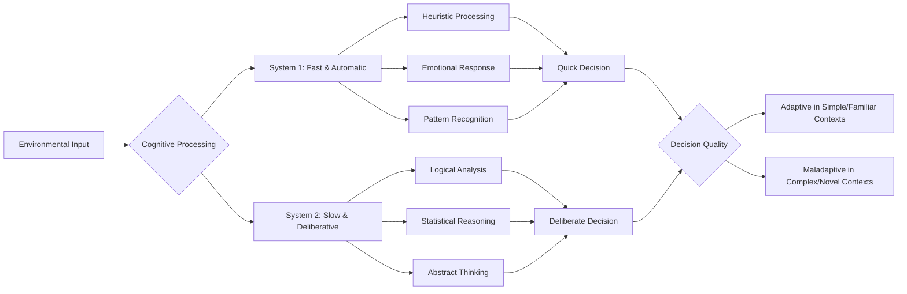
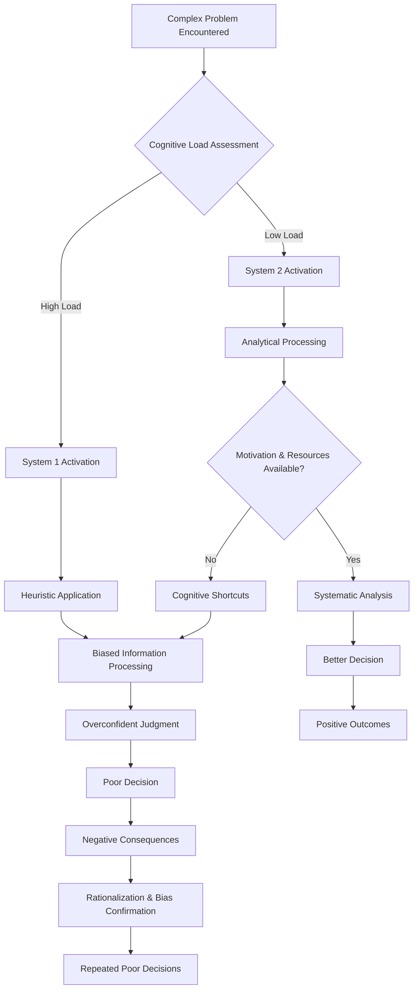
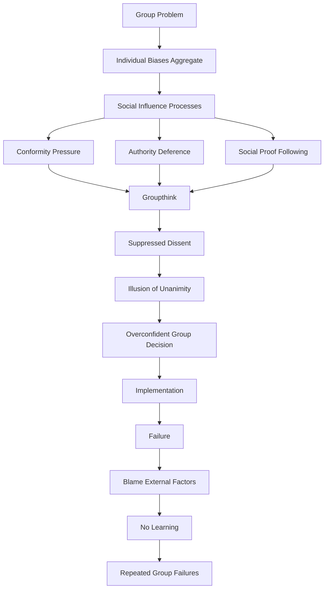
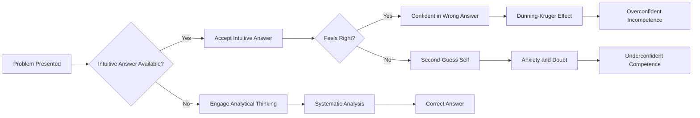

# Cognitive Architecture and Systematic Reasoning Failures

## Abstract

Human cognitive architecture, while remarkably sophisticated, contains systematic limitations and biases that create predictable patterns of reasoning failure. These cognitive constraints, evolved for rapid decision-making in ancestral environments, become sources of individual and collective dysfunction when applied to complex modern problems requiring abstract reasoning, statistical thinking, and long-term planning.

## Introduction

The human mind operates through a dual-process cognitive architecture consisting of fast, automatic System 1 thinking and slower, deliberative System 2 thinking. While this architecture enabled survival and reproduction in ancestral environments, it creates systematic vulnerabilities in modern contexts requiring complex reasoning, statistical inference, and abstract problem-solving.

## Dual-Process Cognitive Architecture

The human mind operates through two fundamentally different processing systems that evolved for different purposes and operate according to different principles. Understanding this dual-process architecture is crucial for comprehending why humans make systematic errors in reasoning and decision-making.

### System 1 vs. System 2 Processing

The distinction between System 1 and System 2 thinking, popularized by psychologist Daniel Kahneman, represents one of the most important insights in cognitive science. These systems operate simultaneously but often produce conflicting outputs, creating internal tension and systematic biases in human judgment.

This processing flow diagram reveals the fundamental architecture of human cognition and explains why humans excel in some contexts while failing systematically in others. **Environmental Input** triggers both processing systems simultaneously, but they operate through entirely different mechanisms and often reach different conclusions.

**System 1 Processing** represents the evolutionarily older system, operating through **Heuristic Processing** (mental shortcuts), **Emotional Response** (immediate affective reactions), and **Pattern Recognition** (rapid categorization based on similarity to stored templates). These processes occur automatically and unconsciously, producing **Quick Decisions** that feel intuitively correct. System 1 excels in familiar environments where rapid responses are crucial and where evolutionary experience provides reliable guidance.

**System 2 Processing** represents the more recent evolutionary development, capable of **Logical Analysis** (step-by-step reasoning), **Statistical Reasoning** (probabilistic thinking), and **Abstract Thinking** (manipulation of concepts not directly tied to sensory experience). These processes require conscious effort and produce **Deliberate Decisions** that may contradict intuitive responses. System 2 excels in novel, complex environments requiring careful analysis and long-term planning.

The critical insight is that **Decision Quality** depends on the match between processing system and environmental demands. System 1 decisions are **Adaptive in Simple/Familiar Contexts** where speed matters and evolutionary wisdom applies, but become **Maladaptive in Complex/Novel Contexts** where careful analysis is required. Modern environments increasingly demand System 2 processing while triggering System 1 responses, creating systematic decision-making failures.

### Cognitive Resource Allocation

The allocation of cognitive resources between these systems creates predictable patterns of success and failure across different domains and contexts. Understanding these resource constraints is essential for predicting when humans will make good versus poor decisions.

| Processing System | Characteristics | Advantages | Limitations | Modern Context Problems |
|------------------|----------------|------------|-------------|------------------------|
| **System 1** | Fast, automatic, effortless | Quick responses, pattern recognition | Biased, inflexible | Misinformation susceptibility, prejudice |
| **System 2** | Slow, controlled, effortful | Logical, flexible, accurate | Resource-intensive, lazy | Cognitive overload, decision fatigue |

**System 1 Characteristics** make it ideally suited for rapid responses in familiar situations. Its **Fast, automatic, effortless** operation allows humans to navigate routine activities without conscious attention, freeing cognitive resources for other tasks. The **Advantages** of **Quick responses** and **Pattern recognition** enabled survival in ancestral environments where immediate reactions to familiar threats or opportunities were crucial.

However, System 1's **Limitations** become problematic in modern contexts. Its **Biased** nature means it relies on mental shortcuts that can be systematically wrong, while its **Inflexible** operation makes it resistant to correction even when errors are pointed out. These limitations create **Modern Context Problems** including **Misinformation susceptibility** (accepting false information that fits existing patterns) and **Prejudice** (applying inappropriate social categories based on superficial similarities).

**System 2 Characteristics** make it capable of handling complex, novel problems requiring careful analysis. Its **Slow, controlled, effortful** operation allows for **Logical, flexible, accurate** processing that can override System 1 biases when properly engaged. System 2 can consider multiple perspectives, weigh evidence systematically, and reach conclusions that contradict immediate intuitions.

However, System 2's **Limitations** create their own problems. Its **Resource-intensive** nature means it can only operate for limited periods before becoming depleted, while its **Lazy** tendency means it often fails to engage even when needed. These limitations create **Modern Context Problems** including **Cognitive overload** (inability to process complex information effectively) and **Decision fatigue** (deteriorating decision quality as mental resources become depleted).

## Systematic Cognitive Biases Across Domains

Human cognitive biases are not random errors but systematic deviations from rational judgment that occur predictably across different domains and contexts. These biases represent the systematic ways in which System 1 processing leads to errors when applied to problems requiring System 2 analysis. Understanding these patterns is crucial for predicting when and how human judgment will fail.

### Judgment and Decision-Making Biases

The following analysis examines the most well-documented cognitive biases that affect human judgment and decision-making across virtually all domains of life. Each bias category represents a different way that evolved mental shortcuts produce systematic errors in modern contexts.

| Bias Category | Specific Biases | Mechanism | Domain Examples | Consequences |
|---------------|----------------|-----------|-----------------|--------------|
| **Availability** | Availability heuristic, Recency bias | Ease of recall determines probability estimates | Media coverage → risk perception | Overestimate rare but vivid events |
| **Representativeness** | Base rate neglect, Conjunction fallacy | Similarity-based probability judgments | Stereotyping, profiling | Ignore statistical base rates |
| **Anchoring** | Anchoring bias, Adjustment heuristic | Initial values influence subsequent judgments | Negotiations, valuations | Arbitrary starting points bias outcomes |
| **Confirmation** | Confirmation bias, Cherry-picking | Seek information confirming existing beliefs | Political views, scientific research | Echo chambers, polarization |
| **Overconfidence** | Dunning-Kruger effect, Illusion of knowledge | Overestimate accuracy of judgments | Expert predictions, planning | Poor calibration, excessive risk-taking |

**Availability Bias** demonstrates how the accessibility of information in memory distorts probability judgments. The **Availability heuristic** causes people to estimate the likelihood of events based on how easily examples come to mind, rather than on actual statistical frequencies. **Recency bias** amplifies this effect by making recent events more memorable and thus seemingly more probable. The **Mechanism** operates through the evolved assumption that memorable events are important events—which was often true in ancestral environments but becomes systematically misleading in modern media-saturated contexts.

**Domain Examples** illustrate how this bias operates in practice. **Media coverage** of rare but dramatic events like terrorist attacks or plane crashes makes these events highly available in memory, leading to **Risk perception** that dramatically overestimates their actual probability. The **Consequences** include **Overestimating rare but vivid events** while underestimating common but mundane risks, leading to misallocation of attention, resources, and protective behaviors.

**Representativeness Bias** occurs when people judge probability based on similarity to mental prototypes rather than statistical base rates. **Base rate neglect** causes people to ignore the underlying frequency of events when making judgments, while the **Conjunction fallacy** leads people to believe that specific combinations of events are more likely than their individual components. The **Mechanism** reflects the evolved tendency to categorize based on similarity—useful for identifying predators or prey but misleading for statistical reasoning.

**Anchoring Bias** demonstrates how initial information disproportionately influences subsequent judgments, even when the initial information is irrelevant. The **Adjustment heuristic** causes people to start from an initial value (anchor) and adjust insufficiently from that starting point. In **Negotiations** and **Valuations**, arbitrary starting points systematically bias final outcomes, with **Consequences** including suboptimal agreements and irrational pricing decisions.

**Confirmation Bias** represents perhaps the most pervasive and dangerous cognitive bias, causing people to seek information that confirms existing beliefs while avoiding contradictory evidence. **Cherry-picking** involves selectively presenting evidence that supports desired conclusions. This bias affects **Political views** and **Scientific research**, creating **Echo chambers** and **Polarization** that undermine democratic deliberation and scientific progress.

**Overconfidence Bias** causes systematic overestimation of judgment accuracy and knowledge. The **Dunning-Kruger effect** shows that incompetent individuals are most likely to overestimate their abilities, while the **Illusion of knowledge** causes people to confuse familiarity with understanding. In **Expert predictions** and **Planning**, overconfidence leads to **Poor calibration** and **Excessive risk-taking**, resulting in failed projects and poor decisions.

### Social Cognition Biases

Social cognitive biases affect how humans perceive, judge, and interact with other people. These biases evolved for small-group social environments but create systematic problems in diverse, complex modern societies.

| Bias Category | Specific Biases | Mechanism | Social Context | Interpersonal Problems |
|---------------|----------------|-----------|----------------|----------------------|
| **Attribution** | Fundamental attribution error, Actor-observer bias | Explain behavior through dispositions vs. situations | Person perception | Blame individuals, ignore circumstances |
| **In-group** | In-group favoritism, Out-group homogeneity | Preferential treatment of group members | Tribal identity | Discrimination, conflict |
| **Social Proof** | Conformity bias, Bandwagon effect | Follow majority behavior | Social influence | Groupthink, mob behavior |
| **Authority** | Authority bias, Halo effect | Defer to perceived expertise or status | Hierarchical relationships | Blind obedience, exploitation |
| **Self-serving** | Self-serving bias, Better-than-average effect | Maintain positive self-image | Self-evaluation | Narcissism, relationship conflict |

**Attribution Biases** affect how people explain the causes of behavior, with systematic differences in how they explain their own versus others' actions. The **Fundamental attribution error** causes people to overattribute others' behavior to personality traits while underestimating situational factors. **Actor-observer bias** shows that people explain their own behavior through situations but others' behavior through dispositions. In **Person perception** contexts, these biases lead people to **Blame individuals** while **Ignoring circumstances**, creating unfair judgments and missed opportunities for systemic solutions.

**In-group Biases** reflect the evolved tendency to favor members of one's own group over outsiders. **In-group favoritism** involves preferential treatment, resource allocation, and positive evaluation of group members, while **Out-group homogeneity** causes people to see out-group members as more similar to each other than they actually are. In contexts of **Tribal identity**, these biases create **Discrimination** and **Conflict** that undermine cooperation in diverse societies.

### Temporal and Planning Biases

Temporal biases affect how people think about time, plan for the future, and make decisions involving delayed consequences. These biases reflect the evolutionary priority of immediate survival over long-term optimization.

| Bias Category | Specific Biases | Mechanism | Planning Context | Long-term Problems |
|---------------|----------------|-----------|------------------|-------------------|
| **Present Bias** | Hyperbolic discounting, Immediate gratification | Overweight immediate rewards | Personal finance, health | Debt, obesity, addiction |
| **Optimism** | Planning fallacy, Optimism bias | Underestimate time, costs, risks | Project management | Delays, budget overruns |
| **Sunk Cost** | Sunk cost fallacy, Escalation of commitment | Continue failing courses of action | Investment decisions | Waste resources on failing projects |
| **Status Quo** | Status quo bias, Endowment effect | Prefer current state of affairs | Change management | Resistance to improvement |

**Present Bias** reflects the systematic tendency to overvalue immediate rewards relative to future benefits. **Hyperbolic discounting** shows that people discount future rewards at rates that decrease over time, while **Immediate gratification** preferences override long-term interests. In **Personal finance** and **Health** contexts, these biases contribute to **Debt, obesity,** and **Addiction**—problems that result from prioritizing immediate pleasure over long-term well-being.

**Optimism Biases** cause systematic underestimation of the time, costs, and risks associated with future projects. The **Planning fallacy** shows that people consistently underestimate how long tasks will take, while **Optimism bias** leads to unrealistic expectations about positive outcomes. In **Project management**, these biases result in **Delays** and **Budget overruns** that plague both individual and organizational planning efforts.

## Decision-Making Failure Processes

### Individual Decision-Making Cascade

### Group Decision-Making Failure Process

## Cognitive Biases Across Professional Domains

### Medical Decision-Making

| Bias | Clinical Manifestation | Patient Impact | Systemic Consequences |
|------|----------------------|----------------|----------------------|
| **Anchoring** | Stick to initial diagnosis | Delayed correct treatment | Misdiagnosis rates |
| **Availability** | Overdiagnose recently seen conditions | Inappropriate treatment | Healthcare resource waste |
| **Confirmation** | Seek confirming evidence only | Missed alternative diagnoses | Medical errors |
| **Overconfidence** | Excessive diagnostic certainty | Inadequate testing | Patient safety risks |

### Financial Decision-Making

| Bias | Investment Manifestation | Individual Impact | Market Consequences |
|------|------------------------|------------------|-------------------|
| **Loss Aversion** | Hold losing investments too long | Portfolio underperformance | Market inefficiencies |
| **Overconfidence** | Excessive trading frequency | Transaction costs, poor returns | Market volatility |
| **Herding** | Follow market trends | Buy high, sell low | Bubbles and crashes |
| **Mental Accounting** | Treat money differently by source | Suboptimal allocation | Economic irrationality |

### Political Decision-Making

| Bias | Political Manifestation | Democratic Impact | Governance Consequences |
|------|----------------------|------------------|------------------------|
| **Confirmation** | Selective media consumption | Political polarization | Policy gridlock |
| **In-group Favoritism** | Partisan loyalty over evidence | Tribal politics | Ineffective governance |
| **Availability** | Policy based on salient events | Reactive rather than proactive | Crisis-driven decision-making |
| **Overconfidence** | Ignore expert advice | Poor policy outcomes | Public trust erosion |

## Metacognitive Failures

### Illusion of Understanding

Humans systematically overestimate their understanding of complex systems, leading to:

1. **Explanatory Depth Illusion**: Believe they understand mechanisms they cannot actually explain
2. **Knowledge Illusion**: Confuse familiarity with understanding
3. **Causal Illusion**: See causation in correlation
4. **Control Illusion**: Overestimate ability to influence outcomes

### Cognitive Reflection Failures

## Neurobiological Basis of Cognitive Limitations

### Prefrontal Cortex Constraints

The prefrontal cortex, responsible for executive function and rational thinking, has inherent limitations:

- **Working Memory Capacity**: Limited to 7±2 items
- **Attention Resources**: Finite and easily depleted
- **Processing Speed**: Slower than automatic systems
- **Energy Requirements**: High glucose consumption

### Default Mode Network Interference

The brain's default mode network, active during rest, creates systematic biases:
- **Self-referential Processing**: Everything filtered through personal relevance
- **Temporal Focus**: Emphasis on past and future over present
- **Social Simulation**: Constant modeling of social relationships
- **Narrative Construction**: Impose coherent stories on random events

## Implications for Human Dysfunction

### Individual Level Consequences

1. **Poor Life Decisions**: Systematic biases lead to suboptimal choices in career, relationships, health
2. **Mental Health Issues**: Cognitive distortions contribute to depression, anxiety, and other disorders
3. **Learning Failures**: Overconfidence and confirmation bias impede skill development
4. **Relationship Problems**: Attribution errors and self-serving biases damage interpersonal connections

### Organizational Level Consequences

1. **Strategic Failures**: Planning fallacy and overconfidence lead to failed initiatives
2. **Innovation Resistance**: Status quo bias and loss aversion prevent adaptation
3. **Team Dysfunction**: Social biases create conflict and poor collaboration
4. **Leadership Failures**: Overconfidence and attribution errors in decision-making

### Societal Level Consequences

1. **Democratic Failures**: Voter biases lead to poor electoral choices
2. **Policy Mistakes**: Cognitive limitations in complex policy analysis
3. **Economic Irrationality**: Market bubbles and crashes from collective biases
4. **Scientific Stagnation**: Confirmation bias and authority deference slow progress

## Theoretical Integration

### Bounded Rationality Framework

Herbert Simon's bounded rationality explains cognitive limitations:
- **Satisficing**: Choose "good enough" rather than optimal solutions
- **Cognitive Constraints**: Limited processing capacity and time
- **Environmental Complexity**: Problems exceed cognitive capabilities
- **Adaptive Significance**: Biases were adaptive in ancestral environments

### Ecological Rationality Perspective

Gerd Gigerich's ecological rationality suggests biases can be adaptive:
- **Fast-and-Frugal Heuristics**: Simple rules work well in appropriate environments
- **Environmental Matching**: Cognitive strategies should match environmental structure
- **Bias-Variance Tradeoff**: Simple heuristics reduce variance at cost of bias
- **Adaptive Toolbox**: Multiple strategies for different environmental demands

## Mitigation Strategies and Limitations

### Debiasing Approaches

| Strategy | Mechanism | Effectiveness | Limitations |
|----------|-----------|---------------|-------------|
| **Education** | Teach about biases | Low to moderate | Knowledge doesn't prevent bias |
| **Incentives** | Reward accuracy | Moderate | Can backfire or be gamed |
| **Accountability** | Require justification | Moderate | May increase confidence in bias |
| **Perspective-Taking** | Consider alternatives | Moderate | Requires motivation and ability |
| **System Design** | Change choice architecture | High | Limited applicability |

### Fundamental Limitations

1. **Cognitive Load**: Debiasing requires mental resources often unavailable
2. **Motivation**: People often prefer biased thinking that supports desired conclusions
3. **Social Pressure**: Group dynamics reinforce individual biases
4. **Evolutionary Constraints**: Biases served adaptive functions and resist change

## Conclusion

Human cognitive architecture creates systematic and predictable patterns of reasoning failure. These limitations, while adaptive in ancestral environments, become sources of individual suffering and collective dysfunction in modern contexts requiring complex reasoning and long-term thinking. Understanding these cognitive constraints is essential for realistic approaches to human problems, suggesting the need for institutional designs and decision-making processes that account for rather than ignore human cognitive limitations.

The pervasiveness and persistence of cognitive biases across domains and cultures suggests they represent fundamental features of human psychology rather than correctable errors. Effective solutions must work with these constraints rather than expecting humans to transcend their cognitive architecture.

## References

1. Kahneman, D. (2011). *Thinking, Fast and Slow*. Farrar, Straus and Giroux.
2. Gilovich, T., Griffin, D., & Kahneman, D. (Eds.). (2002). *Heuristics and Biases: The Psychology of Intuitive Judgment*. Cambridge University Press.
3. Stanovich, K. E. (2009). *What Intelligence Tests Miss: The Psychology of Rational Thought*. Yale University Press.
4. Mercier, H., & Sperber, D. (2017). *The Enigma of Reason*. Harvard University Press.
5. Gigerenzer, G. (2007). *Gut Feelings: The Intelligence of the Unconscious*. Viking.

---

*See also: [Evolutionary Foundations](../individual/evolutionary-foundations.md) | [Neurobiological Constraints](../individual/neurobiological-constraints.md) | [Individual Psychology Overview](../individual/README.md)*