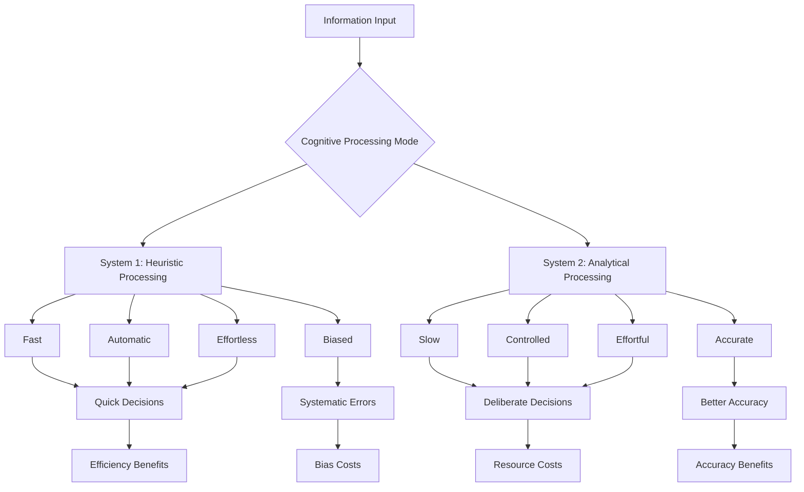
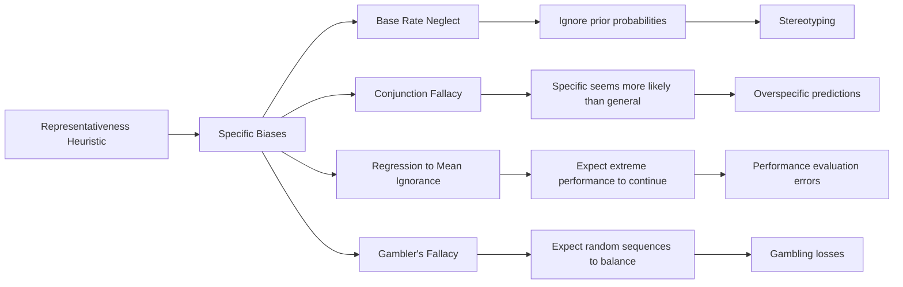
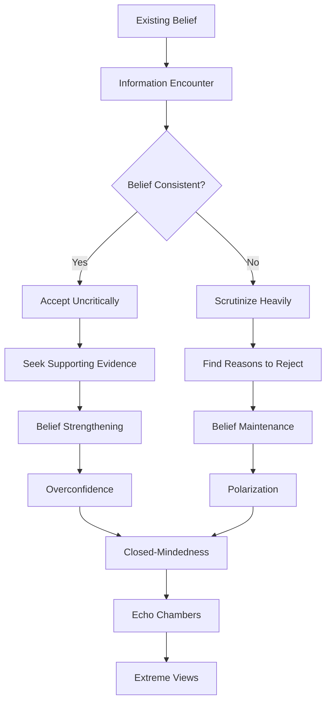
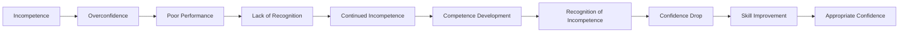
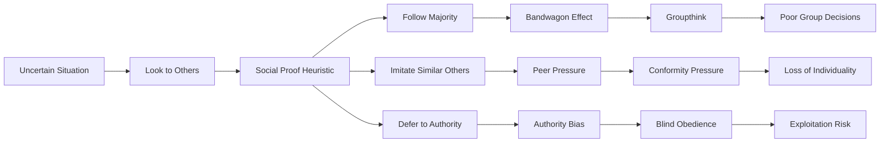
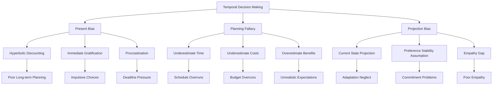
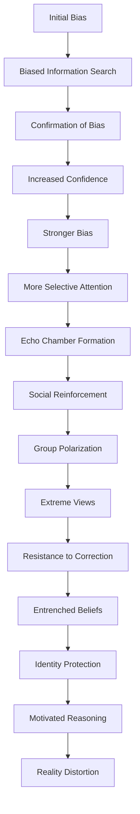
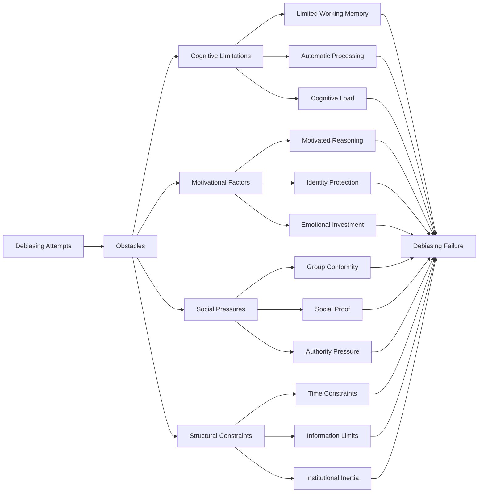
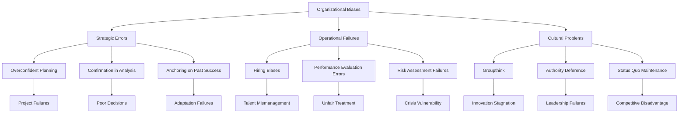

# Cognitive Biases and Heuristics: Systematic Thinking Errors

## Abstract

Human cognition relies heavily on mental shortcuts (heuristics) and systematic biases that, while often adaptive for rapid decision-making, create predictable patterns of reasoning errors. These cognitive biases affect judgment, decision-making, and problem-solving across all domains of human activity, contributing to individual mistakes and collective irrationality. Understanding these systematic thinking errors reveals fundamental limitations in human reasoning that underlie many personal and societal problems.

## Introduction

The human mind has evolved sophisticated cognitive mechanisms for processing information and making decisions rapidly in complex environments. However, these same mechanisms that enable quick thinking also create systematic biases and errors in reasoning. Cognitive biases are not random mistakes but predictable deviations from rationality that occur consistently across individuals and situations, reflecting underlying constraints in human information processing.

## Theoretical Foundations

### Dual-Process Theory and Heuristic Processing



### Evolutionary Origins of Cognitive Biases

| Bias Category | Evolutionary Function | Ancestral Benefit | Modern Context Problem |
|---------------|----------------------|-------------------|----------------------|
| **Threat Detection** | Survival advantage | Avoid predators, dangers | False alarms, anxiety |
| **Social Cognition** | Group cooperation | Alliance formation | Prejudice, discrimination |
| **Resource Acquisition** | Survival needs | Food, shelter seeking | Overconsumption, greed |
| **Mate Selection** | Reproductive success | Partner evaluation | Relationship biases |
| **Status Competition** | Social hierarchy | Dominance establishment | Overconfidence, aggression |

## Major Categories of Cognitive Biases

### Availability and Representativeness Heuristics

#### Availability Heuristic Manifestations

The availability heuristic leads people to judge the probability or frequency of events based on how easily examples come to mind, creating systematic biases in risk assessment and decision-making. This table reveals how the availability heuristic creates predictable errors across multiple domains of human judgment.

| Domain | Bias Manifestation | Example | Consequence | Frequency |
|--------|-------------------|---------|-------------|-----------|
| **Risk Assessment** | Overestimate vivid risks | Fear flying more than driving | Suboptimal safety choices | Very common |
| **Medical Diagnosis** | Recent cases influence judgment | Overdiagnose recently seen conditions | Diagnostic errors | Common |
| **Investment Decisions** | Recent market performance | Extrapolate recent trends | Market timing errors | Very common |
| **News Consumption** | Overweight recent events | Recency bias in importance | Distorted worldview | Universal |
| **Personal Memory** | Easier recall seems more frequent | Overestimate own contributions | Relationship conflicts | Very common |

This availability heuristic analysis reveals why humans systematically misjudge risks and probabilities in ways that create both individual and societal problems. In risk assessment, people fear flying more than driving despite flying being statistically much safer, because airplane crashes receive extensive media coverage and create vivid, memorable images, while car accidents are routine and less memorable. This leads to suboptimal safety choices where people avoid safer options in favor of more dangerous but familiar ones.

Medical diagnosis errors occur when doctors are influenced by recently seen cases, leading them to overdiagnose conditions they've encountered recently while underdiagnosing less memorable conditions. As physician Jerome Groopman explains in "How Doctors Think," this availability bias contributes to diagnostic errors that affect patient care and healthcare costs. The recency of cases makes them more mentally available, biasing clinical judgment despite doctors' extensive training.

Investment decisions are particularly vulnerable to availability bias because recent market performance is highly salient and emotionally charged. Investors systematically extrapolate recent trends, buying after markets have risen (when prices are high) and selling after markets have fallen (when prices are low). This creates the opposite of optimal investment behavior and contributes to market bubbles and crashes.

News consumption creates distorted worldviews because media coverage focuses on dramatic, unusual events that are easily remembered, while routine positive developments receive little attention. This creates systematic pessimism and fear about the state of the world, as psychologist Steven Pinker documents in "The Better Angels of Our Nature." People overestimate the frequency of terrorism, crime, and disasters while underestimating progress in health, education, and prosperity.

Personal memory biases create relationship conflicts because people more easily recall their own contributions than others' contributions, leading to systematic overestimation of their own efforts and underappreciation of others' efforts. This availability bias undermines cooperation and creates resentment in marriages, friendships, and work relationships.

#### Representativeness Heuristic Errors

The representativeness heuristic leads people to judge probability based on similarity to mental prototypes, creating systematic errors in statistical reasoning. This flowchart illustrates how the representativeness heuristic generates multiple specific biases that undermine rational decision-making across domains.



This representativeness heuristic analysis reveals why humans consistently make statistical reasoning errors despite their sophisticated cognitive abilities. Base rate neglect occurs when people ignore prior probabilities and focus only on specific case information, leading to systematic stereotyping and discrimination. When evaluating whether someone belongs to a particular group, people focus on how well the person matches their stereotype of that group while ignoring the actual frequency of group membership in the population.

The conjunction fallacy demonstrates how specific, detailed scenarios can seem more probable than general ones, violating basic principles of probability. In the famous "Linda the bank teller" experiment by Kahneman and Tversky, people judge it more likely that Linda is a "feminist bank teller" than simply a "bank teller," even though the specific category must be a subset of the general category. This leads to overspecific predictions and planning fallacies where detailed scenarios seem more likely than they actually are.

Regression to the mean ignorance creates systematic errors in performance evaluation because people expect extreme performance to continue rather than recognizing that extreme outcomes are likely to be followed by more average outcomes. This leads to overreaction to both good and bad performance, creating ineffective management practices and unrealistic expectations about future performance.

The gambler's fallacy reflects the mistaken belief that random sequences should "balance out" in the short term, leading people to expect that a run of heads in coin flips makes tails more likely on the next flip. This creates systematic gambling losses and poor decision-making in any domain involving random events, from financial markets to sports betting to medical diagnosis.

### Anchoring and Adjustment Biases

#### Anchoring Effects Across Domains

| Context | Anchor Type | Adjustment Pattern | Bias Magnitude | Real-World Impact |
|---------|-------------|-------------------|----------------|-------------------|
| **Negotiations** | Initial offer | Insufficient adjustment | 30-50% influence | Contract terms |
| **Judicial Decisions** | Prosecutor's sentence request | Toward anchor | 25-40% influence | Sentencing disparities |
| **Valuations** | Arbitrary numbers | Numeric priming | 20-60% influence | Asset pricing |
| **Self-Assessment** | Comparison standards | Relative evaluation | 15-35% influence | Performance ratings |
| **Forecasting** | Historical data | Trend extrapolation | 40-70% influence | Planning errors |

### Confirmation and Motivated Reasoning

#### Confirmation Bias Mechanisms



#### Motivated Reasoning Patterns

| Motivation Type | Reasoning Pattern | Evidence Treatment | Outcome | Domain Examples |
|-----------------|------------------|-------------------|---------|-----------------|
| **Accuracy** | Seek truth | Balanced evaluation | Better decisions | Scientific research |
| **Directional** | Reach desired conclusion | Biased search and evaluation | Preferred beliefs | Political views |
| **Impression Management** | Appear rational | Rationalize decisions | Social approval | Public statements |
| **Self-Enhancement** | Maintain positive self-view | Self-serving interpretation | Inflated self-regard | Performance evaluation |

### Overconfidence and Metacognitive Biases

#### Overconfidence Manifestations

| Overconfidence Type | Description | Measurement | Prevalence | Consequences |
|--------------------|-------------|-------------|------------|--------------|
| **Overestimation** | Overestimate own abilities | Performance vs. actual | 70-90% of people | Poor decisions |
| **Overplacement** | Think you're better than others | Relative ranking | 50-80% above average | Unrealistic expectations |
| **Overprecision** | Too narrow confidence intervals | Calibration tasks | 80-95% too narrow | Planning failures |
| **Illusion of Knowledge** | Feel you know more than you do | Explanation tasks | Nearly universal | Poor teaching, advice |

#### Dunning-Kruger Effect Progression



### Social and Attribution Biases

#### Attribution Error Patterns

| Attribution Bias | Description | Actor Perspective | Observer Perspective | Consequences |
|------------------|-------------|------------------|---------------------|--------------|
| **Fundamental Attribution Error** | Overattribute to personality | Situational factors | Dispositional factors | Blame, stereotyping |
| **Actor-Observer Bias** | Different attributions for self vs. others | External causes | Internal causes | Relationship conflicts |
| **Self-Serving Bias** | Attribute success to self, failure to situation | Success = ability, failure = luck | Opposite pattern | Narcissism, blame |
| **Ultimate Attribution Error** | Group-based attributions | In-group = situational, out-group = dispositional | Prejudice maintenance | Intergroup conflict |

#### Social Proof and Conformity Biases



## Decision-Making Process Failures

### Systematic Decision-Making Errors

#### Common Decision Traps

| Decision Trap | Mechanism | Example | Avoidance Strategy | Frequency |
|---------------|-----------|---------|-------------------|-----------|
| **Sunk Cost Fallacy** | Continue failing course due to past investment | Stay in bad relationship | Focus on future costs/benefits | Very common |
| **Status Quo Bias** | Prefer current state of affairs | Keep default options | Actively consider alternatives | Universal |
| **Loss Aversion** | Losses loom larger than gains | Avoid selling losing stocks | Frame as gains | Universal |
| **Framing Effects** | Different presentations affect choice | 90% fat-free vs. 10% fat | Consider multiple frames | Very common |
| **Choice Overload** | Too many options reduce satisfaction | Restaurant menu paralysis | Limit options | Common |

### Temporal Decision-Making Biases

#### Time-Related Cognitive Errors



## Domain-Specific Bias Applications

### Medical Decision-Making Biases

#### Clinical Reasoning Errors

| Bias | Clinical Manifestation | Patient Impact | System Impact | Mitigation Strategy |
|------|----------------------|----------------|---------------|-------------------|
| **Anchoring** | Stick to initial diagnosis | Delayed treatment | Misdiagnosis rates | Differential diagnosis protocols |
| **Availability** | Overdiagnose recent cases | Inappropriate treatment | Resource misallocation | Base rate education |
| **Confirmation** | Seek confirming evidence | Missed diagnoses | Medical errors | Devil's advocate approach |
| **Representativeness** | Ignore base rates | Overtest rare conditions | Healthcare costs | Bayesian reasoning training |
| **Overconfidence** | Excessive diagnostic certainty | Inadequate workup | Patient safety | Calibration training |

### Financial Decision-Making Biases

#### Investment and Economic Errors

```mermaid
heatmap
    title "Cognitive Bias Impact on Financial Decisions"
    
    x-axis [Overconfidence, Loss Aversion, Anchoring, Availability, Confirmation]
    y-axis [Stock Trading, Retirement Planning, Insurance, Real Estate, Budgeting]
    
    Stock Trading: [9, 8, 7, 6, 8]
    Retirement Planning: [7, 9, 6, 5, 7]
    Insurance: [5, 9, 6, 8, 6]
    Real Estate: [8, 7, 9, 7, 7]
    Budgeting: [6, 6, 8, 7, 8]
```

### Political and Social Judgment Biases

#### Political Cognition Errors

| Bias | Political Manifestation | Democratic Impact | Polarization Effect | Intervention Potential |
|------|----------------------|------------------|-------------------|----------------------|
| **Confirmation Bias** | Selective media consumption | Uninformed voting | Echo chambers | Low |
| **Motivated Reasoning** | Rationalize party positions | Policy evaluation errors | Increased polarization | Low |
| **Availability Heuristic** | Overweight salient issues | Reactive policymaking | Issue-based divisions | Moderate |
| **In-group Favoritism** | Partisan loyalty | Tribal voting | Us-vs-them mentality | Low |
| **Fundamental Attribution Error** | Blame opposing politicians | Cynicism about politics | Personal attacks | Moderate |

## Bias Interactions and Compound Effects

### Bias Cascades and Amplification

#### How Biases Reinforce Each Other



### Cultural and Individual Differences

#### Bias Variation Across Populations

| Population Factor | Bias Susceptibility | Specific Patterns | Cultural Examples | Implications |
|------------------|-------------------|------------------|------------------|--------------|
| **Education Level** | Mixed effects | Some biases reduced, others unchanged | Overconfidence in experts | Education ≠ debiasing |
| **Cultural Background** | Significant variation | Individualist vs. collectivist patterns | Attribution differences | Universal vs. cultural biases |
| **Age** | Generally increases | Crystallized thinking | Older adults more biased | Cognitive flexibility decline |
| **Expertise** | Domain-specific reduction | Expert biases in own field | Medical overconfidence | Expertise boundaries |
| **Cognitive Ability** | Partial protection | Some biases reduced | Intelligence ≠ rationality | Thinking dispositions matter |

## Debiasing Strategies and Limitations

### Debiasing Approaches

#### Intervention Effectiveness

| Strategy | Mechanism | Success Rate | Durability | Best Applications |
|----------|-----------|--------------|------------|------------------|
| **Education** | Awareness of biases | 20-40% | Low | Academic settings |
| **Training** | Practice with feedback | 40-60% | Moderate | Professional contexts |
| **Incentives** | Reward accuracy | 30-70% | Variable | High-stakes decisions |
| **Accountability** | Justify decisions | 40-50% | Moderate | Organizational settings |
| **Perspective-Taking** | Consider alternatives | 30-50% | Low | Interpersonal contexts |
| **System Design** | Change choice architecture | 60-90% | High | Policy interventions |

### Fundamental Debiasing Limitations

#### Why Debiasing Often Fails



## Real-World Consequences

### Individual Level Impacts

#### Personal Decision-Making Failures

| Life Domain | Common Biases | Typical Errors | Consequences | Prevention Strategies |
|-------------|---------------|----------------|--------------|----------------------|
| **Career** | Overconfidence, anchoring | Poor job choices, salary negotiations | Reduced earnings, satisfaction | Career counseling, market research |
| **Health** | Optimism bias, availability | Ignore prevention, overreact to scares | Poor health outcomes | Decision aids, physician guidance |
| **Relationships** | Attribution errors, confirmation | Blame partners, ignore problems | Relationship breakdown | Communication training, therapy |
| **Finance** | Loss aversion, overconfidence | Poor investments, excessive trading | Financial losses | Automated investing, advisors |
| **Education** | Dunning-Kruger, confirmation | Overestimate knowledge, avoid challenge | Limited learning | Metacognitive training, feedback |

### Organizational Level Impacts

#### Business and Institutional Failures



### Societal Level Impacts

#### Collective Irrationality Consequences

| Societal Domain | Bias-Driven Problems | Scale of Impact | Examples | Mitigation Approaches |
|-----------------|---------------------|-----------------|----------|----------------------|
| **Democracy** | Voter biases, polarization | National | Brexit, election outcomes | Civic education, media literacy |
| **Markets** | Bubbles, crashes | Global | Housing bubble, tech crashes | Regulation, circuit breakers |
| **Public Health** | Risk misperception | Population-wide | Vaccine hesitancy, pandemic response | Risk communication, nudges |
| **Environment** | Temporal discounting | Planetary | Climate change inaction | Carbon pricing, green nudges |
| **Justice** | Judicial biases | System-wide | Sentencing disparities | Structured decision-making |

## Implications for Human Dysfunction

### Cognitive Architecture Limitations

The prevalence and persistence of cognitive biases reveal fundamental constraints in human reasoning:

1. **Processing Capacity**: Limited working memory and attention create reliance on shortcuts
2. **Evolutionary Mismatch**: Biases adaptive in ancestral environments become maladaptive in modern contexts
3. **Motivational Interference**: Emotional and social motivations override rational analysis
4. **Metacognitive Failures**: Poor awareness of own cognitive limitations

### Individual Vulnerability Factors

Certain individuals may be more susceptible to bias-related problems:
- **High Cognitive Load**: Stress and multitasking increase bias susceptibility
- **Low Cognitive Reflection**: Tendency to accept intuitive answers without analysis
- **Strong Motivations**: Emotional investment in outcomes increases motivated reasoning
- **Social Isolation**: Lack of diverse perspectives reduces error correction

### Systemic Amplification

Biases become particularly problematic when amplified through:
- **Social Media**: Echo chambers and confirmation bias reinforcement
- **Organizational Hierarchies**: Authority bias and groupthink
- **Market Mechanisms**: Herding and momentum effects
- **Political Systems**: Polarization and motivated reasoning

## Conclusion

Cognitive biases and heuristics represent systematic limitations in human reasoning that affect virtually all aspects of decision-making and judgment. While these mental shortcuts often provide efficient solutions to complex problems, they also create predictable patterns of error that contribute to individual mistakes and collective irrationality.

The universality and persistence of cognitive biases across cultures and contexts suggest they reflect fundamental features of human cognitive architecture rather than correctable flaws. Understanding these limitations is crucial for developing realistic expectations about human reasoning capabilities and designing systems that account for rather than ignore cognitive constraints.

Effective approaches to bias-related problems require recognition that debiasing individuals is often difficult and limited in effectiveness. Instead, solutions should focus on system design, choice architecture, and institutional mechanisms that work with human psychology rather than against it. The study of cognitive biases ultimately reveals both the remarkable capabilities and inherent limitations of the human mind.

## References

1. Kahneman, D. (2011). *Thinking, Fast and Slow*. Farrar, Straus and Giroux.
2. Gilovich, T., Griffin, D., & Kahneman, D. (Eds.). (2002). *Heuristics and Biases: The Psychology of Intuitive Judgment*. Cambridge University Press.
3. Stanovich, K. E. (2009). *What Intelligence Tests Miss: The Psychology of Rational Thought*. Yale University Press.
4. Ariely, D. (2008). *Predictably Irrational: The Hidden Forces That Shape Our Decisions*. HarperCollins.
5. Klayman, J., & Ha, Y. W. (1987). Confirmation, disconfirmation, and information in hypothesis testing. *Psychological Review*, 94(2), 211-228.

---

*See also: [Cognitive Architecture](../individual/cognitive-architecture.md) | [Behavioral Economics](../individual/behavioral-economics.md) | [Individual Psychology Overview](../individual/README.md)*