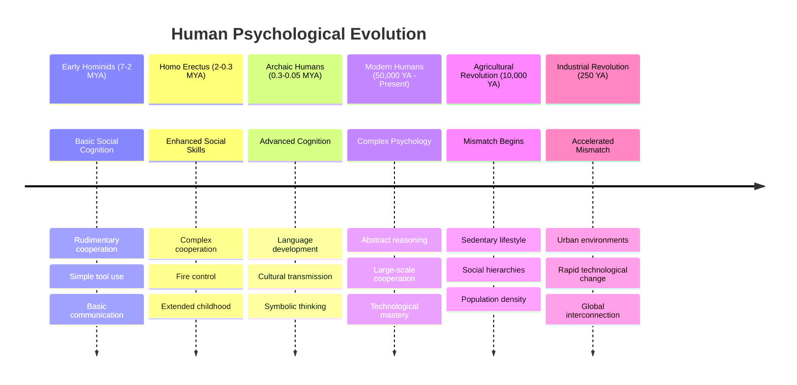
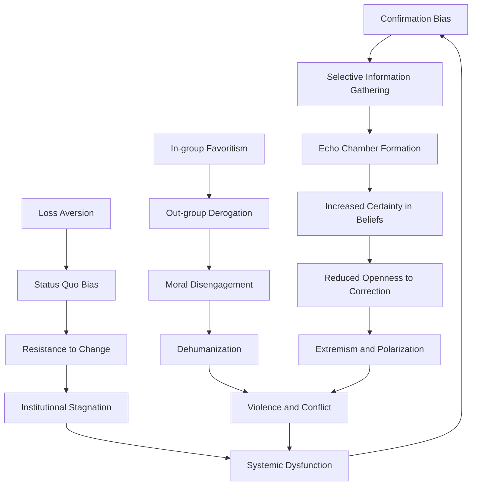

# Evolutionary Foundations of Human Dysfunction

## Abstract

This document examines how evolutionary psychology creates inherent vulnerabilities in human behavior and cognition. While natural selection optimized human psychology for ancestral environments, many adaptive mechanisms become maladaptive in modern contexts, creating systematic sources of individual and collective dysfunction.

## Introduction

Human psychology evolved over millions of years in small hunter-gatherer groups facing specific survival challenges. The cognitive and behavioral adaptations that enhanced reproductive success in ancestral environments often create problems in contemporary society. This evolutionary mismatch underlies many fundamental human problems, from individual psychological disorders to large-scale social conflicts.

## Evolutionary Timeline and Psychological Development

The evolution of human psychology represents a gradual accumulation of cognitive and social capabilities over millions of years, with each phase building upon previous adaptations while introducing new complexities. Understanding this timeline is crucial for comprehending why modern humans exhibit systematic behavioral patterns that often seem counterproductive in contemporary contexts.

This evolutionary timeline reveals a critical pattern: the vast majority of human psychological evolution occurred during the hunter-gatherer period, spanning roughly 6.8 million years, while the agricultural and industrial periods represent only the most recent 10,000 and 250 years respectively. As evolutionary psychologist Leda Cosmides observes, "Our modern skulls house a Stone Age mind" (Cosmides & Tooby, 1997). This temporal disparity explains why human psychology remains fundamentally calibrated for small-group, face-to-face interactions in natural environments, despite living in complex technological societies.

The **Early Hominid period** (7-2 million years ago) established the foundational social cognitive abilities that distinguish humans from other primates. During this phase, basic cooperation mechanisms evolved, including rudimentary communication systems and simple tool use. These early adaptations created the psychological infrastructure for more complex social behaviors, particularly the ability to coordinate activities and share resources within small groups.

The **Homo Erectus period** (2 million to 300,000 years ago) witnessed significant advances in social complexity. The control of fire fundamentally altered human social organization, creating central gathering points that facilitated extended social interaction and cultural transmission. The evolution of extended childhood during this period reflects the increasing importance of learning and cultural knowledge, as survival began to depend more on acquired skills than purely instinctual behaviors.

**Archaic Humans** (300,000 to 50,000 years ago) developed the cognitive capabilities that would define modern human psychology. Language development enabled complex communication about abstract concepts, past events, and future possibilities. Cultural transmission mechanisms allowed knowledge to accumulate across generations, creating the first truly cumulative cultural evolution. Symbolic thinking emerged, enabling humans to manipulate abstract concepts and engage in complex planning.

**Modern Humans** (50,000 years ago to present) represent the culmination of this evolutionary process, possessing sophisticated abstract reasoning abilities, capacity for large-scale cooperation, and technological mastery. However, these capabilities evolved within the context of hunter-gatherer societies with specific environmental and social constraints.

The **Agricultural Revolution** (10,000 years ago) marks the beginning of the evolutionary mismatch that underlies contemporary human dysfunction. The transition to sedentary lifestyles, permanent settlements, and agricultural production created social hierarchies and population densities that exceeded the scale for which human psychology had evolved. As Jared Diamond notes in "Guns, Germs, and Steel," agriculture was "the worst mistake in the history of the human race" from the perspective of individual well-being, despite its role in enabling civilization (Diamond, 1987).

The **Industrial Revolution** (250 years ago) accelerated this mismatch exponentially. Urban environments, rapid technological change, and global interconnection created living conditions radically different from those that shaped human psychology. The pace of change now exceeds the capacity for genetic adaptation, creating what evolutionary psychologists call "evolutionary lag"—the persistence of psychological mechanisms adapted for environments that no longer exist.

## Adaptive vs. Maladaptive Traits in Modern Context

The following analysis examines how specific psychological adaptations that enhanced survival and reproduction in ancestral environments now create systematic problems in modern contexts. This represents the core mechanism of evolutionary mismatch—adaptive solutions to ancient problems becoming sources of contemporary dysfunction.

### Cognitive and Perceptual Traits

The cognitive biases and perceptual tendencies that served our ancestors well in small-group, resource-scarce environments now systematically mislead us in complex modern societies. Each entry in this analysis represents a well-documented psychological mechanism with clear evolutionary origins and contemporary maladaptive consequences.

| Evolutionary Adaptation | Ancestral Function | Modern Maladaptation | Contemporary Problems |
|------------------------|-------------------|---------------------|----------------------|
| **Loss Aversion** | Avoid losing scarce resources | Excessive risk aversion | Poor investment decisions, status quo bias |
| **Availability Heuristic** | Quick threat assessment | Media-driven fear responses | Disproportionate fear of rare events |
| **Confirmation Bias** | Maintain group cohesion | Echo chambers, polarization | Political extremism, conspiracy theories |
| **In-group Favoritism** | Tribal cooperation | Racism, nationalism | Intergroup conflict, discrimination |
| **Temporal Discounting** | Immediate survival focus | Short-term thinking | Climate change denial, poor health choices |
| **Authority Deference** | Hierarchical stability | Blind obedience | Authoritarianism, cult behavior |
| **Pattern Recognition** | Predator/prey detection | False pattern detection | Superstition, conspiracy thinking |
| **Social Comparison** | Status assessment | Chronic dissatisfaction | Social media anxiety, materialism |

**Loss Aversion** demonstrates how an adaptive mechanism becomes systematically problematic in modern contexts. In ancestral environments where resources were genuinely scarce and losing them could mean death, humans evolved to weight losses approximately twice as heavily as equivalent gains. Psychologist Daniel Kahneman's research reveals that this bias now causes people to make irrational financial decisions, avoiding beneficial risks and maintaining suboptimal status quo situations (Kahneman & Tversky, 1979). The same mechanism that once prevented starvation now prevents economic advancement and social progress.

**Availability Heuristic** represents another clear case of evolutionary mismatch. Our ancestors needed to quickly assess threats based on recent or memorable experiences—if someone in the group was recently killed by a predator, heightened vigilance was adaptive. However, in modern media-saturated environments, this same mechanism causes people to dramatically overestimate the likelihood of rare but highly publicized events like terrorist attacks or plane crashes, while underestimating common but less dramatic risks like heart disease or car accidents.

**Confirmation Bias** evolved to maintain group cohesion in small tribes where dissent could be dangerous and group unity was essential for survival. As social psychologist Leon Festinger demonstrated, humans naturally seek information that confirms existing beliefs and avoid contradictory evidence (Festinger, 1957). In modern democratic societies, this same tendency creates echo chambers and political polarization that undermine the deliberative processes democracy requires.

**In-group Favoritism** and **Out-group Derogation** represent perhaps the most dangerous evolutionary legacy in modern contexts. The tendency to favor one's own group and view outsiders with suspicion was adaptive when groups competed directly for limited resources. However, in diverse modern societies, these same tendencies fuel racism, nationalism, and intergroup conflict. Social psychologist Henri Tajfel's minimal group experiments demonstrate that humans will discriminate against others based on even arbitrary group distinctions (Tajfel et al., 1971).

### Emotional and Motivational Systems

Human emotional and motivational systems evolved to navigate the specific challenges of ancestral environments, particularly those involving immediate physical threats, social relationships, and resource acquisition. These systems now often misfire in modern contexts, creating psychological distress and social problems.

| Evolutionary Adaptation | Ancestral Function | Modern Maladaptation | Contemporary Problems |
|------------------------|-------------------|---------------------|----------------------|
| **Fight-or-Flight Response** | Immediate physical threats | Chronic stress activation | Anxiety disorders, cardiovascular disease |
| **Social Anxiety** | Maintain group acceptance | Excessive conformity | Social media addiction, performance anxiety |
| **Jealousy and Mate Guarding** | Reproductive success | Domestic violence | Intimate partner abuse, stalking |
| **Dominance Seeking** | Resource acquisition | Power corruption | Political authoritarianism, workplace bullying |
| **Reciprocal Altruism** | Mutual benefit | Exploitation vulnerability | Ponzi schemes, cult recruitment |
| **Parental Investment** | Offspring survival | Helicopter parenting | Childhood anxiety, reduced resilience |
| **Disgust Response** | Pathogen avoidance | Moral disgust | Dehumanization, ethnic cleansing |
| **Revenge Motivation** | Deterrent signaling | Escalating conflicts | Feuds, international conflicts |

The **Fight-or-Flight Response** illustrates how a perfectly adaptive system becomes pathological in modern environments. This stress response system evolved to mobilize the body for immediate physical action in the face of life-threatening dangers. However, modern stressors—work deadlines, financial pressures, social conflicts—activate the same physiological response without providing opportunities for physical resolution. As stress researcher Robert Sapolsky explains in "Why Zebras Don't Get Ulcers," chronic activation of stress systems designed for acute threats leads to anxiety disorders, depression, cardiovascular disease, and immune dysfunction (Sapolsky, 2004).

**Social Anxiety** mechanisms evolved to ensure acceptance within small groups where rejection could mean death. The intense fear of social evaluation that helped our ancestors maintain group membership now creates debilitating anxiety in modern social situations. Social media amplifies this ancient fear by creating unprecedented opportunities for social comparison and rejection, leading to what psychologist Jean Twenge calls an "anxiety epidemic" among young people (Twenge, 2017).

**Jealousy and Mate Guarding** behaviors evolved to ensure reproductive success in environments where partners were scarce and infidelity could result in wasted reproductive investment. However, these same psychological mechanisms now contribute to domestic violence, stalking, and intimate partner abuse. The evolutionary logic that once protected reproductive interests now destroys the relationships it was designed to preserve.

**Dominance Seeking** behaviors evolved in contexts where social status directly translated to resource access and reproductive opportunities. In modern complex societies, these same drives contribute to political authoritarianism, workplace bullying, and the corruption of power. As historian Lord Acton observed, "Power tends to corrupt, and absolute power corrupts absolutely"—a recognition of how evolved dominance drives become pathological when unchecked by traditional social constraints.

## Psychological Mechanisms Underlying Dysfunction

### 1. Mismatch Theory Framework

The fundamental principle underlying evolutionary dysfunction is **environmental mismatch**—the discrepancy between the environments that shaped human psychology and contemporary living conditions.

#### Key Mismatch Domains:

**Social Environment Mismatch:**
- **Ancestral**: Small groups (25-150 individuals) with face-to-face interaction
- **Modern**: Anonymous urban environments with thousands of daily interactions
- **Dysfunction**: Social anxiety, urban loneliness, decreased empathy

**Information Environment Mismatch:**
- **Ancestral**: Limited, locally relevant information
- **Modern**: Information overload from global sources
- **Dysfunction**: Analysis paralysis, conspiracy theories, attention disorders

**Physical Environment Mismatch:**
- **Ancestral**: Natural landscapes with physical challenges
- **Modern**: Built environments with sedentary lifestyles
- **Dysfunction**: Depression, obesity, attention deficits

### 2. Cognitive Bias Cascades

Evolutionary cognitive biases do not operate in isolation—they interact and amplify each other through complex feedback loops, creating cascading dysfunction that can escalate from individual errors to societal breakdown. Understanding these cascade effects is crucial for comprehending how small psychological biases can produce large-scale social pathologies.

This diagram illustrates three primary cascade pathways that transform adaptive individual biases into destructive social phenomena. Each pathway represents a well-documented psychological process that has been observed across cultures and historical periods.

**The Confirmation Bias Cascade** begins with the natural human tendency to seek information that confirms existing beliefs—a mechanism that once helped maintain group cohesion and reduce cognitive load. However, in modern information-rich environments, this bias leads to **Selective Information Gathering**, where individuals increasingly consume only sources that reinforce their preexisting views. This creates **Echo Chamber Formation**, where groups of like-minded individuals reinforce each other's beliefs without exposure to contradictory evidence.

As social psychologist Cass Sunstein demonstrates in "Echo Chambers," this process leads to **Increased Certainty in Beliefs** and **Reduced Openness to Correction** (Sunstein, 2001). The final stage is **Extremism and Polarization**, where groups develop increasingly radical positions that become immune to evidence or rational argument. This cascade explains how reasonable people can develop unreasonable beliefs and why political polarization has intensified in the internet age.

**The In-group Favoritism Cascade** transforms natural tribal loyalty into systematic dehumanization and violence. Beginning with **In-group Favoritism**—the tendency to prefer members of one's own group—this process leads to **Out-group Derogation**, where outsiders are viewed as inferior or threatening. Psychologist Albert Bandura's research on **Moral Disengagement** shows how people gradually suspend moral standards when dealing with out-group members (Bandura, 1999).

The process culminates in **Dehumanization**, where out-group members are viewed as less than human, and ultimately **Violence and Conflict**. This cascade has been documented in contexts ranging from genocide to everyday discrimination, demonstrating how evolved tribal psychology can produce the most destructive aspects of human behavior.

**The Loss Aversion Cascade** shows how adaptive conservatism becomes pathological resistance to necessary change. **Loss Aversion** leads to **Status Quo Bias**—the preference for current states of affairs over alternatives. This creates **Resistance to Change**, even when change would be beneficial. Over time, this resistance produces **Institutional Stagnation**, where organizations and societies fail to adapt to changing circumstances, ultimately resulting in **Systemic Dysfunction**.

Critically, these cascades interconnect and reinforce each other. Political extremism (from the confirmation bias cascade) often leads to violence and conflict (from the in-group favoritism cascade), which in turn creates institutional dysfunction (from the loss aversion cascade). This systemic dysfunction then reinforces confirmation bias as people seek simple explanations for complex problems, completing a destructive cycle.

### 3. Evolutionary Traps

Modern environments create "evolutionary traps"—situations where evolved behaviors become self-destructive:

#### Supernormal Stimuli Traps:
- **Food**: Processed foods exploit taste preferences evolved for scarce nutrients
- **Sex**: Pornography provides supernormal sexual stimuli without reproductive benefits
- **Social Status**: Social media provides artificial status signals without real social connection
- **Novelty**: Digital entertainment exploits curiosity without learning benefits

#### Collective Action Traps:
- **Tragedy of Commons**: Individual rational behavior leads to collective irrationality
- **Free Rider Problem**: Evolved reciprocity mechanisms fail in large anonymous groups
- **Coordination Failures**: Lack of evolved mechanisms for large-scale coordination

### Neurobiological Foundations of Evolutionary Mismatch

The human brain's evolutionary architecture creates inherent conflicts between different processing systems, leading to systematic decision-making failures and emotional dysregulation in modern contexts. Understanding this neurobiological foundation is essential for comprehending why humans consistently act against their own long-term interests.

### Limbic System Dominance

The evolutionary layering of the human brain creates inherent conflicts between different processing systems that evolved at different times for different purposes. Neuroscientist Paul MacLean's "triune brain" model, while simplified, captures the essential tension between these systems (MacLean, 1990).

The evolutionary layering of the human brain creates inherent conflicts between:

- **Reptilian Brain**: Basic survival drives (fight, flight, feed, reproduce)
- **Limbic System**: Emotional processing and social bonding (evolved for small groups)
- **Neocortex**: Abstract reasoning and planning (most recent evolutionary development)

**The Reptilian Brain** represents the oldest neural structures, focused on immediate survival needs. These systems prioritize basic drives—fighting threats, fleeing danger, finding food, and reproducing—without consideration of long-term consequences or complex social dynamics. In modern contexts, these drives often override more sophisticated reasoning processes, leading to impulsive behaviors that serve immediate needs while creating long-term problems.

**The Limbic System** evolved to handle the emotional and social complexities of mammalian life, particularly the need to form bonds, navigate social hierarchies, and coordinate group activities. However, these systems evolved for small groups with face-to-face relationships and clear social structures. In modern anonymous societies with complex institutions, limbic responses often misfire, creating inappropriate emotional reactions to abstract social situations.

**The Neocortex** represents humanity's most recent evolutionary development, enabling abstract reasoning, long-term planning, and complex problem-solving. However, this system is metabolically expensive and easily overwhelmed by stress or emotional arousal. As neuroscientist Antonio Damasio demonstrates in "Descartes' Error," rational decision-making requires integration between emotional and cognitive systems—but this integration often fails under pressure (Damasio, 1994).

In stress or uncertainty, older brain systems override newer rational systems, leading to:
- **Emotional decision-making in complex situations**: When faced with abstract challenges like climate change or economic policy, people often revert to emotional responses calibrated for immediate physical threats
- **Short-term thinking in long-term problems**: The urgency signals from ancient brain systems overwhelm the neocortex's capacity for long-term planning
- **Tribal responses to abstract challenges**: Complex policy issues trigger in-group/out-group responses designed for small-scale tribal conflicts

### Neurotransmitter System Exploitation

Modern environments systematically exploit evolved neurotransmitter systems, creating artificial reward signals that hijack natural motivation systems. This exploitation underlies many contemporary behavioral problems, from addiction to social media dependency.

| Neurotransmitter | Evolutionary Function | Modern Exploitation | Resulting Dysfunction |
|------------------|----------------------|-------------------|----------------------|
| **Dopamine** | Reward prediction for survival behaviors | Gambling, social media, drugs | Addiction, attention disorders |
| **Serotonin** | Social status and mood regulation | Antidepressants, status consumption | Depression, materialism |
| **Oxytocin** | Pair bonding and group cohesion | Parasocial relationships, cults | Misplaced trust, exploitation |
| **Cortisol** | Stress response for immediate threats | Chronic stress from modern life | Anxiety, immune dysfunction |

**Dopamine** evolved as a reward prediction system, releasing anticipatory pleasure when behaviors likely to enhance survival or reproduction were initiated. This system motivated our ancestors to seek food, mates, and social status. However, modern environments provide supernormal stimuli that trigger dopamine release without delivering genuine benefits. Gambling exploits this system by providing intermittent reinforcement schedules that maximize dopamine release while providing no real rewards. Social media platforms use similar mechanisms, providing unpredictable social rewards (likes, comments, shares) that trigger dopamine release and create addictive usage patterns.

**Serotonin** functions as a social status and mood regulation system, with higher levels associated with dominant social positions and positive mood states. In ancestral environments, serotonin levels reflected genuine social status that provided real benefits. Modern consumer culture exploits this system through status consumption—the purchase of goods that signal social position without providing genuine status benefits. The widespread use of antidepressants to artificially elevate serotonin levels represents another form of system exploitation, treating symptoms of social dysfunction rather than addressing underlying causes.

**Oxytocin** evolved to facilitate pair bonding and group cohesion through trust and empathy. This "bonding hormone" enabled the cooperation that made human societies possible. However, modern environments create opportunities for oxytocin exploitation through parasocial relationships—one-sided emotional connections with media figures, celebrities, or online personalities. Cult recruitment often exploits oxytocin systems by creating artificial intimacy and group bonding that serves the cult's interests rather than members' well-being.

**Cortisol** represents the body's primary stress hormone, evolved to mobilize resources for dealing with immediate physical threats. Acute cortisol release enhances performance and survival in genuine emergencies. However, chronic cortisol elevation from modern stressors—work pressure, financial insecurity, social conflict—creates widespread health problems including anxiety disorders, depression, cardiovascular disease, and immune dysfunction. The system designed to save lives in emergencies now shortens lives through chronic activation.

## Implications for Understanding Human Problems

### Individual Level Implications

1. **Psychological Disorders**: Many mental health issues represent normal responses to abnormal (modern) environments
2. **Behavioral Addictions**: Compulsive behaviors exploit evolved reward systems
3. **Cognitive Limitations**: Systematic thinking errors reflect adaptive shortcuts in wrong contexts
4. **Emotional Dysregulation**: Emotional systems calibrated for different social environments

### Group Level Implications

1. **Intergroup Conflict**: Tribal psychology scales poorly to modern diverse societies
2. **Leadership Failures**: Dominance-based leadership adapted for small groups fails in complex organizations
3. **Collective Decision-Making**: Group psychology evolved for consensus in small groups, not democratic deliberation
4. **Social Movements**: Mass movements exploit evolved psychological mechanisms for tribal mobilization

### Societal Level Implications

1. **Political Systems**: Democratic institutions conflict with evolved preferences for strong leaders
2. **Economic Systems**: Market psychology reflects evolved reciprocity and status competition
3. **Environmental Problems**: Short-term thinking and tragedy of commons reflect evolutionary limitations
4. **Technological Risks**: Rapid technological change outpaces psychological adaptation

## Theoretical Integration

### Evolutionary Psychology Framework

This analysis integrates multiple evolutionary psychology theories:

- **Inclusive Fitness Theory**: Behaviors evolved to maximize genetic representation in future generations
- **Reciprocal Altruism**: Cooperation evolved through repeated interactions and reputation
- **Sexual Selection**: Many psychological traits evolved through mate competition and choice
- **Group Selection**: Some traits may have evolved for group-level benefits despite individual costs

### Complexity Science Perspective

Evolutionary mismatch creates complex adaptive system dynamics:
- **Emergence**: Individual evolutionary biases create emergent social pathologies
- **Feedback Loops**: Modern environments reinforce maladaptive behaviors
- **Phase Transitions**: Gradual mismatch can lead to sudden systemic breakdowns
- **Path Dependence**: Historical evolutionary constraints limit adaptation options

## Conclusion

Understanding the evolutionary foundations of human dysfunction provides crucial insights into why humans consistently create problems for themselves and others. The mismatch between evolved psychology and modern environments underlies individual mental health issues, group conflicts, and societal failures. This evolutionary perspective suggests that many human problems are not moral failings or rational errors, but predictable consequences of psychological adaptations operating in environments radically different from those that shaped them.

Recognition of these evolutionary constraints is essential for developing realistic approaches to human problems. Rather than expecting humans to transcend their evolved nature, effective solutions must work with evolutionary psychology while mitigating its maladaptive consequences in modern contexts.

## References

1. Buss, D. M. (2019). *Evolutionary Psychology: The New Science of the Mind*. Routledge.
2. Cosmides, L., & Tooby, J. (2013). Evolutionary psychology: New perspectives on cognition and motivation. *Annual Review of Psychology*, 64, 201-229.
3. Li, N. P., van Vugt, M., & Colarelli, S. M. (2018). The evolutionary mismatch hypothesis: Implications for psychological science. *Current Directions in Psychological Science*, 27(1), 38-44.
4. Pinker, S. (2011). *The Better Angels of Our Nature: Why Violence Has Declined*. Viking.
5. Wilson, E. O. (2012). *The Social Conquest of Earth*. Liveright Publishing.

---

*See also: [Cognitive Architecture](../individual/cognitive-architecture.md) | [Neurobiological Constraints](../individual/neurobiological-constraints.md) | [Individual Psychology Overview](../individual/README.md)*