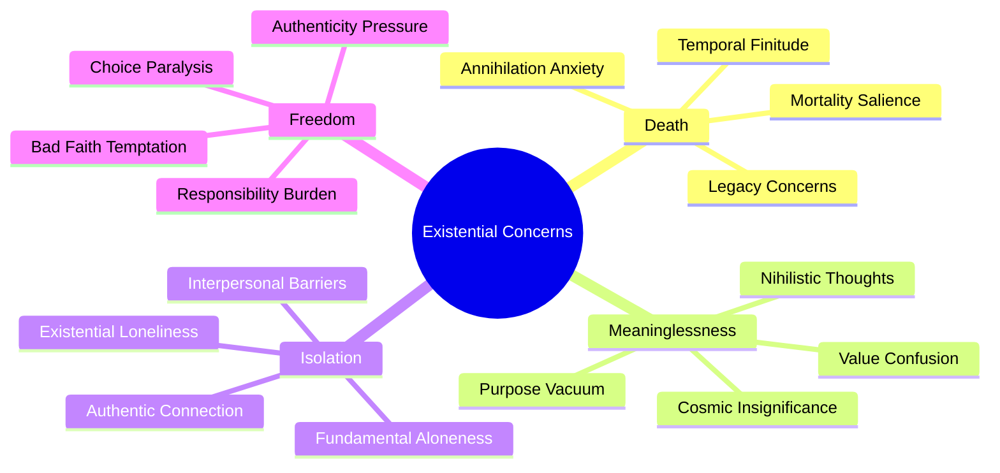
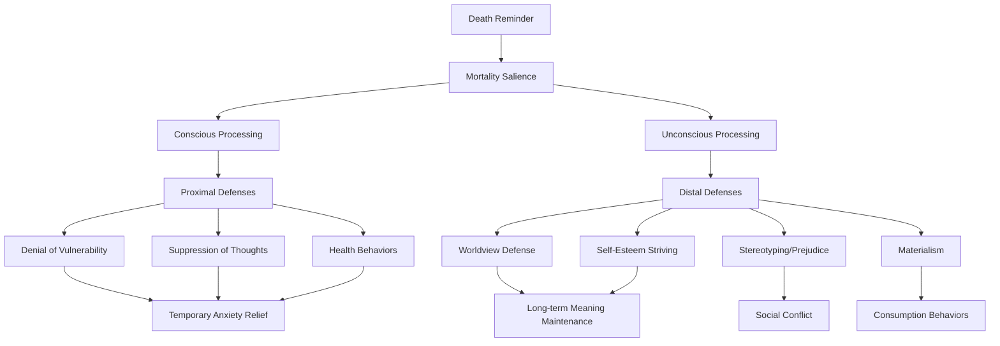
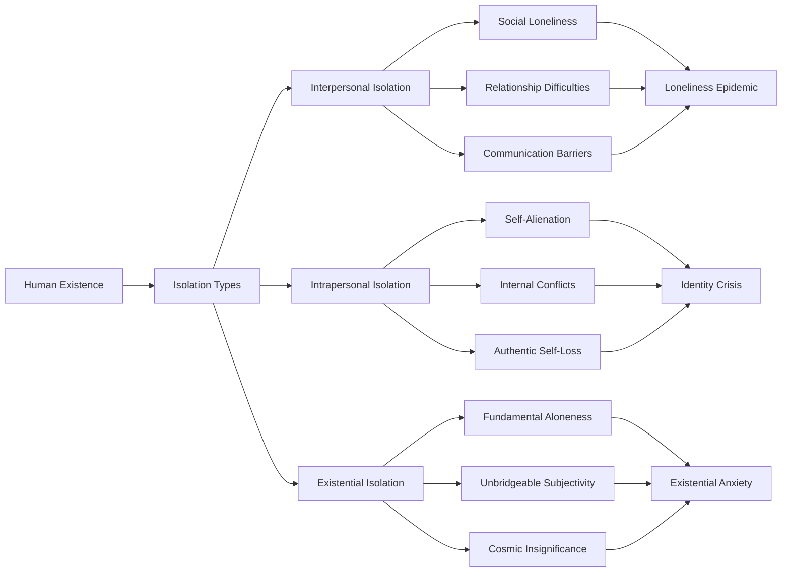
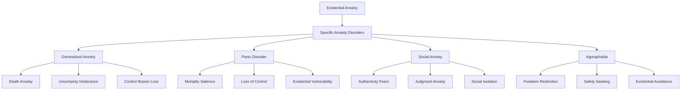
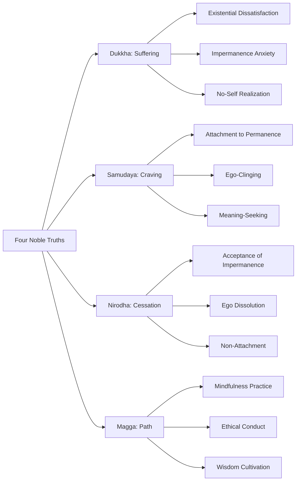
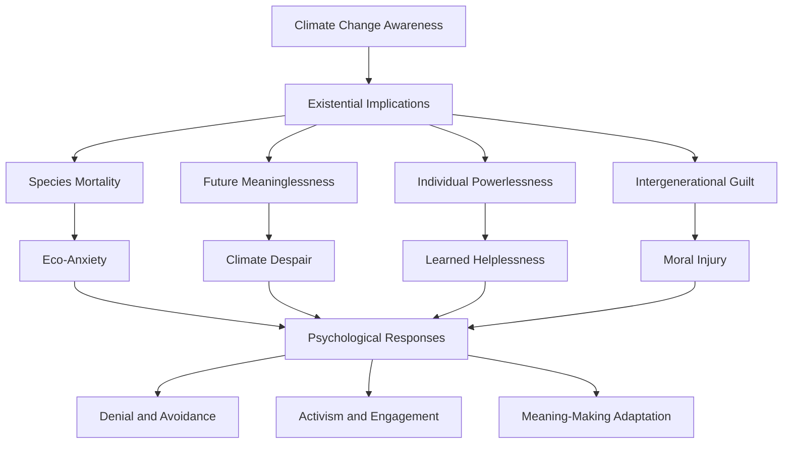
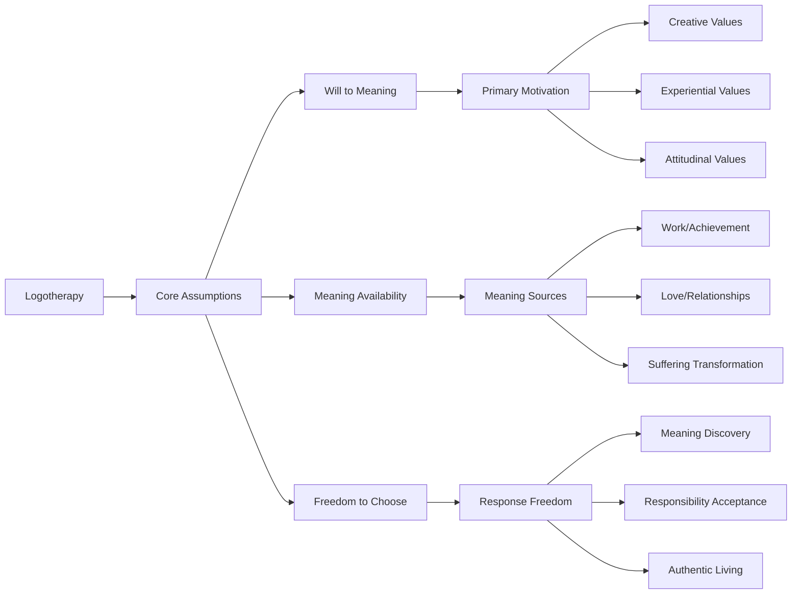

# Existential Psychology and Meaning-Making Failures

## Abstract

Existential psychology examines the fundamental human struggle with meaning, purpose, and mortality that underlies much individual psychological distress. The human capacity for self-awareness and abstract thought, while enabling remarkable achievements, also creates unique existential burdens including death anxiety, meaninglessness, isolation, and freedom anxiety. These existential concerns, when inadequately addressed, contribute to depression, anxiety, addiction, and other forms of psychological dysfunction.

## Introduction

Humans are uniquely burdened among animals by their capacity for existential awareness—the ability to contemplate their own mortality, question the meaning of existence, and grapple with ultimate concerns about purpose and significance. This existential consciousness, while enabling higher-order thinking and cultural achievement, also creates profound psychological challenges that can overwhelm individual coping resources and contribute to widespread mental health problems.

## Fundamental Existential Concerns

### The Four Ultimate Concerns

Existential psychology identifies four fundamental concerns that create anxiety and distress in human consciousness. These concerns represent the inevitable challenges of being a self-aware, mortal being capable of abstract thought and reflection.

This mindmap illustrates how each ultimate concern branches into specific psychological manifestations. **Death anxiety** encompasses not just fear of dying but awareness of life's temporal limits and the drive to create lasting significance. **Meaninglessness** reflects the human need for purpose in a universe that may be fundamentally purposeless. **Isolation** captures the paradox that despite being social creatures, humans experience fundamental aloneness in their subjective experience. **Freedom** represents the burden of choice and responsibility that comes with human consciousness and agency.

### Death Anxiety and Terror Management

#### Terror Management Theory Components

Terror Management Theory, developed by Sheldon Solomon, Jeff Greenberg, and Tom Pyszczynski, explains how humans cope with the awareness of death through cultural worldviews and self-esteem. This table reveals the psychological architecture humans use to manage existential terror and the consequences when these systems fail.

| Component | Description | Psychological Function | Failure Consequences |
|-----------|-------------|----------------------|---------------------|
| **Cultural Worldview** | Shared belief system providing meaning | Immortality projects, symbolic significance | Nihilism, despair |
| **Self-Esteem** | Feeling valuable within cultural framework | Sense of personal significance | Worthlessness, depression |
| **Close Relationships** | Intimate connections providing security | Emotional buffering | Isolation, anxiety |
| **Meaning-Making** | Coherent narrative about existence | Purpose and direction | Confusion, aimlessness |

The **Cultural Worldview** component shows how humans create shared belief systems that promise symbolic or literal immortality—whether through religious afterlife beliefs, scientific progress, or cultural achievements. When these worldviews are threatened or collapse, individuals experience existential crisis. **Self-Esteem** functions as a personal anxiety buffer, providing a sense of significance within the cultural framework. **Close Relationships** offer emotional security and validation, while **Meaning-Making** provides cognitive coherence about existence. The failure of any component can trigger existential anxiety and psychological dysfunction.

#### Mortality Salience Effects

This flowchart demonstrates the dual-process model of terror management, showing how reminders of death trigger both conscious and unconscious psychological defenses. Understanding this process explains why humans often react to mortality reminders with increased prejudice, materialism, and worldview defense.

**Proximal defenses** operate when death thoughts are conscious, involving direct attempts to reduce death anxiety through denial ("that won't happen to me"), suppression ("I won't think about it"), or health behaviors ("I'll exercise more"). These provide temporary relief but don't address underlying existential concerns.

**Distal defenses** operate unconsciously and involve strengthening cultural worldviews and self-esteem. **Worldview defense** manifests as increased support for one's beliefs and hostility toward different worldviews. **Self-esteem striving** involves pursuing cultural values more intensely. **Stereotyping and prejudice** increase as people derogate those who threaten their worldview. **Materialism** intensifies as people seek symbolic immortality through possessions and status. These unconscious defenses can lead to social conflict and destructive behaviors while serving the psychological function of managing death anxiety.

### Meaninglessness and the Existential Vacuum

#### Sources of Meaning Crisis

This table traces the historical evolution of meaning-making systems and their disruption, revealing how modernization has systematically undermined traditional sources of purpose and significance. Each historical transition has created new forms of existential anxiety while failing to provide adequate replacements for lost meaning structures.

| Historical Period | Primary Meaning Sources | Disruption Factors | Psychological Consequences |
|------------------|------------------------|-------------------|---------------------------|
| **Traditional Societies** | Religion, community, tradition | Modernization, urbanization | Anomie, rootlessness |
| **Industrial Era** | Work, progress, nationalism | Automation, globalization | Alienation, purposelessness |
| **Postmodern Era** | Individual choice, self-actualization | Relativism, fragmentation | Analysis paralysis, nihilism |
| **Digital Age** | Virtual connections, information | Information overload, superficiality | Attention fragmentation, shallow engagement |

**Traditional societies** provided clear meaning through religious frameworks, tight-knit communities, and established traditions. The disruption through modernization and urbanization created what sociologist Émile Durkheim called "anomie"—a condition of normlessness and social disconnection.

The **Industrial Era** shifted meaning toward work identity, belief in progress, and national belonging. However, automation reduced the significance of individual labor, while globalization undermined local and national identities, leading to widespread alienation.

The **Postmodern Era** emphasized individual choice and self-actualization as meaning sources, but this created new burdens. Relativism undermined confidence in any particular values, while fragmentation of social structures left individuals without clear guidance, resulting in analysis paralysis and nihilistic responses.

The **Digital Age** promises connection and unlimited information access, but often delivers superficial virtual relationships and overwhelming information streams that fragment attention and prevent deep engagement with meaningful activities.

#### Meaning-Making Frameworks Comparison

| Framework | Core Premise | Meaning Source | Strengths | Limitations |
|-----------|--------------|----------------|-----------|-------------|
| **Religious** | Divine purpose and plan | God, sacred texts, afterlife | Comprehensive worldview | Requires faith, dogmatic |
| **Humanistic** | Human potential and growth | Self-actualization, relationships | Individual empowerment | Subjective, potentially narcissistic |
| **Existentialist** | Self-created meaning | Authentic choice, responsibility | Freedom and authenticity | Anxiety-provoking, isolating |
| **Nihilistic** | No inherent meaning | None (rejection of meaning) | Intellectual honesty | Despair, paralysis |
| **Absurdist** | Embrace meaninglessness | Revolt, creation, acceptance | Practical engagement | Philosophical sophistication required |

### Existential Isolation

#### Levels of Existential Isolation

### Freedom and Responsibility Anxiety

#### The Burden of Choice

| Choice Domain | Freedom Paradox | Anxiety Sources | Coping Strategies | Pathological Responses |
|---------------|-----------------|-----------------|-------------------|----------------------|
| **Career** | Unlimited possibilities | Fear of wrong choice | Research, mentoring | Paralysis, conformity |
| **Relationships** | Partner selection freedom | Commitment anxiety | Trial relationships | Avoidance, serial relationships |
| **Values** | Moral relativism | Ethical uncertainty | Philosophy, religion | Nihilism, fundamentalism |
| **Identity** | Self-creation responsibility | Authenticity pressure | Self-exploration | False self, people-pleasing |
| **Lifestyle** | Consumer choices | Decision fatigue | Simplification | Compulsive consumption |

## Existential Psychopathology

### Depression and Existential Themes

#### Existential Components of Depression

| Depressive Symptom | Existential Dimension | Underlying Concern | Therapeutic Target |
|-------------------|----------------------|-------------------|-------------------|
| **Hopelessness** | Future meaninglessness | Death anxiety, purpose loss | Meaning reconstruction |
| **Worthlessness** | Self-significance failure | Self-esteem within worldview | Value clarification |
| **Isolation** | Existential loneliness | Fundamental aloneness | Authentic connection |
| **Anhedonia** | Loss of life engagement | Meaninglessness | Purpose discovery |
| **Suicidal Ideation** | Escape from existence | Overwhelming existential burden | Crisis intervention, meaning-making |

### Anxiety Disorders and Existential Underpinnings

### Addiction as Existential Escape

#### Substance Use and Existential Avoidance

| Substance Category | Existential Function | Avoided Experience | Temporary Relief | Long-term Consequences |
|-------------------|---------------------|-------------------|------------------|----------------------|
| **Alcohol** | Anxiety reduction, social connection | Death anxiety, isolation | Disinhibition, belonging | Dependency, health problems |
| **Stimulants** | Energy, confidence, productivity | Meaninglessness, inadequacy | Enhanced performance | Crash, paranoia |
| **Depressants** | Emotional numbing, escape | Overwhelming emotions | Peaceful detachment | Respiratory depression |
| **Hallucinogens** | Transcendence, meaning | Ordinary reality limitations | Mystical experiences | Psychological instability |
| **Cannabis** | Relaxation, altered perception | Anxiety, boredom | Stress relief | Motivation loss |

## Historical Examples of Existential Crises

### Individual Case Studies

#### Friedrich Nietzsche: The Madman's Proclamation

**Background**: 19th-century philosopher who declared "God is dead" and grappled with nihilism.

**Existential Crisis Elements**:
- Loss of traditional religious meaning structures
- Confrontation with meaninglessness and moral relativism
- Struggle to create new values in absence of divine authority
- Mental breakdown possibly related to existential burden

**Cultural Impact**: Influenced existentialist movement and modern secular meaning-making attempts.

#### Virginia Woolf: Existential Sensitivity and Mental Illness

**Background**: Modernist writer who explored consciousness and existential themes.

**Existential Struggles**:
- Acute awareness of life's fragility and meaninglessness
- Sensitivity to existential isolation and communication barriers
- Oscillation between creative meaning-making and despair
- Ultimate suicide as escape from existential burden

**Literary Legacy**: Works illuminate connection between existential awareness and psychological vulnerability.

### Collective Existential Crises

#### Post-World War I "Lost Generation"

**Historical Context**: Massive death and destruction challenged traditional meaning systems.

**Collective Symptoms**:
- Disillusionment with progress and civilization
- Loss of faith in traditional authorities and values
- Widespread nihilism and cynicism
- Search for new forms of meaning and authenticity

**Cultural Responses**: Modernist art, existentialist philosophy, bohemian lifestyles.

#### 1960s Counterculture Movement

**Existential Triggers**:
- Nuclear threat and mortality salience
- Questioning of traditional social structures
- Expansion of individual freedom and choice
- Confrontation with meaninglessness in affluent society

**Responses**:
- Eastern spirituality adoption
- Psychedelic exploration for transcendence
- Communal living experiments
- Political activism for meaning and purpose

## Philosophical Frameworks for Existential Understanding

### Existentialist Approaches

#### Key Existentialist Concepts

| Philosopher | Core Concept | Existential Insight | Therapeutic Implication |
|-------------|--------------|-------------------|------------------------|
| **Kierkegaard** | Anxiety and leap of faith | Anxiety signals freedom | Embrace uncertainty |
| **Sartre** | Radical freedom and bad faith | We are condemned to be free | Accept responsibility |
| **Camus** | Absurd and revolt | Life is absurd but worth living | Create meaning despite absurdity |
| **Heidegger** | Being-toward-death | Authentic existence requires mortality awareness | Confront finitude |
| **Beauvoir** | Situated freedom | Freedom exists within constraints | Navigate ambiguity |

### Eastern Philosophical Perspectives

#### Buddhist Approach to Existential Suffering

## Contemporary Existential Challenges

### Digital Age Existential Issues

#### Technology and Meaning Disruption

| Technology Impact | Existential Challenge | Psychological Consequence | Adaptive Response |
|------------------|----------------------|--------------------------|-------------------|
| **Social Media** | Comparison and authenticity | Identity confusion | Digital detox, authentic sharing |
| **Information Overload** | Analysis paralysis | Decision fatigue | Information curation |
| **Virtual Reality** | Reality questioning | Dissociation | Grounding practices |
| **AI Development** | Human uniqueness threat | Existential obsolescence | Skill development, creativity |
| **Global Connectivity** | Overwhelming awareness | Compassion fatigue | Selective engagement |

### Climate Change and Existential Threat

#### Environmental Anxiety and Meaning

## Therapeutic Approaches to Existential Issues

### Existential Psychotherapy

#### Core Therapeutic Principles

| Principle | Description | Therapeutic Technique | Expected Outcome |
|-----------|-------------|----------------------|------------------|
| **Here-and-Now Focus** | Present moment awareness | Mindfulness, immediacy | Reduced rumination |
| **Responsibility Acceptance** | Own choices and consequences | Choice exploration | Increased agency |
| **Meaning Creation** | Develop personal significance | Values clarification | Purpose discovery |
| **Mortality Confrontation** | Face death anxiety directly | Death meditation | Reduced death anxiety |
| **Authentic Relating** | Genuine therapeutic relationship | Therapist transparency | Improved relationships |

### Logotherapy and Meaning-Centered Approaches

#### Viktor Frankl's Logotherapy Principles

### Acceptance and Commitment Therapy (ACT)

#### ACT Processes for Existential Issues

| ACT Process | Existential Application | Technique | Outcome |
|-------------|------------------------|-----------|---------|
| **Acceptance** | Embrace existential anxiety | Mindfulness, defusion | Reduced avoidance |
| **Cognitive Defusion** | Separate from existential thoughts | Thought observation | Decreased rumination |
| **Present Moment** | Ground in immediate experience | Mindfulness practices | Reduced future anxiety |
| **Values Clarification** | Identify meaningful directions | Values exercises | Purpose clarity |
| **Committed Action** | Pursue meaningful goals | Behavioral activation | Increased engagement |
| **Self-as-Context** | Transcend ego concerns | Perspective-taking | Reduced self-focus |

## Implications for Human Dysfunction

### Individual Level Consequences

1. **Mental Health Disorders**: Existential concerns underlie many psychological symptoms
2. **Substance Abuse**: Addiction often represents escape from existential anxiety
3. **Relationship Problems**: Authenticity struggles damage intimate connections
4. **Career Dissatisfaction**: Meaningless work contributes to depression and anxiety

### Societal Level Consequences

1. **Nihilistic Movements**: Collective meaning loss enables destructive ideologies
2. **Consumer Culture**: Materialism as attempted solution to existential emptiness
3. **Political Extremism**: Fundamentalism provides certainty against existential anxiety
4. **Social Fragmentation**: Individualism increases existential isolation

### Cultural Level Consequences

1. **Meaning Crisis**: Loss of shared meaning systems creates social instability
2. **Spiritual Seeking**: New age movements attempt to fill existential void
3. **Entertainment Addiction**: Media consumption as existential avoidance
4. **Achievement Culture**: Success pursuit as immortality project

## Conclusion

Existential psychology reveals that much human suffering stems from the fundamental challenges of conscious existence: awareness of mortality, responsibility for meaning-creation, and the burden of freedom. These existential concerns, while universal aspects of human experience, become pathological when individuals lack adequate resources for meaning-making and anxiety management.

The prevalence of existential themes in psychological disorders suggests that effective mental health treatment must address not only symptoms but also underlying concerns about meaning, mortality, and authenticity. Understanding existential psychology is crucial for developing comprehensive approaches to human wellbeing that acknowledge both the gifts and burdens of human consciousness.

The modern era has intensified existential challenges through the loss of traditional meaning systems, increased individual freedom, and awareness of global threats. Addressing these challenges requires both individual therapeutic work and cultural efforts to create new forms of meaning and community that can sustain human flourishing in an uncertain world.

## References

1. Yalom, I. D. (1980). *Existential Psychotherapy*. Basic Books.
2. Frankl, V. E. (1963). *Man's Search for Meaning*. Beacon Press.
3. Becker, E. (1973). *The Denial of Death*. Free Press.
4. May, R. (1977). *The Meaning of Anxiety*. W. W. Norton & Company.
5. Sartre, J. P. (1943). *Being and Nothingness*. Philosophical Library.

---

*See also: [Psychological Pathology](../individual/psychological-pathology.md) | [Neurobiological Constraints](../individual/neurobiological-constraints.md) | [Individual Psychology Overview](../individual/README.md)*