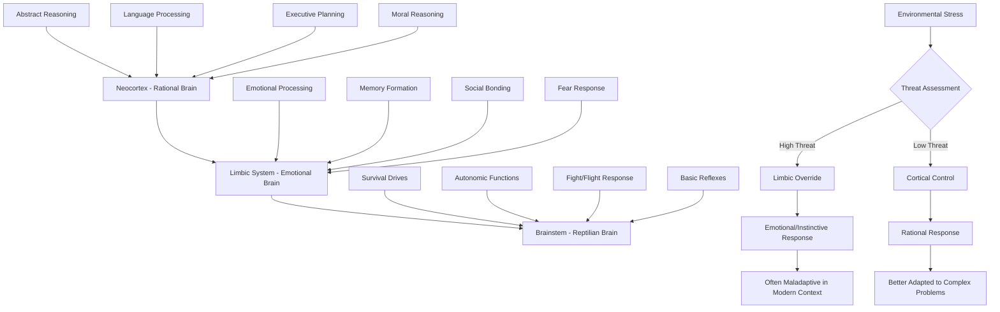
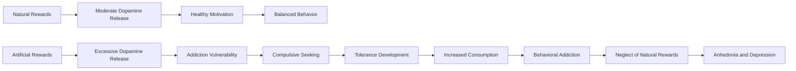
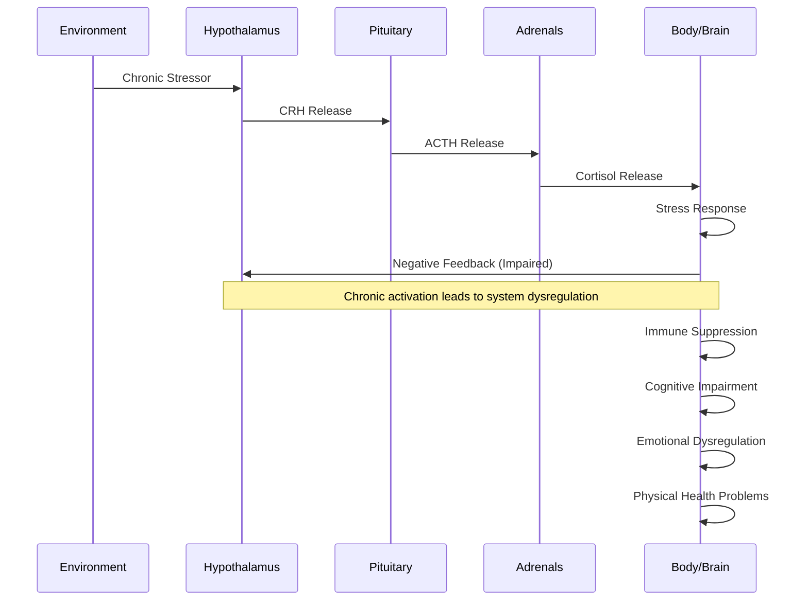
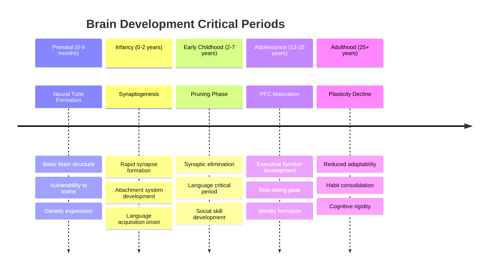
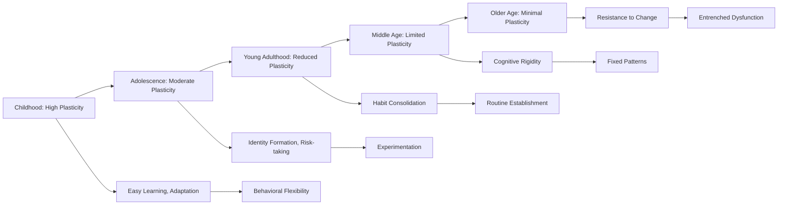

# Neurobiological Constraints and Behavioral Limitations

## Abstract

The human brain's neurobiological architecture imposes fundamental constraints on behavior, cognition, and emotional regulation. These constraints, arising from evolutionary history, developmental processes, and neurochemical systems, create systematic vulnerabilities that manifest as individual psychological problems and contribute to broader social dysfunction. Understanding these neurobiological limitations is crucial for comprehending why humans consistently engage in self-destructive and collectively harmful behaviors.

## Introduction

Human behavior emerges from the complex interaction of neurobiological systems that evolved over millions of years. While remarkably sophisticated, the human brain contains inherent structural and functional limitations that constrain cognitive capacity, emotional regulation, and behavioral control. These neurobiological constraints create predictable patterns of dysfunction at individual and collective levels.

## Evolutionary Brain Architecture

### Triune Brain Model and Hierarchical Control

The human brain's hierarchical architecture creates a fundamental tension between different processing systems, each evolved for different environmental challenges. This diagram illustrates how evolutionary layers of brain development create systematic behavioral conflicts in modern environments.

This hierarchical brain model reveals why humans consistently make decisions that seem irrational from a modern perspective. The neocortex, humanity's most recent evolutionary development, houses sophisticated capabilities like abstract reasoning and moral judgment. However, it operates slowly and requires significant energy, making it vulnerable to being overridden by faster, more primitive systems.

The limbic system, evolved for mammalian social and emotional processing, operates much faster than the neocortex and can hijack decision-making during perceived threats. As neuroscientist Joseph LeDoux explains in "The Emotional Brain," the amygdala can trigger fear responses before the cortex even processes what the threat might be. This creates situations where emotional reactions occur before rational analysis, leading to decisions that may have been adaptive in ancestral environments but prove counterproductive in modern contexts.

The brainstem, representing the oldest evolutionary layer, controls basic survival functions and operates entirely outside conscious awareness. When environmental stress triggers threat assessment, the system defaults to faster, more primitive responses rather than slower, more sophisticated analysis. This explains why humans under stress often revert to aggressive, territorial, or dominance-seeking behaviors that were adaptive for survival but create problems in complex social and professional environments.

### Neuroanatomical Constraints on Behavior

The following table reveals how different brain regions, evolved at different times for different purposes, create systematic behavioral limitations in modern environments. Understanding these constraints is crucial for comprehending why humans exhibit predictable patterns of dysfunction despite their sophisticated cognitive capabilities.

| Brain Region | Primary Functions | Evolutionary Age | Modern Limitations | Behavioral Consequences |
|--------------|------------------|------------------|-------------------|------------------------|
| **Brainstem** | Survival drives, autonomic functions | 500+ million years | Inflexible, automatic responses | Aggression, territoriality, dominance seeking |
| **Limbic System** | Emotion, memory, social bonding | 150+ million years | Rapid emotional responses | Anxiety, depression, addiction, tribal behavior |
| **Neocortex** | Abstract reasoning, language, planning | 2-6 million years | Slow, energy-intensive processing | Cognitive overload, decision fatigue, rationalization |
| **Prefrontal Cortex** | Executive control, impulse regulation | 2 million years | Late maturation, easily overwhelmed | Poor impulse control, short-term thinking |

This neuroanatomical analysis reveals a critical insight: the oldest brain regions, which have had the most time to be refined by natural selection, operate with automatic, inflexible responses that prioritize immediate survival over long-term optimization. The brainstem's 500-million-year evolutionary history has created robust but rigid systems that trigger aggression and dominance-seeking behaviors even in modern contexts where such responses are counterproductive.

The limbic system, with its 150-million-year development, processes emotions and social bonds rapidly but often inaccurately in complex modern environments. As neuroscientist Antonio Damasio demonstrates in "Descartes' Error," emotional processing occurs faster than rational analysis, leading to decisions based on emotional reactions rather than careful consideration of consequences. This creates systematic vulnerabilities to anxiety disorders, depression, and addictive behaviors that exploit the limbic system's reward mechanisms.

The neocortex and prefrontal cortex, humanity's most recent evolutionary developments, possess remarkable capabilities for abstract reasoning and executive control but operate slowly and require significant metabolic resources. This creates a fundamental asymmetry: primitive brain systems can override sophisticated ones during stress, fatigue, or cognitive overload. The prefrontal cortex's late maturation (not fully developed until age 25) and vulnerability to being overwhelmed explains why humans consistently exhibit poor impulse control and short-term thinking even when they intellectually understand the importance of long-term planning.

## Neurotransmitter Systems and Behavioral Vulnerabilities

### Dopamine System Dysfunction

The dopamine system, evolved for reward prediction and motivation in natural environments, becomes systematically dysregulated in modern contexts that provide artificial rewards. This flowchart illustrates how natural reward processing becomes hijacked by modern stimuli, creating cascading behavioral problems.

This dopamine dysfunction cascade reveals why modern environments create systematic addiction vulnerabilities. Natural rewards like food, social connection, and accomplishment trigger moderate dopamine release that motivates healthy behaviors without creating dependency. However, artificial rewards—designed by industries to maximize engagement—trigger excessive dopamine release that overwhelms the system's natural regulation mechanisms.

As addiction researcher Anna Lembke explains in "Dopamine Nation," the brain responds to excessive dopamine stimulation by reducing receptor sensitivity and baseline dopamine production. This creates tolerance, requiring increasingly intense stimulation to achieve the same reward experience. The result is a vicious cycle where individuals need more artificial stimulation while finding natural rewards increasingly unsatisfying.

The final stage of this process—anhedonia and depression—occurs when the dopamine system becomes so dysregulated that even artificial rewards lose their appeal. This explains why modern societies exhibit high rates of depression and addiction despite unprecedented access to pleasurable stimuli. The system designed to motivate adaptive behavior becomes hijacked by artificial rewards, ultimately undermining the capacity for satisfaction and motivation.

The following table details how specific dopamine functions become exploited in modern environments:

| Dopamine Function | Natural Context | Modern Exploitation | Resulting Problems |
|------------------|-----------------|-------------------|-------------------|
| **Reward Prediction** | Food, sex, social success | Gambling, gaming, social media | Addiction, compulsive behavior |
| **Motivation** | Survival activities | Artificial stimulation | Procrastination, apathy |
| **Learning** | Adaptive behaviors | Maladaptive reinforcement | Poor habit formation |
| **Attention** | Relevant stimuli | Attention hijacking | ADHD-like symptoms |

This analysis reveals how each aspect of dopamine function, adaptive in natural contexts, becomes systematically exploited by modern environments. Reward prediction, designed to help humans anticipate and seek beneficial outcomes, becomes hijacked by variable-ratio reinforcement schedules in gambling and social media that create compulsive engagement. The motivation system, evolved to drive survival-relevant activities, becomes redirected toward artificial stimuli that provide immediate gratification without long-term benefits.

### Serotonin System and Social Hierarchy

The serotonin system, evolved to regulate social status and emotional stability in small groups, becomes systematically dysregulated in complex modern societies with abstract hierarchies and social comparison opportunities. This table reveals how each serotonin function, adaptive in ancestral environments, creates problems in contemporary contexts.

| Serotonin Function | Adaptive Purpose | Modern Dysfunction | Social Consequences |
|-------------------|------------------|-------------------|-------------------|
| **Status Regulation** | Maintain social position | Status anxiety, materialism | Inequality, social comparison |
| **Mood Stability** | Emotional regulation | Depression, mood disorders | Reduced social functioning |
| **Impulse Control** | Behavioral inhibition | Aggression, impulsivity | Violence, antisocial behavior |
| **Social Bonding** | Group cohesion | Social isolation, loneliness | Weakened social fabric |

This serotonin dysfunction analysis reveals why modern societies exhibit high rates of depression, anxiety, and social conflict despite unprecedented material prosperity. Status regulation, designed for clear hierarchies in small groups where everyone knew their position, becomes overwhelmed by complex modern status systems with multiple, competing hierarchies and constant social comparison opportunities through media and social networks.

As psychiatrist Robert Sapolsky explains in "Behave," serotonin levels correlate strongly with social status, but modern environments create chronic status uncertainty and comparison stress that dysregulate this system. The result is widespread status anxiety and materialistic behavior as individuals attempt to signal status through consumption rather than genuine social contribution.

Mood stability, dependent on serotonin regulation, becomes compromised when the status system is chronically activated by social comparison and uncertainty. This explains why depression rates increase with social media use and economic inequality—environments that trigger constant status comparison and threat assessment. The impulse control function, designed to prevent aggression within cooperative groups, becomes overwhelmed by chronic stress and status threats, leading to increased violence and antisocial behavior in societies with high inequality and social instability.

### Stress Response System Dysregulation

#### HPA Axis Dysfunction

The hypothalamic-pituitary-adrenal (HPA) axis, designed for acute stress responses in dangerous environments, becomes chronically activated in modern contexts with persistent psychological stressors. This sequence diagram illustrates how chronic activation leads to system breakdown and widespread health problems.

This HPA axis dysfunction sequence reveals why modern environments create systematic health and behavioral problems through chronic stress activation. The system evolved for acute physical threats that required immediate action and then resolution. However, modern stressors—work pressure, financial concerns, social conflicts, information overload—persist for months or years without clear resolution, creating chronic activation that overwhelms the system's regulatory mechanisms.

The critical failure point occurs in the negative feedback loop, where chronic cortisol exposure damages the very brain regions (hippocampus and prefrontal cortex) responsible for shutting down the stress response. As stress researcher Robert Sapolsky documents in "Why Zebras Don't Get Ulcers," this creates a vicious cycle where stress impairs the brain's ability to regulate stress, leading to progressively worse dysfunction.

The downstream consequences—immune suppression, cognitive impairment, emotional dysregulation, and physical health problems—explain why chronic stress is linked to virtually every major health problem in modern societies. The system designed to enhance survival during acute threats becomes a source of systematic dysfunction when chronically activated by modern environmental demands.

## Brain Region-Specific Behavioral Problems

### Prefrontal Cortex Limitations

The prefrontal cortex, humanity's most sophisticated brain region, operates under severe capacity constraints that create systematic vulnerabilities in complex modern environments. This table reveals how each PFC function has specific limitations that lead to predictable failure modes.

| PFC Function | Capacity Limits | Failure Modes | Behavioral Manifestations |
|--------------|----------------|---------------|--------------------------|
| **Working Memory** | 7±2 items | Information overload | Poor decision-making under complexity |
| **Attention Control** | Single-focus limitation | Multitasking failures | Reduced performance, errors |
| **Impulse Inhibition** | Glucose-dependent | Ego depletion | Loss of self-control |
| **Abstract Reasoning** | Energy-intensive | Cognitive shortcuts | Biased thinking, heuristic reliance |
| **Future Planning** | Limited temporal scope | Present bias | Short-term thinking, procrastination |

This analysis of prefrontal cortex limitations reveals why even highly intelligent individuals make systematically poor decisions in complex environments. Working memory's strict capacity limit of 7±2 items, discovered by psychologist George Miller, means that humans can only consciously process a tiny fraction of available information at any given time. When environments exceed this capacity—as modern information-rich contexts routinely do—decision-making quality degrades predictably.

The single-focus limitation of attention control explains why multitasking consistently reduces performance despite feeling productive. As cognitive scientist Daniel Kahneman demonstrates, attention is a finite resource that becomes depleted through use. When divided among multiple tasks, each receives insufficient attention for optimal performance, leading to increased errors and reduced quality.

Impulse inhibition's dependence on glucose reveals why self-control fails predictably under stress, fatigue, or hunger. Research by Roy Baumeister shows that self-control operates like a muscle that becomes fatigued with use and requires metabolic resources to function. This explains why people make poor decisions when tired, stressed, or hungry—precisely when good decision-making is most crucial.

The energy-intensive nature of abstract reasoning creates a systematic bias toward cognitive shortcuts and heuristic thinking. When the prefrontal cortex lacks sufficient resources for careful analysis, it defaults to faster, less accurate processing modes that rely on biases and assumptions rather than thorough evaluation of evidence.

### Amygdala Hyperactivation

The amygdala, evolved for rapid threat detection in dangerous natural environments, becomes systematically overactivated in modern contexts that trigger false alarms. This table shows how each trigger type, adaptive in ancestral environments, creates dysfunction in contemporary settings.

| Trigger Type | Evolutionary Function | Modern Overactivation | Consequences |
|--------------|----------------------|---------------------|--------------|
| **Physical Threats** | Predator avoidance | Urban anxiety, phobias | Excessive fear responses |
| **Social Threats** | Group exclusion avoidance | Social anxiety, rejection sensitivity | Interpersonal dysfunction |
| **Uncertainty** | Cautious exploration | Anxiety disorders, risk aversion | Paralysis, missed opportunities |
| **Novel Stimuli** | Threat assessment | Xenophobia, neophobia | Prejudice, resistance to change |

This amygdala hyperactivation analysis reveals why modern environments create systematic anxiety and fear responses despite being statistically safer than ancestral environments. The amygdala's threat detection system evolved in contexts where false negatives (missing real threats) were more dangerous than false positives (responding to non-threats). This creates a system biased toward overreaction rather than accuracy.

Physical threat detection, designed for predators and environmental dangers, becomes triggered by urban environments with loud noises, crowded spaces, and unpredictable stimuli. As neuroscientist Joseph LeDoux explains in "The Emotional Brain," the amygdala processes sensory information faster than the cortex, triggering fear responses before conscious evaluation can occur. This creates anxiety and phobic responses to statistically safe but perceptually threatening modern environments.

Social threat detection, evolved to prevent group exclusion in small communities where ostracism meant death, becomes hyperactivated by modern social environments with constant evaluation and comparison. Social media, performance reviews, and competitive social contexts trigger the same neural responses as life-threatening social rejection, creating chronic social anxiety and rejection sensitivity that impair relationship formation and social functioning.

The uncertainty and novelty responses, adaptive for cautious exploration of potentially dangerous new environments, become maladaptive in modern contexts that require adaptation to constant change. This creates systematic resistance to beneficial changes and missed opportunities for growth and advancement.

### Hippocampus and Memory Distortions

The hippocampus, responsible for memory formation and spatial navigation, creates systematic distortions that served adaptive functions in ancestral environments but create problems in modern contexts requiring accurate information processing. This table reveals how each memory function introduces predictable biases and errors.

| Memory Function | Adaptive Purpose | Modern Problems | Cognitive Consequences |
|-----------------|------------------|-----------------|----------------------|
| **Episodic Memory** | Learn from experience | False memories, confabulation | Unreliable testimony, self-deception |
| **Spatial Memory** | Navigation | Disorientation in complex environments | Urban stress, cognitive load |
| **Contextual Memory** | Situational learning | Context-dependent recall | Inconsistent behavior across situations |
| **Emotional Memory** | Threat remembrance | Trauma, PTSD | Emotional dysregulation, avoidance |

This hippocampal memory analysis reveals why human memory, despite feeling subjectively accurate, systematically distorts information in ways that create individual and social problems. Episodic memory, designed to extract useful patterns from experience rather than maintain perfect accuracy, routinely creates false memories and confabulation that feel completely real to the individual experiencing them.

As memory researcher Elizabeth Loftus demonstrates in her groundbreaking research, human memory is reconstructive rather than reproductive—each time a memory is recalled, it is rebuilt from fragments and influenced by current knowledge, emotions, and expectations. This creates systematic unreliability in eyewitness testimony and enables self-deception where individuals genuinely believe inaccurate versions of events that support their preferred self-image.

Spatial memory, evolved for navigation in natural environments with consistent landmarks and gradual changes, becomes overwhelmed by complex urban environments with abstract spatial relationships and rapid changes. This creates chronic low-level stress and cognitive load as the brain struggles to maintain spatial orientation in environments that exceed its evolved capacity.

Contextual memory's situation-dependent nature, adaptive for learning different behaviors in different environments, creates inconsistent behavior across contexts that can appear hypocritical or unreliable. Emotional memory's bias toward threat remembrance, while adaptive for avoiding dangerous situations, creates trauma responses and PTSD where threatening memories become intrusive and dysregulating rather than protective.

## Developmental Neurobiological Constraints

### Critical Period Vulnerabilities

Brain development occurs through distinct critical periods, each with specific vulnerabilities that can create lasting behavioral and cognitive limitations. This timeline reveals how developmental disruptions during sensitive periods create systematic dysfunction that persists throughout life.

This developmental timeline reveals why early experiences have disproportionate impact on lifelong functioning and why certain problems become increasingly difficult to address with age. The prenatal period's vulnerability to toxins and stress creates foundational brain architecture that constrains all subsequent development. Disruptions during this period—through maternal stress, substance use, or environmental toxins—create lasting alterations in brain structure and function that manifest as learning disabilities, emotional regulation problems, and behavioral disorders.

The infancy period's rapid synaptogenesis creates the basic neural networks that will shape all future learning and social relationships. As attachment researcher John Bowlby demonstrated, disruptions in early caregiving relationships during this critical period create insecure attachment patterns that persist throughout life, affecting the capacity for trust, emotional regulation, and healthy relationships.

The early childhood pruning phase, where unused neural connections are eliminated, represents a "use it or lose it" period for language acquisition and social skill development. Children who lack adequate language exposure or social interaction during this period may never fully develop these capacities, even with intensive later intervention.

Adolescence represents a unique vulnerability period where the limbic system matures before the prefrontal cortex, creating a developmental imbalance that explains teenage risk-taking and emotional volatility. This period's identity formation process creates lasting personality patterns and behavioral tendencies that become increasingly difficult to modify in adulthood as neuroplasticity declines.

### Adolescent Brain Vulnerabilities

The adolescent brain represents a unique period of developmental imbalance where different brain systems mature at different rates, creating systematic vulnerabilities that explain teenage behavioral problems and their long-term consequences. This table reveals how each developmental imbalance creates specific behavioral risks.

| Developmental Imbalance | Neurobiological Basis | Behavioral Consequences | Long-term Implications |
|------------------------|----------------------|------------------------|----------------------|
| **Reward Sensitivity** | Dopamine system maturation | Risk-taking, sensation-seeking | Addiction vulnerability |
| **Emotional Reactivity** | Limbic system hyperactivity | Mood swings, impulsivity | Emotional regulation difficulties |
| **Social Sensitivity** | Social brain development | Peer influence, conformity | Identity formation issues |
| **Cognitive Control** | PFC immaturity | Poor decision-making | Academic and social problems |

This adolescent vulnerability analysis reveals why teenage years create lasting patterns of dysfunction despite being a normal developmental phase. Reward sensitivity peaks during adolescence as the dopamine system undergoes major reorganization, creating heightened attraction to novel and intense experiences. This neurobiological change, adaptive for encouraging exploration and independence, creates systematic vulnerability to addiction as adolescents seek increasingly intense stimulation.

As developmental neuroscientist Laurence Steinberg explains in "Age of Opportunity," the limbic system's hyperactivity during adolescence occurs before the prefrontal cortex develops sufficient regulatory capacity. This creates a period where emotional reactions are intense but cognitive control is limited, leading to mood swings and impulsive behavior that can have lasting consequences.

Social sensitivity during adolescence reflects the social brain's development and the evolutionary importance of peer relationships for survival and reproduction. However, this heightened social sensitivity creates vulnerability to peer influence and conformity pressure that can override individual judgment and family values. The identity formation process during this period becomes heavily influenced by peer relationships, creating lasting personality patterns that may not reflect the individual's authentic preferences or values.

The prefrontal cortex's immaturity during adolescence means that decision-making occurs without full access to executive functions like impulse control, future planning, and risk assessment. This creates systematic poor decision-making during a period when many life-shaping choices occur—educational paths, relationship patterns, substance use, and behavioral habits that become increasingly difficult to change as the brain matures and plasticity declines.

## Neurotransmitter Imbalances and Pathology

### Depression and Serotonin Dysfunction

Depression represents a systematic breakdown of serotonin-mediated functions that were adaptive in ancestral environments but become dysregulated in modern contexts. This table reveals how each aspect of serotonin function, when disrupted, creates the characteristic symptoms of depression.

| Serotonin Function | Normal Operation | Depressive Dysfunction | Behavioral Symptoms |
|-------------------|------------------|----------------------|-------------------|
| **Mood Regulation** | Stable positive affect | Persistent negative mood | Sadness, hopelessness |
| **Sleep Cycles** | Regular circadian rhythm | Disrupted sleep patterns | Insomnia, hypersomnia |
| **Appetite Control** | Balanced eating behavior | Appetite disturbances | Weight loss/gain |
| **Cognitive Function** | Clear thinking | Cognitive impairment | Concentration problems |

This serotonin dysfunction analysis reveals why depression affects multiple seemingly unrelated functions simultaneously. Serotonin serves as a master regulator for numerous physiological and psychological processes, so disruptions in this system create cascading effects across multiple domains of functioning.

Mood regulation through serotonin evolved to maintain emotional stability during challenging periods while preserving the capacity for appropriate emotional responses. In depression, this system becomes locked in a persistent negative state that no longer responds appropriately to positive stimuli or changing circumstances. As psychiatrist Kay Redfield Jamison explains in "An Unquiet Mind," this creates a subjective experience of hopelessness that feels permanent and unchangeable, even when objective circumstances improve.

Sleep cycle disruption occurs because serotonin plays a crucial role in circadian rhythm regulation and the transition between sleep stages. Depressive dysfunction creates either insomnia (inability to achieve restorative sleep) or hypersomnia (excessive sleep that doesn't provide restoration), both of which further impair serotonin function and create a vicious cycle of worsening symptoms.

The cognitive impairment associated with depression—often called "brain fog"—reflects serotonin's role in attention, memory, and executive function. This creates a particularly cruel aspect of depression where individuals lose the cognitive capacity needed to address their condition, making recovery more difficult and contributing to feelings of helplessness and incompetence.

### Anxiety and GABA System Dysfunction

The GABA (gamma-aminobutyric acid) system serves as the brain's primary inhibitory neurotransmitter, evolved to balance neural excitation and maintain calm, focused states. When this system becomes dysregulated, it creates the characteristic symptoms of anxiety disorders. This table shows how each GABA function, when impaired, contributes to anxiety pathology.

| GABA Function | Normal Operation | Anxiety Dysfunction | Behavioral Symptoms |
|---------------|------------------|-------------------|-------------------|
| **Neural Inhibition** | Balanced excitation/inhibition | Excessive neural excitation | Restlessness, agitation |
| **Fear Regulation** | Appropriate fear responses | Hypervigilance | Excessive worry, panic |
| **Muscle Tension** | Normal muscle tone | Chronic tension | Physical symptoms |
| **Sleep Induction** | Natural sleep onset | Sleep difficulties | Insomnia, fatigue |

This GABA dysfunction analysis reveals why anxiety creates both psychological and physical symptoms that seem to reinforce each other in a vicious cycle. Neural inhibition, the brain's mechanism for preventing excessive neural firing, becomes impaired in anxiety disorders, creating a state of chronic overarousal where the nervous system cannot return to baseline calm states.

Fear regulation through GABA normally allows appropriate responses to genuine threats while preventing excessive activation during safe periods. In anxiety disorders, this system becomes hypervigilant, treating neutral or mildly challenging situations as serious threats. As anxiety researcher David Barlow explains in "Anxiety and Its Disorders," this creates a state of chronic threat detection that exhausts mental and physical resources while preventing normal functioning.

Muscle tension regulation through GABA becomes disrupted in anxiety, creating chronic physical tension that contributes to headaches, back pain, and fatigue. This physical tension then feeds back into the anxiety system, creating additional stress signals that maintain the anxious state. The sleep induction problems associated with GABA dysfunction create a particularly problematic cycle where anxiety prevents restorative sleep, and sleep deprivation worsens anxiety symptoms.

The interconnected nature of these GABA functions explains why anxiety disorders are so persistent and why they affect multiple life domains simultaneously. Each symptom reinforces the others, creating a self-maintaining system that becomes increasingly difficult to interrupt without targeted intervention.

## Neuroplasticity Limitations and Behavioral Rigidity

### Age-Related Plasticity Decline

Neuroplasticity—the brain's ability to reorganize and adapt—follows a predictable decline across the lifespan that creates systematic constraints on behavioral change and adaptation. This flowchart illustrates how decreasing plasticity at each life stage creates increasingly rigid behavioral patterns.

This plasticity decline progression reveals why behavioral change becomes increasingly difficult with age and why early interventions are more effective than later ones. Childhood's high plasticity enables rapid learning and adaptation but also creates vulnerability to lasting damage from adverse experiences. The brain's openness to change during this period means that both positive and negative experiences have amplified and persistent effects.

Adolescence represents a unique period of moderate plasticity focused on identity formation and social learning. The brain's openness to change during this period enables experimentation and identity exploration but also creates vulnerability to peer influence and risky behaviors that can establish lasting patterns.

Young adulthood's reduced plasticity coincides with habit consolidation as the brain begins to favor efficiency over flexibility. This creates the establishment of routine patterns that become increasingly automatic and difficult to modify. As neuroscientist Michael Merzenich explains in "Soft-Wired," the brain's tendency toward automaticity serves efficiency but reduces conscious control over behavior.

Middle age and older age show progressively limited plasticity that creates cognitive rigidity and resistance to change. While this provides stability and expertise in familiar domains, it also makes adaptation to new circumstances increasingly difficult. Entrenched dysfunction becomes particularly problematic during these periods because the neurobiological capacity for change is reduced precisely when accumulated life experiences may have created maladaptive patterns that require modification.

### Habit Formation and Behavioral Addiction

The neural pathways involved in habit formation, while adaptive for automating beneficial behaviors, create systematic vulnerabilities to behavioral addiction when exploited by modern environments. This table reveals how each neural pathway contributes to the development and maintenance of compulsive behaviors.

| Neural Pathway | Function | Addiction Vulnerability | Behavioral Consequences |
|----------------|----------|------------------------|------------------------|
| **Dorsal Striatum** | Habit formation | Automatic behaviors | Compulsive actions |
| **Nucleus Accumbens** | Reward processing | Craving generation | Seeking behaviors |
| **Prefrontal Cortex** | Cognitive control | Weakened inhibition | Loss of self-control |
| **Anterior Cingulate** | Conflict monitoring | Reduced awareness | Denial, rationalization |

This habit formation analysis reveals why behavioral addictions become so persistent and resistant to conscious control. The dorsal striatum's role in habit formation creates automatic behavioral sequences that bypass conscious decision-making. Once established, these habits can be triggered by environmental cues without conscious awareness or intention, making them extremely difficult to interrupt through willpower alone.

The nucleus accumbens, part of the brain's reward system, becomes sensitized to addiction-related cues while becoming less responsive to natural rewards. As addiction researcher Anna Lembke explains in "Dopamine Nation," this creates a state where addictive behaviors become increasingly necessary to feel normal while natural pleasures lose their appeal. The result is a narrowing of interests and activities around the addictive behavior.

Prefrontal cortex weakening in addiction represents a particularly cruel aspect of the condition—the brain region responsible for self-control becomes impaired by the very behaviors it should be controlling. This creates a progressive loss of the cognitive resources needed to resist addictive urges, making recovery increasingly difficult as the addiction progresses.

The anterior cingulate's reduced conflict monitoring creates decreased awareness of the problems caused by addictive behaviors. This neurobiological change underlies the denial and rationalization that characterize addiction, where individuals genuinely fail to recognize the extent of their problems or the connection between their behavior and negative consequences. This reduced awareness makes it difficult for individuals to seek help or maintain motivation for change.

## Implications for Human Dysfunction

### Individual Level Neurobiological Problems

1. **Mental Health Disorders**: Neurochemical imbalances create systematic psychological dysfunction
2. **Addiction Vulnerabilities**: Reward system exploitation leads to compulsive behaviors
3. **Cognitive Limitations**: Processing constraints create systematic thinking errors
4. **Emotional Dysregulation**: Limbic system dysfunction impairs emotional control
5. **Behavioral Rigidity**: Reduced plasticity prevents adaptive change

### Interpersonal Neurobiological Conflicts

1. **Empathy Limitations**: Theory of mind constraints limit understanding of others
2. **Emotional Contagion**: Automatic emotional mirroring spreads dysfunction
3. **Attachment Disorders**: Early developmental disruptions affect relationship capacity
4. **Social Anxiety**: Overactive threat detection impairs social functioning
5. **Aggression Triggers**: Primitive brain systems override rational conflict resolution

### Collective Neurobiological Vulnerabilities

1. **Mass Psychology**: Individual neurobiological biases aggregate into collective irrationality
2. **Social Contagion**: Neurobiological mirroring spreads emotions and behaviors through groups
3. **Leadership Susceptibility**: Neurobiological authority responses enable exploitation
4. **Tribal Behavior**: In-group/out-group neural processing creates intergroup conflict
5. **Technological Exploitation**: Modern environments exploit neurobiological vulnerabilities

## Therapeutic and Intervention Limitations

### Pharmacological Constraints

Pharmacological interventions for neurobiological dysfunction face systematic limitations that reflect the complexity of brain chemistry and the interconnected nature of neurotransmitter systems. This table reveals why medication approaches, while helpful, cannot fully address neurobiological constraints.

| Intervention Type | Mechanism | Effectiveness | Limitations |
|------------------|-----------|---------------|-------------|
| **Antidepressants** | Serotonin modulation | Moderate | Side effects, tolerance |
| **Anxiolytics** | GABA enhancement | High short-term | Dependence, cognitive impairment |
| **Stimulants** | Dopamine/norepinephrine | High for ADHD | Abuse potential, cardiovascular risks |
| **Antipsychotics** | Dopamine blockade | Moderate | Severe side effects, compliance issues |

This pharmacological analysis reveals why medication alone cannot solve neurobiological constraints and often creates new problems while addressing symptoms. Antidepressants' moderate effectiveness reflects the complexity of depression, which involves multiple neurotransmitter systems and psychological factors that cannot be addressed through serotonin modulation alone. The development of tolerance over time means that many individuals require increasing doses or additional medications to maintain benefits.

Anxiolytics demonstrate the trade-off between effectiveness and safety that characterizes many psychiatric medications. While highly effective for short-term anxiety relief through GABA enhancement, they create dependence and cognitive impairment that can worsen long-term functioning. As psychiatrist Bessel van der Kolk explains in "The Body Keeps the Score," medications that suppress symptoms may interfere with the natural healing processes that require conscious engagement with difficult emotions.

Stimulants' high effectiveness for ADHD symptoms comes with significant risks including abuse potential and cardiovascular effects. The dopamine system enhancement that improves attention and impulse control can also trigger addiction vulnerabilities and create physical health problems, particularly with long-term use.

Antipsychotics' moderate effectiveness combined with severe side effects creates compliance problems that limit their real-world utility. The dopamine blockade that reduces psychotic symptoms also impairs motivation, movement, and cognitive function, creating a quality of life trade-off that many individuals find unacceptable.

### Psychotherapeutic Limitations

Psychotherapeutic interventions face systematic constraints based on the neurobiological foundations of the problems they attempt to address. This table reveals why therapy, while valuable, cannot fully overcome neurobiological limitations and requires realistic expectations about outcomes.

| Therapy Type | Neurobiological Target | Success Rate | Constraints |
|--------------|----------------------|--------------|-------------|
| **CBT** | Prefrontal cortex strengthening | Moderate | Requires cognitive capacity |
| **Exposure Therapy** | Amygdala desensitization | High for phobias | Emotional tolerance needed |
| **Mindfulness** | Attention regulation | Moderate | Sustained practice required |
| **Psychodynamic** | Unconscious processing | Variable | Limited neurobiological basis |

This psychotherapeutic analysis reveals why therapy effectiveness varies significantly across individuals and conditions, reflecting the neurobiological constraints that limit psychological intervention. Cognitive Behavioral Therapy's moderate success rate reflects its dependence on prefrontal cortex function—the very brain region that is often impaired in the conditions it attempts to treat. Individuals with severe depression, anxiety, or ADHD may lack the cognitive resources needed to engage effectively with CBT techniques.

Exposure therapy's high effectiveness for specific phobias demonstrates the power of working directly with neurobiological mechanisms—in this case, the amygdala's fear conditioning system. However, this approach requires sufficient emotional tolerance to engage with feared stimuli, which may be lacking in individuals with severe anxiety or trauma histories. As trauma researcher Judith Herman explains in "Trauma and Recovery," exposure-based approaches can be retraumatizing if implemented before establishing sufficient emotional regulation capacity.

Mindfulness-based interventions target attention regulation systems but require sustained practice to create lasting neurobiological changes. The moderate success rates reflect the difficulty of maintaining consistent practice, particularly for individuals whose neurobiological constraints include attention problems, depression, or anxiety that interfere with meditation practice.

Psychodynamic therapy's variable effectiveness reflects its limited direct connection to specific neurobiological mechanisms. While insight and emotional processing can be valuable, these approaches may not directly address the neurobiological constraints that maintain psychological problems, leading to inconsistent outcomes across individuals and conditions.

## Conclusion

Neurobiological constraints represent fundamental limitations on human behavior and cognition that cannot be easily overcome through willpower, education, or social intervention. These constraints, arising from evolutionary history and developmental processes, create systematic vulnerabilities that manifest as individual psychological problems and contribute to collective social dysfunction.

Understanding these neurobiological limitations is essential for developing realistic approaches to human problems. Rather than expecting humans to transcend their neurobiological nature, effective interventions must work within these constraints while attempting to optimize neurobiological function through targeted interventions.

The pervasiveness of neurobiological constraints across individuals and cultures suggests that many human problems represent predictable consequences of brain architecture rather than moral failings or correctable errors. This perspective has profound implications for approaches to mental health, criminal justice, education, and social policy.

## References

1. LeDoux, J. (2002). *The Synaptic Self: How Our Brains Become Who We Are*. Penguin Books.
2. Sapolsky, R. M. (2017). *Behave: The Biology of Humans at Our Best and Worst*. Penguin Press.
3. Kandel, E. R. (2018). *The Disordered Mind: What Unusual Brains Tell Us About Ourselves*. Farrar, Straus and Giroux.
4. Damasio, A. (2005). *Descartes' Error: Emotion, Reason, and the Human Brain*. Penguin Books.
5. Volkow, N. D., & Morales, M. (2015). The brain on drugs: From reward to addiction. *Cell*, 162(4), 712-725.

---

*See also: [Evolutionary Foundations](../individual/evolutionary-foundations.md) | [Cognitive Architecture](../individual/cognitive-architecture.md) | [Individual Psychology Overview](../individual/README.md)*