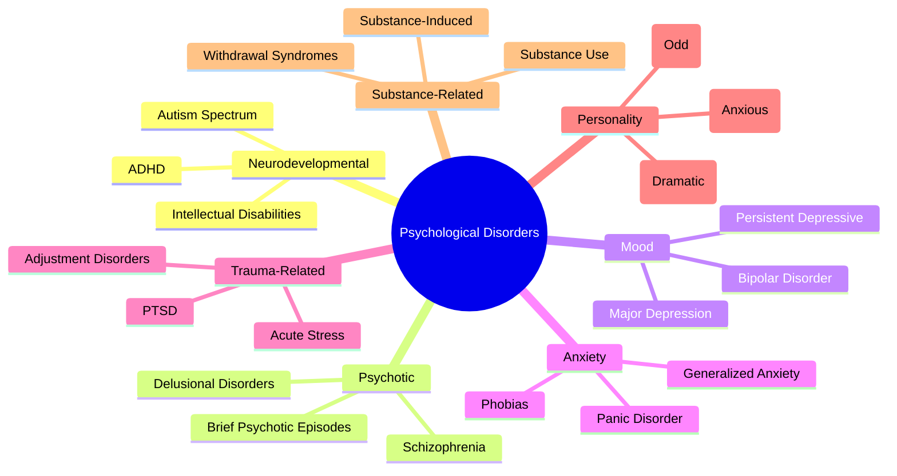
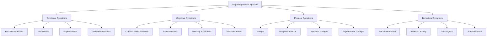
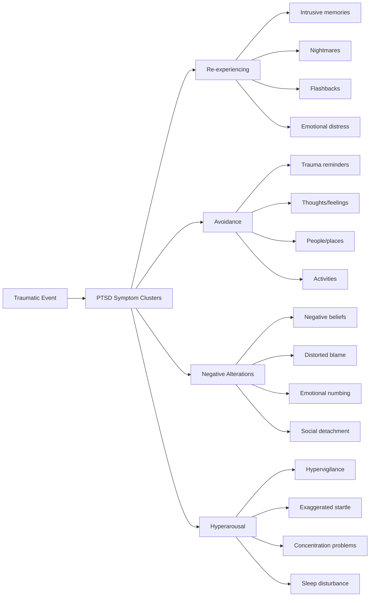

# Psychological Pathology and Individual Dysfunction

## Abstract

Psychological pathology represents systematic deviations from adaptive psychological functioning that create significant distress and impairment in individual lives. These disorders, ranging from personality disorders to mood and anxiety conditions, reflect underlying vulnerabilities in emotional regulation, cognitive processing, and interpersonal functioning. Understanding these pathologies reveals fundamental weaknesses in human psychological architecture that contribute to individual suffering and broader social dysfunction.

## Introduction

Human psychological functioning exists on a continuum from adaptive to severely impaired, with psychological disorders representing extreme deviations that cause clinically significant distress or functional impairment. These conditions affect approximately 25% of the global population annually, representing a massive burden of individual suffering and societal cost. Psychological pathology illuminates the fragility of human mental health and the multiple ways psychological systems can fail.

## Classification of Psychological Disorders

### DSM-5 Diagnostic Categories

The classification of psychological disorders reveals the breadth and complexity of human psychological dysfunction. This diagnostic framework illustrates how psychological pathology manifests across multiple domains of human functioning, from basic neurodevelopmental processes to complex personality patterns.



This diagnostic classification system reveals several crucial insights about human psychological vulnerability. Neurodevelopmental disorders represent fundamental alterations in brain development that create lifelong functional limitations, highlighting how early developmental disruptions can permanently alter psychological capacity. These conditions affect basic cognitive and social functions that form the foundation for all subsequent psychological development.

Psychotic disorders represent the most severe breakdown of reality testing and cognitive organization, demonstrating how human consciousness and perception can become fundamentally distorted. As psychiatrist Nancy Andreasen explains in "The Broken Brain," these conditions reveal the fragility of the neural systems that maintain coherent thought and perception.

Mood and anxiety disorders, the most common categories, reflect dysfunction in emotional regulation systems that evolved to respond to environmental threats and opportunities. Their high prevalence suggests that human emotional systems are poorly calibrated for modern environments, creating systematic vulnerabilities to depression and anxiety that affect nearly one-third of the population.

Trauma-related disorders demonstrate how psychological systems designed to process and recover from adverse experiences can become overwhelmed and dysregulated, creating lasting impairment. Personality disorders represent the most persistent and treatment-resistant conditions, reflecting fundamental alterations in character structure that resist change and create chronic interpersonal dysfunction.

### Prevalence and Burden Statistics

The epidemiological data on psychological disorders reveals the massive scale of human psychological dysfunction and its devastating impact on individual lives and society. This table demonstrates that psychological pathology is not a rare aberration but a common feature of human experience that affects hundreds of millions of people globally.

| Disorder Category | Lifetime Prevalence | Annual Prevalence | Disability-Adjusted Life Years | Economic Cost (US, Billions) |
|------------------|-------------------|------------------|------------------------------|------------------------------|
| **Anxiety Disorders** | 28.8% | 18.1% | 390 million | $42.3 |
| **Mood Disorders** | 20.8% | 9.5% | 251 million | $210.5 |
| **Personality Disorders** | 14.8% | 6.1% | 45 million | $15.7 |
| **Substance Use Disorders** | 14.6% | 3.9% | 61 million | $740.0 |
| **Psychotic Disorders** | 2.4% | 1.1% | 13.4 million | $155.7 |
| **Eating Disorders** | 1.4% | 0.6% | 3.3 million | $64.7 |

These prevalence statistics reveal several disturbing patterns about human psychological functioning. Nearly 30% of people will experience an anxiety disorder at some point in their lives, indicating that the human fear and threat-detection systems are systematically maladapted to modern environments. The 18.1% annual prevalence means that at any given time, nearly one in five people are struggling with clinically significant anxiety that impairs their functioning.

Mood disorders affect over 20% of the population lifetime, with major depression being one of the leading causes of disability worldwide. As psychiatrist Kay Redfield Jamison documents in "An Unquiet Mind," these conditions create profound suffering that extends far beyond the individual to affect families, relationships, and communities. The 251 million disability-adjusted life years lost to mood disorders represents an enormous burden of human suffering and lost potential.

The economic costs reveal the broader societal impact of psychological dysfunction. Substance use disorders, while affecting a smaller percentage of the population, create the highest economic burden at $740 billion annually, reflecting the cascading effects of addiction on healthcare, criminal justice, and productivity. The total economic burden of mental illness exceeds $1.2 trillion annually in the United States alone, representing approximately 5% of the entire economy.

The disability-adjusted life years metric captures both premature death and years lived with disability, revealing that psychological disorders create some of the highest disease burdens globally. Anxiety disorders alone account for 390 million years of healthy life lost, more than many major physical diseases, highlighting how psychological dysfunction creates pervasive and lasting impairment in human functioning.

## Personality Disorders: Fundamental Character Pathology

### Cluster A: Odd and Eccentric Disorders

Cluster A personality disorders represent fundamental distortions in social cognition and interpersonal functioning that create chronic isolation and occupational difficulties. These conditions reveal how human social psychology can become systematically distorted, leading to persistent patterns of dysfunction that resist change.

| Disorder | Core Features | Prevalence | Functional Impairment | Interpersonal Impact |
|----------|---------------|------------|----------------------|---------------------|
| **Paranoid PD** | Pervasive distrust and suspiciousness | 2.4% | Occupational difficulties | Relationship destruction |
| **Schizoid PD** | Detachment from social relationships | 3.1% | Social isolation | Emotional unavailability |
| **Schizotypal PD** | Acute discomfort in relationships, cognitive distortions | 3.9% | Severe social impairment | Bizarre behavior alienates others |

This analysis of Cluster A disorders reveals how social cognition can become fundamentally distorted, creating persistent patterns of interpersonal dysfunction. Paranoid personality disorder represents a systematic failure of trust mechanisms, where the individual's threat-detection system becomes hyperactivated and unable to distinguish between genuine and imagined threats. This creates a self-fulfilling prophecy where suspicious behavior elicits negative responses from others, confirming paranoid beliefs and perpetuating the cycle.

Schizoid personality disorder demonstrates how the human need for social connection can become completely suppressed, creating individuals who appear emotionally flat and uninterested in relationships. As personality researcher Theodore Millon explains in "Personality Disorders in Modern Life," this represents a fundamental alteration in the reward systems that normally motivate social behavior, creating chronic isolation that further impairs social skill development.

Schizotypal personality disorder shows how cognitive and perceptual processes can become distorted while maintaining basic reality testing. The combination of social anxiety, odd beliefs, and unusual perceptual experiences creates individuals who desperately want social connection but whose bizarre behavior consistently alienates others. This creates profound suffering as the individual experiences both intense loneliness and inability to form the relationships they crave.

### Cluster B: Dramatic and Emotional Disorders

Cluster B personality disorders represent the most destructive and socially harmful forms of personality pathology, characterized by emotional dysregulation, impulsivity, and exploitation of others. These conditions reveal how human emotional and social systems can become fundamentally distorted, creating individuals who cause significant harm to themselves and others.

| Disorder | Core Features | Prevalence | Manipulation Patterns | Societal Impact |
|----------|---------------|------------|----------------------|-----------------|
| **Antisocial PD** | Disregard for rights of others | 0.5-1.9% | Exploitation, aggression | Crime, violence, economic loss |
| **Borderline PD** | Instability in relationships, self-image, emotions | 1.4% | Emotional manipulation | Healthcare overutilization |
| **Histrionic PD** | Excessive emotionality and attention-seeking | 1.8% | Dramatic manipulation | Workplace disruption |
| **Narcissistic PD** | Grandiosity, need for admiration, lack of empathy | 6.2% | Exploitation of others | Leadership failures |

This analysis of Cluster B disorders reveals the most concerning aspects of human personality pathology—conditions that not only create suffering for the individual but systematically harm others and society. Antisocial personality disorder represents a complete breakdown of moral reasoning and empathy, creating individuals who view others as objects to be exploited rather than fellow human beings deserving of respect and consideration. As psychologist Robert Hare documents in "Without Conscience," these individuals can appear charming and competent while systematically destroying the lives of those around them.

Borderline personality disorder demonstrates how emotional regulation systems can become so dysregulated that individuals experience constant emotional chaos and engage in desperate, often destructive attempts to maintain relationships and self-esteem. The emotional manipulation patterns—including threats of self-harm, rage episodes, and idealization-devaluation cycles—create enormous stress for family members, romantic partners, and healthcare providers.

Narcissistic personality disorder, with its surprisingly high prevalence of 6.2%, reveals how self-esteem regulation can become fundamentally distorted, creating individuals who require constant admiration and validation while lacking empathy for others. As psychiatrist Otto Kernberg explains in "Borderline Conditions and Pathological Narcissism," this creates a paradox where individuals who appear supremely confident are actually desperately insecure and dependent on others for self-worth validation.

The societal impact of these disorders extends far beyond individual suffering. Antisocial personality disorder contributes significantly to crime, violence, and economic fraud. Narcissistic personality disorder creates leadership failures in business, politics, and other institutions where these individuals' grandiosity and lack of empathy lead to poor decision-making and exploitation of subordinates.

### Cluster C: Anxious and Fearful Disorders

Cluster C personality disorders represent chronic patterns of anxiety, fear, and avoidance that create significant functional limitations and interpersonal difficulties. These conditions reveal how human anxiety and dependency systems can become chronically dysregulated, creating persistent patterns of avoidance and dysfunction.

| Disorder | Core Features | Prevalence | Avoidance Patterns | Functional Limitations |
|----------|---------------|------------|-------------------|----------------------|
| **Avoidant PD** | Social inhibition, feelings of inadequacy | 2.4% | Social situations | Career limitations |
| **Dependent PD** | Excessive need to be taken care of | 0.7% | Decision-making | Relationship dysfunction |
| **Obsessive-Compulsive PD** | Preoccupation with orderliness, perfectionism | 7.9% | Flexibility, efficiency | Productivity paradox |

This analysis of Cluster C disorders reveals how anxiety and control systems can become chronically dysregulated, creating persistent patterns of avoidance and dysfunction that significantly limit life satisfaction and achievement. Avoidant personality disorder represents a systematic failure of social confidence where individuals desperately want relationships but are paralyzed by fear of rejection and criticism. This creates a tragic cycle where avoidance of social situations prevents the positive experiences needed to build social confidence.

Dependent personality disorder demonstrates how the human need for security and support can become pathologically exaggerated, creating individuals who cannot function independently and make excessive demands on others for care and decision-making. As attachment researcher John Bowlby explains in "Attachment and Loss," this often reflects early experiences of inconsistent or overwhelming caregiving that create lasting insecurity about one's ability to cope independently.

Obsessive-compulsive personality disorder, with its high prevalence of 7.9%, reveals how the human drive for order and control can become so extreme that it actually impairs rather than enhances functioning. The preoccupation with perfectionism and orderliness creates a "productivity paradox" where the individual's attempts to be maximally efficient actually reduce their effectiveness through excessive attention to minor details and inability to prioritize or delegate.

The functional limitations created by these disorders are particularly tragic because they often affect individuals who are highly motivated to succeed and contribute but are held back by their own psychological constraints. Career limitations from avoidant personality disorder prevent talented individuals from pursuing opportunities that require social interaction. The relationship dysfunction from dependent personality disorder creates burdens on partners and family members while preventing the individual from developing mature, reciprocal relationships.

## Mood Disorders: Emotional Regulation Failures

### Major Depressive Disorder

#### Symptom Clusters and Severity

Major depressive disorder represents a systematic breakdown of multiple psychological and physiological systems simultaneously, creating a cascade of dysfunction that affects every aspect of human functioning. This flowchart illustrates how depression creates interconnected symptoms across emotional, cognitive, physical, and behavioral domains.



This symptom cluster analysis reveals why depression is so devastating and difficult to treat—it simultaneously impairs the emotional, cognitive, physical, and behavioral systems needed for recovery. The emotional symptoms create a persistent negative emotional state that colors all experiences and makes it difficult to experience pleasure or hope. Anhedonia, the inability to experience pleasure, is particularly cruel because it removes the natural rewards that normally motivate behavior and recovery efforts.

The cognitive symptoms create a vicious cycle where depression impairs the very mental capacities needed to address the condition. Concentration problems and memory impairment make it difficult to engage effectively in therapy, follow treatment recommendations, or maintain employment. Indecisiveness paralyzes the individual when decisive action might be most helpful. As cognitive researcher Aaron Beck explains in "Cognitive Therapy of Depression," the negative cognitive triad—negative views of self, world, and future—becomes self-reinforcing and resistant to contradictory evidence.

Physical symptoms demonstrate how depression affects basic biological functions, creating fatigue that makes activity feel overwhelming, sleep disturbances that prevent restorative rest, and appetite changes that can lead to significant weight loss or gain. These physical symptoms often become the focus of medical attention while the underlying depression goes unrecognized and untreated.

Behavioral symptoms complete the cycle of dysfunction by reducing the activities and social connections that might provide natural antidepressant effects. Social withdrawal eliminates sources of support and positive feedback, while reduced activity decreases opportunities for mastery experiences and natural mood elevation. Self-neglect and substance use create additional problems that compound the original depression.

#### Depression Severity and Functional Impact

The relationship between depression severity and treatment outcomes reveals a disturbing pattern: the most severe cases, which cause the greatest suffering and functional impairment, are also the most resistant to treatment. This table demonstrates how depression severity creates a cruel paradox where those who need help most are least likely to benefit from available treatments.

| Severity Level | Symptom Count | Functional Impairment | Suicide Risk | Treatment Response |
|----------------|---------------|----------------------|--------------|-------------------|
| **Mild** | 5-6 symptoms | Minor impairment | Low | 60-70% response |
| **Moderate** | 7-8 symptoms | Significant impairment | Moderate | 50-60% response |
| **Severe** | 9+ symptoms | Major impairment | High | 30-40% response |
| **Psychotic** | 9+ plus psychosis | Severe impairment | Very high | 20-30% response |

This severity analysis reveals several troubling patterns about depression treatment. Mild depression, while causing distress, responds relatively well to treatment with 60-70% of individuals showing significant improvement. However, mild depression often goes unrecognized and untreated because the functional impairment is not severe enough to prompt help-seeking or clinical attention.

Moderate depression creates significant functional impairment that affects work performance, relationships, and daily activities, yet treatment response rates drop to 50-60%. This represents millions of individuals who experience substantial suffering and disability but have only a moderate chance of achieving remission with current treatments.

Severe depression, affecting individuals with 9 or more symptoms and major functional impairment, shows treatment response rates of only 30-40%. These individuals often cannot work, maintain relationships, or care for themselves adequately, yet they are least likely to benefit from available treatments. The high suicide risk in this group creates urgent treatment needs that current approaches often cannot meet.

Psychotic depression, the most severe form, combines the symptoms of major depression with delusions or hallucinations, creating profound impairment and very high suicide risk. Treatment response rates of only 20-30% mean that the majority of individuals with this devastating condition will not achieve remission with first-line treatments, often requiring multiple medication trials, electroconvulsive therapy, or long-term hospitalization.

### Bipolar Disorder

#### Mood Episode Characteristics

| Episode Type | Duration | Key Features | Functional Impact | Hospitalization Risk |
|--------------|----------|--------------|------------------|---------------------|
| **Manic** | ≥1 week | Elevated mood, grandiosity, decreased sleep | Severe impairment | 75% |
| **Hypomanic** | ≥4 days | Elevated mood, increased activity | Mild impairment | 5% |
| **Mixed** | ≥1 week | Simultaneous manic and depressive features | Severe impairment | 85% |
| **Depressive** | ≥2 weeks | Persistent sadness, anhedonia | Moderate-severe | 25% |

## Anxiety Disorders: Fear System Dysfunction

### Anxiety Disorder Spectrum

| Disorder | Core Fear | Avoidance Pattern | Physical Symptoms | Cognitive Distortions |
|----------|-----------|------------------|------------------|----------------------|
| **Generalized Anxiety** | Multiple life domains | Worry and rumination | Muscle tension, fatigue | Catastrophizing |
| **Panic Disorder** | Panic attacks | Situations triggering panic | Heart palpitations, sweating | Fear of losing control |
| **Social Anxiety** | Social evaluation | Social situations | Blushing, trembling | Mind reading, fortune telling |
| **Specific Phobias** | Specific objects/situations | Phobic stimuli | Immediate fear response | Overestimation of danger |
| **Agoraphobia** | Being trapped/helpless | Open spaces, crowds | Dizziness, nausea | Escape route preoccupation |

### Anxiety Disorder Comorbidity Matrix

| Primary Disorder | Depression | Substance Use | Other Anxiety | Personality Disorders |
|------------------|------------|---------------|---------------|----------------------|
| **GAD** | 62% | 38% | 56% | 35% |
| **Panic Disorder** | 55% | 43% | 83% | 47% |
| **Social Anxiety** | 41% | 48% | 76% | 52% |
| **Specific Phobia** | 31% | 22% | 75% | 28% |
| **Agoraphobia** | 48% | 37% | 84% | 41% |

## Trauma-Related Disorders

### Post-Traumatic Stress Disorder (PTSD)

#### Symptom Clusters



#### Trauma Types and PTSD Risk

| Trauma Type | PTSD Risk | Chronicity | Comorbidity Rate | Recovery Timeline |
|-------------|-----------|------------|------------------|-------------------|
| **Combat** | 13.8% | High | 88% | 2-5 years |
| **Sexual Assault** | 19.0% | High | 92% | 3-7 years |
| **Physical Assault** | 8.1% | Moderate | 76% | 1-3 years |
| **Accidents** | 2.3% | Low | 54% | 6 months-2 years |
| **Natural Disasters** | 4.0% | Low | 62% | 6 months-1 year |
| **Childhood Abuse** | 36.3% | Very high | 95% | Lifelong |

## Cognitive Distortions Across Disorders

### Common Cognitive Distortion Patterns

| Distortion Type | Definition | Depression Example | Anxiety Example | Personality Disorder Example |
|-----------------|------------|-------------------|-----------------|------------------------------|
| **All-or-Nothing** | Extreme black-white thinking | "I'm a complete failure" | "This will be a disaster" | "People are either for me or against me" |
| **Overgeneralization** | Single event → universal pattern | "I never do anything right" | "I always embarrass myself" | "Everyone abandons me" |
| **Mental Filter** | Focus only on negatives | Ignore compliments, focus on criticism | Notice only threatening cues | Remember only rejections |
| **Catastrophizing** | Assume worst-case scenarios | "This mistake will ruin my career" | "I'm having a heart attack" | "They'll destroy me if they find out" |
| **Mind Reading** | Assume others' thoughts | "They think I'm pathetic" | "They can see I'm nervous" | "They're plotting against me" |
| **Emotional Reasoning** | Feelings = facts | "I feel worthless, so I am" | "I feel danger, so it's dangerous" | "I feel betrayed, so they betrayed me" |

### Cognitive Distortion Severity by Disorder

```mermaid
heatmap
    title Cognitive Distortion Severity Across Disorders
    
    x-axis [Depression, Anxiety, Borderline PD, Paranoid PD, Narcissistic PD]
    y-axis [All-or-Nothing, Catastrophizing, Mind Reading, Personalization, Emotional Reasoning]
    
    Depression: [9, 8, 6, 9, 8]
    Anxiety: [7, 9, 8, 7, 7]
    Borderline PD: [9, 8, 9, 8, 9]
    Paranoid PD: [8, 7, 9, 6, 7]
    Narcissistic PD: [8, 6, 7, 9, 8]
```

## Treatment Outcomes and Limitations

### Evidence-Based Treatment Effectiveness

| Disorder Category | First-Line Treatment | Response Rate | Remission Rate | Relapse Rate | Treatment Duration |
|------------------|---------------------|---------------|----------------|--------------|-------------------|
| **Major Depression** | CBT + Antidepressants | 65% | 45% | 50% | 6-12 months |
| **Anxiety Disorders** | CBT + Exposure | 75% | 55% | 30% | 3-6 months |
| **PTSD** | Trauma-Focused CBT | 60% | 40% | 35% | 6-12 months |
| **Bipolar Disorder** | Mood Stabilizers + Therapy | 50% | 30% | 70% | Lifelong |
| **Personality Disorders** | DBT/Schema Therapy | 40% | 25% | 60% | 1-3 years |
| **Substance Use** | CBT + Medication | 45% | 25% | 80% | 6 months-lifelong |

### Treatment Resistance Factors

| Factor Category | Specific Factors | Impact on Outcome | Prevalence | Intervention Strategies |
|-----------------|------------------|------------------|------------|------------------------|
| **Biological** | Genetic vulnerability, neurochemical imbalances | High | 40-60% | Pharmacogenomics, combination therapy |
| **Psychological** | Cognitive rigidity, poor insight | Moderate | 30-50% | Motivational interviewing, metacognitive therapy |
| **Social** | Lack of support, ongoing stressors | High | 50-70% | Family therapy, social skills training |
| **Systemic** | Access barriers, stigma | Moderate | 60-80% | Integrated care, anti-stigma campaigns |

## Case Study Examples

These detailed case studies illustrate the complex, chronic nature of psychological pathology and the challenges inherent in treatment. They demonstrate how multiple disorders often co-occur, creating compound dysfunction that exceeds the sum of individual diagnoses.

### Case 1: Treatment-Resistant Depression with Comorbid Anxiety

**Background**: 34-year-old professional with 15-year history of recurrent major depression and generalized anxiety disorder.

This case exemplifies the treatment-resistant depression that affects approximately 30-40% of individuals with major depressive disorder. The 15-year duration illustrates the chronic, recurring nature of mood disorders that can persist despite extensive treatment efforts. The comorbidity with generalized anxiety disorder is typical—anxiety and depression co-occur in over 60% of cases, creating compound dysfunction that is more severe and treatment-resistant than either condition alone.

**Symptom Profile**:
- Persistent depressed mood despite multiple medication trials
- Excessive worry about work performance and relationships
- Social withdrawal and occupational impairment
- Suicidal ideation during severe episodes

The symptom profile demonstrates how depression and anxiety create mutually reinforcing cycles of dysfunction. Persistent depressed mood undermines the motivation and energy needed to address anxiety-provoking situations, while excessive worry about performance and relationships creates additional stress that deepens depression. Social withdrawal eliminates sources of support and positive feedback that might naturally alleviate symptoms, while occupational impairment creates financial stress and identity threats that worsen both conditions.

The presence of suicidal ideation during severe episodes reflects the most dangerous aspect of treatment-resistant depression. As psychiatrist Kay Redfield Jamison documents in "Night Falls Fast," suicide risk increases dramatically when depression is combined with anxiety, hopelessness, and social isolation. The episodic nature of suicidal ideation creates ongoing risk that requires constant vigilance and crisis planning.

**Treatment History**:
- 8 different antidepressant medications with minimal response
- 3 courses of cognitive-behavioral therapy with temporary improvement
- 2 psychiatric hospitalizations for suicidal ideation
- Current treatment: combination therapy with partial response

This treatment history illustrates the trial-and-error nature of psychiatric treatment and the limitations of current therapeutic approaches. The failure of 8 different antidepressant medications reflects the reality that approximately 30% of individuals with depression do not respond adequately to first-line treatments. Each medication trial typically requires 6-8 weeks to assess effectiveness, meaning this individual spent years cycling through treatments with minimal benefit.

The temporary improvement with cognitive-behavioral therapy followed by relapse is typical of treatment-resistant cases. While CBT is highly effective for many individuals with depression and anxiety, those with severe, chronic conditions often experience only partial or temporary benefits. The need for psychiatric hospitalization indicates the severity of suicidal risk and the failure of outpatient treatments to provide adequate safety.

**Outcome**: Chronic, treatment-resistant course with significant functional impairment and ongoing suicide risk.

This outcome represents the reality for millions of individuals with severe mental illness—chronic suffering despite extensive treatment efforts. The ongoing functional impairment affects every aspect of life, from work performance to relationships to basic self-care. The persistent suicide risk requires ongoing monitoring and crisis intervention, creating enormous stress for both the individual and their support system.

### Case 2: Borderline Personality Disorder with Self-Harm

**Background**: 28-year-old with childhood trauma history and pattern of unstable relationships.

This case illustrates the complex relationship between childhood trauma and adult personality pathology. Borderline personality disorder develops in approximately 75% of individuals with histories of childhood sexual abuse, physical abuse, or severe neglect. The pattern of unstable relationships reflects the core feature of borderline personality disorder—an inability to maintain consistent, healthy interpersonal connections due to fears of abandonment and emotional dysregulation.

**Symptom Profile**:
- Intense fear of abandonment leading to frantic efforts to avoid real or imagined abandonment
- Pattern of unstable and intense interpersonal relationships
- Identity disturbance and chronic feelings of emptiness
- Recurrent suicidal behavior and self-mutilation
- Affective instability and inappropriate intense anger

This symptom profile demonstrates the pervasive nature of borderline personality disorder, affecting emotional regulation, interpersonal relationships, self-concept, and behavioral control simultaneously. The intense fear of abandonment creates a paradox where efforts to prevent abandonment—such as clinging behavior, threats of self-harm, or rage episodes—actually drive others away, confirming the individual's worst fears and perpetuating the cycle.

The pattern of unstable and intense relationships reflects the "splitting" defense mechanism characteristic of borderline personality disorder, where others are viewed as either all-good or all-bad with rapid shifts between idealization and devaluation. This creates exhausting relationships that few people can sustain long-term.

Identity disturbance and chronic feelings of emptiness reflect the core self-pathology in borderline personality disorder. As psychoanalyst Otto Kernberg explains in "Borderline Conditions and Pathological Narcissism," individuals with borderline personality disorder lack a stable, integrated sense of self, leading to chronic feelings of emptiness and desperate attempts to fill this void through relationships, substances, or self-destructive behaviors.

Recurrent suicidal behavior and self-mutilation serve multiple functions—emotional regulation, communication of distress, punishment of self or others, and attempts to feel something when experiencing emotional numbness. The self-harm behaviors often become addictive, providing temporary relief from emotional pain but creating additional problems and risks.

**Treatment History**:
- Multiple emergency department visits for self-harm
- 18-month dialectical behavior therapy program
- Gradual reduction in self-harm behaviors
- Improved emotional regulation skills

This treatment history illustrates both the challenges and potential for improvement in borderline personality disorder. The multiple emergency department visits reflect the crisis-driven nature of this condition and the enormous burden it places on healthcare systems. Emergency departments are poorly equipped to address the underlying emotional dysregulation that drives self-harm behaviors, often providing only temporary crisis stabilization.

The 18-month dialectical behavior therapy (DBT) program represents the gold standard treatment for borderline personality disorder, developed specifically by Marsha Linehan for this population. DBT combines individual therapy, group skills training, phone coaching, and therapist consultation to address the multiple deficits characteristic of borderline personality disorder. The lengthy duration reflects the time needed to develop new emotional regulation skills and change deeply ingrained patterns of thinking and behavior.

**Outcome**: Significant improvement in self-harm and emotional regulation, but ongoing interpersonal difficulties.

This outcome illustrates the realistic expectations for borderline personality disorder treatment—significant improvement is possible, but complete recovery is rare. The reduction in self-harm behaviors and improved emotional regulation represent major achievements that can dramatically improve quality of life and reduce suicide risk. However, the ongoing interpersonal difficulties reflect the persistent challenges in maintaining stable relationships that characterize this condition.

The partial nature of improvement in personality disorders reflects their fundamental character—these are pervasive patterns of thinking, feeling, and behaving that develop early in life and become deeply ingrained. While significant improvement is possible with intensive treatment, complete personality transformation is unrealistic. The goal becomes managing symptoms, improving functioning, and reducing harm rather than eliminating all pathology.

## Societal Impact and Burden

The societal impact of psychological pathology extends far beyond individual suffering to create massive economic costs, healthcare system strain, and social dysfunction. These disorders represent one of the leading causes of disability worldwide and create cascading effects throughout society.

### Economic Costs of Mental Illness

The economic burden of mental illness reveals the staggering societal cost of psychological pathology. These figures represent only the measurable costs and significantly underestimate the true impact on human welfare and social functioning.

| Cost Category | Annual US Cost (Billions) | Per Capita Cost | Percentage of Healthcare Spending |
|---------------|---------------------------|-----------------|----------------------------------|
| **Direct Medical** | $201.1 | $634 | 5.6% |
| **Indirect Costs** | $193.2 | $609 | - |
| **Criminal Justice** | $8.4 | $26 | - |
| **Social Services** | $37.9 | $119 | - |
| **Total** | $440.6 | $1,388 | - |

This economic analysis reveals the enormous financial burden that psychological pathology imposes on society. Direct medical costs of $201.1 billion represent only the tip of the iceberg—the money spent on psychiatric treatment, medications, hospitalizations, and emergency department visits. The per capita cost of $634 means that every person in the United States effectively pays over $600 annually for the direct medical treatment of mental illness, whether through taxes, insurance premiums, or out-of-pocket expenses.

Indirect costs of $193.2 billion capture the lost productivity, absenteeism, and reduced work capacity caused by mental illness. This figure represents the economic output that society loses when individuals with psychological disorders cannot work at full capacity or cannot work at all. As economist Ronald Kessler's research demonstrates, mental illness is one of the leading causes of work disability, often affecting individuals during their most productive years.

The criminal justice costs of $8.4 billion reflect the high rates of mental illness in incarcerated populations and the use of jails and prisons as de facto mental health facilities. Approximately 40% of individuals in jails and prisons have a history of mental illness, often because community mental health services are inadequate or inaccessible. This criminalization of mental illness creates additional trauma and stigma while failing to address underlying psychological problems.

Social services costs of $37.9 billion include disability payments, housing assistance, and other support services for individuals whose mental illness prevents them from achieving economic self-sufficiency. These costs reflect both the humanitarian response to mental illness and the long-term financial burden when psychological disorders become chronic and disabling.

The total annual cost of $440.6 billion represents approximately 2.5% of the entire US economy, making mental illness one of the most expensive health conditions. The per capita cost of $1,388 means that mental illness costs every American nearly $1,400 annually in direct and indirect costs, highlighting the universal impact of psychological pathology on society.

### Disability and Functional Impairment

```mermaid
bar
    title "Years Lived with Disability by Mental Health Condition"
    x-axis [Depression, Anxiety, Bipolar, Schizophrenia, Personality Disorders, Substance Use]
    y-axis "Millions of Years" 0 --> 80
    
    Depression: 76.3
    Anxiety: 62.4
    Bipolar: 14.2
    Schizophrenia: 13.4
    Personality Disorders: 8.7
    Substance Use: 27.1
```

## Implications for Human Dysfunction

### Individual Level Consequences

1. **Chronic Suffering**: Persistent psychological pain and reduced quality of life
2. **Functional Impairment**: Difficulties in work, relationships, and daily activities
3. **Reduced Life Expectancy**: Increased mortality from suicide, medical complications, and risky behaviors
4. **Intergenerational Transmission**: Genetic and environmental transmission to offspring

### Interpersonal Level Consequences

1. **Relationship Destruction**: Personality disorders and mood disorders damage intimate relationships
2. **Family Burden**: Caregiving stress and emotional toll on family members
3. **Social Isolation**: Stigma and symptoms lead to social withdrawal and loneliness
4. **Workplace Dysfunction**: Absenteeism, reduced productivity, and interpersonal conflicts

### Societal Level Consequences

1. **Healthcare System Strain**: High utilization of emergency and inpatient services
2. **Economic Burden**: Lost productivity, disability payments, and treatment costs
3. **Criminal Justice Involvement**: High rates of mental illness in incarcerated populations
4. **Social Inequality**: Mental illness both causes and results from social disadvantage

## Theoretical Integration

### Biopsychosocial Model

Mental disorders result from complex interactions between:
- **Biological factors**: Genetics, neurobiology, medical conditions
- **Psychological factors**: Cognitive patterns, personality traits, coping skills
- **Social factors**: Relationships, culture, socioeconomic status, trauma

### Diathesis-Stress Model

Psychological disorders emerge when:
- **Diathesis**: Underlying vulnerability (genetic, psychological, or social)
- **Stress**: Environmental triggers or life events
- **Interaction**: Vulnerability + stress exceeds coping resources

### Developmental Psychopathology

Mental disorders reflect:
- **Developmental trajectories**: Normal vs. abnormal developmental pathways
- **Critical periods**: Times of heightened vulnerability or opportunity
- **Equifinality**: Multiple pathways to same disorder
- **Multifinality**: Same risk factor leads to different outcomes

## Conclusion

Psychological pathology represents systematic failures in human psychological functioning that create immense individual suffering and societal burden. These disorders reveal fundamental vulnerabilities in emotional regulation, cognitive processing, and interpersonal functioning that affect a substantial portion of the population. The chronic nature, treatment resistance, and high relapse rates of many psychological disorders highlight the limitations of current therapeutic approaches and the need for more effective prevention and intervention strategies.

The prevalence and persistence of psychological pathology across cultures and historical periods suggest these represent inherent weaknesses in human psychological architecture rather than merely correctable problems. Understanding these limitations is crucial for developing realistic expectations about human psychological functioning and designing social systems that account for rather than ignore psychological vulnerability.

## References

1. American Psychiatric Association. (2013). *Diagnostic and Statistical Manual of Mental Disorders* (5th ed.). American Psychiatric Publishing.
2. Kessler, R. C., et al. (2005). Lifetime prevalence and age-of-onset distributions of DSM-IV disorders in the National Comorbidity Survey Replication. *Archives of General Psychiatry*, 62(6), 593-602.
3. Greenberg, P. E., et al. (2015). The economic burden of adults with major depressive disorder in the United States (2005 and 2010). *Journal of Clinical Psychiatry*, 76(2), 155-162.
4. Paris, J. (2020). *Personality Disorders Over Time: Precursors, Course, and Outcome*. American Psychiatric Publishing.
5. Barlow, D. H., & Durand, V. M. (2015). *Abnormal Psychology: An Integrative Approach* (7th ed.). Cengage Learning.

---

*See also: [Cognitive Architecture](../individual/cognitive-architecture.md) | [Neurobiological Constraints](../individual/neurobiological-constraints.md) | [Individual Psychology Overview](../individual/README.md)*