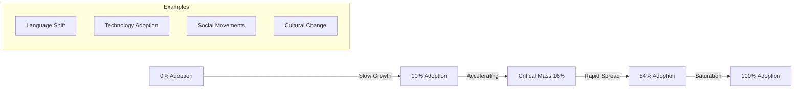
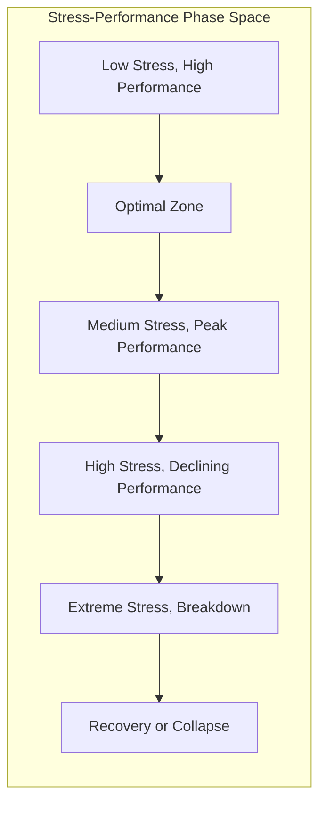
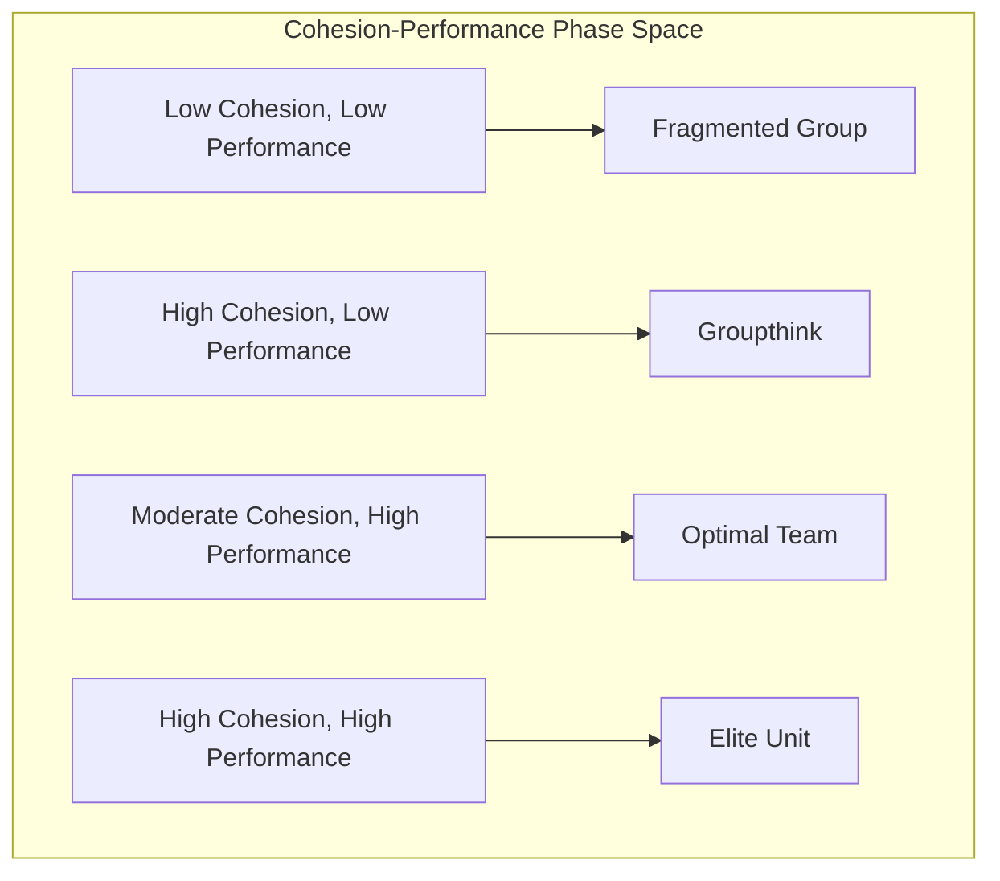
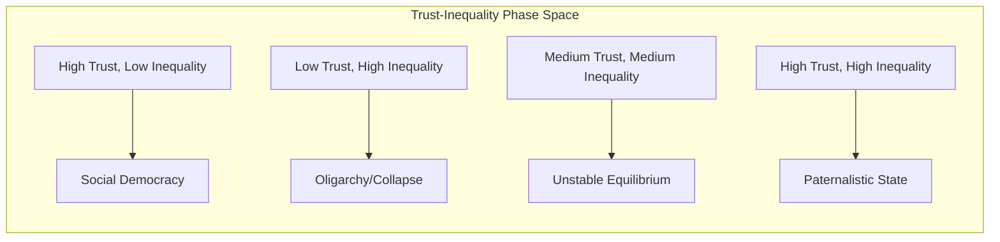
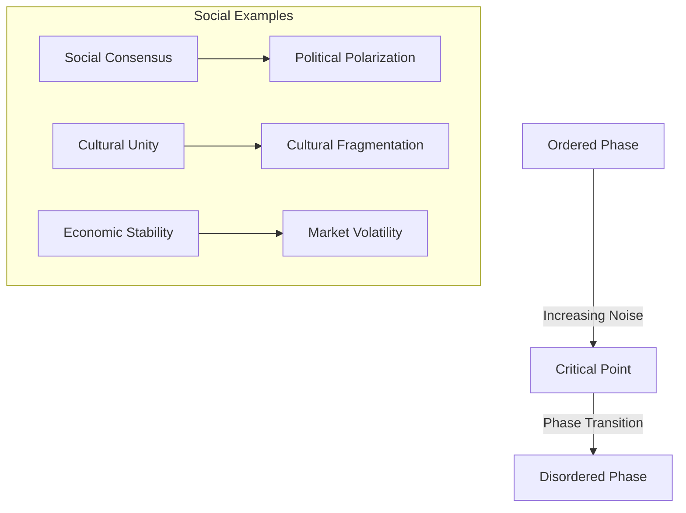

# Complexity Science Applications to Human Systems

**Discipline:** Complexity Science, Mathematical Biology, Network Theory  
**Level:** Cross-Level Integration  
**Keywords:** nonlinear dynamics, phase transitions, attractors, network theory, self-organization, criticality  
**Related Documents:** Systems Theory, Individual Psychology, Group Dynamics, Societal Systems

## Abstract

Complexity science provides mathematical and computational tools for understanding human social systems as complex adaptive networks exhibiting nonlinear dynamics, phase transitions, and emergent behaviors. This document applies concepts from dynamical systems theory, network science, and statistical physics to analyze human dysfunction across scales. By modeling social systems as networks of interacting agents operating near critical points, we reveal how small perturbations can trigger large-scale behavioral changes, how information and influence propagate through social networks, and how collective behaviors emerge from individual interactions. The analysis demonstrates that many human problems represent natural consequences of complex system dynamics rather than failures of individual rationality or institutional design.

## Introduction

Complexity science emerged from the recognition that many natural and social phenomena cannot be understood through traditional reductionist approaches. Instead of focusing on individual components, complexity science examines how simple rules governing local interactions can give rise to complex global behaviors. This perspective has proven particularly valuable for understanding social systems, which exhibit many hallmarks of complex systems: nonlinear responses, emergent properties, self-organization, and sensitivity to initial conditions.

Human social systems operate as complex adaptive networks where individuals serve as nodes connected by relationships, information flows, and influence patterns. These networks exhibit dynamics that cannot be predicted from knowledge of individual psychology alone. Instead, collective behaviors emerge from the interaction of many individuals following relatively simple behavioral rules within network structures that constrain and channel their interactions.

The application of complexity science to human problems reveals that dysfunction often represents natural consequences of complex system dynamics rather than pathological deviations from normal behavior. Understanding these dynamics provides insights into why human problems persist despite individual intelligence and good intentions, and suggests new approaches for intervention and system design.

## Theoretical Framework

### Dynamical Systems Theory

Human social systems can be modeled as dynamical systems where the state of the system evolves over time according to mathematical rules. Key concepts include:

**State Space**: The set of all possible states of the system
- Individual level: Psychological states, beliefs, behaviors
- Group level: Social norms, collective opinions, group cohesion
- Societal level: Cultural values, institutional arrangements, economic conditions

**Attractors**: Stable states toward which the system tends to evolve
- **Point Attractors**: Single stable states (social consensus, institutional equilibrium)
- **Limit Cycles**: Periodic behaviors (business cycles, political cycles)
- **Strange Attractors**: Chaotic but bounded behaviors (complex social dynamics)

**Phase Transitions**: Sudden changes in system behavior
- **First-order transitions**: Abrupt changes with hysteresis (revolution, social collapse)
- **Second-order transitions**: Gradual changes at critical points (cultural shifts)
- **Percolation transitions**: Threshold effects in network connectivity (social movements)

### Network Theory

Social systems are fundamentally networks of relationships and interactions, and the structure of these networks profoundly influences system dynamics and dysfunction patterns. Understanding network properties helps explain how individual behaviors aggregate into collective phenomena and why certain types of problems persist or spread through social systems.

| Network Property | Social Manifestation | Dysfunction Implications |
|------------------|---------------------|-------------------------|
| **Degree Distribution** | Number of social connections per person | Inequality in social capital and influence |
| **Clustering** | Tendency to form tight-knit groups | Echo chambers and polarization |
| **Path Length** | Steps between any two individuals | Speed of information and contagion spread |
| **Centrality** | Importance of specific nodes | Concentration of power and influence |
| **Community Structure** | Distinct social groups | Fragmentation and intergroup conflict |
| **Robustness** | Resilience to node/link removal | Vulnerability to targeted attacks |

**Degree Distribution** refers to how social connections are distributed across a population. In most social networks, this distribution is highly unequal—a few individuals have many connections while most have relatively few. This creates inequality in social capital and influence, where well-connected individuals have disproportionate access to information, opportunities, and power. The dysfunction implications include the perpetuation of existing inequalities and the concentration of influence in the hands of network hubs.

**Clustering** measures the tendency for people to form tight-knit groups where everyone knows everyone else. While clustering can provide social support and trust, it also creates echo chambers where similar people reinforce each other's beliefs and attitudes. This leads to polarization as different clusters develop increasingly divergent views with little cross-cutting exposure to alternative perspectives. The result is social fragmentation and reduced capacity for collective problem-solving.

**Path Length** indicates how many steps it takes to connect any two individuals in the network through chains of relationships. Short path lengths enable rapid spread of information, behaviors, and contagions throughout the system. While this can facilitate beneficial coordination and learning, it also means that harmful phenomena like misinformation, panic, or destructive behaviors can spread quickly across large populations before corrective mechanisms can respond.

**Centrality** measures the importance of specific individuals or positions within the network structure. High-centrality nodes often become bottlenecks for information flow and decision-making, creating concentration of power and influence. This can lead to system vulnerabilities when central nodes fail or become corrupted, and it can perpetuate inequality by giving some individuals disproportionate control over network resources and opportunities.

**Community Structure** refers to the presence of distinct groups or clusters within the larger network. While communities can provide identity and belonging, they can also create fragmentation and intergroup conflict when different communities develop competing interests or incompatible worldviews. Strong community boundaries can impede system-wide coordination and create us-versus-them dynamics that undermine collective action.

**Robustness** measures how well the network maintains its functionality when nodes or links are removed. Social networks often show resilience to random failures but vulnerability to targeted attacks on high-centrality nodes. This creates security risks where adversaries can disrupt social systems by targeting key individuals or relationships, and it means that the loss of influential leaders or institutions can have disproportionate system-wide effects.

### Statistical Physics Approaches

Concepts from statistical physics provide tools for understanding collective behavior:

**Phase Transitions in Social Systems**:
- **Order Parameters**: Measures of collective organization (consensus, polarization)
- **Control Parameters**: External factors that drive transitions (temperature, pressure → social stress, information flow)
- **Critical Points**: Parameter values where small changes trigger large effects
- **Universality**: Similar behaviors across different systems near critical points

**Ising Model Applications**:
The Ising model from physics can represent social influence and opinion dynamics:
- Individuals have binary states (opinions, behaviors)
- Neighbors influence each other's states
- Temperature represents noise or randomness
- Magnetic field represents external influence or bias

## Analysis

### Nonlinear Dynamics in Human Systems

Human social systems exhibit nonlinear responses where small inputs can produce disproportionately large outputs. This nonlinearity arises from several mechanisms:

#### Threshold Effects
Many social phenomena exhibit threshold behaviors where nothing happens until a critical point is reached:



**Mathematical Model**: 
For adoption processes, the rate of change often follows:
```
dN/dt = rN(K-N)/K
```
Where N is number of adopters, r is growth rate, K is carrying capacity.

#### Feedback Amplification
Positive feedback loops can amplify small initial differences:

**Rich-Get-Richer Dynamics** (Preferential Attachment):
- Probability of gaining new connections ∝ current number of connections
- Leads to power-law distributions in social networks
- Creates extreme inequality in social capital and influence

**Information Cascades**:
- Early adopters influence later decisions
- Can lead to suboptimal collective outcomes
- Mathematical model: P(adopt) = f(private signal, observed actions)

#### Network Effects
Network structure creates nonlinear responses to interventions:

**Percolation Phenomena**:
- Random network: Giant component emerges suddenly at critical density
- Social networks: Information/influence spreads when connectivity exceeds threshold
- Critical probability: p_c ≈ 1/⟨k⟩ for random networks

### Phase Space Analysis of Social Dynamics

Social systems can be analyzed using phase space representations where each dimension represents a system variable:

#### Individual-Level Phase Space


**Attractor Types**:
- **Healthy Functioning**: Stable point attractor in optimal performance zone
- **Chronic Stress**: Limit cycle between stress and exhaustion
- **Mental Health Crisis**: Chaotic attractor with unpredictable behavior
- **Breakdown**: Absorbing state requiring external intervention

#### Group-Level Phase Space


**Trajectory Analysis**:
- Groups typically start in low cohesion/low performance state
- Development paths depend on leadership, external pressure, task structure
- Optimal trajectory: gradual cohesion building with performance feedback
- Pathological trajectories: premature cohesion → groupthink, or fragmentation under stress

#### Societal-Level Phase Space


### Network Dynamics and Contagion Processes

Social networks serve as substrates for the spread of information, behaviors, and dysfunction:

#### Epidemic Models on Networks
Social contagion follows similar mathematics to disease epidemics:

**SIR Model for Social Phenomena**:
- **S**: Susceptible (not yet adopted behavior/belief)
- **I**: Infected (actively spreading behavior/belief)  
- **R**: Recovered/Removed (no longer spreading)

**Basic Reproduction Number**: R₀ = βτ⟨k⟩/γ
- β: transmission probability per contact
- τ: contact rate
- ⟨k⟩: average degree (connections per person)
- γ: recovery rate

**Threshold for Epidemic**: R₀ > 1

#### Complex Contagion
Unlike simple contagion (disease), social phenomena often require multiple exposures:

**Threshold Models**:
- Individual adopts when fraction of neighbors exceeds personal threshold
- Creates different spreading dynamics than simple contagion
- Requires higher network connectivity for spread
- Can exhibit sudden, discontinuous phase transitions

**Applications**:
- Social movements: Need critical mass of participants
- Technology adoption: Requires network effects
- Cultural change: Needs social reinforcement
- Collective action: Requires coordination

#### Network Structure Effects

Different network structures produce fundamentally different dynamics in how information, behaviors, and dysfunctions spread through social systems. Understanding these structural effects is crucial for predicting system behavior and designing interventions.

| Network Type | Structure | Contagion Properties | Dysfunction Patterns |
|--------------|-----------|---------------------|---------------------|
| **Random** | Poisson degree distribution | Fast global spread | Uniform vulnerability |
| **Scale-Free** | Power-law degree distribution | Hub-mediated spread | Targeted attacks effective |
| **Small-World** | High clustering, short paths | Local clustering + global reach | Echo chambers + rapid spread |
| **Modular** | Distinct communities | Slow inter-community spread | Fragmentation and polarization |

**Random Networks** have a Poisson degree distribution where most nodes have approximately the same number of connections, with random variation around the average. In these networks, contagion spreads relatively uniformly and predictably throughout the system. The dysfunction pattern is uniform vulnerability—all parts of the network are equally susceptible to problems, and there are no particularly critical nodes whose failure would disproportionately damage the system. While this provides resilience against targeted attacks, it also means that beneficial interventions have no leverage points for maximum impact.

**Scale-Free Networks** exhibit power-law degree distributions where a few nodes (hubs) have many connections while most nodes have few connections. This structure creates hub-mediated spread patterns where contagion typically spreads from hubs to their many connections, then from those connections to other parts of the network. The dysfunction pattern involves high effectiveness of targeted attacks—removing or corrupting a few key hubs can severely damage the entire network. However, this structure also provides opportunities for beneficial interventions by focusing on influential hubs.

**Small-World Networks** combine high clustering (local groups where everyone knows everyone) with short path lengths (few degrees of separation between any two nodes). This creates a unique combination of local clustering effects and global reach. Information and behaviors can spread rapidly across the entire network while also being reinforced within local clusters. The dysfunction pattern involves echo chambers (local reinforcement of beliefs) combined with rapid spread of both beneficial and harmful phenomena across the entire system.

**Modular Networks** consist of distinct communities with dense internal connections but sparse connections between communities. This structure creates slow inter-community spread where contagion spreads quickly within communities but slowly between them. The dysfunction pattern involves fragmentation and polarization, where different communities can develop very different beliefs, behaviors, and norms with little cross-community influence. This can lead to system-wide coordination failures and intergroup conflict, but it also provides some protection against system-wide contagion of harmful phenomena.

### Self-Organization and Emergence

Human social systems exhibit spontaneous organization without central control:

#### Spontaneous Order Formation
**Examples of Social Self-Organization**:
- Market prices emerging from individual transactions
- Language evolution through distributed usage
- Social norms arising from repeated interactions
- Urban structure developing from individual location choices

**Mathematical Models**:
- **Agent-Based Models**: Individual agents following simple rules
- **Cellular Automata**: Local interactions on spatial grids
- **Game Theory**: Strategic interactions between rational agents
- **Evolutionary Dynamics**: Selection and mutation of strategies/behaviors

#### Critical Phenomena
Many social systems operate near critical points where small changes can trigger large-scale reorganization:

**Self-Organized Criticality**:
- Systems naturally evolve toward critical states
- Exhibit power-law distributions of event sizes
- Examples: wealth distribution, city sizes, conflict intensities

**Sandpile Model Analogy**:
- Grains of sand added randomly to pile
- Avalanches occur when local slope exceeds threshold
- System maintains itself at critical angle of repose
- Social analog: tensions build until crisis triggers reorganization

#### Phase Transitions in Social Systems

**Order-Disorder Transitions**:


**Control Parameters**:
- **Temperature**: Level of noise, randomness, or conflict
- **External Field**: Influence of media, leadership, or external pressure
- **Connectivity**: Density of social interactions and relationships

## Cross-Level Connections

Complexity science reveals how dynamics at different scales interact and influence each other:

### Scale-Free Phenomena
Many social phenomena exhibit similar patterns across scales:
- **Power Laws**: Same mathematical form at individual, group, and societal levels
- **Fractal Structure**: Self-similar patterns at different scales
- **Universality**: Similar behaviors near critical points regardless of system details

### Multi-Scale Modeling
Understanding human systems requires models that capture dynamics at multiple scales:

**Hierarchical Networks**:
- Individuals embedded in groups
- Groups embedded in organizations
- Organizations embedded in societies
- Cross-scale interactions and feedback

**Temporal Scales**:
- Fast dynamics: Individual decisions, daily interactions
- Medium dynamics: Group formation, norm establishment
- Slow dynamics: Cultural evolution, institutional change

### Emergence Across Scales
Higher-level properties emerge from lower-level interactions:

| Scale | Emergent Properties | Underlying Interactions |
|-------|-------------------|------------------------|
| **Individual** | Personality, identity | Neural networks, cognitive processes |
| **Group** | Culture, norms | Individual interactions, communication |
| **Organization** | Structure, strategy | Group dynamics, formal rules |
| **Society** | Institutions, values | Organizational interactions, political processes |

## Historical Context

Complexity science provides new perspectives on historical patterns:

### Historical Phase Transitions
Major historical changes can be understood as phase transitions:

**Agricultural Revolution**:
- Critical point: Population density reaching carrying capacity of hunter-gatherer lifestyle
- Phase transition: Shift to agricultural production
- New attractor: Settled agricultural societies

**Industrial Revolution**:
- Critical point: Accumulation of technological innovations and capital
- Phase transition: Rapid industrialization and urbanization
- New attractor: Industrial capitalist societies

**Information Revolution**:
- Critical point: Digital technology reaching critical connectivity
- Phase transition: Network society emergence
- New attractor: Information-based global economy

### Cyclical Patterns
Complexity science explains recurring historical cycles:

**Economic Cycles**:
- Limit cycles in economic systems
- Driven by feedback between investment, production, and consumption
- Different timescales: business cycles, long waves, secular trends

**Political Cycles**:
- Oscillations between centralization and decentralization
- Cycles of reform and reaction
- Generational changes in political attitudes

### Collapse Dynamics
Civilizational collapse as critical phenomena:
- Systems operating near critical points
- Small perturbations triggering large-scale reorganization
- Power-law distributions of collapse sizes and frequencies

## Contemporary Manifestations

Modern technology has created new forms of complex social dynamics:

### Digital Networks
Online social networks exhibit novel properties:
- **Scale**: Billions of connected individuals
- **Speed**: Information spreads in minutes globally
- **Structure**: Algorithmic curation creates filter bubbles
- **Dynamics**: Viral phenomena and cascade failures

### Algorithmic Mediation
Algorithms increasingly mediate social interactions:
- **Recommendation Systems**: Shape information exposure and social connections
- **Matching Algorithms**: Influence romantic partnerships, employment, housing
- **Trading Algorithms**: Create new forms of market dynamics
- **Content Algorithms**: Affect cultural evolution and political discourse

### Global Coupling
Increased connectivity creates new vulnerabilities:
- **Financial Contagion**: Local crises spread globally through network effects
- **Information Cascades**: Misinformation spreads faster than corrections
- **Behavioral Contagion**: Social phenomena spread across cultural boundaries
- **Systemic Risk**: Tightly coupled systems create cascade failures

## Implications

### For Understanding Human Problems
Complexity science fundamentally changes how we understand social dysfunction:

**Problems as Natural Phenomena**:
- Many problems represent natural consequences of complex system dynamics
- Not necessarily failures of individual rationality or institutional design
- May be unavoidable given system constraints and human limitations

**Intervention Strategies**:
- **Leverage Points**: Small changes in network structure or rules can have large effects
- **Timing**: Interventions most effective near critical points or phase transitions
- **Unintended Consequences**: Complex systems often respond in unexpected ways

**Prediction Limitations**:
- Chaotic dynamics make long-term prediction impossible
- Can predict statistical properties but not specific events
- Focus on understanding dynamics rather than forecasting outcomes

### For System Design
Complexity science suggests principles for designing better social systems:

**Robust Network Architectures**:
- Avoid over-centralization that creates single points of failure
- Maintain diversity to prevent system-wide vulnerabilities
- Design redundancy and adaptive capacity

**Managing Critical Phenomena**:
- Monitor system state relative to critical points
- Build early warning systems for phase transitions
- Design controlled release mechanisms to prevent catastrophic failures

**Harnessing Self-Organization**:
- Create conditions for beneficial emergent behaviors
- Use incentive structures to guide self-organization
- Allow bottom-up innovation while maintaining system coherence

### For Future Research
Complexity science opens new research directions:

**Computational Social Science**:
- Agent-based modeling of social phenomena
- Network analysis of large-scale social data
- Machine learning approaches to pattern recognition

**Experimental Complexity**:
- Laboratory experiments with human subjects
- Online experiments with digital platforms
- Natural experiments in social systems

**Theoretical Development**:
- Mathematical models of social dynamics
- Integration of multiple theoretical frameworks
- Development of new analytical tools

## Limitations

### Theoretical Limitations
Complexity science approaches have important constraints:

**Mathematical Tractability**:
- Many complex systems are analytically intractable
- Require computational simulation rather than closed-form solutions
- Results may be specific to model assumptions

**Reductionism vs. Emergence**:
- Tension between detailed modeling and emergent properties
- Difficulty determining appropriate level of description
- Risk of losing important details in simplified models

**Prediction vs. Understanding**:
- Complex systems often unpredictable in detail
- Focus on understanding dynamics rather than forecasting
- Limited practical utility for specific interventions

### Empirical Limitations
Applying complexity science to human systems faces data challenges:

**Measurement Problems**:
- Difficulty quantifying social phenomena
- Limited access to individual-level behavioral data
- Privacy and ethical constraints on data collection

**Validation Challenges**:
- Cannot perform controlled experiments on large social systems
- Historical data limited and potentially biased
- Difficulty distinguishing between competing models

**Scale Mismatches**:
- Laboratory experiments may not scale to real systems
- Computational models may miss crucial real-world factors
- Temporal scales of research vs. social change

### Practical Limitations
Implementation faces significant challenges:

**Complexity of Intervention**:
- Difficult to identify effective intervention points
- Unintended consequences of system modifications
- Resistance to change from existing system dynamics

**Political and Social Constraints**:
- System changes may threaten existing power structures
- Democratic processes may prevent optimal system design
- Cultural values may conflict with system efficiency

**Cognitive Limitations**:
- Humans struggle to understand complex system dynamics
- Tendency to seek simple explanations for complex phenomena
- Difficulty maintaining long-term perspective in decision-making

## References

1. Barabási, A. L. (2016). *Network Science*. Cambridge University Press.
2. Watts, D. J. (2003). *Six Degrees: The Science of a Connected Age*. W. W. Norton.
3. Castellano, C., Fortunato, S., & Loreto, V. (2009). Statistical physics of social dynamics. *Reviews of Modern Physics*, 81(2), 591-646.
4. Helbing, D. (2013). *Globally Networked Risks and How to Respond*. Nature.
5. Pentland, A. (2014). *Social Physics: How Good Ideas Spread*. Penguin Press.
6. Jackson, M. O. (2008). *Social and Economic Networks*. Princeton University Press.
7. Vespignani, A. (2012). Modelling dynamical processes in complex socio-technical systems. *Nature Physics*, 8(1), 32-39.
8. Centola, D. (2018). *How Behavior Spreads: The Science of Complex Contagions*. Princeton University Press.

## Cross-References

- [See: Integrative → Systems Theory Perspective] - Foundational systems thinking concepts
- [Related: Individual → Cognitive Architecture] - Individual-level dynamics in complex systems
- [Compare: Group → Collective Behavior] - Group-level emergence and dynamics
- [See: Societal → Political Systems Failure] - Large-scale system failures and phase transitions
- [Related: Historical → Civilizational Collapse] - Historical examples of critical phenomena

---

**Navigation:**  
← [Systems Theory Perspective] | [Integrative Analysis Index] | [Future Projections →]