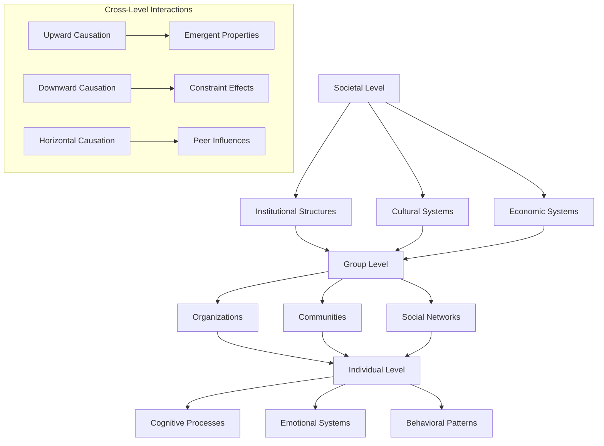
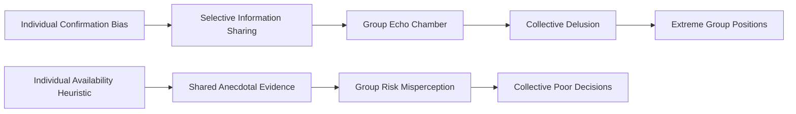
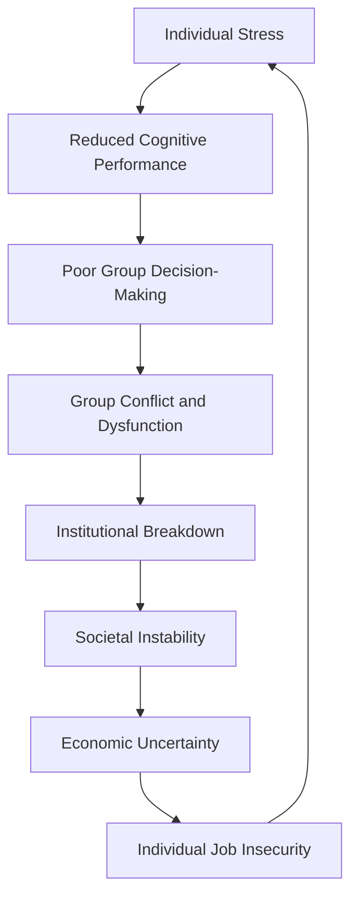

# Cross-Level Integration: Synthesizing Individual, Group, and Societal Analysis

**Discipline:** Integrative Social Science, Multi-Level Analysis  
**Level:** Cross-Level Integration  
**Keywords:** multi-level analysis, emergent properties, scale transitions, micro-macro linkages, systems integration  
**Related Documents:** Individual Psychology, Group Dynamics, Societal Systems, Systems Theory

## Abstract

This document synthesizes analyses from individual, group, and societal levels to reveal how human dysfunction emerges from complex interactions across scales of organization. By examining micro-macro linkages, emergent properties, and scale transition effects, we demonstrate that human problems cannot be understood through single-level analysis alone. Instead, dysfunction represents the outcome of dynamic interactions between individual psychology, group processes, and societal structures, each operating according to different principles and timescales. The analysis reveals how individual cognitive limitations aggregate into group irrationality, how group dynamics shape individual behavior, and how societal structures both emerge from and constrain lower-level processes. Understanding these cross-level interactions is essential for developing effective interventions and predicting system behavior.

## Introduction

Human social systems exhibit a hierarchical organization where individual minds, group processes, and societal structures interact across multiple scales. Each level operates according to distinct principles: individuals follow psychological and cognitive rules, groups exhibit social and cultural dynamics, and societies manifest institutional and structural patterns. However, these levels are not independent—they continuously influence each other through complex feedback mechanisms that create emergent properties at each scale.

Traditional disciplinary approaches often focus on single levels of analysis: psychology examines individuals, sociology studies groups, and political science analyzes institutions. While this specialization has generated valuable insights, it has also created artificial boundaries that obscure the integrated nature of human social systems. Real-world problems typically involve interactions across all levels, making single-level solutions inadequate or counterproductive.

This document provides a framework for understanding how dysfunction emerges from cross-level interactions and how interventions at one level can have unexpected effects at other levels. By mapping the causal pathways between individual psychology, group dynamics, and societal structures, we can develop more effective approaches to addressing human problems and designing better social systems.

## Theoretical Framework

### Multi-Level Systems Architecture

Human social systems can be conceptualized as nested hierarchies where each level exhibits distinct properties while remaining embedded within higher levels:

### Emergence and Constraint Dynamics

Cross-level interactions operate through two primary mechanisms:

**Upward Causation (Emergence)**:
- Lower-level interactions create higher-level properties
- Individual behaviors aggregate into group phenomena
- Group processes combine to form societal patterns
- New properties emerge that cannot be predicted from lower levels alone

**Downward Causation (Constraint)**:
- Higher-level structures constrain lower-level possibilities
- Societal institutions shape group formation and behavior
- Group norms influence individual psychology and choices
- Cultural contexts determine available behavioral repertoires

### Scale Transition Mechanisms

Different mechanisms govern transitions between levels of analysis, and understanding these mechanisms is crucial for predicting how changes at one level will affect other levels. Each type of transition involves distinct processes and creates different patterns of dysfunction.

| Transition Type | Mechanism | Examples | Dysfunction Patterns |
|----------------|-----------|----------|---------------------|
| **Individual → Group** | Social interaction, communication | Opinion formation, norm emergence | Groupthink, polarization |
| **Group → Societal** | Institutional formation, cultural evolution | Political movements, market dynamics | Institutional capture, cultural pathology |
| **Societal → Group** | Structural constraint, resource allocation | Legal frameworks, economic incentives | Organizational dysfunction, community breakdown |
| **Group → Individual** | Socialization, peer pressure | Identity formation, belief adoption | Conformity pressure, social isolation |

**Individual → Group Transitions** occur through social interaction and communication processes where individual behaviors, beliefs, and emotions aggregate into collective phenomena. Opinion formation happens when individuals share their views and influence each other through discussion and social proof. Norm emergence occurs when repeated individual behaviors become established as group expectations and standards. The dysfunction patterns include groupthink, where the desire for harmony overrides critical thinking, and polarization, where group discussions amplify rather than moderate individual positions.

**Group → Societal Transitions** involve institutional formation and cultural evolution processes where group-level phenomena scale up to affect entire societies. Political movements demonstrate how organized groups can capture institutional power and reshape societal structures. Market dynamics show how the interactions of many groups (firms, consumers, investors) create emergent economic patterns. Dysfunction patterns include institutional capture, where special interests gain control over institutions meant to serve the public, and cultural pathology, where harmful group norms become widespread social patterns.

**Societal → Group Transitions** operate through structural constraints and resource allocation mechanisms where societal-level institutions and systems shape group formation and behavior. Legal frameworks determine what types of groups can form and what activities they can pursue. Economic incentives influence how groups organize themselves and what goals they pursue. Dysfunction patterns include organizational dysfunction, where institutional pressures create ineffective group structures, and community breakdown, where societal changes undermine traditional group bonds and social support systems.

**Group → Individual Transitions** work through socialization and peer pressure processes where group membership shapes individual psychology and behavior. Identity formation occurs as individuals internalize group roles, values, and expectations as part of their self-concept. Belief adoption happens when individuals accept group worldviews and opinions as their own. Dysfunction patterns include conformity pressure, where individuals suppress their authentic thoughts and feelings to fit group expectations, and social isolation, where individuals who don't conform are excluded from group membership and support.

### Temporal Dynamics Across Levels

Different levels operate on different timescales, creating complex temporal interactions:

**Individual Level Timescales**:
- Milliseconds: Neural processing, reflexive responses
- Seconds to minutes: Conscious decision-making, emotional reactions
- Hours to days: Mood cycles, learning processes
- Months to years: Personality development, habit formation

**Group Level Timescales**:
- Minutes to hours: Group decision-making, conflict resolution
- Days to weeks: Norm establishment, role formation
- Months to years: Culture development, organizational change
- Decades: Generational transmission, institutional evolution

**Societal Level Timescales**:
- Years to decades: Policy implementation, economic cycles
- Decades to centuries: Institutional transformation, cultural evolution
- Centuries to millennia: Civilizational development, technological revolution

## Analysis

### Individual-to-Group Emergence

Individual psychological processes aggregate to create group-level phenomena through various mechanisms:

#### Cognitive Aggregation Effects

**Bias Amplification**:
Individual cognitive biases compound when aggregated across group members:

**Information Processing Failures**:
- Individual attention limitations → Group blind spots
- Personal memory distortions → Collective false memories
- Individual overconfidence → Group illusion of knowledge
- Personal anchoring effects → Group resistance to new information

#### Social Influence Mechanisms

**Conformity Cascades**:
Individual desire for social acceptance creates conformity pressures:
1. Initial minority expresses deviant opinion
2. Majority pressure suppresses dissent
3. Public compliance increases apparent consensus
4. Private beliefs shift to match public positions
5. New consensus becomes group orthodoxy

**Social Proof Dynamics**:
Individual uncertainty leads to reliance on others' behavior:
- Ambiguous situations → Looking to others for cues
- Others' behavior → Assumed evidence of correct action
- Collective action → Self-reinforcing behavioral norms
- Norm establishment → Individual behavior constraint

#### Emotional Contagion Processes

**Mood Synchronization**:
Individual emotional states spread through groups via:
- Facial mimicry and emotional mirroring
- Shared attention and focus
- Physiological synchronization (heart rate, breathing)
- Collective emotional amplification

**Stress Propagation**:
Individual stress responses create group-level dysfunction:
- Personal anxiety → Reduced cognitive performance
- Impaired decision-making → Poor group outcomes
- Group failure → Increased individual stress
- Collective stress → System breakdown

### Group-to-Societal Emergence

Group processes aggregate to create societal-level structures and dynamics:

#### Institutional Formation

**Norm Crystallization**:
Group norms become institutionalized through:
1. Repeated group interactions establish behavioral patterns
2. Successful patterns get copied by other groups
3. Patterns become codified in formal rules and procedures
4. Institutions enforce and perpetuate the patterns
5. Institutional structures constrain future group formation

**Power Concentration**:
Group leadership dynamics create societal power structures:
- Successful groups accumulate resources and influence
- Leaders develop networks across multiple groups
- Cross-group alliances form elite networks
- Elite networks capture institutional control
- Institutional control perpetuates elite advantage

#### Cultural Evolution

**Belief System Development**:
Group beliefs evolve into cultural worldviews:

| Stage | Process | Mechanism | Outcome |
|-------|---------|-----------|---------|
| **Local Adoption** | Group develops shared beliefs | Social learning, conformity | Group consensus |
| **Inter-Group Spread** | Beliefs spread between groups | Cultural transmission, competition | Regional patterns |
| **Institutional Support** | Beliefs become institutionalized | Formal education, media | Cultural dominance |
| **Generational Transmission** | Beliefs passed to children | Socialization, identity formation | Cultural persistence |

#### Economic System Formation

**Market Emergence**:
Group exchange behaviors create market structures:
- Individual trading preferences → Group exchange norms
- Group norms → Market institutions and rules
- Market rules → Economic system structure
- Economic structure → Individual opportunity constraints

**Inequality Generation**:
Group competition creates societal stratification:
- Individual skill differences → Group performance variation
- Group success → Resource accumulation
- Resource advantages → Competitive advantages
- Competitive success → Institutional capture
- Institutional control → Perpetual advantage

### Societal-to-Group Constraint

Societal structures shape group formation and behavior:

#### Institutional Channeling

**Legal Frameworks**:
Laws and regulations constrain group possibilities:
- Property rights → Determine resource access and group formation
- Association rights → Define permissible group activities
- Regulatory structures → Shape organizational forms
- Enforcement mechanisms → Influence group risk-taking

**Economic Incentives**:
Economic systems create group formation pressures:
- Market structures → Determine viable group sizes and forms
- Resource distribution → Influence group composition
- Competition rules → Shape group strategies
- Success metrics → Define group objectives

#### Cultural Programming

**Value Systems**:
Societal values influence group norms and individual behavior:
- Individualism vs. collectivism → Group cohesion patterns
- Hierarchy vs. equality → Group power structures
- Competition vs. cooperation → Group interaction styles
- Achievement vs. relationship → Group priority setting

**Identity Categories**:
Societal identity systems shape group formation:
- Ethnic/racial categories → In-group/out-group boundaries
- Class distinctions → Social stratification patterns
- Professional identities → Occupational group formation
- Political affiliations → Ideological group alignment

### Group-to-Individual Constraint

Group processes shape individual psychology and behavior:

#### Socialization Effects

**Identity Formation**:
Group membership shapes individual self-concept:
- Group roles → Personal identity components
- Group values → Individual belief systems
- Group narratives → Personal life stories
- Group expectations → Individual behavioral patterns

**Cognitive Shaping**:
Group environments influence individual thinking:
- Information exposure → Available knowledge base
- Discussion patterns → Reasoning styles
- Group problems → Cognitive skill development
- Collective solutions → Individual problem-solving approaches

#### Social Control Mechanisms

**Norm Enforcement**:
Groups constrain individual behavior through:
- Social approval/disapproval → Behavioral reinforcement
- Reputation systems → Long-term incentive structures
- Exclusion threats → Compliance pressure
- Role expectations → Behavioral channeling

**Opportunity Structures**:
Groups determine individual possibilities:
- Network access → Available opportunities
- Resource sharing → Individual capabilities
- Collective action → Individual power
- Group status → Individual social position

### Emergent Properties at Each Level

Each level of human organization exhibits properties that cannot be reduced to lower levels, representing genuine emergence where the whole becomes qualitatively different from the sum of its parts. Understanding these emergent properties is essential for effective intervention and system design.

#### Individual Level Emergent Properties

**Consciousness and Agency**: Individual consciousness emerges from neural processes but cannot be reduced to them. Self-awareness, the ability to reflect on one's own thoughts and experiences, creates the foundation for intentional action and moral responsibility. Intentionality and goal-directed behavior allow individuals to plan for the future and work toward desired outcomes. Personal identity and narrative self-construction enable individuals to maintain coherent self-concepts across time and changing circumstances. Moral reasoning and ethical decision-making emerge from the interaction of cognitive, emotional, and social processes, creating the capacity for principled action.

**Psychological Resilience**: The ability to adapt to stress and adversity emerges from the interaction of multiple psychological systems. Stress adaptation and coping mechanisms develop through experience and learning, creating individual differences in resilience. Learning and behavioral flexibility allow individuals to modify their responses based on feedback and changing circumstances. Emotional regulation and self-control emerge from the interaction between emotional and cognitive systems. Creative problem-solving capabilities represent the emergence of novel solutions from the recombination of existing knowledge and skills.

#### Group Level Emergent Properties

**Collective Intelligence**: Groups can exhibit problem-solving capabilities that exceed those of their individual members through the emergence of collective intelligence. This occurs when diverse perspectives and knowledge bases are effectively integrated through group processes. Distributed cognition allows groups to process more information and consider more alternatives than any individual could manage alone. Collective memory and cultural transmission enable groups to preserve and build upon knowledge across generations. Emergent leadership and coordination arise spontaneously from group interactions without formal appointment or hierarchy.

**Social Capital**: The networks of relationships and shared norms that enable cooperation and collective action represent emergent group properties. Trust networks and reciprocity norms develop through repeated interactions and create the foundation for complex cooperation. Collective efficacy and shared agency emerge when group members believe in their collective ability to achieve common goals. Social cohesion and group solidarity create emotional bonds that motivate individual sacrifice for group benefit. Institutional capacity and governance emerge from the formalization of group decision-making processes and conflict resolution mechanisms.

#### Societal Level Emergent Properties

**Institutional Complexity**: Modern societies exhibit institutional complexity that emerges from the interaction of multiple organizations, rules, and cultural systems. Legal systems and governance structures create frameworks for social coordination that transcend any individual or group. Economic markets and financial systems enable resource allocation and coordination across vast networks of strangers. Cultural institutions and meaning systems provide shared frameworks for understanding and interpreting experience. Technological infrastructure and innovation systems create capabilities that no individual or organization could develop alone.

**Civilizational Capabilities**: The highest level of emergence involves civilizational capabilities that represent the collective achievements of entire societies across generations. Large-scale coordination and collective action enable societies to undertake projects that require the cooperation of millions of people. Knowledge accumulation and scientific progress create understanding that builds upon the work of countless individuals over centuries. Technological development and environmental modification demonstrate humanity's collective ability to reshape the physical world. Cultural evolution and value system development show how societies can develop increasingly sophisticated moral and aesthetic frameworks.

## Cross-Level Connections

### Feedback Loop Analysis

Cross-level interactions create complex feedback loops that can amplify or dampen dysfunction:

#### Reinforcing Loops (Vicious Cycles)

**Individual Stress → Group Dysfunction → Societal Problems → Individual Stress**:

**Individual Bias → Group Polarization → Cultural Extremism → Individual Radicalization**:
- Personal confirmation bias → Selective group joining
- Homogeneous groups → Echo chamber effects
- Extreme group positions → Cultural polarization
- Polarized culture → Individual identity extremism
- Extreme individuals → More extreme group formation

#### Balancing Loops (Corrective Mechanisms)

**Individual Learning → Group Adaptation → Institutional Innovation → Individual Opportunity**:
- Individual skill development → Group capability enhancement
- Enhanced groups → Better institutional performance
- Effective institutions → More individual opportunities
- Increased opportunities → Motivation for learning

**Individual Dissent → Group Diversity → Cultural Innovation → Individual Freedom**:
- Individual nonconformity → Group diversity maintenance
- Diverse groups → Cultural innovation and adaptation
- Innovative culture → Tolerance for individual differences
- Individual freedom → More nonconformist expression

### Scale Transition Effects

Moving between levels involves qualitative changes in system properties:

#### Quantitative to Qualitative Transitions

**Individual Interactions → Group Emergence**:
- Below critical mass: Collection of individuals
- At critical mass: Emergent group properties appear
- Above critical mass: Group dominates individual behavior
- Threshold effects determine transition points

**Group Networks → Societal Structures**:
- Sparse networks: Independent group operation
- Dense networks: Inter-group coordination emerges
- Highly connected: Societal-level properties appear
- Network topology determines emergent structures

#### Temporal Scale Mismatches

Different levels operate on different timescales, creating coordination problems:

**Fast Individual Decisions vs. Slow Institutional Change**:
- Individual adaptation occurs rapidly (days to months)
- Institutional change occurs slowly (years to decades)
- Mismatch creates persistent individual-institution conflicts
- Individuals adapt to outdated institutional structures

**Medium-Speed Group Dynamics vs. Slow Cultural Evolution**:
- Group norms change moderately fast (months to years)
- Cultural values change slowly (decades to centuries)
- Groups may develop norms conflicting with cultural values
- Cultural lag creates inter-generational conflicts

### Intervention Leverage Points

Understanding cross-level interactions reveals high-leverage intervention points:

#### Individual-Level Interventions with System Effects

**Cognitive Training**:
- Individual bias reduction → Improved group decision-making
- Enhanced critical thinking → Reduced cultural manipulation
- Emotional regulation skills → Decreased social conflict
- Metacognitive awareness → Better institutional participation

**Leadership Development**:
- Individual leadership skills → Group effectiveness
- Ethical leadership → Institutional integrity
- Adaptive leadership → Cultural resilience
- Distributed leadership → System robustness

#### Group-Level Interventions with System Effects

**Diversity Enhancement**:
- Group diversity → Reduced groupthink
- Cognitive diversity → Better problem-solving
- Demographic diversity → Cultural innovation
- Perspective diversity → Institutional adaptation

**Process Improvement**:
- Better group decision processes → Institutional effectiveness
- Conflict resolution skills → Social stability
- Collaboration techniques → Economic productivity
- Communication systems → Cultural transmission

#### Societal-Level Interventions with System Effects

**Institutional Design**:
- Incentive alignment → Group cooperation
- Transparency mechanisms → Individual accountability
- Participation structures → Democratic engagement
- Feedback systems → Adaptive governance

**Cultural Evolution**:
- Value promotion → Group norm change
- Narrative construction → Individual identity formation
- Symbol systems → Collective meaning-making
- Educational systems → Generational transmission

## Historical Context

Historical analysis reveals recurring patterns of cross-level interactions:

### Successful Cross-Level Transformations

**Democratic Transitions**:
- Individual democratic values → Civil society groups
- Civil society → Democratic institutions
- Democratic institutions → Individual rights protection
- Rights protection → Reinforced democratic values

**Scientific Revolution**:
- Individual curiosity → Scientific communities
- Scientific communities → Research institutions
- Research institutions → Cultural rationality
- Rational culture → Individual scientific thinking

**Economic Development**:
- Individual entrepreneurship → Market groups
- Market groups → Economic institutions
- Economic institutions → Prosperity culture
- Prosperity culture → Individual opportunity

### Failed Cross-Level Adaptations

**Totalitarian Systems**:
- Individual fear → Atomized society
- Atomization → Institutional capture
- Captured institutions → Oppressive culture
- Oppressive culture → Individual submission

**Economic Collapse**:
- Individual speculation → Market bubbles
- Market dysfunction → Institutional failure
- Institutional failure → Cultural crisis
- Cultural crisis → Individual desperation

**Environmental Degradation**:
- Individual consumption → Collective overuse
- Resource depletion → Institutional conflict
- Institutional failure → Cultural breakdown
- Cultural breakdown → Individual survival focus

## Contemporary Manifestations

Modern technology has created new forms of cross-level interaction:

### Digital Age Cross-Level Dynamics

**Social Media Effects**:
- Individual attention → Algorithmic manipulation
- Algorithmic systems → Group polarization
- Polarized groups → Cultural fragmentation
- Fragmented culture → Individual isolation

**Economic Platform Effects**:
- Individual gig work → Platform dependence
- Platform control → Market concentration
- Market concentration → Institutional capture
- Institutional capture → Individual powerlessness

**Information System Effects**:
- Individual information seeking → Filter bubbles
- Filter bubbles → Group echo chambers
- Echo chambers → Cultural epistemic crisis
- Epistemic crisis → Individual confusion

### Globalization Cross-Level Effects

**Cultural Homogenization vs. Fragmentation**:
- Global media → Local cultural change
- Cultural change → Group identity crisis
- Identity crisis → Individual alienation
- Alienation → Reactionary group formation

**Economic Integration Effects**:
- Individual economic choices → Global supply chains
- Supply chain integration → Local economic vulnerability
- Economic vulnerability → Political instability
- Political instability → Individual insecurity

## Implications

### For Understanding Human Problems

Cross-level analysis fundamentally changes how we understand dysfunction:

**Problems as System Properties**:
- Dysfunction emerges from interactions, not just individual pathology
- Single-level solutions often fail or create new problems
- System structure determines individual and group possibilities
- Intervention effects propagate across levels in unexpected ways

**Temporal Complexity**:
- Different levels change at different rates
- Interventions may have delayed or indirect effects
- Short-term solutions may create long-term problems
- System adaptation may require extended time horizons

### For Intervention Design

**Multi-Level Intervention Strategies**:
- Coordinate interventions across multiple levels
- Sequence interventions to account for temporal dynamics
- Design feedback mechanisms to monitor cross-level effects
- Build adaptive capacity at all levels

**Leverage Point Identification**:
- Focus on points where small changes have large effects
- Target structural features that constrain system behavior
- Address root causes rather than symptoms
- Build positive feedback loops for beneficial changes

### For System Design

**Alignment Principles**:
- Align incentives across levels to reduce conflicts
- Design institutions that support beneficial individual and group behavior
- Create feedback mechanisms that promote system learning
- Build redundancy and diversity to enhance resilience

**Emergence Management**:
- Design conditions for beneficial emergence
- Prevent harmful emergent properties through structural constraints
- Monitor for early signs of problematic emergence
- Maintain flexibility to adapt to unexpected emergent properties

## Limitations

### Analytical Limitations

**Complexity Challenges**:
- Real systems more complex than any model can capture
- Interaction effects difficult to predict or measure
- Emergent properties may be fundamentally unpredictable
- Multiple valid perspectives on same phenomena

**Measurement Problems**:
- Difficulty quantifying cross-level interactions
- Different levels require different measurement approaches
- Temporal mismatches complicate causal inference
- Observer effects from measurement interventions

### Practical Limitations

**Intervention Challenges**:
- Difficulty coordinating across multiple levels
- Unintended consequences from system complexity
- Resistance to change from existing system dynamics
- Resource requirements for multi-level interventions

**Political Constraints**:
- Different levels controlled by different actors
- Conflicting interests across levels
- Democratic processes may prevent optimal system design
- Power structures resist changes that threaten their position

### Theoretical Limitations

**Reductionism vs. Emergence**:
- Tension between detailed analysis and emergent properties
- Difficulty determining appropriate level of description
- Risk of losing important details in system-level analysis
- Challenge of integrating multiple theoretical frameworks

**Causation Complexity**:
- Circular causation makes linear thinking inadequate
- Multiple causation paths for same outcomes
- Context-dependent effects of same interventions
- Difficulty distinguishing correlation from causation

## References

1. Coleman, J. S. (1990). *Foundations of Social Theory*. Harvard University Press.
2. Hedström, P., & Swedberg, R. (Eds.). (1998). *Social Mechanisms: An Analytical Approach to Social Theory*. Cambridge University Press.
3. Sawyer, R. K. (2005). *Social Emergence: Societies as Complex Systems*. Cambridge University Press.
4. Wimsatt, W. C. (2007). *Re-Engineering Philosophy for Limited Beings: Piecewise Approximations to Reality*. Harvard University Press.
5. Ostrom, E. (2009). A general framework for analyzing sustainability of social-ecological systems. *Science*, 325(5939), 419-422.
6. Giddens, A. (1984). *The Constitution of Society: Outline of the Theory of Structuration*. University of California Press.
7. Alexander, J. C., Giesen, B., Münch, R., & Smelser, N. J. (Eds.). (1987). *The Micro-Macro Link*. University of California Press.

## Cross-References

- [See: Individual → Cognitive Architecture] - Individual-level foundations of cross-level interactions
- [Related: Group → Social Psychology] - Group-level processes in multi-level systems
- [Compare: Societal → Political Systems Failure] - Societal-level constraints and failures
- [See: Integrative → Systems Theory Perspective] - Systems thinking framework for cross-level analysis
- [Related: Integrative → Complexity Science] - Mathematical approaches to multi-level systems

---

**Navigation:**  
← [Future Projections] | [Integrative Analysis Index] | [Theoretical Synthesis →]