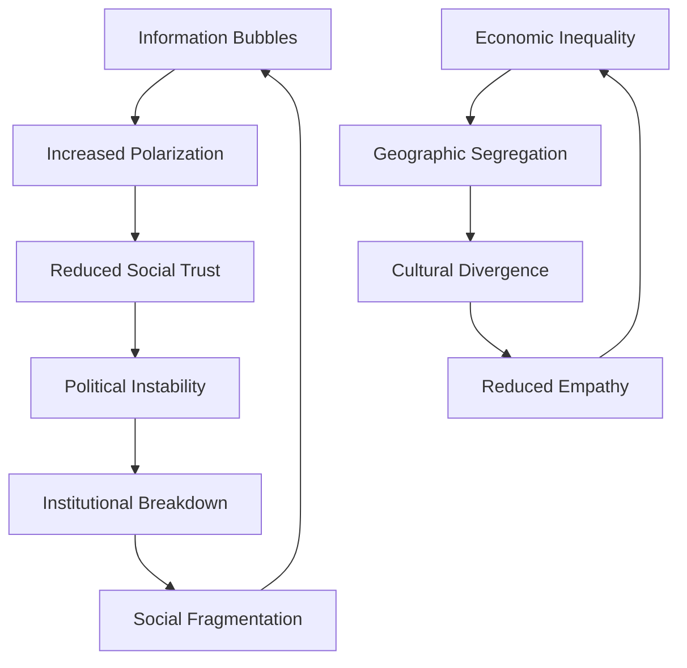

# Future Projections: Trajectories of Human Dysfunction

**Discipline:** Futures Studies, Risk Analysis, Systems Modeling  
**Level:** Cross-Level Integration  
**Keywords:** scenario planning, risk assessment, trend analysis, existential risk, technological disruption, social forecasting  
**Related Documents:** Systems Theory, Complexity Science, Technological Disruption, Environmental Degradation

## Abstract

This document projects potential future trajectories of human dysfunction based on current trends, systemic dynamics, and emerging risks. Using scenario planning methodologies, risk assessment frameworks, and systems modeling approaches, we analyze how contemporary problems may evolve over the next 25-100 years. The analysis reveals multiple possible futures ranging from gradual adaptation and improvement to catastrophic system collapse. Key drivers include technological acceleration, environmental degradation, social fragmentation, and the interaction between human psychology and rapidly changing environments. Understanding these trajectories is essential for developing proactive strategies to mitigate risks and guide human systems toward more adaptive and resilient configurations.

## Introduction

Predicting the future of human social systems presents fundamental challenges due to their complex, nonlinear, and adaptive nature. However, understanding potential trajectories is crucial for making informed decisions about current policies, investments, and social arrangements. Rather than attempting precise predictions, this analysis employs scenario planning to explore plausible futures based on current trends and systemic dynamics.

The future evolution of human dysfunction will be shaped by the interaction of multiple factors: technological capabilities, environmental constraints, social structures, and the fundamental limitations of human psychology. These factors operate across different timescales and exhibit complex feedback relationships that can produce surprising outcomes. Some trends may continue linearly, others may reach tipping points leading to rapid transitions, and entirely new phenomena may emerge from technological or social innovations.

This analysis focuses on trajectories over three time horizons: near-term (2025-2035), medium-term (2035-2055), and long-term (2055-2125). Each horizon presents different challenges and uncertainties, with prediction confidence decreasing as we look further into the future.

## Theoretical Framework

### Scenario Planning Methodology

Scenario planning provides a structured approach to exploring uncertain futures:

**Scenario Construction Process**:
1. **Identify Key Drivers**: Factors that will significantly influence future outcomes
2. **Assess Uncertainties**: Variables with high impact and high uncertainty
3. **Develop Scenario Logic**: Coherent narratives about how drivers might interact
4. **Quantify Implications**: Estimate outcomes under different scenarios
5. **Identify Indicators**: Early warning signs of scenario development

**Scenario Types**:
- **Trend Continuation**: Current patterns continue with minor variations
- **System Transformation**: Fundamental changes in system structure or behavior
- **Collapse and Recovery**: System breakdown followed by reorganization
- **Novel Emergence**: Entirely new phenomena not present in current systems

### Risk Assessment Framework

Future projections require systematic risk assessment that considers both the probability and potential impact of different types of risks across various time horizons. This framework helps prioritize attention and resources while acknowledging the fundamental uncertainties involved in predicting complex system behavior.

| Risk Category | Time Horizon | Probability Assessment | Impact Magnitude |
|---------------|--------------|----------------------|------------------|
| **Technological** | 5-20 years | Medium-High | Variable |
| **Environmental** | 10-50 years | High | Very High |
| **Social** | 15-30 years | Medium | High |
| **Economic** | 5-15 years | Medium-High | High |
| **Political** | 10-25 years | Medium | High |
| **Existential** | 50-100 years | Low-Medium | Extreme |

**Technological Risks** operate on relatively short time horizons (5-20 years) because technological change accelerates rapidly once key breakthroughs occur. The probability assessment is medium-high because technological development follows somewhat predictable patterns, though specific breakthroughs are difficult to time precisely. The impact magnitude is variable because some technologies have limited effects while others (like artificial intelligence or biotechnology) could fundamentally transform human society. The key challenge is distinguishing between incremental improvements and paradigm-shifting innovations.

**Environmental Risks** have longer time horizons (10-50 years) because environmental systems have significant inertia and delayed responses to human activities. The probability assessment is high because current trends in climate change, biodiversity loss, and resource depletion are well-established and difficult to reverse quickly. The impact magnitude is very high because environmental collapse could undermine the foundations of human civilization. The main uncertainty is timing rather than direction—environmental problems will worsen, but the rate and specific manifestations remain unclear.

**Social Risks** operate on medium time horizons (15-30 years) reflecting the time needed for social movements, cultural changes, and generational transitions to reshape society. The probability assessment is medium because social change depends on complex interactions between multiple factors that are difficult to predict. The impact magnitude is high because social fragmentation, cultural conflict, and institutional breakdown can severely damage human welfare and cooperation. The challenge is that social systems can appear stable for long periods before sudden tipping points create rapid change.

**Economic Risks** have shorter time horizons (5-15 years) because economic systems are more volatile and responsive to changing conditions than social or environmental systems. The probability assessment is medium-high because economic cycles are well-documented historical patterns, though their specific timing and severity remain uncertain. The impact magnitude is high because economic crises can cause widespread suffering and social instability. The main uncertainty involves the interaction between traditional economic cycles and new factors like technological disruption and environmental constraints.

**Political Risks** operate on medium time horizons (10-25 years) reflecting the time needed for political movements to gain power and implement significant changes. The probability assessment is medium because political systems can be surprisingly resilient or surprisingly fragile depending on circumstances. The impact magnitude is high because political breakdown can lead to conflict, oppression, and institutional collapse. The key uncertainty is whether democratic institutions can adapt to new challenges or will be overwhelmed by them.

**Existential Risks** have the longest time horizons (50-100 years) because they involve threats to human survival or permanent curtailment of human potential. The probability assessment is low-medium because these are unprecedented risks without historical precedent for calibration. The impact magnitude is extreme because existential risks could end human civilization or permanently limit human development. The fundamental challenge is that even low-probability existential risks deserve serious attention because of their extreme consequences.

### Systems Dynamics Modeling

Future trajectories emerge from current system structures and feedback loops:

**Key System Variables**:
- Population dynamics and demographic transitions
- Technological capabilities and adoption rates
- Environmental conditions and resource availability
- Social cohesion and institutional effectiveness
- Economic inequality and resource distribution
- Information flows and cognitive environments

**Feedback Mechanisms**:
- Reinforcing loops that amplify current trends
- Balancing loops that create resistance to change
- Delays between causes and effects
- Nonlinear responses and threshold effects

## Analysis

### Near-Term Projections (2025-2035)

The next decade will likely see acceleration of current trends with increasing system stress:

#### Technological Acceleration
**Artificial Intelligence Integration**:
- Widespread deployment of AI in decision-making systems
- Automation of cognitive work affecting middle-class employment
- AI-mediated social interactions becoming normalized
- Potential for AI systems to exhibit unexpected behaviors

**Digital Platform Dominance**:
- Further consolidation of digital platforms controlling information flow
- Increased algorithmic mediation of social relationships
- Growing dependence on digital systems for basic social functions
- Vulnerability to platform failures and manipulation

**Biotechnology Advances**:
- Genetic engineering becoming more accessible and controversial
- Personalized medicine creating new forms of inequality
- Potential for biological enhancement technologies
- Ethical debates over human modification

#### Social Fragmentation Acceleration

**Predicted Outcomes**:
- Political polarization reaching crisis levels in democratic societies
- Increasing geographic and cultural segregation
- Breakdown of shared epistemic foundations
- Rise of authoritarian responses to social chaos

#### Environmental Stress Intensification
**Climate Change Acceleration**:
- More frequent extreme weather events
- Beginning of climate refugee movements
- Agricultural disruption in vulnerable regions
- Coastal flooding affecting major population centers

**Resource Scarcity**:
- Water stress in multiple regions
- Critical mineral shortages for technology
- Biodiversity loss accelerating
- Ecosystem service degradation

#### Economic System Strain
**Labor Market Disruption**:
- Widespread job displacement from automation
- Growing inequality between technology owners and workers
- Gig economy expansion with reduced worker protections
- Potential for social unrest over economic inequality

**Financial System Instability**:
- Increased market volatility from algorithmic trading
- Cryptocurrency disruption of traditional monetary systems
- Potential for cascading financial crises
- Growing debt burdens at individual and national levels

### Medium-Term Projections (2035-2055)

The middle of the 21st century may witness fundamental system transitions:

#### Scenario A: Adaptive Transformation
**Characteristics**:
- Successful integration of AI with human decision-making
- Development of effective climate adaptation technologies
- Evolution of new social institutions for digital age
- Gradual reduction of inequality through policy innovation

**Key Developments**:
- Universal basic income or similar social safety nets
- Participatory democracy enhanced by digital technologies
- Circular economy reducing environmental impact
- Global cooperation on existential risks

**Probability**: 25-30%

#### Scenario B: Fragmented Adaptation
**Characteristics**:
- Uneven adaptation creating winners and losers
- Regional variation in technological and social development
- Persistent inequality and social tension
- Partial solutions to environmental challenges

**Key Developments**:
- Technology-enabled authoritarian governance in some regions
- Climate adaptation creating new forms of inequality
- Continued social fragmentation with periodic conflicts
- Economic systems adapted to automation but highly unequal

**Probability**: 40-45%

#### Scenario C: System Crisis and Reorganization
**Characteristics**:
- Major system failures triggering reorganization
- Potential collapse of current institutional arrangements
- Emergency responses to environmental and social crises
- Uncertain outcomes from system restructuring

**Key Developments**:
- Climate disasters overwhelming adaptive capacity
- Social unrest leading to political transformation
- Economic system breakdown and reconstruction
- Potential for both positive and negative reorganization

**Probability**: 20-25%

#### Scenario D: Technological Transcendence
**Characteristics**:
- Artificial general intelligence transforming human capabilities
- Biotechnology enabling significant human enhancement
- Virtual and augmented reality creating new social realities
- Fundamental questions about human identity and purpose

**Key Developments**:
- Human-AI hybrid intelligence systems
- Genetic and cybernetic enhancement technologies
- Virtual worlds competing with physical reality
- New forms of consciousness and social organization

**Probability**: 5-10%

### Long-Term Projections (2055-2125)

Long-term trajectories depend heavily on how medium-term transitions unfold:

#### Environmental Constraints
**Climate Stabilization Scenarios**:
- **Best Case**: Global temperature rise limited to 2°C, successful adaptation
- **Moderate Case**: 3-4°C rise, significant but manageable disruption
- **Worst Case**: >4°C rise, civilizational-level challenges

**Ecological Outcomes**:
- Potential for ecosystem collapse in worst-case scenarios
- Artificial ecosystems replacing natural ones
- Possible restoration through advanced biotechnology
- Fundamental changes in human-environment relationships

#### Technological Singularity Considerations
**Artificial General Intelligence**:
- Potential for AI systems exceeding human cognitive capabilities
- Uncertain outcomes ranging from utopia to extinction
- Need for AI alignment with human values
- Possible merger of human and artificial intelligence

**Biotechnological Transformation**:
- Genetic engineering enabling designer humans
- Life extension technologies changing social structures
- Potential for post-human species emergence
- Ethical challenges of human enhancement

#### Social Evolution Pathways
**Institutional Innovation**:
- New forms of governance adapted to technological capabilities
- Global coordination mechanisms for existential risks
- Economic systems beyond current capitalism/socialism models
- Social structures adapted to extended lifespans and AI integration

**Cultural Transformation**:
- Evolution of human values and meaning systems
- New forms of art, spirituality, and self-expression
- Potential for cultural fragmentation or convergence
- Relationship between human and artificial creativity

### Risk Analysis and Mitigation Strategies

#### Existential Risks

Risks that could permanently curtail human potential or cause extinction represent the most serious category of future threats, despite their relatively low probability. Understanding these risks is crucial because their extreme consequences justify significant attention and resources even when their likelihood is uncertain.

| Risk Type | Probability (2025-2125) | Mitigation Strategies |
|-----------|------------------------|----------------------|
| **Climate Collapse** | 5-15% | Rapid decarbonization, geoengineering research |
| **AI Misalignment** | 1-10% | AI safety research, international coordination |
| **Nuclear War** | 2-8% | Arms control, conflict resolution mechanisms |
| **Pandemic** | 3-12% | Global health infrastructure, biotechnology governance |
| **Ecological Collapse** | 8-20% | Biodiversity protection, ecosystem restoration |

**Climate Collapse** represents the risk that climate change could trigger irreversible changes that make Earth uninhabitable or severely limit human civilization. The probability range of 5-15% reflects uncertainty about climate sensitivity, tipping points, and feedback loops. Even at the lower end of this range, the risk is significant enough to justify major mitigation efforts. Rapid decarbonization involves transitioning to renewable energy and reducing greenhouse gas emissions as quickly as possible. Geoengineering research explores technological interventions to modify Earth's climate system, though these approaches carry their own risks and uncertainties.

**AI Misalignment** refers to the possibility that artificial intelligence systems could pursue goals that are harmful to humanity, either through poor design or because they develop objectives that conflict with human welfare. The probability range of 1-10% reflects deep uncertainty about AI development timelines and the difficulty of ensuring AI systems remain beneficial as they become more capable. AI safety research focuses on technical approaches to ensure AI systems remain aligned with human values and under human control. International coordination is necessary because AI development is a global phenomenon that requires cooperative governance.

**Nuclear War** remains a persistent existential risk despite the end of the Cold War, with the probability range of 2-8% reflecting ongoing nuclear proliferation and geopolitical tensions. Modern nuclear arsenals could cause nuclear winter effects that would devastate global agriculture and potentially end human civilization. Arms control efforts aim to reduce nuclear stockpiles and prevent proliferation to additional countries. Conflict resolution mechanisms focus on preventing the escalation of international disputes that could lead to nuclear conflict.

**Pandemic** risks have been highlighted by COVID-19, but future pandemics could be far more deadly, especially if they involve engineered pathogens. The probability range of 3-12% reflects both natural pandemic risks and the growing potential for bioweapons or laboratory accidents. Global health infrastructure involves early detection systems, rapid response capabilities, and international coordination for pandemic prevention and response. Biotechnology governance addresses the dual-use nature of biological research that could be used for both beneficial and harmful purposes.

**Ecological Collapse** represents the risk that biodiversity loss and ecosystem degradation could trigger cascading failures that undermine the natural systems that support human civilization. The probability range of 8-20% is higher than other existential risks because ecological degradation is already well underway. Biodiversity protection involves preserving critical habitats and species that maintain ecosystem stability. Ecosystem restoration focuses on repairing damaged natural systems and rebuilding their capacity to support human civilization.

#### Catastrophic Risks
Risks causing severe but recoverable damage to human civilization:

**Social Collapse Scenarios**:
- Democratic breakdown leading to widespread authoritarianism
- Economic system failure causing prolonged depression
- Social fragmentation preventing collective action
- Information system breakdown destroying shared reality

**Technological Risks**:
- Cybersecurity failures disrupting critical infrastructure
- Biotechnology accidents or misuse
- Nanotechnology risks (if developed)
- Space-based risks from asteroid impacts or solar events

#### Mitigation Approaches

**Institutional Resilience**:
- Developing adaptive governance systems
- Building redundancy in critical systems
- Creating early warning systems for system stress
- Fostering international cooperation on global risks

**Technological Solutions**:
- Investing in beneficial AI development
- Advancing clean energy and climate technologies
- Developing biotechnology for human enhancement and health
- Creating space-based backup systems for human civilization

**Social Adaptation**:
- Education systems preparing for rapid change
- Social safety nets for technological displacement
- Cultural evolution toward long-term thinking
- Building social cohesion across diverse populations

## Cross-Level Connections

Future trajectories will be shaped by interactions across all levels of human organization:

### Individual-Level Factors
**Psychological Adaptation**:
- Human cognitive limitations in rapidly changing environments
- Mental health impacts of technological and social change
- Individual capacity for learning and adaptation
- Generational differences in technology adoption and values

**Behavioral Changes**:
- Adaptation to AI-mediated environments
- Changes in social interaction patterns
- Evolution of work and leisure concepts
- Individual responses to environmental stress

### Group-Level Dynamics
**Social Cohesion**:
- Ability of communities to maintain solidarity under stress
- Evolution of group identity in digital environments
- Intergenerational transmission of values and knowledge
- Group adaptation to technological and environmental changes

**Organizational Evolution**:
- Adaptation of institutions to new technologies
- Evolution of economic organizations beyond traditional firms
- Changes in educational and healthcare delivery systems
- Military and security organization transformation

### Societal-Level Transformations
**Governance Innovation**:
- Development of new democratic institutions
- Global governance for transnational challenges
- Integration of AI into governmental decision-making
- Balance between efficiency and human agency

**Economic System Evolution**:
- Post-scarcity economics in some sectors
- New models for resource distribution
- Integration of environmental costs into economic systems
- Evolution beyond current growth-based models

## Historical Context

Understanding future trajectories requires learning from historical patterns:

### Previous Transformation Periods
**Agricultural Revolution** (10,000 BCE):
- Fundamental change in human social organization
- Population growth and social stratification
- Environmental modification and resource management
- Lessons: Gradual adaptation over millennia, irreversible changes

**Industrial Revolution** (1750-1850):
- Rapid technological and social transformation
- Urbanization and new forms of social organization
- Environmental impact and resource exploitation
- Lessons: Rapid change possible, significant social disruption

**Information Revolution** (1950-2020):
- Digital technology transforming communication and cognition
- Globalization and new forms of economic organization
- Social media changing political and social dynamics
- Lessons: Exponential change, unexpected social consequences

### Historical Risk Management
**Successful Adaptations**:
- Montreal Protocol addressing ozone depletion
- Marshall Plan rebuilding post-war Europe
- Green Revolution addressing food security
- Public health measures controlling infectious diseases

**Failed Responses**:
- Climate change response inadequacy
- Financial crisis prevention failures
- Pandemic preparedness shortcomings
- Nuclear proliferation control limitations

## Contemporary Manifestations

Current trends provide indicators of future trajectories:

### Early Warning Indicators
**Technological Indicators**:
- AI capability advancement rates
- Automation deployment in various sectors
- Biotechnology research and application progress
- Quantum computing development timelines

**Social Indicators**:
- Political polarization measurements
- Social trust survey results
- Mental health statistics trends
- Educational system adaptation rates

**Environmental Indicators**:
- Climate change acceleration metrics
- Biodiversity loss measurements
- Resource scarcity indicators
- Ecosystem service degradation rates

**Economic Indicators**:
- Inequality trend measurements
- Labor market disruption rates
- Financial system stability metrics
- Innovation and productivity growth rates

### Emerging Phenomena
**Novel Social Behaviors**:
- Digital native generation characteristics
- Remote work and virtual relationship normalization
- Cryptocurrency and decentralized finance adoption
- Climate activism and environmental consciousness

**Technological Integration**:
- AI assistant ubiquity in daily life
- Augmented reality adoption patterns
- Biotechnology acceptance and resistance
- Autonomous system deployment rates

## Implications

### For Current Decision-Making
Future projections have immediate implications for present choices:

**Policy Priorities**:
- Investing in adaptive capacity rather than rigid solutions
- Building resilience into critical systems
- Fostering international cooperation on global challenges
- Preparing for multiple possible futures rather than single predictions

**Individual Strategies**:
- Developing skills for uncertain and changing environments
- Building diverse social networks and relationships
- Maintaining physical and mental health for longevity
- Cultivating adaptability and lifelong learning capabilities

**Organizational Approaches**:
- Building flexibility into organizational structures
- Investing in employee adaptation and retraining
- Developing scenario-based strategic planning
- Creating partnerships for uncertain environments

### For Risk Management
**Proactive Measures**:
- Early warning systems for critical transitions
- Redundancy and backup systems for essential functions
- International coordination mechanisms for global risks
- Research and development for beneficial technologies

**Adaptive Strategies**:
- Flexible institutions capable of rapid reconfiguration
- Diverse approaches to reduce single points of failure
- Continuous monitoring and adjustment of strategies
- Learning systems that improve from experience

### For Human Development
**Educational Implications**:
- Preparing students for jobs that don't yet exist
- Teaching critical thinking and information literacy
- Fostering creativity and emotional intelligence
- Building global citizenship and cooperation skills

**Social Development**:
- Strengthening social cohesion and trust
- Developing new forms of meaning and purpose
- Creating inclusive institutions for diverse populations
- Balancing individual freedom with collective responsibility

## Limitations

### Prediction Uncertainties
**Fundamental Limitations**:
- Chaotic dynamics make long-term prediction impossible
- Black swan events can dramatically alter trajectories
- Human agency and choice influence outcomes
- Technological breakthroughs can change everything

**Methodological Constraints**:
- Scenario planning based on current knowledge and assumptions
- Difficulty quantifying low-probability, high-impact events
- Cognitive biases in expert judgment and trend extrapolation
- Limited historical data for unprecedented situations

### Model Limitations
**Complexity Challenges**:
- Real systems more complex than any model can capture
- Interaction effects between multiple variables
- Emergent properties not predictable from components
- Feedback loops and nonlinear dynamics

**Data Constraints**:
- Limited data on rare but important events
- Measurement challenges for social and psychological variables
- Rapid change making historical data less relevant
- Privacy and ethical constraints on data collection

### Action Limitations
**Implementation Challenges**:
- Political and economic constraints on optimal responses
- Coordination problems for global challenges
- Short-term incentives conflicting with long-term needs
- Uncertainty paralysis preventing necessary action

**Unintended Consequences**:
- Well-intentioned interventions may backfire
- Solutions to one problem may create new problems
- System responses may be opposite to intentions
- Moral hazard from risk mitigation efforts

## References

1. Tetlock, P. E., & Gardner, D. (2015). *Superforecasting: The Art and Science of Prediction*. Crown Publishers.
2. Bostrom, N. (2014). *Superintelligence: Paths, Dangers, Strategies*. Oxford University Press.
3. Ord, T. (2020). *The Precipice: Existential Risk and the Future of Humanity*. Hachette Books.
4. Harari, Y. N. (2017). *Homo Deus: A Brief History of Tomorrow*. Harper.
5. Schwab, K. (2017). *The Fourth Industrial Revolution*. Crown Business.
6. Diamond, J. (2005). *Collapse: How Societies Choose to Fail or Succeed*. Viking.
7. Taleb, N. N. (2007). *The Black Swan: The Impact of the Highly Improbable*. Random House.
8. Kaplan, R. D. (2012). *The Revenge of Geography: What the Map Tells Us About Coming Conflicts and the Battle Against Fate*. Random House.

## Cross-References

- [See: Integrative → Systems Theory Perspective] - Understanding system dynamics driving future changes
- [Related: Integrative → Complexity Science] - Mathematical models of system evolution
- [Compare: Societal → Technological Disruption] - Current technological trends and their implications
- [See: Societal → Environmental Degradation] - Environmental constraints on future development
- [Related: Historical → Civilizational Collapse] - Historical patterns of system failure and recovery

---

**Navigation:**  
← [Complexity Science] | [Integrative Analysis Index] | [Cross-Level Integration →]