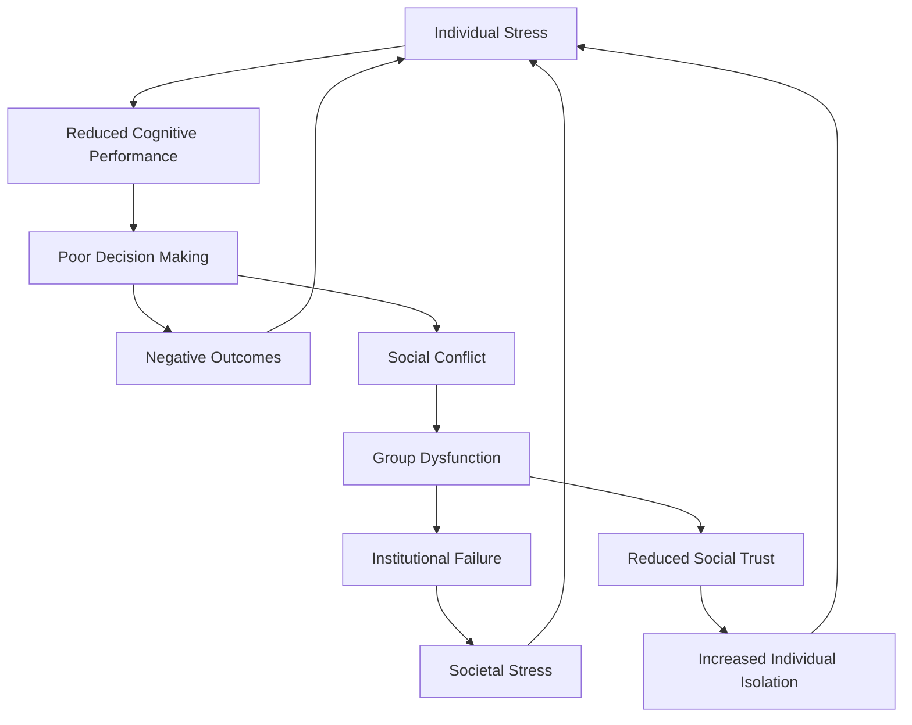
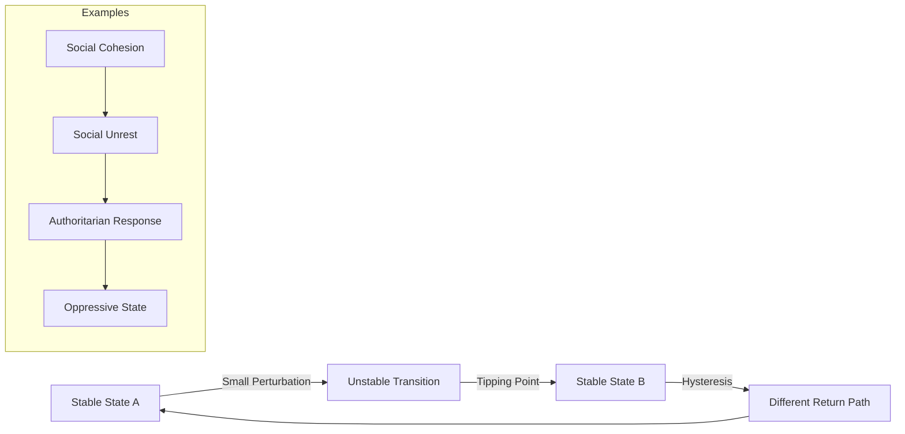
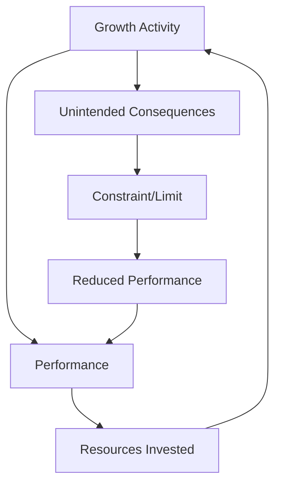
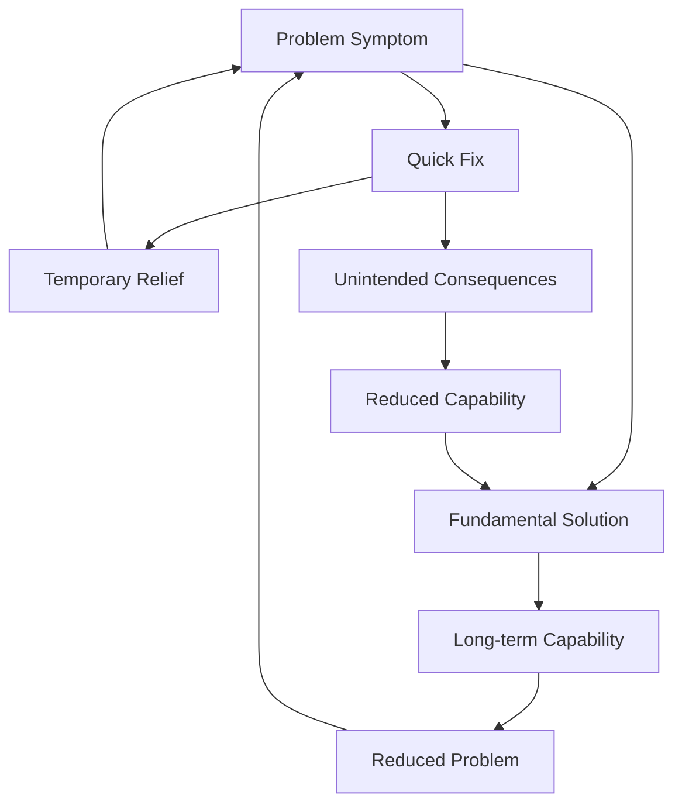
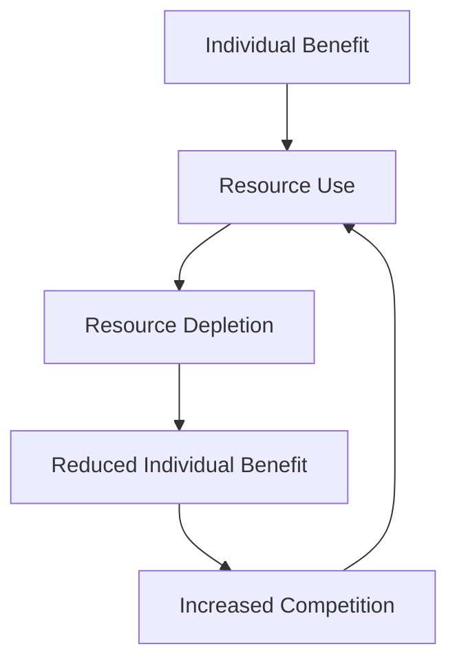

# Systems Theory Perspective on Human Dysfunction

**Discipline:** Systems Theory, Complexity Science  
**Level:** Cross-Level Integration  
**Keywords:** feedback loops, emergent properties, systems dynamics, complexity theory, nonlinear systems  
**Related Documents:** Individual Psychology, Group Dynamics, Societal Systems

## Abstract

This document applies systems theory and complexity science to understand human dysfunction as emergent properties of complex adaptive systems. By analyzing feedback loops, nonlinear dynamics, and emergent behaviors across individual, group, and societal levels, we reveal how seemingly rational components can produce irrational system-level outcomes. The analysis demonstrates that human problems are not merely aggregations of individual pathologies but represent fundamental properties of complex social systems operating under constraints of bounded rationality, information asymmetries, and evolutionary mismatches.

## Introduction

Systems theory provides a powerful lens for understanding human dysfunction by shifting focus from individual components to relationships, patterns, and emergent properties. Unlike reductionist approaches that seek to explain complex phenomena through their constituent parts, systems thinking recognizes that the behavior of complex systems cannot be predicted from knowledge of individual components alone. Human social systems exhibit all the hallmarks of complex adaptive systems: nonlinear dynamics, emergent properties, feedback loops, self-organization, and sensitivity to initial conditions.

The application of systems theory to human problems reveals that dysfunction often emerges from the interaction of otherwise functional components. Individual humans, while possessing cognitive limitations and biases, can function adequately in simple environments. However, when these individuals interact in complex social systems, their limitations compound and amplify, creating system-level pathologies that transcend individual psychology.

## Theoretical Framework

### Complex Adaptive Systems Theory

Human social systems exhibit the fundamental characteristics of complex adaptive systems (CAS), which helps explain why they often produce counterintuitive and dysfunctional outcomes despite being composed of intelligent individuals. Understanding these characteristics is crucial for comprehending how human problems emerge from system-level properties rather than individual pathologies.

| CAS Property | Human System Manifestation | Dysfunction Implications |
|--------------|----------------------------|-------------------------|
| **Emergence** | Collective behaviors arise from individual interactions | Group irrationality from individual rationality |
| **Self-Organization** | Social structures form without central planning | Spontaneous formation of dysfunctional hierarchies |
| **Adaptation** | Systems evolve in response to environmental pressures | Maladaptive responses to novel environments |
| **Nonlinearity** | Small changes can have large effects | Minor policy changes trigger social upheaval |
| **Feedback Loops** | System outputs influence future inputs | Vicious cycles of dysfunction |
| **Path Dependence** | History constrains future possibilities | Lock-in to suboptimal social arrangements |

**Emergence** in human systems refers to how collective behaviors and properties arise from individual interactions that cannot be predicted from knowledge of individual psychology alone. For example, individual rational decision-making can aggregate into collective irrationality, as seen in market bubbles where each person's decision to buy seems reasonable given what others are doing, yet the collective result is an unsustainable price spiral. This emergence explains why social problems persist even when individuals are intelligent and well-intentioned.

**Self-Organization** describes how social structures form spontaneously without central planning or design. While this can create beneficial institutions like markets and communities, it can also lead to dysfunctional hierarchies, discrimination patterns, and social stratification that serve no beneficial purpose. These emergent structures often become self-perpetuating even when they harm overall system performance, because they serve the interests of those who benefit from them.

**Adaptation** in human systems involves evolutionary responses to environmental pressures, but these responses are often maladaptive when environments change rapidly. Human psychological and social mechanisms evolved for small-group hunter-gatherer societies, and their application to modern complex societies often produces dysfunction. For example, in-group loyalty and out-group hostility were adaptive in ancestral environments but become problematic in diverse modern societies.

**Nonlinearity** means that small changes can have disproportionately large effects, while large efforts sometimes produce minimal results. This explains why minor policy changes can trigger social upheaval, while major reform efforts sometimes fail to create lasting change. Nonlinearity makes social systems difficult to control and predict, as interventions can have unexpected consequences that cascade through the system.

**Feedback Loops** occur when system outputs influence future inputs, creating circular causation that can amplify or dampen changes. Positive feedback loops can create vicious cycles of dysfunction, such as when poverty leads to poor education, which leads to limited opportunities, which perpetuates poverty. Negative feedback loops can provide stability but may also resist beneficial changes.

**Path Dependence** means that historical events and decisions constrain future possibilities, often locking systems into suboptimal arrangements. Once certain institutions, technologies, or cultural patterns become established, they create constituencies and complementary structures that make change difficult even when better alternatives exist. This explains why dysfunctional social arrangements can persist for long periods despite their obvious problems.

### Systems Dynamics Framework

Systems dynamics, developed by Jay Forrester, provides tools for modeling the structure and behavior of complex systems over time. Key concepts include:

- **Stocks and Flows**: Accumulations (social capital, trust, inequality) and rates of change
- **Feedback Loops**: Reinforcing and balancing loops that drive system behavior
- **Delays**: Time lags between causes and effects that create instability
- **Nonlinearities**: Thresholds, limits, and tipping points in system behavior
## Analysis

### Feedback Loops in Human Dysfunction

Human social systems are characterized by multiple interacting feedback loops that can amplify dysfunction across levels. These loops operate at different timescales and often interact in complex ways.

#### Reinforcing Loops (Vicious Cycles)

**Individual Level Reinforcing Loops:**
- Stress → Cognitive Impairment → Poor Decisions → More Stress
- Low Self-Esteem → Social Withdrawal → Reduced Social Skills → Lower Self-Esteem
- Addiction → Neurochemical Changes → Increased Craving → Addiction

**Group Level Reinforcing Loops:**
- Polarization → Echo Chambers → Extreme Views → Greater Polarization
- Distrust → Reduced Cooperation → Poor Outcomes → More Distrust
- Conflict → Dehumanization → Increased Aggression → Escalated Conflict

**Societal Level Reinforcing Loops:**
- Inequality → Political Instability → Economic Disruption → Greater Inequality
- Environmental Degradation → Resource Scarcity → Social Conflict → Environmental Degradation
- Technological Disruption → Social Displacement → Political Backlash → Resistance to Adaptation

#### Balancing Loops (Corrective Mechanisms)

While reinforcing loops amplify dysfunction, balancing loops provide corrective mechanisms that can stabilize systems and prevent runaway processes. However, these corrective mechanisms have inherent limitations and can sometimes become part of the problem they're meant to solve.

| System Level | Balancing Mechanism | Dysfunction Addressed | Limitations |
|--------------|--------------------|--------------------|-------------|
| **Individual** | Stress response systems | Acute threats | Chronic activation causes breakdown |
| **Group** | Social norms and sanctions | Deviant behavior | Can enforce dysfunctional norms |
| **Institutional** | Democratic feedback | Political failures | Vulnerable to capture and manipulation |
| **Market** | Price mechanisms | Resource allocation | Fails with externalities and public goods |

**Individual-Level Balancing Mechanisms**: The human stress response system exemplifies how balancing loops work at the individual level. When faced with acute threats, the fight-or-flight response mobilizes resources to deal with immediate dangers, then returns the body to baseline when the threat passes. However, this system has significant limitations when activated chronically. Modern life often presents ongoing stressors that keep the stress response system activated, leading to physical and mental health problems. The corrective mechanism becomes part of the problem it was designed to solve.

**Group-Level Balancing Mechanisms**: Social norms and sanctions serve as balancing mechanisms that maintain group cohesion and functionality by discouraging deviant behavior. When individuals violate group expectations, social pressure typically brings them back into line, maintaining group stability. However, these mechanisms can also enforce dysfunctional norms, preventing beneficial change and innovation. Groups may sanction members who challenge harmful traditions or propose improvements, using the corrective mechanism to maintain dysfunction rather than health.

**Institutional-Level Balancing Mechanisms**: Democratic feedback systems, including elections, public opinion, and institutional checks and balances, theoretically provide corrective mechanisms for political failures. When leaders or policies perform poorly, democratic processes should replace them with better alternatives. However, these mechanisms are vulnerable to capture and manipulation by powerful interests who can distort information, limit choices, or corrupt the feedback process itself. The corrective mechanism becomes ineffective when those it's meant to control gain influence over its operation.

**Market-Level Balancing Mechanisms**: Price mechanisms in markets serve as balancing loops that allocate resources efficiently by signaling scarcity and abundance. When demand exceeds supply, rising prices encourage conservation and increased production, restoring balance. However, this mechanism fails when dealing with externalities (costs imposed on third parties) and public goods (benefits that can't be captured by producers). Environmental degradation and underprovision of education exemplify how market corrective mechanisms can fail to address important social needs.

### Emergent Properties of Human Systems

Emergence occurs when system-level properties arise that cannot be predicted from knowledge of individual components. Human social systems exhibit multiple forms of emergence:

#### Cognitive Emergence
Individual cognitive biases, when aggregated across populations, create emergent phenomena:
- **Collective Irrationality**: Markets exhibiting bubble behavior despite individual rationality
- **Wisdom of Crowds vs. Madness of Crowds**: Same aggregation mechanism produces opposite outcomes
- **Information Cascades**: Rational individual decisions create collective misinformation

#### Social Emergence
Individual social behaviors combine to create group-level phenomena:
- **Culture**: Shared beliefs and practices that constrain individual behavior
- **Social Stratification**: Hierarchies that emerge from individual status-seeking
- **Collective Action Problems**: Individual rationality preventing group benefits

#### Institutional Emergence
Formal and informal institutions arise from repeated interactions:
- **Bureaucratic Pathologies**: Rule-following behavior creating organizational dysfunction
- **Regulatory Capture**: Institutions serving regulated industries rather than public interest
- **Path Dependence**: Historical accidents becoming locked-in institutional features

### Nonlinear Dynamics and Tipping Points

Human systems exhibit nonlinear behavior where small changes can trigger large-scale transformations. Understanding these dynamics is crucial for predicting system behavior and identifying intervention points.

#### Critical Thresholds in Human Systems

**Individual Level Thresholds:**
- **Stress Tolerance**: Beyond certain levels, stress causes system breakdown rather than adaptation
- **Cognitive Load**: Information processing capacity limits before decision quality degrades
- **Social Connection**: Minimum social contact required for psychological health

**Group Level Thresholds:**
- **Group Size**: Dunbar's number (~150) for maintaining stable social relationships
- **Diversity**: Optimal levels of diversity for group performance vs. cohesion
- **Trust**: Minimum trust levels required for cooperation and collective action

**Societal Level Thresholds:**
- **Inequality**: Gini coefficient levels associated with social instability
- **Environmental Limits**: Planetary boundaries for sustainable human civilization
- **Technological Change**: Rates of change that exceed social adaptation capacity

### System Archetypes in Human Dysfunction

Systems thinking identifies recurring patterns of behavior called system archetypes. These patterns appear across different contexts and scales in human systems:

#### Limits to Growth

**Examples:**
- Economic growth hitting environmental limits
- Population growth exceeding carrying capacity
- Technological development creating new risks

#### Shifting the Burden

**Examples:**
- Treating mental health symptoms with medication while ignoring social causes
- Managing social problems through incarceration rather than addressing root causes
- Using debt to maintain consumption rather than addressing income inequality

#### Tragedy of the Commons

**Examples:**
- Environmental degradation from individual consumption choices
- Social media attention economy depleting collective attention
- Political polarization from individual partisan behavior

## Cross-Level Connections

Systems theory reveals how dysfunction propagates across levels through various mechanisms:

### Upward Causation (Micro to Macro)
Individual behaviors aggregate to create higher-level phenomena:
- Individual cognitive biases → Market bubbles and crashes
- Personal stress responses → Collective anxiety and social tension
- Individual status-seeking → Social inequality and stratification

### Downward Causation (Macro to Micro)
System-level properties constrain and influence individual behavior:
- Cultural norms → Individual identity and behavior patterns
- Economic systems → Individual life choices and opportunities
- Political institutions → Individual civic engagement and trust

### Circular Causation
Bidirectional influence creates feedback loops across levels:
- Individual mental health ↔ Social support systems
- Group polarization ↔ Individual belief formation
- Economic inequality ↔ Political representation

## Historical Context

Systems thinking applied to historical analysis reveals recurring patterns of systemic dysfunction:

### Civilizational Collapse as System Failure
Historical civilizations exhibit common patterns of systemic breakdown:

| Civilization | System Failure Mode | Feedback Loops | Tipping Point |
|--------------|--------------------|--------------|--------------| 
| **Roman Empire** | Administrative overstretch | Military costs → Economic strain → Political instability | Barbarian invasions |
| **Maya Civilization** | Environmental degradation | Population growth → Deforestation → Agricultural failure | Drought periods |
| **Soviet Union** | Information system failure | Central planning → Information distortion → Economic inefficiency | Economic stagnation |

### Recurring Crisis Patterns
Systems analysis reveals that many historical crises follow similar patterns:
- **Boom-Bust Cycles**: Positive feedback during growth, negative feedback during contraction
- **Revolutionary Cycles**: Gradual pressure buildup followed by rapid system reorganization
- **Technological Disruption**: Innovation → Social displacement → Adaptation or breakdown

## Contemporary Manifestations

Modern human systems exhibit increasingly complex forms of dysfunction due to:

### Accelerating Feedback Loops
Technology has accelerated the speed of feedback loops:
- **Financial Markets**: High-frequency trading creates microsecond feedback loops
- **Social Media**: Instant global communication amplifies social contagion
- **Climate Change**: Accelerating feedback loops in Earth systems

### Increased System Coupling
Modern systems are more tightly coupled, meaning failures propagate more rapidly:
- **Global Supply Chains**: Local disruptions create worldwide effects
- **Financial Networks**: Bank failures trigger systemic crises
- **Information Networks**: Misinformation spreads globally in hours

### Novel Emergent Properties
New technologies create unprecedented emergent phenomena:
- **Artificial Intelligence**: Machine learning systems exhibiting unexpected behaviors
- **Social Networks**: Digital platforms creating new forms of social organization
- **Biotechnology**: Genetic engineering with unpredictable ecological effects

## Implications

### For Understanding Human Problems
Systems thinking fundamentally changes how we understand human dysfunction:
- **Focus on Relationships**: Problems emerge from interactions, not just individual pathologies
- **Leverage Points**: Small changes in system structure can have large effects
- **Unintended Consequences**: Well-intentioned interventions can worsen problems
- **Temporal Dynamics**: Understanding delays and feedback loops is crucial for effective action

### For Intervention Strategies
Systems perspective suggests different approaches to addressing human problems:

#### High-Leverage Interventions
- **Changing System Structure**: Modifying rules, incentives, and information flows
- **Shifting Mental Models**: Changing the paradigms that create systems
- **Building System Capacity**: Strengthening feedback loops and adaptive capacity

#### Avoiding System Traps
- **Policy Resistance**: Avoiding interventions that trigger compensating feedback
- **Fixes that Fail**: Recognizing when quick fixes create long-term problems
- **Limits to Growth**: Identifying and addressing system constraints before crisis

### For Future Research
Systems thinking opens new research directions:
- **Complex Systems Modeling**: Using computational models to understand system behavior
- **Network Analysis**: Mapping relationships and influence patterns in social systems
- **Intervention Design**: Developing system-aware approaches to social problems

## Limitations

### Theoretical Limitations
Systems theory, while powerful, has important limitations:
- **Complexity**: Real systems may be too complex for complete understanding
- **Prediction**: Nonlinear systems are inherently difficult to predict
- **Reductionism**: Some phenomena may require component-level analysis
- **Measurement**: System properties are often difficult to quantify

### Practical Limitations
Applying systems thinking faces practical challenges:
- **Time Horizons**: System effects often occur over long time periods
- **Political Constraints**: System solutions may conflict with short-term interests
- **Cognitive Limitations**: Humans struggle to think systemically
- **Implementation**: Changing systems requires coordinated action across multiple actors

### Methodological Limitations
Systems analysis methods have inherent constraints:
- **Model Validity**: Models are simplifications that may miss crucial dynamics
- **Data Requirements**: System analysis requires extensive, high-quality data
- **Causal Inference**: Distinguishing correlation from causation in complex systems
- **Intervention Testing**: Ethical and practical limits on system experimentation

## References

1. Forrester, J. W. (1961). *Industrial Dynamics*. MIT Press.
2. Meadows, D. H. (2008). *Thinking in Systems: A Primer*. Chelsea Green Publishing.
3. Senge, P. M. (1990). *The Fifth Discipline: The Art and Practice of the Learning Organization*. Doubleday.
4. Holland, J. H. (1995). *Hidden Order: How Adaptation Builds Complexity*. Addison-Wesley.
5. Sterman, J. D. (2000). *Business Dynamics: Systems Thinking and Modeling for a Complex World*. McGraw-Hill.
6. Bar-Yam, Y. (1997). *Dynamics of Complex Systems*. Addison-Wesley.
7. Miller, J. H., & Page, S. E. (2007). *Complex Adaptive Systems: An Introduction to Computational Models of Social Life*. Princeton University Press.

## Cross-References

- [See: Individual → Cognitive Architecture] - Understanding individual cognitive limitations that contribute to system dysfunction
- [Related: Group → Collective Behavior] - How individual behaviors aggregate into collective phenomena
- [Compare: Societal → Political Systems Failure] - System-level analysis of political dysfunction
- [See: Historical → Civilizational Collapse] - Historical examples of system failure
- [Related: Integrative → Complexity Science] - Mathematical and computational approaches to complex systems

---

**Navigation:**  
← [Societal Level Analysis] | [Integrative Analysis Index] | [Complexity Science →]