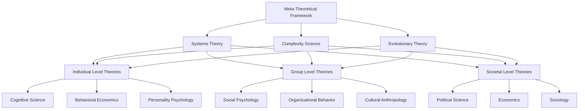

# Theoretical Synthesis: Integrating Multiple Frameworks for Understanding Human Dysfunction

**Discipline:** Theoretical Integration, Meta-Analysis, Philosophy of Science  
**Level:** Cross-Level Integration  
**Keywords:** theoretical integration, paradigm synthesis, meta-theory, framework unification, interdisciplinary analysis  
**Related Documents:** All previous analyses, Systems Theory, Complexity Science, Cross-Level Integration

## Abstract

This document synthesizes multiple theoretical frameworks employed throughout the documentation system to create a coherent meta-theoretical understanding of human dysfunction. By integrating insights from evolutionary psychology, cognitive science, social psychology, systems theory, complexity science, and other disciplines, we develop a unified framework that explains how human problems emerge from the interaction of biological constraints, psychological limitations, social dynamics, and systemic properties. The synthesis reveals that human dysfunction represents not random pathology but predictable consequences of fundamental tensions between evolved human nature and the complex environments humans have created. This integrated understanding provides a foundation for developing more effective approaches to addressing human problems while acknowledging the inherent limitations and trade-offs involved in any intervention strategy.

## Introduction

The analysis of human dysfunction across individual, group, and societal levels has employed numerous theoretical frameworks, each offering valuable but partial insights. Evolutionary psychology explains the biological foundations of human behavior, cognitive science reveals the mechanisms of individual decision-making, social psychology illuminates group dynamics, systems theory provides tools for understanding complex interactions, and complexity science offers mathematical models of emergent phenomena. While each framework contributes essential understanding, none alone can fully explain the multifaceted nature of human problems.

This document attempts a theoretical synthesis that integrates these diverse perspectives into a coherent meta-framework. Rather than privileging one approach over others, the synthesis seeks to identify complementary insights, resolve apparent contradictions, and reveal how different theoretical perspectives address different aspects of the same underlying phenomena. The goal is not to create a single unified theory—which may be impossible given the complexity of human systems—but to develop a framework for understanding how multiple theories can work together to provide more complete explanations.

The synthesis is organized around several key themes: the evolutionary foundations of human psychology, the cognitive architecture that processes information and makes decisions, the social dynamics that emerge from individual interactions, the systemic properties that arise from complex social organization, and the temporal dynamics that govern change and adaptation across all levels. By examining how these themes interact and influence each other, we can develop a more nuanced understanding of why human problems persist and how they might be addressed.

## Theoretical Framework

### Meta-Theoretical Approach

The synthesis employs a **pluralistic realism** that acknowledges multiple valid perspectives on human phenomena while maintaining that these perspectives refer to real features of the world:

**Core Principles**:
1. **Ontological Realism**: Human dysfunction represents real phenomena with objective features
2. **Epistemological Pluralism**: Multiple theoretical frameworks can provide valid but partial knowledge
3. **Methodological Integration**: Different methods appropriate for different aspects of phenomena
4. **Pragmatic Synthesis**: Integration guided by explanatory power and practical utility

**Integration Strategy**:
- **Horizontal Integration**: Combining insights from different disciplines at the same level of analysis
- **Vertical Integration**: Connecting explanations across different levels of organization
- **Temporal Integration**: Linking processes operating on different timescales
- **Causal Integration**: Mapping complex causal relationships between different factors

### Framework Hierarchy

The synthesis organizes theoretical frameworks in a hierarchical structure based on their scope and level of analysis:

### Paradigm Integration Matrix

Different theoretical paradigms emphasize different aspects of human phenomena:

| Paradigm | Focus | Strengths | Limitations | Integration Role |
|----------|-------|-----------|-------------|------------------|
| **Evolutionary** | Ultimate causation, adaptive function | Explains universals, deep time perspective | Limited on proximate mechanisms | Foundational constraints |
| **Cognitive** | Information processing, decision-making | Precise mechanisms, individual focus | Limited on social context | Individual-level processes |
| **Social** | Interpersonal dynamics, cultural patterns | Group phenomena, contextual factors | Limited on individual differences | Group-level emergence |
| **Systems** | Structure, feedback, emergence | Holistic perspective, dynamic interactions | Abstract, difficult to test | Integration framework |
| **Complexity** | Nonlinear dynamics, self-organization | Mathematical precision, emergent properties | Simplified models, prediction limits | Formal modeling tools |

## Analysis

### Evolutionary Foundations as Constraint Structure

Evolutionary theory provides the foundational constraint structure within which all other processes operate:

#### Universal Human Nature

**Cognitive Architecture Constraints**:
All humans share basic cognitive architecture shaped by evolutionary pressures:
- **Attention Systems**: Biased toward threats, novelty, and social information
- **Memory Systems**: Optimized for survival-relevant information, prone to systematic distortions
- **Decision Systems**: Use heuristics adapted to ancestral environments, create systematic biases
- **Learning Systems**: Prepared to acquire certain types of information (language, social norms, fears)

**Motivational Systems**:
Universal motivational systems create predictable behavioral patterns:
- **Survival Drives**: Self-preservation, resource acquisition, threat avoidance
- **Reproductive Drives**: Mate selection, parental investment, sexual competition
- **Social Drives**: Status seeking, group belonging, reciprocity, reputation management
- **Cognitive Drives**: Curiosity, pattern recognition, causal understanding, meaning-making

#### Evolutionary Mismatches

**Environmental Discontinuities**:
Modern environments differ dramatically from ancestral conditions:

| Ancestral Environment | Modern Environment | Mismatch Effects |
|----------------------|-------------------|------------------|
| **Small groups (50-150)** | Mass societies (millions) | Social cognitive overload, anonymity effects |
| **Face-to-face interaction** | Digital mediation | Reduced empathy, miscommunication |
| **Immediate feedback** | Delayed consequences | Poor long-term decision-making |
| **Physical threats** | Abstract risks | Misallocated fear and attention |
| **Resource scarcity** | Abundance (for some) | Overconsumption, addiction vulnerability |
| **Egalitarian groups** | Hierarchical institutions | Status anxiety, inequality stress |

**Temporal Mismatches**:
- **Individual Development**: Evolved for shorter lifespans, different life stages
- **Social Change**: Evolved for stable environments, struggle with rapid change
- **Technological Adaptation**: Biological evolution too slow for technological change
- **Cultural Evolution**: Faster than genetic evolution, creates adaptation lags

### Cognitive Architecture as Processing System

Cognitive science reveals the mechanisms through which evolutionary constraints operate:

#### Dual-Process Architecture

**System 1 (Fast, Automatic)**:
- Evolutionary older, shared with other species
- Rapid, unconscious, emotion-driven processing
- Heuristic-based, pattern-matching decisions
- Adaptive for immediate survival decisions
- Source of systematic biases in modern contexts

**System 2 (Slow, Controlled)**:
- Evolutionary newer, uniquely human capacity
- Deliberate, conscious, reason-driven processing
- Rule-based, analytical decisions
- Adaptive for novel, complex problems
- Limited capacity, easily overwhelmed

**Integration Challenges**:
- System 1 dominates under stress, time pressure, cognitive load
- System 2 required for modern complex decisions
- Conflict between systems creates internal inconsistency
- Training can improve System 2 function but cannot eliminate System 1 biases

#### Information Processing Limitations

**Attention Bottlenecks**:
- Limited capacity for simultaneous information processing
- Selective attention creates blind spots and tunnel vision
- Attention captured by evolutionarily salient stimuli
- Modern information overload overwhelms attention systems

**Memory Distortions**:
- Memory reconstruction rather than replay
- Systematic biases in encoding, storage, and retrieval
- Social and emotional influences on memory accuracy
- False memories and confabulation as normal processes

**Reasoning Limitations**:
- Confirmation bias and motivated reasoning
- Difficulty with probabilistic and statistical thinking
- Overconfidence in judgment accuracy
- Susceptibility to framing and context effects

### Social Dynamics as Emergent Phenomena

Social psychology reveals how individual cognitive processes interact to create group-level phenomena:

#### Social Influence Mechanisms

**Conformity Processes**:
Individual uncertainty + Social information → Conformity pressure
- **Informational Influence**: Others' behavior as evidence of correct action
- **Normative Influence**: Desire for social acceptance and approval
- **Identification**: Adoption of group identity and associated behaviors
- **Internalization**: Private acceptance of group beliefs and values

**Authority and Hierarchy**:
Evolved deference to authority + Modern institutional complexity → Problematic obedience
- **Legitimate Authority**: Recognition of rightful power and expertise
- **Authority Gradients**: Hierarchical communication and decision patterns
- **Diffusion of Responsibility**: Reduced individual accountability in hierarchies
- **System Justification**: Psychological motivation to defend existing arrangements

#### Group Process Dynamics

**Collective Decision-Making**:
Individual biases + Group interaction → Amplified dysfunction
- **Groupthink**: Pressure for consensus overrides critical evaluation
- **Polarization**: Group discussion amplifies initial tendencies
- **Social Loafing**: Reduced individual effort in group contexts
- **Diffusion of Responsibility**: Reduced accountability in group decisions

**Intergroup Relations**:
In-group favoritism + Out-group derogation → Conflict and discrimination
- **Social Identity**: Group membership as source of self-esteem
- **Realistic Conflict**: Competition for resources creates hostility
- **Symbolic Threats**: Perceived challenges to group values and identity
- **Contact Effects**: Conditions under which intergroup contact reduces prejudice

### Systemic Properties as Constraint and Enablement

Systems theory reveals how social structures both constrain and enable individual and group behavior:

#### Institutional Frameworks

**Formal Institutions**:
Rules, laws, and procedures that structure social interaction:
- **Property Rights**: Define resource access and control
- **Political Systems**: Determine decision-making processes and power distribution
- **Legal Systems**: Establish behavioral constraints and enforcement mechanisms
- **Economic Systems**: Structure production, distribution, and exchange

**Informal Institutions**:
Norms, customs, and cultural practices that guide behavior:
- **Social Norms**: Shared expectations about appropriate behavior
- **Cultural Values**: Deep beliefs about what is important and desirable
- **Trust Networks**: Relationships that enable cooperation and exchange
- **Reputation Systems**: Mechanisms for maintaining accountability

#### System Dynamics

**Feedback Loops**:
System outputs influence future inputs, creating dynamic behavior:
- **Positive Feedback**: Amplifies changes, can create instability or growth
- **Negative Feedback**: Dampens changes, promotes stability and equilibrium
- **Delayed Feedback**: Time lags between actions and consequences
- **Nonlinear Feedback**: Small changes can have large effects

**Emergent Properties**:
System-level characteristics that cannot be predicted from components:
- **Collective Intelligence**: Group problem-solving exceeding individual capabilities
- **Cultural Evolution**: Change in shared beliefs and practices over time
- **Market Dynamics**: Price formation and resource allocation through exchange
- **Political Legitimacy**: Acceptance of authority and governance systems

### Complexity Science as Mathematical Framework

Complexity science provides mathematical tools for modeling the dynamics revealed by other frameworks:

#### Network Effects

**Social Networks**:
Individual relationships aggregate into network structures with emergent properties:
- **Small World Networks**: High clustering with short path lengths
- **Scale-Free Networks**: Power-law degree distributions with hub nodes
- **Community Structure**: Dense internal connections, sparse external connections
- **Network Dynamics**: Evolution of network structure over time

**Information Flow**:
Network structure determines how information, influence, and behaviors spread:
- **Contagion Processes**: Simple spreading like disease transmission
- **Complex Contagion**: Threshold effects requiring multiple exposures
- **Cascade Failures**: Local failures propagating through network connections
- **Viral Phenomena**: Rapid, widespread adoption of behaviors or beliefs

#### Phase Transitions

**Critical Phenomena**:
Systems near critical points exhibit sudden transitions between qualitatively different states:
- **Order-Disorder Transitions**: Between organized and chaotic behavior
- **Percolation Transitions**: Between disconnected and connected network states
- **Synchronization Transitions**: Between independent and coordinated behavior
- **Consensus Formation**: Between diverse opinions and collective agreement

**Tipping Points**:
Critical thresholds where small changes trigger large-scale transformations:
- **Social Movements**: Minority opinions becoming majority positions
- **Cultural Change**: Gradual shifts reaching critical mass for rapid transformation
- **Economic Bubbles**: Gradual price increases leading to sudden collapse
- **Political Revolution**: Accumulated grievances triggering system change

### Temporal Integration Across Scales

Different processes operate on different timescales, requiring temporal integration:

#### Multi-Scale Temporal Dynamics

**Individual Timescales**:
- **Milliseconds**: Neural processing, reflexive responses
- **Seconds**: Conscious decisions, emotional reactions
- **Minutes to Hours**: Learning episodes, social interactions
- **Days to Weeks**: Habit formation, relationship development
- **Months to Years**: Personality change, skill acquisition
- **Decades**: Life course development, generational effects

**Social Timescales**:
- **Minutes to Hours**: Group decision-making, conflict episodes
- **Days to Weeks**: Norm establishment, role formation
- **Months to Years**: Organizational change, cultural shifts
- **Decades**: Institutional evolution, generational replacement
- **Centuries**: Cultural evolution, civilizational development

**System Timescales**:
- **Years**: Policy cycles, economic fluctuations
- **Decades**: Institutional transformation, technological adoption
- **Centuries**: Cultural evolution, environmental change
- **Millennia**: Genetic evolution, species-level adaptation

#### Temporal Coordination Problems

**Speed Mismatches**:
- Fast individual adaptation vs. slow institutional change
- Rapid technological change vs. slow cultural adaptation
- Quick emotional responses vs. slow rational deliberation
- Immediate costs vs. long-term benefits

**Synchronization Challenges**:
- Coordinating actions across different temporal scales
- Aligning short-term incentives with long-term goals
- Managing transitions between different system states
- Balancing stability and adaptability

## Cross-Level Connections

### Theoretical Integration Across Levels

The synthesis reveals how different theoretical frameworks address different aspects of multi-level phenomena:

#### Micro-Foundations of Macro-Phenomena

**Individual Psychology → Group Dynamics**:
- Cognitive biases → Collective irrationality
- Social motivations → Group formation and cohesion
- Learning mechanisms → Cultural transmission
- Emotional contagion → Collective behavior

**Group Processes → Institutional Structures**:
- Repeated interactions → Norm crystallization
- Power dynamics → Hierarchical institutions
- Collective problem-solving → Governance systems
- Cultural evolution → Value institutionalization

#### Macro-Constraints on Micro-Processes

**Institutional Structures → Group Formation**:
- Legal frameworks → Permissible group activities
- Economic systems → Resource-based group formation
- Political systems → Interest group organization
- Cultural systems → Identity-based group boundaries

**Cultural Context → Individual Psychology**:
- Value systems → Individual goal formation
- Narrative frameworks → Identity construction
- Social categories → Cognitive schema development
- Behavioral norms → Habit formation patterns

### Causal Integration

The synthesis maps complex causal relationships between different factors:

#### Multiple Causation Pathways

**Proximate vs. Ultimate Causation**:
- **Proximate**: Immediate mechanisms (cognitive processes, social interactions)
- **Ultimate**: Evolutionary functions (survival, reproduction, group cooperation)
- **Integration**: Proximate mechanisms shaped by ultimate functions

**Efficient vs. Formal Causation**:
- **Efficient**: Push causation through mechanical processes
- **Formal**: Pull causation through structural constraints and attractors
- **Integration**: Both types operate simultaneously in social systems

#### Circular Causation

**Individual ↔ Group ↔ Society**:
- Individuals create groups through interaction
- Groups socialize individuals through norms and roles
- Groups create institutions through collective action
- Institutions structure group formation and individual opportunities
- Circular causation creates stable patterns and change resistance

**Structure ↔ Agency**:
- Social structures constrain individual choices
- Individual actions reproduce or transform structures
- Agency operates within structural constraints
- Structures emerge from aggregated individual actions

### Paradigm Complementarity

Different paradigms provide complementary rather than competing explanations:

#### Levels of Explanation

**Evolutionary Psychology**: Why humans have the psychological tendencies they do
**Cognitive Science**: How these tendencies operate in information processing
**Social Psychology**: How individual tendencies interact to create group phenomena
**Systems Theory**: How group phenomena aggregate to create institutional structures
**Complexity Science**: Mathematical models of how all these processes interact

#### Temporal Perspectives

**Evolutionary**: Deep time perspective on species-level adaptation
**Historical**: Medium-term perspective on cultural and institutional development
**Developmental**: Individual lifespan perspective on learning and change
**Situational**: Immediate perspective on decision-making and behavior

#### Methodological Integration

**Experimental**: Controlled studies of specific mechanisms
**Observational**: Natural studies of real-world phenomena
**Computational**: Mathematical models of complex interactions
**Historical**: Long-term analysis of patterns and trends
**Ethnographic**: Detailed studies of cultural contexts

## Historical Context

### Theoretical Development Trajectories

The integration of multiple frameworks reflects the historical development of social science:

#### Disciplinary Evolution

**19th Century Foundations**:
- Psychology emerges from philosophy and physiology
- Sociology develops from political economy and moral philosophy
- Anthropology grows from natural history and colonial administration
- Economics formalizes from moral philosophy and practical concerns

**20th Century Specialization**:
- Disciplines develop distinct methods and theoretical frameworks
- Increasing specialization and technical sophistication
- Reduced communication across disciplinary boundaries
- Fragmentation of knowledge about human phenomena

**21st Century Integration**:
- Recognition of limitations of single-discipline approaches
- Development of interdisciplinary fields and methods
- Computational tools enabling complex system analysis
- Growing emphasis on synthesis and integration

#### Paradigm Shifts

**Behaviorism → Cognitivism**:
- From focus on observable behavior to internal mental processes
- Recognition of information processing and computational metaphors
- Integration of psychology with computer science and neuroscience

**Individual → Social**:
- From focus on individual psychology to social context
- Recognition of cultural and situational influences on behavior
- Integration of psychology with sociology and anthropology

**Static → Dynamic**:
- From focus on stable structures to dynamic processes
- Recognition of change, adaptation, and evolution
- Integration with systems theory and complexity science

### Synthesis Precedents

Previous attempts at theoretical integration provide lessons:

#### Successful Integrations

**Evolutionary Synthesis** (1930s-1940s):
- Integration of genetics, paleontology, and systematics
- Unified understanding of evolution through natural selection
- Lessons: Common mathematical framework, empirical validation

**Cognitive Revolution** (1950s-1960s):
- Integration of psychology, computer science, and linguistics
- Unified understanding of mind as information processing system
- Lessons: Technological tools, interdisciplinary collaboration

**Behavioral Economics** (1970s-present):
- Integration of psychology and economics
- Recognition of systematic deviations from rational choice
- Lessons: Empirical focus, practical applications

#### Failed Integration Attempts

**Grand Unified Theories**:
- Attempts to create single theories explaining all social phenomena
- Generally failed due to complexity and diversity of phenomena
- Lessons: Pluralism may be more appropriate than unification

**Reductionist Programs**:
- Attempts to reduce higher-level phenomena to lower-level mechanisms
- Failed to capture emergent properties and contextual effects
- Lessons: Multiple levels of analysis needed

## Contemporary Manifestations

### Current Integration Challenges

Modern developments create new challenges for theoretical integration:

#### Technological Disruption

**Digital Technologies**:
- Create new forms of social interaction and organization
- Challenge existing theories developed for face-to-face interaction
- Require integration of computer science and social science perspectives

**Artificial Intelligence**:
- Creates hybrid human-AI systems with novel properties
- Challenges assumptions about human uniqueness and agency
- Requires integration of cognitive science and computer science

**Biotechnology**:
- Enables modification of biological foundations of behavior
- Challenges assumptions about fixed human nature
- Requires integration of biology and social science

#### Global Challenges

**Climate Change**:
- Requires integration across multiple timescales and levels
- Challenges existing institutional and cultural frameworks
- Demands coordination of natural and social sciences

**Inequality**:
- Operates across individual, group, and societal levels
- Requires integration of economic, psychological, and political perspectives
- Challenges assumptions about meritocracy and justice

**Information Warfare**:
- Exploits cognitive biases and social dynamics
- Requires integration of psychology, computer science, and political science
- Challenges assumptions about rational democratic discourse

### Emerging Synthesis Opportunities

New developments create opportunities for theoretical integration:

#### Computational Social Science

**Big Data Analytics**:
- Enables analysis of large-scale social phenomena
- Provides empirical tests of theoretical predictions
- Facilitates integration across disciplines through shared data

**Agent-Based Modeling**:
- Allows simulation of complex social systems
- Enables testing of theoretical integration
- Provides bridge between individual and system-level theories

**Network Analysis**:
- Reveals structure of social relationships
- Enables analysis of information and influence flow
- Provides mathematical framework for social phenomena

#### Neuroscience Integration

**Social Neuroscience**:
- Reveals neural mechanisms of social behavior
- Provides biological foundation for social psychological theories
- Enables integration of individual and social levels of analysis

**Neuroeconomics**:
- Reveals neural mechanisms of economic decision-making
- Provides biological foundation for behavioral economics
- Enables integration of psychology and economics

**Cultural Neuroscience**:
- Reveals how culture shapes neural processes
- Provides mechanism for cultural influence on cognition
- Enables integration of anthropology and neuroscience

## Implications

### For Understanding Human Problems

The theoretical synthesis provides several key insights:

#### Fundamental Tensions

**Nature vs. Nurture Resolution**:
- Both genetic and environmental factors important
- Gene-environment interactions create complex patterns
- Cultural evolution operates on genetic foundations
- Neither deterministic nor infinitely plastic

**Individual vs. Social Resolution**:
- Individual psychology and social context mutually constitutive
- Neither reducible to the other
- Circular causation creates stable patterns
- Change requires intervention at multiple levels

**Structure vs. Agency Resolution**:
- Social structures constrain but don't determine individual action
- Individual actions reproduce or transform structures
- Agency operates within structural constraints
- Change possible but constrained by existing arrangements

#### Predictable Patterns

**Universal Tendencies**:
- Certain problems predictable from human nature
- Cognitive biases create systematic errors
- Social dynamics create predictable group phenomena
- System dynamics create recurring institutional problems

**Contextual Variations**:
- Universal tendencies expressed differently in different contexts
- Cultural and institutional factors shape expression
- Historical contingency creates path dependence
- Local adaptation creates diversity

#### Intervention Implications

**Multi-Level Interventions**:
- Single-level interventions often fail or create new problems
- Effective interventions coordinate across levels
- Timing and sequencing important for success
- Unintended consequences common and predictable

**Leverage Points**:
- Some intervention points more effective than others
- Structural changes often more powerful than individual changes
- Cultural changes often more durable than policy changes
- Prevention often more effective than treatment

### For Future Research

The synthesis suggests several research priorities:

#### Theoretical Development

**Integration Mechanisms**:
- How do different levels of analysis connect?
- What are the mechanisms of emergence and constraint?
- How do different timescales interact?
- What are the limits of integration?

**Causal Modeling**:
- How can we model complex causation?
- What are appropriate methods for circular causation?
- How can we distinguish correlation from causation?
- What are the limits of prediction in complex systems?

#### Empirical Research

**Cross-Level Studies**:
- Studies that measure phenomena at multiple levels simultaneously
- Longitudinal studies that track change across levels over time
- Natural experiments that reveal causal relationships
- Comparative studies across different contexts

**Integration Testing**:
- Studies that test predictions from integrated theories
- Studies that compare single-level vs. multi-level explanations
- Studies that test intervention strategies based on integration
- Studies that identify boundary conditions for theoretical integration

#### Methodological Development

**Computational Methods**:
- Agent-based models that integrate multiple theoretical frameworks
- Network analysis methods for multi-level phenomena
- Machine learning approaches to pattern recognition
- Simulation methods for testing theoretical integration

**Measurement Methods**:
- Methods for measuring phenomena at multiple levels
- Methods for tracking change across different timescales
- Methods for assessing causal relationships in complex systems
- Methods for validating theoretical integration

### For Practical Applications

The synthesis has implications for addressing human problems:

#### Policy Design

**Evidence-Based Policy**:
- Policies should be based on integrated understanding
- Multiple theoretical perspectives should inform policy design
- Unintended consequences should be anticipated and monitored
- Adaptive management approaches should be employed

**Multi-Level Coordination**:
- Policies should coordinate across individual, group, and societal levels
- Different levels may require different intervention strategies
- Timing and sequencing of interventions important
- Feedback mechanisms should connect different levels

#### Institutional Design

**Adaptive Institutions**:
- Institutions should be designed for change and learning
- Multiple feedback mechanisms should be built in
- Diversity and redundancy should be maintained
- Flexibility should be balanced with stability

**Human-Centered Design**:
- Institutions should account for human psychological limitations
- Cognitive biases should be anticipated and managed
- Social dynamics should be channeled constructively
- Individual agency should be preserved and enhanced

#### Education and Training

**Integrative Education**:
- Education should integrate multiple disciplinary perspectives
- Systems thinking should be taught alongside analytical thinking
- Historical and cultural perspectives should be included
- Critical thinking and metacognition should be emphasized

**Professional Training**:
- Professionals should understand multiple levels of analysis
- Intervention strategies should be based on integrated understanding
- Collaboration across disciplines should be facilitated
- Continuous learning and adaptation should be emphasized

## Limitations

### Integration Challenges

#### Theoretical Limitations

**Incommensurability**:
- Some theoretical frameworks may be fundamentally incompatible
- Different paradigms may make different ontological assumptions
- Translation between frameworks may lose essential meaning
- Complete integration may be impossible or undesirable

**Complexity Management**:
- Integrated theories may be too complex for practical use
- Simplification may lose essential insights
- Different levels of abstraction may be needed for different purposes
- Parsimony and comprehensiveness may conflict

**Validation Difficulties**:
- Integrated theories harder to test empirically
- Multiple predictions may be difficult to distinguish
- Confirmation bias may favor integration over alternatives
- Falsification may be difficult or impossible

#### Practical Limitations

**Implementation Challenges**:
- Integrated approaches may be difficult to implement
- Multiple expertise may be required
- Coordination costs may be high
- Political and institutional barriers may prevent integration

**Communication Problems**:
- Integrated theories may be difficult to communicate
- Different audiences may need different levels of detail
- Jargon and technical language may create barriers
- Oversimplification may distort essential insights

**Resource Requirements**:
- Integration may require extensive resources
- Multiple methods and data sources may be needed
- Long-term studies may be required
- Interdisciplinary collaboration may be expensive

### Philosophical Limitations

#### Epistemological Issues

**Knowledge Limits**:
- Human cognitive limitations may prevent complete understanding
- Observer effects may influence what can be known
- Cultural biases may shape theoretical development
- Historical contingency may limit generalizability

**Reductionism vs. Emergence**:
- Tension between detailed analysis and holistic understanding
- Difficulty determining appropriate level of description
- Risk of losing important details in integration
- Challenge of maintaining multiple perspectives simultaneously

**Objectivity vs. Subjectivity**:
- Social phenomena involve subjective meanings and interpretations
- Observer perspectives influence what is seen and understood
- Value judgments may influence theoretical development
- Complete objectivity may be impossible or undesirable

#### Practical Philosophy

**Intervention Ethics**:
- Who has the right to intervene in human systems?
- What are the ethical limits of social engineering?
- How should competing values and interests be balanced?
- What are the responsibilities of researchers and practitioners?

**Democratic Values**:
- How can expert knowledge be integrated with democratic decision-making?
- What is the role of public participation in policy design?
- How can individual freedom be balanced with collective welfare?
- What are the limits of technocratic governance?

**Cultural Sensitivity**:
- How can universal theories account for cultural diversity?
- What are the limits of cross-cultural generalization?
- How can local knowledge be integrated with scientific understanding?
- What are the risks of cultural imperialism in theory development?

## References

1. Wilson, E. O. (1998). *Consilience: The Unity of Knowledge*. Knopf.
2. Gell-Mann, M. (1994). *The Quark and the Jaguar: Adventures in the Simple and the Complex*. W. H. Freeman.
3. Bunge, M. (2004). *Emergence and Convergence: Qualitative Novelty and the Unity of Knowledge*. University of Toronto Press.
4. Mitchell, S. D. (2003). *Biological Complexity and Integrative Pluralism*. Cambridge University Press.
5. Wimsatt, W. C. (2007). *Re-Engineering Philosophy for Limited Beings: Piecewise Approximations to Reality*. Harvard University Press.
6. Hedström, P., & Ylikoski, P. (2010). Causal mechanisms in the social sciences. *Annual Review of Sociology*, 36, 49-67.
7. Little, D. (2016). *New Directions in the Philosophy of Social Science*. Rowman & Littlefield.
8. Sawyer, R. K. (2005). *Social Emergence: Societies as Complex Systems*. Cambridge University Press.

## Cross-References

- [See: All Individual Level Documents] - Psychological foundations of integrated framework
- [Related: All Group Level Documents] - Social dynamics in integrated understanding
- [Compare: All Societal Level Documents] - Institutional and cultural factors in synthesis
- [See: Integrative → Systems Theory Perspective] - Systems thinking foundation for integration
- [Related: Integrative → Complexity Science] - Mathematical tools for theoretical integration
- [Compare: Integrative → Cross-Level Integration] - Multi-level analysis framework

---

**Navigation:**  
← [Cross-Level Integration] | [Integrative Analysis Index] | [Documentation System Overview →]