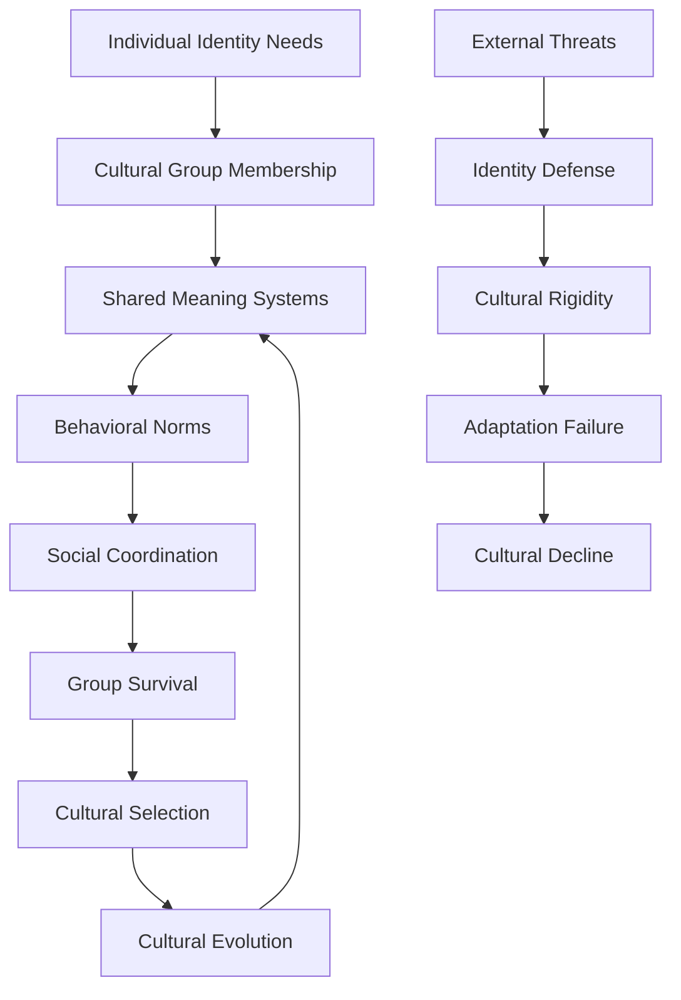
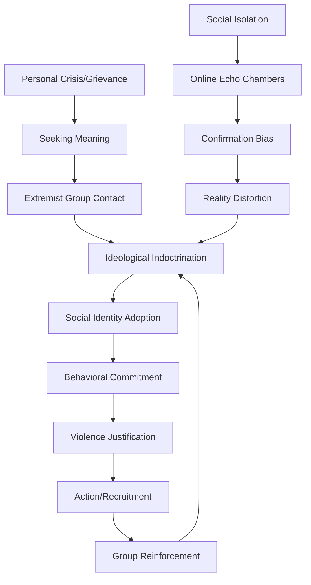
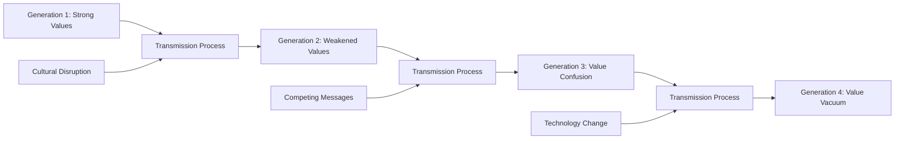
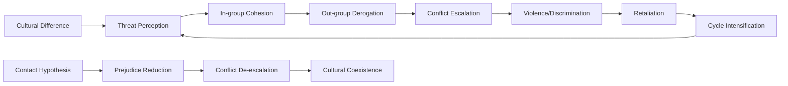

# Cultural Pathology: Ideological Extremism, Value System Collapse, and Cultural Decay

## Abstract

Cultural systems provide the shared meanings, values, and behavioral norms that enable human societies to function cohesively. However, cultures exhibit systematic pathologies including ideological extremism, value system fragmentation, moral decay, and cultural transmission failures. This analysis examines how cultural dysfunction emerges from psychological, social, and institutional factors, tracing patterns from historical cultural collapses to contemporary polarization and meaning crises.

## Introduction

Cultural pathology represents dysfunction in the shared meaning systems that coordinate human social behavior. Unlike individual psychological disorders, cultural pathologies emerge at the collective level through the breakdown of shared values, the rise of extremist ideologies, and the failure of cultural transmission mechanisms.

Contemporary societies face unprecedented cultural challenges including ideological polarization, moral relativism, identity fragmentation, and the erosion of traditional meaning-making institutions. These problems reflect both the psychological vulnerabilities of human meaning-making and the structural features of modern societies that amplify cultural dysfunction.

## Theoretical Framework

### Cultural Evolution Perspective

Cultures evolve through variation, selection, and transmission mechanisms:

- **Cultural variants**: Ideas, practices, and values compete for adoption
- **Selection pressures**: Environmental and social factors favor certain cultural traits
- **Transmission fidelity**: Cultural information degrades across generations
- **Group selection**: Cultures that promote group cohesion have survival advantages

### Social Identity Theory

Cultural identity provides psychological benefits but creates pathological potential:

- **In-group favoritism**: Cultural groups develop superiority beliefs
- **Out-group derogation**: Other cultures become targets of hostility
- **Identity threat response**: Cultural challenges trigger defensive reactions
- **Moral circle expansion/contraction**: Inclusion/exclusion of moral consideration

## Cultural Pathology Types and Manifestations

This taxonomy reveals the systematic ways that cultural systems become dysfunctional, showing how different pathological patterns emerge from specific psychological drivers and manifest in predictable historical patterns. Understanding these types helps identify early warning signs of cultural breakdown and potential intervention points.

| Pathology Type | Core Characteristics | Psychological Drivers | Historical Examples |
|----------------|---------------------|----------------------|-------------------|
| **Ideological Extremism** | Absolute truth claims, violence justification | Certainty need, threat response | Nazi Germany, Khmer Rouge |
| **Moral Relativism** | No objective moral standards | Cognitive dissonance avoidance | Late Roman Empire |
| **Cultural Nihilism** | Meaning and value rejection | Existential despair | Weimar Republic |
| **Identity Fragmentation** | Competing group loyalties | Social complexity overwhelm | Yugoslavia breakup |
| **Fundamentalism** | Literal interpretation, change resistance | Uncertainty intolerance | Various religious movements |
| **Cultural Narcissism** | Superiority complex, criticism rejection | Collective self-esteem protection | Imperial Japan |

**Ideological Extremism** emerges when groups develop absolute truth claims and justify violence against those who disagree. The psychological drivers include the human need for certainty and threat response mechanisms that activate when core beliefs are challenged. Nazi Germany exemplifies how economic crisis and national humiliation can trigger extremist responses that promise simple solutions and clear enemies.

**Moral Relativism** occurs when cultures abandon objective moral standards, often as a response to moral complexity or cultural conflict. The psychological driver is cognitive dissonance avoidance—when moral systems conflict, it becomes easier to reject moral standards entirely than to resolve the contradictions. The Late Roman Empire showed this pattern as diverse cultural influences undermined traditional Roman values.

**Cultural Nihilism** represents the complete rejection of meaning and values, typically emerging from existential despair when traditional meaning systems collapse without replacement. The Weimar Republic experienced this after World War I destroyed faith in progress and civilization, creating a cultural vacuum that extremist movements exploited.

**Identity Fragmentation** occurs when individuals face competing group loyalties that cannot be reconciled, often due to social complexity that overwhelms human capacity for multiple identities. Yugoslavia's breakup illustrates how economic stress can activate dormant ethnic identities that fragment previously unified cultural systems.

**Fundamentalism** involves literal interpretation of cultural texts and resistance to change, driven by uncertainty intolerance and the need for clear, unchanging guidelines. Various religious movements exhibit this pattern when confronted with modernity and cultural change.

**Cultural Narcissism** manifests as collective superiority complexes and rejection of criticism, serving to protect collective self-esteem when cultures face challenges to their dominance. Imperial Japan's belief in cultural superiority and divine mission exemplifies how narcissistic cultural patterns can lead to destructive conflicts.

## Ideological Extremism Mechanisms

### Radicalization Process

This flowchart maps the systematic process by which individuals become radicalized into extremist ideologies, revealing how personal vulnerabilities interact with social and technological factors to create dangerous cultural pathologies. Understanding this process is crucial for early intervention and prevention efforts.

The radicalization process typically begins with a **Personal Crisis or Grievance**—job loss, relationship breakdown, social rejection, or perceived injustice. This creates psychological vulnerability and a desperate **Seeking for Meaning** that makes individuals susceptible to extremist recruitment.

**Extremist Group Contact** often occurs through online platforms, social networks, or community organizations that initially appear to offer support and understanding. This contact leads to **Ideological Indoctrination** where complex social problems are reduced to simple explanations with clear villains and heroes.

**Social Identity Adoption** represents a crucial turning point where the individual begins to define themselves primarily through group membership. This is followed by **Behavioral Commitment** through increasingly demanding group activities that create psychological investment in the ideology.

**Violence Justification** emerges as the individual adopts the group's moral framework that legitimizes harm against designated enemies. This leads to **Action and Recruitment** where the individual either commits violent acts or recruits others, creating **Group Reinforcement** that strengthens commitment and continues the cycle.

The parallel process shows how **Social Isolation** drives individuals toward **Online Echo Chambers** where **Confirmation Bias** operates unchecked, leading to **Reality Distortion** that makes extremist ideologies seem reasonable and necessary. This digital pathway has accelerated radicalization by providing constant reinforcement and removing exposure to contradictory information.

Modern technology has dramatically accelerated this process by providing 24/7 access to extremist content, algorithmic amplification of radical messages, and global networks of like-minded individuals who reinforce each other's beliefs.

### Psychological Foundations of Extremism

- **Need for closure**: Preference for certainty over ambiguity
- **Quest for significance**: Desire to matter and have impact
- **Social identity fusion**: Complete identification with group
- **Moral disengagement**: Justification of harmful actions

### Extremist Ideology Characteristics

Extremist ideologies share common structural features that make them psychologically appealing while promoting dangerous behaviors. Understanding these characteristics helps explain why rational people can be drawn to irrational belief systems and why extremist movements persist despite their obvious destructiveness.

| Feature | Function | Psychological Appeal |
|---------|----------|---------------------|
| **Simple Explanations** | Complexity reduction | Cognitive ease |
| **Clear Enemies** | Blame attribution | Anger direction |
| **Utopian Vision** | Hope provision | Future orientation |
| **Sacred Values** | Meaning creation | Identity anchoring |
| **Martyrdom Glorification** | Death transcendence | Immortality promise |
| **Group Superiority** | Self-esteem boost | Status enhancement |

**Simple Explanations** serve the function of complexity reduction by offering straightforward answers to complex social, economic, and political problems. The psychological appeal lies in cognitive ease—humans prefer simple, clear explanations over complex, nuanced ones because they require less mental effort to process and remember. Extremist ideologies exploit this by reducing multifaceted issues to single causes or solutions, making adherents feel they understand complicated situations that actually require sophisticated analysis.

**Clear Enemies** function to provide blame attribution by identifying specific groups or individuals responsible for problems and suffering. This appeals to the psychological need for anger direction—humans find it psychologically satisfying to have concrete targets for their frustration and resentment rather than accepting that many problems result from complex systemic factors or random events. Extremist movements exploit this by scapegoating minorities, political opponents, or foreign groups.

**Utopian Vision** provides hope by promising a perfect future state that will be achieved once the ideology's goals are accomplished. The psychological appeal lies in future orientation—humans need hope and purpose to maintain motivation and psychological well-being. Extremist ideologies exploit this by offering grandiose visions of transformation that justify present sacrifices and suffering while providing meaning and direction.

**Sacred Values** create meaning by establishing certain beliefs, symbols, or goals as beyond question or compromise. This appeals to the psychological need for identity anchoring—humans require stable reference points for their sense of self and moral orientation. Extremist ideologies exploit this by making their core tenets sacred and unquestionable, providing psychological security while preventing rational evaluation.

**Martyrdom Glorification** offers death transcendence by promising that dying for the cause will result in immortality, honor, or spiritual reward. This appeals to the fundamental human fear of death and desire for immortality—the promise that death in service of the ideology will result in eternal significance. Extremist movements exploit this by creating cultures where self-sacrifice becomes the highest virtue.

**Group Superiority** provides self-esteem boost by claiming that adherents belong to a chosen, superior, or enlightened group destined for greatness. This appeals to the psychological need for status enhancement—humans derive self-worth from group membership and comparative status. Extremist ideologies exploit this by offering membership in an elite group that is morally, intellectually, or spiritually superior to others.

## Value System Collapse Patterns

### Traditional Value Erosion

Modern societies experience systematic value system breakdown:

- **Religious decline**: Secularization reduces transcendent meaning sources
- **Family structure changes**: Traditional kinship systems weaken
- **Community dissolution**: Geographic mobility reduces social bonds
- **Authority delegitimization**: Traditional hierarchies lose credibility

### Moral Foundation Fragmentation

Different groups prioritize different moral foundations, creating systematic conflicts over what constitutes moral behavior. This fragmentation explains why political and cultural groups often seem to be arguing past each other—they are literally operating from different moral frameworks that emphasize different values and concerns.

| Moral Foundation | Conservative Emphasis | Liberal Emphasis | Conflict Potential |
|------------------|----------------------|------------------|-------------------|
| **Care/Harm** | Moderate | High | Low |
| **Fairness/Cheating** | Moderate | High | Low |
| **Loyalty/Betrayal** | High | Low | High |
| **Authority/Subversion** | High | Low | High |
| **Sanctity/Degradation** | High | Low | High |

**Care/Harm Foundation** focuses on protecting others from suffering and promoting well-being. Conservatives show moderate emphasis on this foundation, caring about harm but balancing it against other moral concerns. Liberals show high emphasis, often prioritizing harm reduction above other considerations. The conflict potential is low because both groups value care, though they may disagree on how to achieve it.

**Fairness/Cheating Foundation** emphasizes proportionality, justice, and equal treatment. Like care/harm, conservatives show moderate emphasis while liberals show high emphasis, but both groups value fairness. The conflict potential remains low because disagreements typically focus on what constitutes fair treatment rather than whether fairness matters.

**Loyalty/Betrayal Foundation** emphasizes group cohesion, patriotism, and solidarity with one's community or nation. Conservatives show high emphasis on loyalty, viewing group solidarity as essential for social stability and collective achievement. Liberals show low emphasis, often viewing loyalty as potentially conflicting with universal principles of care and fairness. This creates high conflict potential as conservatives see liberal positions as disloyal while liberals see conservative positions as exclusionary.

**Authority/Subversion Foundation** emphasizes respect for tradition, hierarchy, and legitimate authority structures. Conservatives show high emphasis, viewing authority and tradition as sources of wisdom and social stability. Liberals show low emphasis, often viewing authority skeptically and prioritizing individual autonomy over hierarchical relationships. This creates high conflict potential as conservatives see liberal positions as undermining social order while liberals see conservative positions as oppressive.

**Sanctity/Degradation Foundation** emphasizes purity, dignity, and the sacred nature of certain values, symbols, or practices. Conservatives show high emphasis on sanctity, viewing certain things as sacred and deserving protection from degradation. Liberals show low emphasis, often viewing sanctity concerns as arbitrary restrictions on individual freedom. This creates high conflict potential as conservatives see liberal positions as desecrating important values while liberals see conservative positions as imposing arbitrary restrictions.
| **Liberty/Oppression** | High | High | Moderate |

### Cultural Transmission Failures

## Historical Cultural Decline Patterns

### Ancient Civilizations

| Civilization | Peak Period | Decline Indicators | Cultural Pathology |
|--------------|-------------|-------------------|-------------------|
| **Roman Empire** | 27 BCE-180 CE | Moral decay, hedonism, civic disengagement | Value system collapse |
| **Byzantine Empire** | 330-1453 CE | Religious schisms, court intrigue | Ideological fragmentation |
| **Mayan Civilization** | 250-900 CE | Warfare escalation, ritual extremism | Cultural militarization |
| **Khmer Empire** | 802-1431 CE | Religious conversion conflicts | Identity transformation |

### Modern Cultural Crises

| Case | Period | Crisis Triggers | Cultural Response |
|------|--------|----------------|------------------|
| **Weimar Germany** | 1918-1933 | Military defeat, economic crisis | Extremist ideologies |
| **Cultural Revolution China** | 1966-1976 | Political mobilization | Traditional culture destruction |
| **Iran Islamic Revolution** | 1979 | Modernization backlash | Religious fundamentalism |
| **Yugoslavia Breakup** | 1990s | Economic crisis, nationalism | Ethnic identity extremism |

## Contemporary Cultural Pathologies

### Political Polarization

Modern democracies experience extreme political-cultural division:

- **Affective polarization**: Emotional hostility toward opposing groups
- **Epistemic closure**: Separate information ecosystems
- **Moral conviction**: Political positions become moral imperatives
- **Social sorting**: Political and cultural identities align

### Identity Politics Extremism

Identity-based movements can become pathological:

- **Essentialism**: Fixed, immutable group characteristics
- **Oppression Olympics**: Competition for victim status
- **Cancel culture**: Social punishment for norm violations
- **Intersectionality complexity**: Multiple, conflicting identity demands

### Digital Culture Dysfunction

Technology amplifies cultural pathologies:

| Technology Feature | Cultural Impact | Pathological Outcome |
|-------------------|-----------------|---------------------|
| **Algorithm Curation** | Echo chamber creation | Reality fragmentation |
| **Viral Spread** | Extreme content amplification | Outrage culture |
| **Anonymity** | Disinhibition effects | Toxicity normalization |
| **Instant Feedback** | Validation seeking | Narcissism amplification |
| **Global Reach** | Cultural homogenization | Local identity loss |

## Psychological Mechanisms of Cultural Pathology

### Cognitive Biases in Cultural Perception

- **Confirmation bias**: Seeking information that supports cultural beliefs
- **Availability heuristic**: Recent cultural events seem more important
- **Fundamental attribution error**: Attributing out-group behavior to character flaws
- **System justification**: Rationalizing existing cultural arrangements

### Social Psychology of Cultural Conflict

### Meaning-Making Failures

Individuals require cultural meaning systems for psychological health:

- **Existential anxiety**: Fear of death and meaninglessness
- **Identity coherence**: Need for consistent self-concept
- **Moral guidance**: Framework for ethical decision-making
- **Social belonging**: Connection to larger community

## Cultural Resilience and Adaptation

### Healthy Cultural Evolution

Resilient cultures balance stability and change:

- **Core value preservation**: Maintaining essential cultural elements
- **Adaptive flexibility**: Adjusting to environmental changes
- **Inclusive identity**: Expanding group boundaries appropriately
- **Critical reflection**: Self-examination and improvement capacity

### Cultural Immune Systems

Societies develop mechanisms to resist pathological cultural variants:

- **Educational institutions**: Critical thinking skill development
- **Media diversity**: Multiple information sources
- **Civil society**: Independent organizations and associations
- **Democratic processes**: Peaceful conflict resolution mechanisms

## Cross-Cultural Analysis

### Universal Cultural Vulnerabilities

All cultures exhibit similar pathological potentials:

- **Ethnocentrism**: Own culture superiority beliefs
- **Moral blindness**: Inability to see own moral failures
- **Change resistance**: Preference for familiar over optimal
- **Scapegoating**: Blaming out-groups for problems

### Cultural Variation in Pathology Expression

Different cultures manifest pathologies differently:

| Cultural Dimension | Pathology Expression | Examples |
|-------------------|---------------------|----------|
| **Individualism vs. Collectivism** | Personal vs. group extremism | American individualism vs. Japanese conformity |
| **Power Distance** | Authority vs. equality extremism | Hierarchical vs. egalitarian societies |
| **Uncertainty Avoidance** | Rigidity vs. chaos | Rule-bound vs. flexible cultures |
| **Masculinity vs. Femininity** | Competition vs. cooperation extremism | Achievement vs. relationship focus |

## Future Cultural Risks and Projections

### Emerging Cultural Threats

1. **Artificial Intelligence**: Algorithmic culture curation and manipulation
2. **Virtual Reality**: Escape from shared physical reality
3. **Genetic Enhancement**: New forms of human inequality and identity
4. **Climate Change**: Resource scarcity and migration pressures
5. **Space Colonization**: Cultural fragmentation across planets

### Potential Cultural Transformations

Future cultures may evolve toward:

- **Global culture**: Shared planetary identity and values
- **Fragmented subcultures**: Specialized communities with minimal overlap
- **Hybrid identities**: Multiple, fluid cultural affiliations
- **Post-human culture**: Technology-enhanced human capabilities
- **Ecological culture**: Nature-centered value systems

## Intervention and Prevention Strategies

### Cultural Pathology Prevention

Societies can reduce cultural dysfunction through:

- **Education reform**: Critical thinking and cultural literacy
- **Media regulation**: Preventing extreme content amplification
- **Dialogue facilitation**: Cross-cultural communication programs
- **Institutional design**: Structures that promote cultural health

### Therapeutic Approaches

Addressing cultural pathology requires:

- **Narrative therapy**: Helping groups develop healthier stories
- **Intergroup contact**: Reducing prejudice through positive interaction
- **Meaning reconstruction**: Building new sources of purpose and identity
- **Conflict transformation**: Converting destructive conflict into constructive change

## Cross-References

- [See: Individual Psychology → Existential Psychology](../individual/existential-psychology.md)
- [See: Group Dynamics → Social Psychology](../group/social-psychology.md)
- [Related: Political Systems → Democratic Backsliding](political-systems-failure.md)
- [Compare: Historical Analysis → Civilizational Collapse](../historical/civilizational-collapse.md)

## Conclusion

Cultural pathology represents a fundamental threat to human social organization, manifesting through ideological extremism, value system collapse, and meaning-making failures. These dysfunctions emerge from the interaction between psychological vulnerabilities in human meaning-making and structural features of cultural systems that amplify individual biases into collective pathologies.

Understanding cultural pathology requires integrating insights from psychology, anthropology, sociology, and history. The analysis reveals that cultural problems often stem from the same psychological mechanisms that make culture possible—the need for meaning, identity, and belonging—when these needs are met through pathological cultural variants.

Contemporary cultural challenges including political polarization, identity fragmentation, and digital culture dysfunction reflect both timeless human vulnerabilities and novel features of modern technological society. The speed and scale of cultural change in the digital age may exceed human adaptive capacity, creating new forms of cultural pathology.

Future cultural health depends on developing better understanding of cultural evolution, implementing educational and institutional reforms that promote cultural resilience, and creating new forms of meaning and identity that can withstand the challenges of technological and environmental change. This requires moving beyond purely relativistic approaches to culture to embrace normative frameworks that can distinguish between healthy and pathological cultural variants.

---

*This document is part of the Humanity's Fundamental Problems Documentation System, providing interdisciplinary analysis of societal-level dysfunction patterns.*