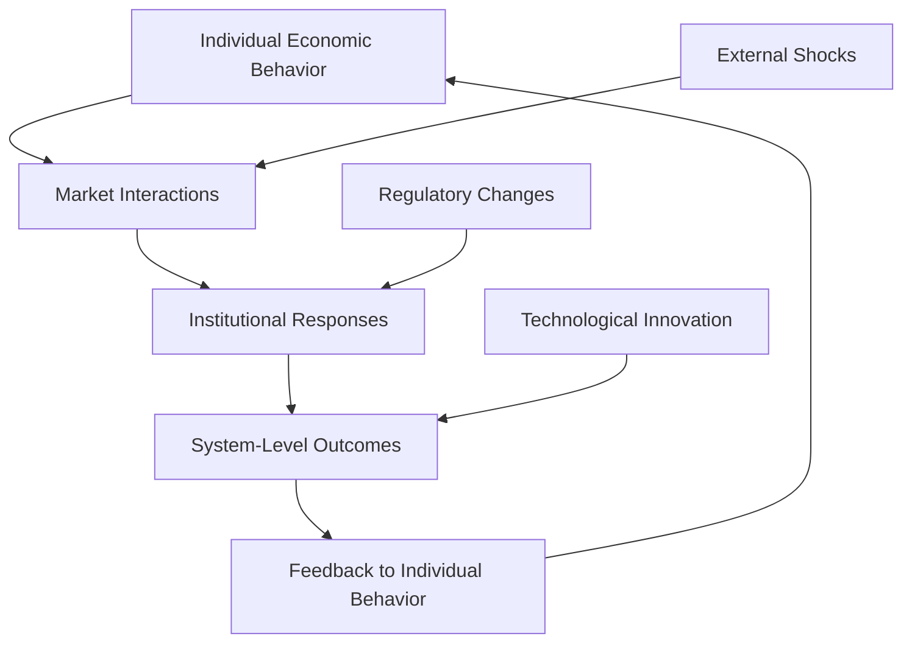
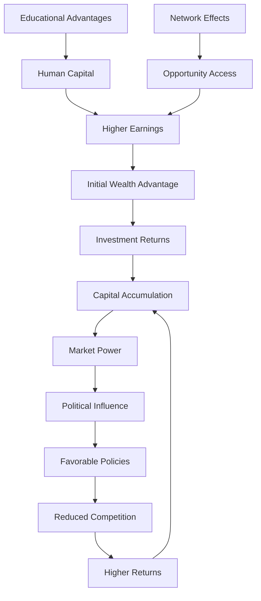
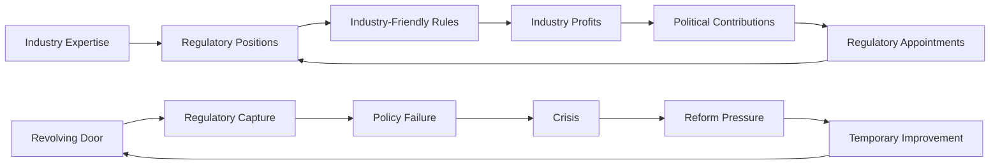

# Economic System Dysfunction: Market Failures, Inequality, and Systemic Risk

## Abstract

Economic systems represent humanity's mechanisms for resource allocation, production coordination, and wealth distribution. However, these systems exhibit systematic dysfunctions including market failures, extreme inequality, boom-bust cycles, and systemic risk accumulation. This analysis examines the psychological, institutional, and structural factors that create economic instability and dysfunction across different economic models, from ancient trade networks to contemporary global capitalism.

## Introduction

Economic system dysfunction represents a fundamental challenge to human prosperity and social stability. Unlike individual market transactions, systemic economic problems emerge from the interaction of psychological biases, institutional structures, and emergent properties of complex economic networks.

Contemporary economic systems face unprecedented challenges including extreme wealth concentration, financial system instability, environmental externalities, and technological disruption. These problems reflect both inherent limitations in human economic reasoning and structural features of modern economic organization that amplify individual-level dysfunctions into system-wide failures.

## Theoretical Framework

### Behavioral Economics Foundation

Economic dysfunction stems from systematic deviations from rational economic behavior:

- **Bounded rationality**: Cognitive limitations in processing economic information
- **Temporal discounting**: Preference for immediate over future benefits
- **Risk perception biases**: Systematic errors in probability assessment
- **Social comparison effects**: Relative rather than absolute utility maximization

### Systems Theory Perspective

Economic systems exhibit complex adaptive system properties that create emergent dysfunctions not predictable from individual economic behavior. This systems framework reveals how local economic decisions aggregate into system-wide failures through interconnected feedback mechanisms.

- **Network effects**: Interconnectedness amplifies local failures
- **Feedback loops**: Self-reinforcing cycles of boom and bust
- **Emergent properties**: System-level behaviors not predictable from individual actions
- **Phase transitions**: Sudden shifts between stable and unstable states

This systems diagram illustrates why economic problems persist despite the rational self-interest of individual actors. Individual economic behavior—driven by personal utility maximization—aggregates through market interactions to create outcomes that may be collectively irrational or harmful. As economist John Maynard Keynes observed, "The market can remain irrational longer than you can remain solvent," highlighting how individual rationality can produce collective irrationality.

Market interactions create emergent properties that no individual participant intended or controls. The 2008 financial crisis exemplifies this phenomenon—individual mortgage brokers, bankers, and investors each acted rationally within their immediate incentive structures, yet their collective behavior created a systemic crisis that harmed everyone, including themselves.

Institutional responses to market outcomes often create unintended consequences that feedback into individual behavior. Government bailouts intended to prevent economic collapse create moral hazard, encouraging future risk-taking. Regulatory changes designed to prevent past crises often create new vulnerabilities as market participants adapt their strategies.

The feedback loops between system-level outcomes and individual behavior create persistent cycles of dysfunction. Economic booms create overconfidence that leads to excessive risk-taking, while economic busts create pessimism that leads to excessive caution, preventing recovery. External shocks, regulatory changes, and technological innovations can disrupt these cycles but often create new forms of instability rather than eliminating systemic dysfunction.

## Economic System Types and Dysfunction Patterns

Different economic systems exhibit characteristic patterns of dysfunction that reflect their underlying organizational principles and incentive structures. This comparative analysis reveals that no economic system eliminates dysfunction—each merely creates different types of systematic problems.

| System Type | Core Mechanism | Primary Dysfunctions | Historical Examples |
|-------------|----------------|---------------------|-------------------|
| **Traditional Economy** | Custom and tradition | Innovation resistance, adaptation failure | Medieval feudalism |
| **Command Economy** | Central planning | Information problems, incentive misalignment | Soviet Union |
| **Market Economy** | Price mechanism | Market failures, inequality, instability | 19th century capitalism |
| **Mixed Economy** | Market + government | Regulatory capture, fiscal crisis | Modern welfare states |
| **Crony Capitalism** | Political connections | Rent-seeking, corruption, inefficiency | Contemporary oligarchies |
| **State Capitalism** | Government-directed markets | Political interference, moral hazard | China, Singapore |

This systematic comparison reveals that economic dysfunction is not a problem of specific economic systems but rather an inherent feature of human economic organization. Traditional economies, based on custom and tradition, provide stability and social cohesion but systematically resist innovation and adaptation to changing circumstances. This creates vulnerability to external shocks and prevents the productivity improvements needed to support growing populations.

Command economies attempt to solve market failures through central planning but create information problems and incentive misalignment that often produce worse outcomes than market failures. As economist Friedrich Hayek demonstrated in "The Road to Serfdom," central planners cannot access the dispersed information that market prices aggregate, leading to systematic resource misallocation and economic stagnation.

Market economies harness individual self-interest to promote collective welfare through the "invisible hand" mechanism, but create market failures, extreme inequality, and financial instability that can undermine their own foundations. The 19th century's laissez-faire capitalism produced unprecedented economic growth alongside devastating boom-bust cycles and social inequality that eventually required government intervention.

Mixed economies attempt to combine market efficiency with government correction of market failures, but create new problems including regulatory capture, fiscal crisis, and political interference in economic decision-making. The complexity of managing both market and government mechanisms often produces suboptimal outcomes in both domains.

Crony capitalism and state capitalism represent hybrid systems where political power and economic power become intertwined, creating rent-seeking, corruption, and inefficiency that benefit connected elites while harming overall economic performance. These systems demonstrate how economic and political dysfunction reinforce each other in self-perpetuating cycles.

## Market Failure Mechanisms

### Information Asymmetries

Markets fail when information is unevenly distributed:

- **Adverse selection**: Quality uncertainty leads to market collapse
- **Moral hazard**: Hidden actions create perverse incentives
- **Principal-agent problems**: Managers pursue self-interest over shareholder value
- **Signaling failures**: Credentials become more important than productivity

### Externalities and Public Goods

### Externalities and Public Goods

Market failures occur systematically when the costs or benefits of economic activities extend beyond the immediate participants in transactions. This table reveals how different types of externalities create specific patterns of market dysfunction that require collective action to address.

| Externality Type | Market Failure | Real-World Example | Systemic Impact |
|------------------|----------------|-------------------|-----------------|
| **Negative Environmental** | Overproduction of pollution | Climate change | Civilizational threat |
| **Positive Knowledge** | Underinvestment in R&D | Basic research funding | Innovation deficit |
| **Network Effects** | Monopoly formation | Tech platform dominance | Market concentration |
| **Congestion** | Overuse of common resources | Traffic, internet bandwidth | Infrastructure strain |

This externality analysis reveals why markets systematically fail to address some of humanity's most important challenges. Negative environmental externalities create the most severe systemic threats because the costs of pollution and resource depletion are imposed on society as a whole while the benefits accrue to specific producers and consumers. Climate change represents the ultimate negative externality—a global problem created by billions of individual decisions that each make economic sense from the actor's perspective but collectively threaten civilization.

Positive knowledge externalities create systematic underinvestment in research and development because the benefits of new knowledge cannot be fully captured by those who create it. Basic scientific research, which provides the foundation for technological progress, generates benefits that extend far beyond what any individual or company can capture through market mechanisms. This explains why government funding of basic research is essential for long-term economic growth and innovation.

Network effects create natural monopolies in industries where the value of a product or service increases with the number of users. Technology platforms like social media networks, operating systems, and payment systems exhibit strong network effects that create winner-take-all dynamics and market concentration. Once a platform achieves dominance, it becomes extremely difficult for competitors to challenge its position, leading to monopoly power and reduced innovation.

Congestion externalities occur when individual use of shared resources imposes costs on other users. Traffic congestion exemplifies this problem—each additional driver imposes delays on all other drivers, but individual drivers don't account for these costs when deciding whether to drive. This leads to systematic overuse of roads and underinvestment in alternative transportation systems.

### Monopoly and Market Power

Market concentration creates systematic dysfunctions:

- **Price manipulation**: Monopolists extract consumer surplus
- **Innovation suppression**: Dominant firms resist disruptive change
- **Political capture**: Economic power translates to political influence
- **Barrier creation**: Incumbents prevent competitive entry

## Inequality and Wealth Concentration

### Inequality Measurement and Trends

The data on wealth inequality reveals a disturbing pattern of increasing concentration that threatens social stability and economic efficiency. This table demonstrates how inequality has reached levels not seen since the Gilded Age, with profound implications for social cohesion and democratic governance.

| Country/Period | Gini Coefficient | Top 1% Share | Bottom 50% Share | Social Mobility Index |
|----------------|------------------|--------------|------------------|----------------------|
| **US (1970)** | 0.39 | 10.5% | 20.2% | 0.70 |
| **US (2020)** | 0.48 | 35.0% | 11.9% | 0.51 |
| **France (2020)** | 0.32 | 22.0% | 22.1% | 0.75 |
| **Brazil (2020)** | 0.53 | 28.3% | 10.8% | 0.36 |
| **Denmark (2020)** | 0.28 | 15.0% | 26.4% | 0.85 |

This inequality analysis reveals several alarming trends about modern economic systems. The United States has experienced a dramatic increase in inequality over the past 50 years, with the Gini coefficient rising from 0.39 to 0.48 and the top 1% share of wealth increasing from 10.5% to 35%. This represents a fundamental shift in the distribution of economic gains that has profound implications for social stability and democratic governance.

The relationship between inequality and social mobility is particularly concerning. As economist Raj Chetty's research demonstrates, the United States has experienced a dramatic decline in social mobility, with the Social Mobility Index falling from 0.70 to 0.51. This means that children today are much less likely to earn more than their parents than children in previous generations, undermining the meritocratic ideals that legitimize economic inequality.

The international comparison reveals that high inequality is not inevitable in advanced economies. Denmark maintains a Gini coefficient of 0.28 and a Social Mobility Index of 0.85, demonstrating that it is possible to combine economic prosperity with relatively equal distribution of wealth and high social mobility. France also maintains significantly lower inequality than the United States while achieving comparable living standards.

Brazil's extreme inequality (Gini coefficient of 0.53) and low social mobility (0.36) illustrate the social consequences of unchecked wealth concentration. High inequality societies tend to exhibit lower social trust, higher crime rates, worse health outcomes, and less stable democratic institutions. The bottom 50% share of wealth in Brazil (10.8%) and the United States (11.9%) reveals how economic growth can become concentrated among elites while leaving the majority of the population behind.

### Mechanisms of Wealth Concentration

Wealth concentration operates through self-reinforcing mechanisms that create persistent inequality across generations. This flowchart illustrates how initial wealth advantages compound over time through multiple channels, creating increasingly unequal distributions of economic resources.

This wealth concentration mechanism reveals why inequality tends to increase over time without active intervention. Initial wealth advantages, whether inherited or earned, provide access to investment opportunities that generate returns exceeding the growth rate of wages and the overall economy. As economist Thomas Piketty demonstrates in "Capital in the Twenty-First Century," when the return on capital (r) exceeds economic growth (g), wealth inequality inevitably increases.

Capital accumulation creates market power that enables wealthy individuals and corporations to extract higher returns through monopolistic practices, rent-seeking, and favorable business arrangements. This market power translates into political influence through campaign contributions, lobbying, and the "revolving door" between business and government. Political influence enables the wealthy to secure favorable policies including tax advantages, regulatory capture, and reduced competition.

The educational advantages available to wealthy families create human capital that generates higher earnings, which then provide the initial wealth advantages for the next generation. Elite educational institutions, private tutoring, unpaid internships, and family connections all contribute to higher earning potential that compounds over generations.

Network effects amplify these advantages through access to opportunities, information, and resources that are not available to those outside elite networks. Social capital—the relationships and connections that provide access to opportunities—becomes increasingly concentrated among the wealthy, creating barriers to social mobility that persist across generations.

This self-reinforcing cycle explains why wealth inequality tends to increase over time and why policies aimed at reducing inequality must address multiple mechanisms simultaneously. Simply redistributing income without addressing the underlying mechanisms of wealth concentration will have limited long-term effects.

### Psychological Factors in Inequality

- **Status competition**: Relative position matters more than absolute wealth
- **Meritocracy belief**: Successful individuals attribute success to personal merit
- **System justification**: People rationalize existing inequality as fair
- **Temporal discounting**: Poor individuals discount future benefits more heavily

## Financial System Instability

### Crisis Timeline and Patterns

| Crisis | Period | Trigger | Mechanism | Global Impact |
|--------|--------|---------|-----------|---------------|
| **Tulip Mania** | 1634-1637 | Speculation bubble | Asset price collapse | Regional |
| **Great Depression** | 1929-1939 | Stock market crash | Banking system failure | Global |
| **Savings & Loan Crisis** | 1980s-1990s | Deregulation | Moral hazard | US Regional |
| **Asian Financial Crisis** | 1997-1998 | Currency speculation | Capital flight | Regional |
| **Dot-com Bubble** | 2000-2002 | Technology speculation | Overvaluation correction | Global |
| **Global Financial Crisis** | 2007-2009 | Subprime mortgages | Systemic risk | Global |
| **COVID-19 Economic Crisis** | 2020-2021 | Pandemic lockdowns | Supply chain disruption | Global |

### Systemic Risk Accumulation

Financial systems accumulate risk through:

- **Interconnectedness**: Failure of one institution spreads to others
- **Procyclicality**: Risk-taking increases during boom periods
- **Moral hazard**: "Too big to fail" institutions take excessive risks
- **Regulatory arbitrage**: Financial innovation outpaces regulatory response

### Behavioral Finance and Crisis Formation

## Comparative Economic System Analysis

### Capitalism vs. Socialism Performance

| Dimension | Market Capitalism | Democratic Socialism | State Socialism | Mixed Economy |
|-----------|------------------|---------------------|-----------------|---------------|
| **Economic Growth** | High (volatile) | Moderate (stable) | Low (planned) | Moderate (stable) |
| **Innovation Rate** | High | Moderate | Low | Moderate |
| **Inequality Level** | High | Low | Low (officially) | Moderate |
| **Individual Freedom** | High (economic) | High (political) | Low | High |
| **Environmental Impact** | High negative | Moderate | High negative | Moderate |
| **Crisis Frequency** | High | Low | Moderate | Moderate |

### Institutional Quality Factors

Economic performance depends on institutional quality:

- **Property rights protection**: Secure ownership encourages investment
- **Rule of law**: Predictable legal framework reduces transaction costs
- **Corruption control**: Clean governance improves resource allocation
- **Regulatory quality**: Effective regulation balances market freedom and stability

## Contemporary Economic Challenges

### Technological Disruption

Technology creates new forms of economic dysfunction:

- **Job displacement**: Automation eliminates middle-skill employment
- **Platform monopolies**: Network effects create winner-take-all markets
- **Gig economy**: Employment insecurity and benefit erosion
- **Digital divide**: Technology access inequality amplifies other inequalities

### Globalization and Its Discontents

Globalization creates both benefits and costs that are distributed unevenly across different groups, creating political tensions and economic instability. Understanding this uneven distribution helps explain the backlash against globalization and the rise of populist movements worldwide.

| Globalization Benefit | Globalization Cost | Affected Groups |
|----------------------|-------------------|-----------------|
| **Lower consumer prices** | **Job displacement** | Manufacturing workers |
| **Economic efficiency** | **Cultural homogenization** | Traditional communities |
| **Technology transfer** | **Environmental degradation** | Developing countries |
| **Poverty reduction** | **Inequality increase** | Developed country middle class |

**Lower Consumer Prices** result from global competition and access to cheaper production locations, benefiting consumers through increased purchasing power and access to diverse products. However, this comes at the cost of **Job Displacement** for manufacturing workers in developed countries whose jobs move to lower-wage locations. The benefits are diffuse (small savings for many consumers) while the costs are concentrated (large losses for displaced workers), creating political tensions.

**Economic Efficiency** emerges from comparative advantage and specialization, allowing countries to focus on their most productive activities and trade for other goods. However, this creates **Cultural Homogenization** as global markets favor standardized products and practices, threatening traditional communities whose local customs and economic practices cannot compete with globalized alternatives. The efficiency gains benefit the overall economy while cultural losses affect specific communities.

**Technology Transfer** allows developing countries to access advanced technologies and production methods without having to develop them independently, accelerating economic development. However, this often comes with **Environmental Degradation** as developing countries adopt polluting technologies and production methods to compete in global markets, while environmental regulations may be weak or poorly enforced.

**Poverty Reduction** occurs as global trade creates employment opportunities in developing countries and allows them to access global markets for their products. However, this can coincide with **Inequality Increase** in developed countries as middle-class manufacturing jobs disappear while high-skill service jobs become more valuable, creating a hollowing out of the middle class that benefits both the global poor and the domestic wealthy while harming the domestic middle class.

### Environmental Economics

Economic systems fail to account for environmental costs:

- **Tragedy of commons**: Overexploitation of shared resources
- **Intergenerational equity**: Present consumption imposes future costs
- **Discount rate problems**: Market rates undervalue long-term environmental benefits
- **Measurement failures**: GDP doesn't account for natural capital depletion

## Psychological Foundations of Economic Dysfunction

### Cognitive Biases in Economic Decision-Making

Human cognitive biases create systematic patterns of irrational economic behavior that aggregate to produce market inefficiencies, financial crises, and economic instability. These biases explain why markets often deviate from rational expectations and why economic crises follow predictable psychological patterns.

| Bias | Economic Manifestation | Market Impact |
|------|----------------------|---------------|
| **Overconfidence** | Excessive trading, entrepreneurship | Bubble formation |
| **Loss Aversion** | Status quo bias, endowment effect | Market inefficiency |
| **Anchoring** | Price reference points | Sticky prices |
| **Availability Heuristic** | Recent event overweighting | Volatility clustering |
| **Confirmation Bias** | Selective information processing | Persistent mispricing |
| **Herding Behavior** | Following crowd decisions | Momentum effects |

**Overconfidence** leads to excessive trading as investors overestimate their ability to predict market movements and pick winning investments, and excessive entrepreneurship as people overestimate their chances of business success. The market impact is bubble formation, as overconfident investors bid up asset prices beyond fundamental values, creating unsustainable price increases that eventually collapse when reality fails to meet inflated expectations.

**Loss Aversion** creates status quo bias where people prefer to maintain current positions rather than make changes that might result in losses, and the endowment effect where people value things they own more highly than identical things they don't own. The market impact is market inefficiency, as loss aversion prevents optimal resource allocation and creates resistance to beneficial trades or investments that involve any risk of loss.

**Anchoring** causes people to rely too heavily on the first piece of information they receive (the "anchor") when making economic decisions, leading to price reference points that influence subsequent valuations even when circumstances change. The market impact is sticky prices that don't adjust quickly to new information, creating market inefficiencies and preventing optimal price discovery.

**Availability Heuristic** leads to overweighting of recent events when making economic decisions, as people judge the likelihood of future events based on how easily they can recall similar past events. The market impact is volatility clustering, where periods of high volatility are followed by more high volatility, and periods of calm are followed by more calm, as recent market behavior disproportionately influences expectations about future market behavior.

**Confirmation Bias** drives selective information processing where investors seek out information that confirms their existing beliefs while ignoring contradictory evidence, leading to persistent mispricing as investors fail to update their beliefs when presented with disconfirming information. This creates market inefficiencies that can persist longer than rational models would predict.

**Herding Behavior** causes investors to follow crowd decisions rather than making independent judgments, leading to momentum effects where asset prices continue moving in the same direction as recent trends, regardless of fundamental values. This creates market bubbles and crashes as collective behavior amplifies individual biases and creates self-reinforcing cycles of buying or selling.

### Social Psychology of Economic Behavior

Economic behavior is fundamentally social:

- **Social proof**: People follow others' economic decisions
- **Authority deference**: Expert opinions influence market sentiment
- **In-group favoritism**: Preferential treatment of group members
- **Fairness concerns**: Perceived unfairness reduces cooperation

## Crisis Response and Policy Failures

### Monetary Policy Limitations

Central banks face systematic constraints:

- **Zero lower bound**: Interest rates cannot go below zero (traditionally)
- **Liquidity traps**: Monetary stimulus becomes ineffective
- **Asset bubble creation**: Low rates inflate asset prices
- **Inequality amplification**: Quantitative easing benefits asset owners

### Fiscal Policy Challenges

Government spending faces political and economic constraints:

- **Political business cycles**: Election timing affects policy choices
- **Deficit bias**: Politicians prefer spending to taxation
- **Crowding out**: Government borrowing may reduce private investment
- **Debt sustainability**: High debt levels constrain future policy options

### Regulatory Capture and Policy Failure

## Future Economic System Risks

### Emerging Systemic Threats

1. **Climate Change**: Physical and transition risks to economic infrastructure
2. **Demographic Transition**: Aging populations strain social security systems
3. **Artificial Intelligence**: Potential for massive job displacement
4. **Cryptocurrency**: New forms of financial instability and regulatory challenges
5. **Geopolitical Fragmentation**: Trade war risks and supply chain vulnerabilities

### Potential System Transformations

Economic systems may evolve toward:

- **Stakeholder capitalism**: Broader corporate responsibility beyond shareholders
- **Universal basic income**: Government-provided income floor
- **Circular economy**: Waste reduction and resource recycling emphasis
- **Digital currencies**: Central bank digital currencies and payment system transformation
- **Degrowth economics**: Sustainability prioritized over growth

## Cross-References

- [See: Individual Psychology → Behavioral Economics](../individual/behavioral-economics.md)
- [See: Political Systems → Governance Failures](political-systems-failure.md)
- [Related: Group Dynamics → Organizational Pathology](../group/organizational-pathology.md)
- [Compare: Historical Analysis → Civilizational Collapse](../historical/civilizational-collapse.md)

## Conclusion

Economic system dysfunction represents a persistent challenge across different economic models and historical periods. Market failures, inequality, financial instability, and systemic risk reflect both psychological limitations in human economic reasoning and structural features of complex economic systems.

Understanding these dysfunctions requires integrating insights from behavioral economics, institutional analysis, and systems theory. The analysis reveals that economic problems often stem from the interaction between individual cognitive biases and institutional structures that amplify these biases into system-wide failures.

Contemporary economic challenges including technological disruption, environmental degradation, and inequality require new approaches that account for the psychological and social dimensions of economic behavior. The persistence of economic crises across different systems suggests that these challenges reflect fundamental features of human economic organization rather than merely technical problems with specific institutional arrangements.

Future economic system design must incorporate insights about human psychology, institutional dynamics, and systemic risk to create more stable and equitable economic arrangements. This requires moving beyond purely technical economic analysis to embrace interdisciplinary approaches that recognize the social and psychological foundations of economic behavior.

---

*This document is part of the Humanity's Fundamental Problems Documentation System, providing interdisciplinary analysis of societal-level dysfunction patterns.*