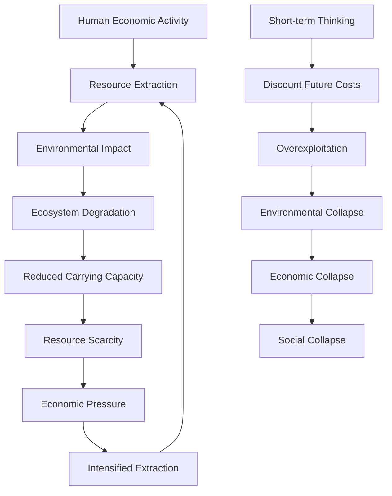
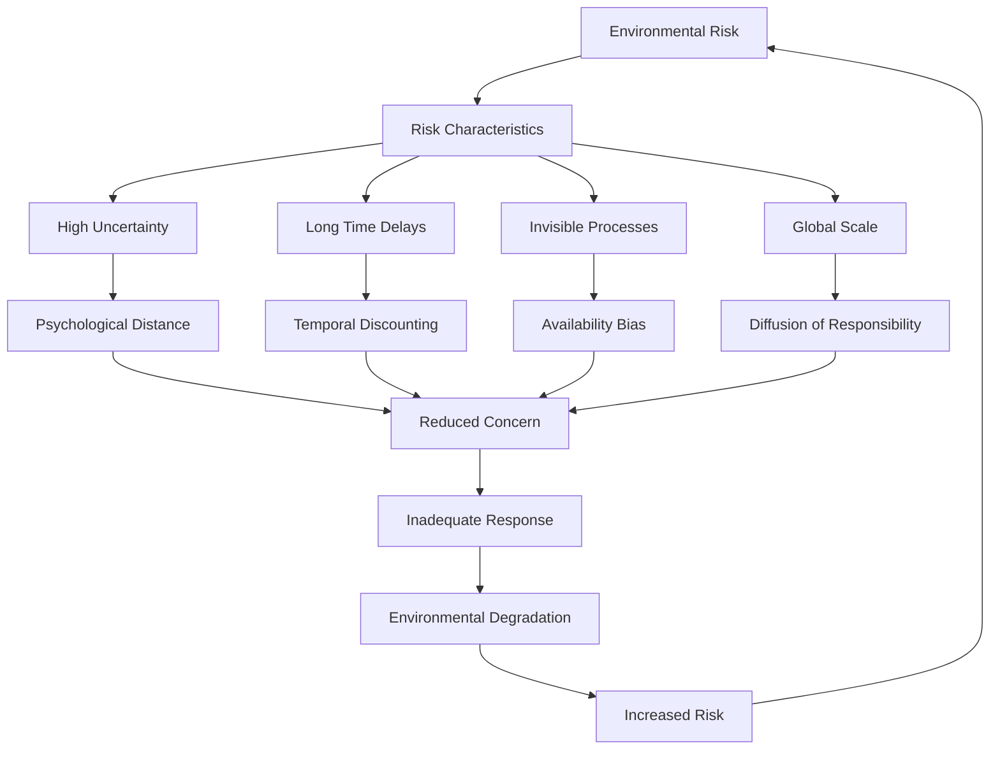
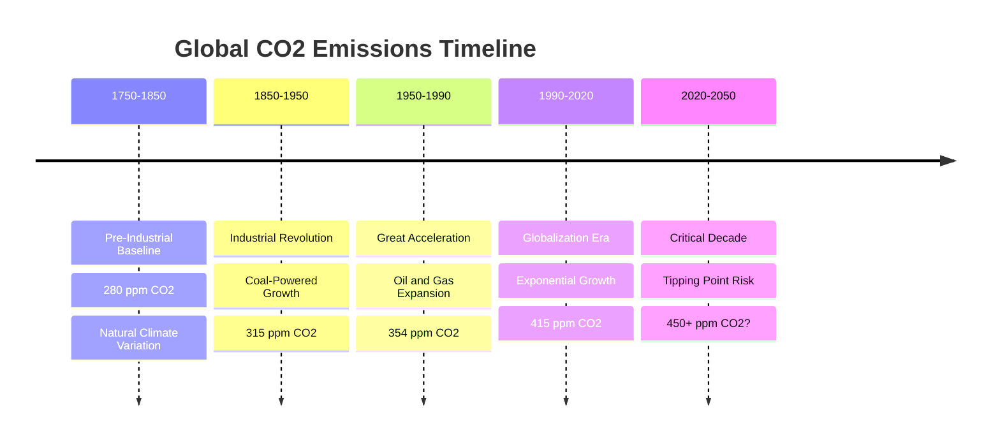
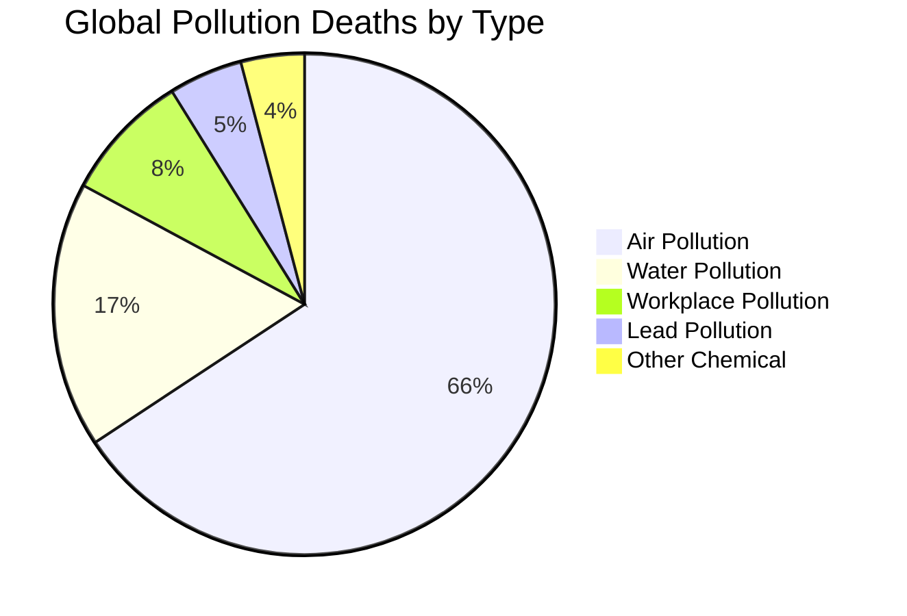
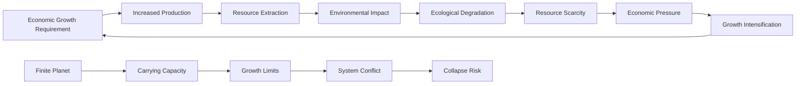
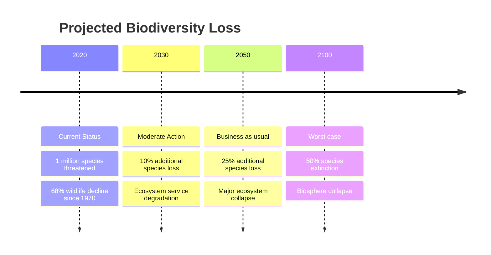

# Environmental Degradation: Human-Environment Interaction Failures

## Abstract

Environmental degradation represents the systematic destruction of Earth's life-support systems through human activity. This dysfunction emerges from fundamental mismatches between human psychology, social organization, and ecological reality. The analysis examines how cognitive biases, economic systems, and political structures create persistent environmental destruction despite clear evidence of long-term catastrophic consequences, tracing patterns from local resource depletion to global climate change.

## Introduction

Environmental degradation represents perhaps the most consequential form of human dysfunction, as it threatens the biological foundations of civilization itself. Unlike other human problems that primarily affect social organization, environmental destruction undermines the physical systems that make human life possible.

Contemporary environmental crises—including climate change, biodiversity loss, pollution, and resource depletion—exemplify how human cognitive limitations, social structures, and economic systems systematically fail to account for ecological constraints. These problems reflect both evolutionary mismatches in human environmental perception and institutional failures that prioritize short-term gains over long-term sustainability.

## Theoretical Framework

### Evolutionary Mismatch Theory

Human environmental behavior evolved for small-scale, immediate contexts:

- **Temporal discounting**: Present benefits valued over future costs
- **Spatial limitations**: Local environmental awareness, global blindness
- **Linear thinking**: Difficulty understanding exponential and systemic change
- **Tragedy of commons**: Individual rationality leads to collective irrationality

### Systems Ecology Perspective

Environmental systems exhibit complex, non-linear dynamics that human psychology and institutions are poorly equipped to understand and manage. This systems diagram illustrates the self-reinforcing cycles that drive environmental destruction despite obvious long-term costs.

- **Feedback loops**: Environmental changes create cascading effects
- **Tipping points**: Gradual changes can trigger sudden system collapse
- **Interconnectedness**: Local actions have global consequences
- **Resilience limits**: Systems can absorb stress until critical thresholds

This systems ecology analysis reveals why environmental problems are so difficult to solve despite widespread awareness of their consequences. The feedback loops between human economic activity and environmental degradation create self-reinforcing cycles where environmental destruction generates economic pressure that drives further environmental destruction. As resources become scarcer due to ecosystem degradation, economic systems respond by intensifying extraction efforts rather than reducing consumption, accelerating the degradation process.

The concept of tipping points explains why environmental problems can appear manageable for long periods before suddenly becoming catastrophic. Ecosystems can absorb significant stress while maintaining their basic functions, creating the illusion that environmental damage is reversible or manageable. However, once critical thresholds are crossed, systems can collapse rapidly and irreversibly, as occurred with the Aral Sea, many fisheries, and regional climate systems.

Interconnectedness means that local environmental actions have global consequences through atmospheric, oceanic, and biological systems. Deforestation in the Amazon affects rainfall patterns across South America, while industrial emissions in one country contribute to global climate change that affects everyone. This creates collective action problems where the costs of environmental protection are local while the benefits are global and diffuse.

Short-term thinking, driven by human temporal discounting biases and institutional incentives, leads to systematic discounting of future environmental costs. As economist Nicholas Stern explains in his climate change economics, the tendency to discount future costs at high rates makes even catastrophic future environmental damage appear economically insignificant compared to present consumption benefits. This creates a pathway from overexploitation to environmental collapse to economic and social collapse, as civilizations throughout history have discovered.

## Environmental Degradation Indicators and Timeline

The comprehensive data on environmental degradation reveals the accelerating pace of Earth system destruction and the narrow window remaining for preventing civilizational collapse. This table demonstrates how human activity has fundamentally altered every major environmental system within a historically brief period.

| Environmental System | Baseline Period | Current Status | Degradation Rate | Projected Collapse |
|---------------------|-----------------|----------------|------------------|-------------------|
| **Global Climate** | Pre-industrial (1750) | +1.1°C warming | +0.18°C/decade | 2°C by 2050 |
| **Biodiversity** | Pre-human (10,000 BCE) | 68% decline since 1970 | 1-3% species/year | 6th mass extinction |
| **Ocean Health** | Pre-industrial | 30% pH decline | Accelerating acidification | Marine collapse 2050s |
| **Forest Cover** | 8000 BCE | 50% loss globally | 10M hectares/year | Tropical forests 2100 |
| **Soil Quality** | Pre-agriculture | 33% degraded | 24B tons lost/year | Topsoil gone 2070 |
| **Freshwater** | Natural flow | 70% rivers altered | 2% aquifer depletion/year | Water wars 2030s |
| **Atmospheric Composition** | Pre-industrial | 415ppm CO2 | +2.4ppm/year | Runaway warming 2°C |

This environmental degradation analysis reveals the unprecedented scale and speed of human impact on Earth systems. Global climate warming of 1.1°C above pre-industrial levels represents the fastest climate change in human history, with current warming rates of 0.18°C per decade threatening to reach the 2°C threshold that scientists consider extremely dangerous by 2050. This warming is already triggering feedback loops including Arctic ice loss, permafrost melting, and forest fires that accelerate further warming.

The biodiversity crisis represents what biologists call the "sixth mass extinction," with species disappearing at rates 100-1,000 times faster than natural background extinction rates. The 68% decline in wildlife populations since 1970 indicates ecosystem collapse that threatens the pollination, pest control, and nutrient cycling services that agriculture depends on. As biologist E.O. Wilson warns in "Half-Earth," current extinction rates could eliminate most large mammals and many ecosystems within decades.

Ocean acidification from CO2 absorption has reduced ocean pH by 30% since pre-industrial times, creating conditions not seen for millions of years. This "other CO2 problem" threatens marine food webs by dissolving the shells and skeletons of marine organisms, potentially causing marine ecosystem collapse by the 2050s that would eliminate a major protein source for billions of people.

Forest loss of 50% globally since 8000 BCE has accelerated to 10 million hectares annually, with tropical forests—the most biodiverse ecosystems on Earth—facing complete destruction by 2100 at current rates. Deforestation eliminates carbon storage, reduces rainfall, and destroys habitat for most terrestrial species, creating cascading effects throughout regional and global climate systems.

Soil degradation affects 33% of global agricultural land, with 24 billion tons of fertile soil lost annually through erosion, salinization, and chemical contamination. At current rates, topsoil could be largely depleted by 2070, threatening food security for a global population projected to reach 10 billion people. As soil scientist David Montgomery documents in "Dirt," civilizations that destroy their soil inevitably collapse.

Freshwater system alteration affects 70% of rivers globally, while aquifer depletion proceeds at 2% annually in major agricultural regions. Water scarcity already affects 2 billion people and could trigger resource wars by the 2030s as climate change reduces precipitation in already water-stressed regions while increasing demand through higher temperatures and population growth.

## Psychological Foundations of Environmental Destruction

### Cognitive Biases in Environmental Perception

Human cognitive architecture creates systematic biases in how people perceive and respond to environmental threats, explaining why societies consistently fail to address environmental problems despite clear scientific evidence of their severity and urgency.

| Cognitive Bias | Environmental Manifestation | Behavioral Consequence |
|----------------|----------------------------|----------------------|
| **Temporal Discounting** | Future climate costs ignored | Present consumption prioritized |
| **Optimism Bias** | Technology will solve problems | Delayed action on mitigation |
| **Availability Heuristic** | Recent weather = climate | Misunderstanding of trends |
| **Confirmation Bias** | Selective climate information | Polarized environmental beliefs |
| **Psychological Distance** | Climate change affects others | Reduced personal responsibility |
| **System Justification** | Current system is best possible | Resistance to environmental policy |

**Temporal Discounting** causes people to systematically undervalue future environmental costs compared to present benefits, leading to the behavioral consequence of prioritizing present consumption over future environmental protection. This bias evolved because immediate threats and rewards were more relevant to survival than distant future consequences, but it becomes maladaptive when dealing with environmental problems that require immediate action to prevent future catastrophe.

**Optimism Bias** leads people to overestimate the likelihood that technology will solve environmental problems without requiring significant changes in behavior or lifestyle. This manifests as faith in future technological solutions like carbon capture or renewable energy, resulting in delayed action on mitigation measures that are available today. The bias provides psychological comfort by suggesting that environmental problems will be solved without personal sacrifice.

**Availability Heuristic** causes people to judge climate change based on recent weather experiences rather than long-term climate data, leading to misunderstanding of climate trends. Unusually cold winters make people doubt global warming, while heat waves increase concern, even though individual weather events don't reflect long-term climate patterns. This creates fluctuating public concern that doesn't match the steady progression of climate change.

**Confirmation Bias** drives selective attention to climate information that supports existing beliefs while ignoring contradictory evidence, resulting in polarized environmental beliefs that align with political identity rather than scientific evidence. People seek out information sources that confirm their preferred views about environmental issues, creating echo chambers where environmental beliefs become immune to scientific evidence.

**Psychological Distance** makes climate change seem like a problem that affects other people, places, or times rather than oneself, reducing personal responsibility and motivation for action. Environmental problems often seem distant in time (future impacts), space (affecting other regions), or social relevance (affecting other species or social groups), making them feel less urgent and personally relevant than they actually are.

**System Justification** creates resistance to environmental policy by motivating people to defend the current economic and social system as the best possible arrangement, even when that system creates environmental problems. This bias leads people to rationalize environmental destruction as necessary for economic growth or to believe that environmental protection would be too costly or disruptive to implement.

### Evolutionary Psychology of Environmental Behavior

Human environmental psychology reflects ancestral adaptations:

- **Immediate threat focus**: Evolved for visible, immediate dangers
- **Small group cooperation**: Difficulty coordinating at global scale
- **Resource competition**: Zero-sum thinking about environmental resources
- **Status signaling**: Consumption displays social position

### Environmental Risk Perception Failures

## Historical Patterns of Environmental Collapse

### Ancient Civilizations and Environmental Failure

| Civilization | Environmental Problem | Collapse Mechanism | Timeline |
|--------------|----------------------|-------------------|----------|
| **Easter Island** | Deforestation | Resource depletion | 1200-1680 CE |
| **Mayan Cities** | Soil exhaustion, drought | Agricultural failure | 800-900 CE |
| **Mesopotamian Empires** | Soil salinization | Irrigation system failure | 2000-1600 BCE |
| **Anasazi Pueblos** | Drought, deforestation | Water scarcity | 1200-1300 CE |
| **Norse Greenland** | Climate change | Agricultural collapse | 1300-1400 CE |

### Modern Environmental Crises

| Case | Period | Environmental Damage | Human Impact |
|------|--------|---------------------|--------------|
| **Dust Bowl** | 1930s | Soil erosion | 3.5M people displaced |
| **Aral Sea** | 1960-2000 | Lake desiccation | Fishing industry collapse |
| **Amazon Deforestation** | 1970-present | 17% forest loss | Indigenous displacement |
| **Great Pacific Garbage Patch** | 1990s-present | Ocean plastic pollution | Marine ecosystem disruption |
| **Coral Bleaching** | 1980s-present | 50% reef loss | Fisheries collapse |

## Climate Change as Systemic Environmental Failure

### Greenhouse Gas Emission Patterns

### Climate Feedback Loops

Climate change creates self-reinforcing cycles:

- **Ice-albedo feedback**: Melting ice reduces solar reflection
- **Permafrost methane**: Thawing releases stored greenhouse gases
- **Forest fire feedback**: Fires release carbon, reduce CO2 absorption
- **Water vapor feedback**: Warming increases atmospheric moisture

### Climate Impact Cascades

| Physical Impact | Ecological Consequence | Human System Effect | Social Response |
|----------------|----------------------|-------------------|-----------------|
| **Temperature Rise** | Species migration | Agricultural disruption | Food insecurity |
| **Sea Level Rise** | Coastal flooding | Infrastructure damage | Climate migration |
| **Extreme Weather** | Ecosystem disruption | Economic losses | Political instability |
| **Precipitation Changes** | Drought/flooding | Water scarcity | Resource conflicts |

## Biodiversity Loss and Ecosystem Collapse

### Extinction Rate Acceleration

Current species extinction rates exceed natural background rates by 100-1,000 times:

- **Habitat destruction**: Primary cause of species loss
- **Climate change**: Shifting habitats faster than adaptation
- **Pollution**: Chemical contamination of ecosystems
- **Invasive species**: Human-mediated species introductions
- **Overexploitation**: Hunting, fishing, harvesting beyond sustainability

### Ecosystem Service Degradation

| Ecosystem Service | Economic Value | Degradation Status | Human Impact |
|------------------|----------------|-------------------|--------------|
| **Pollination** | $235B annually | 40% pollinator decline | Food security threat |
| **Water Purification** | $4.3T annually | 80% wetlands lost | Water quality crisis |
| **Carbon Sequestration** | $1.1T annually | Forests becoming sources | Climate acceleration |
| **Soil Formation** | $2.3T annually | 33% soils degraded | Agricultural collapse |
| **Disease Control** | $479B annually | Biodiversity loss | Pandemic risk increase |

## Pollution and Toxic Contamination

### Pollution Type Distribution and Health Impacts

### Persistent Organic Pollutants

Chemical contamination creates long-term environmental damage:

- **Bioaccumulation**: Toxins concentrate up food chains
- **Endocrine disruption**: Hormonal system interference
- **Transgenerational effects**: Epigenetic changes passed to offspring
- **Global distribution**: Pollutants reach remote ecosystems

## Resource Depletion and Overshoot

### Planetary Boundaries Framework

| Earth System Process | Boundary Value | Current Status | Risk Level |
|---------------------|----------------|----------------|------------|
| **Climate Change** | 350 ppm CO2 | 415 ppm | High risk |
| **Biodiversity Loss** | <10 extinctions/million species/year | 100-1000 | High risk |
| **Nitrogen Cycle** | 35 Tg N/year | 150 Tg N/year | High risk |
| **Phosphorus Cycle** | 11 Tg P/year | 22 Tg P/year | High risk |
| **Ocean Acidification** | 2.75 Ω aragonite | 2.90 Ω | Increasing risk |
| **Land Use Change** | <15% converted | 11.7% | Increasing risk |
| **Freshwater Use** | 4000 km³/year | 2600 km³/year | Safe |
| **Ozone Depletion** | <5% reduction | 1% reduction | Safe |
| **Atmospheric Aerosols** | Not quantified | Not quantified | Unknown |

### Ecological Overshoot

Humanity consumes resources faster than Earth can regenerate:

- **Global Footprint**: 1.75 Earths required for current consumption
- **Biocapacity Deficit**: Demand exceeds supply by 75%
- **Earth Overshoot Day**: Earlier each year (July 29, 2021)
- **Regional Variation**: Wealthy nations consume 3-5 times their biocapacity

## Economic Systems and Environmental Destruction

### Growth Imperative vs. Ecological Limits

### Market Failure in Environmental Protection

Markets systematically undervalue environmental resources:

- **Externality problem**: Environmental costs not included in prices
- **Public goods**: No market incentive to protect shared resources
- **Discount rates**: Future environmental benefits undervalued
- **Property rights**: Difficulty establishing ownership of environmental goods

### Environmental Kuznets Curve Limitations

The hypothesis that environmental quality improves with economic development has limitations:

- **Local vs. global**: Local improvement may export problems globally
- **Threshold effects**: Some environmental damage is irreversible
- **Consumption patterns**: Wealthy nations have high per-capita footprints
- **Absolute vs. relative**: Efficiency gains offset by scale increases

## Political Failures in Environmental Governance

### Collective Action Problems

Environmental protection faces systematic political obstacles:

- **Free rider problem**: Benefits of environmental protection are shared
- **Tragedy of commons**: Individual rationality leads to collective irrationality
- **Intergenerational equity**: Future generations cannot vote
- **Global coordination**: No world government to enforce agreements

### Political Economy of Environmental Policy

| Stakeholder Group | Environmental Interest | Political Power | Policy Influence |
|------------------|----------------------|-----------------|------------------|
| **Fossil Fuel Industry** | Oppose regulation | High (concentrated) | Strong opposition |
| **Environmental Groups** | Support protection | Medium (organized) | Moderate support |
| **General Public** | Moderate support | Low (diffuse) | Weak influence |
| **Future Generations** | Strong interest | None | No representation |

### International Environmental Governance Failures

Global environmental problems require international cooperation:

- **Sovereignty constraints**: Nations resist binding commitments
- **Development conflicts**: Poor countries prioritize growth over environment
- **Enforcement problems**: No global authority to ensure compliance
- **Free rider incentives**: Benefits of non-compliance exceed costs

## Technological Solutions and Their Limitations

### Geoengineering Proposals and Risks

| Technology | Mechanism | Potential Benefits | Risks and Limitations |
|------------|-----------|-------------------|----------------------|
| **Solar Radiation Management** | Atmospheric aerosols | Rapid cooling | Termination problem, regional effects |
| **Carbon Capture** | CO2 removal | Emissions reduction | Energy requirements, storage |
| **Ocean Fertilization** | Phytoplankton growth | Carbon sequestration | Ecosystem disruption |
| **Genetic Engineering** | Modified organisms | Enhanced carbon uptake | Uncontrolled evolution |

### Technological Optimism Bias

Belief in technological solutions can delay necessary action:

- **Moral hazard**: Technology promises reduce mitigation efforts
- **Complexity underestimation**: Environmental systems more complex than anticipated
- **Unintended consequences**: Solutions create new problems
- **Implementation challenges**: Technical feasibility doesn't ensure deployment

## Future Environmental Projections

### Climate Change Scenarios

| Scenario | Temperature Rise | Sea Level Rise | Precipitation Change | Extreme Weather |
|----------|-----------------|----------------|---------------------|-----------------|
| **RCP2.6 (Paris Goals)** | 1.5-2.0°C | 0.3-0.6m | ±10% regional | 2x current |
| **RCP4.5 (Current Policies)** | 2.5-3.0°C | 0.4-0.8m | ±20% regional | 3x current |
| **RCP8.5 (No Action)** | 4.0-5.0°C | 0.8-2.0m | ±40% regional | 5x current |

### Tipping Point Risks

Critical Earth system components may reach irreversible thresholds:

- **Arctic Sea Ice**: Summer ice-free Arctic by 2050
- **Greenland Ice Sheet**: Irreversible melting at 1.5-2°C warming
- **Amazon Rainforest**: Dieback and savannization
- **Atlantic Circulation**: Slowdown or collapse of ocean currents
- **Permafrost**: Massive methane and CO2 release

### Biodiversity Projections

## Psychological and Social Responses to Environmental Crisis

### Climate Anxiety and Eco-Grief

Environmental degradation creates new forms of psychological distress:

- **Climate anxiety**: Chronic fear about environmental future
- **Eco-grief**: Mourning for lost environments and species
- **Solastalgia**: Distress from environmental change in home environment
- **Environmental melancholia**: Depression from ecological loss

### Denial and Psychological Defense Mechanisms

People employ various strategies to cope with environmental threats:

- **Denial**: Rejecting scientific evidence of environmental problems
- **Rationalization**: Justifying environmentally harmful behavior
- **Displacement**: Focusing on individual rather than systemic action
- **Numbing**: Emotional shutdown to avoid overwhelming feelings

## Mitigation and Adaptation Strategies

### Systemic Change Requirements

Addressing environmental degradation requires fundamental system transformation:

- **Economic system reform**: Moving beyond growth-dependent capitalism
- **Political system change**: Representing future generations and global interests
- **Cultural transformation**: Shifting values from consumption to sustainability
- **Technological transition**: Rapid deployment of clean technologies

### Individual vs. Collective Action

| Action Level | Examples | Effectiveness | Limitations |
|--------------|----------|---------------|-------------|
| **Individual** | Lifestyle changes | Personal satisfaction | Minimal system impact |
| **Community** | Local initiatives | Demonstration effects | Scale limitations |
| **National** | Policy changes | Significant impact | International coordination needed |
| **Global** | International agreements | System transformation | Implementation challenges |

### Resilience Building

Preparing for unavoidable environmental changes:

- **Infrastructure adaptation**: Climate-proofing built environment
- **Ecosystem restoration**: Rebuilding natural resilience
- **Social capital**: Strengthening community cooperation
- **Economic diversification**: Reducing dependence on vulnerable sectors

## Cross-References

- [See: Individual Psychology → Temporal Discounting](../individual/cognitive-biases-heuristics.md)
- [See: Economic Systems → Market Failures](economic-system-dysfunction.md)
- [Related: Political Systems → Collective Action Problems](political-systems-failure.md)
- [Compare: Technological Systems → Unintended Consequences](technological-disruption.md)

## Conclusion

Environmental degradation represents the most fundamental challenge facing humanity, as it threatens the biological foundations of civilization itself. The systematic destruction of Earth's life-support systems emerges from deep mismatches between human psychology, social organization, and ecological reality.

Understanding environmental dysfunction requires recognizing that environmental problems are fundamentally human problems—they stem from cognitive biases, institutional failures, and cultural values that prioritize short-term gains over long-term sustainability. The analysis reveals that environmental destruction is not merely a technical problem but a manifestation of deeper psychological and social dysfunctions.

Contemporary environmental crises including climate change, biodiversity loss, and pollution reflect both evolutionary mismatches in human environmental perception and structural features of modern economic and political systems that systematically discount environmental costs. The speed and scale of environmental change may exceed human adaptive capacity, creating unprecedented risks to civilization.

Future environmental stability depends on fundamental transformations in human psychology, social organization, and economic systems. This requires moving beyond purely technical solutions to embrace systemic changes that align human behavior with ecological constraints. The challenge is developing new forms of consciousness, governance, and economics that can operate within planetary boundaries while maintaining human flourishing.

The ultimate test of human intelligence may be whether we can overcome our psychological and institutional limitations to create sustainable relationships with the natural world that supports us. Failure in this challenge threatens not only environmental systems but the entire project of human civilization.

---

*This document is part of the Humanity's Fundamental Problems Documentation System, providing interdisciplinary analysis of societal-level dysfunction patterns.*