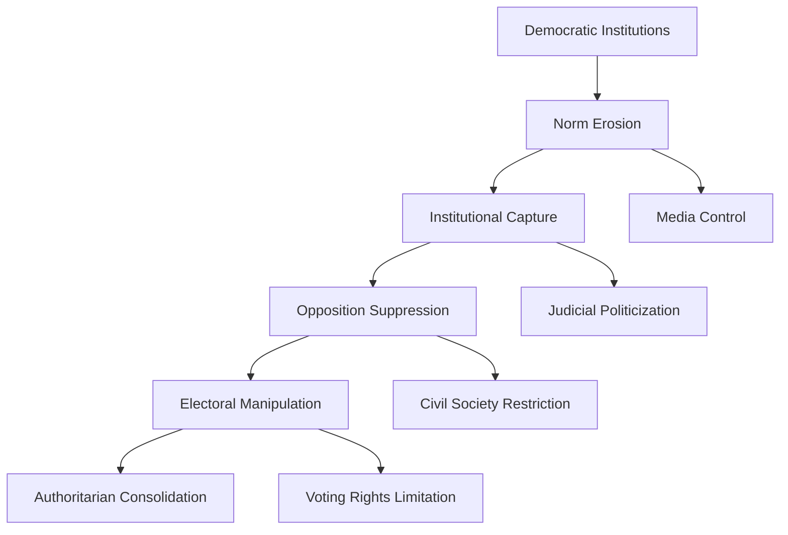
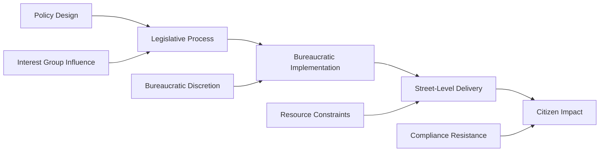

# Political Systems Failure: Democratic Backsliding and Governance Collapse

## Abstract

Political systems represent humanity's attempt to organize collective decision-making and resource allocation at scale. However, these systems exhibit systematic vulnerabilities that lead to democratic backsliding, authoritarian capture, and governance failures. This analysis examines the psychological, sociological, and structural factors that undermine political institutions, tracing patterns from ancient civilizations to contemporary democratic crises.

## Introduction

Political systems failure represents one of the most consequential forms of societal-level dysfunction, as governance structures mediate virtually all other aspects of collective human organization. The collapse or corruption of political institutions creates cascading failures across economic, social, and cultural domains, often precipitating civilizational decline.

Contemporary democratic backsliding—the gradual weakening of democratic norms, institutions, and practices—exemplifies how political systems can deteriorate through incremental erosion rather than sudden collapse. This phenomenon reflects deeper psychological and sociological vulnerabilities in human political behavior that transcend specific institutional arrangements.

## Theoretical Framework

### Systems Theory Perspective

Political systems exhibit characteristics of complex adaptive systems, with multiple feedback loops, emergent properties, and non-linear dynamics. Key systemic vulnerabilities include:

- **Positive feedback loops** that amplify political polarization
- **Institutional capture** by special interests
- **Information asymmetries** between elites and citizens
- **Collective action problems** in democratic participation

### Psychological Foundations

Political behavior reflects fundamental psychological biases and limitations:

- **Tribal psychology**: In-group/out-group dynamics that override rational policy evaluation
- **Cognitive biases**: Confirmation bias, availability heuristic, and motivated reasoning in political judgment
- **Authority orientation**: Psychological predisposition toward hierarchical submission
- **Loss aversion**: Disproportionate fear of political change and status loss

## Political System Types and Failure Modes

Political systems represent different approaches to organizing collective decision-making and power distribution, each with characteristic strengths and systematic vulnerabilities. Understanding these failure modes is crucial for comprehending why political institutions consistently break down across cultures and historical periods.

| System Type | Core Characteristics | Primary Failure Modes | Historical Examples |
|-------------|---------------------|----------------------|-------------------|
| **Direct Democracy** | Citizen participation in all decisions | Mob rule, decision paralysis, manipulation by demagogues | Athenian democracy (5th century BCE) |
| **Representative Democracy** | Elected officials make decisions | Elite capture, polarization, institutional gridlock | Weimar Republic (1919-1933) |
| **Constitutional Republic** | Limited government with checks/balances | Constitutional crisis, judicial politicization | Roman Republic (509-27 BCE) |
| **Parliamentary System** | Executive dependent on legislative confidence | Coalition instability, minority rule | Italian Republic (post-WWII) |
| **Federal System** | Power divided between levels of government | Secession crises, jurisdictional conflicts | American Civil War (1861-1865) |
| **Authoritarian Regime** | Concentrated executive power | Succession crises, popular uprising | Soviet Union (1922-1991) |
| **Totalitarian State** | Total control over society | Economic collapse, elite fragmentation | Nazi Germany (1933-1945) |

**Direct Democracy** represents the most participatory form of political organization, where citizens directly vote on policy decisions rather than electing representatives. The **Core Characteristics** of **Citizen participation in all decisions** reflects the ideal of popular sovereignty and direct self-governance. However, this system exhibits **Primary Failure Modes** including **Mob rule** (emotional crowd dynamics overriding rational deliberation), **Decision paralysis** (inability to reach decisions on complex issues), and **Manipulation by demagogues** (skilled orators exploiting crowd psychology for personal gain).

The **Historical Example** of **Athenian democracy (5th century BCE)** illustrates these failure modes in practice. While Athens pioneered democratic participation, the system repeatedly fell victim to demagogues who manipulated popular assemblies through emotional appeals. The execution of Socrates and the disastrous Sicilian Expedition both resulted from crowd dynamics overriding expert judgment, demonstrating how direct democracy can produce outcomes that harm the very people it empowers.

**Representative Democracy** attempts to solve direct democracy's problems by having citizens elect representatives who make policy decisions. The **Core Characteristics** of **Elected officials making decisions** creates a buffer between popular emotion and policy implementation. However, this system exhibits **Primary Failure Modes** including **Elite capture** (representatives serving elite interests rather than constituents), **Polarization** (representatives becoming more extreme than their constituents), and **Institutional gridlock** (inability to make necessary decisions due to partisan conflict).

The **Weimar Republic (1919-1933)** exemplifies representative democracy's vulnerabilities. Economic crisis and political polarization created conditions where democratic institutions could not function effectively, ultimately enabling Nazi takeover. The system's failure demonstrates how representative democracy can collapse when elite competition becomes more important than democratic governance.

**Constitutional Republics** add formal constraints on government power through written constitutions and separation of powers. The **Core Characteristics** of **Limited government with checks and balances** aims to prevent tyranny through institutional design. However, **Primary Failure Modes** include **Constitutional crisis** (fundamental disagreements about constitutional interpretation) and **Judicial politicization** (courts becoming partisan rather than neutral arbiters).

The **Roman Republic (509-27 BCE)** provides the classic example of constitutional republic failure. Despite sophisticated institutional design with consuls, senate, and popular assemblies, the system ultimately collapsed due to elite competition that overwhelmed constitutional constraints. The transformation from republic to empire under Augustus demonstrates how constitutional systems can be subverted from within while maintaining formal institutional structures.

**Parliamentary Systems** create executive accountability by making the executive dependent on legislative confidence. This **Core Characteristic** of **Executive dependent on legislative confidence** ensures that governments must maintain popular support through their representatives. However, **Primary Failure Modes** include **Coalition instability** (frequent government changes due to shifting alliances) and **Minority rule** (small parties wielding disproportionate influence in coalition negotiations).

**Federal Systems** divide power between different levels of government to manage large, diverse territories. The **Core Characteristics** of **Power divided between levels of government** allows for local autonomy while maintaining national unity. However, **Primary Failure Modes** include **Secession crises** (regional governments attempting to leave the federation) and **Jurisdictional conflicts** (disputes over which level of government has authority over specific issues). The **American Civil War (1861-1865)** demonstrates how federal systems can collapse when regional and national interests become irreconcilable.

## Democratic Backsliding Mechanisms

Democratic backsliding represents the gradual erosion of democratic institutions and norms rather than sudden collapse through coups or revolutions. Understanding this process is crucial for recognizing and preventing democratic deterioration before it becomes irreversible.

### Institutional Erosion Patterns

The process of democratic backsliding follows predictable patterns that have been observed across different countries and time periods. This systematic erosion occurs through interconnected mechanisms that reinforce each other in destructive feedback loops.

This process flow reveals how **Democratic Institutions** deteriorate through a systematic sequence of erosion mechanisms. The process begins with **Norm Erosion**—the breakdown of informal rules and expectations that make democratic institutions function effectively. Democratic systems depend not just on formal laws but on shared understandings about appropriate behavior, respect for opponents, and commitment to democratic values.

**Norm Erosion** leads to **Institutional Capture**, where democratic institutions are taken over by partisan actors who use them for political advantage rather than public service. This creates parallel processes of **Media Control** (gaining influence over information sources) and **Judicial Politicization** (appointing partisan judges who will support the ruling party).

**Institutional Capture** enables **Opposition Suppression**—using state power to weaken political opponents through legal harassment, resource restrictions, and regulatory obstacles. This occurs alongside **Civil Society Restriction**, where independent organizations, NGOs, and civic groups face increased government interference and control.

**Opposition Suppression** facilitates **Electoral Manipulation**—changing electoral rules, procedures, and access to favor the ruling party while maintaining the appearance of democratic competition. This includes **Voting Rights Limitation** through voter registration obstacles, polling place restrictions, and other barriers that disproportionately affect opposition supporters.

The final stage is **Authoritarian Consolidation**, where the ruling party has gained sufficient control over institutions, media, and electoral processes to maintain power indefinitely while preserving the formal structure of democratic institutions. This creates "competitive authoritarianism"—systems that hold elections but lack genuine democratic competition.

### Psychological Drivers of Backsliding

1. **Status Threat Response**: Demographic and economic changes trigger defensive reactions among dominant groups
2. **Authoritarian Personality**: Individual differences in tolerance for ambiguity and preference for strong leadership
3. **Social Identity Protection**: Political identity becomes primary source of meaning and self-worth
4. **Cognitive Dissonance Reduction**: Rationalization of anti-democratic behavior to maintain positive self-image

## Contemporary Case Studies

### United States (2016-2021)

**Backsliding Indicators:**
- Norm violations by executive branch
- Judicial politicization and court-packing threats
- Electoral integrity challenges
- Media delegitimization campaigns
- Political violence normalization

**Psychological Factors:**
- Rural-urban cultural divide
- Economic displacement anxiety
- Racial demographic change threat
- Information ecosystem fragmentation

### Hungary (2010-present)

**Backsliding Mechanisms:**
- Constitutional manipulation
- Media ownership concentration
- Civil society organization restrictions
- Electoral law modifications
- EU institutional conflict

**Enabling Conditions:**
- Economic crisis legitimacy deficit
- Nationalist identity mobilization
- EU integration backlash
- Weak opposition fragmentation

### Venezuela (1999-present)

**Authoritarian Consolidation:**
- Constitutional assembly manipulation
- Supreme court capture
- Electoral system control
- Opposition leader persecution
- Economic crisis exploitation

**Social Psychology:**
- Charismatic leadership cult
- Class-based identity mobilization
- External enemy construction
- Information control and propaganda

## Historical Patterns of Political Collapse

### Ancient Civilizations

| Civilization | Peak Period | Collapse Factors | Political Failure Mode |
|--------------|-------------|------------------|----------------------|
| **Roman Republic** | 264-133 BCE | Elite competition, military loyalty shifts | Constitutional breakdown |
| **Athenian Democracy** | 508-322 BCE | Imperial overstretch, demagogue manipulation | Direct democracy failure |
| **Han Dynasty** | 206 BCE-220 CE | Bureaucratic corruption, regional autonomy | Administrative collapse |
| **Mayan City-States** | 250-900 CE | Resource competition, warfare escalation | Interstate system breakdown |

### Modern Democratic Failures

| Case | Period | Failure Mechanism | Outcome |
|------|--------|------------------|---------|
| **Weimar Republic** | 1919-1933 | Economic crisis, political polarization | Nazi takeover |
| **Chilean Democracy** | 1970-1973 | Military intervention, elite fear | Military dictatorship |
| **Venezuelan Democracy** | 1958-1999 | Economic mismanagement, corruption | Authoritarian populism |
| **Turkish Democracy** | 2002-2016 | Gradual institutional capture | Competitive authoritarianism |

## Governance Failure Mechanisms

### Bureaucratic Pathology

Modern governance systems exhibit systematic dysfunctions:

- **Principal-agent problems**: Bureaucratic self-interest diverges from public interest
- **Regulatory capture**: Industries control their supposed regulators
- **Information distortion**: Hierarchical communication creates systematic biases
- **Innovation resistance**: Bureaucratic structures resist adaptive change

### Policy Implementation Failures

### Corruption and Rent-Seeking

Political systems create opportunities for extractive behavior:

- **Regulatory rent-seeking**: Using government power for private benefit
- **Patronage networks**: Jobs and contracts distributed for political loyalty
- **Kleptocracy**: Systematic theft of public resources
- **State capture**: Private interests control public institutions

## Psychological Vulnerabilities in Political Participation

### Voter Behavior Pathologies

Democratic systems depend on informed, rational voter decision-making, but systematic psychological biases create predictable patterns of voter dysfunction that undermine democratic governance. These pathologies explain why democratic outcomes often fail to reflect citizen interests and why demagogues can manipulate electoral processes.

| Bias/Heuristic | Political Manifestation | Democratic Impact |
|----------------|------------------------|-------------------|
| **Confirmation Bias** | Selective information consumption | Polarization amplification |
| **Availability Heuristic** | Media-driven issue salience | Policy priority distortion |
| **Anchoring Effect** | First impression candidate evaluation | Superficial candidate assessment |
| **Loss Aversion** | Status quo bias in policy preferences | Reform resistance |
| **Social Proof** | Bandwagon voting behavior | Momentum effects |
| **Authority Deference** | Elite opinion following | Democratic deliberation reduction |

**Confirmation Bias** manifests as selective information consumption where voters seek out news sources, social media content, and political commentary that confirms their existing beliefs while avoiding information that challenges their views. This creates echo chambers where voters become increasingly convinced of their positions without exposure to alternative perspectives. The democratic impact is polarization amplification, as voters in different information bubbles develop increasingly extreme and incompatible views of political reality, making compromise and consensus-building nearly impossible.

**Availability Heuristic** causes voters to judge the importance of political issues based on how easily they can recall examples, which is heavily influenced by media coverage rather than objective importance. Dramatic, recent, or frequently reported events seem more significant than they actually are, while important but less visible issues receive inadequate attention. The democratic impact is policy priority distortion, where government attention and resources flow toward media-salient issues rather than the most pressing problems facing society.

**Anchoring Effect** leads voters to form first impressions of candidates based on initial information and then interpret all subsequent information through that initial framework. Early campaign coverage, first debates, or initial candidate presentations create lasting impressions that are difficult to change even with contradictory evidence. The democratic impact is superficial candidate assessment, where voters make decisions based on early impressions rather than comprehensive evaluation of candidate qualifications and policy positions.

**Loss Aversion** creates status quo bias in policy preferences, where voters overweight the potential costs of policy changes compared to potential benefits, leading to systematic resistance to reform even when change would be beneficial. People fear losing what they have more than they value potential gains, making it difficult to build support for necessary but disruptive policy changes. The democratic impact is reform resistance that prevents governments from addressing long-term challenges that require short-term costs or disruption.

**Social Proof** drives bandwagon voting behavior where voters support candidates or positions that appear to be gaining momentum, regardless of their personal preferences or the candidates' actual merits. Polls, crowd sizes, and media narratives about "winning" candidates influence voter choices through the psychological tendency to follow what others are doing. The democratic impact includes momentum effects where early primary victories or poll leads become self-reinforcing, potentially elevating inferior candidates who happen to gain early advantages.

**Authority Deference** causes voters to follow elite opinion leaders—party officials, media personalities, or respected figures—rather than forming independent judgments about political issues. While some deference to expertise can be rational, excessive authority deference reduces democratic deliberation by replacing citizen reasoning with elite preference transmission. The democratic impact is reduced democratic deliberation, where public opinion becomes a reflection of elite preferences rather than genuine citizen judgment about policy alternatives.

### Political Identity Formation

Political identity becomes psychologically central through:

- **Social identity theory**: Political affiliation provides group membership benefits
- **Motivated reasoning**: Political beliefs become immune to contradictory evidence
- **Affective polarization**: Emotional attachment to political groups intensifies
- **Moral foundation differences**: Fundamental value conflicts become irreconcilable

## Economic Factors in Political Failure

### Inequality and Political Instability

Economic inequality creates political system stress through:

- **Elite capture**: Wealthy interests dominate political processes
- **Popular resentment**: Economic grievances fuel anti-system movements
- **Middle class erosion**: Democratic stability depends on broad prosperity
- **Intergenerational mobility decline**: Social contract legitimacy erodes

### Crisis Response Failures

Political systems often fail during economic crises due to:

- **Blame attribution**: Scapegoating rather than problem-solving
- **Short-term thinking**: Electoral cycles prevent long-term planning
- **Interest group resistance**: Organized interests block necessary reforms
- **Institutional rigidity**: Formal rules prevent adaptive responses

## Technological Disruption of Political Systems

### Information Technology Impacts

Digital technology transforms political dynamics:

- **Information fragmentation**: Echo chambers and filter bubbles
- **Disinformation campaigns**: Foreign and domestic manipulation
- **Surveillance capabilities**: Authoritarian monitoring expansion
- **Platform power**: Tech companies influence political discourse

### Social Media and Democracy

Social media platforms create both opportunities and threats for democratic governance, fundamentally altering how citizens access information, participate in politics, and interact with political leaders. Understanding these dual effects is crucial for assessing democracy's future in the digital age.

| Platform Feature | Democratic Benefit | Democratic Risk |
|------------------|-------------------|-----------------|
| **Information Access** | Citizen education, transparency | Misinformation spread |
| **Political Participation** | Mobilization, engagement | Manipulation, astroturfing |
| **Direct Communication** | Leader-citizen connection | Bypassing institutional filters |
| **Real-time Feedback** | Responsive governance | Populist pressure |

**Information Access** provides democratic benefits through citizen education and transparency by making vast amounts of political information freely available to anyone with internet access. Citizens can access government documents, policy analyses, candidate positions, and diverse perspectives that were previously difficult to obtain. However, the same open access creates democratic risks through misinformation spread, as false or misleading information can circulate as easily as accurate information, and many citizens lack the skills to distinguish reliable from unreliable sources.

**Political Participation** offers democratic benefits through mobilization and engagement by lowering barriers to political involvement and enabling grassroots organizing. Social media allows citizens to organize protests, coordinate campaigns, and participate in political discussions without traditional gatekeepers. However, this creates democratic risks through manipulation and astroturfing, where bad actors can create fake grassroots movements, use bots to amplify certain messages, and manipulate public opinion through coordinated inauthentic behavior.

**Direct Communication** provides democratic benefits by enabling leader-citizen connection without traditional media intermediaries, allowing politicians to communicate directly with constituents and citizens to contact their representatives. This can increase accountability and responsiveness in democratic systems. However, it creates democratic risks by bypassing institutional filters that traditionally fact-checked and contextualized political communication, allowing politicians to spread false information or make inflammatory statements without editorial oversight.

**Real-time Feedback** offers democratic benefits through responsive governance by providing politicians with immediate information about public opinion and citizen concerns, potentially making government more responsive to citizen needs. However, this creates democratic risks through populist pressure where politicians may respond to immediate social media reactions rather than thoughtful deliberation, leading to policy-making driven by momentary outrage rather than careful analysis of long-term consequences.

## Future Projections and Systemic Risks

### Emerging Threats to Political Systems

1. **Artificial Intelligence**: Deepfakes, automated propaganda, predictive policing
2. **Climate Change**: Resource scarcity, migration pressures, adaptation failures
3. **Demographic Transition**: Aging populations, cultural change resistance
4. **Economic Automation**: Job displacement, inequality acceleration
5. **Biotechnology**: Enhancement inequality, identity disruption

### Resilience Factors

Political systems demonstrate resilience through:

- **Institutional redundancy**: Multiple checks and balances
- **Cultural norms**: Democratic values internalization
- **Civil society**: Independent organizations and media
- **Economic prosperity**: Broad-based growth and opportunity
- **External support**: International democratic community

## Cross-References

- [See: Individual Psychology → Cognitive Biases](../individual/cognitive-biases-heuristics.md)
- [See: Group Dynamics → Social Psychology](../group/social-psychology.md)
- [Related: Economic Systems → Market Failures](economic-system-dysfunction.md)
- [Compare: Historical Analysis → Civilizational Collapse](../historical/civilizational-collapse.md)

## Conclusion

Political systems failure represents a fundamental challenge to human collective organization, reflecting deep psychological, sociological, and structural vulnerabilities. Democratic backsliding and authoritarian consolidation follow predictable patterns driven by tribal psychology, elite competition, and institutional weaknesses.

Understanding these failure modes is essential for designing more resilient political institutions and maintaining democratic governance in the face of contemporary challenges. The analysis reveals that political system stability requires not only formal institutional design but also cultural norms, economic conditions, and psychological factors that support democratic participation and restraint.

The persistence of political failure across civilizations and time periods suggests that these challenges reflect intrinsic features of human political behavior rather than merely contingent historical circumstances. This sobering recognition should inform efforts to strengthen democratic institutions and prepare for future political system stresses.

---

*This document is part of the Humanity's Fundamental Problems Documentation System, providing interdisciplinary analysis of societal-level dysfunction patterns.*