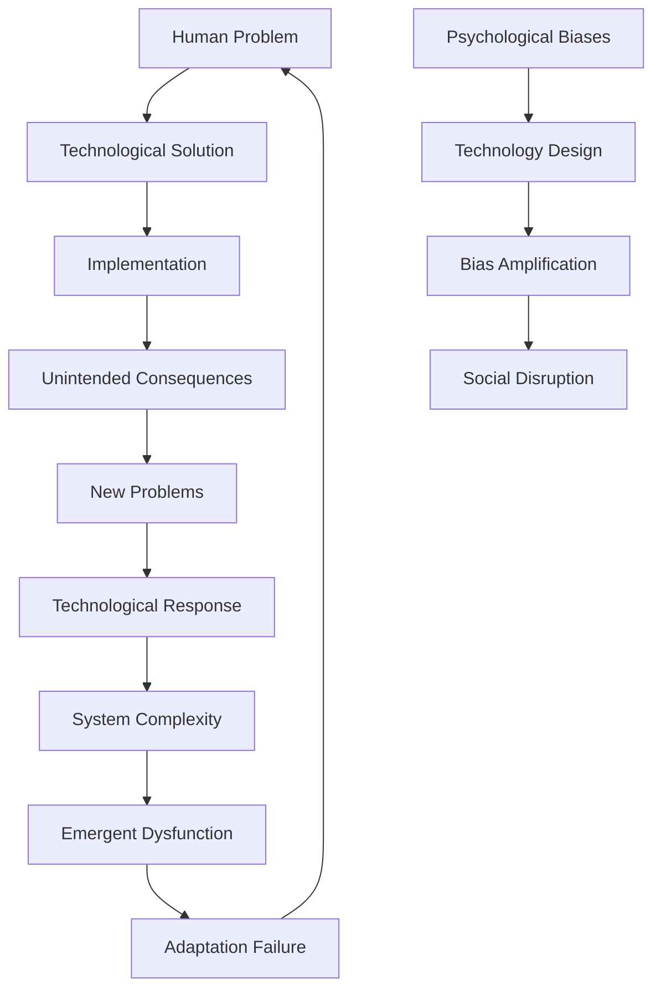
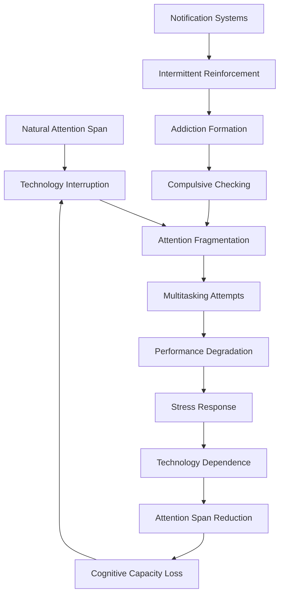
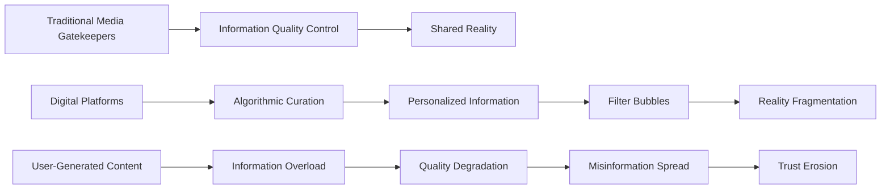
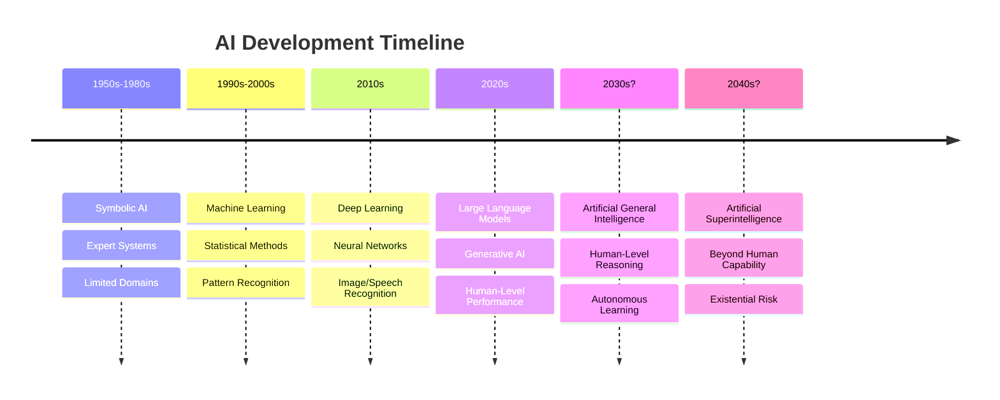

# Technological Disruption: How Technology Exacerbates Human Problems

## Abstract

Technology represents humanity's attempt to extend capabilities and solve problems through tool creation and system design. However, technological innovation systematically exacerbates existing human problems while creating entirely new categories of dysfunction. This analysis examines how technology amplifies psychological biases, disrupts social systems, and creates emergent problems that exceed human adaptive capacity, tracing patterns from the agricultural revolution to artificial intelligence.

## Introduction

Technological disruption represents a fundamental challenge to human social organization, as the pace of technological change increasingly exceeds human psychological and social adaptive capacity. While technology solves specific problems, it simultaneously creates new problems that are often more complex and far-reaching than the original issues.

Contemporary technological disruption—including artificial intelligence, social media, biotechnology, and automation—exemplifies how human-created tools can escape human control and create systemic dysfunction. These problems reflect both the unintended consequences of technological design and the systematic failure to account for human psychological and social limitations in technological development.

## Theoretical Framework

### Technology as Amplifier

Technology functions as a powerful amplifier of existing human capabilities and limitations, rather than simply solving problems or creating neutral tools. This amplification effect explains why technological solutions often create new problems that are more complex than the original issues they were designed to address.

Technology amplifies existing human capabilities and limitations:

- **Cognitive amplification**: Tools extend mental capabilities but also cognitive biases
- **Social amplification**: Communication technologies intensify social dynamics
- **Power amplification**: Technology concentrates and distributes power unevenly
- **Speed amplification**: Accelerated processes exceed human decision-making capacity

**Cognitive amplification** occurs when technologies like search engines and AI systems extend human mental capabilities, allowing us to process more information and make faster calculations. However, these same technologies amplify cognitive biases—search engines reinforce confirmation bias by showing us what we want to see, while AI systems perpetuate the biases present in their training data.

**Social amplification** manifests through communication technologies that intensify existing social dynamics. Social media platforms amplify both positive connections and negative behaviors like bullying, creating more extreme social experiences than would occur in face-to-face interactions.

**Power amplification** describes how technology concentrates capabilities in the hands of those who control it while potentially empowering others. A small number of technology companies gain unprecedented influence over information flow and social interaction, while individuals gain access to powerful tools for communication and organization.

**Speed amplification** refers to how technology accelerates processes beyond human decision-making capacity. High-frequency trading systems make thousands of decisions per second, while social media enables information to spread faster than humans can verify its accuracy, creating systemic instabilities.

### Complex Systems Perspective

Technological systems exhibit emergent properties that arise from the interaction of multiple components, creating behaviors that cannot be predicted from understanding individual parts. This systems perspective explains why technological solutions often produce unintended consequences and why technological problems are so difficult to solve.

Technological systems exhibit emergent properties:

- **Network effects**: Technology adoption creates self-reinforcing cycles
- **Unintended consequences**: System interactions produce unexpected outcomes
- **Path dependence**: Early technological choices constrain future options
- **Technological lock-in**: Switching costs prevent adoption of superior alternatives

**Network effects** occur when the value of a technology increases with the number of users, creating self-reinforcing adoption cycles. Social media platforms become more valuable as more people join, but this also creates monopolistic tendencies and makes it difficult for users to leave even when the platform becomes harmful.

**Unintended consequences** emerge from complex interactions between technological systems and human behavior. The internet was designed to share information, but it also enabled cybercrime, misinformation, and surveillance. These outcomes weren't intended but were inevitable given the system's structure and human nature.

**Path dependence** means that early technological choices constrain future options, even when better alternatives become available. The QWERTY keyboard layout, designed to prevent mechanical typewriter jams, persists in digital devices despite more efficient alternatives existing.

**Technological lock-in** occurs when switching costs prevent adoption of superior alternatives. Users become dependent on particular platforms, formats, or systems, making it economically or practically difficult to change even when better options exist. This explains why inferior technologies can dominate markets and resist replacement.

This diagram illustrates the cyclical nature of technological problem-solving, where each solution creates new problems that require additional technological responses, leading to increasing system complexity and emergent dysfunction. The parallel process shows how psychological biases embedded in technology design amplify human limitations and create social disruption.

## Technology Impact Timeline and Adoption Patterns

This comprehensive timeline reveals the accelerating pace of technological adoption and its corresponding social disruption. The pattern shows how adoption rates have compressed from millennia to hours, while psychological and social impacts have intensified correspondingly. This acceleration explains why contemporary societies struggle to adapt to technological change.

| Technology | Introduction Period | Adoption Rate | Social Disruption | Psychological Impact |
|------------|-------------------|---------------|-------------------|---------------------|
| **Agriculture** | 10,000 BCE | Millennia | Civilization foundation | Delayed gratification |
| **Writing** | 3200 BCE | Centuries | Knowledge preservation | Memory externalization |
| **Printing Press** | 1440 CE | Decades | Information democratization | Authority challenge |
| **Industrial Machinery** | 1760-1840 | Decades | Labor displacement | Work alienation |
| **Telegraph/Telephone** | 1840-1880 | Years | Communication acceleration | Distance collapse |
| **Automobile** | 1885-1920 | Decades | Urban transformation | Mobility expectation |
| **Television** | 1920-1960 | Years | Mass culture creation | Attention fragmentation |
| **Personal Computer** | 1970-1990 | Years | Information processing | Digital divide |
| **Internet** | 1990-2000 | Months | Global connectivity | Information overload |
| **Social Media** | 2000-2010 | Weeks | Social comparison | Validation addiction |
| **Smartphones** | 2007-2015 | Days | Constant connectivity | Attention destruction |
| **AI/Machine Learning** | 2010-present | Hours | Decision automation | Human obsolescence anxiety |

The **Agriculture** revolution took millennia to spread globally, allowing human societies to gradually adapt to settled life, property ownership, and delayed gratification. This slow adoption enabled cultural and psychological adaptation to occur alongside technological change.

**Writing** systems spread over centuries, fundamentally changing how humans store and transmit knowledge. This created the first major externalization of human memory, reducing reliance on oral tradition but also potentially weakening individual memory capabilities.

The **Printing Press** democratized information access over decades, challenging traditional authority structures by making knowledge widely available. This created new forms of social organization but also information chaos as traditional gatekeepers lost control.

**Industrial Machinery** displaced agricultural labor over decades, creating massive social disruption through urbanization and new forms of work alienation. The psychological impact included loss of connection to natural rhythms and traditional community structures.

**Smartphones** represent a critical inflection point where adoption occurred within days of release, creating constant connectivity that fragments attention and creates new forms of psychological dependence. The speed of adoption prevented social adaptation mechanisms from developing.

**AI/Machine Learning** systems are being adopted within hours of release, creating decision automation that outpaces human understanding and generates anxiety about human obsolescence. This represents the fastest technological adoption in human history, with correspondingly intense psychological and social impacts.

## Psychological Amplification Mechanisms

### Cognitive Bias Amplification

Technology systematically amplifies human cognitive limitations by exploiting the same psychological mechanisms that evolved for simpler environments, creating unprecedented opportunities for manipulation and error. Understanding these amplification effects is crucial for recognizing how digital technologies can undermine rational decision-making and human autonomy.

| Cognitive Bias | Technology Amplifier | Amplified Effect | Real-World Example |
|----------------|---------------------|------------------|-------------------|
| **Confirmation Bias** | Algorithm curation | Echo chambers | Social media feeds |
| **Availability Heuristic** | Search engines | Skewed probability estimates | Medical self-diagnosis |
| **Anchoring Effect** | Default settings | Decision manipulation | Software interfaces |
| **Loss Aversion** | Gamification | Addiction mechanisms | Mobile games |
| **Social Proof** | Metrics display | Conformity pressure | Like counts, followers |
| **Authority Bias** | AI recommendations | Algorithmic deference | GPS navigation |

**Confirmation Bias** is amplified by algorithm curation systems that learn user preferences and show them content similar to what they've previously engaged with. The amplified effect creates echo chambers where users are systematically exposed to information that confirms their existing beliefs while being shielded from contradictory evidence. Social media feeds exemplify this, as platforms like Facebook and Twitter use engagement algorithms that prioritize content likely to generate reactions, often reinforcing users' existing viewpoints and creating increasingly polarized information environments.

**Availability Heuristic** is amplified by search engines that make certain types of information more easily accessible than others, skewing probability estimates based on what information is readily available online rather than actual statistical frequencies. Medical self-diagnosis represents a dangerous example, where people search for symptoms and encounter dramatic but rare conditions more easily than common, mundane explanations, leading to health anxiety and inappropriate medical decisions.

**Anchoring Effect** is amplified by default settings in software interfaces that exploit users' tendency to stick with initial options rather than exploring alternatives. This creates decision manipulation where technology companies can influence user behavior by carefully choosing default settings. Software interfaces routinely use this to guide users toward preferred options, from privacy settings that default to maximum data sharing to subscription services that default to automatic renewal.

**Loss Aversion** is amplified by gamification systems that create artificial losses and gains, exploiting the psychological tendency to feel losses more intensely than equivalent gains. This creates addiction mechanisms where users become compulsively engaged to avoid losing progress, points, or status. Mobile games exemplify this through mechanics like daily login bonuses, limited-time offers, and progress that can be lost if not maintained, creating psychological pressure to continue engagement.

**Social Proof** is amplified by metrics display systems that make social validation quantifiable and visible, creating conformity pressure based on numerical measures of approval. Like counts, follower numbers, and engagement metrics transform social validation into a competitive game where users modify their behavior to maximize these metrics rather than expressing authentic preferences or opinions.

**Authority Bias** is amplified by AI recommendations that present algorithmic suggestions with the appearance of expertise and objectivity, leading to algorithmic deference where users follow automated recommendations without critical evaluation. GPS navigation systems demonstrate this, as people often follow GPS directions even when they contradict local knowledge or common sense, sometimes leading to dangerous or absurd outcomes.

### Attention and Focus Disruption

### Social Comparison Intensification

Technology amplifies social comparison processes:

- **Curated self-presentation**: Social media creates unrealistic comparison standards
- **Global comparison scope**: Technology expands reference groups beyond local communities
- **Quantified metrics**: Numerical measures of social status become obsessive focus
- **Constant availability**: 24/7 access to comparison opportunities

## Social System Disruption Patterns

### Labor Market Transformation

| Technology Wave | Jobs Eliminated | Jobs Created | Net Effect | Social Consequence |
|-----------------|----------------|--------------|------------|-------------------|
| **Mechanization** | Agricultural labor | Factory workers | Displacement | Rural-urban migration |
| **Automation** | Manufacturing | Service sector | Skill shift | Middle class erosion |
| **Computerization** | Clerical work | IT professionals | Polarization | Income inequality |
| **AI/Robotics** | Cognitive work | AI specialists | Concentration | Mass unemployment risk |

### Communication and Relationship Changes

Technology fundamentally alters human social interaction:

- **Mediated communication**: Face-to-face interaction skills atrophy
- **Asynchronous interaction**: Immediate response expectations create stress
- **Relationship commodification**: Dating apps treat relationships as markets
- **Parasocial relationships**: One-way emotional connections with media figures

### Information Ecosystem Disruption

## Case Studies in Technological Social Disruption

### Social Media and Mental Health

**Platform Mechanisms:**
- Infinite scroll design creates addictive usage patterns
- Like/share metrics trigger dopamine reward systems
- Social comparison features amplify status anxiety
- Algorithmic amplification of extreme content

**Psychological Consequences:**
- Increased rates of depression and anxiety among heavy users
- Body image distortion through filtered/edited content
- Fear of missing out (FOMO) and social validation dependence
- Attention span reduction and focus difficulties

**Social Consequences:**
- Political polarization through echo chamber effects
- Cyberbullying and online harassment normalization
- Misinformation spread and conspiracy theory amplification
- Real-world relationship quality degradation

### Automation and Economic Displacement

**Historical Pattern:**
1. **Initial Phase**: Technology increases productivity and creates new jobs
2. **Transition Phase**: Skill requirements change, some workers displaced
3. **Adaptation Phase**: Education systems adjust, new equilibrium emerges
4. **Disruption Phase**: Change pace exceeds adaptation capacity

**Contemporary AI Disruption:**
- **Speed**: AI capabilities advance exponentially, not linearly
- **Scope**: Cognitive work previously thought safe becomes automatable
- **Scale**: Global deployment possible within years, not decades
- **Concentration**: Benefits accrue to technology owners, not workers

### Smartphone Addiction and Behavioral Change

**Addiction Mechanisms:**
- Variable ratio reinforcement through notifications
- Social validation through likes and comments
- Fear of missing out driving compulsive checking
- Dopamine system hijacking through app design

**Behavioral Consequences:**
- Phantom vibration syndrome and nomophobia
- Reduced face-to-face communication skills
- Shortened attention spans and focus difficulties
- Sleep disruption through blue light exposure and usage before bed

## Biotechnology and Human Enhancement Risks

### Genetic Engineering Implications

| Enhancement Type | Potential Benefits | Dystopian Risks | Ethical Concerns |
|------------------|-------------------|-----------------|------------------|
| **Intelligence** | Disease prevention | Cognitive inequality | Human dignity |
| **Physical Traits** | Health improvement | Appearance pressure | Natural diversity |
| **Longevity** | Extended lifespan | Resource competition | Generational conflict |
| **Emotional Regulation** | Mental health | Authenticity loss | Emotional diversity |

### Enhancement Inequality

Biotechnology may create new forms of human stratification:

- **Genetic class system**: Enhanced vs. unenhanced humans
- **Cognitive aristocracy**: Intelligence enhancement for elites only
- **Physical optimization**: Athletic and aesthetic advantages for wealthy
- **Longevity divide**: Life extension increases existing inequalities

## Artificial Intelligence and Human Obsolescence

### AI Capability Progression

### Human-AI Interaction Problems

- **Algorithmic bias**: AI systems perpetuate and amplify human prejudices
- **Black box decisions**: Inability to understand AI reasoning processes
- **Human deskilling**: Overreliance on AI reduces human capabilities
- **Manipulation potential**: AI systems designed to influence human behavior

### Existential Risk Scenarios

AI development poses potential existential threats:

- **Control problem**: Inability to maintain human control over superintelligent AI
- **Alignment problem**: AI goals diverge from human values and interests
- **Rapid capability gain**: AI improvement speed exceeds safety development
- **Economic displacement**: Mass unemployment leads to social instability

## Environmental and Resource Impacts

### Technology's Environmental Amplification

| Technology Sector | Resource Consumption | Environmental Impact | Sustainability Challenge |
|------------------|---------------------|---------------------|-------------------------|
| **Data Centers** | Energy, water, rare metals | Carbon emissions, heat | Exponential growth |
| **Cryptocurrency** | Massive electricity use | Coal power dependence | Proof-of-work algorithms |
| **Consumer Electronics** | Rare earth mining | Toxic waste, habitat destruction | Planned obsolescence |
| **Transportation** | Fossil fuels, lithium | Air pollution, mining | Infrastructure lock-in |

### Rebound Effects

Technology efficiency gains often increase total consumption:

- **Jevons Paradox**: Efficiency improvements lead to increased usage
- **Induced demand**: Better technology creates new demand categories
- **Behavioral adaptation**: Users adjust behavior to consume efficiency gains
- **System-wide effects**: Local efficiency may increase global consumption

## Psychological Adaptation Failures

### Evolutionary Mismatch

Human psychology evolved for small-group, low-technology environments:

- **Information processing**: Overwhelmed by digital information volume
- **Social cognition**: Designed for face-to-face interaction in small groups
- **Risk assessment**: Calibrated for immediate, physical threats
- **Reward systems**: Exploited by artificial stimuli and intermittent reinforcement

### Technology Addiction Mechanisms

## Future Technological Risks

### Emerging Disruption Vectors

1. **Brain-Computer Interfaces**: Direct neural manipulation and privacy invasion
2. **Quantum Computing**: Cryptographic security breakdown and surveillance expansion
3. **Nanotechnology**: Environmental and health risks from molecular manipulation
4. **Virtual/Augmented Reality**: Reality perception distortion and escapism
5. **Space Technology**: Resource competition and militarization of space

### Convergence Risks

Multiple technologies combining create unprecedented challenges:

- **AI + Biotechnology**: Designed organisms and enhanced humans
- **AI + Surveillance**: Total monitoring and behavioral prediction
- **Robotics + AI**: Autonomous weapons and labor replacement
- **Biotechnology + Nanotechnology**: Molecular-level life manipulation

## Mitigation and Adaptation Strategies

### Technological Governance

Addressing technological disruption requires new governance approaches:

- **Anticipatory regulation**: Proactive rather than reactive policy development
- **International coordination**: Global cooperation on technology standards
- **Ethical frameworks**: Value-based technology development guidelines
- **Democratic participation**: Public involvement in technology policy decisions

### Human-Centered Design

Technology development should prioritize human wellbeing:

- **Attention protection**: Design that respects human cognitive limitations
- **Social connection**: Technology that enhances rather than replaces relationships
- **Meaningful work**: Automation that augments rather than replaces humans
- **Privacy preservation**: Data protection and algorithmic transparency

### Adaptation Support

Helping humans adapt to technological change:

- **Digital literacy**: Education about technology impacts and usage
- **Psychological resilience**: Mental health support for technology-related stress
- **Social safety nets**: Economic support during technological transitions
- **Community building**: Maintaining human connections in digital age

## Cross-References

- [See: Individual Psychology → Cognitive Biases](../individual/cognitive-biases-heuristics.md)
- [See: Individual Psychology → Addiction and Compulsion](../individual/addiction-compulsion.md)
- [Related: Economic Systems → Labor Market Disruption](economic-system-dysfunction.md)
- [Compare: Cultural Systems → Digital Culture Dysfunction](cultural-pathology.md)

## Conclusion

Technological disruption represents a fundamental challenge to human flourishing, as the pace and scale of technological change increasingly exceed human adaptive capacity. Technology systematically amplifies existing human psychological and social vulnerabilities while creating entirely new categories of problems.

Understanding technological disruption requires recognizing that technology is not neutral—it embeds values, assumptions, and biases that shape human behavior and social organization. The analysis reveals that technological problems often stem from the failure to account for human psychological limitations and social dynamics in technology design and deployment.

Contemporary technological challenges including AI development, social media addiction, and automation displacement reflect both timeless human vulnerabilities and novel features of exponential technological change. The speed of technological development may be creating a permanent state of social disruption that exceeds human adaptive capacity.

Future technological governance must prioritize human wellbeing over technological capability, implementing anticipatory regulation, ethical frameworks, and democratic participation in technology policy. This requires moving beyond purely technical approaches to embrace interdisciplinary perspectives that account for the psychological, social, and cultural dimensions of technological change.

The ultimate challenge is developing wisdom to match our technological power—creating technologies that enhance rather than diminish human flourishing while maintaining human agency and meaning in an increasingly automated world.

---

*This document is part of the Humanity's Fundamental Problems Documentation System, providing interdisciplinary analysis of societal-level dysfunction patterns.*