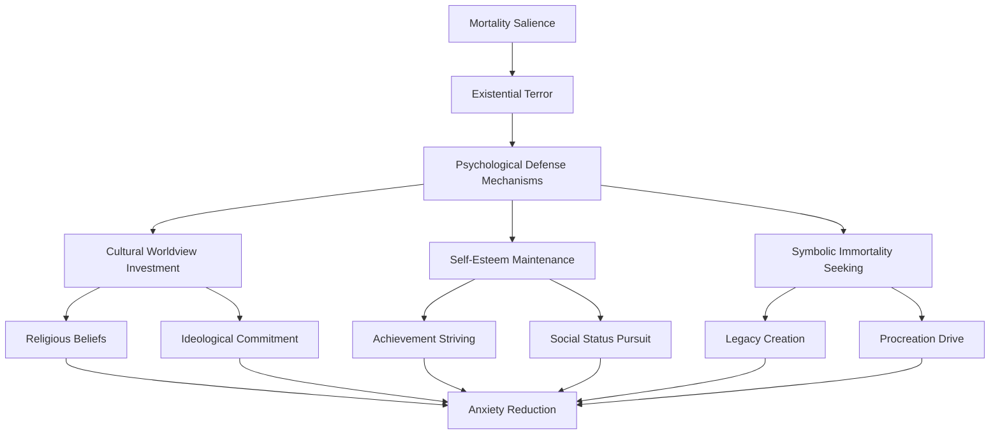
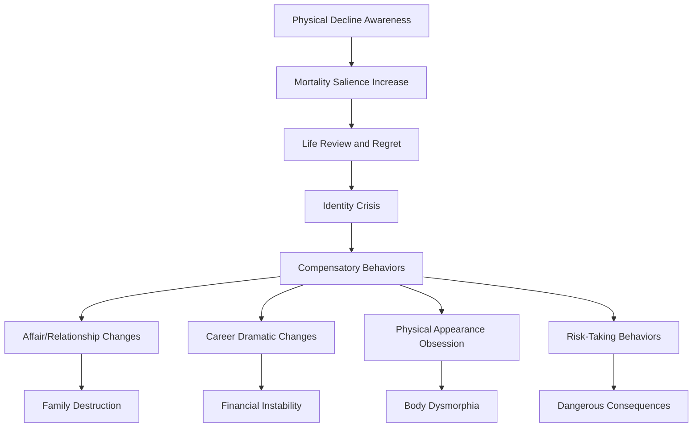
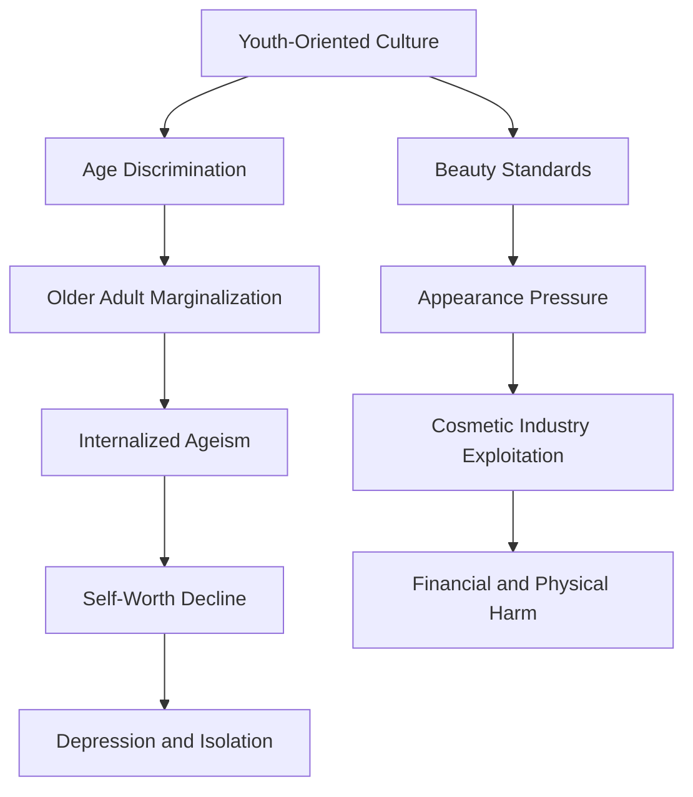
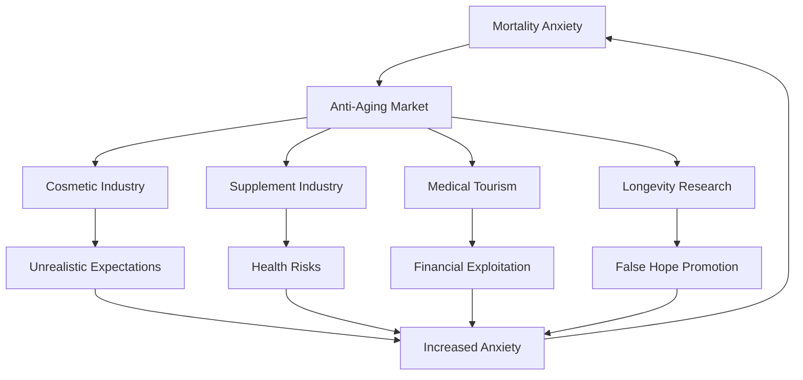
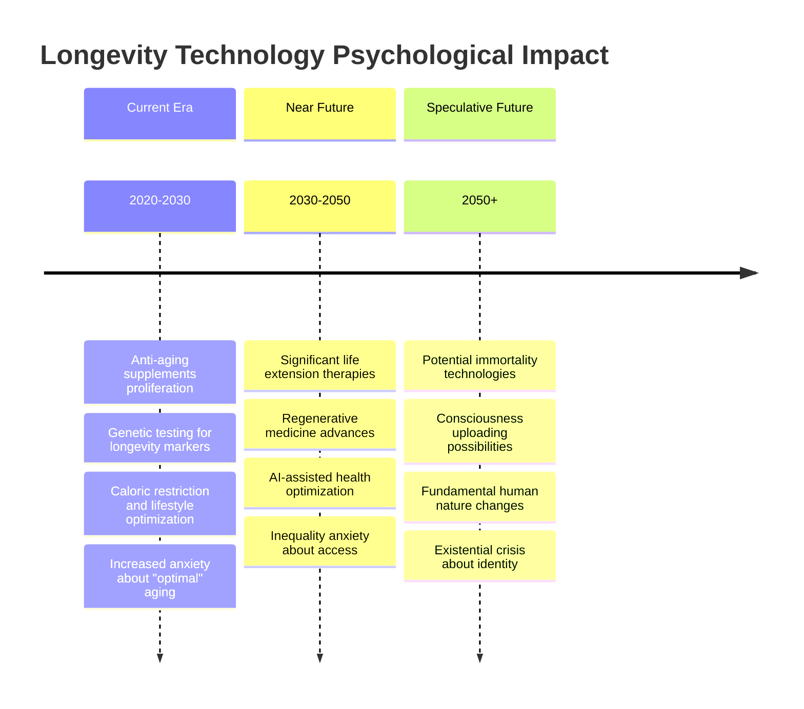
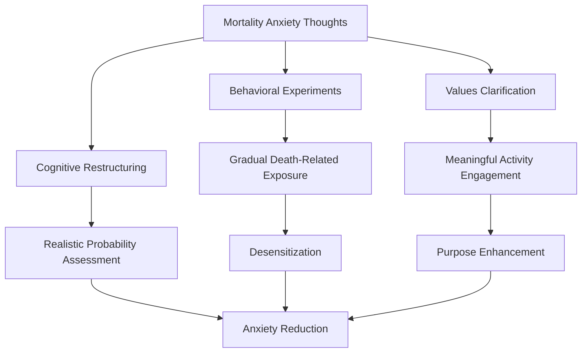
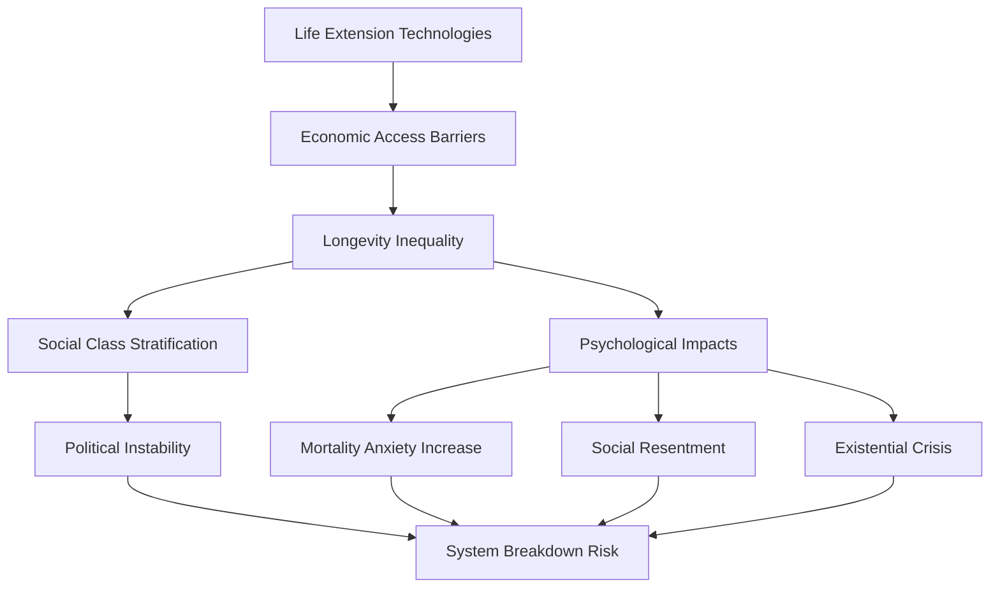

# Aging and Mortality Anxiety: Psychological Responses to Temporal Finitude

## Abstract

This document examines the profound psychological challenges humans face when confronting aging and mortality, analyzing how awareness of temporal finitude creates systematic anxiety, denial mechanisms, and maladaptive behaviors. The analysis integrates existential psychology, terror management theory, developmental psychology, and cross-cultural studies to understand how mortality salience shapes individual psychology and social behavior across the lifespan.

## Introduction

Humans are unique among animals in possessing explicit awareness of their own mortality and the aging process that leads to death. This consciousness of temporal finitude creates what existential psychologists term "mortality salience" - a persistent background awareness that generates profound anxiety and shapes behavior in both adaptive and maladaptive ways.

Unlike other species that live primarily in the present, humans must psychologically manage the knowledge that they will age, decline, and eventually cease to exist. This creates systematic psychological challenges that manifest across individual development, interpersonal relationships, and cultural systems. The dysfunction emerges from the fundamental mismatch between human consciousness and biological reality - we are evolved organisms with the cognitive capacity to understand our own impermanence.

## Theoretical Foundations

### Terror Management Theory

Terror Management Theory (TMT) provides the primary framework for understanding mortality anxiety:

### Existential Psychology Framework

The existential approach identifies core anxieties related to human finitude:

| Existential Given | Psychological Challenge | Defensive Response | Dysfunction Potential |
|------------------|------------------------|-------------------|---------------------|
| **Death** | Mortality terror | Denial, immortality projects | Death anxiety, risk aversion |
| **Isolation** | Ultimate aloneness | Fusion, codependency | Relationship dysfunction |
| **Freedom** | Responsibility burden | Conformity, authority submission | Authenticity loss |
| **Meaninglessness** | Existential vacuum | Meaning-making compulsion | Fanaticism, nihilism |

## Developmental Psychology of Aging Awareness

### Life Stage Analysis

Human awareness and anxiety about aging develops through predictable stages, each with characteristic challenges and dysfunctions:

#### Childhood and Adolescence (Ages 5-18)

**Initial Death Awareness (Ages 5-7)**
- First understanding of death's universality and inevitability
- Magical thinking and denial mechanisms develop
- Separation anxiety and attachment intensification

**Adolescent Mortality Confrontation (Ages 13-18)**
- Abstract thinking enables full mortality comprehension
- Risk-taking behaviors as mortality denial
- Identity formation complicated by temporal awareness

| Age Range | Mortality Understanding | Primary Anxiety | Defensive Behaviors |
|-----------|------------------------|-----------------|-------------------|
| **5-7** | Death happens to others | Separation from parents | Magical thinking, ritual behaviors |
| **8-12** | Death is universal but distant | Personal vulnerability | Hero worship, invincibility fantasies |
| **13-15** | Death applies to self | Identity and time pressure | Risk-taking, rebellion |
| **16-18** | Death is inevitable | Future planning anxiety | Achievement pressure, perfectionism |

#### Early Adulthood (Ages 18-30)

**Invincibility Illusion**
- Peak physical condition masks aging awareness
- Future-oriented anxiety about career and relationships
- Procrastination and avoidance of long-term planning

**First Aging Markers**
- Physical changes begin (metabolism, recovery time)
- Peer comparisons and competitive anxiety
- Career pressure and achievement urgency

#### Middle Age (Ages 30-50)

**Midlife Crisis Phenomenon**
The classic midlife crisis represents a systematic confrontation with mortality and aging:

**Generativity vs. Stagnation**
- Pressure to create lasting contributions
- Parenting anxiety about children's futures
- Career achievement evaluation and panic

#### Later Life (Ages 50+)

**Aging Acceleration Awareness**
- Visible physical changes and health decline
- Peer mortality and funeral attendance increase
- Retirement and purpose loss anxiety

**Legacy Anxiety**
- Evaluation of life accomplishments
- Regret and missed opportunity rumination
- Desperate attempts at meaning-making

## Individual-Level Psychological Pathologies

### Mortality Anxiety Disorders

#### Thanatophobia (Death Anxiety)
Excessive fear of death that interferes with normal functioning:

- **Symptoms**: Panic attacks when thinking about death, avoidance of death-related stimuli, obsessive health monitoring
- **Prevalence**: Estimated 3-10% of population with clinical levels
- **Comorbidity**: Often co-occurs with generalized anxiety, depression, and obsessive-compulsive disorders
- **Treatment Challenges**: Difficulty addressing rational fear of inevitable outcome

#### Aging Anxiety (Gerascophobia)
Pathological fear of the aging process itself:

| Manifestation | Behavioral Pattern | Psychological Impact |
|---------------|-------------------|---------------------|
| **Appearance Obsession** | Excessive cosmetic procedures, exercise compulsion | Body dysmorphia, financial strain |
| **Health Hypochondria** | Constant medical monitoring, supplement abuse | Medical anxiety, iatrogenic harm |
| **Youth Chasing** | Age-inappropriate relationships, lifestyle | Social dysfunction, identity confusion |
| **Denial Behaviors** | Lying about age, avoiding age-related activities | Authenticity loss, social isolation |

### Temporal Perspective Dysfunction

#### Future Time Perspective Disorders
Distorted perception of remaining time creates systematic problems:

**Foreshortened Future Syndrome**
- Inability to plan or invest in long-term goals
- Present-focused hedonism and impulsivity
- Relationship and career sabotage

**Infinite Time Illusion**
- Procrastination and delayed gratification failure
- Unrealistic life planning and goal setting
- Midlife crisis when reality intrudes

#### Regret and Rumination Pathologies
Excessive focus on past decisions and missed opportunities:

### Meaning-Making Compulsions

#### Legacy Obsession
Desperate attempts to create lasting impact:

- **Achievement Addiction**: Compulsive work and accomplishment seeking
- **Procreation Pressure**: Having children for immortality rather than love
- **Monument Building**: Excessive focus on material legacy creation
- **Fame Seeking**: Pursuing recognition as mortality denial

#### Spiritual Bypassing
Using religious or spiritual beliefs to avoid mortality anxiety:

- **Afterlife Obsession**: Excessive focus on post-death existence
- **Reincarnation Fantasies**: Belief in continued existence through rebirth
- **Transcendence Seeking**: Attempting to escape human condition
- **Guru Worship**: Surrendering autonomy to spiritual authorities

## Interpersonal and Social Dynamics

### Relationship Impacts of Mortality Anxiety

#### Attachment and Mortality Salience
Awareness of mortality profoundly affects relationship patterns:

| Attachment Style | Mortality Response | Relationship Dysfunction |
|-----------------|-------------------|-------------------------|
| **Secure** | Balanced awareness, meaning through connection | Minimal dysfunction, healthy grieving |
| **Anxious** | Clinging, abandonment terror | Codependency, jealousy, control |
| **Avoidant** | Emotional distancing, independence emphasis | Isolation, intimacy avoidance |
| **Disorganized** | Chaotic responses, approach-avoidance | Unstable relationships, emotional volatility |

#### Intergenerational Mortality Transmission
Parents' mortality anxiety affects children's development:

**Overprotection Patterns**
- Excessive safety concerns limiting child development
- Anxiety transmission through modeling
- Helicopter parenting and autonomy prevention

**Mortality Salience Induction**
- Inappropriate death discussions with children
- Using mortality threats for behavior control
- Transmitting existential anxiety to next generation

### Social Comparison and Aging

#### Age-Related Social Hierarchies
Society creates systematic age-based status differences that amplify aging anxiety:

#### Peer Mortality and Social Networks
As individuals age, peer deaths create cascading psychological effects:

- **Survivor Guilt**: Feeling guilty about outliving friends and family
- **Social Network Shrinkage**: Increasing isolation as peers die
- **Mortality Salience Increase**: Each death reminder increases anxiety
- **Anticipatory Grief**: Mourning relationships before they end

## Cultural Variations in Death Anxiety Management

### Western Individualistic Approaches

#### American Death Denial Culture
American society exhibits systematic death avoidance:

| Cultural Practice | Death Denial Mechanism | Psychological Consequence |
|------------------|------------------------|-------------------------|
| **Medical System** | Death as medical failure | Unrealistic expectations, treatment burden |
| **Funeral Industry** | Cosmetic death presentation | Grief process interference |
| **Youth Culture** | Age discrimination, beauty obsession | Aging anxiety amplification |
| **Retirement System** | Age-based segregation | Social isolation, purpose loss |

#### European Approaches
European cultures show varied approaches to mortality:

- **Scandinavian Pragmatism**: Direct death discussion, social support systems
- **Mediterranean Family Focus**: Intergenerational living, death as natural
- **Germanic Philosophical Tradition**: Existential acceptance, meaning emphasis
- **British Stoicism**: Emotional restraint, duty-based coping

### Eastern Philosophical Frameworks

#### Buddhist Impermanence Acceptance
Buddhism provides systematic training for mortality acceptance:

#### Hindu Cyclical Time Concepts
- **Reincarnation Beliefs**: Death as transition rather than ending
- **Karma Philosophy**: Present actions affecting future lives
- **Dharma Focus**: Duty-based living reducing existential anxiety
- **Ashrama System**: Life stage acceptance and role clarity

#### Confucian Ancestor Veneration
- **Filial Piety**: Honoring ancestors provides continuity sense
- **Social Harmony**: Individual mortality within collective permanence
- **Ritual Observance**: Structured responses to death and aging
- **Generational Responsibility**: Legacy through family continuation

### Indigenous and Traditional Approaches

#### Shamanic Death Integration
Traditional societies often integrate death awareness into daily life:

| Culture | Death Integration Practice | Psychological Function |
|---------|---------------------------|----------------------|
| **Tibetan** | Death meditation, bardo training | Mortality preparation, anxiety reduction |
| **Mexican** | Day of the Dead celebrations | Death normalization, community support |
| **Aboriginal** | Dreamtime concepts, ancestor connection | Continuity sense, spiritual comfort |
| **Native American** | Vision quests, death songs | Meaning-making, courage development |

## Societal-Level Implications

### Economic Systems and Aging Anxiety

#### Age-Based Economic Discrimination
Modern economies systematically disadvantage older workers:

- **Hiring Bias**: Age discrimination in employment
- **Technology Gaps**: Rapid change excluding older workers
- **Retirement Pressure**: Forced obsolescence and income loss
- **Healthcare Costs**: Financial anxiety about medical expenses

#### Anti-Aging Industry Exploitation
Capitalism profits from mortality anxiety:

### Healthcare System Dysfunction

#### Medical Model Limitations
Modern medicine's approach to aging creates systematic problems:

- **Disease Model**: Treating aging as pathology rather than natural process
- **Intervention Bias**: Over-treatment of elderly patients
- **Quality vs. Quantity**: Extending life without considering quality
- **End-of-Life Care**: Inadequate preparation for death and dying

#### Mental Health System Gaps
Psychological services inadequately address mortality anxiety:

- **Therapist Avoidance**: Mental health professionals' own death anxiety
- **Treatment Limitations**: Difficulty addressing rational fears
- **Cultural Competence**: Lack of training in existential approaches
- **Insurance Coverage**: Limited coverage for existential therapy

### Political and Social Policy Implications

#### Intergenerational Conflict
Aging populations create systematic political tensions:

| Issue | Young Generation Perspective | Older Generation Perspective | Conflict Result |
|-------|----------------------------|----------------------------|----------------|
| **Social Security** | Unsustainable burden | Earned benefit | Political deadlock |
| **Healthcare** | Resource competition | Survival necessity | Rationing debates |
| **Climate Change** | Future survival | Present comfort | Policy paralysis |
| **Technology** | Innovation necessity | Stability preference | Cultural division |

#### Democratic Participation and Aging
Mortality salience affects political engagement:

- **Short-Term Focus**: Older voters prioritizing immediate benefits
- **Risk Aversion**: Resistance to necessary but uncertain changes
- **Legacy Concerns**: Voting based on children's futures vs. personal needs
- **Wisdom vs. Rigidity**: Experience benefits vs. change resistance

## Technological Impacts on Mortality Anxiety

### Life Extension Technologies

#### Longevity Research and Psychological Effects
Scientific advances in aging research create new forms of anxiety:

#### Inequality and Access Anxiety
Life extension technologies may create new forms of mortality-related anxiety:

- **Economic Stratification**: Rich living longer than poor
- **Treatment Access**: Anxiety about affording life extension
- **Timing Concerns**: Fear of dying just before breakthrough treatments
- **Identity Questions**: What constitutes self if life is indefinitely extended

### Digital Immortality and Legacy

#### Social Media and Digital Permanence
Technology creates new forms of symbolic immortality:

- **Digital Legacy**: Social media profiles outlasting physical death
- **Content Creation**: Blogs, videos, and posts as immortality projects
- **Virtual Relationships**: Online connections transcending physical limitations
- **AI Resurrection**: Potential for AI recreation of deceased individuals

#### Virtual Reality and Mortality Denial
VR technologies may enable unprecedented mortality avoidance:

- **Simulated Worlds**: Escape from aging and death awareness
- **Avatar Bodies**: Experience of non-aging digital selves
- **Time Distortion**: Virtual experiences altering temporal perception
- **Reality Dissociation**: Preference for virtual over physical existence

## Therapeutic Approaches and Interventions

### Individual-Level Interventions

#### Existential Therapy Approaches
Therapeutic methods specifically addressing mortality anxiety:

| Therapy Type | Core Technique | Target Outcome |
|-------------|----------------|----------------|
| **Existential Analysis** | Meaning exploration, authenticity focus | Acceptance of finitude, authentic living |
| **Terror Management Therapy** | Death anxiety exposure, worldview examination | Reduced defensive behaviors |
| **Acceptance and Commitment Therapy** | Values clarification, psychological flexibility | Present-moment engagement |
| **Mindfulness-Based Interventions** | Meditation, impermanence awareness | Anxiety reduction, acceptance |

#### Cognitive-Behavioral Approaches
CBT techniques adapted for mortality anxiety:

### Group and Community Interventions

#### Death Cafes and Mortality Discussion Groups
Structured environments for death conversation:

- **Peer Support**: Sharing mortality concerns with others
- **Normalization**: Reducing isolation around death anxiety
- **Education**: Learning about death and dying processes
- **Preparation**: Practical planning for end-of-life issues

#### Intergenerational Programs
Connecting different age groups to reduce aging anxiety:

- **Mentorship Programs**: Older adults sharing wisdom with youth
- **Skill Exchange**: Teaching and learning across generations
- **Storytelling Projects**: Preserving and sharing life experiences
- **Community Gardens**: Collaborative projects emphasizing continuity

### Societal-Level Interventions

#### Educational System Reform
Integrating mortality awareness into education:

| Educational Level | Curriculum Integration | Learning Objectives |
|------------------|----------------------|-------------------|
| **Elementary** | Natural cycles, pet death | Basic death understanding |
| **Middle School** | Philosophy, meaning exploration | Existential awareness development |
| **High School** | Ethics, life planning | Values clarification, future orientation |
| **College** | Existential psychology, death studies | Professional and personal preparation |

#### Healthcare System Changes
Reforming medical approaches to aging and death:

- **Palliative Care Integration**: Earlier introduction of comfort-focused care
- **Death Doula Training**: Professional support for dying process
- **Advance Directive Education**: Encouraging end-of-life planning
- **Provider Training**: Educating healthcare workers about mortality anxiety

#### Cultural Shift Initiatives
Promoting healthier cultural attitudes toward aging and death:

- **Media Representation**: Positive aging portrayals in entertainment
- **Workplace Age Inclusion**: Reducing age discrimination in employment
- **Community Design**: Age-friendly environments and intergenerational spaces
- **Ritual Development**: Creating meaningful ceremonies for life transitions

## Future Projections and Emerging Challenges

### Demographic Transitions

#### Global Aging Population
Worldwide demographic shifts create unprecedented challenges:

| Region | Current Median Age | Projected 2050 | Societal Implications |
|--------|-------------------|----------------|---------------------|
| **Japan** | 48.4 years | 54.7 years | Economic decline, social isolation |
| **Europe** | 43.1 years | 47.1 years | Political conservatism, healthcare strain |
| **North America** | 38.5 years | 42.1 years | Intergenerational conflict, resource competition |
| **Global Average** | 30.9 years | 36.2 years | Unprecedented aging challenges |

#### Longevity Inequality
Differential life expectancy may create new social stratifications:

### Technological Disruption Scenarios

#### Scenario 1: Gradual Life Extension
Incremental increases in human lifespan (100-150 years):

- **Psychological Adaptation**: Gradual adjustment to extended lifespans
- **Social Structure Changes**: New life stages and career patterns
- **Relationship Evolution**: Multi-century marriages and friendships
- **Identity Challenges**: Maintaining coherent self over extended time

#### Scenario 2: Radical Life Extension
Dramatic lifespan increases (500+ years):

- **Existential Revolution**: Fundamental changes in human psychology
- **Social Stratification**: Extreme inequality between enhanced and natural humans
- **Cultural Stagnation**: Reduced innovation due to entrenched leadership
- **Resource Competition**: Unprecedented environmental and economic pressures

#### Scenario 3: Digital Consciousness Transfer
Uploading human consciousness to digital substrates:

- **Identity Crisis**: Questions about continuity of self
- **Mortality Redefinition**: Death becomes optional but identity becomes fluid
- **Social Fragmentation**: Division between biological and digital humans
- **Existential Meaninglessness**: Loss of traditional human experience

### Adaptive Strategies and Resilience Building

#### Individual Resilience Factors
Characteristics that promote healthy aging and mortality acceptance:

- **Meaning-Making Capacity**: Ability to find purpose across life stages
- **Social Connection**: Maintaining relationships throughout aging
- **Adaptability**: Flexibility in response to physical and cognitive changes
- **Spiritual Development**: Transcendent perspective on mortality
- **Legacy Focus**: Creating meaningful contributions for future generations

#### Community Resilience Strategies
Social structures that support healthy aging:

- **Intergenerational Integration**: Mixed-age communities and activities
- **Wisdom Preservation**: Systems for capturing and transmitting elder knowledge
- **Mutual Support Networks**: Community care for aging members
- **Meaningful Role Provision**: Continued purpose and contribution opportunities
- **Death Preparation Culture**: Open discussion and planning for mortality

#### Societal Adaptation Requirements
Large-scale changes needed for aging population management:

- **Economic System Reform**: Sustainable models for aging populations
- **Healthcare Transformation**: Focus on quality of life over quantity
- **Educational Evolution**: Lifelong learning and career flexibility
- **Political Representation**: Age-balanced governance and decision-making
- **Cultural Renewal**: Positive aging narratives and death acceptance

## Conclusion

Aging and mortality anxiety represent fundamental challenges inherent to human consciousness - the unique burden of beings who can contemplate their own temporal finitude. These anxieties create systematic psychological, interpersonal, and social dysfunctions that affect individuals across the lifespan and shape cultural institutions and practices.

The problems operate at multiple levels: individual psychological pathologies related to death anxiety and aging fears, interpersonal dynamics affected by mortality salience, and societal structures that often amplify rather than ameliorate these concerns. Cultural variations demonstrate that while mortality anxiety is universal, its expression and management can be significantly influenced by worldview, social support, and meaning-making systems.

Current demographic transitions toward aging populations, combined with emerging life extension technologies, create unprecedented challenges that require new approaches to mortality anxiety management. The solutions must integrate individual therapeutic interventions, community support systems, and societal reforms that acknowledge both the reality of human finitude and the psychological needs created by mortality awareness.

The path forward requires courage to face mortality directly rather than through denial, wisdom to create meaning within temporal constraints, and compassion to support others through the universal human experience of aging and dying. Success in managing these challenges may determine not only individual psychological well-being but also the stability and sustainability of human societies facing demographic transformation.

Ultimately, the goal is not to eliminate mortality anxiety - which may be impossible and potentially counterproductive - but to develop healthier, more adaptive responses that allow for authentic living within the constraints of human finitude while maintaining hope, meaning, and connection throughout the aging process.

## References and Further Reading

### Primary Sources
- Becker, E. (1973). *The Denial of Death*
- Yalom, I. D. (2008). *Staring at the Sun: Overcoming the Terror of Death*
- Pyszczynski, T., Greenberg, J., & Solomon, S. (2015). *Sheltering Ourselves from the Anxiety of Death*
- Butler, R. N. (1963). *The Life Review: An Interpretation of Reminiscence in the Aged*

### Cross-References
- [See: Individual Psychology → Existential Psychology](../individual/existential-psychology.md)
- [Related: Group Dynamics → Social Psychology](../group/social-psychology.md)
- [Compare: Cultural Analysis → Cultural Pathology](../societal/cultural-pathology.md)
- [Integration: Systems Theory → Cross-Level Integration](../integrative/cross-level-integration.md)

---

*This document represents an interdisciplinary analysis of aging and mortality anxiety from psychological, sociological, anthropological, and cultural perspectives. The analysis aims to understand the systematic challenges created by human awareness of temporal finitude while maintaining academic rigor and evidence-based reasoning.*