# Communication and Language Failures: Systematic Breakdowns in Human Information Exchange

## Abstract

This document examines the fundamental problems in human communication and language that create systematic misunderstanding, conflict, and social dysfunction. The analysis integrates linguistics, cognitive psychology, social psychology, and communication theory to understand how the very systems humans use to share information and coordinate behavior become sources of confusion, manipulation, and social fragmentation.

## Introduction

Human communication represents both humanity's greatest achievement and one of its most persistent sources of problems. While language enables complex coordination, knowledge transmission, and social bonding, it also creates systematic opportunities for misunderstanding, manipulation, and conflict. The same cognitive and social mechanisms that make communication possible also make it vulnerable to failure.

Communication failures operate across multiple levels: individual cognitive limitations in processing and expressing information, interpersonal dynamics that distort message transmission and reception, group-level phenomena that amplify miscommunication, and societal-level systems that systematically manipulate or degrade information quality. These failures contribute to virtually every other human problem, from personal relationship conflicts to international wars.

## Theoretical Foundations of Communication Failure

### Information Theory and Communication Models

The basic communication model reveals multiple points of systematic failure:

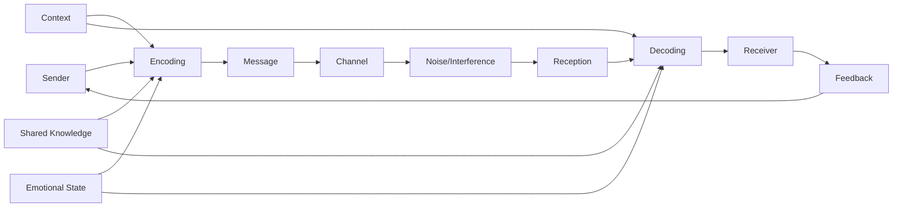

### Cognitive Limitations in Communication

#### Working Memory Constraints
Human cognitive architecture creates systematic communication limitations:

| Cognitive Limit | Communication Impact | Failure Pattern | Example |
|----------------|---------------------|-----------------|---------|
| **Working Memory** | 7±2 item processing limit | Information overload, detail loss | Complex instruction misunderstanding |
| **Attention** | Single-focus processing | Selective hearing, distraction | Missing important information |
| **Processing Speed** | Temporal limitations | Rushed conclusions, incomplete analysis | Interrupting before understanding |
| **Long-term Memory** | Reconstruction errors | False memories, detail distortion | Witness testimony unreliability |

#### Cognitive Biases in Communication
Systematic thinking errors affect information processing:

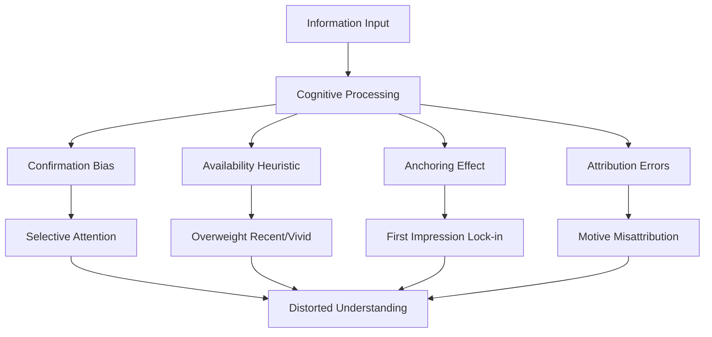

## Individual-Level Communication Pathologies

### Language Processing Disorders

#### Developmental Communication Disorders
Systematic problems in language acquisition and use:

- **Autism Spectrum Disorders**: Difficulty with pragmatic communication, nonverbal cues, social context
- **Specific Language Impairment**: Problems with grammar, vocabulary, or language structure
- **Social Communication Disorder**: Challenges with social use of language in context
- **Selective Mutism**: Inability to speak in specific social situations despite normal language ability

#### Acquired Communication Impairments
Brain damage or disease affecting communication:

| Condition | Primary Deficit | Communication Impact | Social Consequence |
|-----------|----------------|---------------------|-------------------|
| **Aphasia** | Language production/comprehension | Reduced expression ability | Social isolation, frustration |
| **Dysarthria** | Speech motor control | Unclear articulation | Misunderstanding, impatience |
| **Apraxia** | Speech planning | Inconsistent speech sounds | Communication breakdown |
| **Dementia** | Cognitive decline | Progressive language loss | Relationship deterioration |

### Personality and Communication Style Dysfunction

#### Narcissistic Communication Patterns
Self-centered communication creating systematic relationship problems:

- **Conversational Narcissism**: Redirecting conversations to self-focus
- **Empathy Deficits**: Inability to understand others' perspectives
- **Grandiose Expression**: Exaggerated self-importance in communication
- **Criticism Intolerance**: Defensive responses to any negative feedback

#### Passive-Aggressive Communication
Indirect expression of negative feelings creating confusion and conflict:

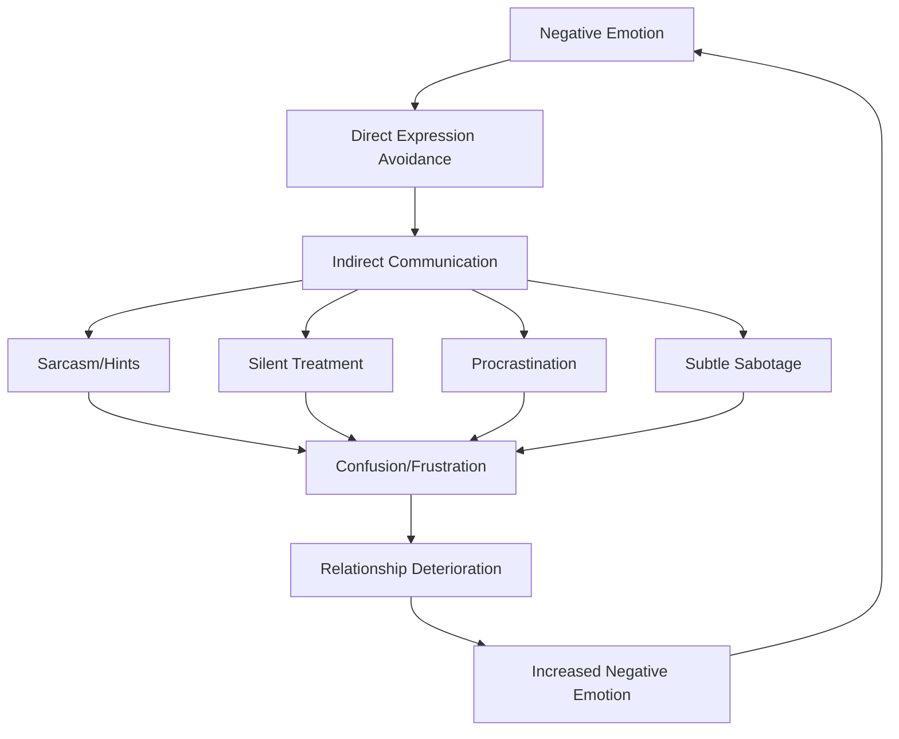

### Emotional Regulation and Communication

#### Emotional Hijacking of Communication
Strong emotions systematically interfere with effective communication:

- **Amygdala Activation**: Fight-or-flight responses overriding rational communication
- **Emotional Flooding**: Overwhelming feelings preventing clear thinking
- **Defensive Reactions**: Automatic protection responses blocking understanding
- **Projection**: Attributing own emotions to others

#### Alexithymia and Emotional Expression
Difficulty identifying and expressing emotions creates communication problems:

- **Emotion Recognition Deficits**: Inability to identify own emotional states
- **Limited Emotional Vocabulary**: Reduced ability to express feelings precisely
- **Somatic Focus**: Expressing emotions through physical symptoms
- **Interpersonal Confusion**: Others unable to understand emotional needs

## Interpersonal Communication Dynamics

### Relationship Communication Patterns

#### Gottman's Four Horsemen
Predictive patterns of relationship communication failure:

| Pattern | Description | Communication Damage | Relationship Impact |
|---------|-------------|---------------------|-------------------|
| **Criticism** | Attacking character rather than behavior | Defensive responses, escalation | Emotional distance, resentment |
| **Contempt** | Superiority, disrespect, mockery | Humiliation, counter-attack | Relationship destruction |
| **Defensiveness** | Counter-attack, victim playing | Communication shutdown | Problem resolution failure |
| **Stonewalling** | Emotional withdrawal, silence | Frustration, abandonment feelings | Emotional disconnection |

#### Pursue-Withdraw Cycles
Common dysfunctional communication patterns in relationships:

### Power Dynamics in Communication

#### Dominance and Submission Patterns
Communication often becomes a vehicle for power struggles:

- **Interruption Patterns**: Systematic cutting off of others' speech
- **Volume and Tone Control**: Using voice to intimidate or dominate
- **Topic Control**: Determining what can and cannot be discussed
- **Information Withholding**: Using knowledge as power leverage

#### Gender Communication Differences
Systematic differences in communication styles creating misunderstanding:

| Dimension | Typical Male Pattern | Typical Female Pattern | Misunderstanding Result |
|-----------|---------------------|----------------------|------------------------|
| **Purpose** | Information exchange, problem-solving | Relationship building, emotional sharing | Men dismiss emotions, women feel unheard |
| **Style** | Direct, competitive | Indirect, collaborative | Men seem aggressive, women seem unclear |
| **Nonverbal** | Less eye contact, larger gestures | More eye contact, smaller gestures | Misread intentions and emotions |
| **Conflict** | Confrontational, solution-focused | Avoidant, process-focused | Escalation vs. withdrawal |

### Cultural and Cross-Cultural Communication Failures

#### High-Context vs. Low-Context Cultures
Fundamental differences in communication assumptions:

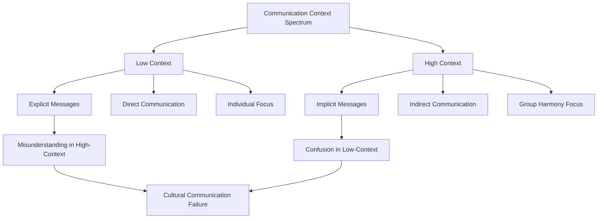

#### Linguistic Relativity and Worldview Differences
Language shapes thought and creates systematic communication barriers:

- **Conceptual Categories**: Different languages carving up reality differently
- **Temporal Concepts**: Varying ways of understanding and expressing time
- **Spatial Relations**: Different frameworks for describing location and movement
- **Social Relationships**: Varying systems for expressing hierarchy and intimacy

## Group-Level Communication Dysfunction

### Group Communication Pathologies

#### Groupthink and Communication Suppression
Group dynamics systematically suppress dissenting communication:

| Groupthink Symptom | Communication Impact | Information Quality | Decision Quality |
|-------------------|---------------------|-------------------|------------------|
| **Illusion of Unanimity** | Dissent suppression | False consensus | Poor decisions |
| **Self-Censorship** | Idea withholding | Reduced alternatives | Missed opportunities |
| **Pressure on Dissenters** | Conformity enforcement | Homogenized thinking | Risk blindness |
| **Mindguards** | Information filtering | Selective exposure | Reality distortion |

#### Information Cascades and Social Proof
Group communication creates false consensus through social influence:

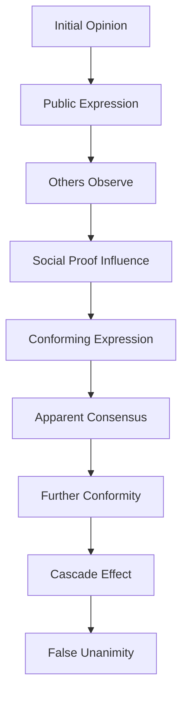

### Organizational Communication Failures

#### Hierarchical Communication Distortion
Organizational structures systematically distort information flow:

- **Upward Filtering**: Bad news suppressed, good news amplified
- **Downward Dilution**: Messages losing detail and accuracy through levels
- **Lateral Competition**: Departments withholding information from peers
- **Formal Channel Rigidity**: Important information blocked by bureaucratic procedures

#### Corporate Communication Pathologies
Business environments create systematic communication problems:

| Pathology | Mechanism | Information Impact | Organizational Consequence |
|-----------|-----------|-------------------|---------------------------|
| **Silo Effect** | Departmental isolation | Knowledge fragmentation | Coordination failure |
| **Meeting Culture** | Excessive formal communication | Decision paralysis | Productivity loss |
| **Email Overload** | Information volume explosion | Attention fragmentation | Important message loss |
| **Buzzword Proliferation** | Jargon and euphemism | Meaning obscuration | Confusion and cynicism |

### Media and Mass Communication Dysfunction

#### Information Overload and Attention Economy
Modern media creates systematic information processing problems:

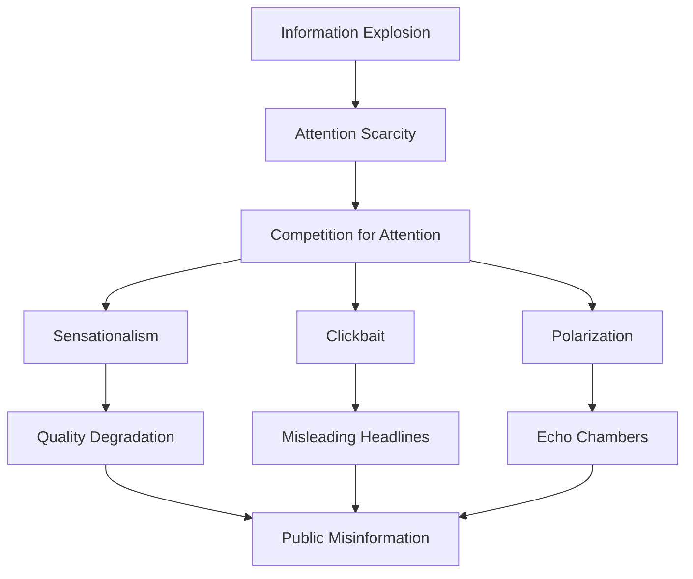

#### Filter Bubbles and Echo Chambers
Algorithmic content curation creates information isolation:

- **Confirmation Bias Amplification**: Algorithms showing agreeable content
- **Opposing View Elimination**: Systematic filtering of challenging perspectives
- **Reality Distortion**: False sense of consensus and correctness
- **Polarization Acceleration**: Extreme views becoming normalized

## Societal-Level Communication System Failures

### Political Communication Dysfunction

#### Democratic Discourse Degradation
Political communication systems failing to support informed decision-making:

| Dysfunction | Mechanism | Democratic Impact | Societal Consequence |
|------------|-----------|------------------|---------------------|
| **Sound Bite Culture** | Complex issues oversimplified | Shallow understanding | Poor policy decisions |
| **Negative Campaigning** | Attack focus over substance | Cynicism increase | Political disengagement |
| **Spin and Messaging** | Truth subordinated to persuasion | Reality distortion | Trust erosion |
| **Partisan Media** | Information segregation | Polarization | Social fragmentation |

#### Propaganda and Information Warfare
Systematic manipulation of communication for political control:

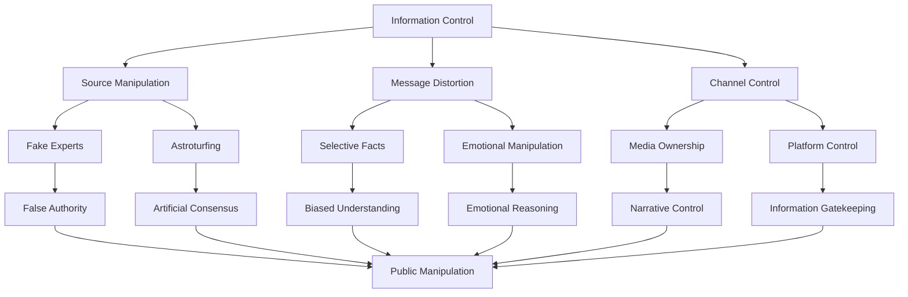

### Educational Communication Failures

#### Knowledge Transmission Breakdown
Educational systems failing to effectively communicate knowledge:

- **Lecture Model Limitations**: Passive information delivery reducing comprehension
- **Assessment Misalignment**: Testing recall rather than understanding
- **Curriculum Fragmentation**: Disconnected subjects preventing integration
- **Teacher Communication Skills**: Inadequate training in effective communication

#### Digital Divide and Information Inequality
Technology creating systematic communication access disparities:

| Divide Type | Access Barrier | Communication Impact | Social Consequence |
|------------|----------------|---------------------|-------------------|
| **Infrastructure** | Internet/device availability | Information access limitation | Educational disadvantage |
| **Skills** | Digital literacy gaps | Effective use inability | Economic marginalization |
| **Content** | Language/cultural barriers | Relevant information scarcity | Cultural isolation |
| **Economic** | Cost barriers | Premium information exclusion | Inequality perpetuation |

### Scientific Communication Failures

#### Science-Public Communication Gap
Systematic failures in communicating scientific knowledge to the public:

- **Jargon Barriers**: Technical language excluding non-experts
- **Uncertainty Communication**: Difficulty expressing scientific uncertainty
- **Media Distortion**: Journalists misrepresenting scientific findings
- **False Balance**: Equal time given to fringe and mainstream views

#### Academic Communication Pathologies
Scientific communication systems creating knowledge isolation:

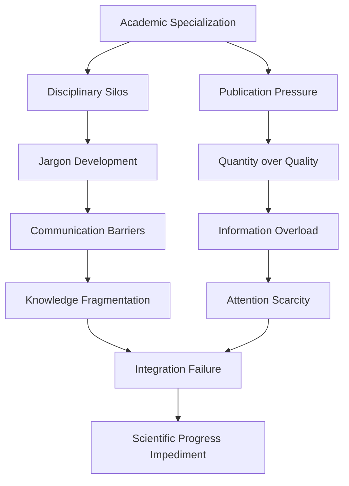

## Technological Amplification of Communication Failures

### Digital Communication Pathologies

#### Social Media Communication Dysfunction
Digital platforms systematically distort human communication:

| Platform Feature | Communication Impact | Psychological Effect | Social Consequence |
|-----------------|---------------------|---------------------|-------------------|
| **Character Limits** | Oversimplification, nuance loss | Frustration, misunderstanding | Polarization |
| **Algorithmic Feeds** | Echo chamber creation | Confirmation bias | Social fragmentation |
| **Anonymous Interaction** | Disinhibition, aggression | Empathy reduction | Toxicity increase |
| **Viral Mechanisms** | Sensationalism reward | Attention seeking | Misinformation spread |

#### Text-Based Communication Limitations
Digital text communication losing crucial information:

- **Nonverbal Cue Loss**: Facial expressions, tone, body language absent
- **Context Collapse**: Multiple audiences receiving same message
- **Asynchronous Misunderstanding**: Time delays creating confusion
- **Emoji Misinterpretation**: Cultural differences in symbol meaning

### Artificial Intelligence and Communication

#### AI-Mediated Communication
Algorithms increasingly mediating human communication:

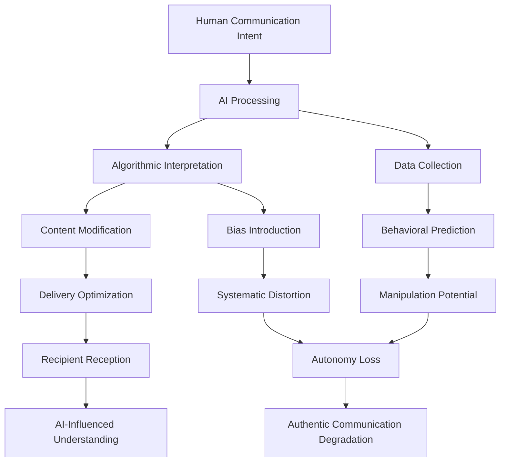

#### Deepfakes and Synthetic Media
Technology undermining trust in communication:

- **Video Manipulation**: Realistic fake videos of people saying/doing things they didn't
- **Audio Synthesis**: Artificial speech indistinguishable from real voices
- **Text Generation**: AI-created content mimicking human writing
- **Trust Erosion**: Increasing difficulty distinguishing real from fake communication

## Cross-Cultural and Historical Perspectives

### Historical Communication Evolution

#### Oral to Written Transition
The shift from oral to written communication created systematic changes:

| Communication Mode | Advantages | Disadvantages | Social Impact |
|-------------------|------------|---------------|---------------|
| **Oral Tradition** | Rich context, immediate feedback | Memory limitations, distortion | Intimate communities |
| **Written Language** | Permanence, precision | Context loss, literacy barriers | Knowledge preservation |
| **Print Media** | Mass distribution, standardization | One-way communication | Mass society formation |
| **Electronic Media** | Speed, global reach | Information overload | Global village creation |

#### Communication Technology and Social Change
Each communication revolution creating new problems:

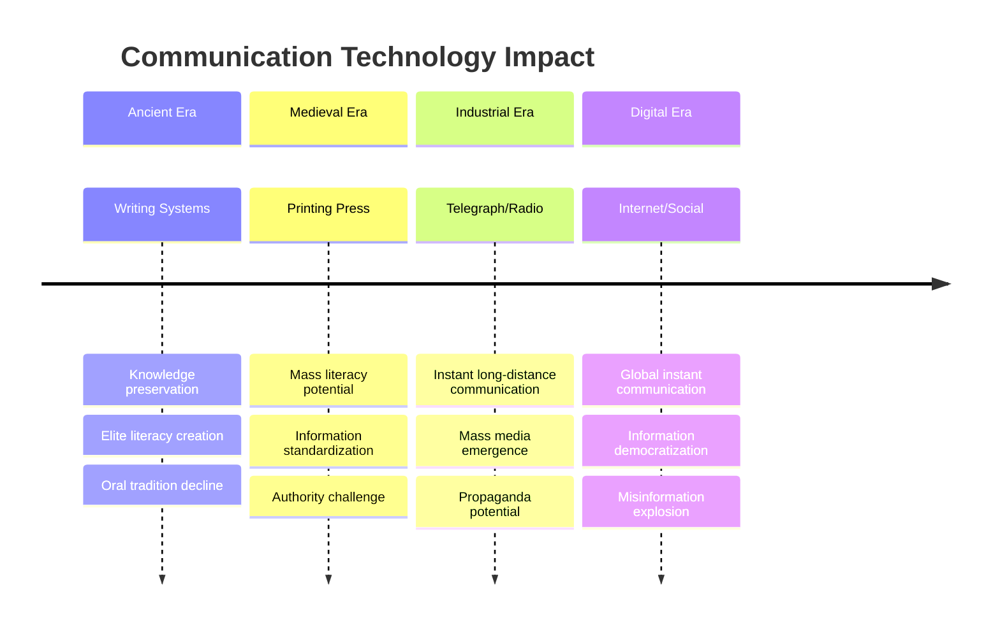

### Cross-Cultural Communication Patterns

#### Collectivist vs. Individualist Communication
Fundamental cultural differences in communication approaches:

- **Collectivist Cultures**: Harmony preservation, indirect communication, group consensus
- **Individualist Cultures**: Direct expression, personal opinion, individual rights
- **Conflict Styles**: Face-saving vs. confrontational approaches
- **Decision-Making**: Group consultation vs. individual authority

#### Religious and Ideological Communication Systems
Belief systems creating systematic communication patterns:

| System | Communication Style | Truth Concept | Dialogue Approach |
|--------|-------------------|---------------|-------------------|
| **Fundamentalist** | Authoritative, absolute | Revealed truth | Conversion focus |
| **Scientific** | Evidence-based, provisional | Empirical truth | Peer review |
| **Postmodern** | Relativistic, deconstructive | Constructed truth | Power analysis |
| **Pragmatic** | Utility-focused, flexible | Functional truth | Problem-solving |

## Systemic Solutions and Communication Improvement

### Individual-Level Communication Skills

#### Emotional Intelligence Development
Core skills for effective communication:

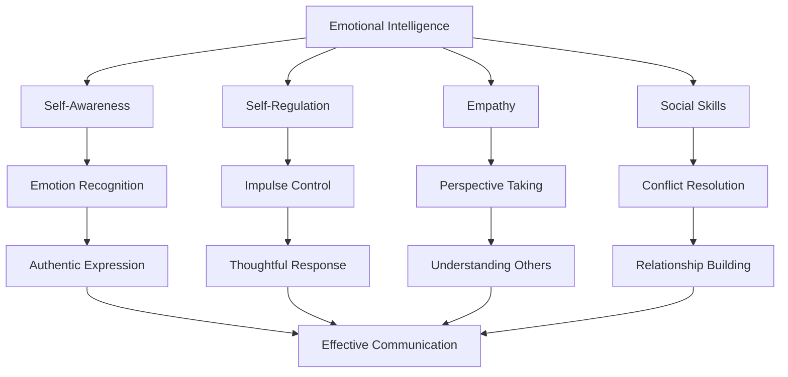

#### Active Listening and Empathetic Communication
Techniques for improving communication quality:

- **Reflective Listening**: Paraphrasing and confirming understanding
- **Nonviolent Communication**: Expressing needs without blame or criticism
- **Perspective-Taking**: Actively trying to understand others' viewpoints
- **Emotional Validation**: Acknowledging others' feelings without judgment

### Interpersonal Communication Improvement

#### Relationship Communication Training
Systematic approaches to improving couple and family communication:

| Technique | Focus | Method | Outcome |
|-----------|-------|--------|---------|
| **Gottman Method** | Relationship stability | Positive interaction increase | Divorce prevention |
| **Emotionally Focused Therapy** | Attachment security | Emotional expression safety | Intimacy enhancement |
| **Imago Therapy** | Childhood pattern healing | Structured dialogue | Understanding increase |
| **Nonviolent Communication** | Needs expression | Empathy and honesty | Conflict reduction |

#### Conflict Resolution and Mediation
Structured approaches to communication breakdown resolution:

- **Interest-Based Negotiation**: Focusing on underlying needs rather than positions
- **Restorative Justice**: Healing-focused communication after harm
- **Collaborative Problem-Solving**: Joint approach to finding solutions
- **Cultural Competency**: Understanding communication style differences

### Organizational Communication Reform

#### Structural Communication Improvements
Organizational designs that enhance communication effectiveness:

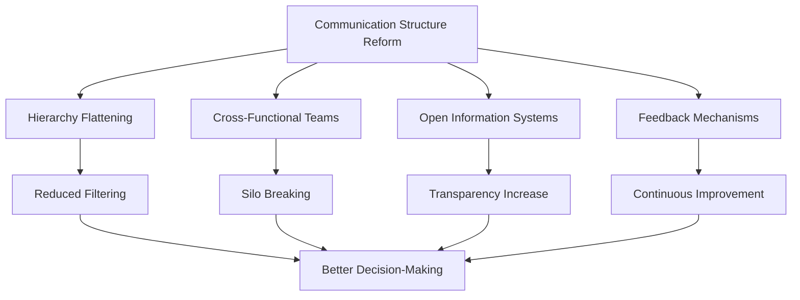

#### Communication Technology Integration
Using technology to enhance rather than degrade communication:

- **Collaboration Platforms**: Tools that support rather than replace human interaction
- **Video Conferencing**: Preserving nonverbal communication in remote work
- **Knowledge Management**: Systems that capture and share organizational learning
- **Feedback Systems**: Regular, structured communication about performance and satisfaction

### Societal-Level Communication System Reform

#### Media Literacy and Critical Thinking Education
Preparing citizens for complex information environments:

| Skill Area | Educational Focus | Critical Ability | Democratic Benefit |
|------------|------------------|------------------|-------------------|
| **Source Evaluation** | Credibility assessment | Reliable information identification | Informed decision-making |
| **Bias Recognition** | Perspective awareness | Manipulation detection | Propaganda resistance |
| **Logic and Reasoning** | Argument analysis | Fallacy identification | Rational discourse |
| **Emotional Regulation** | Feeling management | Reactive response prevention | Constructive dialogue |

#### Democratic Communication Infrastructure
Institutional reforms to support healthy public discourse:

- **Public Broadcasting**: Independent, quality journalism funding
- **Deliberative Democracy**: Structured citizen participation in policy discussions
- **Fact-Checking Systems**: Independent verification of public claims
- **Digital Platform Regulation**: Rules ensuring healthy online discourse

#### Scientific Communication Improvement
Bridging the gap between expert knowledge and public understanding:

- **Science Communication Training**: Teaching scientists to communicate effectively
- **Journalist Science Education**: Improving media coverage of scientific issues
- **Public Engagement**: Creating opportunities for scientist-citizen dialogue
- **Uncertainty Communication**: Better ways to express scientific uncertainty

## Future Projections and Emerging Challenges

### Technological Communication Evolution

#### Artificial Intelligence and Communication
AI increasingly mediating human communication:

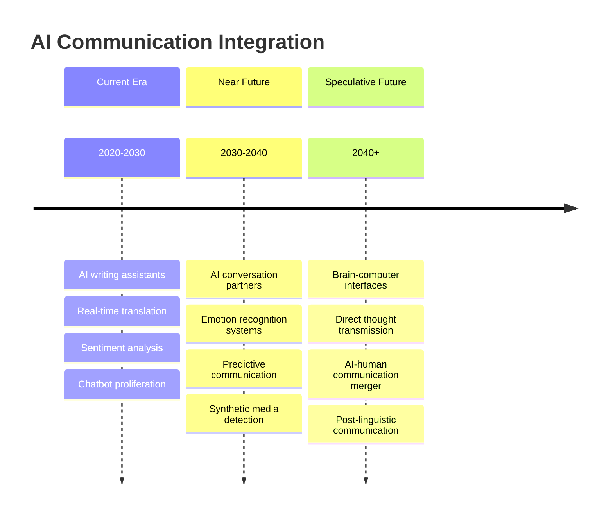

#### Virtual and Augmented Reality Communication
Immersive technologies changing communication fundamentals:

- **Presence Simulation**: Virtual environments creating sense of physical co-presence
- **Nonverbal Enhancement**: Technology augmenting or replacing body language
- **Reality Blending**: Mixed real and virtual communication experiences
- **Identity Fluidity**: Avatar-based communication enabling identity experimentation

### Global Communication Challenges

#### Linguistic Diversity vs. Global Communication
Tension between local languages and global communication needs:

| Challenge | Current Trend | Potential Outcome | Cultural Impact |
|-----------|---------------|-------------------|-----------------|
| **Language Death** | Minority language extinction | Cultural knowledge loss | Diversity reduction |
| **English Dominance** | Global lingua franca emergence | Communication efficiency | Cultural homogenization |
| **Translation Technology** | AI-powered real-time translation | Language barrier reduction | Nuance loss |
| **Digital Divide** | Unequal technology access | Communication inequality | Social stratification |

#### Climate Change Communication
Environmental challenges requiring unprecedented global coordination:

- **Urgency vs. Complexity**: Communicating complex science with action urgency
- **Global Coordination**: Coordinating action across cultural and political boundaries
- **Intergenerational Communication**: Bridging different temporal perspectives
- **Uncertainty Communication**: Dealing with scientific uncertainty in policy contexts

### Potential Future Scenarios

#### Scenario 1: Communication Renaissance
Technology enables unprecedented human understanding:

- **Universal Translation**: Real-time, nuanced translation between all languages
- **Empathy Enhancement**: Technology helping people understand others' perspectives
- **Global Dialogue**: Platforms enabling meaningful cross-cultural communication
- **Wisdom Preservation**: Systems capturing and transmitting human knowledge effectively

#### Scenario 2: Communication Fragmentation
Technology divides humanity into incompatible communication bubbles:

- **Echo Chamber Intensification**: Algorithmic filtering creating complete information isolation
- **Reality Divergence**: Different groups living in incompatible information worlds
- **Trust Collapse**: Inability to distinguish truth from manipulation
- **Social Breakdown**: Communication failure leading to conflict and fragmentation

#### Scenario 3: Post-Human Communication
Technology transcends current human communication limitations:

- **Direct Neural Interface**: Brain-to-brain communication bypassing language
- **Collective Intelligence**: Networked minds sharing thoughts and knowledge
- **Emotional Transmission**: Direct sharing of feelings and experiences
- **Identity Merger**: Boundaries between individual minds becoming fluid

## Conclusion

Communication and language failures represent fundamental challenges that underlie virtually every other human problem. From individual cognitive limitations and emotional regulation difficulties to societal-level information manipulation and democratic discourse breakdown, communication failures create systematic obstacles to human coordination, understanding, and progress.

The problems operate across multiple levels: individual psychological and neurological limitations in processing and expressing information, interpersonal dynamics that distort message transmission, group phenomena that suppress dissent and create false consensus, and societal systems that manipulate information for political and economic advantage.

Current technological developments both amplify existing communication problems and create new ones. Social media platforms reward sensationalism and create echo chambers, artificial intelligence increasingly mediates human communication with unknown biases, and synthetic media technologies threaten to undermine trust in all communication.

Solutions require integrated approaches across all levels: individual skill development in emotional intelligence and critical thinking, interpersonal training in empathetic communication and conflict resolution, organizational reforms to improve information flow and reduce hierarchy-based distortions, and societal investments in media literacy, democratic discourse infrastructure, and scientific communication.

The stakes are existential: in an interconnected world facing complex global challenges, the ability to communicate effectively across differences may determine whether humanity can coordinate responses to climate change, technological disruption, and other civilizational threats. Communication failures that were merely inconvenient in small-scale societies now threaten global stability and survival.

The path forward requires recognition that communication is not merely a technical problem but a fundamental human challenge involving psychology, culture, power, and meaning. Success demands not just better technologies but wiser approaches to human understanding, empathy development, and the creation of communication systems that serve human flourishing rather than manipulation and control.

Ultimately, improving human communication may be prerequisite to solving virtually every other human problem, making it one of the most important areas for individual development, social investment, and institutional reform.

## References and Further Reading

### Primary Sources
- Shannon, C. E., & Weaver, W. (1949). *The Mathematical Theory of Communication*
- Grice, H. P. (1975). *Logic and Conversation*
- Gottman, J. M. (1999). *The Marriage Clinic: A Scientifically Based Marital Therapy*
- Habermas, J. (1981). *The Theory of Communicative Action*

### Cross-References
- [See: Individual Psychology → Cognitive Architecture](../individual/cognitive-architecture.md)
- [Related: Group Dynamics → Social Psychology](../group/social-psychology.md)
- [Compare: Societal Analysis → Political Systems Failure](../societal/political-systems-failure.md)
- [Integration: Systems Theory → Cross-Level Integration](../integrative/cross-level-integration.md)

---

*This document represents an interdisciplinary analysis of communication and language failures from psychological, linguistic, sociological, and technological perspectives. The analysis aims to understand the systematic problems in human information exchange while maintaining academic rigor and evidence-based reasoning.*