# Education and Knowledge Transmission Failures: Systematic Breakdowns in Human Learning

## Abstract

This document examines the fundamental problems in how humans acquire, retain, and transmit knowledge across generations and cultures. The analysis integrates cognitive psychology, educational research, anthropology, and systems theory to understand how the mechanisms meant to preserve and advance human knowledge often fail, creating systematic ignorance, misinformation, and the loss of crucial cultural and technical knowledge.

## Introduction

Education and knowledge transmission represent humanity's primary mechanisms for cultural evolution and progress. Unlike other species that rely primarily on genetic inheritance, humans depend on learned knowledge passed between generations and across social groups. However, these same systems that enable human advancement also create systematic failures that impede learning, perpetuate ignorance, and sometimes lead to the catastrophic loss of essential knowledge.

Knowledge transmission failures operate across multiple levels: individual cognitive limitations in learning and memory, interpersonal dynamics that distort teaching and learning relationships, institutional structures that prioritize compliance over understanding, and societal systems that systematically suppress or distort knowledge for political or economic purposes. These failures contribute to recurring patterns of civilizational decline, technological regression, and the perpetuation of harmful beliefs and practices.

## Theoretical Foundations of Learning and Knowledge Transmission

### Cognitive Science of Learning

Human learning systems evolved for small-scale, practical knowledge acquisition but face systematic challenges in modern educational contexts:

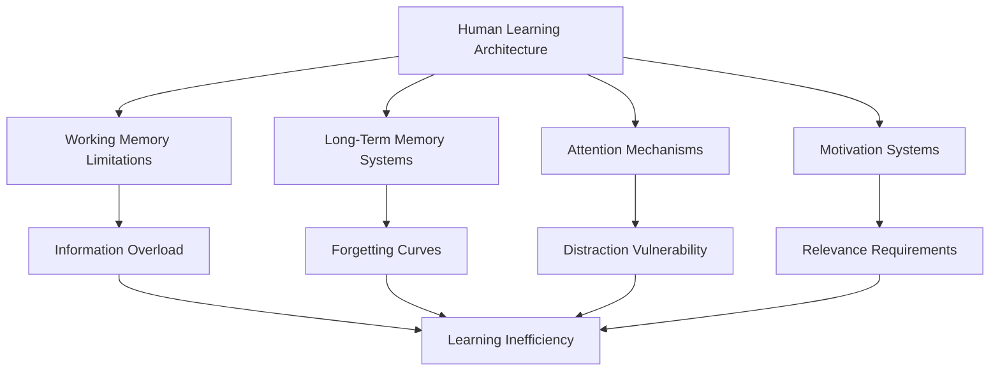

### Knowledge Types and Transmission Challenges

Different types of knowledge face distinct transmission challenges:

| Knowledge Type | Characteristics | Transmission Method | Failure Modes |
|---------------|----------------|-------------------|---------------|
| **Explicit/Declarative** | Facts, concepts, theories | Books, lectures, documentation | Rote memorization, context loss |
| **Implicit/Procedural** | Skills, techniques, practices | Demonstration, practice, apprenticeship | Tacit knowledge loss, skill degradation |
| **Cultural/Social** | Values, norms, traditions | Socialization, modeling, ritual | Cultural drift, generation gaps |
| **Experiential/Wisdom** | Judgment, intuition, insight | Mentorship, storytelling, reflection | Experience devaluation, wisdom loss |

### Evolutionary Mismatch in Modern Education

Human learning psychology evolved for different environments than modern educational systems:

#### Ancestral Learning Environment
- **Small Groups**: Learning in intimate social contexts with immediate feedback
- **Practical Relevance**: Knowledge directly applicable to survival and success
- **Multi-Sensory**: Learning through observation, practice, and embodied experience
- **Social Embedding**: Knowledge transmission integrated with social relationships

#### Modern Educational Challenges
- **Mass Scale**: Impersonal systems serving thousands of students simultaneously
- **Abstract Content**: Knowledge divorced from immediate practical application
- **Sedentary Format**: Passive information consumption in artificial environments
- **Social Isolation**: Learning separated from meaningful social relationships

## Individual-Level Learning Pathologies

### Cognitive Learning Disorders

#### Specific Learning Disabilities
Neurological differences that impair specific learning processes:

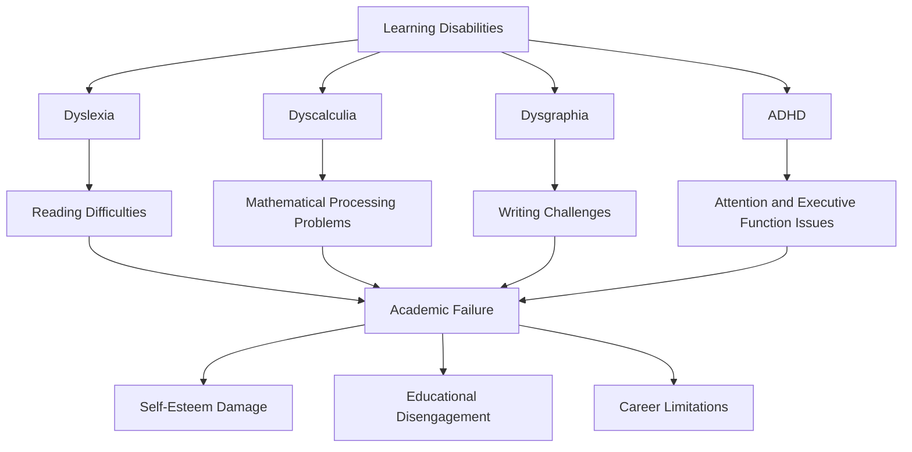

#### Executive Function Deficits
Problems with cognitive control systems that manage learning:

- **Working Memory Overload**: Inability to hold and manipulate information during learning
- **Attention Regulation**: Difficulty focusing on relevant information and ignoring distractions
- **Planning and Organization**: Problems structuring learning activities and managing time
- **Metacognition**: Lack of awareness about own learning processes and strategies

### Motivational and Emotional Learning Barriers

#### Learned Helplessness in Education
Repeated failure experiences creating systematic learning avoidance:

| Stage | Experience | Psychological Response | Behavioral Outcome |
|-------|------------|----------------------|-------------------|
| **Initial Failure** | Difficulty with academic tasks | Frustration, effort increase | Continued trying |
| **Repeated Failure** | Persistent academic struggles | Anxiety, self-doubt | Reduced effort |
| **Generalized Failure** | Failure across multiple domains | Depression, hopelessness | Complete disengagement |
| **Identity Formation** | "I'm not smart" belief | Fixed mindset adoption | Lifelong learning avoidance |

#### Test Anxiety and Performance Pressure
Assessment systems creating psychological barriers to learning:

- **Evaluation Anxiety**: Fear of judgment interfering with cognitive performance
- **Stereotype Threat**: Awareness of negative stereotypes impairing performance
- **Perfectionism**: Unrealistic standards preventing risk-taking and exploration
- **Extrinsic Motivation Dominance**: External rewards undermining intrinsic learning motivation

### Memory and Retention Failures

#### Forgetting Curves and Knowledge Decay
Systematic patterns of knowledge loss over time:

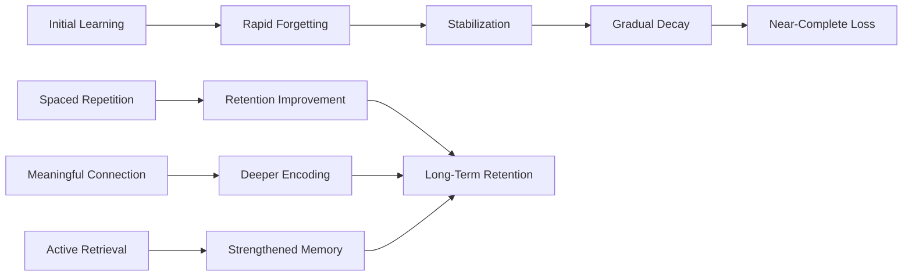

#### Transfer Failure and Inert Knowledge
Learning that fails to apply to new contexts:

- **Surface Learning**: Memorizing facts without understanding underlying principles
- **Context Dependency**: Knowledge tied to specific learning situations
- **Procedural Rigidity**: Inability to adapt learned procedures to new problems
- **Conceptual Isolation**: Failure to connect new learning to existing knowledge

## Interpersonal Teaching and Learning Dysfunction

### Teacher-Student Relationship Problems

#### Authoritarian vs. Authoritative Teaching
Different teaching styles creating systematic learning outcomes:

| Teaching Style | Characteristics | Student Response | Learning Outcome |
|---------------|----------------|------------------|------------------|
| **Authoritarian** | Rigid control, compliance focus | Fear, passive submission | Rote learning, creativity suppression |
| **Permissive** | Minimal structure, student-led | Confusion, lack of direction | Inconsistent learning, skill gaps |
| **Authoritative** | Clear expectations, supportive guidance | Engagement, intrinsic motivation | Deep learning, skill development |
| **Neglectful** | Low involvement, minimal feedback | Disengagement, self-doubt | Learning failure, behavioral problems |

#### Teacher Bias and Expectation Effects
Educator attitudes systematically affecting student performance:

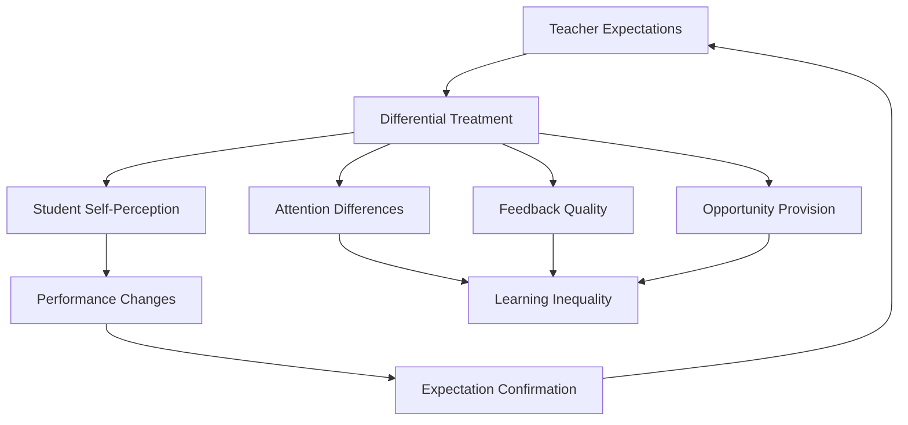

### Peer Learning Dynamics

#### Social Comparison and Academic Competition
Competitive educational environments creating learning barriers:

- **Zero-Sum Thinking**: Belief that others' success threatens own achievement
- **Social Comparison Anxiety**: Constant evaluation against peers reducing focus on learning
- **Collaboration Suppression**: Competition preventing beneficial peer learning
- **Status Hierarchy Formation**: Academic performance creating social stratification

#### Bullying and Social Exclusion
Negative peer relationships interfering with learning:

- **Cognitive Interference**: Anxiety and stress impairing attention and memory
- **School Avoidance**: Fear leading to reduced educational exposure
- **Identity Damage**: Negative social experiences affecting academic self-concept
- **Teacher Attention Diversion**: Behavioral problems consuming instructional time

### Cultural and Linguistic Barriers

#### Language Minority Student Challenges
Students learning in non-native languages facing systematic disadvantages:

| Challenge | Educational Impact | Cognitive Load | Academic Outcome |
|-----------|-------------------|----------------|------------------|
| **Language Proficiency** | Comprehension difficulties | Increased processing demands | Lower achievement |
| **Cultural Mismatch** | Unfamiliar educational practices | Confusion and disengagement | Behavioral problems |
| **Identity Conflict** | Pressure to abandon native culture | Psychological stress | Social-emotional difficulties |
| **Family Disconnect** | Parents unable to support schoolwork | Reduced home support | Achievement gaps |

#### Socioeconomic Educational Barriers
Economic disadvantage creating systematic learning obstacles:

- **Resource Scarcity**: Lack of books, technology, and educational materials
- **Stress and Instability**: Housing, food, and safety insecurity impairing learning
- **Cultural Capital Gaps**: Unfamiliarity with middle-class educational expectations
- **Time Poverty**: Work and family responsibilities reducing study time

## Institutional Educational Dysfunction

### Structural Educational System Problems

#### Industrial Model Obsolescence
Educational systems designed for industrial-era needs failing modern requirements:

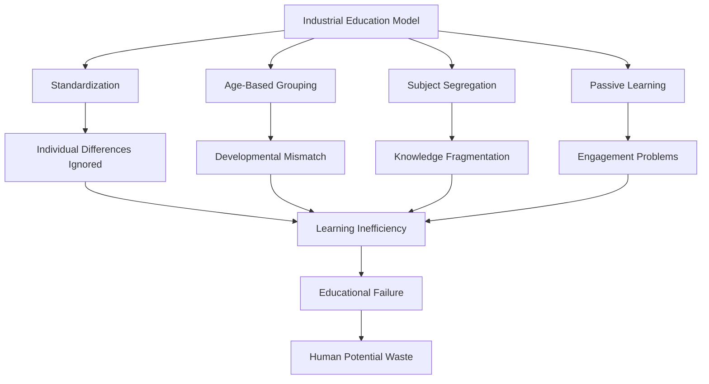

#### Bureaucratic Dysfunction in Education
Administrative systems interfering with learning:

- **Compliance Over Learning**: Rules and procedures prioritized over educational outcomes
- **Risk Aversion**: Innovation suppressed to avoid administrative problems
- **Resource Misallocation**: Funds directed to administration rather than instruction
- **Teacher Autonomy Reduction**: Professional judgment subordinated to bureaucratic requirements

### Assessment and Evaluation Failures

#### High-Stakes Testing Problems
Standardized testing creating systematic educational distortions:

| Testing Problem | Educational Impact | Teaching Response | Learning Consequence |
|----------------|-------------------|------------------|---------------------|
| **Curriculum Narrowing** | Focus on tested subjects only | Non-tested subject reduction | Incomplete education |
| **Teaching to Test** | Instruction focused on test format | Drill and practice emphasis | Surface learning |
| **Cheating Pressure** | Performance pressure on educators | Unethical behavior increase | Trust erosion |
| **Stress and Anxiety** | High-pressure testing environment | Test preparation obsession | Learning enjoyment loss |

#### Grade Inflation and Credential Devaluation
Assessment systems losing meaning and effectiveness:

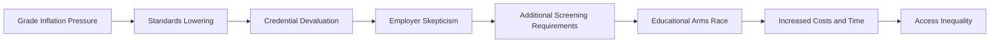

### Curriculum and Pedagogical Problems

#### Knowledge Fragmentation and Disciplinary Silos
Educational organization preventing integrated understanding:

- **Subject Isolation**: Artificial separation of interconnected knowledge domains
- **Contextual Removal**: Abstract learning divorced from practical application
- **Synthesis Prevention**: No opportunities to integrate learning across disciplines
- **Real-World Disconnect**: Academic knowledge unrelated to life outside school

#### Pedagogical Conservatism and Innovation Resistance
Educational institutions resisting effective teaching methods:

- **Lecture Dominance**: Passive information delivery despite evidence of ineffectiveness
- **Technology Resistance**: Slow adoption of beneficial educational technologies
- **Research-Practice Gap**: Failure to implement evidence-based teaching methods
- **Change Aversion**: Institutional inertia preventing pedagogical improvement

## Societal-Level Knowledge System Failures

### Cultural Knowledge Loss and Transmission Breakdown

#### Indigenous Knowledge Extinction
Systematic loss of traditional knowledge systems:

| Knowledge Domain | Traditional System | Loss Mechanism | Consequence |
|-----------------|-------------------|----------------|-------------|
| **Ecological** | Sustainable resource management | Modernization, displacement | Environmental degradation |
| **Medical** | Traditional healing practices | Western medicine dominance | Treatment option loss |
| **Agricultural** | Crop varieties, farming techniques | Industrial agriculture | Biodiversity loss |
| **Cultural** | Languages, stories, practices | Assimilation pressure | Identity erosion |

#### Intergenerational Knowledge Transfer Breakdown
Modern societies failing to transmit wisdom across generations:

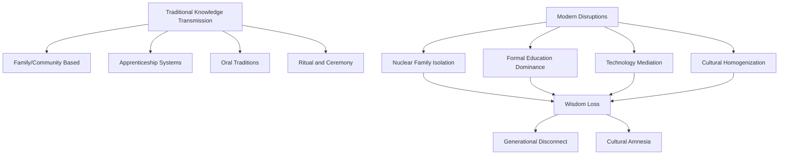

### Scientific and Technical Knowledge Problems

#### Research-Application Gap
Systematic failures in translating knowledge into practice:

- **Academic Isolation**: Research conducted without practical application consideration
- **Publication Bias**: Positive results published while negative results suppressed
- **Complexity Barriers**: Technical knowledge too specialized for practical implementation
- **Institutional Incentives**: Career advancement rewarding publication over application

#### Knowledge Hoarding and Access Barriers
Systematic restriction of knowledge access:

| Barrier Type | Mechanism | Access Impact | Social Consequence |
|-------------|-----------|---------------|-------------------|
| **Economic** | Paywalls, subscription costs | Wealth-based knowledge access | Inequality perpetuation |
| **Legal** | Copyright, patent restrictions | Innovation impediment | Progress slowing |
| **Institutional** | Academic gatekeeping | Elite knowledge control | Democratic deficit |
| **Technical** | Complexity, jargon | Specialist-only understanding | Public exclusion |

### Political and Ideological Knowledge Distortion

#### Educational Indoctrination and Propaganda
Political systems using education for control rather than enlightenment:

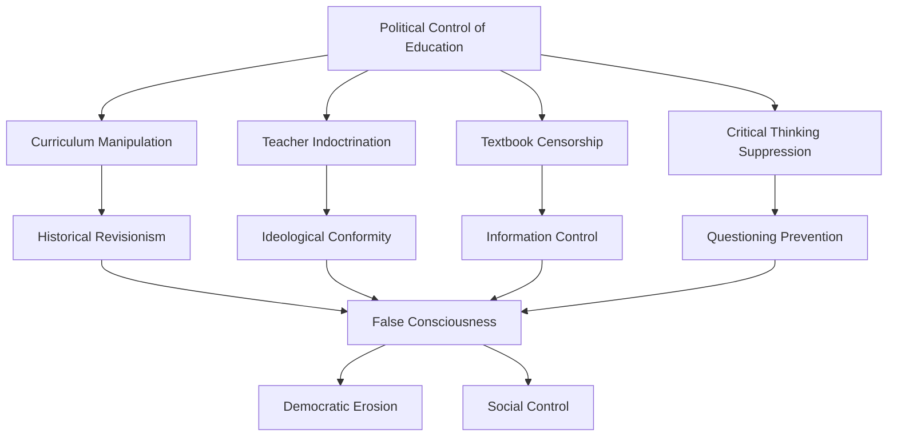

#### Anti-Intellectualism and Science Denial
Cultural movements systematically opposing knowledge and expertise:

- **Expert Distrust**: Systematic suspicion of specialized knowledge and credentials
- **Conspiracy Thinking**: Alternative explanations replacing evidence-based understanding
- **Religious Fundamentalism**: Literal interpretations conflicting with scientific knowledge
- **Political Polarization**: Knowledge acceptance based on political identity rather than evidence

## Historical Examples of Knowledge Loss and Recovery

### Civilizational Knowledge Collapse

#### Library of Alexandria and Ancient Knowledge Loss
The destruction of ancient knowledge repositories:

| Period | Knowledge System | Loss Mechanism | Recovery Attempts |
|--------|-----------------|----------------|-------------------|
| **Ancient Greece** | Philosophy, mathematics, science | Political instability, religious conflict | Islamic preservation |
| **Roman Empire** | Engineering, administration, law | Barbarian invasions, economic collapse | Medieval rediscovery |
| **Islamic Golden Age** | Medicine, astronomy, mathematics | Mongol invasions, political fragmentation | Renaissance translation |
| **Medieval Europe** | Classical knowledge | Religious suppression, manuscript loss | Scholastic revival |

#### Dark Ages and Knowledge Regression
Periods of systematic knowledge loss and cultural decline:

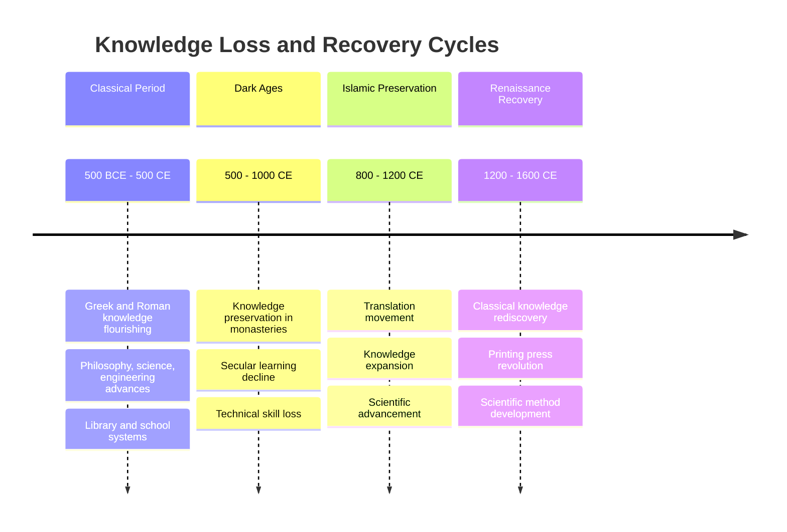

### Modern Knowledge Loss Examples

#### Indigenous Language and Knowledge Extinction
Contemporary examples of systematic knowledge destruction:

- **Native American Boarding Schools**: Forced assimilation destroying traditional knowledge systems
- **Australian Aboriginal Displacement**: Land separation breaking ecological knowledge transmission
- **Amazon Deforestation**: Environmental destruction eliminating indigenous botanical knowledge
- **Urbanization**: Traditional rural knowledge lost as populations move to cities

#### Technical Knowledge Loss in Modern Organizations
Corporate and institutional knowledge loss patterns:

| Organization Type | Knowledge Loss Cause | Lost Knowledge | Recovery Difficulty |
|------------------|---------------------|----------------|-------------------|
| **Aerospace** | Retirement, downsizing | Manufacturing techniques | High - tacit knowledge |
| **Software** | Staff turnover, poor documentation | System architecture | Medium - code archaeology |
| **Manufacturing** | Automation, outsourcing | Craft skills, troubleshooting | High - embodied expertise |
| **Government** | Political changes, budget cuts | Institutional memory | Medium - bureaucratic records |

### Knowledge Recovery and Renaissance Periods

#### Islamic Golden Age Knowledge Preservation
How Islamic civilization preserved and expanded classical knowledge:

- **Translation Movement**: Systematic translation of Greek, Persian, and Indian texts
- **House of Wisdom**: Institutional support for knowledge preservation and expansion
- **Cross-Cultural Synthesis**: Integration of knowledge from multiple civilizations
- **Educational Innovation**: Madrasas and libraries supporting learning

#### Renaissance Knowledge Recovery
European rediscovery and expansion of classical knowledge:

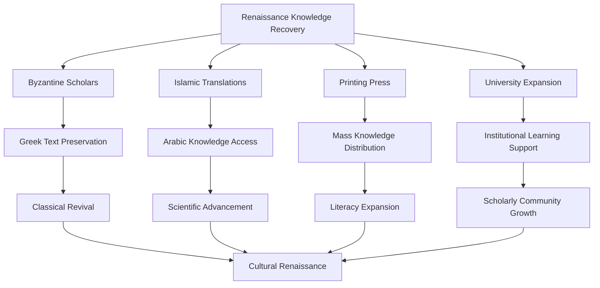

## Cross-Level Integration and Systemic Analysis

### Knowledge System Feedback Loops

#### Individual Learning → Institutional Quality → Societal Progress
How individual learning failures aggregate to create systemic problems:

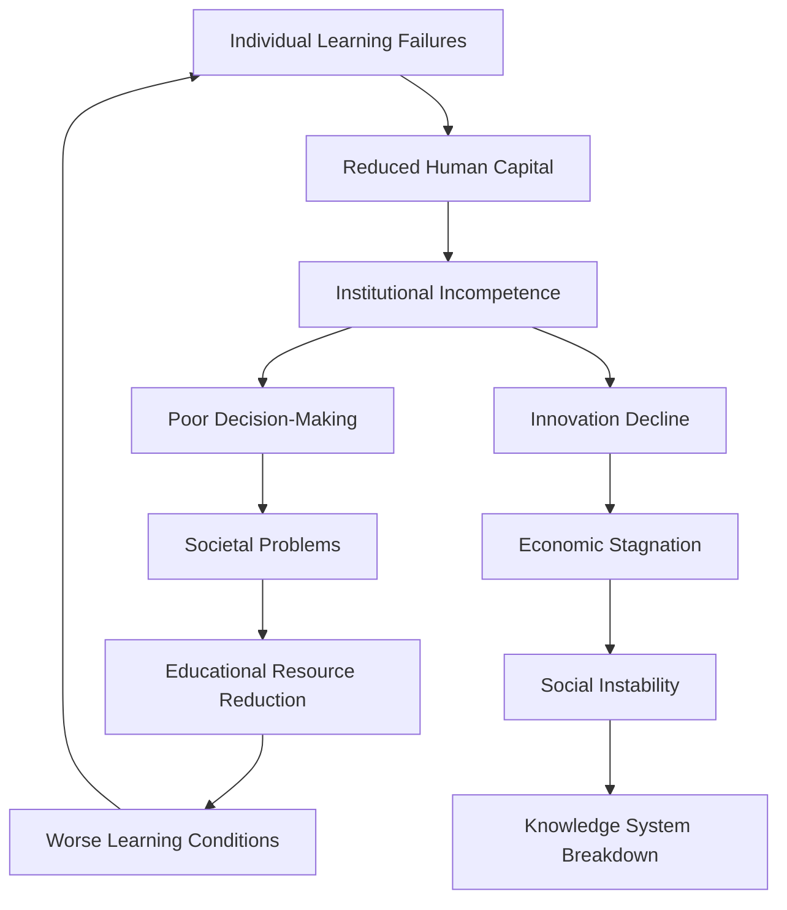

#### Cultural Knowledge Transmission Cycles
How societies maintain or lose cultural knowledge:

- **Positive Cycle**: Effective transmission → Cultural continuity → Identity strength → Transmission motivation
- **Negative Cycle**: Transmission failure → Cultural disruption → Identity confusion → Further transmission breakdown
- **Recovery Cycle**: Crisis recognition → Preservation efforts → Cultural revival → Renewed transmission

### Systemic Knowledge Pathologies

#### The Dunning-Kruger Effect at Scale
How individual overconfidence creates societal knowledge problems:

| Knowledge Level | Confidence Level | Behavior Pattern | Societal Impact |
|----------------|------------------|------------------|-----------------|
| **Very Low** | Very High | Loud ignorance, expert dismissal | Misinformation spread |
| **Low** | High | Overconfident decisions | Poor policy choices |
| **Moderate** | Moderate | Appropriate caution | Reasonable discourse |
| **High** | Lower | Awareness of complexity | Nuanced understanding |

#### Information vs. Knowledge vs. Wisdom Confusion
Modern societies confusing different types of understanding:

- **Information Overload**: Mistaking data access for knowledge
- **Knowledge Fragmentation**: Specialized expertise without wisdom integration
- **Wisdom Devaluation**: Experience and judgment dismissed in favor of data
- **Context Loss**: Information divorced from meaningful application

## Technological Impacts on Knowledge Transmission

### Digital Revolution and Learning

#### Internet and Information Access
Technology dramatically changing knowledge availability and quality:

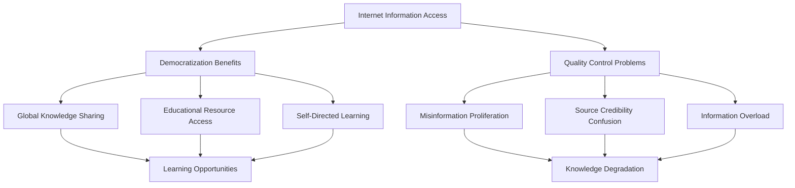

#### Social Media and Knowledge Distortion
Digital platforms changing how knowledge spreads and evolves:

- **Viral Misinformation**: False information spreading faster than corrections
- **Echo Chambers**: Confirmation bias amplification preventing learning
- **Attention Fragmentation**: Short-form content reducing deep learning
- **Authority Flattening**: Experts and amateurs given equal platform weight

### Artificial Intelligence and Education

#### AI Tutoring and Personalized Learning
Technology potentially revolutionizing educational effectiveness:

| AI Application | Learning Benefit | Implementation Challenge | Potential Risk |
|---------------|------------------|------------------------|----------------|
| **Adaptive Learning** | Personalized pace and content | Algorithm bias, data privacy | Over-reliance on technology |
| **Intelligent Tutoring** | 24/7 availability, infinite patience | Natural language limitations | Human interaction replacement |
| **Assessment Automation** | Immediate feedback, objective grading | Creativity evaluation difficulty | Teaching to algorithm |
| **Content Generation** | Customized materials, multiple formats | Quality control, accuracy | Misinformation amplification |

#### Knowledge Automation and Human Obsolescence
AI potentially replacing human knowledge and skills:

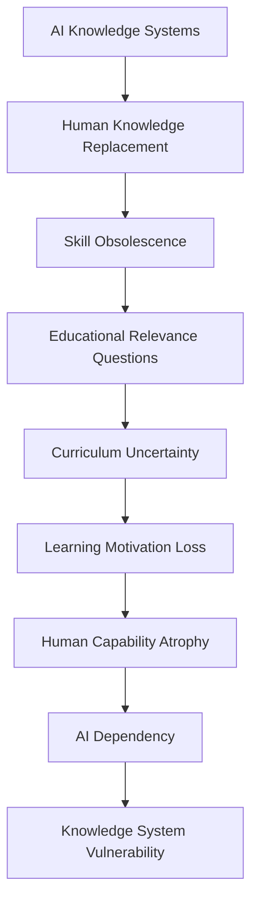

## Solutions and Knowledge System Improvement

### Individual Learning Enhancement

#### Metacognitive Skill Development
Teaching students how to learn effectively:

- **Learning Strategy Instruction**: Explicit teaching of effective study methods
- **Self-Monitoring Training**: Awareness of own learning processes and progress
- **Transfer Skill Development**: Ability to apply knowledge to new contexts
- **Growth Mindset Cultivation**: Belief that abilities can be developed through effort

#### Emotional and Social Learning Support
Addressing non-cognitive barriers to learning:

| Intervention | Target Problem | Method | Expected Outcome |
|-------------|----------------|--------|------------------|
| **Anxiety Reduction** | Test and performance anxiety | Relaxation, cognitive restructuring | Improved performance |
| **Motivation Enhancement** | Engagement and persistence | Interest cultivation, autonomy support | Sustained learning |
| **Social Skills Training** | Peer relationship problems | Communication, conflict resolution | Better learning environment |
| **Cultural Responsiveness** | Identity and belonging issues | Culturally relevant pedagogy | Increased engagement |

### Interpersonal Teaching Improvement

#### Evidence-Based Pedagogy
Implementing research-supported teaching methods:

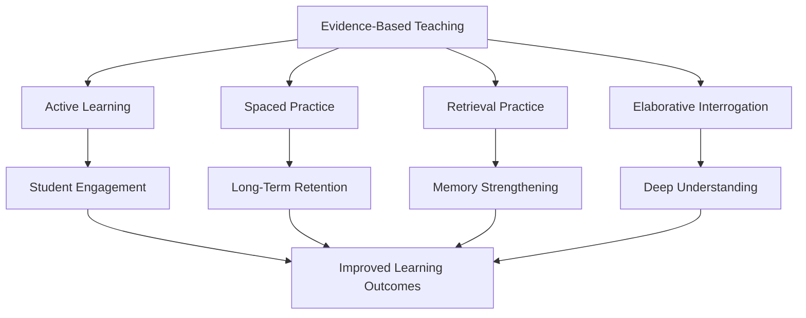

#### Teacher Professional Development
Systematic improvement of educator effectiveness:

- **Pedagogical Content Knowledge**: Deep understanding of how to teach specific subjects
- **Cultural Competency Training**: Ability to work effectively with diverse students
- **Technology Integration**: Skillful use of digital tools to enhance learning
- **Collaborative Practice**: Professional learning communities and peer observation

### Institutional Educational Reform

#### Structural System Changes
Fundamental reforms to educational organization:

| Reform Area | Current Problem | Proposed Solution | Expected Benefit |
|------------|----------------|-------------------|------------------|
| **Scheduling** | Rigid time blocks | Flexible, project-based time | Natural learning rhythms |
| **Grouping** | Age-based classes | Multi-age, ability-flexible groups | Individualized pacing |
| **Assessment** | High-stakes testing | Portfolio, performance assessment | Authentic evaluation |
| **Curriculum** | Subject isolation | Integrated, project-based learning | Connected understanding |

#### Democratic and Participatory Education
Involving students and communities in educational decision-making:

- **Student Voice**: Meaningful participation in curriculum and policy decisions
- **Community Engagement**: Local involvement in school governance and programming
- **Teacher Autonomy**: Professional freedom to adapt instruction to student needs
- **Transparent Accountability**: Open, multiple-measure evaluation systems

### Societal Knowledge System Enhancement

#### Knowledge Commons and Open Access
Creating systems for equitable knowledge sharing:

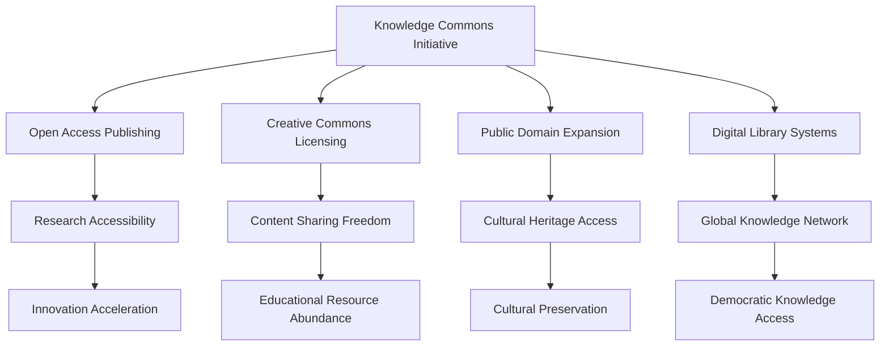

#### Cultural Knowledge Preservation
Systematic efforts to maintain traditional and indigenous knowledge:

- **Language Revitalization**: Programs to maintain and restore endangered languages
- **Elder Knowledge Documentation**: Systematic recording of traditional wisdom
- **Cultural Education Integration**: Including indigenous knowledge in formal curricula
- **Community-Based Learning**: Supporting traditional knowledge transmission methods

#### Scientific Literacy and Public Education
Improving societal capacity for evidence-based thinking:

- **Media Literacy**: Critical evaluation of information sources and claims
- **Statistical Reasoning**: Understanding probability, correlation, and causation
- **Scientific Method**: Appreciation for evidence-based knowledge development
- **Uncertainty Tolerance**: Comfort with provisional and probabilistic knowledge

## Future Projections and Emerging Challenges

### Technological Disruption of Traditional Education

#### Virtual and Augmented Reality Learning
Immersive technologies potentially transforming educational experience:

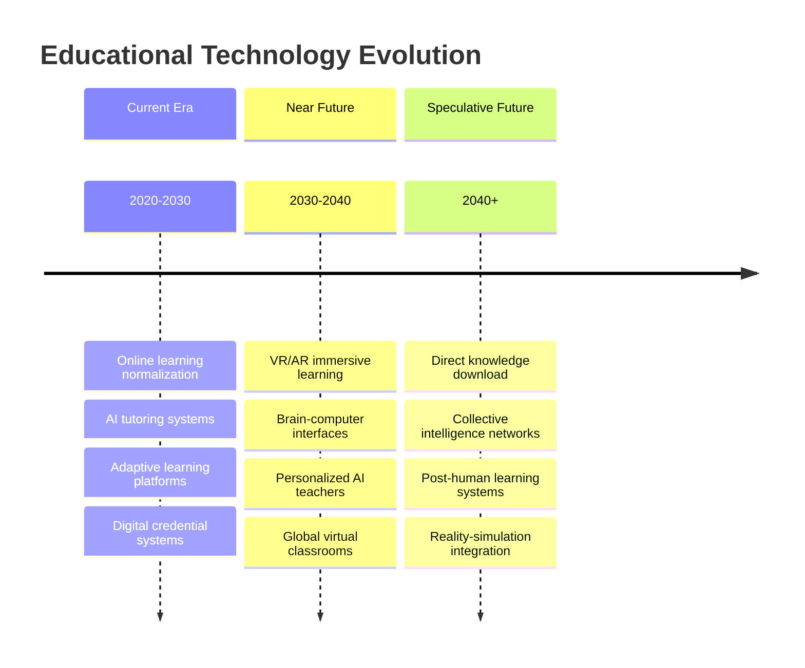

#### Artificial General Intelligence and Education
AGI potentially making human education obsolete or transforming it entirely:

- **Knowledge Obsolescence**: AI systems knowing more than any human
- **Skill Replacement**: Automation eliminating need for many human capabilities
- **Learning Redefinition**: Focus shifting from knowledge acquisition to human uniqueness
- **Educational Purpose Crisis**: Fundamental questions about why humans should learn

### Global Knowledge Challenges

#### Climate Change Education
Unprecedented need for rapid, global knowledge transmission:

| Challenge | Educational Requirement | Implementation Barrier | Potential Solution |
|-----------|------------------------|----------------------|-------------------|
| **Urgency** | Rapid behavior change | Slow institutional change | Emergency education protocols |
| **Complexity** | Systems thinking | Disciplinary silos | Integrated curriculum |
| **Global Coordination** | Shared understanding | Cultural differences | Universal core concepts |
| **Intergenerational** | Long-term perspective | Short-term focus | Future-oriented pedagogy |

#### Inequality and Educational Access
Growing global disparities in educational opportunity:

- **Digital Divide**: Technology access determining educational quality
- **Economic Stratification**: Wealth increasingly determining educational outcomes
- **Geographic Isolation**: Rural and remote areas lacking educational resources
- **Conflict and Displacement**: War and migration disrupting educational continuity

### Potential Future Scenarios

#### Scenario 1: Educational Renaissance
Technology enables unprecedented learning effectiveness and access:

- **Personalized AI Tutors**: Every student receiving optimal, individualized instruction
- **Global Knowledge Network**: Seamless access to all human knowledge and expertise
- **Immersive Learning**: VR/AR making abstract concepts tangible and engaging
- **Wisdom Integration**: Technology supporting rather than replacing human judgment

#### Scenario 2: Knowledge Fragmentation
Information abundance creates systematic confusion and division:

- **Information Overload**: Too much data preventing deep understanding
- **Echo Chamber Intensification**: Algorithmic filtering creating incompatible worldviews
- **Expertise Devaluation**: Democratic access undermining specialized knowledge
- **Cultural Homogenization**: Global systems erasing local knowledge traditions

#### Scenario 3: Post-Human Learning
Technology transcends current human learning limitations:

- **Direct Neural Interface**: Knowledge uploaded directly to brain
- **Collective Intelligence**: Networked minds sharing learning and understanding
- **Accelerated Evolution**: Rapid enhancement of human cognitive capabilities
- **Species Transformation**: Fundamental changes to human nature and learning

## Conclusion

Education and knowledge transmission failures represent fundamental threats to human progress and civilizational continuity. From individual cognitive limitations and motivational barriers to institutional dysfunction and societal knowledge suppression, these failures create systematic obstacles to learning, understanding, and wisdom development.

The problems operate across multiple levels: individual psychological and neurological barriers to effective learning, interpersonal dynamics that distort teaching and learning relationships, institutional structures that prioritize compliance over understanding, and societal systems that manipulate or restrict knowledge for political and economic advantage.

Current technological developments both threaten and promise to transform educational systems. While digital technologies create new opportunities for personalized, accessible, and effective learning, they also risk fragmenting knowledge, replacing human wisdom with algorithmic processing, and creating new forms of inequality and manipulation.

Historical analysis reveals recurring patterns of knowledge loss and recovery, suggesting that civilizational progress is not inevitable but depends on conscious effort to preserve, transmit, and expand human understanding. The stakes are existential: in a rapidly changing world facing complex global challenges, the ability to learn, adapt, and transmit knowledge effectively may determine human survival and flourishing.

Solutions require integrated approaches across all levels: individual development of metacognitive skills and learning strategies, interpersonal improvement in teaching and mentoring relationships, institutional reforms to create more effective and equitable educational systems, and societal investments in knowledge preservation, access, and quality.

The path forward demands recognition that education is not merely about information transfer but about developing human capacity for understanding, wisdom, and adaptive response to changing circumstances. Success requires courage to challenge educational orthodoxies, wisdom to integrate traditional and modern approaches to learning, and commitment to ensuring that knowledge serves human flourishing rather than elite control or technological determinism.

Ultimately, the quality of human knowledge transmission systems may determine whether humanity can successfully navigate the challenges of the 21st century and beyond, making educational reform one of the most critical areas for individual development, institutional change, and societal investment.

## References and Further Reading

### Primary Sources
- Bloom, B. S. (1984). *The 2 Sigma Problem: The Search for Methods of Group Instruction as Effective as One-to-One Tutoring*
- Freire, P. (1970). *Pedagogy of the Oppressed*
- Gardner, H. (1983). *Frames of Mind: The Theory of Multiple Intelligences*
- Vygotsky, L. S. (1978). *Mind in Society: The Development of Higher Psychological Processes*

### Cross-References
- [See: Individual Psychology → Cognitive Architecture](../individual/cognitive-architecture.md)
- [Related: Communication → Language Failures](./communication-language-failures.md)
- [Compare: Societal Analysis → Cultural Pathology](../societal/cultural-pathology.md)
- [Integration: Historical Analysis → Civilizational Collapse](../historical/civilizational-collapse.md)

---

*This document represents an interdisciplinary analysis of education and knowledge transmission failures from psychological, sociological, anthropological, and systems perspectives. The analysis aims to understand the systematic problems in human learning and knowledge preservation while maintaining academic rigor and evidence-based reasoning.*