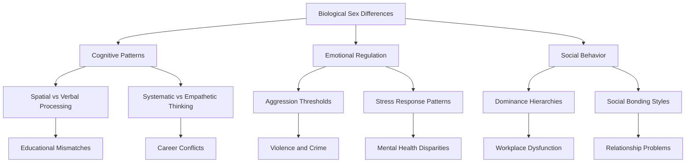
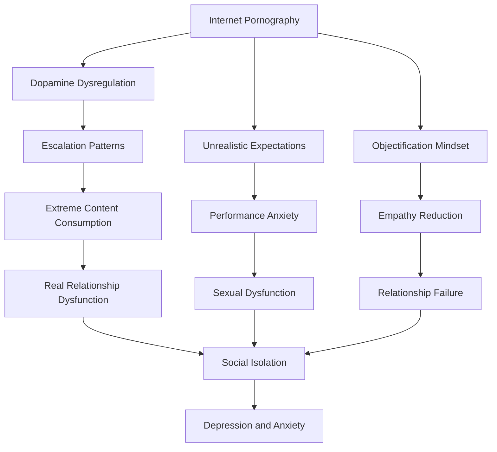
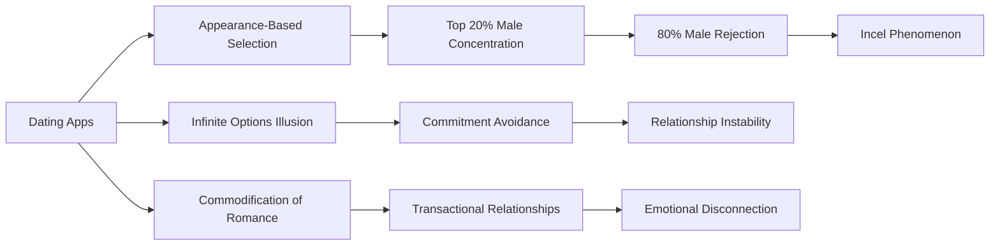
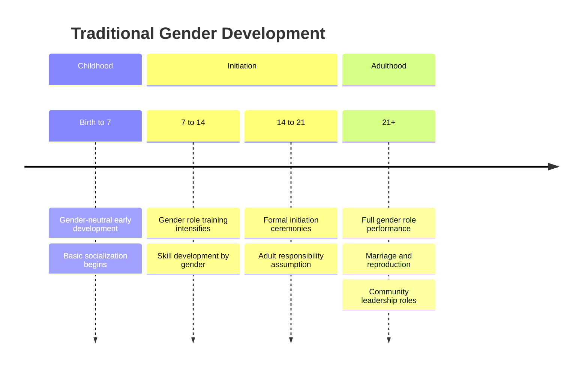
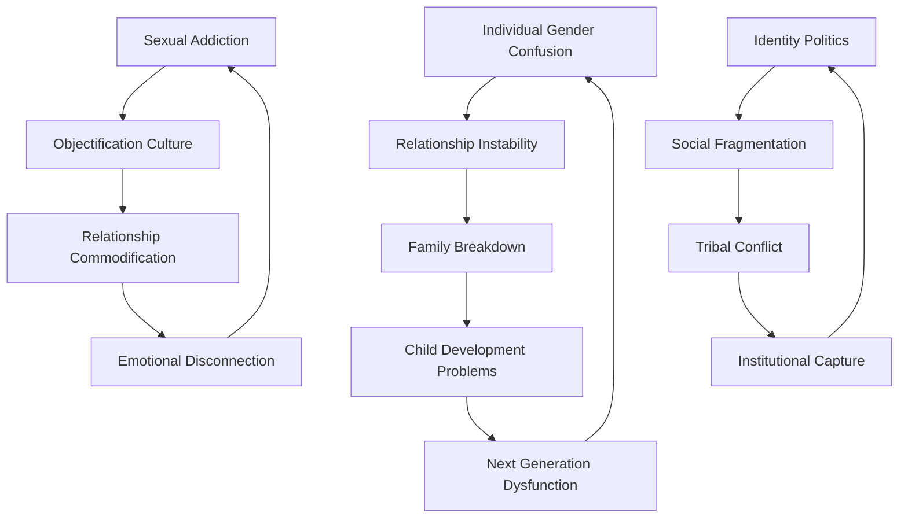

# Gender and Sexuality Dysfunction: Psychological and Social Pathologies

## Abstract

This document examines the complex psychological and social problems arising from human gender and sexuality, analyzing how biological imperatives, cultural constructions, and individual psychology interact to create systematic dysfunction. The analysis integrates evolutionary psychology, social psychology, clinical psychology, and anthropological perspectives to understand how gender and sexual dynamics contribute to individual suffering and social pathology.

## Introduction

Human sexuality and gender identity represent fundamental aspects of psychological and social organization that have become sources of profound dysfunction in modern societies. Unlike other species with relatively straightforward reproductive behaviors, humans have developed complex psychological, cultural, and social systems around gender and sexuality that often conflict with biological realities and create systematic problems at individual, interpersonal, and societal levels.

The dysfunction emerges from multiple sources: evolutionary mismatches between ancient psychological mechanisms and modern environments, cultural constructions that conflict with biological realities, individual psychological pathologies related to identity and sexuality, and social systems that amplify rather than resolve these conflicts.

## Evolutionary and Biological Foundations

### Sexual Selection Pressures

Human sexual behavior evolved under conditions vastly different from modern environments, creating systematic mismatches:

| Evolutionary Pressure | Ancient Environment | Modern Manifestation | Dysfunction Result |
|----------------------|-------------------|---------------------|-------------------|
| **Male Competition** | Physical dominance, resource control | Status competition, wealth display | Toxic masculinity, violence, exploitation |
| **Female Selectivity** | Resource assessment, genetic quality | Hypergamy, unrealistic standards | Relationship instability, mate scarcity |
| **Pair Bonding** | Cooperative child-rearing | Serial monogamy, divorce culture | Attachment disorders, family breakdown |
| **Sexual Dimorphism** | Specialized gender roles | Gender role confusion | Identity crises, social conflict |

### Neurobiological Sex Differences

Brain structure and hormonal differences create systematic psychological variations that modern societies often deny or pathologize:

## Individual-Level Psychological Pathologies

### Gender Identity Disorders

Modern societies have created unprecedented levels of gender-related psychological distress through cultural contradictions and biological denial:

#### Gender Dysphoria and Identity Confusion
- **Prevalence Explosion**: Dramatic increases in gender dysphoria diagnoses, particularly among adolescents
- **Social Contagion Effects**: Peer influence and media exposure creating identity confusion
- **Developmental Disruption**: Interference with normal psychological development during critical periods
- **Treatment Controversies**: Medical interventions with uncertain long-term consequences

#### Masculine Identity Crisis
Modern societies have systematically undermined traditional masculine roles without providing functional alternatives:

| Traditional Role | Modern Disruption | Psychological Consequence |
|-----------------|------------------|-------------------------|
| **Provider** | Economic feminization, dual-income necessity | Purpose loss, inadequacy feelings |
| **Protector** | State monopoly on violence, physical security | Emasculation, aggression displacement |
| **Leader** | Egalitarian ideology, female advancement | Authority confusion, resentment |
| **Competitor** | Participation trophy culture | Achievement motivation decline |

#### Feminine Identity Conflicts
Women face contradictory cultural messages that create systematic psychological stress:

- **Career vs. Motherhood**: Biological imperatives conflicting with professional demands
- **Sexual Liberation vs. Relationship Stability**: Promiscuity undermining pair-bonding capacity
- **Independence vs. Interdependence**: Feminist ideology conflicting with relational needs
- **Physical Standards**: Unrealistic beauty expectations creating body dysmorphia

### Sexual Dysfunction and Pathology

#### Pornography and Sexual Addiction
Modern technology has created unprecedented access to sexual stimuli, leading to systematic dysfunction:

#### Sexual Identity Confusion
- **Orientation Fluidity**: Cultural promotion of sexual experimentation creating identity instability
- **Paraphilia Normalization**: Acceptance of deviant sexual behaviors undermining healthy sexuality
- **Hookup Culture**: Casual sex undermining pair-bonding mechanisms and emotional development

## Group-Level Social Dynamics

### Gender Relations and Social Conflict

#### The Battle of the Sexes
Modern societies have transformed natural gender complementarity into systematic conflict:

| Conflict Domain | Male Perspective | Female Perspective | Social Consequence |
|----------------|-----------------|-------------------|-------------------|
| **Workplace** | Merit-based competition | Systemic discrimination | Quota systems, resentment |
| **Relationships** | Traditional roles | Equal partnership | Power struggles, divorce |
| **Parenting** | Authority and discipline | Nurturing and protection | Conflicted child-rearing |
| **Sexuality** | Physical satisfaction | Emotional connection | Mutual dissatisfaction |

#### Feminist Movement Pathologies
While addressing legitimate grievances, feminism has created new forms of dysfunction:

- **Victimhood Culture**: Systematic cultivation of grievance and resentment
- **Male Demonization**: Pathologizing normal masculine behavior and psychology
- **Biological Denial**: Rejecting scientific evidence of sex differences
- **Family Destruction**: Undermining traditional family structures without functional replacements

#### Men's Rights and Backlash Movements
Reactive movements that often mirror feminist pathologies:

- **Misogyny and Resentment**: Blaming women for systematic social changes
- **Idealization of Past**: Romanticizing historical gender arrangements
- **Victim Competition**: Competing for victim status rather than seeking solutions
- **Extremist Radicalization**: Some members adopting violent or antisocial ideologies

### Sexual Marketplace Dysfunction

#### Hypergamy and Mate Selection Distortions
Modern dating markets create systematic inefficiencies and suffering:

#### Sexual Economics and Exploitation
- **Sex Work Normalization**: Commodification of sexuality undermining relationship formation
- **Sugar Dating**: Economic relationships masquerading as romance
- **OnlyFans Culture**: Monetization of sexual attention creating parasocial dysfunction

## Societal-Level Cultural Pathologies

### Legal and Institutional Dysfunction

#### Family Court Bias and Divorce Industry
Legal systems that incentivize family breakdown:

| Institution | Dysfunction | Consequence |
|------------|-------------|-------------|
| **Divorce Courts** | Female bias in custody, alimony | Male disincentive to marry |
| **Title IX** | Presumption of male guilt | Campus kangaroo courts |
| **HR Departments** | Sexual harassment hysteria | Workplace gender segregation |
| **Educational System** | Anti-male bias | Academic achievement gaps |

#### Gender Ideology in Institutions
- **Educational Indoctrination**: Teaching gender ideology to children
- **Corporate Diversity Programs**: Discriminatory hiring and promotion practices
- **Medical Establishment**: Politicization of gender dysphoria treatment
- **Media Propaganda**: Systematic promotion of dysfunctional gender narratives

### Cultural Degradation and Moral Confusion

#### Sexual Revolution Consequences
The systematic dismantling of traditional sexual morality has created widespread dysfunction:

- **Promiscuity Normalization**: Undermining pair-bonding capacity and relationship stability
- **Pornography Mainstreaming**: Corrupting healthy sexual development
- **Marriage Devaluation**: Reducing commitment and increasing divorce rates
- **Child Welfare Decline**: Single parenthood and family instability harming children

#### Identity Politics and Social Fragmentation
Gender and sexuality have become political weapons that divide society:

- **Intersectionality**: Creating hierarchies of victimhood and resentment
- **Cancel Culture**: Punishing dissent from gender orthodoxy
- **Pronoun Policing**: Forcing participation in ideological frameworks
- **Bathroom Wars**: Symbolic conflicts that mask deeper cultural divisions

## Historical and Cross-Cultural Perspectives

### Traditional Gender Systems

#### Functional Gender Complementarity
Historical societies developed gender systems that, while imperfect, provided psychological and social stability:

| Culture | Gender System | Functional Aspects | Limitations |
|---------|---------------|-------------------|-------------|
| **Ancient Greece** | Separate spheres, male public domain | Clear role definition, social stability | Female subordination, limited opportunities |
| **Medieval Europe** | Chivalric ideals, courtly love | Male protection, female honor | Rigid hierarchy, individual suppression |
| **Traditional Japan** | Confucian hierarchy, family honor | Social harmony, clear expectations | Individual autonomy restriction |
| **Islamic Societies** | Complementary roles, family focus | Gender role clarity, family stability | Female restriction, male dominance |

#### Rites of Passage and Gender Initiation
Traditional societies provided clear transitions to adult gender roles:

### Modern Gender Experiments and Failures

#### Scandinavian Gender Equality Paradox
Despite extensive gender equality efforts, Scandinavian countries show increased gender differences in career choices and psychological traits, suggesting biological factors resist cultural manipulation.

#### Soviet Gender Experiments
Communist attempts to eliminate gender differences through social engineering largely failed, with traditional patterns reasserting themselves despite ideological pressure.

#### Contemporary Gender Ideology
Current Western gender theories represent unprecedented experiments in human social organization with uncertain outcomes and significant risks.

## Cross-Level Integration and Systemic Analysis

### Feedback Loops and Amplification Mechanisms

#### Individual Pathology → Social Dysfunction
Personal gender and sexual problems aggregate to create societal issues:

#### Cultural Reinforcement Cycles
Modern institutions amplify rather than resolve gender and sexual dysfunction:

- **Media Amplification**: Promoting dysfunctional behaviors and ideologies
- **Educational Reinforcement**: Teaching problematic gender theories to children
- **Legal Institutionalization**: Encoding dysfunction into law and policy
- **Economic Incentivization**: Creating financial rewards for family breakdown

### Systemic Solutions and Interventions

#### Individual Level Interventions
- **Psychological Education**: Teaching biological realities of sex differences
- **Healthy Relationship Skills**: Developing functional romantic and sexual behaviors
- **Identity Stability**: Supporting coherent gender identity development
- **Addiction Treatment**: Addressing pornography and sexual compulsions

#### Social Level Reforms
- **Educational Reform**: Removing ideological indoctrination from schools
- **Legal System Reform**: Addressing bias in family courts and institutions
- **Cultural Renewal**: Promoting healthy gender role models and relationships
- **Media Responsibility**: Reducing promotion of dysfunctional behaviors

#### Institutional Changes
- **Family Support**: Policies that strengthen rather than undermine families
- **Merit-Based Systems**: Removing discriminatory diversity programs
- **Biological Recognition**: Acknowledging sex differences in appropriate contexts
- **Child Protection**: Preventing ideological manipulation of minors

## Future Projections and Risks

### Demographic Consequences
Current gender and sexual dysfunction trends threaten societal reproduction and stability:

| Trend | Current Trajectory | Projected Outcome |
|-------|-------------------|-------------------|
| **Birth Rates** | Below replacement in developed nations | Population collapse, economic crisis |
| **Marriage Rates** | Declining across all demographics | Family structure breakdown |
| **Gender Dysphoria** | Exponential increase in youth | Widespread psychological dysfunction |
| **Sexual Dysfunction** | Rising rates of sexual problems | Reproductive capacity decline |

### Technological Amplification
Emerging technologies may worsen existing problems:

- **Virtual Reality**: Further disconnection from real relationships
- **Artificial Intelligence**: AI companions replacing human bonding
- **Genetic Engineering**: Potential manipulation of sexual characteristics
- **Social Media**: Continued amplification of dysfunctional behaviors

### Cultural Evolution Scenarios
Possible future developments in gender and sexual culture:

#### Scenario 1: Continued Dysfunction
- Escalating gender conflicts and social fragmentation
- Demographic collapse in developed nations
- Institutional breakdown and social chaos
- Potential civilizational decline

#### Scenario 2: Biological Realism
- Recognition of sex differences and biological constraints
- Return to functional gender complementarity
- Restoration of family stability and social cohesion
- Sustainable demographic patterns

#### Scenario 3: Technological Transcendence
- Technology replacing biological reproduction
- Virtual relationships substituting for human bonding
- Fundamental alteration of human nature
- Unknown psychological and social consequences

## Conclusion

Gender and sexuality dysfunction represents one of the most significant challenges facing modern human societies. The systematic denial of biological realities, combined with cultural experiments in gender relations, has created unprecedented levels of individual psychological distress and social conflict.

The problems operate across multiple levels: individual psychological pathologies related to identity and sexuality, group-level conflicts between men and women, and societal-level institutional dysfunction that amplifies rather than resolves these issues. Historical and cross-cultural analysis suggests that functional gender systems require recognition of biological differences while providing meaningful roles for both sexes.

Resolution requires integrated approaches that acknowledge biological realities while addressing legitimate concerns about equality and individual fulfillment. The stakes are high: continued dysfunction threatens demographic sustainability, social cohesion, and potentially civilizational survival.

The path forward demands courage to challenge ideological orthodoxies, wisdom to learn from historical experience, and commitment to human flourishing over political correctness. Without such efforts, gender and sexual dysfunction will likely continue to undermine individual happiness and social stability for generations to come.

## References and Further Reading

### Primary Sources
- Buss, D. M. (2019). *The Evolution of Desire: Strategies of Human Mating*
- Baron-Cohen, S. (2003). *The Essential Difference: Male and Female Brains*
- Baumeister, R. F. (2010). *Is There Anything Good About Men?*
- Regnerus, M. (2017). *Cheap Sex: The Transformation of Men, Marriage, and Monogamy*

### Cross-References
- [See: Individual Psychology → Evolutionary Foundations](../individual/evolutionary-foundations.md)
- [Related: Group Dynamics → Social Psychology](../group/social-psychology.md)
- [Compare: Societal Analysis → Cultural Pathology](../societal/cultural-pathology.md)
- [Integration: Systems Theory → Cross-Level Integration](../integrative/cross-level-integration.md)

---

*This document represents an interdisciplinary analysis of gender and sexuality dysfunction from psychological, sociological, anthropological, and evolutionary perspectives. The analysis aims to understand rather than advocate, recognizing the complexity and sensitivity of these issues while maintaining academic rigor and evidence-based reasoning.*