# Power and Dominance: Psychological Drives and Social Consequences

## Abstract

This document examines the fundamental human drives for power and dominance, analyzing how these evolutionary adaptations create systematic dysfunction in modern societies. The analysis integrates evolutionary psychology, social psychology, political science, and historical analysis to understand how power-seeking behaviors that were adaptive in ancestral environments now generate individual pathology, social conflict, and institutional corruption across all levels of human organization.

## Introduction

The drive for power and dominance represents one of humanity's most fundamental and destructive psychological motivations. Rooted in evolutionary pressures for survival, reproduction, and resource control, these drives have shaped human psychology and social organization throughout history. However, the same mechanisms that enabled survival in small-scale ancestral environments now create systematic problems in complex modern societies.

Power-seeking behavior operates across multiple levels: individual psychological drives for control and status, interpersonal dynamics of dominance and submission, group-level hierarchies and competition, and societal-level institutional structures that concentrate and abuse power. The dysfunction emerges from the mismatch between evolved psychological mechanisms designed for small-group living and the complex, large-scale societies humans now inhabit.

## Evolutionary Foundations of Power Drive

### Adaptive Origins of Dominance Behavior

Power-seeking behaviors evolved as adaptive responses to ancestral environmental challenges:

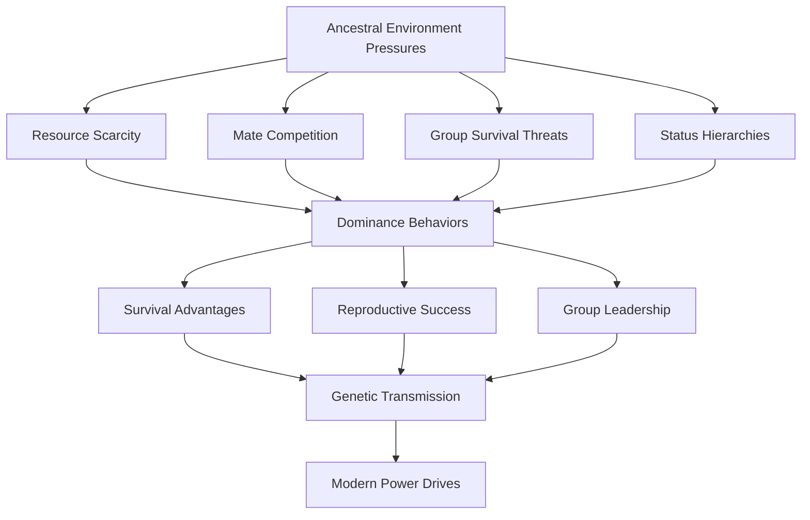

### Sexual Selection and Power

Power and dominance served crucial functions in sexual selection:

| Gender | Power Strategy | Evolutionary Function | Modern Manifestation |
|--------|---------------|---------------------|---------------------|
| **Male** | Physical dominance, resource control | Mate attraction, competitor elimination | Corporate leadership, political ambition |
| **Female** | Social influence, coalition building | Resource access, offspring protection | Social manipulation, indirect power |
| **Both** | Status signaling, reputation management | Group position, alliance formation | Wealth display, fame seeking |

### Neurobiological Basis of Power Motivation

The brain systems underlying power drive create systematic behavioral patterns:

#### Dopamine and Reward Systems
- **Anticipation**: Power pursuit activates reward prediction circuits
- **Achievement**: Successful dominance creates dopamine release
- **Addiction**: Power becomes self-reinforcing through neurochemical rewards
- **Tolerance**: Increasing power needed to maintain satisfaction

#### Testosterone and Dominance
- **Aggression**: Higher testosterone linked to competitive and aggressive behavior
- **Risk-Taking**: Hormonal influence on power-seeking risk tolerance
- **Status Seeking**: Biological drive for hierarchical position
- **Feedback Loops**: Power success increases testosterone, creating escalation

## Individual-Level Psychological Pathologies

### Power Addiction and Narcissistic Pathology

#### Narcissistic Personality Disorder and Power
Power-seeking often stems from and exacerbates narcissistic pathology:

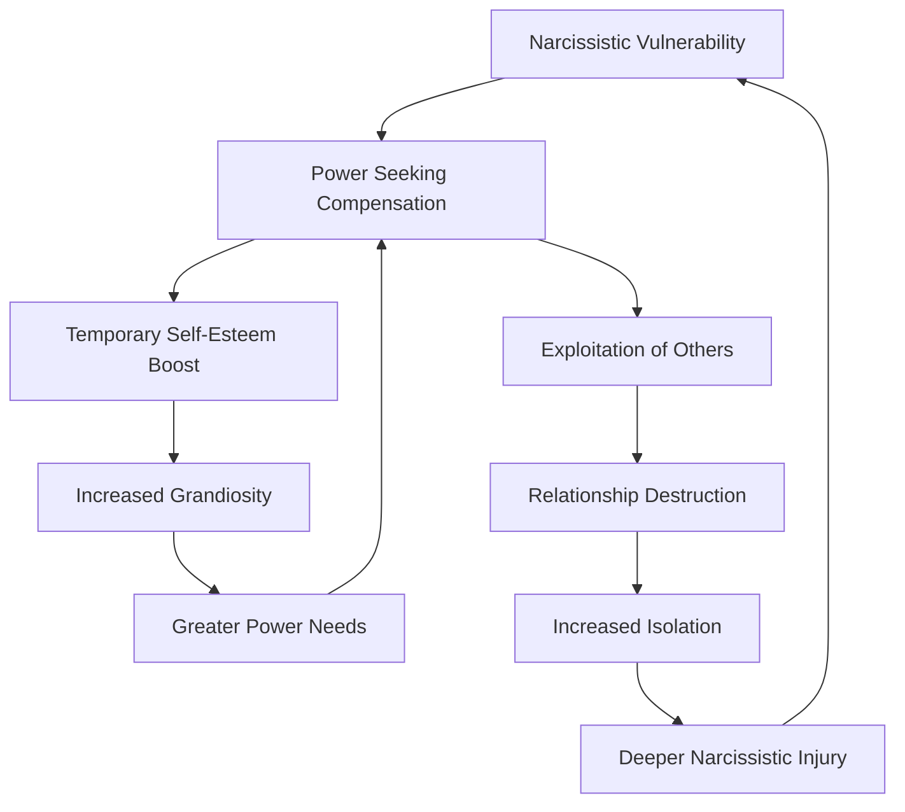

#### Power Addiction Syndrome
Systematic patterns of compulsive power-seeking:

- **Tolerance**: Need for increasing levels of control and influence
- **Withdrawal**: Anxiety and depression when power is threatened or lost
- **Preoccupation**: Obsessive focus on power acquisition and maintenance
- **Consequences**: Continued pursuit despite negative personal and social effects

### Machiavellianism and Dark Triad Traits

#### The Dark Triad and Power
Three personality traits consistently associated with power-seeking:

| Trait | Core Characteristics | Power Strategy | Dysfunction Pattern |
|-------|---------------------|----------------|-------------------|
| **Narcissism** | Grandiosity, entitlement, lack of empathy | Charismatic leadership, self-promotion | Exploitation, relationship destruction |
| **Machiavellianism** | Manipulation, cynicism, strategic thinking | Political maneuvering, alliance building | Trust erosion, institutional corruption |
| **Psychopathy** | Callousness, impulsivity, antisocial behavior | Intimidation, rule-breaking, aggression | Violence, social destruction |

#### Subclinical Psychopathy in Leadership
Many successful leaders exhibit subclinical psychopathic traits:

- **Emotional Detachment**: Ability to make ruthless decisions without emotional interference
- **Superficial Charm**: Skill at manipulation and impression management
- **Risk-Taking**: Willingness to pursue dangerous strategies for power gain
- **Lack of Remorse**: Absence of guilt about harmful consequences to others

### Control Compulsions and Micromanagement

#### Obsessive-Compulsive Power Patterns
Power drive can manifest as compulsive control behaviors:

#### Learned Helplessness in Power Relationships
Chronic exposure to controlling behavior creates systematic dysfunction in subordinates:

- **Autonomy Loss**: Reduced capacity for independent decision-making
- **Initiative Suppression**: Fear of taking action without permission
- **Creativity Decline**: Reduced innovation and problem-solving ability
- **Psychological Dependence**: Reliance on authority figures for guidance

## Interpersonal Dynamics of Power and Dominance

### Dominance Hierarchies in Human Relationships

#### Workplace Power Dynamics
Modern organizations recreate ancestral dominance hierarchies with systematic dysfunctions:

| Hierarchical Level | Power Behaviors | Subordinate Responses | Dysfunction Outcomes |
|-------------------|-----------------|---------------------|---------------------|
| **Executive** | Strategic control, resource allocation | Compliance, information filtering | Isolation from reality, poor decisions |
| **Management** | Operational control, performance monitoring | Competition, political maneuvering | Toxic culture, reduced productivity |
| **Supervisory** | Direct oversight, task assignment | Resentment, passive resistance | High turnover, low morale |
| **Worker** | Minimal autonomy, rule following | Learned helplessness, disengagement | Innovation loss, quality decline |

#### Family Power Structures
Domestic relationships exhibit complex power dynamics:

**Patriarchal Patterns**
- Traditional male dominance creating female subordination
- Economic control as power mechanism
- Decision-making authority concentration
- Domestic violence as ultimate control tool

**Matriarchal Responses**
- Indirect influence through emotional manipulation
- Coalition building with children against father
- Passive-aggressive resistance to male authority
- Sexual control as power leverage

### Power Struggles and Relationship Dysfunction

#### Intimate Relationship Power Dynamics
Romantic relationships become battlegrounds for control:

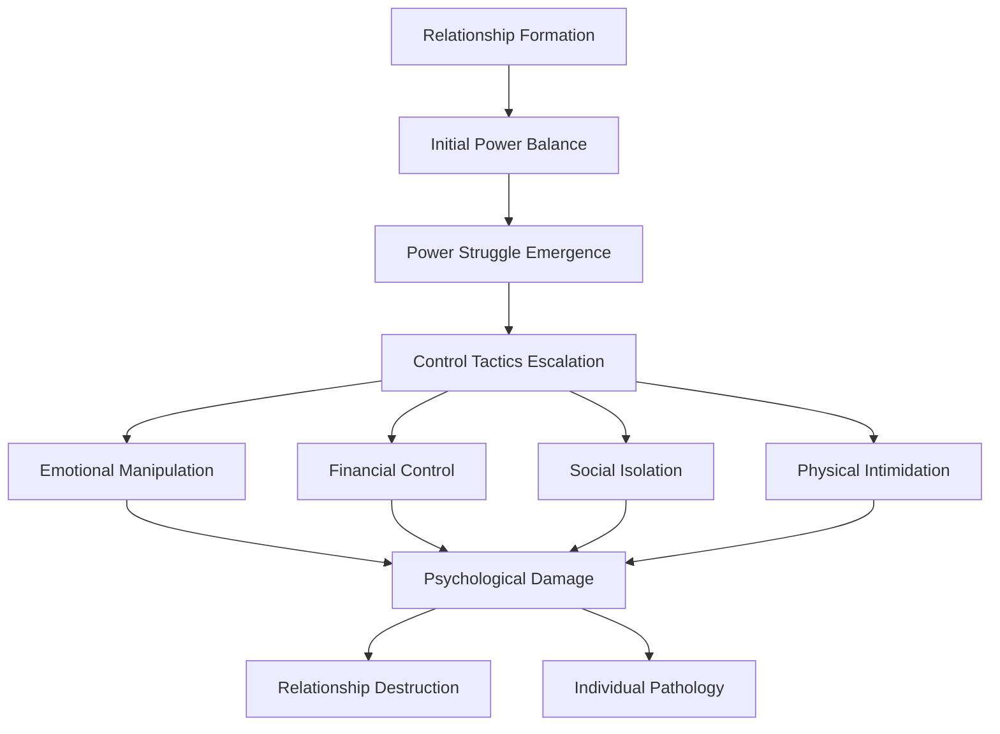

#### Parent-Child Power Imbalances
Parental authority can become pathological control:

- **Authoritarian Parenting**: Excessive control creating rebellion or submission
- **Helicopter Parenting**: Overprotection preventing autonomy development
- **Narcissistic Parenting**: Using children for parental ego gratification
- **Parentification**: Forcing children into adult roles and responsibilities

### Social Status Competition

#### Status Anxiety and Competitive Behavior
Modern societies create systematic status competition:

| Status Domain | Competition Mechanism | Psychological Impact | Social Consequence |
|---------------|---------------------|---------------------|-------------------|
| **Economic** | Wealth accumulation, consumption display | Materialism, debt stress | Inequality, social fragmentation |
| **Professional** | Career advancement, achievement recognition | Workaholism, burnout | Organizational dysfunction |
| **Social** | Popularity, influence, network size | Superficial relationships | Community breakdown |
| **Physical** | Appearance, fitness, youth | Body dysmorphia, health obsession | Discrimination, self-harm |

#### Social Media and Status Broadcasting
Digital platforms amplify status competition:

- **Curated Self-Presentation**: Artificial life portrayal for status enhancement
- **Metrics Obsession**: Followers, likes, and shares as status measures
- **Comparison Culture**: Constant evaluation against others' highlight reels
- **Validation Addiction**: Dependence on external approval for self-worth

## Group-Level Power Dynamics and Organizational Pathology

### Institutional Power Concentration

#### Corporate Power Structures
Modern corporations concentrate power in ways that create systematic dysfunction:

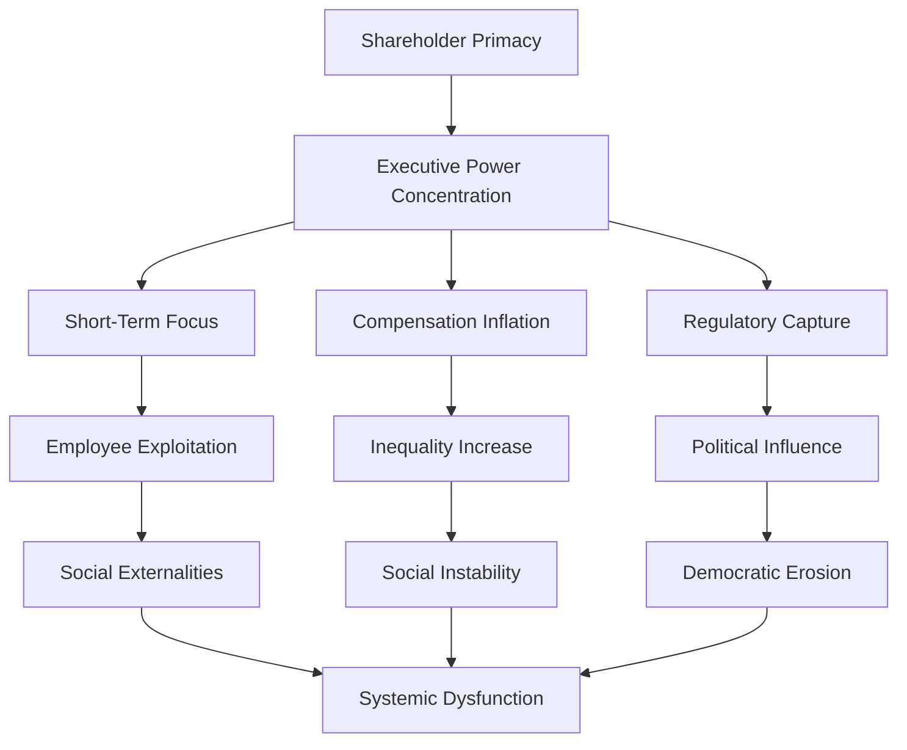

#### Bureaucratic Power Accumulation
Government institutions develop self-perpetuating power structures:

- **Agency Expansion**: Bureaucracies seeking increased authority and resources
- **Regulatory Overreach**: Rules and regulations expanding beyond original intent
- **Capture Phenomena**: Industries influencing their supposed regulators
- **Democratic Deficit**: Unelected officials wielding significant power

### Group Think and Power Conformity

#### Authority Submission Patterns
Groups systematically surrender individual judgment to authority figures:

| Authority Type | Submission Mechanism | Group Behavior | Dysfunction Result |
|---------------|---------------------|----------------|-------------------|
| **Charismatic** | Emotional appeal, personal magnetism | Devotion, uncritical following | Cult formation, exploitation |
| **Traditional** | Historical precedent, cultural legitimacy | Ritual compliance, role acceptance | Stagnation, oppression |
| **Legal-Rational** | Rules, procedures, expertise claims | Bureaucratic obedience | Innovation suppression |
| **Coercive** | Fear, punishment threats | Compliance, resistance suppression | Totalitarian control |

#### Milgram Effect in Organizations
Stanley Milgram's obedience experiments reveal systematic authority submission:

- **Gradual Escalation**: Small compliance requests leading to major ethical violations
- **Responsibility Diffusion**: Authority figures bearing moral responsibility
- **Social Pressure**: Group conformity reinforcing individual submission
- **Moral Disengagement**: Psychological mechanisms justifying harmful actions

### Organizational Corruption and Power Abuse

#### Systematic Corruption Patterns
Power concentration creates predictable corruption:

#### Corporate Malfeasance Patterns
Predictable patterns of corporate power abuse:

- **Financial Fraud**: Accounting manipulation, investor deception
- **Environmental Destruction**: Externalization of environmental costs
- **Worker Exploitation**: Wage theft, unsafe conditions, union suppression
- **Consumer Harm**: Product safety compromises, deceptive marketing

## Societal-Level Power Structures and Political Pathology

### Political Power Concentration and Democratic Erosion

#### Elite Capture of Democratic Institutions
Wealthy and powerful interests systematically capture democratic processes:

| Institution | Capture Mechanism | Elite Benefit | Democratic Damage |
|------------|------------------|---------------|-------------------|
| **Elections** | Campaign contributions, lobbying | Policy influence, regulatory favor | Voter disenfranchisement |
| **Media** | Ownership concentration, advertising revenue | Narrative control | Information manipulation |
| **Education** | Funding influence, curriculum control | Ideological shaping | Critical thinking suppression |
| **Judiciary** | Appointment influence, legal complexity | Favorable rulings | Justice inequality |

#### Authoritarian Drift Patterns
Democracies systematically drift toward authoritarianism through power concentration:

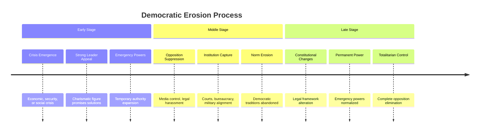

### Economic Power and Inequality

#### Wealth Concentration Dynamics
Economic systems systematically concentrate wealth and power:

- **Capital Returns**: Investment returns exceeding economic growth rates
- **Network Effects**: Wealth creating opportunities for more wealth accumulation
- **Political Influence**: Money translating into policy favorable to wealth holders
- **Intergenerational Transmission**: Wealth and power passing to offspring

#### Corporate Power vs. Democratic Governance
Multinational corporations wield power rivaling nation-states:

| Power Dimension | Corporate Advantage | Democratic Limitation | Consequence |
|----------------|-------------------|---------------------|-------------|
| **Economic** | Global resource control | National boundary constraints | Policy subordination |
| **Information** | Data collection, analysis | Privacy, transparency limits | Manipulation capacity |
| **Mobility** | Capital, production flexibility | Geographic, legal constraints | Regulatory arbitrage |
| **Timeframe** | Long-term planning | Electoral cycle pressures | Strategic disadvantage |

### Military-Industrial Complex and Security State Power

#### Permanent War Economy
Military institutions develop self-perpetuating power structures:

- **Threat Inflation**: Exaggerating security risks to justify military spending
- **Revolving Door**: Personnel movement between military and defense contractors
- **Congressional Capture**: Defense spending as economic development tool
- **Mission Creep**: Military solutions applied to non-military problems

#### Surveillance State Development
Security agencies accumulate unprecedented monitoring capabilities:

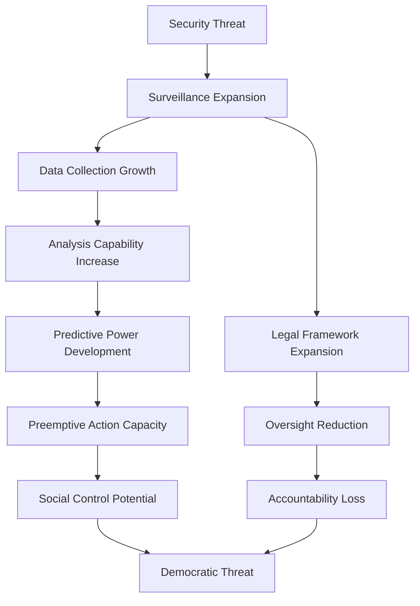

## Historical Examples of Power Corruption

### Ancient Civilizations and Power Concentration

#### Roman Empire Power Dynamics
Rome's evolution from republic to empire illustrates systematic power concentration:

| Period | Power Structure | Corruption Patterns | Collapse Factors |
|--------|----------------|-------------------|------------------|
| **Early Republic** | Balanced institutions, citizen participation | Limited elite corruption | External pressures |
| **Late Republic** | Wealth concentration, military strongmen | Systematic bribery, violence | Civil wars |
| **Early Empire** | Imperial autocracy, bureaucratic administration | Court intrigue, succession crises | Military coups |
| **Late Empire** | Divided rule, military dominance | Widespread corruption, taxation | Economic collapse |

#### Chinese Dynastic Cycles
Chinese history reveals recurring patterns of power concentration and collapse:

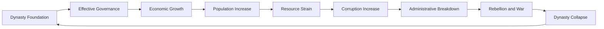

### Modern Totalitarian Systems

#### Nazi Germany Power Concentration
The Nazi regime demonstrates rapid democratic destruction through power concentration:

- **Legal Revolution**: Using democratic processes to destroy democracy
- **Gleichschaltung**: Systematic coordination of all social institutions
- **Propaganda Control**: Total information environment manipulation
- **Terror Apparatus**: Violence and intimidation to suppress opposition

#### Soviet Union Bureaucratic Power
Communist systems created new forms of power concentration:

- **Party Monopoly**: Single-party control over all aspects of society
- **Central Planning**: Economic power concentration in state bureaucracy
- **Ideological Control**: Thought and expression regulation
- **Nomenklatura System**: Elite privilege and power perpetuation

#### Contemporary Authoritarian Capitalism
Modern China demonstrates power concentration in market economies:

| Power Domain | Concentration Mechanism | Control Method | Social Impact |
|-------------|------------------------|----------------|---------------|
| **Economic** | State-owned enterprises, private sector guidance | Resource allocation, market access | Innovation direction |
| **Information** | Internet censorship, social media control | Content filtering, surveillance | Opinion shaping |
| **Social** | Social credit system, behavioral monitoring | Reward/punishment mechanisms | Conformity pressure |
| **Political** | Party control, civil society suppression | Legal system, security apparatus | Dissent elimination |

### Corporate Power Concentration Examples

#### Gilded Age Monopolies
Late 19th-century America saw unprecedented corporate power concentration:

- **Standard Oil**: John D. Rockefeller's systematic competition elimination
- **Carnegie Steel**: Andrew Carnegie's vertical integration and market control
- **Railroad Trusts**: Transportation monopolies controlling economic development
- **Banking Concentration**: J.P. Morgan's financial system dominance

#### Contemporary Tech Giants
Modern technology companies wield unprecedented power:

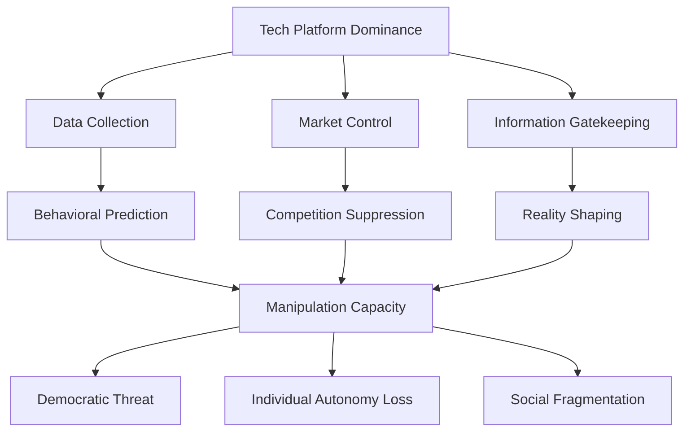

## Cross-Level Integration and Systemic Analysis

### Power Concentration Feedback Loops

#### Individual → Institutional → Societal Amplification
Power-seeking behavior creates self-reinforcing cycles across levels:

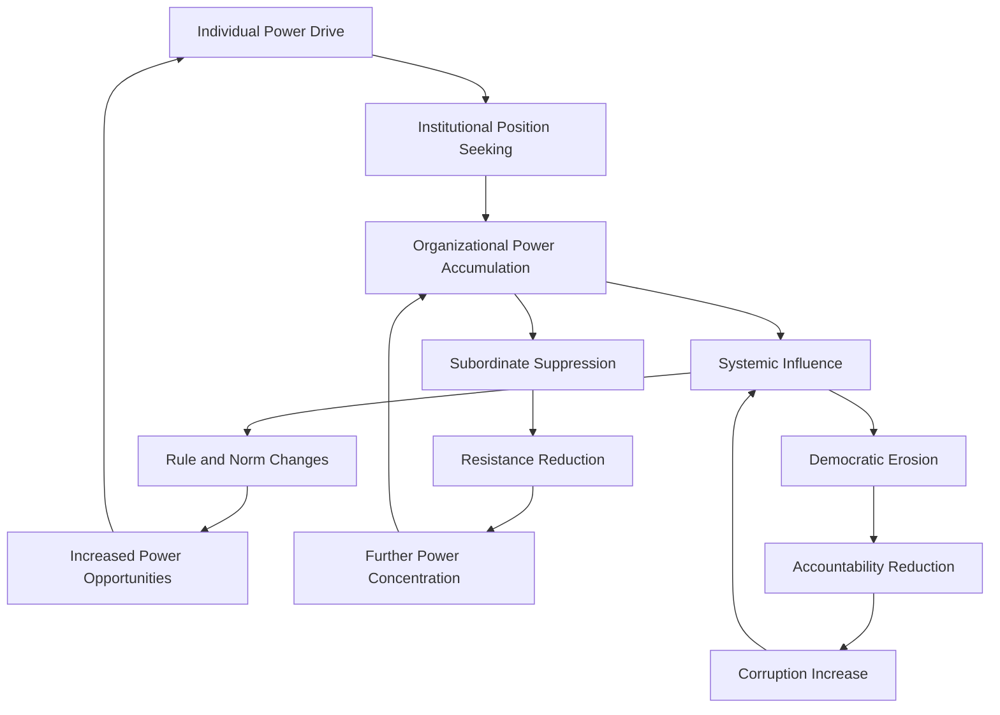

#### Wealth → Power → More Wealth Cycles
Economic and political power reinforce each other:

- **Policy Influence**: Wealth buying favorable regulations and tax policies
- **Market Manipulation**: Political connections enabling unfair competitive advantages
- **Information Access**: Power providing early access to profitable information
- **Risk Socialization**: Losses transferred to public while profits remain private

### Systemic Power Pathologies

#### Institutional Capture Patterns
Powerful interests systematically capture institutions meant to regulate them:

| Institution Type | Capture Mechanism | Captured Behavior | Public Interest Damage |
|-----------------|------------------|-------------------|----------------------|
| **Regulatory Agencies** | Revolving door, industry expertise | Lenient enforcement, favorable rules | Consumer harm, environmental damage |
| **Academic Institutions** | Funding influence, career incentives | Biased research, suppressed findings | Knowledge distortion |
| **Media Organizations** | Ownership, advertising revenue | Favorable coverage, story suppression | Information manipulation |
| **Political Parties** | Campaign contributions, lobbying | Policy alignment, access provision | Democratic representation failure |

#### Democratic Deficit Amplification
Power concentration creates systematic democratic failures:

- **Representation Gap**: Elected officials serving elite rather than public interests
- **Information Asymmetry**: Powerful interests controlling information flow
- **Participation Barriers**: Complexity and cost excluding ordinary citizens
- **Accountability Erosion**: Power insulation from democratic oversight

## Mitigation Strategies and Systemic Solutions

### Individual-Level Interventions

#### Psychological Approaches to Power Pathology
Therapeutic interventions for power-related dysfunction:

| Intervention Type | Target Pathology | Therapeutic Approach | Expected Outcome |
|------------------|------------------|---------------------|------------------|
| **Narcissistic Therapy** | Grandiosity, exploitation | Empathy development, reality testing | Reduced manipulation |
| **Anger Management** | Dominance aggression | Emotional regulation, conflict resolution | Decreased violence |
| **Addiction Treatment** | Power compulsion | 12-step programs, behavioral modification | Control reduction |
| **Mindfulness Training** | Control anxiety | Present-moment awareness, acceptance | Flexibility increase |

#### Leadership Development and Ethical Training
Programs to develop healthy power use:

- **Servant Leadership**: Focus on serving others rather than self-aggrandizement
- **Ethical Decision-Making**: Frameworks for considering stakeholder impacts
- **Power Awareness**: Understanding psychological effects of power on behavior
- **Accountability Systems**: Regular feedback and performance evaluation

### Organizational-Level Reforms

#### Structural Power Distribution
Organizational designs that prevent power concentration:

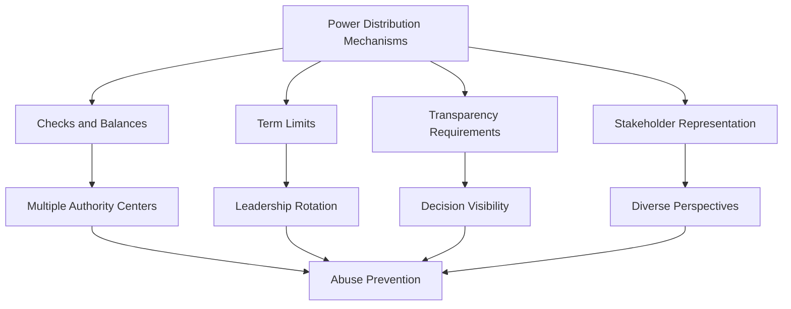

#### Corporate Governance Reform
Mechanisms to control corporate power abuse:

- **Board Independence**: Directors independent from management influence
- **Stakeholder Representation**: Workers, communities, environment on boards
- **Executive Compensation Limits**: Reasonable ratios between executive and worker pay
- **Transparency Requirements**: Public disclosure of political spending and lobbying

### Societal-Level Systemic Changes

#### Democratic Renewal Strategies
Reforms to restore democratic control over concentrated power:

| Reform Area | Specific Measures | Power Impact | Democratic Benefit |
|------------|------------------|--------------|-------------------|
| **Campaign Finance** | Public funding, contribution limits | Reduced wealthy influence | Equal representation |
| **Lobbying Regulation** | Registration, disclosure, cooling-off periods | Transparent influence | Informed decision-making |
| **Media Ownership** | Concentration limits, public broadcasting | Diverse information sources | Informed citizenry |
| **Electoral Systems** | Proportional representation, ranked choice | Reduced two-party dominance | Broader representation |

#### Economic Power Redistribution
Policies to reduce extreme wealth and power concentration:

- **Progressive Taxation**: Higher rates on extreme wealth and inheritance
- **Antitrust Enforcement**: Breaking up monopolistic corporations
- **Worker Ownership**: Employee stock ownership plans, cooperatives
- **Universal Basic Services**: Public provision of essential needs

#### Constitutional and Legal Reforms
Fundamental changes to limit power concentration:

- **Corporate Personhood**: Reversing legal fiction of corporate constitutional rights
- **Money as Speech**: Limiting political spending as protected expression
- **Executive Power**: Restoring legislative and judicial checks on executive authority
- **Emergency Powers**: Strict limits and oversight on crisis authority

## Future Projections and Emerging Challenges

### Technological Amplification of Power

#### Artificial Intelligence and Power Concentration
AI technologies may create unprecedented power concentration:

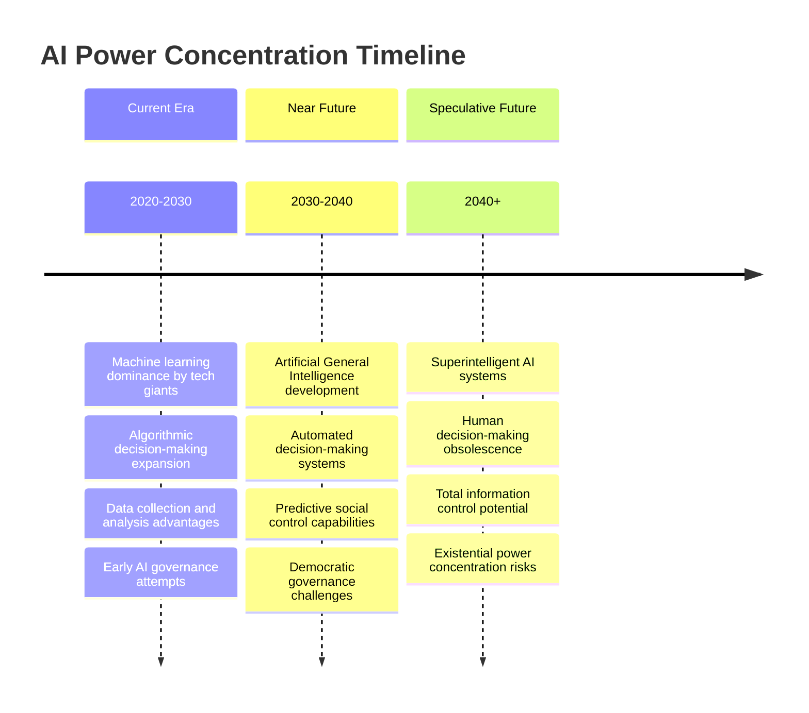

#### Digital Surveillance and Social Control
Technology enabling unprecedented monitoring and control:

- **Ubiquitous Surveillance**: Cameras, sensors, and tracking in all environments
- **Behavioral Prediction**: AI systems anticipating and influencing human behavior
- **Social Credit Systems**: Comprehensive behavioral monitoring and scoring
- **Thought Control**: Brain-computer interfaces potentially monitoring mental activity

### Geopolitical Power Shifts

#### Multipolar World Order
Shifting global power dynamics creating new challenges:

| Power Center | Strengths | Weaknesses | Global Impact |
|-------------|-----------|------------|---------------|
| **United States** | Military, technology, financial systems | Domestic polarization, debt | Declining hegemony |
| **China** | Economic growth, state capacity, population | Demographic decline, authoritarianism | Rising influence |
| **European Union** | Economic integration, regulatory power | Political fragmentation, energy dependence | Regulatory leadership |
| **Emerging Powers** | Economic dynamism, resource control | Institutional weakness, corruption | Regional influence |

#### Climate Change and Resource Competition
Environmental pressures creating new power dynamics:

- **Resource Scarcity**: Water, arable land, and energy competition
- **Climate Migration**: Population movements creating political instability
- **Geoengineering**: Potential for weather and climate control as power tools
- **Green Technology**: Renewable energy and storage as new power sources

### Potential Future Scenarios

#### Scenario 1: Techno-Authoritarianism
Technology enables unprecedented authoritarian control:

- **AI-Enabled Surveillance**: Complete monitoring and behavioral prediction
- **Algorithmic Governance**: Automated decision-making replacing human judgment
- **Social Engineering**: Systematic behavior modification through technology
- **Resistance Suppression**: Technology making opposition nearly impossible

#### Scenario 2: Democratic Renaissance
Successful reforms restore democratic control over power:

- **Power Redistribution**: Effective limits on wealth and corporate concentration
- **Participatory Democracy**: Technology enabling broader citizen participation
- **Transparency Revolution**: Open information and decision-making processes
- **Global Cooperation**: International coordination on power concentration issues

#### Scenario 3: Fragmentation and Conflict
Power concentration leads to system breakdown:

- **Elite Overreach**: Excessive power concentration triggering popular revolt
- **Institutional Collapse**: Democratic and economic systems failing
- **Social Fragmentation**: Society dividing into competing power centers
- **Violent Conflict**: Power struggles escalating to civil war or international conflict

## Conclusion

The human drive for power and dominance represents one of the most fundamental and problematic aspects of human psychology. Rooted in evolutionary adaptations for survival and reproduction, these drives now create systematic dysfunction across individual, interpersonal, organizational, and societal levels in modern complex societies.

The problems manifest as individual psychological pathologies including narcissism and control compulsions, interpersonal dynamics of exploitation and submission, organizational corruption and abuse, and societal-level democratic erosion and inequality. Historical analysis reveals recurring patterns of power concentration leading to corruption, oppression, and eventual system collapse.

Current technological developments, particularly in artificial intelligence and surveillance, threaten to amplify power concentration to unprecedented and potentially irreversible levels. The stakes are existential: unchecked power concentration could lead to permanent authoritarianism, social fragmentation, or civilizational collapse.

Solutions require integrated approaches across all levels: individual psychological development and ethical training, organizational reforms to distribute power and ensure accountability, and societal-level changes to restore democratic control over concentrated economic and political power. The window for effective action may be narrowing as technological capabilities outpace governance systems.

The path forward demands recognition that power concentration is not inevitable but results from specific psychological, organizational, and systemic factors that can be addressed through conscious effort and institutional design. Success requires courage to challenge entrenched interests, wisdom to design effective power-limiting mechanisms, and commitment to human dignity and democratic values over elite privilege and control.

Ultimately, the goal is not to eliminate power - which is necessary for coordination and decision-making - but to ensure it serves human flourishing rather than elite domination, remains accountable to those affected by its exercise, and operates within constraints that prevent its concentration and abuse.

## References and Further Reading

### Primary Sources
- Keltner, D. (2016). *The Power Paradox: How We Gain and Lose Influence*
- Zimbardo, P. (2007). *The Lucifer Effect: Understanding How Good People Turn Evil*
- Acemoglu, D., & Robinson, J. A. (2012). *Why Nations Fail: The Origins of Power, Prosperity, and Poverty*
- Michels, R. (1911). *Political Parties: A Sociological Study of the Oligarchical Tendencies of Modern Democracy*

### Cross-References
- [See: Individual Psychology → Psychological Pathology](../individual/psychological-pathology.md)
- [Related: Group Dynamics → Organizational Pathology](../group/organizational-pathology.md)
- [Compare: Societal Analysis → Political Systems Failure](../societal/political-systems-failure.md)
- [Integration: Historical Analysis → Civilizational Collapse](../historical/civilizational-collapse.md)

---

*This document represents an interdisciplinary analysis of power and dominance drives from psychological, sociological, political, and historical perspectives. The analysis aims to understand the systematic problems created by human power-seeking behavior while maintaining academic rigor and evidence-based reasoning.*