# Mermaid Diagram Examples and Tutorial

## Introduction

Mermaid diagrams provide powerful visual representation capabilities for complex concepts, processes, and relationships. This tutorial showcases various Mermaid diagram types using examples from the Humanity's Fundamental Problems documentation system.

## Basic Mermaid Syntax

### Flowchart Basics

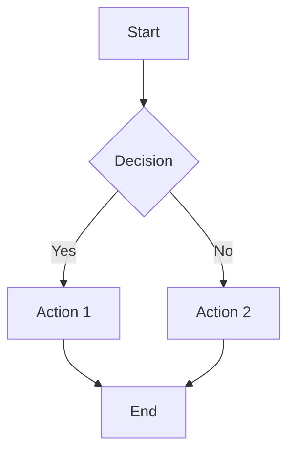

**Code:**
```markdown

```

## Process Flow Diagrams

### Cognitive Bias Formation Process

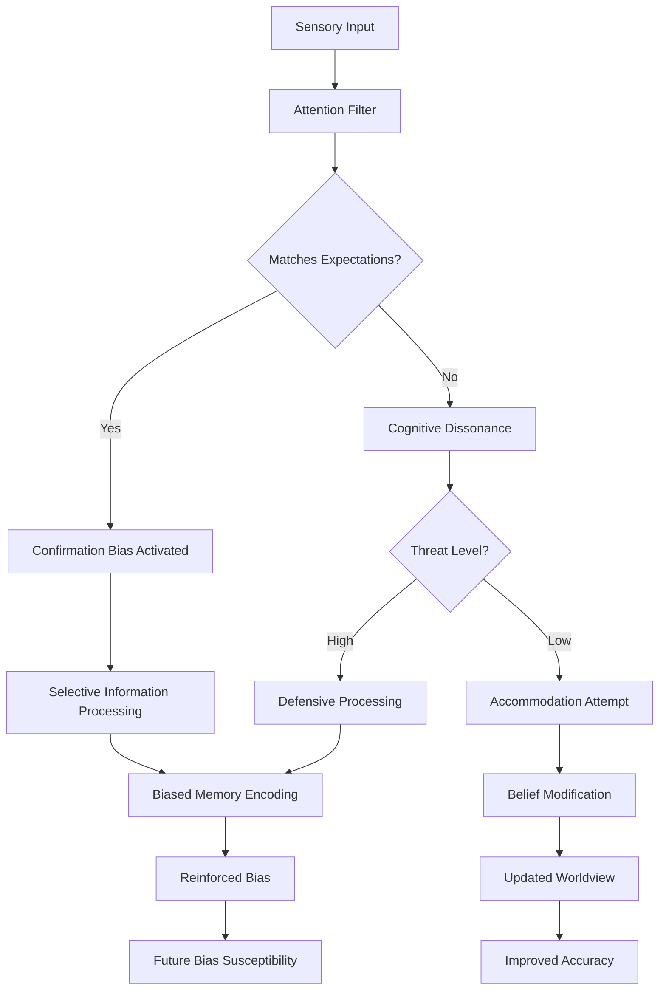

**Use Case**: Demonstrates how individual cognitive processes create systematic biases that affect decision-making.

### Group Decision-Making Failure Process

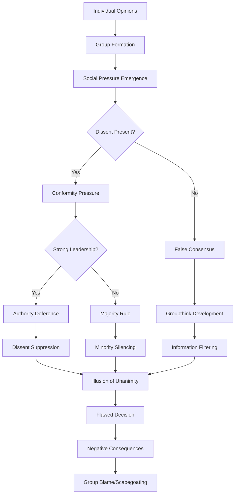

**Use Case**: Shows how individual biases aggregate into group-level dysfunction.

## System Architecture Diagrams

### Multi-Level Human Dysfunction System

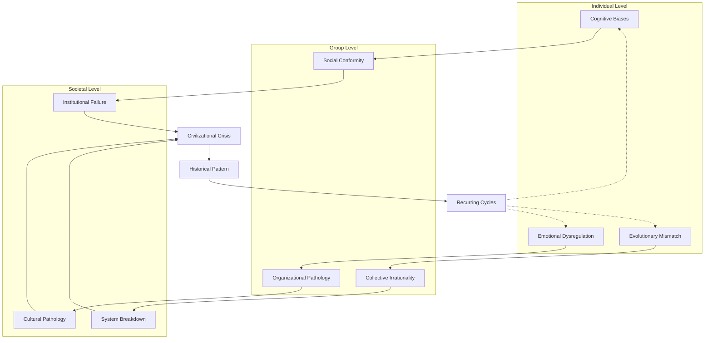

**Use Case**: Illustrates how problems scale across different levels of human organization.

### Feedback Loop Systems

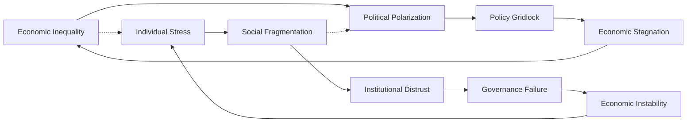

**Use Case**: Shows circular causation patterns that reinforce societal problems.

## Timeline Diagrams

### Evolutionary Psychology Timeline

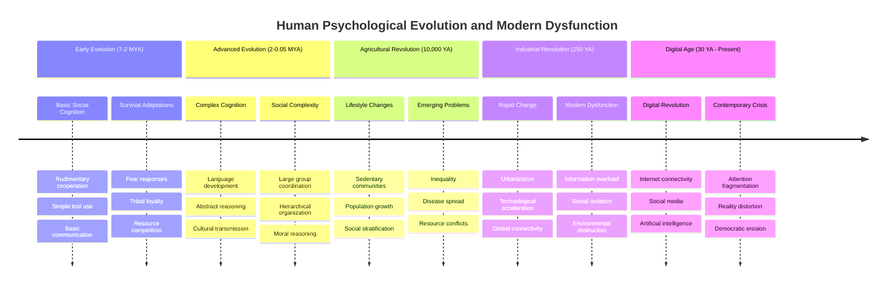

**Use Case**: Shows how evolutionary adaptations become maladaptive in modern contexts.

### Civilizational Collapse Pattern

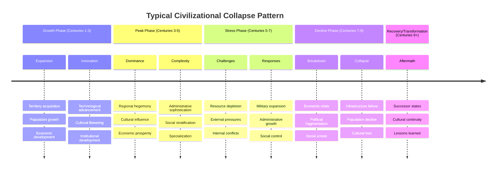

**Use Case**: Illustrates recurring patterns in civilizational rise and fall.

## Network Diagrams

### Interdisciplinary Knowledge Network

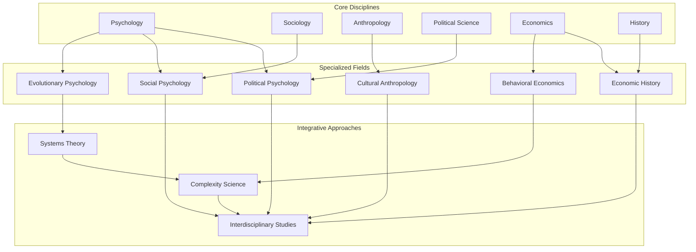

**Use Case**: Shows how different academic disciplines contribute to understanding human problems.

### Cross-Reference Relationship Map

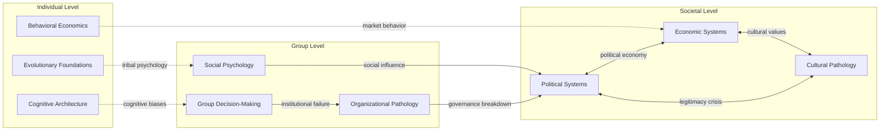

**Use Case**: Visualizes conceptual connections between different documents in the system.

## State Diagrams

### Democratic Backsliding Process

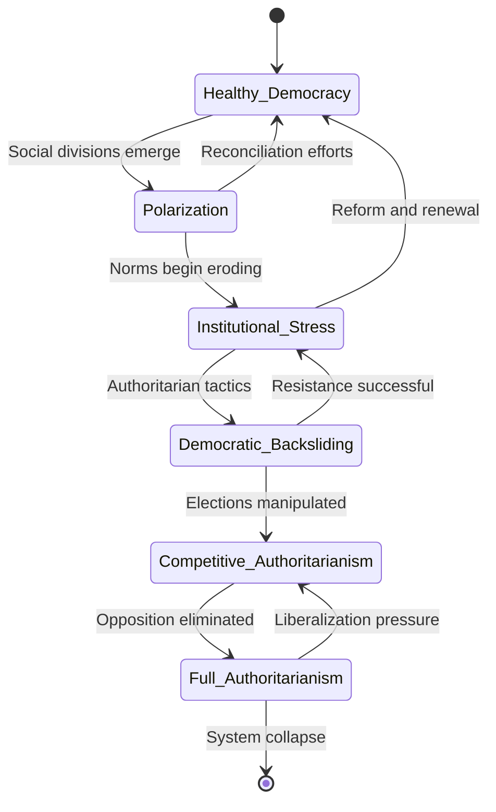

**Use Case**: Shows how democratic systems can deteriorate through identifiable stages.

## Gantt Charts for Project Planning

### Documentation System Development

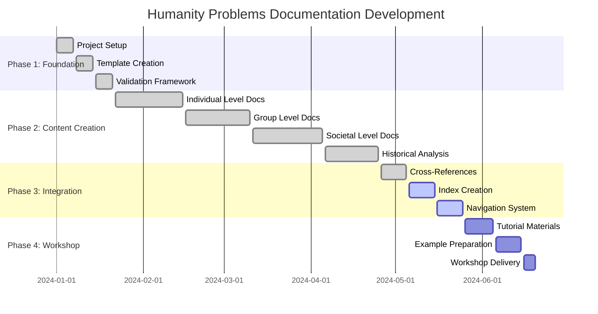

**Use Case**: Project management and timeline visualization for complex documentation projects.

## Best Practices for Mermaid Diagrams

### Design Principles

1. **Clarity Over Complexity**
   - Keep diagrams focused on key relationships
   - Avoid overcrowding with too many elements
   - Use clear, descriptive labels

2. **Consistent Styling**
   - Use consistent shapes for similar concepts
   - Maintain uniform color schemes
   - Apply consistent arrow styles

3. **Logical Flow**
   - Design for natural reading patterns (left-to-right, top-to-bottom)
   - Group related elements together
   - Use subgraphs for organization

### Technical Tips

1. **Node Naming**
   ```mermaid
   flowchart TD
       A[Clear Label] --> B[Another Clear Label]
       C{Decision Point} --> D((Process))
   ```

2. **Subgraph Organization**
   ```mermaid
   graph TD
       subgraph "Category 1"
           A[Item 1]
           B[Item 2]
       end
       
       subgraph "Category 2"
           C[Item 3]
           D[Item 4]
       end
   ```

3. **Link Styling**
   ```mermaid
   graph LR
       A --> B
       A -.-> C
       A ==> D
       A -->|"labeled"| E
   ```

## Exercise: Create Your Own Diagram

**Challenge**: Create a Mermaid diagram showing how a specific individual-level problem (e.g., confirmation bias, status anxiety, loss aversion) scales up to create group and societal-level dysfunction.

**Requirements**:
1. Use at least three different node types (rectangles, diamonds, circles)
2. Include subgraphs for different levels of analysis
3. Show both direct causation (solid arrows) and feedback loops (dotted arrows)
4. Include descriptive labels on key connections
5. Use consistent styling throughout

**Template**:
```markdown
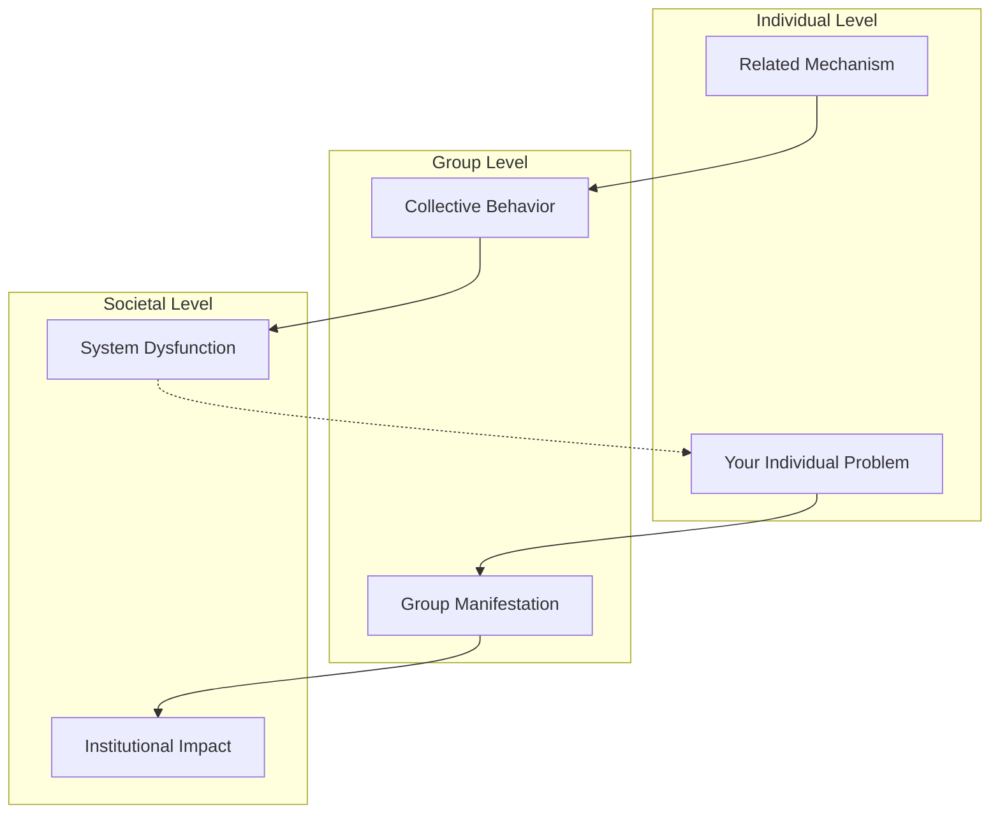
```

## Advanced Mermaid Features

### Custom Styling

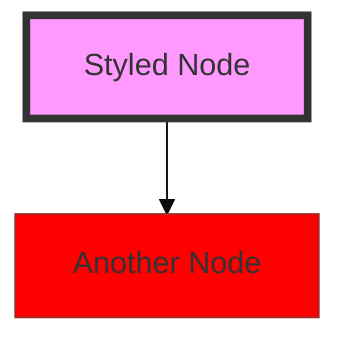

### Interactive Elements

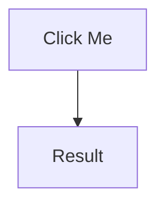

### Complex Relationships

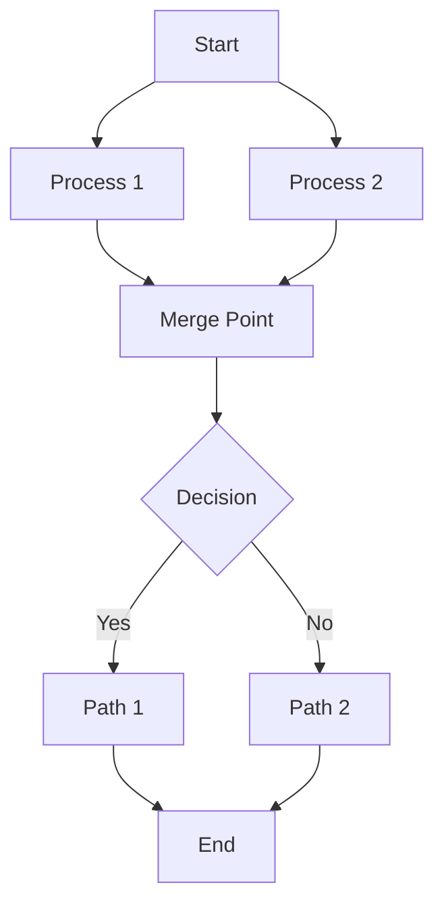

---

**Next**: [Cross-Reference Guide](cross-reference-guide.md) | **Previous**: [Table Design Tutorial](table-design-tutorial.md)