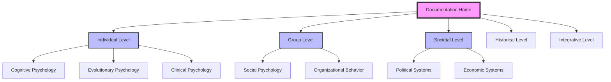
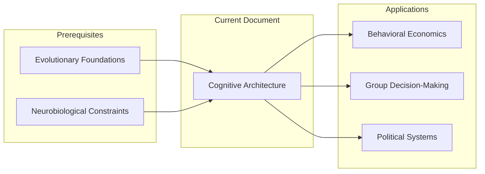

# Navigation Design Patterns for Complex Documentation

## Introduction

Effective navigation architecture is crucial for large-scale documentation systems. This guide demonstrates navigation design patterns using the Humanity's Fundamental Problems documentation system as a comprehensive example.

## Navigation Architecture Principles

### 1. Hierarchical Organization
Structure content in logical levels that reflect conceptual relationships.

```
Documentation System
├── Individual Level Analysis
│   ├── Cognitive Psychology
│   ├── Evolutionary Psychology  
│   └── Clinical Psychology
├── Group Level Analysis
│   ├── Social Psychology
│   ├── Organizational Behavior
│   └── Collective Dynamics
├── Societal Level Analysis
│   ├── Political Systems
│   ├── Economic Systems
│   └── Cultural Systems
└── Integrative Analysis
    ├── Systems Theory
    ├── Complexity Science
    └── Cross-Level Integration
```

### 2. Multiple Access Patterns
Provide different navigation pathways for different user needs and mental models.

**By Academic Discipline**:
- Psychology → Sociology → Political Science → History
- Neuroscience → Cognitive Science → Behavioral Economics
- Anthropology → Cultural Studies → Religious Studies

**By Problem Type**:
- Cognitive Dysfunction → Social Dysfunction → System Dysfunction
- Individual Pathology → Group Pathology → Institutional Pathology
- Psychological Mechanisms → Social Processes → Historical Patterns

**By Analytical Level**:
- Individual → Group → Societal → Historical → Integrative

### 3. Contextual Wayfinding
Help users understand their current location and available options.

## Navigation Components

### 1. Master Index System

**Comprehensive Overview**:
```markdown
# Master Index: Humanity's Fundamental Problems Documentation System

## Quick Navigation
- [Topic-Based Index](topic-index.md) - Browse by specific problems
- [Discipline-Based Index](discipline-index.md) - Navigate by academic field  
- [Level-Based Index](level-index.md) - Explore by scale of analysis
- [Cross-Reference Map](cross-reference-map.md) - Follow conceptual connections

## Document Categories
[Detailed category listings with descriptions and cross-references]
```

### 2. Breadcrumb Navigation

**Implementation Example**:
```markdown
**Navigation**: [Home](../README.md) > [Individual Level](../individual/README.md) > [Cognitive Psychology](cognitive-architecture.md)

# Cognitive Architecture: Systematic Biases and Reasoning Limitations

[Document content...]

---
**Related Documents**: 
- **Previous**: [Evolutionary Foundations](evolutionary-foundations.md)
- **Next**: [Neurobiological Constraints](neurobiological-constraints.md)
- **Up**: [Individual Level Overview](../individual/README.md)
```

### 3. Contextual Sidebars

**Section Navigation**:
```markdown
## Table of Contents
1. [Introduction](#introduction)
2. [Theoretical Framework](#theoretical-framework)
3. [Core Mechanisms](#core-mechanisms)
   - 3.1 [Confirmation Bias](#confirmation-bias)
   - 3.2 [Availability Heuristic](#availability-heuristic)
   - 3.3 [Anchoring Effects](#anchoring-effects)
4. [Contemporary Applications](#contemporary-applications)
5. [Cross-Level Implications](#cross-level-implications)

## Related Reading
- [Behavioral Economics](../individual/behavioral-economics.md)
- [Group Decision-Making](../group/group-decision-making-failures.md)
- [Political Psychology](../societal/political-systems-failure.md)

## Quick Links
- [Glossary](../appendix/glossary.md)
- [Bibliography](../appendix/bibliography.md)
- [Index](../index/master-index.md)
```

### 4. Cross-Reference Networks

**Relationship Visualization**:
```markdown
## Conceptual Connections

### Direct Relationships
- **Causes**: [Evolutionary Foundations](../individual/evolutionary-foundations.md) → Cognitive Architecture
- **Effects**: Cognitive Architecture → [Group Decision-Making](../group/group-decision-making-failures.md)
- **Parallels**: [Organizational Pathology](../group/organizational-pathology.md) ↔ Cognitive Architecture

### Thematic Networks
- **Bias and Irrationality**: [Behavioral Economics](../individual/behavioral-economics.md), [Political Psychology](../societal/political-systems-failure.md)
- **Systems Dysfunction**: [Group Dynamics](../group/social-psychology.md), [Institutional Failure](../societal/organizational-pathology.md)
- **Historical Patterns**: [Recurring Crises](../historical/recurring-crises.md), [Civilizational Collapse](../historical/civilizational-collapse.md)
```

## Advanced Navigation Patterns

### 1. Learning Pathways

**Guided Sequences for Different Audiences**:

```markdown
## Learning Pathways

### For Psychology Students
1. **Foundation**: [Cognitive Architecture](../individual/cognitive-architecture.md)
2. **Application**: [Behavioral Economics](../individual/behavioral-economics.md)  
3. **Social Context**: [Social Psychology](../group/social-psychology.md)
4. **Integration**: [Cross-Level Integration](../integrative/cross-level-integration.md)

### For Political Scientists  
1. **Foundation**: [Political Systems Failure](../societal/political-systems-failure.md)
2. **Psychological Basis**: [Group Decision-Making](../group/group-decision-making-failures.md)
3. **Historical Context**: [Recurring Crises](../historical/recurring-crises.md)
4. **Systems Analysis**: [Systems Theory Perspective](../integrative/systems-theory-perspective.md)

### For Historians
1. **Foundation**: [Civilizational Collapse](../historical/civilizational-collapse.md)
2. **Pattern Recognition**: [Recurring Crises](../historical/recurring-crises.md)
3. **Psychological Mechanisms**: [Evolutionary Foundations](../individual/evolutionary-foundations.md)
4. **Contemporary Relevance**: [Future Projections](../integrative/future-projections.md)
```

### 2. Thematic Navigation

**Topic-Centered Organization**:

```markdown
## Navigation by Theme

### Cognitive Dysfunction
- **Individual Level**: [Cognitive Architecture](../individual/cognitive-architecture.md), [Cognitive Biases](../individual/cognitive-biases-heuristics.md)
- **Group Level**: [Group Decision-Making](../group/group-decision-making-failures.md), [Collective Behavior](../group/collective-behavior.md)
- **Societal Level**: [Political Systems](../societal/political-systems-failure.md), [Economic Systems](../societal/economic-system-dysfunction.md)
- **Historical**: [Recurring Crises](../historical/recurring-crises.md), [Civilizational Collapse](../historical/civilizational-collapse.md)

### Power and Hierarchy
- **Individual**: [Power and Dominance](../specialized/power-dominance.md), [Evolutionary Foundations](../individual/evolutionary-foundations.md)
- **Group**: [Organizational Pathology](../group/organizational-pathology.md), [Social Psychology](../group/social-psychology.md)
- **Societal**: [Political Systems](../societal/political-systems-failure.md), [Economic Inequality](../societal/economic-system-dysfunction.md)
- **Historical**: [War and Conflict](../historical/war-and-conflict.md), [Civilizational Collapse](../historical/civilizational-collapse.md)
```

### 3. Progressive Disclosure

**Layered Information Architecture**:

```markdown
## Document Structure: Progressive Complexity

### Level 1: Overview (All Users)
- Executive summary
- Key concepts
- Main conclusions
- Navigation to related content

### Level 2: Analysis (Interested Users)  
- Detailed mechanisms
- Evidence and examples
- Theoretical frameworks
- Cross-disciplinary connections

### Level 3: Technical Detail (Specialists)
- Methodological details
- Statistical analysis
- Comprehensive citations
- Advanced theoretical discussion

### Level 4: Research Integration (Researchers)
- Primary source materials
- Methodological appendices
- Data tables and figures
- Comprehensive bibliography
```

### 4. Adaptive Navigation

**Context-Sensitive Recommendations**:

```markdown
## Smart Navigation Suggestions

### Based on Current Document
*Currently reading: Cognitive Architecture*

**Logical Next Steps**:
- [Behavioral Economics](../individual/behavioral-economics.md) - Economic applications of cognitive biases
- [Group Decision-Making](../group/group-decision-making-failures.md) - How individual biases affect groups

**Deeper Exploration**:
- [Neurobiological Constraints](../individual/neurobiological-constraints.md) - Biological basis of cognitive limitations
- [Cognitive Biases and Heuristics](../individual/cognitive-biases-heuristics.md) - Detailed bias catalog

**Broader Context**:
- [Systems Theory Perspective](../integrative/systems-theory-perspective.md) - Systems view of cognitive dysfunction
- [Historical Applications](../historical/recurring-crises.md) - Cognitive biases in historical context
```

## Navigation Implementation Techniques

### 1. Markdown Navigation Elements

**Table of Contents Generation**:
```markdown
## Table of Contents
- [Introduction](#introduction)
- [Core Concepts](#core-concepts)
  - [Concept A](#concept-a)
  - [Concept B](#concept-b)
- [Applications](#applications)
- [Conclusions](#conclusions)
```

**Cross-Document Linking**:
```markdown
<!-- Relative path linking -->
[Related Document](../category/document.md)

<!-- Anchor linking within documents -->
[Specific Section](document.md#section-name)

<!-- External linking with context -->
[External Resource](https://example.com) - Brief description of relevance
```

**Navigation Footers**:
```markdown
---
**Navigation**: 
- **Previous**: [Document A](document-a.md)
- **Next**: [Document C](document-c.md)  
- **Up**: [Category Overview](../category/README.md)
- **Home**: [Documentation Home](../README.md)

**Related Topics**: [Topic 1](topic1.md) | [Topic 2](topic2.md) | [Topic 3](topic3.md)
```

### 2. Visual Navigation Aids

**Mermaid Navigation Diagrams**:


**Relationship Maps**:


### 3. Search and Discovery

**Tag-Based Navigation**:
```markdown
---
tags: [cognitive-bias, decision-making, psychology, individual-level]
categories: [Individual Psychology, Cognitive Science]
difficulty: intermediate
audience: [psychology-students, researchers, general-academic]
---

# Document Title

[Content...]

## Related by Tags
- **cognitive-bias**: [Behavioral Economics](../individual/behavioral-economics.md), [Group Decision-Making](../group/group-decision-making-failures.md)
- **decision-making**: [Political Systems](../societal/political-systems-failure.md), [Organizational Pathology](../group/organizational-pathology.md)
```

**Faceted Navigation**:
```markdown
## Browse Documentation

### By Discipline
- [Psychology](discipline-index.md#psychology) (15 documents)
- [Sociology](discipline-index.md#sociology) (12 documents)  
- [Political Science](discipline-index.md#political-science) (8 documents)
- [History](discipline-index.md#history) (10 documents)

### By Problem Type
- [Cognitive Dysfunction](topic-index.md#cognitive-dysfunction) (8 documents)
- [Social Dysfunction](topic-index.md#social-dysfunction) (12 documents)
- [System Dysfunction](topic-index.md#system-dysfunction) (15 documents)

### By Difficulty Level
- [Introductory](level-index.md#introductory) (10 documents)
- [Intermediate](level-index.md#intermediate) (20 documents)
- [Advanced](level-index.md#advanced) (15 documents)
```

## Navigation Validation and Testing

### 1. User Journey Mapping

**Common Navigation Paths**:
```markdown
## User Journey Analysis

### Psychology Student Journey
1. **Entry**: Master Index → Individual Level
2. **Foundation**: Cognitive Architecture → Neurobiological Constraints
3. **Application**: Behavioral Economics → Social Psychology
4. **Integration**: Cross-Level Integration
5. **Specialization**: Choose specific research area

### Policy Researcher Journey  
1. **Entry**: Topic Index → Political Systems
2. **Context**: Historical Patterns → Recurring Crises
3. **Mechanisms**: Group Decision-Making → Cognitive Architecture
4. **Solutions**: Future Projections → Systems Theory
5. **Application**: Return to Political Systems with deeper understanding
```

### 2. Navigation Metrics

**Effectiveness Measures**:
```markdown
## Navigation Performance Indicators

### Structural Metrics
- **Link Density**: Average links per document
- **Path Length**: Steps between related concepts
- **Orphan Documents**: Documents with no incoming links
- **Dead Ends**: Documents with no outgoing navigation

### User Experience Metrics
- **Bounce Rate**: Users leaving after single document
- **Session Depth**: Average documents per session
- **Return Patterns**: Most common navigation sequences
- **Search Queries**: What users look for but can't find

### Content Discovery
- **Coverage**: Percentage of documents accessed
- **Popular Paths**: Most frequently used navigation routes
- **Abandoned Journeys**: Where users typically stop
- **Cross-Level Movement**: How often users move between analytical levels
```

### 3. Navigation Maintenance

**Regular Audit Checklist**:
```markdown
## Monthly Navigation Audit

### Link Integrity
- [ ] All internal links functional
- [ ] Cross-references accurate and current
- [ ] Navigation menus up-to-date
- [ ] Breadcrumb paths correct

### Content Organization
- [ ] New documents properly categorized
- [ ] Index pages reflect current content
- [ ] Thematic groupings still logical
- [ ] Learning pathways remain coherent

### User Experience
- [ ] Navigation load times acceptable
- [ ] Mobile navigation functional
- [ ] Search functionality working
- [ ] Accessibility standards met

### Content Quality
- [ ] Navigation descriptions accurate
- [ ] Document summaries current
- [ ] Related content suggestions relevant
- [ ] Progressive disclosure levels appropriate
```

## Exercise: Design a Navigation System

**Challenge**: Design a comprehensive navigation system for a documentation project on a complex topic of your choice.

**Requirements**:
1. **Hierarchical structure** with at least 3 levels
2. **Multiple access patterns** (by topic, by audience, by difficulty)
3. **Cross-reference network** showing document relationships
4. **Learning pathways** for different user types
5. **Progressive disclosure** from overview to technical detail

**Deliverables**:
1. **Site map** showing overall structure
2. **Navigation templates** for different document types
3. **Index pages** for major categories
4. **Cross-reference standards** and examples
5. **User journey maps** for primary audiences

**Template Structure**:
```markdown
## Navigation System Design

### 1. Information Architecture
[Hierarchical structure diagram]

### 2. Access Patterns
[Multiple navigation approaches]

### 3. Navigation Components
[Specific implementation elements]

### 4. User Pathways
[Guided sequences for different audiences]

### 5. Maintenance Plan
[How to keep navigation current and effective]
```

## Best Practices Summary

### Design Principles
- ✅ Provide multiple ways to find the same information
- ✅ Make current location and available options clear
- ✅ Design for both browsing and goal-directed navigation
- ✅ Maintain consistency across navigation elements
- ✅ Support both novice and expert users

### Technical Implementation
- ✅ Use descriptive link text and hover information
- ✅ Implement breadcrumb navigation for deep hierarchies
- ✅ Provide search functionality for large document sets
- ✅ Ensure navigation works on mobile devices
- ✅ Test navigation paths with real users

### Content Strategy
- ✅ Create clear information hierarchies
- ✅ Group related content logically
- ✅ Provide context for navigation choices
- ✅ Update navigation when content changes
- ✅ Monitor and optimize based on usage patterns

---

**Previous**: [Citation Guide](citation-guide.md) | **Back to Workshop**: [Workshop Overview](README.md)