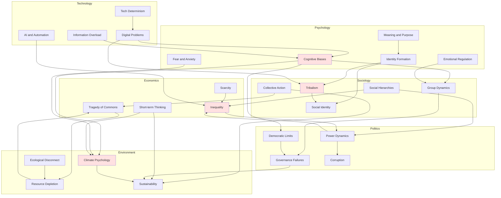

# Interconnections Map: Cross-Domain Relationships

## Overview

This document maps the interconnections between problems across all domains, revealing how humanity's challenges form an integrated system rather than isolated issues. Understanding these connections is essential for addressing problems effectively, as interventions in one area inevitably affect others.

## Visualization of Major Connections

**Diagram Explanation**: This graph shows major connections between problems across domains. Cognitive biases affect group dynamics, climate psychology, and democratic function. Identity formation drives tribalism and social identity. Social hierarchies produce inequality and power concentration. Collective action problems underlie tragedy of commons and sustainability challenges. Technology amplifies cognitive biases and tribalism. The interconnections form a complex system where changes in one area ripple throughout.

## Cross-Reference Matrix

| From → To | Psychology | Sociology | Economics | Politics | Environment | Technology |
|-----------|------------|-----------|-----------|----------|-------------|------------|
| **Psychology** | Internal dynamics | Aggregates to group behavior | Biases distort markets | Affects voting, polarization | Impedes climate action | Exploited by tech |
| **Sociology** | Shapes individual psychology | Group-level dynamics | Social factors in economics | Collective political behavior | Social barriers to sustainability | Social media dynamics |
| **Economics** | Incentives shape behavior | Economic stratification | Market dynamics | Economic power → political power | Economic drivers of degradation | Economic impacts of tech |
| **Politics** | Political identity | Power structures | Policy affects economy | Political dynamics | Environmental policy | Tech regulation |
| **Environment** | Psychological distance | Social responses to scarcity | Resource economics | Environmental politics | Environmental systems | Tech solutions/problems |
| **Technology** | Cognitive impacts | Social media effects | Automation economics | Digital governance | Environmental tech | Tech evolution |

## Key Interconnection Patterns

### Pattern 1: Psychological → Social → Political

Individual cognitive biases and emotional patterns aggregate into social phenomena (groupthink, polarization), which shape political behavior and outcomes.

**Example Chain**:
- Confirmation bias (psychology)
- → Echo chambers (sociology)
- → Political polarization (politics)
- → Governance gridlock (politics)
- → Problems unaddressed (all domains)

### Pattern 2: Economic → Political → Social

Economic inequality produces political power concentration, which shapes policies to favor elites, increasing inequality and social division.

**Example Chain**:
- Wealth concentration (economics)
- → Political influence (politics)
- → Policies favoring wealthy (politics)
- → Increased inequality (economics)
- → Social fragmentation (sociology)

### Pattern 3: Environmental → Economic → Political → Social

Environmental degradation creates resource scarcity, increasing economic competition, producing political conflict, and fragmenting society.

**Example Chain**:
- Climate change (environment)
- → Agricultural disruption (environment)
- → Resource scarcity (economics)
- → Increased competition (economics)
- → Political conflict (politics)
- → Mass migration (sociology)
- → Social instability (sociology)

### Pattern 4: Technological → Psychological → Social → Political

Technology exploits psychological vulnerabilities, producing individual dysfunction that aggregates into social problems and political dysfunction.

**Example Chain**:
- Attention economy (technology)
- → Addiction and distraction (psychology)
- → Reduced civic engagement (sociology)
- → Democratic dysfunction (politics)
- → Poor governance (politics)

## Feedback Loops

### Reinforcing Loops (Vicious Cycles)

1. **Inequality-Power Loop**: Inequality → Power → Policies → More inequality
2. **Polarization Spiral**: Tribalism → Selective info → Confirmation → More tribalism
3. **Environmental Degradation**: Exploitation → Damage → Scarcity → Conflict → Weak institutions → More exploitation
4. **Attention Economy**: Tech design → Addiction → Engagement → More addictive design
5. **Status Competition**: Inequality → Status anxiety → Consumption → More inequality

### Balancing Loops (Potential Stabilizers)

1. **Democratic Feedback**: Problems → Voter pressure → Policy change → Problem reduction
2. **Market Correction**: Scarcity → Price increase → Reduced consumption → Conservation
3. **Social Learning**: Crisis → Awareness → Behavior change → Problem mitigation
4. **Institutional Adaptation**: Dysfunction → Reform pressure → Institutional change → Improved function

**Challenge**: Reinforcing loops often stronger than balancing loops, producing runaway dynamics.

## Domain-Specific Connection Details

### Psychology Connections

**Outgoing**:
- Cognitive biases → Group dynamics, Political polarization, Climate inaction, Market failures
- Emotional regulation → Violence, Relationship problems, Political extremism
- Identity formation → Tribalism, Nationalism, Religious conflict
- Fear and anxiety → Risk perception, Political manipulation, Avoidance behavior
- Meaning and purpose → Religious belief, Ideological commitment, Identity formation

**Incoming**:
- Social influence → Belief formation, Behavior change
- Economic conditions → Stress, Mental health, Values
- Political environment → Identity, Anxiety, Engagement
- Environmental conditions → Wellbeing, Anxiety
- Technology → Attention, Addiction, Social comparison

### Sociology Connections

**Outgoing**:
- Group dynamics → Political movements, Economic behavior, Collective action
- Social hierarchies → Inequality, Power structures, Status competition
- Tribalism → Conflict, Polarization, Discrimination
- Collective action problems → Environmental degradation, Public goods failures
- Social identity → Political behavior, Intergroup conflict

**Incoming**:
- Individual psychology → Group behavior
- Economic systems → Social stratification
- Political structures → Social organization
- Environmental conditions → Social responses
- Technology → Social interaction patterns

### Economics Connections

**Outgoing**:
- Scarcity → Competition, Conflict, Innovation
- Inequality → Political power, Social division, Health disparities
- Tragedy of commons → Environmental degradation, Resource depletion
- Short-term thinking → Unsustainability, Inadequate investment

**Incoming**:
- Psychological biases → Market failures
- Social structures → Economic organization
- Political policies → Economic outcomes
- Environmental limits → Economic constraints
- Technology → Economic disruption

### Politics Connections

**Outgoing**:
- Power dynamics → Inequality, Corruption, Conflict
- Governance failures → Unaddressed problems, Instability
- Corruption → Inefficiency, Inequality, Distrust
- Democratic limitations → Suboptimal policies, Polarization

**Incoming**:
- Psychological factors → Voting behavior
- Social movements → Political change
- Economic power → Political influence
- Environmental crises → Political pressure
- Technology → New governance challenges

### Environment Connections

**Outgoing**:
- Ecological disconnect → Continued degradation
- Resource depletion → Scarcity, Conflict
- Climate change → Migration, Conflict, Economic disruption
- Sustainability challenges → Long-term risks

**Incoming**:
- Psychological distance → Inaction
- Social norms → Consumption patterns
- Economic incentives → Exploitation
- Political policies → Environmental outcomes
- Technology → Environmental impacts

### Technology Connections

**Outgoing**:
- Technological determinism → Social change
- Digital problems → Mental health, Polarization
- AI and automation → Unemployment, Inequality
- Information overload → Cognitive strain, Poor decisions

**Incoming**:
- Psychological vulnerabilities → Exploitation
- Social dynamics → Technology adoption
- Economic incentives → Technology development
- Political regulation → Technology constraints
- Environmental needs → Green technology

## Implications for Intervention

### Systems Thinking Required

Effective intervention requires:
- Understanding interconnections
- Anticipating ripple effects
- Addressing root causes, not symptoms
- Coordinating across domains
- Targeting leverage points

### Unintended Consequences

Interventions often produce unexpected effects:
- Solving one problem worsens another
- Short-term fixes create long-term problems
- Local solutions create global problems
- Technical fixes ignore social dimensions

### Coordination Challenges

Interconnections create coordination requirements:
- Multiple stakeholders must align
- Different timescales must be reconciled
- Competing interests must be balanced
- Global cooperation needed for global problems

## Conclusion

Humanity's problems form an interconnected system. No problem exists in isolation; all are embedded in webs of causation spanning psychology, sociology, economics, politics, environment, and technology. This interconnection makes problems difficult to solve but also reveals potential leverage points where interventions can have cascading positive effects.

Understanding these connections is the first step toward effective action.

## Related Documents

- [Fundamental Patterns](./synthesis/fundamental-patterns.md)
- [Systemic Interconnections](./synthesis/systemic-interconnections.md)
- [Future Trajectories](./synthesis/future-trajectories.md)
- [Master Index](./README.md)

---

**Navigation**: [Return to Main Index](./README.md)
