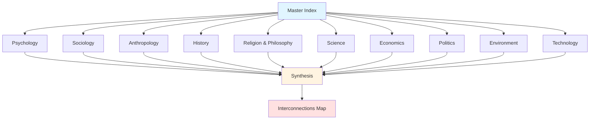

# Humanity's Underlying Problems: A Comprehensive Analysis

## Overview

This documentation system provides a comprehensive, interdisciplinary analysis of the fundamental problems facing humanity. Rather than examining surface-level symptoms, this work explores the **intrinsic psychological, social, and systemic mechanisms** that have plagued human individuals, groups, and societies throughout history and continue to shape our present and future.

The analysis spans ten major domains of human experience, synthesizing insights from psychology, sociology, anthropology, history, religion, philosophy, science, economics, politics, environmental studies, and technology. Each domain reveals patterns that, when understood together, illuminate the deep structural challenges inherent to human nature and social organization.

## Purpose

This documentation serves dual purposes:

1. **Substantive Analysis**: Providing rigorous, evidence-based examination of humanity's core challenges
2. **Educational Resource**: Demonstrating comprehensive markdown documentation practices for technical writers and developers

## How to Use This Documentation

- **Start with the Master Index** (below) to navigate to areas of interest
- **Follow Cross-References** between topics to understand interconnections
- **Consult the Interconnections Document** for systemic patterns
- **Explore Synthesis Documents** for overarching insights

## Documentation Structure

**Diagram Explanation**: This graph shows the hierarchical structure of the documentation. The Master Index (this document) provides entry points to ten major domain categories. Each category contains detailed analyses of specific problems. All domains feed into synthesis documents that identify cross-cutting patterns, which are mapped in the comprehensive Interconnections document.

## Navigation by Category

| Category | Focus | Key Topics | Link |
|----------|-------|------------|------|
| **Psychology** | Individual mental processes and behaviors | Cognitive biases, emotional regulation, identity, fear, meaning | [Explore →](./psychology/INDEX.md) |
| **Sociology** | Group dynamics and social structures | Group behavior, hierarchies, tribalism, collective action | [Explore →](./sociology/INDEX.md) |
| **Anthropology** | Cultural patterns across humanity | Cultural evolution, ritual, kinship, relativism | [Explore →](./anthropology/INDEX.md) |
| **History** | Temporal patterns and cycles | Historical cycles, violence, civilizational collapse, amnesia | [Explore →](./history/INDEX.md) |
| **Religion & Philosophy** | Existential and moral dimensions | Existential questions, moral frameworks, religious conflict, meaning crisis | [Explore →](./religion-philosophy/INDEX.md) |
| **Science** | Scientific understanding of human nature | Evolutionary psychology, neuroscience, scientific limits, reductionism | [Explore →](./science/INDEX.md) |
| **Economics** | Resource allocation and competition | Scarcity, inequality, tragedy of commons, short-term thinking | [Explore →](./economics/INDEX.md) |
| **Politics** | Power and governance | Power dynamics, governance failures, corruption, democratic limits | [Explore →](./politics/INDEX.md) |
| **Environment** | Human-nature relationships | Ecological disconnect, resource depletion, climate psychology | [Explore →](./environment/INDEX.md) |
| **Technology** | Technological impacts on humanity | Technological determinism, digital age problems, AI, information overload | [Explore →](./technology/INDEX.md) |

## Special Documents

- **[Interconnections Map](./INTERCONNECTIONS.md)**: Comprehensive visualization of how problems across domains connect and reinforce each other
- **[Fundamental Patterns](./synthesis/fundamental-patterns.md)**: Core patterns that appear across all domains
- **[Systemic Interconnections](./synthesis/systemic-interconnections.md)**: Analysis of feedback loops and emergent properties
- **[Future Trajectories](./synthesis/future-trajectories.md)**: Potential future scenarios based on current patterns

## Core Themes

Across all domains, several fundamental themes emerge:

1. **Evolutionary Mismatch**: Human psychology evolved for small-group hunter-gatherer societies but now operates in vastly different contexts
2. **Cognitive Limitations**: Systematic biases and heuristics that served survival but impede rational decision-making
3. **Social Complexity**: Challenges of coordinating large groups with competing interests
4. **Temporal Discounting**: Prioritization of immediate over long-term consequences
5. **Tribalism**: Deep-seated in-group/out-group dynamics that fuel conflict
6. **Power Dynamics**: Universal patterns of dominance, hierarchy, and resource control
7. **Meaning-Making**: Existential needs that drive behavior and belief systems
8. **Systemic Feedback**: Self-reinforcing cycles that amplify problems
9. **Technological Acceleration**: Rapid change outpacing adaptive capacity
10. **Collective Action Failures**: Inability to coordinate for common good

## Methodology

This analysis employs:

- **Interdisciplinary Integration**: Synthesizing insights across multiple fields
- **Root Cause Analysis**: Identifying underlying mechanisms rather than symptoms
- **Historical Perspective**: Examining patterns across time and cultures
- **Systems Thinking**: Understanding interconnections and feedback loops
- **Evidence-Based Approach**: Grounding analysis in research and data
- **Critical Examination**: Questioning assumptions and acknowledging complexity

## Acknowledgment of Complexity

Human problems are inherently complex, multifaceted, and context-dependent. This documentation:

- Acknowledges multiple perspectives and interpretations
- Recognizes the limitations of any single analytical framework
- Avoids oversimplification while seeking clarity
- Presents patterns without claiming determinism
- Encourages critical engagement with the material

## For Workshop Participants

This documentation demonstrates:

- ✅ Hierarchical organization with master index and category indices
- ✅ Extensive use of markdown features (headers, lists, tables, links, formatting)
- ✅ Mermaid diagrams for visualizations
- ✅ Cross-referencing between related topics
- ✅ Consistent formatting and structure
- ✅ Metadata and navigation aids
- ✅ Integration of text, data, and visual elements

You will develop validation scripts to verify:
- Link integrity
- Markdown syntax validity
- Mermaid diagram correctness
- Table structure
- Header hierarchy
- Cross-reference bidirectionality
- Coverage completeness
- Documentation quality

## Getting Started

1. **Browse by Interest**: Use the navigation table above to explore specific domains
2. **Follow Connections**: Use cross-references to discover related topics
3. **Seek Patterns**: Consult synthesis documents for overarching insights
4. **Think Systemically**: Use the interconnections map to understand relationships

## Contributing and Validation

Workshop participants will:
- Analyze the documentation structure
- Develop validation tools
- Test markdown syntax and features
- Verify cross-references and links
- Assess coverage and completeness
- Create automated quality checks

---

**Note**: This documentation represents a comprehensive analytical framework. It is designed to provoke thought, encourage critical examination, and provide a foundation for understanding humanity's challenges. Engage with it critically and use it as a starting point for deeper exploration.

**Last Updated**: 2026-02-02
