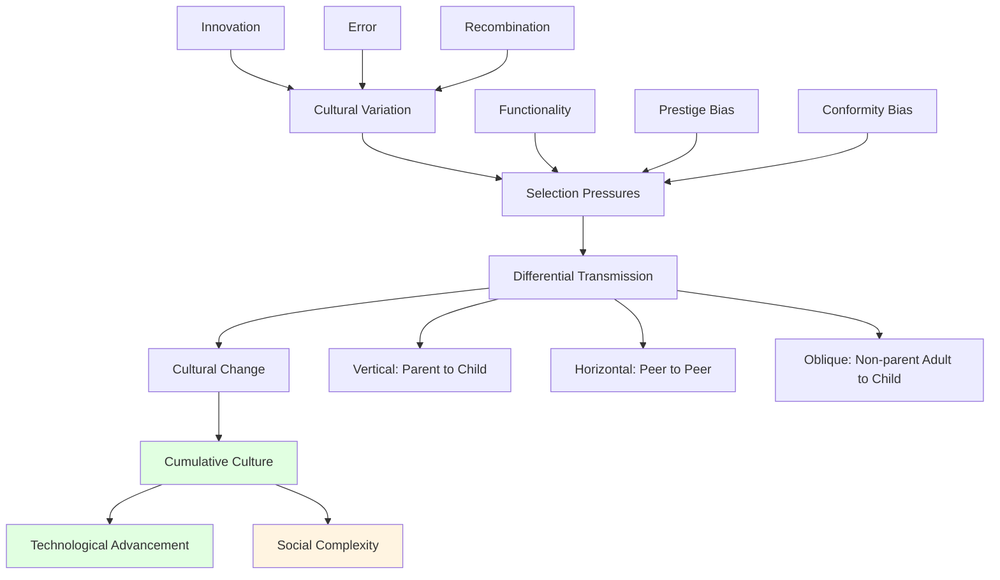

# Cultural Evolution: The Transmission of Ideas Across Generations

## Overview

Cultural evolution refers to the change in cultural traits—beliefs, practices, technologies, institutions—over time through processes of variation, selection, and transmission. Unlike biological evolution which operates through genes, cultural evolution operates through memes (units of cultural information) transmitted through learning, imitation, and communication.

**The key insight**: Culture evolves much faster than genes, enabling rapid adaptation to changing environments. But this speed also creates problems: cultural evolution can outpace our ability to adapt, producing mismatches between evolved psychology and cultural environments.

## Mechanisms of Cultural Evolution

**Diagram Explanation**: Cultural evolution involves variation (through innovation, error, recombination), selection (based on functionality, prestige, conformity), and transmission (vertical, horizontal, oblique). This produces cultural change and enables cumulative culture—the ratcheting up of complexity over generations—leading to technological advancement and social complexity.

## Cultural Transmission Biases

| Bias Type | Description | Function | Problem |
|-----------|-------------|----------|---------|
| **Content Bias** | Preferring certain content | Adaptive information selection | Maladaptive content can spread |
| **Frequency Bias** | Copying common variants | Safety in numbers | Conformity to suboptimal practices |
| **Prestige Bias** | Copying high-status individuals | Learning from successful | Status ≠ wisdom |
| **Success Bias** | Copying successful individuals | Direct fitness benefit | Correlation ≠ causation |

## Problems of Cultural Evolution

### Evolutionary Mismatch

Modern cultural environments differ radically from ancestral environments:
- **Diet**: Evolved for scarcity, living in abundance
- **Social**: Evolved for small groups, living in mass societies
- **Information**: Evolved for limited information, drowning in data
- **Technology**: Evolved for stone tools, wielding nuclear weapons

### Maladaptive Cultural Traits

Not all cultural evolution is adaptive:
- **Harmful practices**: Female genital mutilation, honor killings
- **Superstitions**: Persist despite lack of efficacy
- **Destructive technologies**: Nuclear weapons, fossil fuels
- **Unsustainable practices**: Overconsumption, environmental destruction

## Interconnections

This problem connects to:

- **[Evolutionary Psychology](../science/evolutionary-psychology.md)**: Gene-culture coevolution
- **[Ritual and Tradition](./ritual-and-tradition.md)**: Cultural transmission mechanisms
- **[Technological Change](../technology/technological-determinism.md)**: Rapid cultural evolution
- **[Historical Patterns](../history/cyclical-patterns.md)**: Cultural evolution drives history

## Related Topics

- [Ritual and Tradition](./ritual-and-tradition.md)
- [Kinship Systems](./kinship-systems.md)
- [Evolutionary Psychology](../science/evolutionary-psychology.md)

---

**Navigation**: [← Back to Anthropology Index](./INDEX.md) | [Next: Ritual and Tradition →](./ritual-and-tradition.md)
