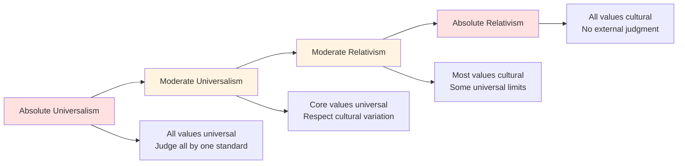

# Cultural Relativism: Universal Values vs. Cultural Specificity

## Overview

Cultural relativism is the principle that beliefs and practices should be understood within their cultural context rather than judged by external standards. It emerged as anthropology's response to ethnocentrism—the tendency to view one's own culture as superior and judge others by its standards.

**The tension**: Cultural relativism provides valuable perspective, preventing arrogant imposition of one culture's values on others. But taken to extremes, it can prevent moral judgment of harmful practices. How do we balance cultural respect with universal human rights?

## The Relativism Spectrum

**Diagram Explanation**: The relativism spectrum ranges from absolute universalism (all values apply everywhere) to absolute relativism (no cross-cultural judgments possible). Most scholars occupy the moderate positions, recognizing both cultural variation and some universal values. The extremes are problematic: absolute universalism enables cultural imperialism; absolute relativism prevents criticism of harmful practices.

## Universal vs. Cultural

### Likely Universals

Evidence suggests some values are universal:
- Prohibition of arbitrary killing within group
- Reciprocity norms
- Care for children
- Incest taboos
- Property concepts
- Truth-telling norms

### Cultural Variations

Many practices vary dramatically:
- Gender roles and relations
- Sexual norms and practices
- Economic systems
- Political organization
- Religious beliefs
- Dietary practices

## The Relativism Dilemma

### Arguments For Relativism

- **Humility**: Recognizing our own cultural biases
- **Respect**: Honoring cultural autonomy
- **Complexity**: Understanding context before judging
- **Anti-imperialism**: Resisting cultural domination

### Arguments Against Relativism

- **Human rights**: Some practices violate basic dignity
- **Internal dissent**: Cultures aren't monolithic
- **Power**: Relativism can protect oppression
- **Moral paralysis**: Inability to condemn atrocities

## Problematic Practices

How to evaluate harmful cultural practices?

| Practice | Cultural Justification | Universal Concern | Resolution? |
|----------|----------------------|-------------------|-------------|
| **Female Genital Mutilation** | Tradition, purity, marriageability | Bodily harm, consent | Increasingly condemned |
| **Honor Killings** | Family honor, social order | Murder, gender inequality | Illegal but persists |
| **Child Marriage** | Economic, traditional | Consent, development | Declining but common |
| **Caste Discrimination** | Religious, social order | Equality, dignity | Legally banned, socially persistent |

## Contemporary Debates

### Multiculturalism

Balancing cultural diversity with shared values:
- **Integration vs. assimilation**: How much adaptation required?
- **Tolerance limits**: What practices are intolerable?
- **Minority rights**: Protecting cultural practices vs. individual rights
- **Shared citizenship**: Common values in diverse societies

### Global Human Rights

Universal Declaration of Human Rights claims universality, but:
- Accused of Western bias
- Tension with cultural practices
- Enforcement challenges
- Sovereignty concerns

## Interconnections

This problem connects to:

- **[Moral Frameworks](../religion-philosophy/moral-frameworks.md)**: Ethical systems across cultures
- **[Cultural Evolution](./cultural-evolution.md)**: How values change
- **[Religious Conflict](../religion-philosophy/religious-conflict.md)**: Competing value systems
- **[Political Systems](../politics/governance-failures.md)**: Cultural values and governance

## Related Topics

- [Moral Frameworks](../religion-philosophy/moral-frameworks.md)
- [Cultural Evolution](./cultural-evolution.md)
- [Religious Conflict](../religion-philosophy/religious-conflict.md)

---

**Navigation**: [← Back to Anthropology Index](./INDEX.md) | [Next Category: History →](../history/INDEX.md)
