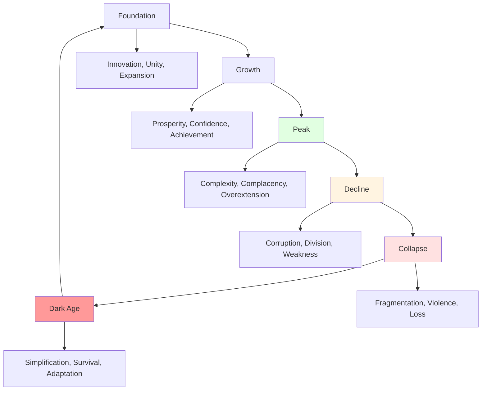

# Cyclical Patterns: History's Recurring Rhythms

## Overview

History exhibits recurring cycles: civilizations rise and fall, periods of order alternate with chaos, economic booms follow busts, political systems oscillate between extremes. These patterns suggest underlying dynamics that transcend specific historical contexts, revealing fundamental features of human social organization.

**The question**: Are these cycles inevitable, or can understanding them enable us to break free? History suggests both: cycles recur because they reflect deep human patterns, yet awareness and institutional design can moderate their effects.

## Types of Historical Cycles

| Cycle Type | Duration | Pattern | Examples |
|------------|----------|---------|----------|
| **Civilizational** | Centuries | Rise → Peak → Decline → Fall | Roman Empire, Han Dynasty, Maya |
| **Political** | Decades-Centuries | Order → Disorder → New Order | Revolutions, regime changes |
| **Economic** | Years-Decades | Boom → Bust → Recovery | Business cycles, financial crises |
| **Generational** | 80-100 years | Crisis → High → Awakening → Unraveling | Strauss-Howe theory |
| **Hegemonic** | Centuries | Rise → Dominance → Decline | British Empire, American hegemony |

## The Civilizational Cycle

**Diagram Explanation**: Civilizations progress through predictable stages. Foundation involves innovation, unity, and expansion. Growth brings prosperity and achievement. Peak represents maximum complexity and confidence but also complacency and overextension. Decline features corruption, division, and weakness. Collapse brings fragmentation and violence. Dark ages force simplification and adaptation, eventually enabling new foundations. Understanding this cycle reveals why civilizations fail despite apparent strength.

## Mechanisms Driving Cycles

### Complexity and Collapse

Joseph Tainter's theory: Civilizations collapse when complexity costs exceed benefits
- Early complexity increases returns (specialization, coordination)
- Eventually diminishing returns set in
- Maintaining complexity becomes unsustainable
- Collapse simplifies system

### Generational Dynamics

Each generation reacts to previous generation:
- Crisis generation builds institutions
- Next generation enjoys stability
- Following generation takes stability for granted
- Final generation undermines institutions
- New crisis forces rebuilding

### Resource Depletion

Civilizations exhaust resources:
- Initial growth exploits abundant resources
- Success leads to population growth
- Resources become scarce
- Competition intensifies
- System destabilizes

## Historical Examples

### Roman Empire

Classic civilizational cycle:
- **Rise** (500 BCE - 100 CE): Expansion, innovation, prosperity
- **Peak** (100-200 CE): Maximum extent, Pax Romana
- **Decline** (200-400 CE): Political instability, economic problems, barbarian pressure
- **Fall** (400-500 CE): Western Empire collapses
- **Dark Ages** (500-1000 CE): Fragmentation, simplification

### Chinese Dynastic Cycle

Recurring pattern across dynasties:
1. New dynasty establishes order
2. Peace and prosperity
3. Population growth
4. Resource pressure
5. Corruption and weakness
6. Rebellion and collapse
7. New dynasty emerges

### Economic Cycles

Recurring boom-bust patterns:
- **Tulip Mania** (1637): Speculation → Bubble → Crash
- **South Sea Bubble** (1720): Same pattern
- **Great Depression** (1929): Same pattern
- **Dot-com Bubble** (2000): Same pattern
- **Financial Crisis** (2008): Same pattern

**Pattern**: Optimism → Speculation → Bubble → Crash → Depression → Recovery

## Breaking the Cycle?

### Institutional Solutions

Can institutions moderate cycles?
- **Central banks**: Smooth economic cycles
- **Democratic institutions**: Prevent political extremes
- **International organizations**: Reduce conflict cycles
- **Environmental regulations**: Prevent resource depletion

**Success**: Partial—cycles moderated but not eliminated

### Learning from History

Awareness of cycles could enable prevention, but:
- Historical amnesia prevents learning
- Each generation believes "this time is different"
- Short-term incentives override long-term thinking
- Complexity makes patterns hard to see

## Interconnections

This problem connects to:

- **[Rise and Fall of Civilizations](./rise-and-fall-civilizations.md)**: Civilizational collapse
- **[Historical Amnesia](./historical-amnesia.md)**: Forgetting enables repetition
- **[Short-term Thinking](../economics/short-term-thinking.md)**: Temporal discounting
- **[Complexity](../synthesis/systemic-interconnections.md)**: System dynamics

## Related Topics

- [Rise and Fall of Civilizations](./rise-and-fall-civilizations.md)
- [Historical Amnesia](./historical-amnesia.md)
- [Violence and Conflict](./violence-and-conflict.md)

---

**Navigation**: [← Back to History Index](./INDEX.md) | [Next: Violence and Conflict →](./violence-and-conflict.md)
