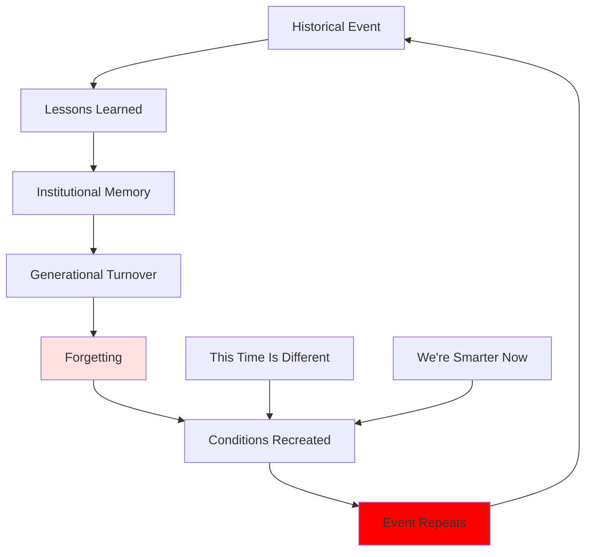

# Historical Amnesia: Collective Forgetting and Repeated Mistakes

## Overview

Historical amnesia—the tendency of societies to forget their own history—is one of humanity's most dangerous problems. Each generation believes its challenges are unprecedented, failing to recognize patterns that have recurred throughout history. This forgetting ensures that mistakes are repeated, lessons unlearned, and preventable disasters occur.

**The paradox**: We have more historical knowledge than ever, yet seem unable to learn from it. Libraries overflow with historical records, yet societies repeat the same errors. Why do we forget, and how can we remember?

## Mechanisms of Forgetting

### Generational Turnover

Direct experience fades with time:
- Those who lived through events die
- Second-hand knowledge is weaker
- Third generation has no living connection
- Fourth generation treats history as abstract

**Pattern**: ~80 years (3-4 generations) for major forgetting

### Motivated Forgetting

Societies actively suppress uncomfortable histories:
- **National myths**: Sanitized versions of past
- **Collective guilt**: Avoiding responsibility
- **Identity protection**: Maintaining positive self-image
- **Political convenience**: Rewriting history for current purposes

### Complexity and Overload

Modern information environment paradoxically enables forgetting:
- Information overload reduces attention to history
- Present-focused media
- Rapid change makes past seem irrelevant
- Complexity makes patterns hard to see

## Consequences of Amnesia

### Repeated Mistakes

**Diagram Explanation**: Historical events produce lessons that become institutional memory. Generational turnover leads to forgetting. Conditions that produced the original event are recreated. The belief that "this time is different" or "we're smarter now" prevents recognition of patterns. The event repeats, restarting the cycle.

### Examples of Repeated Mistakes

| Mistake | Historical Examples | Pattern | Why Repeated |
|---------|-------------------|---------|--------------|
| **Financial Bubbles** | Tulips (1637), South Sea (1720), 1929, 2000, 2008 | Speculation → Bubble → Crash | Greed, "this time is different" |
| **Appeasement** | Munich (1938), various | Concessions to aggressors | Hope, avoiding conflict |
| **Overextension** | Rome, Napoleon, Hitler, USSR | Imperial overreach | Hubris, momentum |
| **Ignoring Warnings** | Pearl Harbor, 9/11, 2008 crisis | Dismissing threat signals | Normalcy bias, complacency |
| **Genocide** | Armenia, Holocaust, Cambodia, Rwanda, Bosnia | Dehumanization → Mass killing | "Never again" forgotten |

## Historical Amnesia in Practice

### Financial Crises

Each generation rediscovers that bubbles burst:
- 1929: "Permanent plateau of prosperity"
- 2000: "New economy, old rules don't apply"
- 2008: "Housing prices always rise"

**Pattern**: Amnesia about previous crashes enables new bubbles

### War

Each generation forgets war's horrors:
- WWI: "War to end all wars"
- 20 years later: WWII
- Pattern continues with smaller conflicts

**Mechanism**: Those who remember war's reality die; new generation romanticizes it

### Authoritarianism

Democracies forget how they can fail:
- Weimar Germany → Nazi regime
- Pattern repeating in various democracies
- Warning signs dismissed as alarmist

**Amnesia**: Forgetting how democracies die enables their erosion

## Combating Amnesia

### Institutional Memory

Preserving lessons through institutions:
- **Education**: Teaching history comprehensively
- **Memorials**: Physical reminders of past
- **Rituals**: Commemorations maintaining memory
- **Documentation**: Recording and preserving records
- **Oral history**: Capturing lived experience

### Challenges

Why institutional memory fails:
- **Politicization**: History becomes propaganda
- **Simplification**: Nuance lost in teaching
- **Irrelevance**: Past seems disconnected from present
- **Overload**: Too much history to remember
- **Resistance**: Uncomfortable truths avoided

## Contemporary Amnesia

### COVID-19 and Pandemic Amnesia

Despite 1918 flu pandemic:
- Unpreparedness for COVID-19
- Resistance to public health measures
- Surprise at pandemic impacts

**Amnesia**: 100 years = complete forgetting

### Climate Change and Environmental Amnesia

Despite historical collapses from environmental degradation:
- Easter Island, Maya, etc.
- Modern society repeating pattern
- Warnings dismissed

**Amnesia**: "Technology will save us" = forgetting limits

### Democratic Backsliding

Despite 20th century authoritarianism:
- Democratic norms eroding
- Authoritarian tactics normalized
- Warning signs dismissed

**Amnesia**: "It can't happen here" = forgetting it can

## Interconnections

This problem connects to:

- **[Cyclical Patterns](./cyclical-patterns.md)**: Amnesia enables cycles
- **[Cognitive Biases](../psychology/cognitive-biases.md)**: Recency bias, optimism bias
- **[Short-term Thinking](../economics/short-term-thinking.md)**: Present bias
- **[Rise and Fall](./rise-and-fall-civilizations.md)**: Forgetting collapse warnings

## Related Topics

- [Cyclical Patterns](./cyclical-patterns.md)
- [Rise and Fall of Civilizations](./rise-and-fall-civilizations.md)
- [Cognitive Biases](../psychology/cognitive-biases.md)

---

**Navigation**: [← Back to History Index](./INDEX.md) | [Next Category: Religion & Philosophy →](../religion-philosophy/INDEX.md)
