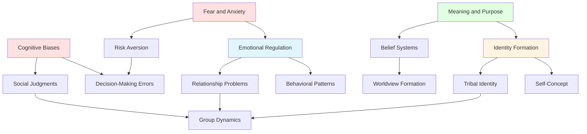

# Psychology: Individual Mental Processes and Behaviors

## Overview

The psychological dimension examines the fundamental mental processes, cognitive patterns, and emotional dynamics that shape individual human experience. These are not merely personal quirks but systematic features of human cognition that have profound implications for how individuals perceive reality, make decisions, regulate emotions, and construct meaning.

At the core of humanity's psychological challenges lies a fundamental tension: our brains evolved to solve specific survival problems in ancestral environments, yet we now deploy these same cognitive mechanisms in radically different contexts. This evolutionary mismatch produces systematic errors, biases, and maladaptive patterns that affect every aspect of human life.

## Key Themes

### Cognitive Architecture

Human cognition operates through heuristics—mental shortcuts that enabled rapid decision-making in life-or-death situations. While these heuristics were adaptive in ancestral environments, they produce systematic biases in modern contexts. We are not rational actors but "predictably irrational" beings whose thinking follows consistent patterns of error.

### Emotional Systems

Emotions evolved as rapid response systems to environmental threats and opportunities. However, the emotional systems calibrated for immediate physical dangers now respond to abstract social and existential threats, often producing dysregulation, chronic anxiety, and maladaptive coping strategies.

### Identity and Self

The human need for coherent self-identity drives much behavior, yet identity itself is constructed through social processes and vulnerable to fragmentation. Identity crises, both individual and collective, underlie many psychological problems and social conflicts.

## Topics in This Category

1. **[Cognitive Biases](./cognitive-biases.md)** - Systematic patterns of deviation from rationality in judgment and decision-making
2. **[Emotional Regulation](./emotional-regulation.md)** - Challenges in managing emotional responses and their long-term consequences
3. **[Identity Formation](./identity-formation.md)** - The construction of self-concept and problems of identity coherence
4. **[Fear and Anxiety](./fear-and-anxiety.md)** - Evolutionary basis of fear responses and modern anxiety disorders
5. **[Meaning and Purpose](./meaning-and-purpose.md)** - Existential needs for significance and the consequences of meaninglessness

## Topic Relationships

**Diagram Explanation**: This flowchart illustrates how the five major psychological topics interconnect and influence broader patterns. Cognitive biases affect decision-making and social judgments, which feed into group dynamics. Emotional regulation shapes behavioral patterns and relationship problems. Identity formation connects to tribal identity and group dynamics. Fear and anxiety influence both emotional regulation and risk aversion. Meaning and purpose drive identity formation and belief systems, which shape worldviews.

## Connections to Other Domains

- **Sociology**: Individual psychological patterns aggregate into social phenomena. Cognitive biases become collective delusions; individual identity needs fuel tribalism; emotional dysregulation scales to mob behavior.

- **Anthropology**: Psychological universals manifest differently across cultures. All humans form identities, but cultural contexts shape how identity is constructed and expressed.

- **History**: Psychological patterns drive historical events. Fear and anxiety fuel conflicts; cognitive biases enable propaganda; meaning-making needs drive ideological movements.

- **Religion & Philosophy**: Existential psychological needs underlie religious and philosophical systems. The search for meaning, fear of death, and need for moral frameworks are fundamentally psychological.

- **Science**: Evolutionary psychology and neuroscience provide mechanistic understanding of psychological phenomena, revealing both the adaptive origins and modern limitations of human cognition.

- **Economics**: Cognitive biases systematically distort economic decision-making. Loss aversion, present bias, and overconfidence affect markets, investments, and resource allocation.

- **Politics**: Political behavior is deeply psychological. Tribal identity, cognitive biases, and emotional reasoning shape political beliefs and voting behavior more than rational analysis.

- **Environment**: Psychological distance from environmental consequences, present bias, and cognitive biases impede environmental action despite intellectual understanding of risks.

- **Technology**: Digital technologies exploit psychological vulnerabilities—attention mechanisms, social comparison, dopamine systems—creating new forms of psychological dysfunction.

## Fundamental Insights

1. **Humans are not rational**: We are rationalizing creatures who construct post-hoc justifications for intuitive judgments
2. **Emotions drive behavior**: Rational analysis rarely overrides emotional responses
3. **Identity is central**: Threats to identity produce stronger reactions than threats to physical safety
4. **Meaning is necessary**: Humans cannot function without sense of purpose and significance
5. **Cognitive limitations are systematic**: Our errors follow predictable patterns
6. **Evolutionary mismatch is pervasive**: Modern environments trigger ancestral responses inappropriately
7. **Self-awareness is limited**: We have poor insight into our own mental processes
8. **Change is difficult**: Psychological patterns are deeply entrenched and resistant to modification

## Further Reading

- [Interconnections Map](../INTERCONNECTIONS.md) - See how psychological problems connect across all domains
- [Fundamental Patterns](../synthesis/fundamental-patterns.md) - Core patterns including psychological mechanisms
- [Evolutionary Psychology](../science/evolutionary-psychology.md) - Scientific basis of psychological adaptations
- [Tribalism](../sociology/tribalism.md) - How individual psychology scales to group behavior

---

**Navigation**: [← Back to Main Index](../README.md) | [Next Category: Sociology →](../sociology/INDEX.md)
