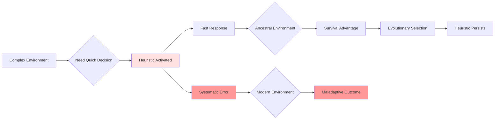
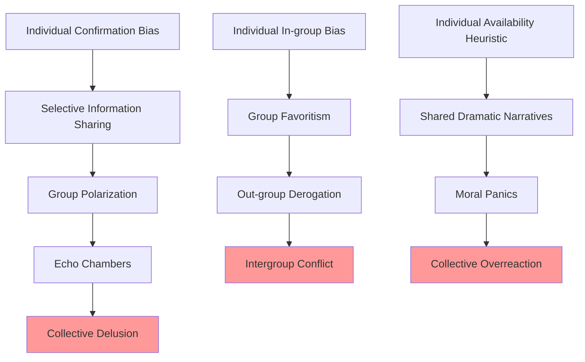

# Cognitive Biases: Systematic Deviations from Rationality

## Overview

Cognitive biases are systematic patterns of deviation from norm or rationality in judgment. They are not random errors but predictable, consistent distortions in how humans process information, make decisions, and form beliefs. These biases emerge from the heuristics—mental shortcuts—that our brains use to navigate complex environments with limited time and cognitive resources.

The existence of cognitive biases reveals a fundamental truth about human nature: **we are not rational actors**. Despite our capacity for logic and reason, human cognition is fundamentally shaped by evolutionary pressures that prioritized speed and efficiency over accuracy. In ancestral environments, quick judgments based on limited information often meant the difference between survival and death. A rustle in the grass might be wind or a predator—better to assume predator and be wrong than to assume wind and be eaten.

This same cognitive architecture now operates in modern contexts where the costs and benefits are radically different, producing systematic errors that affect everything from personal decisions to global policy.

## Table of Contents

- [Major Categories of Cognitive Biases](#major-categories-of-cognitive-biases)
- [Core Mechanisms](#core-mechanisms)
- [Individual-Level Manifestations](#individual-level-manifestations)
- [Group-Level Manifestations](#group-level-manifestations)
- [Societal-Level Manifestations](#societal-level-manifestations)
- [Historical Examples](#historical-examples)
- [Contemporary Examples](#contemporary-examples)
- [Future Implications](#future-implications)
- [Interconnections](#interconnections)

## Major Categories of Cognitive Biases

### Information Processing Biases

| Bias | Description | Mechanism | Impact |
|------|-------------|-----------|--------|
| **Confirmation Bias** | Seeking/interpreting information that confirms existing beliefs | Selective attention and memory | Entrenchment of false beliefs, polarization |
| **Availability Heuristic** | Judging probability by ease of recall | Memory accessibility | Overestimation of dramatic risks, underestimation of common risks |
| **Anchoring Effect** | Over-relying on first piece of information | Insufficient adjustment from initial value | Manipulation in negotiations, pricing, estimates |
| **Recency Bias** | Overweighting recent information | Memory decay and accessibility | Short-term thinking, panic reactions |
| **Framing Effect** | Different responses to same information based on presentation | Context-dependent evaluation | Manipulation through presentation |

### Social Cognition Biases

| Bias | Description | Mechanism | Impact |
|------|-------------|-----------|--------|
| **Fundamental Attribution Error** | Overattributing others' behavior to character, own to situation | Actor-observer asymmetry | Interpersonal conflict, blame |
| **In-group Bias** | Favoring members of one's own group | Tribal identity mechanisms | Discrimination, conflict |
| **Halo Effect** | Generalizing from one trait to overall judgment | Cognitive consistency seeking | Unfair evaluations, celebrity influence |
| **False Consensus Effect** | Overestimating how much others agree | Projection of own views | Political polarization, echo chambers |

### Judgment and Decision Biases

| Bias | Description | Mechanism | Impact |
|------|-------------|-----------|--------|
| **Dunning-Kruger Effect** | Incompetent people overestimate competence | Lack of metacognitive ability | Poor decision-making, overconfidence |
| **Optimism Bias** | Overestimating positive outcomes | Motivational and self-enhancement | Inadequate preparation, risk-taking |
| **Loss Aversion** | Losses loom larger than equivalent gains | Evolutionary risk management | Status quo bias, risk aversion |
| **Sunk Cost Fallacy** | Continuing investment based on past costs | Commitment consistency | Escalation of commitment, waste |
| **Present Bias** | Overvaluing immediate rewards | Temporal discounting | Procrastination, poor long-term planning |

**Table Explanation**: This table categorizes major cognitive biases by type, showing the underlying mechanism and real-world impact. Information processing biases affect how we gather and interpret data. Social cognition biases shape our judgments of ourselves and others. Judgment and decision biases distort our choices and predictions. Each bias represents an adaptive heuristic that becomes maladaptive in modern contexts.

## Core Mechanisms

### Heuristics as Adaptive Shortcuts

**Diagram Explanation**: This flowchart illustrates how cognitive biases emerge from adaptive heuristics. When faced with complex environments requiring quick decisions, the brain activates heuristics that produce fast responses but also systematic errors. In ancestral environments, the speed advantage outweighed the errors, providing survival benefits that led to evolutionary selection. In modern environments, the same heuristics produce maladaptive outcomes, but the mechanisms persist because evolution operates on much longer timescales than cultural change.

### Dual Process Theory

Human cognition operates through two systems:

- **System 1 (Fast)**: Automatic, intuitive, emotional, unconscious
  - Operates through heuristics
  - Produces immediate judgments
  - Evolutionarily ancient
  - Generates most cognitive biases

- **System 2 (Slow)**: Deliberate, logical, conscious, effortful
  - Requires cognitive resources
  - Can override System 1 (sometimes)
  - Evolutionarily recent
  - Limited capacity and easily fatigued

**The fundamental problem**: System 1 operates constantly and automatically, while System 2 requires effort and is often offline. Most decisions are made by System 1, with System 2 constructing post-hoc rationalizations.

## Individual-Level Manifestations

### Personal Decision-Making

Cognitive biases affect every aspect of individual life:

1. **Financial Decisions**: Loss aversion leads to holding losing investments; present bias causes inadequate retirement saving; anchoring enables price manipulation
2. **Health Choices**: Optimism bias reduces preventive care; availability heuristic causes fear of rare diseases while ignoring common risks
3. **Relationships**: Confirmation bias entrenches relationship problems; fundamental attribution error fuels conflicts
4. **Career**: Dunning-Kruger effect leads to poor self-assessment; sunk cost fallacy keeps people in wrong careers
5. **Learning**: Confirmation bias prevents updating beliefs; overconfidence reduces learning effort

### Belief Formation and Maintenance

> "It is difficult to get a man to understand something when his salary depends on his not understanding it." - Upton Sinclair

Cognitive biases don't just affect decisions—they shape fundamental beliefs about reality:

- **Confirmation bias** creates self-reinforcing belief systems
- **Motivated reasoning** protects identity-relevant beliefs
- **Backfire effect** can strengthen beliefs when challenged with contradictory evidence
- **Belief perseverance** maintains beliefs even after foundational evidence is discredited

This creates **epistemic closure**: individuals become trapped in self-reinforcing belief systems resistant to contrary evidence.

## Group-Level Manifestations

### Collective Biases

When individuals with biases interact, group-level phenomena emerge:

**Diagram Explanation**: This graph shows how individual cognitive biases aggregate into dangerous group phenomena. Individual confirmation bias leads to selective information sharing within groups, which produces group polarization and echo chambers, ultimately resulting in collective delusions. Individual in-group bias scales to group favoritism and out-group derogation, fueling intergroup conflict. Individual availability heuristics create shared dramatic narratives that produce moral panics and collective overreactions.

### Groupthink

In cohesive groups, cognitive biases combine with social pressure to produce **groupthink**:

- Illusion of invulnerability (optimism bias)
- Collective rationalization (confirmation bias)
- Belief in inherent morality (in-group bias)
- Stereotyping of out-groups (fundamental attribution error)
- Self-censorship (conformity pressure)
- Illusion of unanimity (false consensus effect)

Historical disasters from the Bay of Pigs to the Challenger explosion demonstrate groupthink's catastrophic potential.

## Societal-Level Manifestations

### Political Polarization

Cognitive biases drive political division:

1. **Confirmation bias** → Selective media consumption → Echo chambers
2. **In-group bias** → Political tribalism → Dehumanization of opponents
3. **Fundamental attribution error** → "They're evil, we're principled"
4. **Motivated reasoning** → Identity-protective cognition → Fact resistance

The result: societies fracture into mutually incomprehensible tribes, each certain of their righteousness and the other's malevolence.

### Market Failures

Economic systems assume rational actors, but cognitive biases produce systematic market failures:

- **Bubbles**: Optimism bias + herd behavior + recency bias
- **Crashes**: Loss aversion + availability heuristic + panic
- **Inequality**: Just-world hypothesis + fundamental attribution error justify existing distributions
- **Short-termism**: Present bias prevents long-term investment

### Policy Failures

Governments and institutions fall prey to collective biases:

- **Availability cascade**: Dramatic events drive policy despite low actual risk
- **Planning fallacy**: Systematic underestimation of time and cost
- **Sunk cost fallacy**: Continuation of failed policies
- **Groupthink**: Disastrous decisions by intelligent groups

## Historical Examples

### The Tulip Mania (1637)

The Dutch tulip bubble demonstrates multiple biases:
- **Herd behavior**: Following others into speculation
- **Recency bias**: Recent price increases projected forward
- **Optimism bias**: "This time is different"
- **Sunk cost fallacy**: Continuing to buy as prices rose

### The Salem Witch Trials (1692-1693)

Mass hysteria driven by:
- **Availability heuristic**: Dramatic accusations made witchcraft seem common
- **Confirmation bias**: Interpreting ambiguous evidence as confirming witchcraft
- **In-group bias**: Protecting community by identifying outsiders
- **Fundamental attribution error**: Attributing misfortune to malevolent actors

### The Iraq War (2003)

Intelligence failures and policy disasters from:
- **Confirmation bias**: Seeking evidence of WMDs, dismissing contrary evidence
- **Groupthink**: Suppression of dissent in decision-making
- **Optimism bias**: Underestimating difficulty and cost
- **Sunk cost fallacy**: Escalation of commitment despite failure

## Contemporary Examples

### Social Media Echo Chambers

Platform algorithms exploit cognitive biases:
- **Confirmation bias** → Personalized feeds showing agreeable content
- **Availability heuristic** → Dramatic content gets engagement, seems common
- **In-group bias** → Tribal identity formation around beliefs
- **False consensus effect** → Believing one's bubble represents reality

Result: Fragmented information ecosystem, polarization, radicalization.

### Climate Change Denial

Despite scientific consensus, cognitive biases impede action:
- **Present bias**: Future consequences discounted
- **Optimism bias**: "Technology will solve it"
- **Motivated reasoning**: Economic interests drive belief
- **Availability heuristic**: Lack of immediate dramatic effects reduces perceived risk
- **Psychological distance**: Affects distant people and times

### Financial Crises

The 2008 financial crisis demonstrated:
- **Recency bias**: Recent stability projected forward
- **Optimism bias**: "Housing prices always rise"
- **Herd behavior**: Following others into risky investments
- **Dunning-Kruger**: Overconfidence in complex financial instruments

## Future Implications

### Artificial Intelligence and Algorithmic Bias

AI systems trained on human data inherit human biases:
- Facial recognition less accurate for minorities (training data bias)
- Hiring algorithms discriminate (historical bias in data)
- Recommendation systems create filter bubbles (confirmation bias exploitation)
- Predictive policing reinforces existing patterns (feedback loops)

**Critical concern**: Biases become automated, scaled, and hidden in "objective" algorithms.

### Information Warfare

Understanding cognitive biases enables manipulation:
- **Targeted propaganda**: Exploiting confirmation bias and motivated reasoning
- **Disinformation campaigns**: Leveraging availability heuristic and emotional reasoning
- **Deepfakes**: Exploiting trust in visual evidence
- **Micro-targeting**: Personalized manipulation based on psychological profiles

### Existential Risks

Cognitive biases may prevent adequate response to existential threats:
- **Present bias** → Inadequate preparation for long-term risks
- **Optimism bias** → Underestimation of catastrophic risks
- **Availability heuristic** → Focus on dramatic but unlikely risks, ignore probable but undramatic ones
- **Scope insensitivity** → Inability to grasp scale of global catastrophes

## Interconnections

This problem connects to:

- **[Emotional Regulation](./emotional-regulation.md)**: Emotions drive biased reasoning; biases affect emotional responses
- **[Tribalism](../sociology/tribalism.md)**: In-group bias is fundamental to tribal identity and conflict
- **[Group Dynamics](../sociology/group-dynamics.md)**: Individual biases aggregate into collective phenomena
- **[Historical Patterns](../history/cyclical-patterns.md)**: Cognitive biases drive recurring historical mistakes
- **[Political Polarization](../politics/power-dynamics.md)**: Biases fuel political division and conflict
- **[Climate Psychology](../environment/climate-psychology.md)**: Biases impede environmental action
- **[Digital Age Problems](../technology/digital-age-problems.md)**: Technology exploits cognitive vulnerabilities
- **[Short-term Thinking](../economics/short-term-thinking.md)**: Present bias drives economic myopia

## Related Topics

- [Emotional Regulation](./emotional-regulation.md)
- [Identity Formation](./identity-formation.md)
- [Evolutionary Psychology](../science/evolutionary-psychology.md)
- [Scientific Method Limits](../science/scientific-method-limits.md)

## References

- Kahneman, D. (2011). *Thinking, Fast and Slow*
- Tversky, A., & Kahneman, D. (1974). "Judgment under Uncertainty: Heuristics and Biases"
- Haidt, J. (2012). *The Righteous Mind*
- Ariely, D. (2008). *Predictably Irrational*

---

**Navigation**: [← Back to Psychology Index](./INDEX.md) | [Next: Emotional Regulation →](./emotional-regulation.md)
