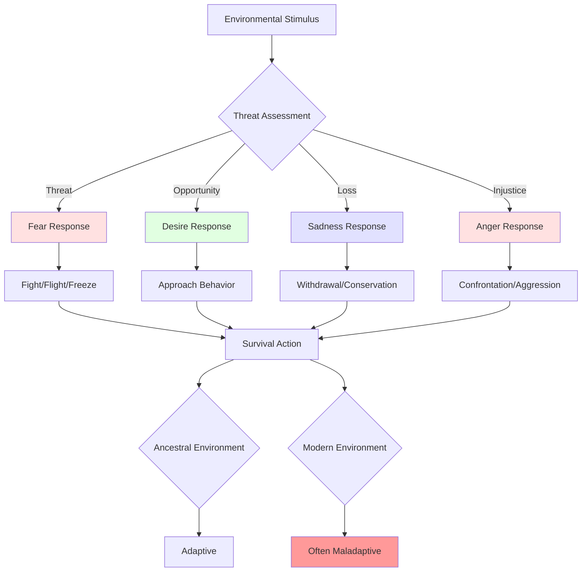
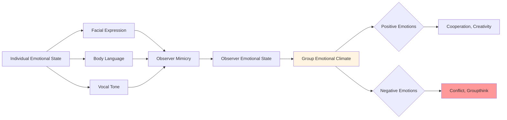

# Emotional Regulation: Managing the Unmanageable

## Overview

Emotional regulation refers to the processes by which individuals influence which emotions they have, when they have them, and how they experience and express these emotions. The challenge of emotional regulation represents one of humanity's most pervasive psychological problems: our emotional systems evolved for immediate survival responses but now must navigate complex social environments where emotional expression carries nuanced consequences.

**The fundamental problem**: Emotions are fast, automatic, and powerful systems designed to mobilize rapid responses to threats and opportunities. They bypass conscious deliberation, hijack attention, and drive behavior. Yet modern life requires emotional control, nuance, and appropriateness that our evolutionary heritage did not prepare us for.

This mismatch between emotional systems calibrated for ancestral environments and the demands of modern social life produces widespread emotional dysregulation, contributing to mental health problems, relationship failures, violence, and poor decision-making at individual and collective levels.

## Table of Contents

- [The Emotional System](#the-emotional-system)
- [Regulation Strategies](#regulation-strategies)
- [Individual-Level Problems](#individual-level-problems)
- [Group-Level Problems](#group-level-problems)
- [Societal-Level Problems](#societal-level-problems)
- [Historical Examples](#historical-examples)
- [Contemporary Manifestations](#contemporary-manifestations)
- [Future Challenges](#future-challenges)
- [Interconnections](#interconnections)

## The Emotional System

### Evolutionary Function

**Diagram Explanation**: This flowchart shows how the emotional system processes environmental stimuli. Threat assessment triggers specific emotional responses (fear, desire, sadness, anger), each producing characteristic behavioral patterns (fight/flight, approach, withdrawal, confrontation). These responses were adaptive in ancestral environments with immediate physical threats and opportunities. In modern environments with abstract, social, and long-term challenges, the same responses often prove maladaptive.

### Core Emotions and Their Functions

| Emotion | Evolutionary Function | Physiological Response | Behavioral Tendency | Modern Context Problem |
|---------|----------------------|------------------------|---------------------|------------------------|
| **Fear** | Threat detection and avoidance | Increased heart rate, cortisol, alertness | Flight, freeze, avoidance | Chronic anxiety from abstract threats |
| **Anger** | Resource defense, status maintenance | Increased blood pressure, muscle tension | Confrontation, aggression | Inappropriate aggression in social contexts |
| **Sadness** | Signal loss, elicit support, conserve energy | Decreased energy, withdrawal | Reduced activity, social signaling | Depression, social isolation |
| **Disgust** | Pathogen avoidance | Nausea, rejection response | Avoidance, expulsion | Moral disgust, dehumanization |
| **Joy** | Reward learning, social bonding | Dopamine release, energy | Approach, exploration | Hedonic treadmill, addiction |
| **Surprise** | Attention reorientation | Startle response, focus | Information seeking | Distraction, attention hijacking |

**Table Explanation**: This table maps core emotions to their evolutionary functions, showing how each emotion produces specific physiological and behavioral responses adaptive for ancestral survival challenges. The final column reveals how these same responses create problems in modern contexts where threats are abstract, social rules are complex, and immediate emotional responses are often inappropriate.

## Regulation Strategies

### The Regulation Process Model

Emotional regulation can occur at different stages:

1. **Situation Selection**: Avoiding or seeking situations based on emotional consequences
2. **Situation Modification**: Changing the situation to alter its emotional impact
3. **Attentional Deployment**: Directing attention toward or away from emotional aspects
4. **Cognitive Change**: Reappraising the meaning of the situation
5. **Response Modulation**: Directly influencing emotional responses after they occur

### Common Regulation Strategies

| Strategy | Description | Effectiveness | Costs | Example |
|----------|-------------|---------------|-------|---------|
| **Suppression** | Inhibiting emotional expression | Low long-term | High cognitive load, physiological stress, relationship damage | Maintaining "poker face" while angry |
| **Reappraisal** | Changing interpretation of situation | High | Requires cognitive resources, skill | Viewing criticism as learning opportunity |
| **Distraction** | Shifting attention away from emotion | Moderate | Avoidance of processing, temporary | Watching TV to avoid sadness |
| **Rumination** | Repetitive focus on negative emotions | Counterproductive | Amplifies negative emotions, depression | Obsessively replaying conflict |
| **Acceptance** | Acknowledging emotions without judgment | High | Requires practice, counterintuitive | Noting "I feel angry" without acting |
| **Venting** | Expressing emotions intensely | Low | Amplifies emotions, damages relationships | Yelling when frustrated |

**Table Explanation**: Different regulation strategies vary dramatically in effectiveness and costs. Suppression, despite being common, is among the least effective and most costly. Reappraisal and acceptance are most effective but require cognitive resources and skills that many lack. Understanding these differences is crucial, yet most people rely on maladaptive strategies learned in childhood.

## Individual-Level Problems

### Emotional Dysregulation Disorders

Difficulty with emotional regulation underlies many mental health conditions:

- **Depression**: Inability to regulate sadness and anhedonia
- **Anxiety Disorders**: Inability to regulate fear responses
- **Borderline Personality Disorder**: Extreme emotional instability
- **Substance Abuse**: Using substances to regulate emotions
- **Eating Disorders**: Using food to regulate emotions
- **Self-Harm**: Maladaptive regulation through physical pain

### The Suppression Paradox

> "That which we resist, persists." - Carl Jung

Attempting to suppress emotions often backfires:

1. **Rebound Effect**: Suppressed thoughts and emotions return stronger
2. **Cognitive Load**: Suppression consumes mental resources
3. **Physiological Cost**: Suppression increases stress responses
4. **Social Cost**: Suppression reduces authentic connection
5. **Amplification**: Trying not to feel something intensifies the feeling

Yet suppression remains the default strategy for many, taught implicitly through socialization ("boys don't cry," "don't be angry").

### Decision-Making Impairment

Emotional dysregulation impairs judgment:

- **Hot states**: Decisions made in emotional arousal differ from "cold" rational analysis
- **Emotional reasoning**: "I feel it, therefore it's true"
- **Mood-congruent processing**: Emotions bias information processing
- **Impulse control**: Strong emotions override long-term planning

## Group-Level Problems

### Emotional Contagion

Emotions spread through groups:

**Diagram Explanation**: Emotional contagion occurs through automatic mimicry of facial expressions, body language, and vocal tone. Observers unconsciously mirror these signals, inducing similar emotional states. This creates group emotional climates that can be positive (fostering cooperation and creativity) or negative (producing conflict and groupthink). The automatic nature of this process means groups can spiral into collective emotional states without conscious awareness.

### Mob Behavior

Emotional dysregulation at group level produces:

- **Riots**: Collective anger overwhelming individual restraint
- **Panics**: Collective fear producing stampedes and irrational behavior
- **Manias**: Collective excitement driving bubbles and crazes
- **Lynchings**: Collective moral outrage enabling atrocities

The group context amplifies emotions while reducing individual responsibility, creating conditions for extreme behavior.

### Organizational Dysfunction

Emotional regulation problems affect institutions:

- **Toxic cultures**: Unregulated anger and fear become normalized
- **Burnout**: Chronic emotional labor without adequate regulation
- **Conflict escalation**: Poor emotional regulation turns disagreements into feuds
- **Decision-making failures**: Emotional climates bias organizational choices

## Societal-Level Problems

### Political Emotionalism

Modern politics increasingly operates through emotional manipulation:

1. **Fear-based politics**: Threat exaggeration to mobilize voters
2. **Outrage cycles**: Media amplifying anger for engagement
3. **Tribal emotions**: In-group love and out-group hate driving polarization
4. **Emotional reasoning**: Policy positions based on feelings rather than analysis

The result: Democracies increasingly driven by emotional manipulation rather than rational deliberation.

### Violence and Conflict

Poor emotional regulation underlies violence:

- **Domestic violence**: Inability to regulate anger in intimate relationships
- **Street violence**: Emotional escalation in status conflicts
- **Terrorism**: Channeling rage and humiliation into violence
- **War**: Collective emotions (fear, anger, hatred) enabling mass violence

### Mental Health Crisis

Widespread emotional dysregulation contributes to:

- Rising rates of anxiety and depression
- Increasing substance abuse
- Growing suicide rates
- Epidemic of loneliness and disconnection

Modern life provides fewer traditional emotional regulation supports (community, ritual, nature) while increasing emotional demands (complexity, uncertainty, social comparison).

## Historical Examples

### The French Revolution's Reign of Terror (1793-1794)

Collective emotional dysregulation produced mass violence:
- Initial revolutionary enthusiasm (joy, hope)
- Paranoia and fear of counter-revolution
- Anger at perceived enemies
- Moral outrage justifying executions
- Emotional contagion spreading through crowds
- Eventual exhaustion and reaction

### The Tulip Mania (1636-1637)

Collective emotional regulation failure in markets:
- Excitement and greed driving speculation
- Fear of missing out (FOMO) producing irrational behavior
- Panic when bubble burst
- Shame and recrimination afterward

### World War I Continuation

Emotional factors prolonging catastrophic war:
- National pride preventing admission of failure
- Anger and desire for revenge
- Sunk cost emotional reasoning ("too many have died to stop now")
- Leaders' inability to regulate emotions and seek peace

## Contemporary Manifestations

### Social Media Emotional Amplification

Digital platforms exploit and amplify emotional dysregulation:

- **Outrage algorithms**: Content that triggers anger gets engagement
- **FOMO**: Fear of missing out drives compulsive checking
- **Social comparison**: Envy and inadequacy from curated lives
- **Validation seeking**: Dopamine hits from likes and shares
- **Disinhibition**: Reduced emotional regulation in online contexts

Result: Population with heightened emotional reactivity and reduced regulation capacity.

### Road Rage

Modern phenomenon of emotional dysregulation:
- Anonymity of cars reduces social regulation
- Perceived disrespect triggers disproportionate anger
- Stress and frustration seeking outlet
- Escalation from minor incidents to violence

### Political Polarization

Emotional regulation failure in civic life:
- Inability to tolerate disagreement
- Emotional reasoning replacing analysis
- Outrage as identity marker
- Dehumanization of opponents enabling cruelty

### Climate Anxiety

Emotional response to environmental crisis:
- Overwhelming fear and helplessness
- Oscillation between panic and denial
- Difficulty regulating emotions about abstract future threats
- Paralysis or maladaptive coping

## Future Challenges

### Technological Emotional Manipulation

Emerging technologies will enable unprecedented emotional manipulation:

- **Affective computing**: AI detecting and responding to emotional states
- **Personalized manipulation**: Targeting individual emotional vulnerabilities
- **Virtual reality**: Immersive emotional experiences
- **Brain-computer interfaces**: Direct emotional state modification

**Critical question**: How do we maintain emotional autonomy in an age of sophisticated emotional manipulation?

### Emotional Labor Intensification

Modern economy increasingly demands emotional labor:
- Service work requiring constant emotional performance
- Remote work blurring boundaries
- Always-on connectivity preventing emotional recovery
- Gig economy eliminating emotional support structures

### Collective Emotional Challenges

Humanity faces challenges requiring emotional regulation at scale:
- **Climate change**: Managing fear and grief while maintaining agency
- **Technological disruption**: Coping with rapid change and uncertainty
- **Inequality**: Regulating anger and resentment
- **Existential risks**: Confronting possibility of extinction

## Interconnections

This problem connects to:

- **[Cognitive Biases](./cognitive-biases.md)**: Emotions drive biased reasoning; biases affect emotional responses
- **[Fear and Anxiety](./fear-and-anxiety.md)**: Specific emotional regulation challenges around threat responses
- **[Group Dynamics](../sociology/group-dynamics.md)**: Emotional contagion shapes group behavior
- **[Violence and Conflict](../history/violence-and-conflict.md)**: Emotional dysregulation enables violence
- **[Political Polarization](../politics/power-dynamics.md)**: Emotional reasoning drives political division
- **[Digital Age Problems](../technology/digital-age-problems.md)**: Technology exploits emotional vulnerabilities
- **[Mental Health](./meaning-and-purpose.md)**: Emotional regulation central to psychological well-being

## Related Topics

- [Cognitive Biases](./cognitive-biases.md)
- [Fear and Anxiety](./fear-and-anxiety.md)
- [Identity Formation](./identity-formation.md)
- [Group Dynamics](../sociology/group-dynamics.md)

---

**Navigation**: [← Back to Psychology Index](./INDEX.md) | [Next: Identity Formation →](./identity-formation.md)
