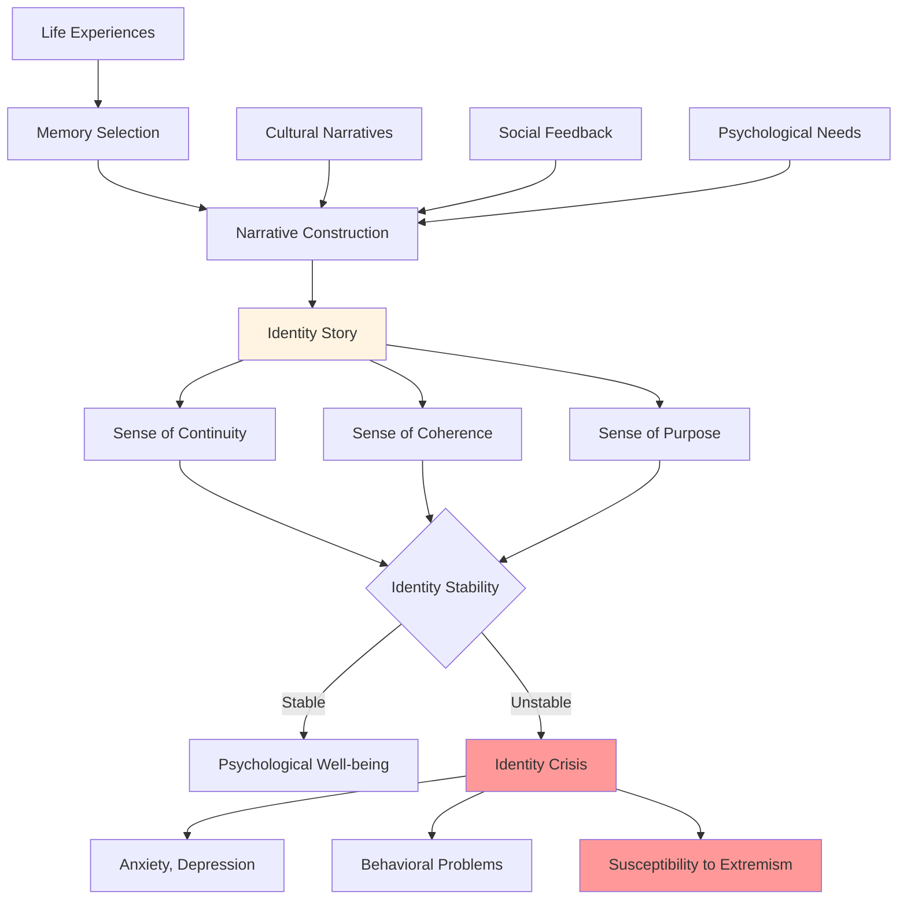
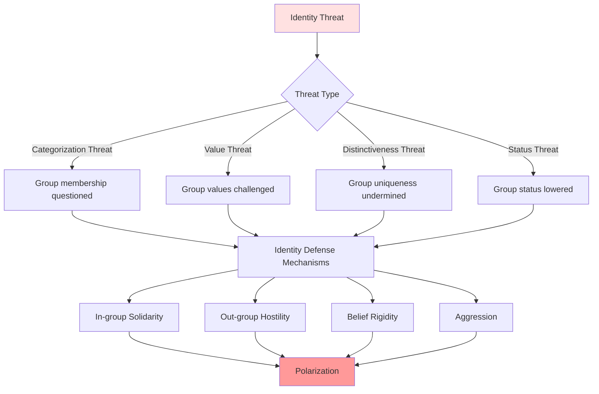

# Identity Formation: The Construction of Self

## Overview

Identity formation—the process by which individuals develop a coherent sense of self—represents a fundamental psychological challenge with profound implications for human behavior. Unlike physical traits that develop through biological maturation, identity is **constructed** through social interaction, cultural narratives, and psychological processes. This construction is both necessary and problematic.

**The core paradox**: Humans need stable, coherent identities to function, yet identity is inherently fluid, contextual, and socially constructed. We experience ourselves as unified, continuous selves, but this experience is a psychological achievement, not a given. When identity construction fails or is threatened, the consequences range from personal crisis to collective violence.

Identity is not merely "who you are"—it is the answer to existential questions: *What am I? What is my place? What is my purpose? To what do I belong?* These questions drive behavior more powerfully than rational self-interest, making identity central to understanding human problems.

## Table of Contents

- [The Nature of Identity](#the-nature-of-identity)
- [Identity Development Process](#identity-development-process)
- [Individual Identity Challenges](#individual-identity-challenges)
- [Social Identity Dynamics](#social-identity-dynamics)
- [Collective Identity Problems](#collective-identity-problems)
- [Historical Patterns](#historical-patterns)
- [Contemporary Identity Crises](#contemporary-identity-crises)
- [Future Identity Challenges](#future-identity-challenges)
- [Interconnections](#interconnections)

## The Nature of Identity

### Identity as Narrative Construction

Identity is fundamentally a **story we tell ourselves about ourselves**:

**Diagram Explanation**: Identity formation involves selecting from life experiences, integrating cultural narratives and social feedback, and constructing a coherent story that provides continuity, coherence, and purpose. When this process succeeds, it produces psychological well-being. When it fails, identity crisis results, leading to anxiety, depression, behavioral problems, and vulnerability to extremist ideologies that offer ready-made identities.

### Components of Identity

| Identity Component | Description | Source | Stability | Crisis Potential |
|-------------------|-------------|--------|-----------|------------------|
| **Personal Identity** | Unique individual characteristics, memories, traits | Individual experience | Moderate | Moderate |
| **Social Identity** | Group memberships and categories | Social categorization | High | High |
| **Role Identity** | Positions in social structures | Social roles | Low | Moderate |
| **Narrative Identity** | Life story and meaning | Self-construction | Moderate | High |
| **Embodied Identity** | Physical self and appearance | Biology + culture | High | Moderate |
| **Moral Identity** | Values and ethical commitments | Socialization + choice | High | Very High |

**Table Explanation**: Identity comprises multiple components with varying sources, stability, and crisis potential. Social and moral identities are particularly stable but also most prone to crisis when threatened, as they connect to fundamental needs for belonging and meaning. Understanding these components reveals why identity threats produce such intense reactions.

## Identity Development Process

### Erikson's Identity Stages

Erik Erikson identified identity formation as a lifelong process with critical periods:

1. **Infancy (Trust vs. Mistrust)**: Foundation of secure identity
2. **Early Childhood (Autonomy vs. Shame)**: Sense of independent self
3. **Play Age (Initiative vs. Guilt)**: Active identity exploration
4. **School Age (Industry vs. Inferiority)**: Competence-based identity
5. **Adolescence (Identity vs. Role Confusion)**: **Critical period** for identity consolidation
6. **Young Adulthood (Intimacy vs. Isolation)**: Identity in relationships
7. **Adulthood (Generativity vs. Stagnation)**: Identity through contribution
8. **Old Age (Integrity vs. Despair)**: Identity integration and acceptance

**Adolescence** is particularly critical: the transition from childhood to adulthood requires constructing a coherent adult identity. Failure produces role confusion, identity diffusion, and vulnerability.

### Identity Status Model

James Marcia identified four identity statuses based on exploration and commitment:

| Status | Exploration | Commitment | Characteristics | Outcomes |
|--------|-------------|------------|-----------------|----------|
| **Identity Achievement** | Yes | Yes | Explored options, made commitments | Healthy, stable |
| **Moratorium** | Yes | No | Actively exploring, not yet committed | Anxious but developing |
| **Foreclosure** | No | Yes | Committed without exploration | Rigid, vulnerable |
| **Identity Diffusion** | No | No | Neither exploring nor committed | Aimless, vulnerable |

**Table Explanation**: Healthy identity development requires both exploration (trying different roles, values, beliefs) and commitment (choosing and investing in specific identities). Foreclosure (commitment without exploration) produces rigid identities vulnerable to crisis. Identity diffusion (neither exploring nor committing) leaves individuals aimless and susceptible to manipulation.

## Individual Identity Challenges

### Identity Crisis

An identity crisis occurs when the existing identity narrative breaks down:

**Triggers**:
- Life transitions (adolescence, career change, retirement)
- Trauma or loss
- Social role changes
- Value conflicts
- Existential confrontations

**Symptoms**:
- Confusion about self and purpose
- Anxiety and depression
- Behavioral experimentation or paralysis
- Relationship difficulties
- Susceptibility to ideologies offering ready-made identities

**Resolution Paths**:
- Successful: New, more integrated identity
- Unsuccessful: Identity foreclosure, diffusion, or fragmentation

### The Authentic Self Paradox

Modern culture emphasizes "being yourself" and "authenticity," but:

1. **There is no pre-existing authentic self to discover**—identity is constructed
2. **Authenticity itself is a cultural value**—not universal
3. **The search for authenticity can prevent identity formation**—endless exploration without commitment
4. **Authenticity demands can be oppressive**—requiring constant self-examination

> "We are what we pretend to be, so we must be careful about what we pretend to be." - Kurt Vonnegut

### Identity and Mental Health

Identity problems underlie many psychological disorders:

- **Depression**: Loss of sense of self and purpose
- **Anxiety**: Uncertainty about identity and future
- **Borderline Personality Disorder**: Unstable sense of self
- **Dissociative Disorders**: Fragmented identity
- **Eating Disorders**: Identity focused on body and control
- **Substance Abuse**: Escape from identity confusion

## Social Identity Dynamics

### Social Identity Theory

Henri Tajfel's Social Identity Theory reveals how group membership shapes identity:

1. **Social Categorization**: We categorize ourselves and others into groups
2. **Social Identification**: We adopt the identity of groups we belong to
3. **Social Comparison**: We compare our groups favorably to others

This process produces:
- **In-group favoritism**: Preferring and helping group members
- **Out-group derogation**: Devaluing and discriminating against non-members
- **Identity-protective cognition**: Defending group beliefs regardless of evidence

### The Minimal Group Paradigm

Experiments show that even **arbitrary, meaningless group assignments** produce:
- In-group favoritism
- Out-group discrimination
- Group-based identity

This reveals how easily humans form tribal identities and how little is needed to trigger in-group/out-group dynamics.

### Identity Threat and Defense

Threats to social identity produce intense reactions:

**Diagram Explanation**: Identity threats come in multiple forms—questioning group membership, challenging group values, undermining distinctiveness, or lowering status. Each triggers defensive mechanisms including increased in-group solidarity, out-group hostility, belief rigidity, and aggression. These defenses produce polarization and conflict, as groups become more extreme in response to perceived threats.

## Collective Identity Problems

### Nationalism and Ethnic Conflict

National and ethnic identities are powerful because they provide:
- Sense of belonging and continuity
- Connection to history and ancestors
- Shared values and culture
- Collective purpose and meaning

But they also produce:
- **Ethnocentrism**: Belief in group superiority
- **Xenophobia**: Fear and hatred of outsiders
- **Genocide**: Extreme out-group dehumanization
- **War**: Collective violence for group interests

### Religious Identity and Conflict

Religious identity is particularly powerful because it combines:
- Social identity (group membership)
- Moral identity (values and ethics)
- Existential meaning (purpose and afterlife)
- Sacred narratives (ultimate truth claims)

This makes religious identity:
- Extremely resistant to change
- Highly motivating
- Prone to conflict with other religious identities
- Capable of justifying extreme violence

### Political Identity Polarization

Modern political identities increasingly function as tribal identities:
- **Identity-based voting**: Party as identity, not policy preference
- **Affective polarization**: Emotional hatred of other party
- **Moral tribalism**: Viewing opponents as evil, not mistaken
- **Information tribalism**: Rejecting facts that threaten identity

## Historical Patterns

### The Protestant Reformation (16th Century)

Identity crisis at civilizational scale:
- Catholic identity challenged by Protestant alternatives
- Wars of religion as identity conflicts
- Millions died over competing religious identities
- Eventually resolved through pluralism and secularization

### Colonialism and Identity Destruction

Colonial powers systematically destroyed indigenous identities:
- Forced cultural assimilation
- Destruction of languages and traditions
- Imposition of colonial identities
- Intergenerational trauma from identity loss

### The Holocaust

Extreme manifestation of identity-based violence:
- Nazi identity based on racial purity
- Jewish identity as existential threat
- Systematic dehumanization and genocide
- Identity as justification for atrocity

## Contemporary Identity Crises

### The Meaning Crisis

Modern societies face widespread identity crisis:

**Causes**:
- Decline of traditional identity sources (religion, community, stable careers)
- Increased mobility and social fragmentation
- Information overload and competing narratives
- Rapid social change undermining continuity
- Consumer culture offering shallow identity markers

**Consequences**:
- Rising rates of anxiety, depression, suicide
- Susceptibility to extremist ideologies
- Political polarization and tribalism
- Search for identity through consumption, social media, or radical movements

### Digital Identity Fragmentation

Social media creates new identity challenges:
- **Multiple selves**: Different personas for different platforms
- **Curated identity**: Constant performance and impression management
- **Social comparison**: Inadequacy from comparing to idealized others
- **Validation seeking**: Identity dependent on likes and followers
- **Cancel culture**: Identity destruction through public shaming

### Identity Politics

Contemporary politics increasingly organized around identity:

**Positive aspects**:
- Recognition of marginalized identities
- Challenging dominant group privilege
- Empowerment through collective identity

**Problematic aspects**:
- Reducing individuals to group identities
- Competitive victimhood
- Fragmentation into ever-smaller identity groups
- Difficulty finding common ground
- Weaponization of identity claims

## Future Identity Challenges

### Technological Identity Disruption

Emerging technologies will challenge identity in unprecedented ways:

1. **Artificial Intelligence**: What does human identity mean when AI surpasses human capabilities?
2. **Genetic Engineering**: Identity based on designed rather than inherited traits
3. **Brain-Computer Interfaces**: Blurred boundaries between self and technology
4. **Virtual Reality**: Multiple identities in virtual worlds
5. **Life Extension**: Identity across centuries rather than decades
6. **Transhumanism**: Post-human identities beyond current human nature

### Global Identity vs. Tribal Identity

Humanity faces a choice:
- **Tribal path**: Fragmentation into competing identity groups, conflict
- **Global path**: Shared human identity, cooperation

Current trajectory suggests increasing tribalism, but existential challenges (climate change, AI risk, pandemics) may force global identity development.

### The Identity Marketplace

Capitalism increasingly commodifies identity:
- Identity as consumer choice
- Brands as identity markers
- Influencers selling identity templates
- Algorithms shaping identity formation

**Critical question**: Can authentic identity formation occur in a commercialized identity marketplace?

## Interconnections

This problem connects to:

- **[Meaning and Purpose](./meaning-and-purpose.md)**: Identity provides existential meaning
- **[Social Identity](../sociology/social-identity.md)**: Group-based identity dynamics
- **[Tribalism](../sociology/tribalism.md)**: In-group/out-group identity conflicts
- **[Religious Conflict](../religion-philosophy/religious-conflict.md)**: Religious identity as source of conflict
- **[Nationalism](../history/violence-and-conflict.md)**: National identity and violence
- **[Political Polarization](../politics/power-dynamics.md)**: Political identity tribalism
- **[Digital Age Problems](../technology/digital-age-problems.md)**: Technology disrupting identity formation

## Related Topics

- [Meaning and Purpose](./meaning-and-purpose.md)
- [Cognitive Biases](./cognitive-biases.md)
- [Social Identity](../sociology/social-identity.md)
- [Tribalism](../sociology/tribalism.md)

---

**Navigation**: [← Back to Psychology Index](./INDEX.md) | [Next: Fear and Anxiety →](./fear-and-anxiety.md)
