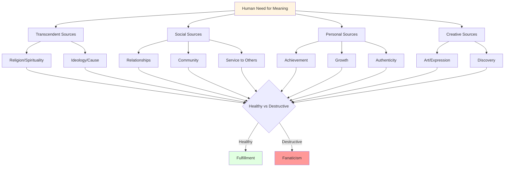

# Meaning and Purpose: The Existential Imperative

## Overview

The human need for meaning and purpose is not a luxury but a fundamental psychological requirement. Unlike other animals that simply exist, humans must find reasons to exist. We are "meaning-making machines" who cannot function without a sense that our lives matter, that our actions have significance, and that we are part of something larger than ourselves.

**The existential problem**: Humans are conscious of their own mortality, the vastness of the universe, and the apparent absence of inherent meaning. This awareness creates an existential void that must be filled. When meaning-making fails, the consequences range from depression and suicide to susceptibility to extremist ideologies that offer ready-made meaning.

This need for meaning drives much human behavior—both constructive and destructive. It underlies religious belief, political commitment, creative expression, and self-sacrifice. It also fuels fanaticism, violence, and the willingness to die (and kill) for abstract causes.

## The Meaning Crisis

Modern societies face a widespread crisis of meaning:

**Traditional Sources Declining**:
- Religious belief and practice
- Stable communities and relationships
- Clear life narratives and roles
- Connection to nature and cycles
- Intergenerational continuity

**Modern Conditions Undermining Meaning**:
- Rapid social change
- Fragmentation and mobility
- Consumer culture's shallow satisfactions
- Information overload
- Awareness of cosmic insignificance

**Consequences**:
- Rising rates of depression, anxiety, suicide
- Substance abuse as meaning substitute
- Political extremism offering purpose
- Consumerism as failed meaning source
- Nihilism and despair

## Sources of Meaning

**Diagram Explanation**: Humans seek meaning from transcendent sources (religion, ideology), social sources (relationships, community, service), personal sources (achievement, growth, authenticity), and creative sources (art, discovery). Each source can be healthy (producing fulfillment) or destructive (producing fanaticism). The key is not the source itself but how it's pursued and integrated.

## Interconnections

This problem connects to:

- **[Identity Formation](./identity-formation.md)**: Meaning provides identity foundation
- **[Existential Questions](../religion-philosophy/existential-questions.md)**: Philosophical dimensions of meaning
- **[Religious Conflict](../religion-philosophy/religious-conflict.md)**: Competing meaning systems
- **[Political Extremism](../politics/power-dynamics.md)**: Ideology as meaning source
- **[Depression](./emotional-regulation.md)**: Meaning loss and mental health

## Related Topics

- [Identity Formation](./identity-formation.md)
- [Existential Questions](../religion-philosophy/existential-questions.md)
- [Emotional Regulation](./emotional-regulation.md)

---

**Navigation**: [← Back to Psychology Index](./INDEX.md) | [Next Category: Sociology →](../sociology/INDEX.md)
