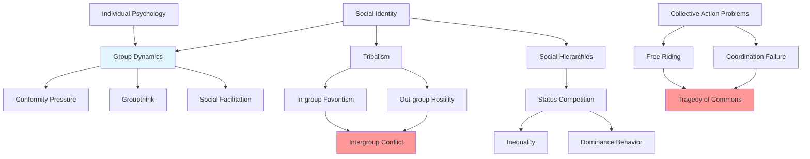

# Sociology: Group Dynamics and Social Structures

## Overview

Sociology examines how individual humans aggregate into groups, how these groups function, and how social structures shape behavior. While psychology focuses on the individual mind, sociology reveals that humans are fundamentally social creatures whose behavior cannot be understood in isolation. We are embedded in social systems that both enable and constrain us.

The sociological dimension reveals a crucial insight: **individual rationality does not guarantee collective rationality**. Groups of intelligent, well-intentioned individuals can produce disastrous collective outcomes. Social dynamics create emergent properties—patterns and problems that exist only at the group level and cannot be reduced to individual psychology.

## Key Themes

### Emergence and Collective Behavior

Social phenomena emerge from individual interactions but cannot be predicted from individual properties alone. A crowd is not simply the sum of individuals—it has its own dynamics, emotions, and behaviors. Understanding humanity's problems requires understanding these emergent social patterns.

### Social Structure and Agency

Humans both create and are constrained by social structures. We are not simply free agents making choices, nor are we mere products of social forces. The tension between structure (social constraints) and agency (individual choice) shapes all human behavior.

### Coordination Problems

Many of humanity's most intractable problems are coordination failures: situations where individual rational behavior produces collectively irrational outcomes. From traffic jams to climate change, these problems reveal the difficulty of aligning individual and collective interests.

## Topics in This Category

1. **[Group Dynamics](./group-dynamics.md)** - How groups function, make decisions, and influence members
2. **[Social Hierarchies](./social-hierarchies.md)** - Status systems, dominance, and stratification
3. **[Tribalism](./tribalism.md)** - In-group/out-group dynamics and intergroup conflict
4. **[Collective Action Problems](./collective-action-problems.md)** - Coordination failures and free-rider problems
5. **[Social Identity](./social-identity.md)** - Group membership and identity dynamics

## Topic Relationships

**Diagram Explanation**: This flowchart shows how sociological phenomena interconnect. Individual psychology aggregates into group dynamics, producing conformity, groupthink, and social facilitation. Social hierarchies drive status competition, leading to inequality and dominance behavior. Tribalism creates in-group favoritism and out-group hostility, fueling intergroup conflict. Collective action problems produce free-riding and coordination failures, resulting in tragedy of the commons. Social identity underlies and connects all these phenomena.

## Connections to Other Domains

- **Psychology**: Individual psychological patterns (biases, emotions, identity needs) aggregate into social phenomena
- **Anthropology**: Social structures vary across cultures but reflect universal human social needs
- **History**: Historical events are driven by social dynamics—revolutions, wars, movements
- **Economics**: Economic behavior is socially embedded; markets are social institutions
- **Politics**: Political systems are social structures managing power and coordination
- **Technology**: Social media creates new forms of social interaction with novel dynamics

## Fundamental Insights

1. **Groups are not individuals writ large**: Emergent properties appear at group level
2. **Social influence is powerful**: Humans conform, obey, and follow more than we realize
3. **Hierarchies are universal**: All human societies have status systems
4. **Tribalism is default**: In-group/out-group thinking is automatic and pervasive
5. **Coordination is difficult**: Aligning individual and collective interests is hard
6. **Social structures constrain**: We have less freedom than we think
7. **Collective action requires institutions**: Spontaneous cooperation is limited
8. **Social change is complex**: Intended reforms often produce unintended consequences

## Further Reading

- [Interconnections Map](../INTERCONNECTIONS.md)
- [Fundamental Patterns](../synthesis/fundamental-patterns.md)
- [Psychology Index](../psychology/INDEX.md)
- [Politics Index](../politics/INDEX.md)

---

**Navigation**: [← Back to Main Index](../README.md) | [← Previous: Psychology](../psychology/INDEX.md) | [Next: Anthropology →](../anthropology/INDEX.md)
