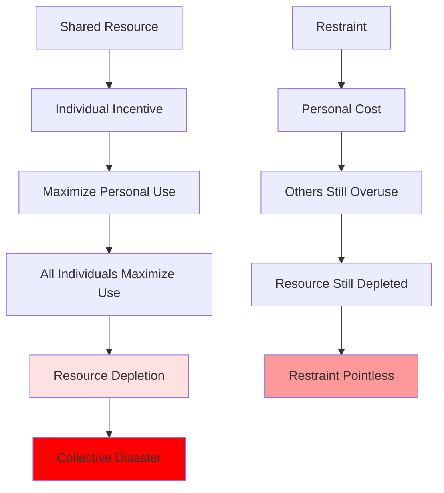

# Collective Action Problems: When Individual Rationality Produces Collective Irrationality

## Overview

Collective action problems occur when individual rational behavior produces collectively irrational outcomes. These are situations where everyone would benefit from cooperation, but individual incentives lead to defection, resulting in outcomes worse for all. This represents one of humanity's most fundamental challenges: the difficulty of coordinating for the common good.

**The paradox**: Intelligent, rational individuals pursuing their self-interest can produce disasters for everyone. Climate change, overfishing, traffic congestion, and arms races all exemplify this pattern. Understanding collective action problems is essential because many of humanity's greatest challenges—from environmental destruction to nuclear proliferation—are fundamentally coordination failures.

## Core Mechanisms

### The Prisoner's Dilemma

The classic game theory model:

| | Cooperate | Defect |
|---|---|---|
| **Cooperate** | Both get 3 | You get 0, other gets 5 |
| **Defect** | You get 5, other gets 0 | Both get 1 |

**Rational choice**: Defect (regardless of what other does)
**Collective outcome**: Both defect, both get 1 (worse than mutual cooperation's 3)

### The Tragedy of the Commons

Garrett Hardin's model of resource depletion:

**Diagram Explanation**: In commons situations, individuals face incentives to maximize personal use of shared resources. When all do so, the resource depletes, producing collective disaster. Individual restraint imposes personal costs while others continue overusing, so the resource depletes anyway, making restraint seem pointless. This creates a trap where rational individual behavior produces irrational collective outcomes.

## Types of Collective Action Problems

| Problem Type | Structure | Examples | Solution Difficulty |
|--------------|-----------|----------|---------------------|
| **Public Goods** | Benefits non-excludable, incentive to free-ride | National defense, clean air, knowledge | High |
| **Common Pool Resources** | Rival but non-excludable, incentive to overuse | Fisheries, forests, atmosphere | Very High |
| **Coordination Games** | Multiple equilibria, need to align | Traffic conventions, technology standards | Moderate |
| **Assurance Games** | Cooperation if others cooperate | Climate action, arms control | High |
| **Volunteer's Dilemma** | Someone must act, but who? | Calling emergency services, whistleblowing | Moderate |

## Historical Examples

### Easter Island Collapse

Classic tragedy of the commons:
- Deforestation for agriculture and statue transport
- Individual incentive to cut trees
- Collective result: ecological collapse, societal collapse
- Population crash from 15,000 to 2,000

### Arms Races

Collective action failure in security:
- Each nation increases arms for security
- Others respond, reducing relative security
- All spend more, none more secure
- Resources wasted, risk increased

### Overfishing

Global commons depletion:
- Individual incentive to maximize catch
- Collective result: fishery collapse
- 90% of large fish gone from oceans
- Livelihoods destroyed

## Contemporary Manifestations

### Climate Change

The ultimate collective action problem:

**Structure**:
- Benefits of emissions: immediate, local, private
- Costs of emissions: delayed, global, shared
- Individual restraint: costly, ineffective alone
- Collective action: necessary but difficult to coordinate

**Barriers**:
- Free-rider incentives
- Temporal discounting
- Diffused responsibility
- Coordination across nations
- Intergenerational conflict

### Antibiotic Resistance

Medical commons tragedy:
- Individual benefit from antibiotic use
- Collective cost: resistance development
- Rational individual use → collective crisis
- Superbugs threatening modern medicine

### Traffic Congestion

Daily coordination failure:
- Individual benefit from driving
- Collective cost: congestion
- Public transit requires coordination
- Rational individual choice → collective inefficiency

## Solutions and Their Limits

### Institutional Solutions

| Solution | Mechanism | Strengths | Weaknesses |
|----------|-----------|-----------|------------|
| **Regulation** | Rules enforced by authority | Can mandate cooperation | Requires enforcement, can be inefficient |
| **Property Rights** | Privatize commons | Aligns incentives | Not applicable to all resources |
| **Taxation** | Price externalities | Market-based | Political resistance, measurement challenges |
| **Subsidies** | Reward cooperation | Positive incentives | Costly, potential abuse |
| **Quotas** | Limit use | Direct control | Allocation challenges, enforcement |

### Social Solutions

- **Norms**: Social pressure for cooperation
- **Reputation**: Repeated interaction enables trust
- **Communication**: Coordination through discussion
- **Small Groups**: Easier monitoring and enforcement
- **Identity**: Group identity motivates cooperation

**Limitation**: Scale—solutions that work in small groups often fail at large scale.

## Interconnections

This problem connects to:

- **[Tragedy of Commons](../economics/tragedy-of-commons.md)**: Economic analysis
- **[Short-term Thinking](../economics/short-term-thinking.md)**: Temporal dimension
- **[Climate Psychology](../environment/climate-psychology.md)**: Environmental collective action
- **[Governance Failures](../politics/governance-failures.md)**: Political coordination
- **[Group Dynamics](./group-dynamics.md)**: Social coordination

## Related Topics

- [Tragedy of Commons](../economics/tragedy-of-commons.md)
- [Group Dynamics](./group-dynamics.md)
- [Governance Failures](../politics/governance-failures.md)

---

**Navigation**: [← Back to Sociology Index](./INDEX.md) | [Next: Social Identity →](./social-identity.md)
